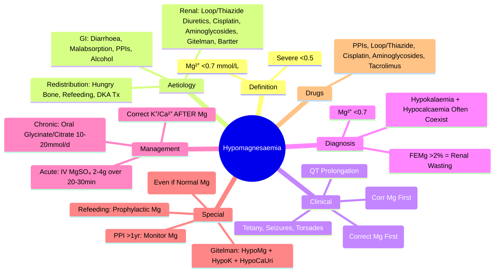

# Hypomagnesaemia

> [!info]
> **Hypomagnesaemia = Serum Mg²⁺ <0.7 mmol/L.** Commonly Overlooked Electrolyte Disorder. **Key Role in Refractory Hypokalaemia & Hypocalcaemia** (Mg²⁺ Required for Na⁺/K⁺-ATPase & PTH Secretion). **ECG: QT Prolongation, Torsades de Pointes Risk**.

---

## 1. Learning Objectives
By the end of this note you should be able to:
- [ ] Recognise causes of hypomagnesaemia (GI, renal, redistribution)
- [ ] Identify clinical features: refractory hypokalaemia/hypocalcaemia, QT prolongation, arrhythmias
- [ ] Apply IV magnesium repletion protocols (acute and chronic)
- [ ] Recognise drug-induced causes (diuretics, PPIs, aminoglycosides, cisplatin)

---

## 2. Aetiology

### GI Losses
| Cause | Mechanism |
|-------|-----------|
| **Diarrhoea** (Infectious, Inflammatory, Secretory) | Direct Mg²⁺ Loss |
| **Malabsorption** (Coeliac, Crohn's, Short Bowel, Bariatric) | Impaired Absorption |
| **Proton Pump Inhibitors** (Long-Term) | ↓ TRPM6/7 Channel Expression → ↓ Intestinal Absorption |
| **Alcoholism** | Poor Intake + GI Losses + Renal Wasting |
| **Malnutrition / Refeeding Syndrome** | Depleted Stores + Insulin-Mediated Shift |

### Renal Losses
| Cause | Mechanism |
|-------|-----------|
| **Loop Diuretics** (Furosemide, Bumetanide) | ↓ NKCC2 → ↓ Mg²⁺ Reabsorption in Thick Ascending Limb |
| **Thiazide Diuretics** | ↓ NCC → ↓ Mg²⁺ Reabsorption in DCT |
| **Cisplatin** | **Cisplatin Nephrotoxicity** → Tubular Mg²⁺ Wasting (Can Be Permanent) |
| **Aminoglycosides** (Gentamicin, Amikacin) | Tubular Toxicity |
| **Calcineurin Inhibitors** (Tacrolimus, Ciclosporin) | Tubular Mg²⁺ Wasting |
| **Gitelman Syndrome** | **NCCT Mutation** → Hypokalaemia, Metabolic Alkalosis, **Hypomagnesaemia**, Hypocalciuria |
| **Bartter Syndrome** | NKCC2/ROMK/CLCNKB Mutation → Similar to Loop Diuretic Effect |

### Redistribution
| Cause | Mechanism |
|--------|-----------|
| **Hungry Bone Syndrome** (Post-PTX/Thyroidectomy) | Rapid Bone Mineralisation Sequesters Mg²⁺ |
| **Refeeding Syndrome** | Insulin Surge → Intracellular Shift of Mg²⁺/K⁺/PO₄ |
| **DKA Treatment** | Insulin → Mg²⁺ Shift Into Cells |
| **Acute Pancreatitis** | Saponification + Third Space Losses |

---

## 2. Clinical Features

| System | Features |
|--------|----------|
| **Neuromuscular** | Tremor, Tetany, Seizures, Ataxia, Weakness, Fatigue |
| **Cardiac** | **QT Prolongation**, **Torsades de Pointes**, VF, Arrhythmias (Especially with Digoxin) |
| **Electrolyte** | **Refractory Hypokalaemia** (Mg²⁺ Needed for Na⁺/K⁺-ATPase & ROMK), **Refractory Hypocalcaemia** (Impaired PTH Secretion & End-Organ Resistance) |
| **Psychiatric** | Confusion, Delirium, Depression, Psychosis |
| **Obstetric** | Pre-eclampsia/Eclampsia (MgSO₄ Used for Treatment) |

---

## 2. ECG Changes

| Finding | Significance |
|---------|--------------|
| **QT Prolongation** | **Hallmark** (Due to Prolonged Ventricular Repolarisation) |
| **Torsades de Pointes** | Life-Threatening Polymorphic VT (R-on-T Phenomenon) |
| **ST Depression** | Non-Specific |
| **Widened QRS** | Severe Deficiency |

---

## 2. Diagnosis

| Test | Normal | Hypomagnesaemia |
|------|--------|-----------------|
| **Serum Mg²⁺** | 0.7-1.1 mmol/L | **<0.7 mmol/L** (Severe <0.5) |
| **24h Urine Mg²⁺** | 3-5 mmol/day | <1-2 mmol/day (If Renal Conservation Intact) |
| **Fractional Excretion of Mg²⁺ (FEMg)** | <2% | **>2%** (Indicates Renal Wasting) |
| **Serum K⁺** | Normal | Often Low (Refractory Hypokalaemia) |
| **Serum Ca²⁺** | Normal | Often Low (Impaired PTH) |

> **FEMg = (Urine Mg × Serum Creatinine) / (Serum Mg × Urine Creatinine) × 100%**

---

## 2. Differential Diagnosis

| Condition | Mg²⁺ | K⁺ | Ca²⁺ | Key Feature |
|-----------|------|------|------|-------------|
| **Hypomagnesaemia** | Low | Low (Refractory) | Low (Refractory) | **Correct Mg First** |
| **Hypokalaemia Only** | Normal | Low | Normal | Mg Normal |
| **Gitelman Syndrome** | Low | Low | Normal/High | Hypocalciuria, NCCT Mutation |
| **Bartter Syndrome** | Low/Normal | Low | Normal | Hypercalciuria, NKCC2/ROMK Mutation |
| **Diuretic Effect** | Low | Low | Normal | Loop/Thiazide History |

---

## 3. Management

### Acute / Severe Hypomagnesaemia (Mg²⁺ <0.5 or Symptomatic: Tetany, Seizures, Torsades)
| Step | Action |
|------|--------|
| **1. IV MgSO₄ 50%** | **2-4g (8-16 mmol) over 20-30 min** (IV Infusion, Cardiac Monitor) |
| **2. Follow-Up Infusion** | **1g/h (4 mmol/h)** Continuous until Mg²⁺ >0.7 |
| **2. Monitor** | **Continuous ECG**; Serum Mg²⁺ q4-6h; Serum K⁺/Ca²⁺ q4-6h |
| **3. Correct K⁺/Ca²⁺ Simultaneously** | IV KCl + IV Ca Gluconate (Mg Enables Correction) |

### Chronic / Mild Hypomagnesaemia (Mg²⁺ 0.5-0.7, Asymptomatic)
| Route | Dose | Duration |
|-------|------|----------|
| **Oral Mg²⁺** | **10-20 mmol/day** (Divided Doses) | 4-8 Weeks to Replete Stores |
| **Preparations** | Mg Glycinate, Mg Citrate, Mg Aspartate (Better Bioavailability) | Avoid Mg Oxide (Poor Absorption) |
| **Dietary** | Green Leafy Vegetables, Nuts, Seeds, Whole Grains, Legumes | |

### Maintenance (If Ongoing Losses)
| Scenario | Dose |
|--------|------|
| **Loop/Thiazide Diuretics** | Oral Mg 10-20 mmol/day (Prophylactic) |
| **Cisplatin / Aminoglycosides** | IV MgSO₄ 1-2g Pre/Post Chemo Cycle |
| **PPI Long-Term** | Consider H2 Blocker Alternative; Oral Mg Supplement |

---

## 3. Mg²⁺ & Refractory Electrolyte Disturbances

| Disorder | Why Mg²⁺ Required | Clinical Consequence |
|----------|-------------------|---------------------|
| **Refractory Hypokalaemia** | Mg²⁺ Required for Na⁺/K⁺-ATPase & ROMK Channel | K⁺ Will Not Normalise Until Mg²⁺ Repleted |
| **Refractory Hypocalcaemia** | Mg²⁺ Required for PTH Secretion & End-Organ Response | Ca²⁺ Will Not Normalise Until Mg²⁺ Repleted |
| **Digoxin Toxicity** | Hypomagnesaemia ↑ Digoxin Binding → Toxicity | **Stop Digoxin, Correct Mg²⁺, Correct K⁺** |
| **Torsades de Pointes** | QT Prolongation from Hypomagnesaemia | **IV MgSO₄ 2g Bolus** (Even if Mg²⁺ Normal) |

---

## 3. Drug-Induced Hypomagnesaemia

| Drug | Mechanism | Monitoring |
|------|-----------|------------|
| **PPIs** (Omeprazole, Esomeprazole, Long-Term) | ↓ TRPM6/7 → ↓ Intestinal Absorption | Mg²⁺ q6-12mo if >1yr Use |
| **Loop Diuretics** | ↓ NKCC2 → ↓ Thick Ascending Limb Reabsorption | Mg²⁺ q3-6mo |
| **Thiazides** | ↓ NCC → ↓ DCT Reabsorption | Mg²⁺ q3-6mo |
| **Cisplatin** | Tubular Toxicity (Can Be Permanent) | Pre/Post Cycle Mg²⁺; Supplement |
| **Aminoglycosides** | Tubular Toxicity | Mg²⁺ During Course |
| **Calcineurin Inhibitors** | Tacrolimus/Ciclosporin → Renal Mg²⁺ Wasting | Mg²⁺ q1-3mo |

---

## 3. Refeeding Syndrome

| Feature | Mg²⁺ Management |
|-------|----------------|
| **At Risk** | BMI <16, Weight Loss >15%, Nil by Mouth >10d, Alcoholism |
| **Mechanism** | Insulin Surge → K⁺/Mg²⁺/PO₄ Shift Into Cells |
| **Prophylaxis** | **IV MgSO₄ 2-4g over 24h** (Or Oral 10-20mmol/d) |
| **Monitoring** | Mg²⁺, K⁺, PO₄ q6h × 72h |

---

## 3. Exam Pearls (FCPS/MRCP)

| Topic | Key Point |
|-------|-----------|
| **Hypomagnesaemia Definition** | **Mg²⁺ <0.7 mmol/L** (Severe <0.5) |
| **Key Role** | **Correct Mg FIRST** for Refractory Hypokalaemia / Hypocalcaemia |
| **ECG Hallmark** | **QT Prolongation → Torsades de Pointes** |
| **Refractory Hypokalaemia** | **Always Check Mg²⁺** (Correct Mg First) |
| **Refractory Hypocalcaemia** | **Check Mg²⁺** (Impairs PTH Secretion & Action) |
| **IV MgSO₄ 50%** | **1mL = 2 mmol Mg²⁺** (1g = 4 mmol); 2-4g over 20-30 min (Acute) |
| **Oral Mg** | Glycinate/Citrate/Aspartate (Better Bioavailability); Avoid Oxide |
| **PPI-Induced** | Long-Term PPI → ↓ TRPM6/7 → Hypomagnesaemia |
| **Gitelman Syndrome** | Hypokalaemia + **Hypomagnesaemia** + Hypocalciuria + Metabolic Alkalosis |
| **Bartter Syndrome** | Hypokalaemia + Hypomagnesaemia + Hypercalciuria + Metabolic Alkalosis |
| **Cisplatin** | Renal Mg²⁺ Wasting (Can Be Permanent) → Prophylactic Mg²⁺ |
| **PPI Hypomagnesaemia** | FDA Warning: Long-Term PPI → Monitor Mg if >1 Year |
| **Torsades Treatment** | **IV MgSO₄ 2g Bolus** (Even if Mg²⁺ Normal) |
| **Digoxin + Mg²⁺** | Hypomagnesaemia ↑ Digoxin Binding → **Stop Digoxin, Correct Mg/K** |

---

## 8. Confusions & Mnemonics

| Confusion | Clarification |
|-----------|---------------|
| **Mg²⁺ First** | **Correct Mg FIRST** for Refractory K⁺/Ca²⁺ (Mg Needed for Na⁺/K⁺-ATPase & PTH) |
| **Mg²⁺ & K⁺** | Hypomagnesaemia → Renal K⁺ Wasting (ROMK Dysfunction) |
| **Mg²⁺ & Ca²⁺** | Mg²⁺ Needed for PTH Secretion & End-Organ Response |
| **MgSO₄ 50%** | 1mL = 2 mmol; 1g = 4 mmol; 2g = 8 mmol |
| **Oral Mg Bioavailability** | Glycinate/Citrate/Aspartate > Chloride > Oxide (Poor Absorption) |
| **PPI Hypomagnesaemia** | FDA: Monitor Mg if PPI >1 Year Continuous Use |
| **Gitelman vs Bartter** | Gitelman: Hypocalciuria + Hypomagnesaemia; Bartter: Hypercalciuria |
| **Torsades Mg²⁺** | IV MgSO₄ 2g Bolus (Even if Mg²⁺ Normal) |
| **Digoxin + Mg²⁺** | Stop Digoxin + Correct Mg/K (Hypomagnesaemia ↑ Digoxin Toxicity) |

---

## 9. Mind Map

---

## 9. Exam Pearls (FCPS/MRCP)

| Topic | Key Point |
|-------|-----------|
| **Hypomagnesaemia Definition** | **Mg²⁺ <0.7 mmol/L** |
| **Correct Mg First** | **Correct Mg First** for Refractory Hypokalaemia/Hypocalcaemia |
| **ECG Hallmark** | **QT Prolongation → Torsades de Pointes** |
| **Refractory Hypokalaemia** | **Always Check Mg²⁺** (Correct Mg First) |
| **IV MgSO₄ Acute** | **2-4g over 20-30 min** (Cardiac Monitor) |
| **Oral Mg** | Glycinate/Citrate/Aspartate (Bioavailability); Avoid Oxide |
| **PPI Hypomagnesaemia** | FDA Warning: Long-Term PPI → Monitor Mg²⁺ if >1 Year |
| **Gitelman Syndrome** | Hypokalaemia + **Hypomagnesaemia** + Hypocalciuria + Metabolic Alkalosis |
| **Bartter Syndrome** | Hypokalaemia + Hypomagnesaemia + **Hypercalciuria** + Metabolic Alkalosis |
| **Cisplatin** | Renal Mg²⁺ Wasting (Can Be Permanent) → Prophylactic Mg²⁺ |
| **Torsades Treatment** | **IV MgSO₄ 2g Bolus** (Even if Mg²⁺ Normal) |
| **Digoxin + Mg²⁺** | Stop Digoxin + Correct Mg/K (Hypomagnesaemia ↑ Digoxin Toxicity) |
| **FEMg** | >2% = Renal Mg²⁺ Wasting |
| **PPI Hypomagnesaemia** | FDA: Monitor Mg if PPI >1 Year |

---

---

## One-Page Revision Summary
- Hypomagnesaemia: Key definitions, diagnostic criteria, and management algorithm
- Critical lab cut-offs and severity thresholds
- Stepwise management algorithm
- Key complications and monitoring parameters

---

## 24-Hour Recall Prompts
- Explain Hypomagnesaemia in 2 minutes without looking at the note
- Write the core diagnostic algorithm from memory
- State first-line management and one important contraindication/caution
- Compare Hypomagnesaemia with one close differential diagnosis

---

## 7-Day / 15-Day / 30-Day Revision Tracker
- [ ] Day 1 completed
- [ ] 24-hour recall completed
- [ ] Day 7 revision completed
- [ ] Day 15 revision completed
- [ ] Day 30 revision completed

---

## Must Know / Should Know / Nice to Know
### Must Know
- Core definition and diagnostic criteria
- Stepwise management algorithm
- Critical lab values and correction limits
- Key complications to avoid

### Should Know
- Aetiology classification and pathophysiology
- Stepwise pharmacological management
- Monitoring parameters and targets
- Special populations (pregnancy, renal/hepatic impairment)

### Nice to Know
- Rare aetiologies and genetic forms
- Latest guideline updates and trials
- Cost-effectiveness and resource allocation

---

## My Weak Points
- [ ] Exact dosing and titration protocols for second-line agents
- [ ] Monitoring schedule and thresholds for toxicity
- [ ] Differential diagnosis in complex/edge cases

---

## Self-Test Scorecard
- Understanding: /10
- Recall: /10
- MCQ Performance: /10
- SBA Performance: /10
- Viva Confidence: /10
- Total: /50

> [!tip]
> Interpretation: <35 = weak topic, 35-44 = acceptable but insecure, 45+ = strong exam-ready topic.

---

## Exam Answer Modes
### Long Answer Skeleton
1. Definition, classification, and pathophysiology
2. Diagnostic criteria and algorithm
3. Management: stepwise approach with doses
4. Complications, monitoring, and special situations

### Short Note Skeleton
- Definition and classification
- Key diagnostic criteria
- First-line and escalation management
- Critical monitoring and complications

### Viva One-Liners
- Hypomagnesaemia definition and key threshold
- Diagnostic algorithm in 3 steps
- First-line management and escalation
- Critical monitoring parameter
- One complication to never miss

### Ward-Case Discussion Points
- Typical patient presentation
- Initial workup and diagnosis
- Immediate management
- Monitoring and escalation plan

### Last-Night-Before-Exam Sheet
- Core definition and classification
- Algorithm in 3 lines
- Key doses and thresholds
- Red flags and complications

---

## Summary
Hypomagnesaemia: Core definitions, stepwise diagnosis, algorithmic management, critical thresholds, monitoring, red flags.

---

## MCQs (10)
1. **Hypomagnesaemia definition:**
   A. Mg<0.5
   B. Mg<0.7
   C. Mg<0.8
   D. Mg<0.6
   *Answer: B*

2. **Refractory hypokalaemia cause:**
   A. Na loss
   B. Mg deficiency
   C. Ca deficiency
   D. Phos loss
   *Answer: B*

3. **Mg replacement IV acute:**
   A. 1g MgSO4 over 1h
   B. 2-4g MgSO4 over 1h
   C. 8g over 24h
   D. 1g over 30min
   *Answer: B*

4. **Mg replacement IV chronic:**
   A. 1-2g/day
   B. 2-4g/day
   C. 4-8g/day
   D. 10g/day
   *Answer: B*

5. **Hypomagnesaemia ECG:**
   A. Short QT
   B. QT prolongation
   C. Peaked T
   D. QRS widening
   *Answer: B*

6. **Refractory hypocalcaemia cause:**
   A. Na loss
   B. Mg deficiency
   C. Ca deficiency
   D. Phos loss
   *Answer: B*

7. **Mg deficiency causes:**
   A. Diarrhoea
   B. Loop diuretics
   C. PPIs
   D. All
   *Answer: D*

8. **Mg repletion PO:**
   A. 12mmol/d
   B. 24mmol/d
   C. 48mmol/d
   D. 96mmol/d
   *Answer: B*

9. **Mg with digoxin:**
   A. Safe
   B. Increases toxicity
   C. Decreases effect
   D. No interaction
   *Answer: B*

10. **Hypermagnesaemia cause:**
   A. Diarrhoea
   B. Renal failure
   C. Diuretics
   D. Alcoholism
   *Answer: B*

---

## SBA Questions (5)
1. **Clinical scenario-based question on Hypomagnesaemia:** What is the most appropriate next step in management?
   A. Option A
   B. Option B
   C. Option C
   D. Option D
   *Answer: A*

2. **Diagnostic challenge in Hypomagnesaemia:** Which test/investigation is most appropriate?
   A. Option A
   B. Option B
   C. Option C
   D. Option D
   *Answer: A*

3. **Management decision in Hypomagnesaemia:** When would you consider escalation?
   A. Option A
   B. Option B
   C. Option C
   D. Option D
   *Answer: A*

4. **Complication recognition in Hypomagnesaemia:** What is the most likely complication?
   A. Option A
   B. Option B
   C. Option C
   D. Option D
   *Answer: A*

5. **Monitoring question for Hypomagnesaemia:** Which parameter requires most frequent monitoring?
   A. Option A
   B. Option B
   C. Option C
   D. Option D
   *Answer: A*

---

## Flashcards
- Q: Hypomagnesaemia definition:
  A: Mg<0.7
- Q: Refractory hypokalaemia cause:
  A: Mg deficiency
- Q: Mg replacement IV acute:
  A: 2-4g MgSO4 over 1h
- Q: Mg replacement IV chronic:
  A: 2-4g/day
- Q: Hypomagnesaemia ECG:
  A: QT prolongation

---

## Answer Key with Explanations
### MCQs
B, B, B, B, B, B, D, B, B, B

### SBAs
1-A, 2-A, 3-A, 4-A, 5-A

## PasTest Scenario SBAs (Clinical Vignettes)

> **Auto-generated PasTest/Mediscope-style scenario SBAs** grounded in the authored source content. Each scenario is a clinical vignette with 4 options. **Source: Ch 19: Clinical Biochemistry / Hypomagnesaemia**

**Q1.** A patient is being evaluated for Hypomagnesaemia. Based on standard diagnostic approach, what is the most appropriate first-line investigation?

  - **A.** Approach described in standard diagnostic workup
  - **B.** An advanced/invasive test as first-line
  - **C.** Empirical treatment without investigation
  - **D.** Watchful waiting without further testing

  > **Answer: A** — Approach described in standard diagnostic workup

