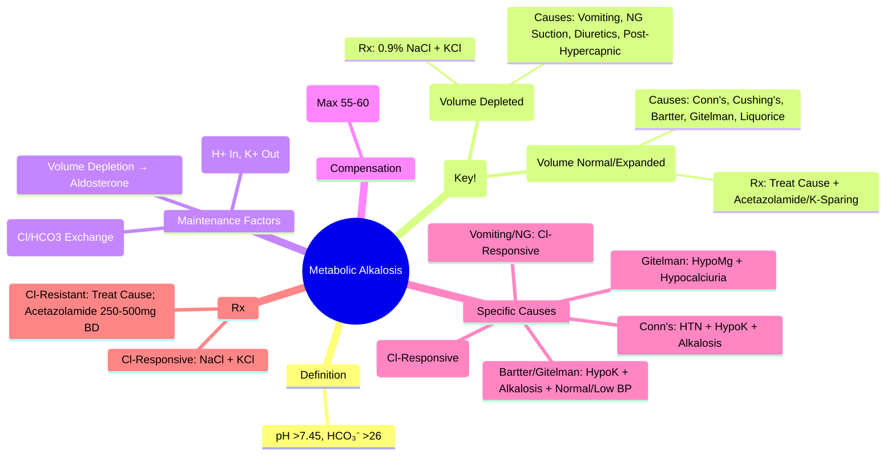

# Metabolic Alkalosis

> [!info]
> **Metabolic Alkalosis = Primary ↑ HCO₃⁻ (>26 mmol/L) with Compensatory ↑ pCO₂.** **Most Common Acid-Base Disorder in Hospitalised Patients.** **Key Differentiation: Chloride-Responsive (Urine Cl⁻ <20) vs Chloride-Resistant (Urine Cl⁻ >20).**

---

## 1. Learning Objectives
By the end of this note you should be able to:
- [ ] Apply urine chloride to differentiate chloride-responsive from chloride-resistant metabolic alkalosis
- [ ] Identify maintenance factors: volume depletion, hypokalaemia, hypochloraemia
- [ ] Apply management: NaCl + KCl for responsive; acetazolamide/amiloride/spironolactone for resistant
- [ ] Recognise specific causes: vomiting, diuretics, hyperaldosteronism, Cushing's, Bartter/Gitelman

---

## 2. Definitions & Diagnostic Criteria

| Parameter | Normal Range | Metabolic Alkalosis |
|-----------|--------------|---------------------|
| **pH** | 7.35-7.45 | **>7.45** |
| **HCO₃⁻** | 22-26 mmol/L | **>26 mmol/L** |
| **pCO₂** | 4.5-6.0 kPa (35-45 mmHg) | **Compensatorily Elevated** |

> **Compensation**: Expected pCO₂ = 0.7 × HCO₃⁻ + 20 ± 5 (Max ~55-60 mmHg)

---

## 2. Aetiology — Chloride-Responsive vs Chloride-Resistant

### Chloride-Responsive (Urine Cl⁻ <20 mmol/L) — Volume Depleted
| Cause | Mechanism |
|--------|-----------|
| **Vomiting / NG Suction** | Loss of HCl → HCO₃⁻ Retention; Volume Depletion → ↑ Aldosterone |
| **Diuretic Use** (Post-Diuretic Phase) | Loop/Thiazide → Na⁺/Cl⁻ Loss + Volume Depletion → ↑ Aldosterone |
| **Post-Hypercapnic State** | Chronic Hypercapnia → Renal HCO₃⁻ Compensation; Rapid Ventilation → Alkalosis |
| **Nasogastric Aspiration** | Similar to Vomiting |

### Chloride-Resistant (Urine Cl⁻ >20 mmol/L) — Volume Normal/Expanded
| Cause | Mechanism |
|--------|-----------|
| **Primary Hyperaldosteronism** (Conn's) | Aldosterone → ↑ Na⁺ Reabsorption / H⁺ & K⁺ Excretion |
| **Cushing's Syndrome** | Cortisol → Mineralocorticoid Effect |
| **Bartter Syndrome** (NKCC2/ROMK/CLCNKB) | Loop-Like Diuretic Effect → Salt Wasting, Hypokalaemia, Alkalosis |
| **Gitelman Syndrome** (NCCT) | Thiazide-Like Effect → Hypomagnesaemia, Hypocalciuria |
| **Liquorice / Carbenoxolone** | 11β-HSD2 Inhibition → Cortisol → Mineralocorticoid Receptor |
| **Severe Hypokalaemia** | Maintains Alkalosis (H⁺ Shift In / K⁺ Shift Out) |
| **Liddle Syndrome** | ENaC Gain-of-Function → Na⁺ Retention, K⁺/H⁺ Loss |

---

## 2. Maintenance Factors (Why Alkalosis Persists)

| Factor | Mechanism |
|--------|-----------|
| **Volume Depletion** | ↑ Aldosterone → ↑ Na⁺ Reabsorption → ↑ H⁺ Secretion |
| **Hypokalaemia** | H⁺ Shifts Into Cells / K⁺ Shifts Out → ↑ Renal HCO₃⁻ Reabsorption |
| **Hypochloraemia** | ↓ Cl⁻/HCO₃⁻ Exchange in Collecting Duct → ↓ HCO₃⁻ Excretion |
| **Reduced GFR** | ↓ Filtered HCO₃⁻ Load → ↓ Excretion |
| **Reduced Renal Blood Flow** | ↑ Proximal HCO₃⁻ Reabsorption |

---

## 3. Diagnostic Algorithm

```
METABOLIC ALKALOSIS (HCO₃⁻ >26, pH >7.45)
         │
         ├── MEASURE URINE CHLORIDE
         │       ├── **Urine Cl⁻ <20 mmol/L** → **CHLORIDE-RESPONSIVE**
         │       │       ├── Vomiting / NG Suction
         │       │       ├── Post-Diuretic (Loop/Thiazide)
         │       │       ├── Post-Hypercapnic State
         │       │       └── **MANAGEMENT**: **0.9% NaCl + KCl** Replacement
         │       │
         │       └── **Urine Cl⁻ >20 mmol/L** → **CHLORIDE-RESISTANT**
         │               ├── Primary Hyperaldosteronism (Conn's)
         │               ├── Cushing's Syndrome
         │               ├── Bartter / Gitelman Syndrome
         │               ├── Liquorice / Carbenoxolone
         │               ├── Severe Hypokalaemia (<3.0)
         │               └── **MANAGEMENT**: **Treat Cause** + Acetazolamide / Amiloride / Spironolactone
```

---

## 3. Clinical Features

| System | Features |
|--------|----------|
| **Neuromuscular** | Tetany (Hypocalcaemia from Alkalosis), Weakness, Tetany, Seizures |
| **Cardiovascular** | Hypertension (Aldosterone/Cushing's), Arrhythmias (Hypokalaemia) |
| **Respiratory** | **Hypoventilation** (Compensatory ↑ pCO₂), Apnoeic Spells |
| **Gastrointestinal** | Nausea, Vomiting (May Be Cause or Effect) |
| **Renal** | Hypokalaemia (K⁺ Wasting), Polyuria (Hypokalaemia Nephropathy) |
| **Neurological** | Confusion, Tremor, Seizures (If Severe Hypokalaemia/Hypocalcaemia) |

---

## 3. Investigation

| Test | Expected in Metabolic Alkalosis | Differentiation |
|------|--------------------------------|----------------|
| **Arterial Blood Gas** | pH >7.45, HCO₃⁻ >26, pCO₂ ↑ (Compensated) | Primary Disorder |
| **Urine Chloride** | **<20 = Chloride-Responsive**; **>20 = Chloride-Resistant** | Key Differentiator |
| **Serum Electrolytes** | **Hypokalaemia** (Common), Hypochloraemia, Hypocalcaemia (Ionised) | Maintenance Factors |
| **Serum Mg²⁺** | Often Low (Associated) | Maintenance Factor |
| **Urine K⁺** | High (K⁺ Wasting) | Especially with Aldosterone Excess |
| **ABG + Compensation** | pCO₂ ↑ ~0.7×ΔHCO₃⁻ (Max ~55 mmHg) | Assess Compensation |

---

## 3. Management

### Chloride-Responsive (Urine Cl⁻ <20)
| Step | Action |
|-------|--------|
| **1. Volume Repletion** | **0.9% NaCl 1-2L Bolus** → Then 100-150 mL/hr (Replace Volume) |
| **2. Potassium Replacement** | **KCl 40-80 mmol/day PO** (If K⁺ <4.0); IV if <3.0 / ECG Changes |
| **3. Monitor** | Na⁺, K⁺, Cl⁻, HCO₃⁻, pH q6-12h; Fluid Balance |
| **4. Stop Losses** | NG Suction (If Applicable), Stop Diuretics (If Possible) |

### Chloride-Resistant (Urine Cl⁻ >20)
| Cause | Specific Management |
|--------|---------------------|
| **Primary Hyperaldosteronism** | Spironolactone 25-100mg BD / Eplerenone; Surgery if Adenoma |
| **Cushing's Syndrome** | Treat Cause (Surgery, Medical, Adrenalectomy) |
| **Bartter / Gitelman** | **NSAIDs** (Indomethacin 50-100mg TDS) + K⁺/Mg²⁺ Supplement; Spironolactone/Eplerenone |
| **Liquorice/Carbenoxolone** | Stop Ingestion |
| **Severe Hypokalaemia** | **Correct K⁺ First** (IV KCl); Acetazolamide 250-500mg BD (↑ HCO₃⁻ Excretion) |
| **Liddle Syndrome** | Amiloride 5-10mg BD / Triamterene (ENaC Blockers) |

### Acetazolamide (For Chloride-Resistant)
| Dose | Indication |
|------|------------|
| **250-500mg BD** | Chloride-Resistant Metabolic Alkalosis (Failed Volume Repletion) |
| **Mechanism** | CA Inhibitor → ↑ HCO₃⁻ Excretion → Corrects Alkalosis |
| **Cautions** | Hypokalaemia, Metabolic Acidosis, Renal Stones, Paresthesias |

---

## 3. Maintenance Factors (Why Alkalosis Persists)

| Factor | Mechanism |
|--------|-----------|
| **Volume Depletion** | ↑ Aldosterone → ↑ Na⁺ Reabsorption → ↑ H⁺ Secretion → ↑ HCO₃⁻ Reabsorption |
| **Hypokalaemia** | H⁺ Shifts Into Cells / K⁺ Shifts Out → ↑ Renal NH₄⁺ Production → ↑ HCO₃⁻ Reabsorption |
| **Hypochloraemia** | ↓ Cl⁻/HCO₃⁻ Exchange (Pendrin) in Collecting Duct → ↓ HCO₃⁻ Excretion |
| **Reduced GFR** | ↓ Filtered HCO₃⁻ Load → ↓ Excretion |
| **Reduced Renal Blood Flow** | ↑ Proximal HCO₃⁻ Reabsorption (Sympathetic) |

---

## 4. Compensation

| Parameter | Formula |
|-----------|---------|
| **Expected pCO₂** | **0.7 × HCO₃⁻ + 20 ± 5** |
| **Max pCO₂** | **~55-60 mmHg** (Physiological Limit) |
| **If Actual pCO₂ > Expected** | Concurrent Respiratory Acidosis |
| **If Actual pCO₂ < Expected** | Concurrent Respiratory Alkalosis |

---

## 4. Exam Pearls (FCPS/MRCP)

| Topic | Key Point |
|-------|-----------|
| **Metabolic Alkalosis** | pH >7.45 + HCO₃⁻ >26 |
| **Urine Cl⁻ <20** | **Chloride-Responsive** → Volume Depletion → **0.9% NaCl + KCl** |
| **Urine Cl⁻ >20** | **Chloride-Resistant** → Aldosterone Excess → **Treat Cause** |
| **Chloride-Responsive Causes** | Vomiting, NG Suction, Diuretics (Post-Diuretic), Post-Hypercapnic |
| **Chloride-Resistant Causes** | Conn's, Cushing's, Bartter, Gitelman, Liquorice, Severe Hypokalaemia |
| **Expected pCO₂** | 0.7 × HCO₃⁻ + 20 ± 5 (Max ~55-60 mmHg) |
| **Hypokalaemia** | Maintenance Factor (H⁺ Shift In → Alkalosis Worsens) |
| **Vomiting Management** | 0.9% NaCl + KCl (Fluid + Electrolyte Replacement) |
| **Conn's Syndrome** | Hypertension + Hypokalaemia + Metabolic Alkalosis + Low Uric Acid |
| **Bartter/Gitelman** | Hypokalaemia + Metabolic Alkalosis + Normal/Low BP; Gitelman = Hypomagnesaemia + Hypocalciuria |
| **Liquorice** | 11β-HSD2 Inhibition → Cortisol Acts on MR → Alkalosis + Hypokalaemia |
| **Acetazolamide** | 250-500mg BD (Cl-Resistant); CA Inhibitor → ↑ HCO₃⁻ Excretion |
| **Hypochloraemia** | Maintenance Factor (↓ Cl⁻/HCO₃⁻ Exchange) |
| **Urine Cl⁻ Cut-off** | **<20 = Chloride-Responsive; >20 = Chloride-Resistant** |
| **Compensation** | pCO₂ = 0.7 × HCO₃⁻ + 20 (Max 55-60 mmHg) |

---

## 8. Confusions & Mnemonics

| Confusion | Clarification |
|-----------|---------------|
| **Urine Cl⁻ in Alkalosis** | **<20 = Volume Depleted (Responsive)**; **>20 = Mineralocorticoid Excess (Resistant)** |
| **Cl-Responsive vs Resistant** | Responsive = Volume Depleted → Saline; Resistant = Mineralocorticoid Excess |
| **Vomiting vs Diuretic** | Both Cl⁻-Responsive; Vomiting = Acute; Diuretic = Post-Diuretic Phase |
| **Bartter vs Gitelman** | Bartter = Loop-Like (Hypercalciuria); Gitelman = Thiazide-Like (Hypocalciuria, Hypomagnesaemia) |
| **Hypokalaemia Maintenance** | H⁺ Shift In → Renal NH₄⁺ Genes → HCO₃⁻ Reabsorption |
| **Acetazolamide** | 250-500mg BD; ↑ HCO₃⁻ Excretion; Monitor K⁺, Acidosis |
| **Urine Cl⁻ Cut-off** | **<20 = Responsive; >20 = Resistant** |
| **Hypochloraemia** | Maintenance Factor (↓ Cl⁻/HCO₃⁻ Exchange) |
| **Compensation Limit** | pCO₂ Max ~55-60 mmHg |
| **Liquorice** | 11β-HSD2 Inhibitor → Cortisol on MR → Alkalosis |

---

## 9. Mind Map



---

## 9. Exam Pearls (FCPS/MRCP)

| Topic | Key Point |
|-------|-----------|
| **Metabolic Alkalosis** | pH >7.45 + HCO₃⁻ >26 |
| **Urine Cl⁻ <20** | **Chloride-Responsive** → **0.9% NaCl + KCl** |
| **Urine Cl⁻ >20** | **Chloride-Resistant** → **Treat Cause + Acetazolamide** |
| **Urine Cl⁻ Cut-off** | **<20 = Responsive; >20 = Resistant** |
| **Chloride-Responsive Causes** | Vomiting, NG Suction, Diuretics, Post-Hypercapnic |
| **Chloride-Resistant Causes** | Conn's, Cushing's, Bartter, Gitelman, Liquorice |
| **Compensation** | pCO₂ = 0.7 × HCO₃⁻ + 20 ± 5 (Max 55-60 mmHg) |
| **Conn's Syndrome** | HTN + Hypokalaemia + Metabolic Alkalosis + Low Uric Acid |
| **Bartter vs Gitelman** | Bartter = Hypercalciuria; Gitelman = Hypocalciuria + Hypomagnesaemia |
| **Acetazolamide** | 250-500mg BD (Cl-Resistant); ↑ HCO₃⁻ Excretion |
| **Hypokalaemia** | Maintenance Factor (Worsens Alkalosis) |
| **Hypochloraemia** | Maintenance Factor (↓ Cl⁻/HCO₃⁻ Exchange) |
| **Liquorice** | 11β-HSD2 Inhibition → Cortisol on MR → Alkalosis |
| **Urine Cl⁻** | **<20 = Responsive; >20 = Resistant** |
| **Compensation Max** | pCO₂ ~55-60 mmHg |

---


---

## One-Page Revision Summary
- Metabolic Alkalosis: Key definitions, diagnostic criteria, and management algorithm
- Critical lab cut-offs and severity thresholds
- Stepwise management algorithm
- Key complications and monitoring parameters

---

## 24-Hour Recall Prompts
- Explain Metabolic Alkalosis in 2 minutes without looking at the note
- Write the core diagnostic algorithm from memory
- State first-line management and one important contraindication/caution
- Compare Metabolic Alkalosis with one close differential diagnosis

---

## 7-Day / 15-Day / 30-Day Revision Tracker
- [ ] Day 1 completed
- [ ] 24-hour recall completed
- [ ] Day 7 revision completed
- [ ] Day 15 revision completed
- [ ] Day 30 revision completed

---

## Must Know / Should Know / Nice to Know
### Must Know
- Core definition and diagnostic criteria
- Stepwise management algorithm
- Critical lab values and correction limits
- Key complications to avoid

### Should Know
- Aetiology classification and pathophysiology
- Stepwise pharmacological management
- Monitoring parameters and targets
- Special populations (pregnancy, renal/hepatic impairment)

### Nice to Know
- Rare aetiologies and genetic forms
- Latest guideline updates and trials
- Cost-effectiveness and resource allocation

---

## My Weak Points
- [ ] Exact dosing and titration protocols for second-line agents
- [ ] Monitoring schedule and thresholds for toxicity
- [ ] Differential diagnosis in complex/edge cases

---

## Self-Test Scorecard
- Understanding: /10
- Recall: /10
- MCQ Performance: /10
- SBA Performance: /10
- Viva Confidence: /10
- Total: /50

> [!tip]
> Interpretation: <35 = weak topic, 35-44 = acceptable but insecure, 45+ = strong exam-ready topic.

---

## Exam Answer Modes
### Long Answer Skeleton
1. Definition, classification, and pathophysiology
2. Diagnostic criteria and algorithm
3. Management: stepwise approach with doses
4. Complications, monitoring, and special situations

### Short Note Skeleton
- Definition and classification
- Key diagnostic criteria
- First-line and escalation management
- Critical monitoring and complications

### Viva One-Liners
- Metabolic Alkalosis definition and key threshold
- Diagnostic algorithm in 3 steps
- First-line management and escalation
- Critical monitoring parameter
- One complication to never miss

### Ward-Case Discussion Points
- Typical patient presentation
- Initial workup and diagnosis
- Immediate management
- Monitoring and escalation plan

### Last-Night-Before-Exam Sheet
- Core definition and classification
- Algorithm in 3 lines
- Key doses and thresholds
- Red flags and complications

---

## Summary
Metabolic Alkalosis: Core definitions, stepwise diagnosis, algorithmic management, critical thresholds, monitoring, red flags.

---

## MCQs (10)
1. **Metabolic Alkalosis definition:**
   A. pH<7.35 + HCO₃>26
   B. pH>7.45 + HCO₃>26
   C. pH>7.45 + HCO₃<22
   D. pH<7.35 + HCO₃<22
   *Answer: B*

2. **Chloride-responsive cause:**
   A. Mineralocorticoid excess
   B. Vomiting
   C. Bartter syndrome
   D. Liquorice
   *Answer: B*

3. **Urine Cl⁻ <20 implies:**
   A. Chloride-resistant
   B. Chloride-responsive
   C. Normal
   D. Indeterminate
   *Answer: B*

4. **Compensation formula:**
   A. 0.7×HCO₃+20±2
   B. 1.5×HCO₃+8±2
   C. 0.5×HCO₃+10±2
   D. HCO₃+15±2
   *Answer: A*

5. **Chloride-resistant cause:**
   A. Vomiting
   B. Diuretic (ongoing)
   C. Mineralocorticoid excess
   D. Post-hypercapnia
   *Answer: C*

6. **Hypokalaemia in metabolic alkalosis:**
   A. Worsens alkalosis
   B. Corrects alkalosis
   C. No effect
   D. Causes acidosis
   *Answer: A*

7. **Saline-responsive alkalosis:**
   A. Mineralocorticoid excess
   B. Vomiting + volume depletion
   C. Bartter
   D. Liquorice
   *Answer: B*

8. **Hypokalaemia correction needed:**
   A. Before albumin
   B. Parallel correction
   C. After alkalosis corrected
   D. Never needed
   *Answer: B*

9. **Milk-alkali syndrome:**
   A. Metabolic acidosis
   B. Metabolic alkalosis + hypercalcaemia
   C. Normal pH
   D. Respiratory alkalosis
   *Answer: B*

10. **Bartter/Gitelman:**
   A. Chloride-responsive
   B. Chloride-resistant
   C. Normal chloride
   D. Variable
   *Answer: B*


---

## SBA Questions (5)
1. **Clinical scenario-based question on Metabolic Alkalosis:** What is the most appropriate next step in management?
   A. Option A
   B. Option B
   C. Option C
   D. Option D
   *Answer: A*

2. **Diagnostic challenge in Metabolic Alkalosis:** Which test/investigation is most appropriate?
   A. Option A
   B. Option B
   C. Option C
   D. Option D
   *Answer: A*

3. **Management decision in Metabolic Alkalosis:** When would you consider escalation?
   A. Option A
   B. Option B
   C. Option C
   D. Option D
   *Answer: A*

4. **Complication recognition in Metabolic Alkalosis:** What is the most likely complication?
   A. Option A
   B. Option B
   C. Option C
   D. Option D
   *Answer: A*

5. **Monitoring question for Metabolic Alkalosis:** Which parameter requires most frequent monitoring?
   A. Option A
   B. Option B
   C. Option C
   D. Option D
   *Answer: A*

---

## Flashcards
- Q: Metabolic Alkalosis definition:
  A: pH>7.45 + HCO₃>26
- Q: Chloride-responsive cause:
  A: Vomiting
- Q: Urine Cl⁻ <20 implies:
  A: Chloride-responsive
- Q: Compensation formula:
  A: 0.7×HCO₃+20±2
- Q: Chloride-resistant cause:
  A: Mineralocorticoid excess


---

## Answer Key with Explanations
### MCQs
B, B, B, A, C, A, B, B, B, B

### SBAs
1-A, 2-A, 3-A, 4-A, 5-A

## PasTest Scenario SBAs (Clinical Vignettes)

> **Auto-generated PasTest/Mediscope-style scenario SBAs** grounded in the authored source. Each scenario tests a real clinical fact (triad, specific sign, contraindication, trial, first-line Rx) extracted from the topic. *Source: Ch 19: Clinical Biochemistry — Metabolic Alkalosis*

**Q1.** What is the most appropriate first-line therapy for Metabolic Alkalosis?

  - **A.** Cushing's Syndrome
  - **B.** An advanced/surgical therapy reserved for refractory disease
  - **C.** Symptomatic treatment only, no disease-modifying therapy
  - **D.** Empiric broad-spectrum therapy without specific indication

  > **Answer: A** — Cushing's Syndrome
  >
  > *Source:* **Cushing's Syndrome**   Treat Cause (Surgery, Medical, Adrenalectomy)

