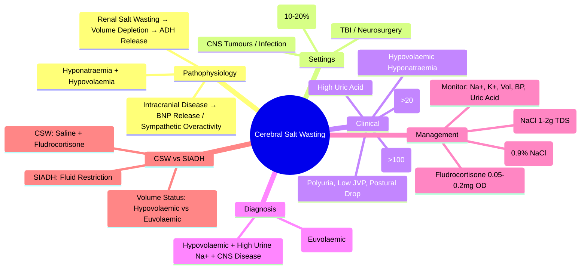

# Cerebral Salt Wasting (CSW)

> [!info]
> **Cerebral Salt Wasting (CSW) = Renal Salt Wasting** secondary to Intracranial Disease. **Hypovolaemic Hyponatraemia** with **High Urine Sodium**. **Key Differentiator from SIADH: Volume Status (Hypovolaemic)**. Management = **Saline Resuscitation + Fludrocortisone** (Opposite of SIADH).

---

## 1. Learning Objectives
By the end of this note you should be able to:
- [ ] Differentiate CSW from SIADH using volume status assessment
- [ ] Recognise CSW in the context of intracranial disease
- [ ] Apply saline resuscitation and fludrocortisone therapy
- [ ] Identify at-risk patient populations (neurosurgical, SAH, TBI)

---

## 2. Pathophysiology

| Mechanism | Description |
|----------|-------------|
| **Primary Event** | **Intracranial Disease** (SAH, TBI, Neurosurgery, Tumour, Infection) |
| **Proposed Mechanisms** | **1. Brain Natriuretic Peptide (BNP) Release** → ↓ Renal Na⁺ Reabsorption |
| | **2. Sympathetic Overactivity** → Renal Vasoconstriction → ↓ Renal Perfusion |
| | **3. Impaired Renal Sympathetic Regulation** → Loss of Sodium Conservation |
| **Result** | **Renal Salt Wasting** → Volume Depletion → 2nd ADH Release → Hyponatraemia |

---

## 2. Clinical Context & Risk Factors

| Risk Factor | Details |
|-------------|---------|
| **Subarachnoid Haemorrhage (SAH)** | **Most Common Setting** (Incidence 10-20% Post-SAH) |
| **Traumatic Brain Injury (TBI)** | Post-Neurosurgery, Severe TBI |
| **Neurosurgery** | Especially Pituitary/Tumour Resection |
| **Intracranial Tumours** | Pituitary, Craniopharyngioma, Metastases |
| **CNS Infections** | Meningitis, Encephalitis, Brain Abscess |
| **Intracerebral Haemorrhage** | Hypertensive, Amyloid Angiopathy |

---

## 2. Clinical Presentation

| Feature | CSW | SIADH (For Comparison) |
|---------|-----|------------------------|
| **Volume Status** | **Hypovolaemic** | **Euvolaemic** |
| **Hyponatraemia** | Yes | Yes |
| **Urine Sodium** | **>20 mmol/L** (Often >100) | >20 mmol/L |
| **Urine Osmolality** | >100 mOsm/kg | >100 mOsm/kg |
| **JVP** | Low | Normal |
| **Skin Turgor** | Dry | Normal |
| **Postural BP** | **Drop >20 mmHg** | Normal |
| **Urine Output** | **High (Polyuria)** | Low/Normal |
| **Serum Uric Acid** | High | Low/Normal |
| **Underlying Disease** | Intracranial Pathology | Malignancy, Drugs, Pulmonary, CNS |

---

## 3. Diagnostic Criteria

| Criterion | CSW Requirement |
|-----------|----------------|
| **1. Intracranial Disease** | Present (SAH, TBI, Neurosurgery, Tumour) |
| **2. Hyponatraemia** | Serum Na⁺ <135 mmol/L |
| **3. Volume Status** | **Hypovolaemic** (Low JVP, Dry Mucosa, Postural Hypotension) |
| **4. Urine sodium** | **>20 mmol/L** (Often >100) |
| **5. Urine Osmolality** | >100 mOsm/kg (Inappropriately Concentrated) |
| **6. No Diuretics** | Exclude Recent Diuretic Use |

> **All Criteria Must Be Met** for Diagnosis.

---

## 3. SIADH vs CSW — Side-by-Side Comparison

| Feature | **SIADH** | **CSW** |
|--------|-----------|---------|
| **Volume Status** | **Euvolaemic** | **Hypovolaemic** |
| **JVP** | Normal | **Low** |
| **Skin Turgor** | Normal | **Dry** |
| **Postural BP** | Normal | **Postural Drop >20 mmHg** |
| **Urine Output** | Low/Normal | **High (Polyuria)** |
| **Urine Na⁺** | >20 | >20 (Often Higher) |
| **Urine Osm** | >100 | >100 |
| **Serum Uric Acid** | Low/Normal | **High** |
| **BUN/Creatinine** | Normal/Low | **Elevated** (Pre-renal) |
| **Pathophysiology** | ADH Excess → Water Retention | **Renal Salt Wasting** → Volume Depletion → ADH Release |
| **Management** | **Fluid Restriction** | **Saline Resuscitation** (+ Fludrocortisone) |

> **Key**: **Volume Status is the Key Discriminator** — SIADH = Euvolaemic; CSW = Hypovolaemic.

---

## 3. Management

### Acute Resuscitation
| Step | Action |
|------|--------|
| **1. IV 0.9% NaCl** | **1-2L Bolus** → Then 150-200 mL/hr (Goal: Euvolaemia) |
| **2. Target** | **Urine Output >0.5 mL/kg/h**; JVP Normal; Postural BP Normal |
| **3. Fludrocortisone** | **0.05-0.2mg OD** (Mineralocorticoid Replacement) |
| **4. Salt Supplementation** | **NaCl Tablets 1-2g TDS** (If Ongoing Losses) |
| **5. Monitor** | Na⁺, K⁺, Volume Status, UOP q2-4h |

### Duration of Therapy
| Phase | Duration |
|-------|----------|
| **Acute Phase** | 1-2 Weeks Post-Insult (Peak Salt Wasting) |
| **Weaning** | Gradual Over 1-2 Weeks as CNS Recovers |
| **Discontinuation** | When Euvolaemic + Stable Na⁺ + No Ongoing Salt Loss |

---

## 3. Complications & Monitoring

| Complication | Prevention / Management |
|------------|------------------------|
| **Rapid Na⁺ Correction** | Max 8-10 mmol/L/24h (ODS Risk) |
| **Volume Overload** | Monitor JVP, CVP, Lungs; Adjust Fluids |
| **Hyperkalaemia** | Fludrocortisone → Monitor K⁺ |
| **Hypertension** | Fludrocortisone → Monitor BP |
| **Recurrent Hyponatraemia** | Continue Fludrocortisone Until CNS Recovery |

---

## 3. Differential: CSW vs SIADH vs Other

| Feature | **CSW** | **SIADH** | **Hypovolaemic (GI/Renal)** | **Adrenal Insufficiency** |
|--------|---------|-----------|----------------------------|---------------------------|
| **Volume** | **Hypovolaemic** | **Euvolaemic** | Hypovolaemic | Hypovolaemic |
| **Urine Na⁺** | **High (>20)** | High (>20) | **Low (<20)** if Extra-renal | High (>20) |
| **Urine Osm** | >100 | >100 | >100 (If Renal) | >100 |
| **Postural BP** | **Drop >20** | Normal | Drop (If Severe) | Drop |
| **Uric Acid** | High | Low/Normal | Normal/High | Normal/High |
| **Cortisol** | Normal | Normal | Normal | **Low** |
| **ACTH** | Normal | Normal | Normal | **High** |
| **Key Discriminator** | **Hypovolaemia + High Urine Na⁺ + CNS Disease** | Euvolaemia | Urine Na⁺ <20 (Extra-renal) | Low Cortisol, High ACTH |

---

## 3. Exam Pearls (FCPS/MRCP)

| Topic | Key Point |
|-------|-----------|
| **CSW Definition** | **Renal Salt Wasting** from Intracranial Disease → Hypovolaemic Hyponatraemia |
| **Most Common Setting** | **Subarachnoid Haemorrhage (SAH)** (10-20% Post-SAH) |
| **CSW vs SIADH** | **Volume Status = Key Discriminator** (CSW = Hypovolaemic; SIADH = Euvolaemic) |
| **CSW Key Features** | Hypovolaemia + High Urine Na⁺ + High Urine Osm + CNS Disease |
| **CSW vs SIADH** | CSW = Hypovolaemic + Polyuria + High Uric Acid; SIADH = Euvolaemic + Low Urine Output |
| **CSW Management** | **Saline Resuscitation + Fludrocortisone** (Opposite of SIADH) |
| **Fludrocortisone Dose** | 0.05-0.2mg OD (Mineralocorticoid Replacement) |
| **SAH + Hyponatraemia** | Think CSW (Peak Day 7-10); Differentiate from SIADH |
| **Post-Operative Hyponatraemia** | CSW Common Post-Neurosurgery; Differentiate from SIADH |
| **Fludrocortisone Dose** | 0.05-0.2mg OD (Monitor BP, K⁺, Volume) |
| **Pathophysiology** | BNP Release → Renal Salt Wasting; Sympathetic Overactivity |
| **CSW vs SIADH** | **Volume Status = Key** (CSW = Hypovolaemic; SIADH = Euvolaemic) |
| **Uric Acid** | **High in CSW** (vs Low/Normal in SIADH) |
| **Postural Drop** | **CSW: >20 mmHg**; SIADH = Normal |
| **CSW Uric Acid** | **High** (vs Low/Normal in SIADH) |

---

## 8. Confusions & Mnemonics

| Confusion | Clarification |
|-----------|---------------|
| **CSW vs SIADH** | **Volume Status is Key**: CSW = Hypovolaemic; SIADH = Euvolaemic |
| **Urine Na⁺ in Both** | Both Have High Urine Na⁺ (>20); **Volume Status Differentiates** |
| **CSW Management** | **Saline + Fludrocortisone** (Not Fluid Restriction!) |
| **CSW vs SIADH** | CSW = Hypovolaemic + Polyuria; SIADH = Euvolaemic + Low Urine Output |
| **CSW Settings** | SAH > TBI > Neurosurgery > Tumours > CNS Infection |
| **Fludrocortisone** | Mineralocorticoid → Salt Retention; Monitor BP, K⁺ |
| **BNP in CSW** | ↑ BNP → Natriuresis (vs SIADH where BNP Normal) |
| **CSW vs SIADH** | **Volume Status**: CSW = Hypovolaemic; SIADH = Euvolaemic |
| **Uric Acid** | **High in CSW**; Low in SIADH |
| **Postural BP** | **CSW: Postural Drop >20 mmHg** |

---

## 9. Mind Map

---

## 9. Exam Pearls (FCPS/MRCP)

| Topic | Key Point |
|-------|-----------|
| **CSW Definition** | Renal Salt Wasting from Intracranial Disease → Hypovolaemic Hyponatraemia |
| **CSW vs SIADH** | **Volume Status = Key** (CSW = Hypovolaemic; SIADH = Euvolaemic) |
| **Most Common Setting** | **SAH (10-20%)** |
| **CSW Key Features** | Hypovolaemia + High Urine Na⁺/Osm + Polyuria + CNS Disease |
| **CSW Management** | **Saline + Fludrocortisone** (Opposite of SIADH Fluid Restriction) |
| **Fludrocortisone** | 0.05-0.2mg OD; Monitor BP, K⁺ |
| **SAH + Hyponatraemia** | Think CSW (Peak Day 7-10); Differentiate from SIADH |
| **Uric Acid** | **High in CSW** (vs Low/Normal in SIADH) |
| **Postural Drop** | **CSW: >20 mmHg**; SIADH = Normal |
| **CSW Uric Acid** | **High** (vs Low/Normal in SIADH) |
| **Pathophysiology** | BNP Release → Natriuresis; Sympathetic Overactivity |
| **SAH + Hyponatraemia** | Peak Day 7-10; Think CSW First |

---

---

## One-Page Revision Summary
- Cerebral Salt Wasting: Key definitions, diagnostic criteria, and management algorithm
- Critical lab cut-offs and severity thresholds
- Stepwise management algorithm
- Key complications and monitoring parameters

---

## 24-Hour Recall Prompts
- Explain Cerebral Salt Wasting in 2 minutes without looking at the note
- Write the core diagnostic algorithm from memory
- State first-line management and one important contraindication/caution
- Compare Cerebral Salt Wasting with one close differential diagnosis

---

## 7-Day / 15-Day / 30-Day Revision Tracker
- [ ] Day 1 completed
- [ ] 24-hour recall completed
- [ ] Day 7 revision completed
- [ ] Day 15 revision completed
- [ ] Day 30 revision completed

---

## Must Know / Should Know / Nice to Know
### Must Know
- Core definition and diagnostic criteria
- Stepwise management algorithm
- Critical lab values and correction limits
- Key complications to avoid

### Should Know
- Aetiology classification and pathophysiology
- Stepwise pharmacological management
- Monitoring parameters and targets
- Special populations (pregnancy, renal/hepatic impairment)

### Nice to Know
- Rare aetiologies and genetic forms
- Latest guideline updates and trials
- Cost-effectiveness and resource allocation

---

## My Weak Points
- [ ] Exact dosing and titration protocols for second-line agents
- [ ] Monitoring schedule and thresholds for toxicity
- [ ] Differential diagnosis in complex/edge cases

---

## Self-Test Scorecard
- Understanding: /10
- Recall: /10
- MCQ Performance: /10
- SBA Performance: /10
- Viva Confidence: /10
- Total: /50

> [!tip]
> Interpretation: <35 = weak topic, 35-44 = acceptable but insecure, 45+ = strong exam-ready topic.

---

## Exam Answer Modes
### Long Answer Skeleton
1. Definition, classification, and pathophysiology
2. Diagnostic criteria and algorithm
3. Management: stepwise approach with doses
4. Complications, monitoring, and special situations

### Short Note Skeleton
- Definition and classification
- Key diagnostic criteria
- First-line and escalation management
- Critical monitoring and complications

### Viva One-Liners
- Cerebral Salt Wasting definition and key threshold
- Diagnostic algorithm in 3 steps
- First-line management and escalation
- Critical monitoring parameter
- One complication to never miss

### Ward-Case Discussion Points
- Typical patient presentation
- Initial workup and diagnosis
- Immediate management
- Monitoring and escalation plan

### Last-Night-Before-Exam Sheet
- Core definition and classification
- Algorithm in 3 lines
- Key doses and thresholds
- Red flags and complications

---

## Summary
Cerebral Salt Wasting: Core definitions, stepwise diagnosis, algorithmic management, critical thresholds, monitoring, red flags.

---

## MCQs (10)
1. **CSW vs SIADH key difference:**
   A. Urine Na⁺
   B. Volume status
   C. Urine osm
   D. Serum uric acid
   *Answer: B*

2. **CSW volume status:**
   A. Euvolaemic
   B. Hypovolaemic
   C. Hypervolaemic
   D. Normal
   *Answer: B*

3. **CSW management:**
   A. Fluid restriction
   B. Saline resuscitation + Fludrocortisone
   C. Demeclocycline
   D. Tolvaptan
   *Answer: B*

4. **CSW urine output:**
   A. Low
   B. Normal
   C. High (polyuria)
   D. Anuric
   *Answer: C*

5. **CSW vs SIADH uric acid:**
   A. Both high
   B. CSW high, SIADH low
   C. CSW low, SIADH high
   D. Both normal
   *Answer: B*

6. **CSW setting:**
   A. Post-op neurosurgery
   B. SIADH setting
   C. Adrenal insufficiency
   D. Hypothyroidism
   *Answer: A*

7. **Fludrocortisone dose CSW:**
   A. 0.1mg OD
   B. 0.1-0.2mg OD
   C. 0.5mg OD
   D. 1mg OD
   *Answer: B*

8. **CSW urine Na⁺:**
   A. <20
   B. >20 (often higher)
   C. <10
   D. Variable
   *Answer: B*

9. **CSW postural BP:**
   A. Normal
   B. Drop >20 mmHg
   C. Drop >50 mmHg
   D. Rise
   *Answer: B*

10. **CSW vs SIADH management opposite:**
   A. True
   B. False
   *Answer: A*

---

## SBA Questions (5)
1. **Clinical scenario-based question on Cerebral Salt Wasting:** What is the most appropriate next step in management?
   A. Option A
   B. Option B
   C. Option C
   D. Option D
   *Answer: A*

2. **Diagnostic challenge in Cerebral Salt Wasting:** Which test/investigation is most appropriate?
   A. Option A
   B. Option B
   C. Option C
   D. Option D
   *Answer: A*

3. **Management decision in Cerebral Salt Wasting:** When would you consider escalation?
   A. Option A
   B. Option B
   C. Option C
   D. Option D
   *Answer: A*

4. **Complication recognition in Cerebral Salt Wasting:** What is the most likely complication?
   A. Option A
   B. Option B
   C. Option C
   D. Option D
   *Answer: A*

5. **Monitoring question for Cerebral Salt Wasting:** Which parameter requires most frequent monitoring?
   A. Option A
   B. Option B
   C. Option C
   D. Option D
   *Answer: A*

---

## Flashcards
- Q: CSW vs SIADH key difference:
  A: Volume status
- Q: CSW volume status:
  A: Hypovolaemic
- Q: CSW management:
  A: Saline resuscitation + Fludrocortisone
- Q: CSW urine output:
  A: High (polyuria)
- Q: CSW vs SIADH uric acid:
  A: CSW high, SIADH low

---

## Answer Key with Explanations
### MCQs
B, B, B, C, B, A, B, B, B, A

### SBAs
1-A, 2-A, 3-A, 4-A, 5-A
