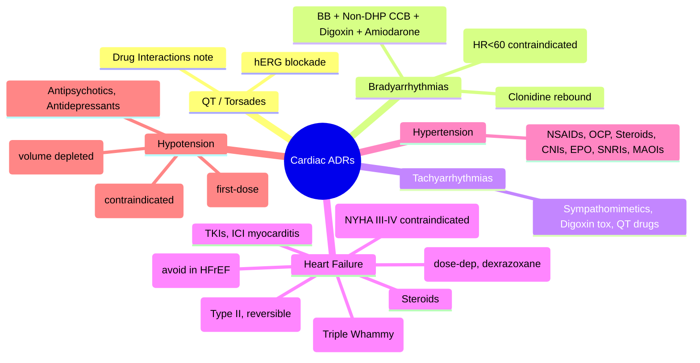

**Status**: `full-fcps-mrcp-note` | **Chapter**: 2 — Clinical Therapeutics and Good Prescribing | **Heading**: Adverse Drug Reactions → System-Specific Patterns | **Exam Priority**: ⭐⭐⭐ **HIGH** (QT/Torsades, Drug-induced HF, Bradyarrhythmias, Hypertension — ICU/cardiology overlap)

---

## 1. 1. 🎯 Learning Objectives
- [ ] Classify cardiac ADRs by mechanism (electrophysiological, haemodynamic, structural)
- [ ] Recognise drug-induced QT prolongation & Torsades (review from Drug Interactions)
- [ ] Identify drugs causing heart failure exacerbation / new-onset HF
- [ ] Manage drug-induced bradyarrhythmias & conduction block
- [ ] Recognise drug-induced hypertension / hypotension
- [ ] Apply monitoring strategies for cardiotoxic drugs

---

## 2. 2. 📊 Classification of Cardiac ADRs

| Category | Mechanism | Key Drugs | Clinical Presentation |
|----------|-----------|-----------|----------------------|
| **QT Prolongation / Torsades** | **hERG (IKr) blockade** | See Drug Interactions: QT Prolonging Combinations | Syncope, palpitations, polymorphic VT, cardiac arrest |
| **Bradyarrhythmia / Conduction Block** | SA/AV node depression | **Beta-blockers, Non-DHP CCB (verapamil, diltiazem), Digoxin, Amiodarone, Clonidine, Ivabradine, Donepezil** | Bradycardia (<50 bpm), hypotension, syncope, heart block |
| **Tachyarrhythmia** | Sympathetic stimulation / triggered activity | **Dobutamine, Adrenaline, Atropine, Theophylline, Digoxin toxicity, QT drugs, Cocaine, Tricyclics** | Palpitations, hypotension, VT/VF |
| **Heart Failure (Exacerbation/New)** | Negative inotropy / fluid retention / afterload mismatch | **NSAIDs, CCB (non-DHP, DHP high dose), Thiazolidinediones (pioglitazone), Dexamethasone, Cilostazol, Itraconazole, Chemotherapy (anthracyclines, trastuzumab)** | Dyspnoea, orthopnoea, oedema, ↑ BNP, ↓ EF |
| **Hypertension** | Vasoconstriction / volume expansion / RAAS activation | **NSAIDs, COX-2 inhibitors, Oral contraceptives, Steroids, Ciclosporin/Tacrolimus, EPO, SNRIs (venlafaxine), MAOIs (tyramine), Sympathomimetics** | Asymptomatic BP rise, headache, encephalopathy (malignant) |
| **Hypotension** | Vasodilation / volume depletion / autonomic blockade | **Alpha-blockers, ACEi/ARB (first dose), Diuretics, Nitrates, PDCIs, Antipsychotics, Antidepressants, Parkinson drugs** | Dizziness, syncope, falls (esp. elderly) |
| **Cardiomyopathy (Chronic)** | Mitochondrial toxicity / oxidative stress / apoptosis | **Anthracyclines (dose-dependent), Trastuzumab (Type II, reversible), TKIs (sunitinib), Clozapine (myocarditis), Carbamazepine** | ↓ EF, heart failure, arrhythmias |

---

## 3. 3. ⚡ Drug-Induced Heart Failure — **High-Yield**

### 1. Drugs That Worsen / Precipitate HF
| Drug Class | Mechanism | Key Examples | High-Risk Patients |
|------------|-----------|--------------|-------------------|
| **NSAIDs** | ↓ Renal prostaglandins → fluid retention, ↑ SVR, ↓ diuretic effect | Ibuprofen, Diclofenac, Naproxen, Celecoxib | **Existing HF, CKD, elderly, on ACEi/ARB+Diuretic (Triple Whammy)** |
| **Calcium Channel Blockers** | Negative inotropy (non-DHP); Reflex tachycardia + fluid retention (DHP) | **Verapamil, Diltiazem** (avoid in HFrEF); **Amlodipine** (safe in HF but can cause oedema) | HFrEF (avoid non-DHP) |
| **Thiazolidinediones** | Fluid retention (PPAR-γ → ENaC upregulation) | **Pioglitazone, Rosiglitazone** | **Existing HF, NYHA III–IV (CONTRAINDICATED)** |
| **Corticosteroids** | Fluid retention, hypertension | Dexamethasone, Prednisolone high dose | HF, CKD |
| **Antiarrhythmics (Class I)** | Negative inotropy, proarrhythmia | Flecainide, Propafenone, Disopyramide | Structural heart disease, post-MI (CAST trial) |
| **Chemotherapy** | **Anthracyclines: dose-dependent (Type A)**; **Trastuzumab: Type II (reversible)** | Doxorubicin (cumulative >450–550 mg/m²), Trastuzumab | Prior radiation, elderly, pre-existing HF |
| **Immunosuppressants** | Vasoconstriction, hypertension | Ciclosporin, Tacrolimus | Transplant |
| **Tyrosine Kinase Inhibitors** | Off-target kinase inhibition | Sunitinib, Pazopanib, Sorafenib | Metastatic RCC/GIST |

### 2. Management
1. **STOP offending drug** if possible
2. **Optimise GDMT** (ACEi/ARB/ARNI, Beta-blocker, MRA, SGLT2i, Loop diuretic)
3. **Anthracyclines**: Dexrazoxane (cardioprotectant) if >300 mg/m²; LVEF monitoring q3mo
4. **Trastuzumab**: Hold if LVEF ↓>10% to <50%; restart if recovers

---

## 4. 4. 💓 Drug-Induced Bradyarrhythmias & Conduction Block

| Drug | Mechanism | Risk Factors | Management |
|------|-----------|--------------|------------|
| **Beta-blockers** | β1 blockade → ↓ SA node automaticity, ↓ AV conduction | Elderly, CKD, combined with non-DHP CCB, digoxin, amiodarone | ↓ dose/hold; atropine 0.5mg IV if symptomatic; pacing if severe |
| **Non-DHP CCB** (Verapamil, Diltiazem) | ↓ SA/AV node conduction | Elderly, HFrEF, combined with BB/digoxin | Avoid in HFrEF; hold if bradycardia |
| **Digoxin** | ↑ Vagal tone → ↓ SA/AV node; ↑ automaticity (toxicity) | **Hypokalaemia, Hypomagnesaemia, Renal impairment, Elderly, Amiodarone/Verapamil** | **Digoxin-specific Fab** if life-threatening; K⁺/Mg²⁺ repletion; hold |
| **Amiodarone** | Multi-channel block (Na, K, Ca, β) → sinus brady, AV block | Combined with BB/CCB/Digoxin | Hold; pacing if symptomatic |
| **Clonidine** | Central α2 agonist → ↓ sympathetic outflow | Elderly, combined with BB | **Rebound hypertension on abrupt stop**; taper |
| **Ivabradine** | If channel blockade (SA node) | **HR <60 at baseline (CONTRAINDICATED)**; combined with BB/CCB | Hold if HR<50; ↑ dose only if HR≥60 |
| **Donepezil / Cholinesterase inhibitors** | ↑ Acetylcholine → bradycardia, AV block | Elderly, combined with BB/CCB | Hold if symptomatic bradycardia; pacemaker if persistent |

---

## 5. 5. 💊 Drug-Induced Hypertension

| Drug | Mechanism | Monitoring |
|------|-----------|------------|
| **NSAIDs / COX-2** | ↓ Renal PG → fluid retention, ↑ SVR; blunts ACEi/ARB/diuretic | BP at 1–2 weeks |
| **Oral Contraceptives (Estrogen)** | ↑ Angiotensinogen → ↑ Ang II; ↑ hepatic SHBG | BP at 3 months |
| **Corticosteroids** | Mineralocorticoid effect → Na⁺/water retention | BP regularly |
| **Ciclosporin / Tacrolimus** | Renal vasoconstriction, ↑ endothelin | BP each visit |
| **Erythropoietin (EPO)** | ↑ Haematocrit → ↑ viscosity; endothelin | BP weekly ×4 then monthly |
| **SNRIs (Venlafaxine >150mg)** | Noradrenaline reuptake inhibition | BP at dose escalation |
| **MAOIs + Tyramine** | Displaced noradrenaline → hypertensive crisis | Dietary tyramine restriction |
| **Sympathomimetics** (Pseudoephedrine, Phenylephrine) | α1 agonism → vasoconstriction | Avoid in uncontrolled HTN |

---

## 6. 6. 📉 Drug-Induced Hypotension

| Drug | Mechanism | High-Risk Scenario |
|------|-----------|-------------------|
| **ACEi/ARB (First dose)** | Rapid RAAS blockade → ↓ Ang II → vasodilation | **Volume depleted** (diuretics, vomiting, diarrhoea), elderly |
| **Alpha-blockers** (Doxazosin, Prazosin, Terazosin) | α1 blockade → venous/arterial dilation | **First dose** (postural hypotension); elderly |
| **Diuretics** (Loop/Thiazide) | Volume depletion | Elderly, combined with ACEi/ARB |
| **Nitrates** (GTN, ISMN) | Venous > arterial dilation → ↓ preload | Combined with PDE5 inhibitors (CONTRAINDICATED) |
| **Antipsychotics** (Clozapine, Quetiapine, Chlorpromazine) | α1 blockade | Elderly, dose escalation |
| **Antidepressants** (TCAs, MAOIs) | α1 blockade, central effects | Elderly, postural |
| **Parkinson drugs** (Levodopa, Dopamine agonists) | Vasodilation, autonomic dysfunction | Elderly, autonomic neuropathy |

---

## 7. 7. 🧬 Chronic Cardiotoxicity (Chemotherapy)

| Drug | Type | Mechanism | Monitoring |
|------|------|-----------|------------|
| **Anthracyclines** (Doxorubicin, Epirubicin, Daunorubicin) | **Type A (Dose-dependent)** | Topoisomerase IIβ inhibition → mitochondrial ROS, DNA damage, apoptosis | **Cumulative dose limit**: Doxorubicin 450–550 mg/m²; **LVEF echo/MUGA q3mo**; Dexrazoxane if >300 mg/m² |
| **Trastuzumab** (Anti-HER2) | **Type B (Reversible, not dose-dependent)** | HER2 blockade → ↓ neuregulin signalling → impaired cardiomyocyte repair | **LVEF q3mo**; hold if ↓>10% to <50%; no cumulative limit |
| **TKIs** (Sunitinib, Pazopanib, Sorafenib) | Off-target (VEGFR, PDGFR, c-Kit) | Hypertension, ↓ LVEF | BP weekly; echo baseline + q3mo |
| **5-FU / Capecitabine** | Coronary vasospasm | Chest pain, ECG changes | ECG if chest pain |
| **Cyclophosphamide (High-dose)** | Haemorrhagic myocarditis | Acute HF, arrhythmias | Echo if symptoms |
| **Immune Checkpoint Inhibitors** | Myocarditis (rare, fatal) | ↑ Troponin, ↓ LVEF, arrhythmias | Troponin q cycle if high risk; echo if symptoms |

---

## 8. 8. 🎯 FCPS/MRCP High-Yield Summary

| Clinical Scenario | Cardiac ADR | Key Drug | Action |
|-------------------|-------------|----------|--------|
| HF patient started on ibuprofen → acute decompensation | **NSAID-induced HF exacerbation** | NSAIDs | **STOP NSAID**; optimise diuretic/GDMT |
| HFrEF patient prescribed verapamil for rate control | **Negative inotropy → HF worsening** | Non-DHP CCB | **AVOID**; use bisoprolol/digoxin |
| Diabetic on pioglitazone → new pedal oedema, SOB | **TZD fluid retention** | Pioglitazone | **CONTRAINDICATED in NYHA III–IV**; stop |
| On doxorubicin 400 mg/m² → LVEF 45% (baseline 60%) | **Anthracycline cardiotoxicity** | Doxorubicin | **Dexrazoxane**; hold if LVEF<50% or ↓>10% |
| On trastuzumab → LVEF 42% (baseline 58%) | **Trastuzumab cardiotoxicity (Type II)** | Trastuzumab | **Hold**; restart if LVEF recovers |
| Elderly on digoxin + verapamil → HR 38, syncope | **Digoxin + CCB → severe bradycardia** | Digoxin + Verapamil | **Hold both**; atropine; pacing if needed |
| Patient on ACEi + diuretic + started ibuprofen → AKI + HF | **Triple Whammy** | ACEi + Diuretic + NSAID | **STOP NSAID**; hold ACEi if AKI; IV fluids |

---

## 9. 9. ❓ Viva Questions (12)

| Q | Answer |
|---|--------|
| 1. Which drugs are CONTRAINDICATED in HFrEF? | **Non-DHP CCB (verapamil, diltiazem), Class I antiarrhythmics (flecainide), TZDs (pioglitazone in NYHA III–IV), NSAIDs (avoid)** |
| 2. Anthracycline vs Trastuzumab cardiotoxicity — differences? | **Anthracycline: Type A, dose-dependent, irreversible, cumulative limit 450–550 mg/m², dexrazoxane**; **Trastuzumab: Type B, reversible, not dose-dependent, no cumulative limit, hold if LVEF↓>10% to <50%** |
| 3. Triple Whammy — components and mechanism? | ACEi/ARB (↓ efferent) + Diuretic (↓ volume) + NSAID (↓ afferent) → **↓↓ GFR → AKI + HF decompensation** |
| 4. Digoxin toxicity — risk factors, ECG, management? | **Hypokalaemia, Hypomagnesaemia, Renal impairment, Elderly, Amiodarone/Verapamil/Quinidine**; ECG: **Sagging ST depression, AV block, bidirectional VT**; **Management: Digoxin-specific Fab (life-threatening), K⁺/Mg²⁺ repletion, hold** |
| 5. Drug-induced hypertension — 3 common causes? | **NSAIDs, Oral contraceptives (estrogen), Corticosteroids**; also Ciclosporin/Tacrolimus, EPO, SNRIs, MAOIs |
| 6. First-dose hypotension with ACEi — mechanism, high-risk? | **Rapid RAAS blockade → vasodilation**; **High-risk: volume depleted (diuretics, vomiting), elderly** |
| 7. Beta-blocker + Verapamil interaction — risk, management? | **Severe bradycardia, AV block, asystole**; **AVOID combination**; if needed, intensive monitoring |
| 8. TZD fluid retention — mechanism, contraindication? | **PPAR-γ → ENaC upregulation → Na⁺/water retention**; **CONTRAINDICATED in NYHA III–IV HF** |
| 9. Clonidine withdrawal — presentation, prevention? | **Rebound hypertension** (can be malignant), anxiety, tremor; **Taper over 1–2 weeks, never stop abruptly** |
| 10. Ivabradine — contraindication, monitoring? | **Contraindicated if HR <60 bpm at baseline**; monitor HR; reduce dose if HR<50 |
| 11. Immune checkpoint inhibitor myocarditis — presentation, urgency? | **Chest pain, dyspnoea, arrhythmia, ↑ troponin, ↓ LVEF**; **MEDICAL EMERGENCY** — high-dose steroids 1–2mg/kg, cardiology, hold ICI |
| 12. 5-FU cardiotoxicity — mechanism, presentation? | **Coronary vasospasm** → angina, MI, arrhythmias; **ECG if chest pain**; stop 5-FU |

---

## 10. 10. 🤯 Confusions & Mnemonics

| Confusion | Clarification |
|-----------|---------------|
| **Anthracycline vs Trastuzumab** | Anthracycline = **Type A, cumulative, irreversible**; Trastuzumab = **Type B, reversible, not cumulative** |
| **CCB in HF** | **Non-DHP (verapamil, diltiazem) = CONTRAINDICATED in HFrEF**; **DHP (amlodipine) = SAFE** (no negative inotropy) |
| **TZD in HF** | **Pioglitazone/rosiglitazone CONTRAINDICATED in NYHA III–IV**; can use in NYHA I–II with caution |
| **Digoxin + Verapamil/Amiodarone/Quinidine** | All ↑ digoxin levels (P-gp inhibition) + additive bradycardia |
| **Clonidine rebound** | **Never stop abruptly** — taper 1–2 weeks |
| **Type A vs B cardiotoxicity** | Type A = dose-dependent (anthracyclines); Type B = idiosyncratic/reversible (trastuzumab) |

**Mnemonics:**
- **"TRIPLE WHAMMY"** = **ACEi/ARB + Diuretic + NSAID** = AKI + HF decompensation
- **"ANTHRACYCLINE LIMIT"** = **Doxorubicin 450–550 mg/m²** cumulative; dexrazoxane >300
- **"TRASTUZUMAB = TYPE B"** = **Reversible**, no cumulative limit, hold if LVEF↓
- **"NO VERA/DILT IN HF"** = **Non-DHP CCB contraindicated in HFrEF**
- **"TZD = FLUID RETENTION"** = **PPAR-γ → ENaC**; **NYHA III–IV = CONTRAINDICATED**
- **"CLONIDINE REBOUND"** = **Never stop abruptly** — taper 1–2wk
- **"ICI MYOCARDITIS"** = **Troponin ↑ + LVEF ↓** = **STEROIDS 1–2mg/kg URGENT**

---

## 11. 11. 🧠 Mind Map (Mermaid)

---

## 12. 12. 📅 Spaced Repetition Tracker

| Review | Date | Score | Next |
|--------|------|-------|------|
| 1 | | | 1d |
| 2 | | | 3d |
| 3 | | | 1w |
| 4 | | | 2w |
| 5 | | | 1m |
| 6 | | | 3m |

---

## 13. 13. 🧪 Self-Test Scorecard

| Section | Max | Score |
|---------|-----|-------|
| Classification table | 8 | |
| HF exacerbation drugs | 10 | |
| Anthracycline vs Trastuzumab | 8 | |
| Bradyarrhythmias | 8 | |
| Hypertension/Hypotension | 8 | |
| Chemotherapy cardiotox | 8 | |
| Viva answers | 12 | |
| **Total** | **62** | |

**Target**: ≥50/62 (80%)

---

## 14. 14. 📝 Exam Answer Modes

### 1. Long Question (10 marks): *"Discuss drug-induced heart failure — drugs, mechanisms, and management."*
1. **Classification** (2): Drugs causing HF exacerbation (NSAIDs, CCB, TZDs, steroids, chemo, immunosuppressants)
2. **Key Mechanisms** (3): NSAIDs (Triple Whammy), Non-DHP CCB (negative inotropy), TZDs (PPAR-γ fluid retention), Anthracyclines (dose-dependent ROS), Trastuzumab (Type II HER2 blockade)
3. **Clinical Scenarios** (3): HFrEF + NSAID (stop, optimise GDMT); HFrEF + Verapamil (avoid); Diabetic + Pioglitazone (contraindicated NYHA III–IV); Anthracycline monitoring (LVEF q3mo, dexrazoxane)
4. **Management Principles** (2): Stop offending drug, optimise GDMT, specific antidotes (dexrazoxane, digoxin Fab)

### 2. Short Question (5 marks): *"Anthracycline vs Trastuzumab cardiotoxicity"*
| Feature | Anthracycline (Type A) | Trastuzumab (Type B) |
|---------|------------------------|----------------------|
| Mechanism | Topo IIβ inhibition, ROS, apoptosis | HER2/neuregulin blockade → impaired repair |
| Dose-dependence | **Yes** (cumulative) | **No** |
| Reversibility | **Irreversible** | **Reversible** |
| Cumulative limit | **Doxorubicin 450–550 mg/m²** | None |
| Cardioprotectant | **Dexrazoxane** (if >300) | None |
| Monitoring | LVEF q3mo | LVEF q3mo |
| Management if LVEF↓ | Stop/limit cumulative dose | **Hold**, restart if recovers |

### 3. Viva (2 min): *"HFrEF patient on bisoprolol, ramipril, furosemide. GP adds ibuprofen for OA. 1 week later: SOB, orthopnoea, Cr 180 (baseline 110). Diagnosis? Management?"*
- **Triple Whammy + NSAID-induced HF exacerbation**
- **STOP ibuprofen immediately**
- **Hold ramipril** (AKI component)
- IV furosemide, fluid balance, daily weights
- Optimise GDMT: ensure bisoprolol at target, add MRA/SGLT2i if indicated
- Paracetamol/codeine for OA pain

### 4. Ward Round (30 sec): *"Patient on doxorubicin cycle 4, cumulative dose 350 mg/m². LVEF 48% (baseline 62%). Action?"*
- **Anthracycline cardiotoxicity** (LVEF ↓>10% to <50%)
- **Start dexrazoxane** (cardioprotectant) before next cycle
- **Hold doxorubicin** if LVEF <45% or symptomatic
- Consider alternative chemo if LVEF doesn't recover

### 5. Last-Night Revision (1-liners):
- Triple Whammy = ACEi + Diuretic + NSAID = AKI + HF
- Non-DHP CCB = avoid in HFrEF; DHP (amlodipine) = safe
- TZD = fluid retention (PPAR-γ); contraindicated NYHA III–IV
- Anthracycline = Type A, dose-dep, cumulative 450–550, dexrazoxane >300
- Trastuzumab = Type B, reversible, hold if LVEF↓>10% to <50%
- Digoxin toxicity = HypoK/Mg, renal, elderly + amiodarone/verapamil → Digoxin Fab
- Clonidine rebound = never stop abrupt; taper 1–2wk
- ICI myocarditis = troponin↑ + LVEF↓ = steroids 1–2mg/kg URGENT

---

## 15. 15. 📚 Summary Card

> **CARDIAC ADR TRIAD:**
> 1. **HF EXACERBATION**: NSAIDs (Triple Whammy), Non-DHP CCB, TZDs (NYHA III–IV), Steroids
> 2. **BRADYARRHYTHMIA**: BB + Verapamil/Diltiazem + Digoxin = **avoid combo**; Clonidine rebound
> 3. **CHEMO CARDIOTOX**: Anthracycline (Type A, cumulative, dexrazoxane) vs Trastuzumab (Type B, reversible, hold)
>
> **HYPERTENSION**: NSAIDs, OCP, Steroids, CNIs, EPO
> **HYPOTENSION**: ACEi first-dose (volume depleted), Alpha-blockers, Nitrates + PDE5i (NO)

---

## 16. 16. ❓ MCQs (15)

1. **Triple Whammy components:**
   A. ACEi + Beta-blocker + Diuretic
   B. **ACEi/ARB + Diuretic + NSAID** ✓
   C. ARB + CCB + Diuretic
   D. ACEi + ARB + CCB
   E. Beta-blocker + Diuretic + NSAID

2. **Calcium channel blocker CONTRAINDICATED in HFrEF:**
   A. Amlodipine
   B. **Verapamil** ✓
   C. Nifedipine
   D. Felodipine
   E. Lercanidipine

3. **Thiazolidinedione (pioglitazone) fluid retention mechanism:**
   A. RAAS activation
   B. **PPAR-γ → ENaC upregulation → Na⁺/water retention** ✓
   C. Reduced GFR
   D. Increased ANP
   D. Sympathetic activation

4. **Anthracycline cumulative dose limit (doxorubicin):**
   A. 300 mg/m²
   B. **450–550 mg/m²** ✓
   C. 600 mg/m²
   D. 700 mg/m²
   E. No limit

5. **Trastuzumab cardiotoxicity — key feature distinguishing from anthracycline:**
   A. Dose-dependent
   B. **Reversible, not dose-dependent** ✓
   C. Cumulative limit applies
   D. Dexrazoxane is protective
   E. Always irreversible

6. **Digoxin toxicity risk factors — which is NOT a risk factor?**
   A. Hypokalaemia
   B. Hypomagnesaemia
   C. Renal impairment
   D. **Hyperkalaemia** ✓
   E. Amiodarone co-administration

7. **Digoxin-specific Fab indicated for:**
   A. Mild nausea
   B. **Life-threatening arrhythmia / K⁺ >5.5 / Ingestion >10mg** ✓
   C. Visual disturbances only
   D. Atrial fibrillation with RVR
   E. All digoxin patients

8. **Clonidine withdrawal — hallmark presentation:**
   A. Hypotension
   B. **Rebound hypertension** ✓
   C. Bradycardia
   D. Hypoglycaemia
   E. Seizures

9. **Ivabradine absolute contraindication:**
   A. HR >100 bpm
   B. **HR <60 bpm at baseline** ✓
   C. Atrial fibrillation
   D. Heart failure
   E. Hypertension

10. **NSAID-induced hypertension mechanism:**
    A. ↑ Cardiac output
    B. **↓ Renal prostaglandins → fluid retention, ↑ SVR** ✓
    C. Direct vasoconstriction
    D. RAAS suppression
    E. Increased heart rate

11. **First-dose ACEi hypotension — highest risk patient:**
    A. Young, euvolaemic
    B. **Elderly, on diuretics, volume depleted** ✓
    C. Hypertensive, no meds
    D. Heart failure, on beta-blocker
    E. Diabetic, on metformin

12. **Nitrate + PDE5 inhibitor (sildenafil) — interaction:**
    A. Additive antianginal
    B. **Contraindicated — severe hypotension** ✓
    C. No interaction
    D. Reduced nitrate efficacy
    E. Increased nitrate tolerance

13. **Immune checkpoint inhibitor myocarditis — troponin monitoring:**
    A. Not needed
    B. **High-risk: troponin each cycle** ✓
    C. Only if symptomatic
    D. Monthly
    E. Only if LVEF ↓

14. **5-FU cardiotoxicity mechanism:**
    A. Direct myocardial necrosis
    B. **Coronary vasospasm** ✓
    C. Pericarditis
    D. Cardiomyopathy
    E. Arrhythmia only

15. **Drug-induced HF — which drug class is SAFE in HFrEF?**
    A. Non-DHP CCB
    B. **DHP CCB (amlodipine)** ✓
    C. Class I antiarrhythmics
    D. TZDs
    E. High-dose steroids

---

## 17. 17. 🃏 Flashcards (Anki-ready)

| Front | Back |
|-------|------|
| Triple Whammy | ACEi/ARB + Diuretic + NSAID → AKI + HF exacerbation |
| CCB in HFrEF | Non-DHP (verapamil, diltiazem) CONTRAINDICATED; DHP (amlodipine) SAFE |
| TZD fluid retention | PPAR-γ → ENaC upregulation; CONTRAINDICATED NYHA III–IV |
| Anthracycline limit | Doxorubicin 450–550 mg/m² cumulative; dexrazoxane >300 |
| Trastuzumab cardiotox | Type B, reversible, not dose-dep, hold if LVEF↓>10% to <50% |
| Digoxin toxicity risks | HypoK, HypoMg, Renal impairment, Elderly, Amiodarone/Verapamil/Quinidine |
| Digoxin Fab indication | Life-threatening arrhythmia, K>5.5, Ingestion >10mg |
| Clonidine withdrawal | Rebound hypertension; taper 1–2wk, NEVER abrupt |
| Ivabradine contraindication | HR <60 bpm at baseline |
| NSAID hypertension | ↓ Renal PG → fluid retention, ↑ SVR |
| ACEi first-dose hypotension | Volume depleted (diuretics, elderly) |
| Nitrate + PDE5i | CONTRAINDICATED — severe hypotension |
| ICI myocarditis | Troponin↑ + LVEF↓ = Steroids 1–2mg/kg URGENT |
| 5-FU cardiotox | Coronary vasospasm |
| Type A vs B cardiotox | Type A = dose-dep (anthracyclines); Type B = reversible (trastuzumab) |

---

## 18. 18. ✅ Answer Keys

### 1. MCQs
1. **B** — Triple Whammy = ACEi/ARB + Diuretic + NSAID
2. **B** — Verapamil (non-DHP) contraindicated in HFrEF
3. **B** — PPAR-γ → ENaC upregulation
4. **B** — Doxorubicin 450–550 mg/m²
5. **B** — Trastuzumab = reversible, not dose-dependent
6. **D** — Hyperkalaemia is NOT a risk factor (hypokalaemia is)
7. **B** — Digoxin Fab for life-threatening arrhythmia/K>5.5/Ingestion>10mg
8. **B** — Clonidine withdrawal = rebound hypertension
9. **B** — Ivabradine contraindicated if HR<60
10. **B** — NSAIDs ↓ renal PG → fluid retention, ↑ SVR
11. **B** — Elderly on diuretics = volume depleted
12. **B** — Nitrate + PDE5i = contraindicated (severe hypotension)
13. **B** — ICI myocarditis monitoring: troponin each cycle if high risk
14. **B** — 5-FU = coronary vasospasm
15. **B** — Amlodipine (DHP) safe in HFrEF

---

*File: `/mnt/tb/Medicine/Clinical Therapeutics and Good Prescribing/ADRs/Cardiac ADRs.md` | Status: `full-fcps-mrcp-note`*
