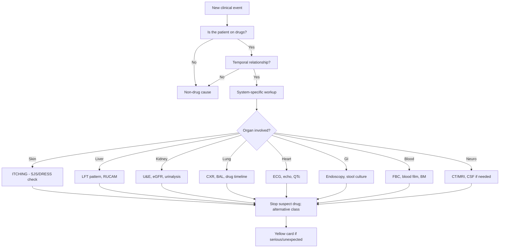
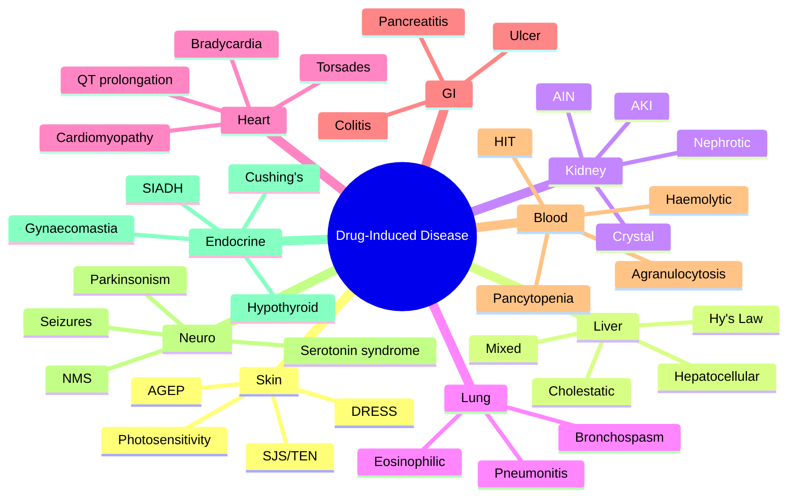

> [!info]
> **Disease-Level Topic** under **ADRs → Common Patterns by System**.
> Davidson 24e Ch2 — "Adverse Drug Reactions" (Maxwell SRJ).

## 1. 1. Learning Objectives
- [ ] Identify common organ-specific ADR patterns
- [ ] Recognize **culprit drugs** for each system
- [ ] Apply **Mnemonics** (e.g., ATCHING, SLANT) to remember drug-induced conditions
- [ ] Recognize drug-induced **lupus, hepatitis, pancreatitis, nephritis, colitis**
- [ ] Differentiate drug-induced from primary disease
- [ ] List withdrawal and rebound reactions (Type E)

## 2. 2. The Mnemonic Table

| System | Mnemonic | Drug Causes |
|--------|----------|-------------|
| **Skin** | "**ITCHING**" | I-... [see below] |
| **Liver** | "**ATT LASH**" | ATT, anticonvulsants, NSAIDs, statins, amiodarone, supplements |
| **Renal** | "**PINCH-H**" | Proton pump inhibitors, bisphosphonates, ACEi, NSAIDs, contrast, heparin, NSAIDs (mimic AKI) |
| **Lung** | "**DAMN PAINS**" | Different ADRs per class |
| **Heart** | "**ABCDE**" | Antiarrhythmics, β-blockers, Ca-blockers, Digoxin, Etc |
| **GI** | "**NAUSEA**" | NSAIDs, Antibiotics, Ulcerogenic, Steroids, Erythromycin, Aspirin |
| **Haem** | "**PANIC S**" | Penicillins, Azathioprine, NSAIDs, Ibuprofen, Carbamazepine, Sulfonamides |
| **Neuro** | "**SLANT**" | Serotonin, Lithium, Anticholinergics, Neuroleptics, TCA |
| **Endocrine** | "**GHOST**" | Glucocorticoids, Hormones, OCP, Statins, Thyroid drugs |

## 3. 3. Mermaid Algorithm — ADR Workup

## 4. 4. Comparison Tables — Drug-Induced Disease by System

### 1. 4.1 Drug-Induced Skin Reactions

| Reaction | Mnemonic | Drugs |
|----------|----------|-------|
| **R**ash (maculopapular) | "**MR BUMP**" | Most drugs (esp. penicillins, sulfa, allopurinol) |
| **S**JS / TEN | "**SSNaA**" | Sulfa, Steroids (withdrawal), Nevirapine, allopurinol, anticonvulsants (lamotrigine, carbamazepine, phenytoin) |
| **D**RESS (Drug Reaction with Eosinophilia and Systemic Symptoms) | "**AEDs and allopurinol**" | Anticonvulsants, allopurinol, sulfonamides, minocycline, vancomycin |
| **A**GEP (Acute Generalised Exanthematous Pustulosis) | "**PLANS**" | Penicillins, pristinamycin, quinolones, hydroxychloroquine, diltiazem, terbinafine, sulfonamides |
| **F**ixed Drug Eruption | "**FDE drugs**" | Paracetamol, sulfa, NSAIDs, tetracyclines |
| **P**hotosensitivity | "**LITE**" | Thiazides, amiodarone, tetracyclines, quinolones, retinoids |
| **S**tevens-Johnson | HLA-B*15:02 | Carbamazepine (Asians), allopurinol (HLA-B*58:01) |

### 2. 4.2 Drug-Induced Liver Injury (DILI)

| Pattern | Mnemonic | Drugs |
|---------|----------|-------|
| **H**epatocellular (ALT>3x ULN) | "**H-PAC MAN**" | Halothane, Paracetamol, Alcohol, Contraceptives, Methyldopa, Anti-TB (INH, rifamp, PZA), Nitrofurantoin |
| **C**holestatic (ALP>2x ULN) | "**CAVE**" | Co-amoxiclav, Augmentin, erythromycin, Verapamil, Estrogens, OCPs |
| **M**ixed | "**MIX**" | Sulfa, ACEi |
| **G**ranulomatous | "**G**ran" | Allopurinol, carbamazepine, methyldopa, hydralazine |
| **S**teatosis (micro/macrovesicular) | "**FATTY**" | Valproate, Amiodarone, Tetracyclines, Tamoxifen, NRTIs (zidovudine) |

**Hy's Law:** ALT ≥3x ULN + bilirubin ≥2x ULN → 10-50% mortality; STOP drug.

### 3. 4.3 Drug-Induced Renal Disease (Mnemonic "**NAKED Pee**")

| Pathology | Mnemonic | Drugs |
|-----------|----------|-------|
| **A**KI (pre-renal) | "**AAA**" | ACEi, ARBs, Aminoglycosides (combined with dehydration) |
| **I**nterstitial nephritis (AIN) | "**PPPNN**" | Penicillins, PPIs, NSAIDs, sulfa, rifampin, cephalosporins |
| **G**lomerulonephritis | "**GN-ICS**" | Gold, NSAIDs, Penicillamine, IFN, biologics, hydralazine |
| **N**ephrotic syndrome | "**MINI**" | Minocycline, Interferon, NSAIDs, bisphosphonates, gold |
| **R**enal tubular acidosis | "**ART**" | Amphotericin B, acetazolamide, sulfonamides, ifosfamide, lithium |
| **N**ephrogenic DI | "**LID**" | Lithium, Demeclocycline, amphotericin B, foscarnet |
| **N**ephrocalcinosis | "**Ca++**" | Calcium supplements, vitamin D excess, sodium bicarbonate |
| **Analgesic nephropathy** | "**PAP**" | Phenacetin, Aspirin, Paracetamol (chronic) |
| **Crystal nephropathy** | "**MMACS**" | Methotrexate, sulfonamides, triamterene, aciclovir, indinavir |

### 4. 4.4 Drug-Induced Pulmonary Disease

| Pathology | Drugs |
|-----------|-------|
| **Bronchospasm** | β-blockers, NSAIDs (AERD), cholinesterase inhibitors |
| **Interstitial pneumonitis/PF** | Amiodarone, methotrexate, nitrofurantoin, bleomycin, cyclophosphamide, BCG |
| **Pulmonary oedema** | Transfusion (TRALI), IV fluids, β-agonists (high dose), heroin |
| **Eosinophilic pneumonia** | Nitrofurantoin, sulfonamides, NSAIDs |
| **Pulmonary haemorrhage** | Anticoagulants, antiplatelets, abciximab |
| **Pleural disease** | Bromocriptine, methotrexate, amiodarone, hydralazine (lupus) |
| **Respiratory depression** | Opioids, benzodiazepines (esp. combined) |
| **Hypersensitivity pneumonitis** | Methotrexate, sirolimus, nitrofurantoin |

### 5. 4.5 Drug-Induced Cardiac Disease

| Pathology | Drugs |
|-----------|-------|
| **Bradycardia / AV block** | β-blockers, digoxin, CCB (non-DHP), amiodarone, clonidine, ivabradine, cholinesterase inhibitors |
| **Tachycardia / AF** | Theophylline, β-agonists, levothyroxine excess, adenosine antagonists (caffeine) |
| **Torsades de Pointes (QT)** | "**SAAD**" — Sotalol, Amiodarone, Anti-arrhythmics class III, Dofetilide; macrolides, fluoroquinolones, methadone, ondansetron, haloperidol, TCAs |
| **Cardiomyopathy** | Anthracyclines (Doxorubicin), trastuzumab, cyclophosphamide, clozapine |
| **Heart failure exacerbation** | NSAIDs, CCB (verapamil), rosiglitazone, pioglitazone, anti-TNF, dexamethasone |
| **Myocarditis** | Clozapine, sulfonamides, penicillins, allopurinol |
| **Pericarditis** | Procainamide, hydralazine, isoniazid, penicillins, anti-TNF |
| **Valvulopathy** | Ergot alkaloids, pergolide, cabergoline, fenfluramine, dexfenfluramine, MDMA |
| **Pulmonary HTN** | Dexfenfluramine, aminorex, dasatinib |
| **Hypertension** | NSAIDs, OCP, sympathomimetics, corticosteroids, ciclosporin, tacrolimus |
| **Hypotension** | Antihypertensives, opioids, anaesthetics, levodopa, bromocriptine |

### 6. 4.6 Drug-Induced GI Disease

| Pathology | Drugs |
|-----------|-------|
| **Peptic ulcer / bleeding** | NSAIDs, aspirin, anticoagulants, steroids (with NSAID) |
| **Oesophagitis** | Bisphosphonates, doxycycline, iron, potassium chloride, NSAIDs |
| **Hepatotoxicity** | (See DILI table) |
| **Pancreatitis** | "**HAD PANIC**" — HIV drugs (didanosine, pentamidine), Azathioprine, Didanosine, Pentamidine, Asparaginase, Nitrofurantoin, Immunosuppressants, Corticosteroids, Valproate, GLP-1 agonists, GLP-1 RAs |
| **Colitis (PMC)** | Clostridioides difficile — antibiotics (esp. clindamycin, fluoroquinolones, cephalosporins) |
| **Microscopic colitis** | PPIs, NSAIDs, SSRIs |
| **Constipation** | Opioids, anticholinergics, CCB, iron, antihistamines, ondansetron |
| **Diarrhoea** | Antibiotics, metformin, PPIs, colchicine, magnesium-containing antacids, SSRIs |
| **Nausea/vomiting** | Chemotherapy, opioids, antibiotics (erythromycin), metformin, digoxin |

### 7. 4.7 Drug-Induced Haematological Disease (Mnemonic "**PANICS**")

| Cytopenia | Drugs |
|----------|-------|
| **P**ancytopenia | Chloramphenicol, benzene, methimazole, gold, chemotherapy |
| **A**plastic anaemia | Chloramphenicol, benzene, carbamazepine, NSAIDs, gold, anticonvulsants |
| **N**eutropenia / Agranulocytosis | "**CAN STOP L**" — Clozapine, Antithyroid (PTU/methimazole), NSAIDs (diclofenac), Sulfonamides, Trimethoprim, Olanzapine, Ticlopidine, Lamotrigine |
| **I**ron deficiency (chronic blood loss) | NSAIDs, anticoagulants |
| **T**hrombocytopenia | "**HIT Mnemonic**" — Heparin (HIT), Ibuprofen, linezolid, TTP drugs, quinine, vancomycin, abciximab, eptifibatide, chemotherapy |
| **H**aemolytic anaemia (immune) | "**SHIPP**" — Sulfonamides, Hydralazine, Ibuprofen, Penicillins, Procainamide, α-methyldopa, quinine, rifampicin |
| **A**plastic anaemia | Chloramphenicol, benzene, gold, penicillamine, anticonvulsants, NSAIDs |
| **E**osinophilia | DRESS, allopurinol, anticonvulsants, sulfa, abacavir, methimazole |

### 8. 4.8 Drug-Induced Neurological Disease (Mnemonic "**SLANT**")

| Pathology | Drugs |
|-----------|-------|
| **S**erotonin syndrome | SSRIs + MAOIs, tramadol, linezolid, methylene blue, triptans |
| **L**ithium toxicity | Lithium (narrow TI) |
| **A**nticholinergic syndrome | Antihistamines, TCAs, antipsychotics, antiparkinsonian |
| **N**euroleptic malignant syndrome | Antipsychotics (D2 antagonism) |
| **T**ardive dyskinesia | Antipsychotics (long-term) |
| **S**eizures | Tramadol, meperidine (pethidine), bupropion, INH, fluoroquinolones, withdrawal (benzo, alcohol) |
| **P**arkinsonism | Antipsychotics, metoclopramide, prochlorperazine, reserpine |
| **P**eripheral neuropathy | Vincristine, INH, metronidazole, nitrofurantoin, didanosine, amiodarone |
| **H**eadache (analgesic-overuse) | Triptans, opioids, paracetamol, NSAIDs |
| **C**erebellar | Phenytoin, carbamazepine, lithium, 5-FU, cytosine arabinoside |
| **O**totoxicity | Aminoglycosides, loop diuretics, vancomycin, platinum chemo, macrolides |
| **V**estibulotoxicity | Gentamicin, streptomycin |

### 9. 4.9 Drug-Induced Endocrine Disease (Mnemonic "**GHOSTS**")

| Pathology | Drugs |
|-----------|-------|
| **G**lucocorticoid excess (iatrogenic Cushing's) | Long-term steroids |
| **H**ypothyroidism | Lithium, amiodarone, interferon-α, anti-TNF, sunitinib |
| **O**CP effects (VTE, HTN, cholestasis) | Combined OCP |
| **S**exual dysfunction | Antihypertensives (β-blocker, thiazide), SSRIs, antipsychotics, finasteride |
| **T**hyroid storm | Amiodarone (in pre-existing thyroid disease) |
| **Hyperglycaemia** | Steroids, thiazides, tacrolimus, ciclosporin, antipsychotics (atypical) |
| **Hypoglycaemia** | Insulin, sulfonylureas, quinine, pentamidine, β-blockers (mask symptoms) |
| **Gynaecomastia** | Spironolactone, cimetidine, ketoconazole, finasteride, anti-androgens, digoxin, amiodarone, methyldopa |
| **Galactorrhoea** | Antipsychotics (D2 block), domperidone, metoclopramide, methyldopa, opioids |
| **SIADH** | SSRIs, TCAs, carbamazepine, thiazides, vincristine, cyclophosphamide |
| **Diabetes insipidus** | Lithium, demeclocycline |
| **Adrenal suppression** | Long-term steroids (esp. >3 months, >7.5 mg/day prednisolone) |
| **Osteoporosis** | Long-term steroids, GnRH agonists, aromatase inhibitors, heparin, anticonvulsants (P450 induction → ↓Vit D) |
| **Hyperuricaemia/gout** | Thiazides, furosemide, ciclosporin, pyrazinamide, ethambutol, nicotinic acid |

## 5. 5. FCPS/MRCP High-Yield Summary

| Pearl | Detail |
|-------|--------|
| Most common organ for ADR | GI (bleed, ulcer) and skin (rash) |
| Most common fatal ADR | GI haemorrhage (NSAID + anticoagulant) |
| Drug most commonly causing SJS | Allopurinol (HLA-B*58:01) |
| Most common DILI | Paracetamol (overdose) |
| Most common AIN cause | NSAIDs, PPIs, penicillins |
| Most common cause of AKI | ACEi/ARB + diuretic in dehydration |
| Most common drug-induced nephrotic | NSAIDs, bisphosphonates |
| Most common drug-induced QT | Macrolides, fluoroquinolones, methadone, ondansetron, haloperidol, antiarrhythmics |
| Most common drug-induced Cushing's | Long-term steroids |
| Most common drug-induced gynaecomastia | Spironolactone |
| Most common drug-induced agranulocytosis | Clozapine, antithyroids (PTU/methimazole) |
| Most common cause of ADRs in elderly | Polypharmacy + inappropriate prescribing |
| Withdrawal reactions | β-blocker (rebound HTN), opioid, benzo, SSRI, corticosteroid (adrenal suppression) |
| Rebound phenomenon | Rebound HTN, rebound angina (β-blocker), rebound acidity (PPI) |

## 6. 6. Viva Questions (10)

1. **Name 3 common drug causes of SJS/TEN.**
   *Allopurinol (HLA-B*58:01), carbamazepine (HLA-B*15:02 in Asians), lamotrigine, sulfonamides, nevirapine, phenytoin, oxicam NSAIDs.*

2. **What is Hy's Law?**
   *Drug-induced ALT ≥3x ULN + bilirubin ≥2x ULN (without obstruction). 10-50% mortality. STOP drug.*

3. **List 4 common drug causes of AKI.**
   *ACEi/ARB + diuretic in dehydration, NSAIDs, aminoglycosides, contrast media, calcineurin inhibitors.*

4. **List 3 common drug causes of AIN.**
   *NSAIDs, PPIs, penicillins/cephalosporins, sulfonamides, rifampin, allopurinol.*

5. **What is "quinolone arthropathy"?**
   *Tendon rupture (esp. Achilles) with fluoroquinolones, esp. elderly + corticosteroids. FDA black box warning.*

6. **Name the drug class causing gingival hyperplasia.**
   *Phenytoin, calcium channel blockers (especially nifedipine, amlodipine), ciclosporin.*

7. **Name 3 drugs causing gynaecomastia.**
   *Spironolactone, cimetidine, ketoconazole, finasteride, anti-androgens, digoxin, amiodarone.*

8. **What is the most common drug-induced lupus inducer?**
   *Hydralazine, procainamide, isoniazid, minocycline, quinidine, methyldopa, chlorpromazine, anti-TNF. (Mnemonic "**SHIPP-MC**" or "**HIPP**": Hydralazine, INH, Procainamide, Penicillamine.)*

9. **What is the most common cause of drug-induced SIADH?**
   *SSRIs, TCAs, carbamazepine, thiazides, vincristine, cyclophosphamide. SSRIs are the most common.*

10. **What is "red man syndrome"?**
    *Vancomycin infusion reaction (histamine release, NOT allergy). Treat by slowing infusion rate, antihistamines. Can occur with first dose; not IgE-mediated.*

## 7. 7. Confusions & Mnemonics

| Confusion | Resolution |
|-----------|------------|
| Drug-induced lupus vs SLE | Drug-induced: antihistone Ab, renal/CNS spared, reversible on stop |
| SJS vs TEN | SJS <10% BSA; TEN >30% BSA; SJS/TEN overlap 10-30% |
| AIN vs ATN | AIN = interstitial inflammation (eosinophils, fever, rash); ATN = tubular damage (ischaemia, contrast, aminoglycosides) |
| Hepatocellular vs cholestatic | ALT>ALP = hepatocellular (RUCAM >5 = definite); ALP>ALT = cholestatic |
| DILI vs DILI mimics | DILI = drug; mimics = viral (HAV, HBV, HEV), autoimmune, ischaemic (shock liver), biliary |
| Aplastic anaemia vs agranulocytosis | Aplastic = pancytopenia + hypoplastic BM; Agranulocytosis = isolated neutrophil <0.5 |
| Serotonin syndrome vs NMS | Serotonin = hyperreflexia, clonus, agitation (hours); NMS = rigidity, hyperthermia, CK (days-weeks) |
| Malignant hyperthermia vs NMS | MH = anaesthesia-related (suxamethonium, volatiles); NMS = antipsychotics |
| QT prolongation vs torsades | Many drugs prolong QT, but torsades is the malignant arrhythmia |
| Torsades vs VT | Torsades = polymorphic VT with twisting QRS axis around baseline |
| Type A vs Type B ADR by organ | Type A more predictable from pharmacology; Type B more idiosyncratic |

**Mnemonic — Hy's Law: "**A**LT + **B**ili** = bad (3 + 2) = stop drug, observe**

**Mnemonic — DILI patterns: "**H**epatoCAP, **C**holestasis via **E**strogen"** (Hepatocellular, Cholestatic, Mixed, Granulomatous)

**Mnemonic — Drug-induced Cushing's: "**Steroids forever = fat face, fat trunk, fat hump, thin limbs**"**

**Mnemonic — AIN: "**PPPNN**"** (Penicillins, PPIs, NSAIDs, sulfa, NSAID)

**Mnemonic — QT prolongation: "**SAAD**"** (Sotalol, Amiodarone, Antiarrhythmics, Dofetilide) + **"MaFLOHTO"** (Macrolides, Fluoroquinolones, Ondansetron, Haloperidol, TCAs, Methadone)

## 8. 8. Mermaid Mind Map

## 9. 9. Spaced Repetition Tracker

| System | Day 1 | Day 3 | Day 7 | Day 14 | Day 30 |
|--------|-------|-------|-------|-------|--------|
| Skin (SJS, DRESS, AGEP) | ☐ | ☐ | ☐ | ☐ | ☐ |
| Liver (DILI patterns, Hy's) | ☐ | ☐ | ☐ | ☐ | ☐ |
| Renal (AKI, AIN, nephrotic) | ☐ | ☐ | ☐ | ☐ | ☐ |
| Cardiac (QT, brady, CM) | ☐ | ☐ | ☐ | ☐ | ☐ |
| GI (ulcer, pancreatitis) | ☐ | ☐ | ☐ | ☐ | ☐ |
| Blood (agran, HIT) | ☐ | ☐ | ☐ | ☐ | ☐ |
| Neuro (5HT, NMS, PD) | ☐ | ☐ | ☐ | ☐ | ☐ |
| Endocrine (Cushing's, gynaeco) | ☐ | ☐ | ☐ | ☐ | ☐ |

## 10. 10. Self-Test Scorecard

| Domain | Score (0-5) |
|--------|-------------|
| Skin ADRs | /5 |
| Liver ADRs (DILI, Hy's) | /5 |
| Renal ADRs (AKI, AIN) | /5 |
| Cardiac (QT, brady, CM) | /5 |
| GI (ulcer, pancreatitis) | /5 |
| Blood/Neuro/Endo | /5 |
| **TOTAL** | **/30** |

## 11. 11. MCQs (10)

1. **The most common fatal ADR in the UK is:**
   A. Hepatotoxicity
   B. Anaphylaxis
   C. GI haemorrhage (NSAID + anticoagulant) ✓
   D. SJS
   E. Agranulocytosis

2. **Hy's Law refers to:**
   A. ALT ≥3x ULN + bilirubin ≥2x ULN → high mortality ✓
   B. Alk Phos > ALT
   C. INR >1.5
   D. Bilirubin >5
   E. AST > ALT

3. **Which drug is the most common cause of SJS/TEN?**
   A. Penicillin
   B. Allopurinol ✓
   C. Aspirin
   D. Paracetamol
   E. Omeprazole

4. **Drug-induced lupus is associated with:**
   A. Anti-dsDNA
   B. Anti-histone antibodies ✓
   C. Anti-Sm
   D. ANCA
   E. Anti-CCP

5. **Which is the most common cause of AIN?**
   A. ACEi
   B. NSAIDs and PPIs ✓
   C. Warfarin
   D. Heparin
   E. Statins

6. **"Red man syndrome" is associated with:**
   A. Penicillin
   B. Vancomycin ✓
   C. Rifampicin
   D. Erythromycin
   E. Tetracycline

7. **Gynaecomastia is most commonly caused by:**
   A. Furosemide
   B. Spironolactone ✓
   C. Ramipril
   D. Atenolol
   E. Amlodipine

8. **Drug-induced SIADH is most commonly associated with:**
   A. Thiazides
   B. SSRIs ✓
   C. Loop diuretics
   D. β-blockers
   E. ACEi

9. **Tendon rupture is associated with:**
   A. Penicillins
   B. Fluoroquinolones ✓
   C. Macrolides
   D. Tetracyclines
   E. Sulfa

10. **Quinidine, procainamide, hydralazine, isoniazid cause:**
    A. Hepatotoxicity
    B. Drug-induced lupus ✓
    C. AIN
    D. Haemolysis
    E. SIADH

## 12. 12. SBAs (5)

1. **A 50-year-old on TB treatment (INH, rifampicin, PZA, ethambutol) develops jaundice at week 6 with ALT 250 U/L, bilirubin 50 µmol/L. Action:**
   - A) Continue all drugs
   - B) Stop INH + RIF + PZA; switch to alternative regimen ✓
   - C) Switch to streptomycin
   - D) Add steroids
   - E) Stop only PZA

2. **A patient on allopurinol develops SJS at 2 weeks. Best management:**
   - A) Rechallenge after 1 month
   - B) Stop allopurinol, switch to febuxostat, supportive care, dermatology, ICU if TEN ✓
   - C) Reduce dose
   - D) Add antihistamine
   - E) Continue with steroid cover

3. **A 70-year-old on lisinopril + indapamide develops AKI after gastroenteritis. Likely mechanism:**
   - A) Interstitial nephritis
   - B) Pre-renal AKI from ACEi + diuretic + volume depletion ✓
   - C) Crystal nephropathy
   - D) ATN
   - E) Glomerulonephritis

4. **A patient on clozapine develops ANC 0.4 × 10⁹/L. Action:**
   - A) Continue clozapine
   - B) Stop clozapine immediately, FBC daily, consider G-CSF ✓
   - C) Reduce dose
   - D) Add G-CSF and continue
   - E) Switch to olanzapine but continue clozapine

5. **A patient on amiodarone for 3 years presents with dry cough and dyspnoea; CXR shows interstitial infiltrates. The most likely ADR is:**
   - A) Type A, dose-related
   - B) Type C, chronic, cumulative, dose-related pulmonary fibrosis ✓
   - C) Type B, idiosyncratic
   - D) Type D, delayed
   - E) Type E, withdrawal

## 13. 13. Answer Key

### 1. MCQ Answers
1. **C** (GI haemorrhage is most common fatal ADR)
2. **A** (Hy's Law = ALT 3x + Bili 2x = high mortality)
3. **B** (Allopurinol = most common SJS cause; HLA-B*58:01)
4. **B** (Anti-histone in drug-induced lupus)
5. **B** (NSAIDs and PPIs most common AIN)
6. **B** (Vancomycin = red man syndrome; histamine release)
7. **B** (Spironolactone = most common drug gynaecomastia)
8. **B** (SSRIs most common SIADH)
9. **B** (Fluoroquinolones = tendon rupture)
10. **B** (Drug-induced lupus: hydralazine, procainamide, INH, etc.)

### 2. SBA Answers
1. **B** — Stop hepatotoxic ATT drugs; switch to alternative regimen (e.g., fluoroquinolone-based, with ethambutol + aminoglycoside).
2. **B** — Stop allopurinol forever; dermatology + burns/ICU; supportive care; switch to febuxostat (if needed) cautiously (cross-reactivity rare but possible).
3. **B** — Pre-renal AKI: ACEi + thiazide + dehydration → "triple whammy." Hold ACEi/diuretic, IV fluids.
4. **B** — Stop clozapine immediately (agranulocytosis); daily FBC; consider G-CSF; never re-challenge.
5. **B** — Amiodarone pulmonary fibrosis is Type C (chronic, cumulative).

## 14. 14. Summary Box

> **ADRs affect every organ system.** Skin: SJS (allopurinol, carbamazepine, lamotrigine, sulfa). Liver: Hy's Law (ALT 3x + Bili 2x = 10-50% mortality; stop drug). Kidney: AIN (NSAIDs, PPIs, penicillins); pre-renal AKI (ACEi + diuretic + dehydration). Blood: agranulocytosis (clozapine, antithyroids); HIT (heparin). Heart: QT prolongation (SAAD, MaFLOHTO). Neuro: 5HT syndrome, NMS. Always consider drug as cause of new symptom, especially in polypharmacy and elderly.

---

## 15. 15. Cross-Links
- **Parent Topic-Group**: [[../ADRs|ADRs]]
- **Sibling Topic-Groups**: [[Definition and classification]], [[Causality assessment]], [[Reporting and pharmacovigilance]]
- **Heading Hub**: [[ADRs]]
- **Chapter MOC**: [[Clinical Therapeutics and Good Prescribing MOC]]
- **Related**: [[Drug Interactions]], [[Hepatic ADRs]], [[Renal ADRs]], [[Cardiac ADRs]]

**Last Updated:** 2026-06-15  
**Status: FULLY COMPLETE with Exam Suite (Viva 10, MCQ 10, SBA 5, Answer Key, Confusions, Mind Map, Spaced Repetition, Self-Test, Exam Modes)**
