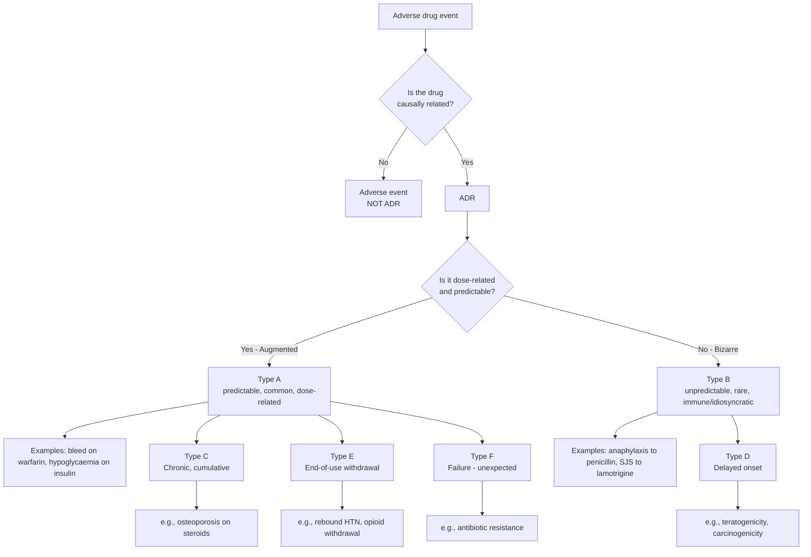
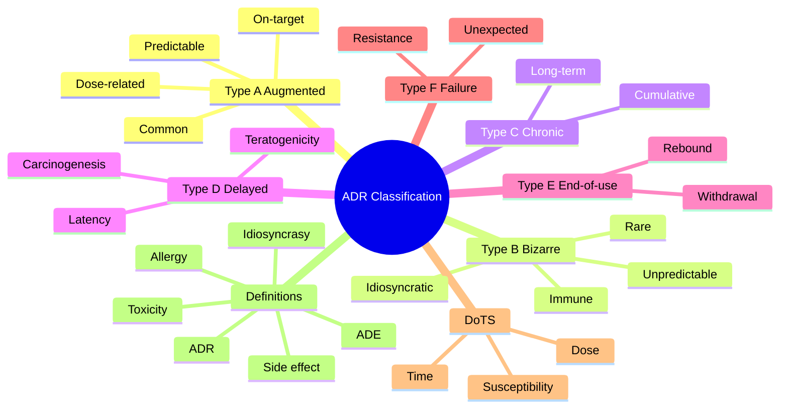

> [!info]
> **Disease-Level Topic** under **ADRs → Definition and Classification**.
> Davidson 24e Ch2 — "Adverse Drug Reactions" (Maxwell SRJ).

## 1. 1. Learning Objectives
- [ ] Define adverse drug reaction (ADR) vs adverse drug event (ADE)
- [ ] Classify ADRs using the **Type A-F** system
- [ ] Describe the **DoTS** classification (Dose, Time, Susceptibility)
- [ ] Differentiate **side effect**, **toxicity**, **idiosyncrasy**, **allergy**, **intolerance**
- [ ] Recognize common Type A (predictable) vs Type B (bizarre) reactions
- [ ] Provide clinical examples for each type

## 2. 2. Definitions

| Term | Definition |
|------|------------|
| **ADR** (Adverse Drug Reaction) | Harmful, unintended reaction to a drug at doses normally used in humans (WHO, 1972) |
| **ADE** (Adverse Drug Event) | Any undesirable experience with a drug; may or may not be causally related |
| **Side effect** | Unintended effect at therapeutic dose; usually predictable, dose-related, not necessarily harmful |
| **Toxicity** | Direct poisonous effect; usually dose-related, may occur with overdose |
| **Idiosyncrasy** | Unpredictable, often genetically determined reaction (e.g., G6PD deficiency → haemolysis) |
| **Allergy / Hypersensitivity** | Immune-mediated (Type I-IV); not dose-related; requires prior sensitisation |
| **Intolerance** | Exaggerated normal pharmacological effect at low dose (e.g., tinnitus with low-dose aspirin) |
| **Tolerance** | Decreased response with continued use (e.g., opioids, benzodiazepines) |
| **Tachyphylaxis** | Rapid tolerance within hours/days (e.g., nitrates, nicotinic agonists) |
| **Withdrawal / Rebound** | Symptoms on sudden discontinuation (e.g., rebound HTN with β-blocker stop) |
| **Cumulative toxicity** | Drug or metabolite accumulates (e.g., aminoglycoside nephro/ototoxicity) |

## 3. 3. Mermaid Algorithm — ADR Classification Flow

## 4. 4. Comparison Tables

### 1. 4.1 Type A vs Type B ADR (Mnemonic: "**A**dapted" vs "**B**izarre")

| Feature | Type A (Augmented) | Type B (Bizarre) |
|---------|--------------------|------------------|
| **Predictability** | Predictable from pharmacology | Unpredictable |
| **Dose relationship** | Dose-dependent | Often not dose-related |
| **Frequency** | Common (1-25%) | Uncommon (<1%) |
| **Severity** | Usually mild-moderate | Often severe |
| **Mechanism** | Known pharmacology (on-target / off-target) | Immune / Idiosyncratic / Genetic |
| **Management** | Dose reduction, switch | Stop drug; avoid forever |
| **Examples** | Bleeding on warfarin, hypoglycaemia on insulin, ACEi cough | Anaphylaxis to penicillin, SJS, malignant hyperthermia |
| **Detection** | Pre-marketing (Phase III) | Often post-marketing |

### 2. 4.2 DoTS Classification (Edwards & Aronson, 2000)

| Axis | Sub-types | Example |
|------|-----------|---------|
| **Dose** | Toxic (overdose) | Paracetamol hepatotoxicity |
| | Collateral (side effect) | Antihistamine sedation |
| | Hyper-susceptibility | Low-dose digoxin toxicity in elderly |
| **Time** | Rapid (minutes-hours) | Anaphylaxis, red man syndrome |
| | Early (days-weeks) | Maculopapular rash |
| | Intermediate (weeks-months) | Stevens-Johnson syndrome |
| | Late (months-years) | Carcinogenicity, osteoporosis |
| | Withdrawal | Rebound, dependence |
| **Susceptibility** | Age | Tetracycline teeth in <8 yr |
| | Sex | Drug-induced lupus (F > M) |
| | Genetics | G6PD, HLA, CYP polymorphisms |
| | Disease | NSAID-induced renal failure in CKD |
| | Behaviour | Smoking + oral contraceptive → VTE |

### 3. 4.3 Type C, D, E, F Reactions

| Type | Term | Description | Example |
|------|------|-------------|---------|
| **C** | **C**hronic | Cumulative dose, time-related | Osteoporosis from long-term steroids |
| **D** | **D**elayed | Months-years after exposure | Carcinogenesis (cyclophosphamide → bladder Ca), teratogenicity (thalidomide) |
| **E** | **E**nd of use | Withdrawal / rebound | Rebound HTN on β-blocker stop, opioid withdrawal |
| **F** | **F**ailure | Unexpected therapeutic failure | Antibiotic resistance, oral contraceptive failure (enzyme inducer) |

### 4. 4.4 On-Target vs Off-Target ADRs

| Type | Mechanism | Example |
|------|-----------|---------|
| **On-target** | Exaggerated primary pharmacology | Hypoglycaemia on sulfonylurea, bleeding on warfarin |
| **Off-target** | Action on unintended receptor/enzyme | Antihistamine sedation (H1), opioid constipation (μ) |

## 5. 5. FCPS/MRCP High-Yield Summary

| Pearl | Detail |
|-------|--------|
| Most common ADRs overall | Type A (predictable) — 80% of all ADRs |
| Most common cause of ADR-related admission | GI bleeding (NSAIDs, anticoagulants) |
| Most common fatal ADR in UK | GI haemorrhage (NSAID + anticoagulant) |
| Common Type A examples | Bleeding (warfarin, DOAC), hypoglycaemia (insulin, SU), bradycardia (β-blocker), AKI (ACEi + diuretic) |
| Common Type B examples | Penicillin anaphylaxis, NSAID asthma, HLA-B*15:02 + carbamazepine → SJS |
| Allergic vs idiosyncratic | Allergic = immune (IgE or T-cell); Idiosyncratic = non-immune (often genetic) |
| Type E | Withdrawal reactions (β-blocker, opioid, benzo, SSRI) |
| On-target ADR example | Bleeding on anticoagulant (exaggerated action) |
| Off-target ADR example | Sedation with 1st-gen antihistamine (H1 cross CNS) |
| Detection of rare ADRs | Post-marketing surveillance (Phase IV, yellow card) |

## 6. 6. Viva Questions (10)

1. **Define adverse drug reaction (WHO 1972).**
   *A response to a drug which is noxious and unintended, and which occurs at doses normally used in humans for the prophylaxis, diagnosis, or therapy of disease.*

2. **Differentiate Type A and Type B ADR.**
   *Type A = Augmented: predictable, dose-related, common, on-target pharmacology. Type B = Bizarre: unpredictable, not dose-related, rare, immune or idiosyncratic.*

3. **Give 3 examples of Type A ADRs.**
   *1) Bleeding on warfarin/DOAC. 2) Hypoglycaemia on insulin/sulfonylurea. 3) Bradycardia on β-blocker. 4) Cough on ACEi. 5) AKI on ACEi + diuretic (esp. in dehydration).*

4. **Give 3 examples of Type B ADRs.**
   *1) Anaphylaxis on penicillin. 2) Stevens-Johnson syndrome on lamotrigine/carbazepine. 3) Malignant hyperthermia on suxamethonium. 4) Aplastic anaemia on chloramphenicol.*

5. **What is the DoTS classification?**
   *Dose (toxic/collateral/hyper-susceptibility), Time (rapid/early/intermediate/late/withdrawal), Susceptibility (age/sex/genetics/disease/behaviour).*

6. **Differentiate side effect from toxicity.**
   *Side effect = unintended effect at therapeutic dose (usually predictable, dose-related, may be tolerable). Toxicity = direct harmful effect, often overdose, may be dose-cumulative.*

7. **What is an idiosyncratic reaction? Give an example.**
   *Unpredictable, often genetically determined reaction unrelated to pharmacology. Example: primaquine → haemolysis in G6PD deficiency; sulfonamides → SJS in HLA-B*15:02.*

8. **What is a Type C ADR?**
   *Chronic / cumulative — dose and time-related. Example: osteoporosis with long-term corticosteroids; adrenal suppression with prolonged steroids.*

9. **What is a Type E ADR? Give an example.**
   *End-of-use / withdrawal / rebound. Example: rebound HTN with abrupt β-blocker stop; opioid withdrawal; SSRI discontinuation syndrome.*

10. **Why are Type B ADRs often detected only post-marketing?**
    *Type B reactions are rare (<1 in 10,000) and unpredictable, so pre-marketing trials (Phase I-III, typically <5,000 patients) cannot detect them. Post-marketing surveillance (Phase IV) is needed.*

## 7. 7. Confusions & Mnemonics

| Confusion | Resolution |
|-----------|------------|
| ADR vs ADE | ADR = causally related; ADE = any untoward event (causality not yet established) |
| Side effect vs ADR | Side effect = predictable, often tolerable (e.g., dry mouth on TCA); ADR = harmful or noxious |
| Allergy vs idiosyncrasy | Allergy = immune (Type I-IV); Idiosyncrasy = non-immune (e.g., G6PD) |
| Type A vs Type B | A = Augmented (predictable); B = Bizarre (unpredictable) |
| On-target vs Off-target | On-target = exaggerated intended effect; Off-target = unintended receptor |
| Type C vs Type D | C = Chronic (cumulative, on-going exposure); D = Delayed (latent, months-years) |
| Tolerance vs Tachyphylaxis | Tolerance = days-weeks (e.g., opioids); Tachyphylaxis = hours (e.g., nitrates) |
| Withdrawal vs Rebound | Rebound = return of original disease, often worse (HTN on β-blocker stop); Withdrawal = new symptoms (opioid) |
| DoTS | D = Dose; T = Time; S = Susceptibility |
| Primary vs Secondary pharmacology | Primary = intended (analgesic effect of morphine); Secondary = side effects |

**Mnemonic — Type A-F: "**A**ugmented **B**izarre **C**hronic **D**elayed **E**nd-of-use **F**ailure"** (ABCDEF)

**Mnemonic — DoTS: "**D**ose, **T**ime, **S**usceptibility"**

**Mnemonic — Type A vs B: "**A**ll ADRs are A; B is for Bizarre"** (Type A is common; B is rare and bizarre)

## 8. 8. Mermaid Mind Map

## 9. 9. Spaced Repetition Tracker

| Topic | Day 1 | Day 3 | Day 7 | Day 14 | Day 30 |
|-------|-------|-------|-------|-------|--------|
| Type A definition | ☐ | ☐ | ☐ | ☐ | ☐ |
| Type B definition | ☐ | ☐ | ☐ | ☐ | ☐ |
| DoTS axes | ☐ | ☐ | ☐ | ☐ | ☐ |
| Type C-F | ☐ | ☐ | ☐ | ☐ | ☐ |
| ADR vs ADE | ☐ | ☐ | ☐ | ☐ | ☐ |
| On vs off target | ☐ | ☐ | ☐ | ☐ | ☐ |

## 10. 10. Self-Test Scorecard

| Domain | Score (0-5) |
|--------|-------------|
| ADR definition | /5 |
| Type A vs B | /5 |
| DoTS | /5 |
| Type C-F | /5 |
| Examples | /5 |
| Distinctions (side effect vs toxicity, etc.) | /5 |
| **TOTAL** | **/30** |

## 11. 11. MCQs (10)

1. **The WHO 1972 definition of ADR is:**
   A. Any untoward event
   B. A noxious, unintended response at doses normally used in humans ✓
   C. A side effect of a drug
   D. A toxic reaction
   E. A hypersensitivity reaction

2. **Type A ADRs are:**
   A. Unpredictable
   B. Not dose-related
   C. Augmented, predictable, dose-related ✓
   D. Always severe
   E. Immune-mediated

3. **Which is a Type B (bizarre) ADR?**
   A. Bleeding on warfarin
   B. Hypoglycaemia on insulin
   C. Anaphylaxis on penicillin ✓
   D. Bradycardia on β-blocker
   E. Cough on ACEi

4. **The DoTS classification axes are:**
   A. Diagnosis, Treatment, Susceptibility
   B. Dose, Time, Susceptibility ✓
   C. Drug, Onset, Type
   D. Dose, Tolerance, Side effect
   E. Disease, Outcome, Therapy

5. **A 65-year-old with CKD develops AKI after starting ACEi + diuretic. This is:**
   A. Type A ADR ✓
   B. Type B ADR
   C. Type C ADR
   D. Type D ADR
   E. Type E ADR

6. **Osteoporosis after 2 years of prednisolone is:**
   A. Type A
   B. Type B
   C. Type C ✓
   D. Type D
   E. Type E

7. **Rebound hypertension after abrupt β-blocker stop is:**
   A. Type A
   B. Type B
   C. Type C
   D. Type D
   E. Type E ✓

8. **Teratogenicity from thalidomide is:**
   A. Type A
   B. Type B
   C. Type C
   D. Type D ✓
   E. Type E

9. **Antibiotic resistance is:**
   A. Type A
   B. Type B
   C. Type C
   D. Type D
   E. Type F ✓

10. **Allergic vs idiosyncratic reaction — which is correct?**
    A. Allergic = immune; Idiosyncratic = non-immune, often genetic ✓
    B. Both are immune
    C. Both are non-immune
    D. Idiosyncratic requires prior exposure
    E. Allergic is always dose-related

## 12. 12. SBAs (5)

1. **A patient on amiodarone develops pulmonary fibrosis after 18 months. The most likely ADR type is:**
   - A) Type A — predictable, dose-related
   - B) Type B — idiosyncratic, immune
   - C) Type C — chronic, cumulative ✓
   - D) Type D — delayed
   - E) Type E — withdrawal

2. **A patient on carbamazepine develops SJS. The MOST likely mechanism is:**
   - A) On-target pharmacology
   - B) Dose-related toxicity
   - C) HLA-mediated immune response (e.g., HLA-B*15:02 in Asians) ✓
   - D) Cumulative dose
   - E) Withdrawal

3. **A patient on enalapril develops a persistent dry cough. The classification is:**
   - A) Type A — augmented, on-target bradykinin effect ✓
   - B) Type B — idiosyncratic
   - C) Type C — chronic
   - D) Type E — withdrawal
   - E) Type F — failure

4. **A 70-year-old on digoxin 62.5 µg has nausea and yellow vision (xanthopsia). The mechanism is:**
   - A) Type B — idiosyncratic
   - B) Type A — dose-related, narrow therapeutic index in elderly ✓
   - C) Type C — chronic
   - D) Type D — delayed
   - E) Type E — withdrawal

5. **A patient on opioid analgesia for chronic pain stops suddenly and has piloerection, mydriasis, lacrimation, and diarrhoea. The classification is:**
   - A) Type A
   - B) Type B
   - C) Type C
   - D) Type D
   - E) Type E ✓

## 13. 13. Answer Key

### 1. MCQ Answers
1. **B** (WHO 1972: noxious, unintended, at normal doses)
2. **C** (Augmented, predictable, dose-related)
3. **C** (Anaphylaxis = Type B)
4. **B** (DoTS = Dose, Time, Susceptibility)
5. **A** (Predictable, dose-related AKI = Type A)
6. **C** (Chronic cumulative = Type C)
7. **E** (Withdrawal = Type E)
8. **D** (Delayed = Type D)
9. **E** (Failure = Type F)
10. **A** (Allergic = immune; Idiosyncratic = non-immune)

### 2. SBA Answers
1. **C** — Amiodarone pulmonary fibrosis is Type C (chronic, cumulative).
2. **C** — SJS is HLA-associated, e.g., HLA-B*15:02 (Han Chinese), HLA-A*31:01 (Europeans).
3. **A** — ACEi cough is Type A (predictable, dose-related, on-target bradykinin accumulation).
4. **B** — Digoxin toxicity is Type A (narrow TI, dose-related, common in elderly with reduced clearance).
5. **E** — Opioid withdrawal = Type E (end-of-use).

## 14. 14. Summary Box

> **ADRs = Type A (Augmented, common, dose-related, predictable, on-target) vs Type B (Bizarre, rare, unpredictable, immune/idiosyncratic).** DoTS adds Dose, Time, Susceptibility. Type C = Chronic; D = Delayed; E = End-of-use; F = Failure. ~80% of ADRs are Type A. Always consider ADR in new clinical presentation, especially GI bleed, AKI, rash, bradycardia, hypoglycaemia.

---

## 15. 15. Cross-Links
- **Parent Topic-Group**: [[../ADRs|ADRs]]
- **Sibling Topic-Groups**: [[Causality assessment]], [[Reporting and pharmacovigilance]], [[Common ADR patterns by system]]
- **Heading Hub**: [[ADRs]]
- **Chapter MOC**: [[Clinical Therapeutics and Good Prescribing MOC]]
- **Related**: [[Drug Interactions]], [[Polypharmacy and Deprescribing]]

**Last Updated:** 2026-06-15  
**Status: FULLY COMPLETE with Exam Suite (Viva 10, MCQ 10, SBA 5, Answer Key, Confusions, Mind Map, Spaced Repetition, Self-Test, Exam Modes)**
