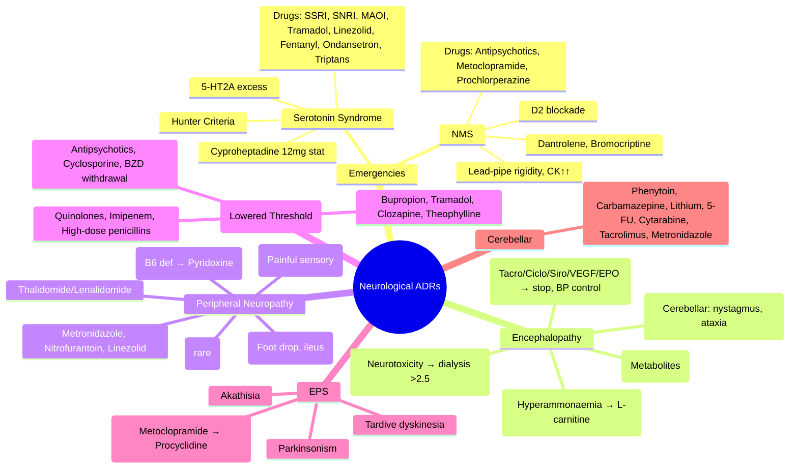

**Status**: `full-fcps-mrcp-note` | **Chapter**: 2 — Clinical Therapeutics and Good Prescribing | **Heading**: Adverse Drug Reactions → System-Specific Patterns | **Exam Priority**: ⭐⭐⭐ **HIGH** (Serotonin Syndrome, NMS, Encephalopathy, Neuropathy, Seizures — neurological emergencies)

---

## 1. 1. 🎯 Learning Objectives
- [ ] Identify drug-induced encephalopathy (metabolic, toxic, hypertensive)
- [ ] Recognise and differentiate Serotonin Syndrome vs NMS (exam favourite)
- [ ] Classify drug-induced peripheral neuropathy
- [ ] Manage drug-induced seizures (lowering threshold)
- [ ] Recognise extrapyramidal side effects (EPS) of antipsychotics/antiemetics
- [ ] Identify drugs causing headache, tremor, ataxia, cognitive impairment

---

## 2. 2. 📊 Classification of Neurological ADRs

| Syndrome | Mechanism | Key Drugs | Urgency |
|----------|-----------|-----------|---------|
| **Serotonin Syndrome** | Excess 5-HT at 5-HT2A | SSRIs, SNRIs, MAOIs, Tramadol, Linezolid, Fentanyl, Ondansetron, Triptans, Lithium, St John's Wort, Dextromethorphan | **EMERGENCY** |
| **Neuroleptic Malignant Syndrome (NMS)** | D2 blockade → dopaminergic deficit | Antipsychotics (typical > atypical), Metoclopramide, Prochlorperazine, Tetrabenazine | **EMERGENCY** |
| **Encephalopathy (Metabolic/Toxic)** | Various (ammonia, cytokines, direct toxicity) | **Valproate (hyperammonaemia), Lactulose withdrawal, IFN-α, Chemo (ifosfamide, 5-FU), Tacrolimus/Ciclosporin (PRES), Lithium, Phenytoin** | Urgent |
| **Posterior Reversible Encephalopathy Syndrome (PRES)** | Endothelial dysfunction, autoregulation failure | **Tacrolimus, Ciclosporin, Sirolimus, VEGF inhibitors, EPO, BP spikes, Eclampsia** | **EMERGENCY** |
| **Peripheral Neuropathy** | Axonal / Demyelinating / Mitochondrial | **Isoniazid (B6 deficiency), Vincristine, Bortezomib, Thalidomide, Lenalidomide, Metronidazole, Nitrofurantoin, Linezolid, Phenytoin, Amiodarone, Statins (rare)** | Subacute/Chronic |
| **Seizures (Lowered Threshold)** | GABA antagonism / Glutamate agonism / Electrolyte disturbance | **Bupropion, Tramadol, Clozapine, Theophylline, Quinolones, Imipenem, High-dose Penicillins, Antidepressants (TCAs, SSRIs), Antipsychotics, Lithium, Cyclosporine, BZD withdrawal** | Urgent |
| **Extrapyramidal Symptoms (EPS)** | D2 blockade in nigrostriatal pathway | **Typical antipsychotics > Atypical; Metoclopramide, Prochlorperazine, Tetrabenazine; Valproate (tremor)** | Acute (dystonia) → Chronic (tardive) |
| **Cerebellar Toxicity** | Purkinje cell toxicity | **Phenytoin (nystagmus, ataxia), Carbamazepine, Lithium, 5-FU, Cytarabine, Tacrolimus, Metronidazole** | Subacute |
| **Cognitive Impairment / Delirium** | Anticholinergic / GABAergic / Dopaminergic | **Anticholinergics (ACB≥3), Benzodiazepines, Opioids, Antipsychotics, H2 blockers (cimetidine), Steroids** | Acute |

---

## 3. 3. ⚡ Serotonin Syndrome vs NMS — **VIVA ESSENTIAL**

| Feature | **Serotonin Syndrome** | **Neuroleptic Malignant Syndrome (NMS)** |
|---------|------------------------|------------------------------------------|
| **Mechanism** | **Excess 5-HT at 5-HT2A** (excess release + reuptake inhibition) | **D2 receptor blockade** → central dopaminergic deficit |
| **Onset** | **Rapid** (hours after dose change/addition) | **Slow** (days–weeks) |
| **Mental Status** | **Agitation, hypervigilance, confusion** | **Stupor, mutism, catatonia** |
| **Motor** | **Clonus (spontaneous/inducible/ocular), Hyperreflexia, Tremor, Myoclonus** | **Lead-pipe rigidity, Bradykinesia, "Waxy flexibility"** |
| **Autonomic** | **Hyperthermia, Tachycardia, Hypertension, Diaphoresis, Mydriasis, Diarrhoea** | **Labile BP, Tachycardia, Fever, Diaphoresis, Incontinence** |
| **Reflexes** | **Hyperreflexia, Clonus** | **Normal or reduced** |
| **CK** | Normal or mildly ↑ | **Markedly ↑ (1000–100,000+)** |
| **Key Drugs** | **SSRIs, SNRIs, MAOIs, Tramadol, Linezolid, Fentanyl, Ondansetron, Triptans, Lithium, St John's Wort** | **Antipsychotics (haloperidol > risperidone), Metoclopramide, Prochlorperazine, Tetrabenazine** |
| **Hunter Criteria** | Spontaneous clonus OR Inducible clonus + agitation/sweating OR Ocular clonus + agitation/sweating OR Tremor + hyperreflexia OR Hypertonia + Temp >38°C + ocular/inducible clonus | Levenson: Fever + Rigidity + Altered consciousness + Autonomic instability + CK↑ + Leukocytosis |
| **Antidote** | **Cyproheptadine 12mg stat then 2mg 2-hourly** (5-HT2A antagonist) | **Dantrolene 1–2.5mg/kg IV** (ryanodine receptor) / **Bromocriptine 2.5–7.5mg/day** (D2 agonist) |
| **Supportive** | Cooling, IV fluids, Benzodiazepines (lorazepam), Stop all serotonergic drugs | Cooling, IV fluids, Stop offending drug, ICU monitoring |

---

## 4. 4. 🧠 Drug-Induced Encephalopathy

| Type | Mechanism | Key Drugs | Features |
|------|-----------|-----------|----------|
| **Valproate Hyperammonaemic Encephalopathy** | **↑ Ammonia** (inhibits carbamoyl phosphate synthetase → urea cycle) | **Valproate** (esp. high dose, polytherapy, liver disease, carnitine deficiency) | Confusion, lethargy, ↓ consciousness, **normal LFTs**, **↑ ammonia**; **L-carnitine 100mg/kg IV** |
| **Lithium Encephalopathy** | Neurotoxicity (↑ intracellular Li⁺) | Lithium (toxicity >1.5 mmol/L) | Tremor, confusion, ataxia, seizures, NDI; **dialysis if >2.5 or severe** |
| **Phenytoin Encephalopathy** | Cerebellar toxicity | Phenytoin (level >20 µg/mL) | Nystagmus, ataxia, dysarthria, confusion |
| **Immunosuppressant PRES** | Endothelial dysfunction, failed autoregulation | **Tacrolimus, Ciclosporin, Sirolimus, VEGF inhibitors, EPO** | **Headache, visual disturbances, seizures, altered consciousness**; MRI: parietal-occipital vasogenic oedema; **stop drug, BP control** |
| **Ifosfamide / 5-FU Encephalopathy** | Neurotoxic metabolites (chloroacetaldehyde) | Ifosfamide, 5-FU | Confusion, hallucinations, seizures; **methylene blue for ifosfamide** |
| **Hypertensive Encephalopathy** | BP > autoregulation limit | Any drug causing severe HTN (MAOI+tyramine, clonidine withdrawal, EPO, CNI) | Headache, visual changes, seizures; **controlled BP reduction** |

---

## 5. 5. ⚡ Peripheral Neuropathy — Drug-Induced

| Drug | Neuropathy Type | Features | Prevention/Management |
|------|-----------------|----------|----------------------|
| **Isoniazid** | **Sensory axonal** (B6 deficiency) | Stocking-glove numbness, parasthesia | **Pyridoxine (B6) 10–50mg/day prophylactically** |
| **Vincristine / Vinblastine** | **Sensorimotor axonal** (autonomic prominent) | Foot drop, ileus, orthostatic hypotension, jaw pain | Dose reduction, hold if severe |
| **Bortezomib** | **Sensory axonal** (painful) | Distal numbness, pain, allodynia | Dose reduction (1.3→0.7mg/m²), subcutaneous |
| **Thalidomide / Lenalidomide** | **Sensory axonal** (permanent risk) | Distal numbness, pain | Dose reduction, hold; **avoid in pre-existing** |
| **Metronidazole** | **Sensory axonal** (dose/duration dependent) | Peripheral neuropathy, encephalopathy | Limit duration; hold if symptoms |
| **Nitrofurantoin** | **Sensorimotor axonal** | Chronic use; may be irreversible | Avoid chronic use; monitor |
| **Linezolid** | **Sensory axonal + optic neuropathy** | >2 weeks use | Avoid >14 days if possible |
| **Phenytoin** | **Sensorimotor axonal** (chronic) | Gingival hyperplasia, ataxia, neuropathy | Monitor levels; folate supplementation |
| **Amiodarone** | **Sensorimotor axonal** (chronic) | Distal numbness, tremor | Dose reduction |
| **Statins** | Rare, immune-mediated necrotising myopathy + neuropathy | Severe weakness, ↑ CK | Stop statin; immunosuppression |

---

## 6. 6. 🎯 FCPS/MRCP High-Yield Summary

| Emergency | Key Features | Antidote/Specific Rx |
|-----------|--------------|----------------------|
| **Serotonin Syndrome** | Clonus, hyperreflexia, hypertonia, fever, tachycardia, agitation | **Cyproheptadine 12mg stat → 2mg 2-hourly**; benzodiazepines, cooling |
| **NMS** | Lead-pipe rigidity, bradykinesia, fever, CK↑↑, altered consciousness | **Dantrolene 1–2.5mg/kg IV**; Bromocriptine 2.5–7.5mg/day |
| **Valproate Encephalopathy** | Confusion, normal LFTs, **↑ ammonia** | **L-carnitine 100mg/kg IV** |
| **PRES (Tacrolimus/Ciclosporin)** | Headache, visual loss, seizures, MRI parietal-occipital oedema | **Stop drug, BP control** |
| **Lithium Toxicity** | Tremor, confusion, ataxia, seizures, NDI; level >1.5 | **Dialysis if >2.5 or severe**; fluid resuscitation |
| **INH Neuropathy** | Stocking-glove sensory | **Pyridoxine (B6) 10–50mg/day prophylaxis** |
| **Vincristine Neuropathy** | Foot drop, ileus, autonomic | Dose reduce/hold |
| **BZD Withdrawal Seizures** | Tonic-clonic, 1–7 days post-stop | **IV Lorazepam/Diazepam**; restart + slow taper |

---

## 7. 7. ❓ Viva Questions (12)

| Q | Answer |
|---|--------|
| 1. Serotonin Syndrome vs NMS — 3 key distinguishing features? | **Onset: SS rapid (hrs) vs NMS slow (days); Motor: SS clonus/hyperreflexia vs NMS lead-pipe rigidity/bradykinesia; CK: SS normal/mild vs NMS markedly ↑; Reflexes: SS hyperreflexia vs NMS normal/reduced** |
| 2. Hunter Criteria for Serotonin Syndrome? | Spontaneous clonus OR Inducible clonus + agitation/sweating OR Ocular clonus + agitation/sweating OR Tremor + hyperreflexia OR Hypertonia + Temp>38°C + ocular/inducible clonus |
| 3. Cyproheptadine dose for Serotonin Syndrome? | **12mg stat (PO/NG), then 2mg 2-hourly PRN** (max 32mg/24h); 5-HT2A antagonist |
| 4. NMS management — specific antidotes? | **Dantrolene 1–2.5mg/kg IV** (ryanodine receptor, reduces Ca²⁺ release); **Bromocriptine 2.5–7.5mg/day PO/NG** (D2 agonist); supportive cooling, fluids, stop drug |
| 5. Valproate hyperammonaemic encephalopathy — mechanism, treatment? | **Inhibits carbamoyl phosphate synthetase I → urea cycle dysfunction → ↑ ammonia**; **L-carnitine 100mg/kg IV**; stop valproate |
| 6. PRES — drugs, presentation, management? | **Tacrolimus, Ciclosporin, Sirolimus, VEGF inhibitors, EPO**; Headache, visual loss, seizures, altered consciousness; MRI: parietal-occipital vasogenic oedema; **Stop drug, controlled BP reduction** |
| 7. INH neuropathy prevention? | **Pyridoxine (B6) 10–50mg/day prophylactically** |
| 8. Vincristine neuropathy — characteristic features? | **Foot drop, ileus (autonomic), jaw pain, orthostatic hypotension**; dose-limiting |
| 9. Lithium toxicity — levels, management? | **>1.5 mmol/L = toxicity; >2.5 or severe = dialysis**; fluid resuscitation, stop lithium |
| 10. Phenytoin cerebellar toxicity — features? | **Nystagmus, ataxia, dysarthria** (level >20 µg/mL) |
| 11. Drug-induced seizure threshold lowering — 5 high-risk drugs? | **Bupropion, Tramadol, Clozapine, Theophylline, Quinolones (moxifloxacin), Imipenem, High-dose penicillins, Cyclosporine, BZD withdrawal** |
| 12. Metoclopramide acute dystonia — treatment? | **IV Procyclidine 5mg / Benztropine 1–2mg IV**; anticholinergic; diphenhydramine IV alternative |

---

## 8. 8. 🤯 Confusions & Mnemonics

| Confusion | Clarification |
|-----------|---------------|
| **Serotonin Syndrome vs NMS** | SS = **hyperreflexia, clonus, rapid onset**; NMS = **rigidity, bradykinesia, CK↑↑, slow onset** |
| **Cyproheptadine vs Dantrolene** | Cyproheptadine = **5-HT2A antagonist** (Serotonin Syndrome); Dantrolene = **ryanodine receptor antagonist** (NMS, MH) |
| **Valproate encephalopathy = liver failure?** | **No** — LFTs often normal; **ammonia ↑** due to urea cycle inhibition |
| **PRES = stroke?** | No — **vasogenic oedema**, reversible; posterior circulation (parietal-occipital) |
| **INH neuropathy = reversible?** | **Yes if caught early + B6**; may be permanent if advanced |
| **Lithium NDI vs encephalopathy** | NDI = polyuria, hypernatremia; Encephalopathy = tremor, confusion, seizures |

**Mnemonics:**
- **"HUNTER FOR SEROTONIN"** = **H**yperreflexia, **U**nderlying clonus (**inducible/spontaneous/ocular**), **N**ystagmus (no, that's phenytoin — correct: **N**o, it's **T**remor), **T**remor, **E**rrigidity (hypertonia), **R**apid onset → **Cyproheptadine**
- **"NMS = LEAD PIPE"** = **L**ead-pipe rigidity, **E**levated CK, **A**ltered consciousness, **D**ays-weeks onset; **P**yrexia, **I**nstability (autonomic), **P**allor, **E**levated WBC
- **"VALPROATE AMMONIA"** = **V**alproate → **U**rea cycle inhibition → **A**mmonia ↑ → **E**ncephalopathy → **L**-carnitine
- **"PRES DRUGS"** = **P**osterior **R**eversible **E**ncephalopathy **S**yndrome = **T**acrolimus, **C**iclosporin, **S**irolimus, **V**EGF inhibitors, **E**PO
- **"INH NEUROPATHY"** = **I**soniazid → **B**6 deficiency → **P**yridoxine prophylaxis
- **"VINCRISTINE = FOOT DROP + ILEUS"** = Sensorimotor + autonomic
- **"LITHIUM DIALYSIS"** = **>2.5 mmol/L** or **severe toxicity** → dialysis

---

## 9. 9. 🧠 Mind Map (Mermaid)

---

## 10. 10. 📅 Spaced Repetition Tracker

| Review | Date | Score | Next |
|--------|------|-------|------|
| 1 | | | 1d |
| 2 | | | 3d |
| 3 | | | 1w |
| 4 | | | 2w |
| 5 | | | 1m |
| 6 | | | 3m |

---

## 11. 11. 🧪 Self-Test Scorecard

| Section | Max | Score |
|---------|-----|-------|
| Classification table | 8 | |
| SS vs NMS comparison | 12 | |
| Encephalopathy types | 10 | |
| Peripheral neuropathy table | 10 | |
| Seizure threshold drugs | 6 | |
| Viva answers | 12 | |
| **Total** | **58** | |

**Target**: ≥46/58 (80%)

---

## 12. 12. 📝 Exam Answer Modes

### 1. Long Question (10 marks): *"Differentiate Serotonin Syndrome from Neuroleptic Malignant Syndrome. Outline management of each."*
1. **Comparison Table** (4): Mechanism, Onset, Mental status, Motor, Autonomic, Reflexes, CK, Key drugs, Antidotes, Supportive
2. **Serotonin Syndrome Management** (3): Stop all serotonergic drugs, **Cyproheptadine 12mg → 2mg 2-hourly**, Benzodiazepines, Cooling, IV fluids, ICU if severe
3. **NMS Management** (3): Stop offending drug, **Dantrolene 1–2.5mg/kg IV**, Bromocriptine 2.5–7.5mg/day, Cooling, IV fluids, ICU, avoid depolarising muscle relaxants

### 2. Short Question (5 marks): *"Hunter Criteria for Serotonin Syndrome"*
- Spontaneous clonus **OR**
- Inducible clonus + agitation/sweating **OR**
- Ocular clonus + agitation/sweating **OR**
- Tremor + hyperreflexia **OR**
- Hypertonia + Temp >38°C + ocular/inducible clonus

### 3. Viva (2 min): *"Patient on sertraline 100mg, started linezolid for MRSA. 24h later: agitated, clonus, hyperreflexia, temp 39°C, tachycardia. Diagnosis? Management?"*
- **Serotonin Syndrome** (SSRI + Linezolid = MAO inhibition)
- **Stop sertraline AND linezolid immediately**
- **Cyproheptadine 12mg stat PO/NG, then 2mg 2-hourly PRN**
- IV lorazepam 1–2mg for agitation
- Cooling, IV fluids, cardiac monitoring
- ICU if severe (hyperthermia >41°C, DIC, rhabdo)

### 4. Ward Round (30 sec): *"Patient on valproate 1500mg/day, confused, drowsy. LFTs normal. Ammonia 180 (normal <50). Diagnosis? Treatment?"*
- **Valproate hyperammonaemic encephalopathy**
- **Stop valproate**
- **L-carnitine 100mg/kg IV**
- Switch to alternative AED (levetiracetam, lamotrigine)
- Monitor ammonia, consciousness

### 5. Last-Night Revision (1-liners):
- SS = 5-HT2A excess → Clonus, Hyperreflexia, Fever → **Cyproheptadine**
- NMS = D2 blockade → Rigidity, Bradykinesia, CK↑↑ → **Dantrolene, Bromocriptine**
- Valproate encephalopathy = **Normal LFTs, ↑ Ammonia** → **L-carnitine 100mg/kg**
- PRES = Tacro/Ciclo/Siro → Headache, visual loss, seizures → **Stop drug, BP control**
- INH neuropathy = **Pyridoxine (B6) prophylaxis**
- Vincristine = Foot drop + Ileus (autonomic)
- Lithium toxicity >1.5 = toxic, >2.5 = dialysis
- Phenytoin cerebellar = Nystagmus, ataxia (level >20)
- BZD withdrawal seizure = restart + slow taper
- Metoclopramide dystonia = IV Procyclidine/Benztropine

---

## 13. 13. 📚 Summary Card

> **NEURO EMERGENCY TRIAD:**
> 1. **SEROTONIN SYNDROME** → **Clonus + Hyperreflexia + Fever** → **Cyproheptadine 12mg stat**
> 2. **NMS** → **Lead-pipe Rigidity + Bradykinesia + CK↑↑** → **Dantrolene 1–2.5mg/kg IV**
> 3. **VALPROATE ENCEPHALOPATHY** → **Confusion + Normal LFTs + ↑ Ammonia** → **L-carnitine 100mg/kg IV**
>
> **PRES** = Tacro/Ciclo/Siro → Visual loss + Seizures → **Stop drug, BP control**
> **INH Neuropathy** = **Pyridoxine (B6) prophylaxis**
> **Lithium Toxicity** >2.5 = **Dialysis**

---

## 14. 14. ❓ MCQs (15)

1. **Serotonin Syndrome — key diagnostic feature per Hunter Criteria:**
   A. Lead-pipe rigidity
   B. **Clonus (spontaneous/inducible/ocular)** ✓
   C. CK >10,000
   D. Bradykinesia
   E. Hyporeflexia

2. **NMS — characteristic motor finding:**
   A. Clonus
   B. Hyperreflexia
   C. **Lead-pipe rigidity with bradykinesia** ✓
   D. Myoclonus
   E. Tremor

3. **Cyproheptadine dose for Serotonin Syndrome:**
   A. 4mg stat
   B. 8mg stat
   C. **12mg stat, then 2mg 2-hourly** ✓
   D. 16mg stat
   E. 2mg stat

4. **Dantrolene mechanism in NMS:**
   A. 5-HT2A antagonism
   B. D2 agonism
   C. **Ryanodine receptor antagonism → inhibits Ca²⁺ release from sarcoplasmic reticulum** ✓
   D. GABA agonism
   E. Dopamine depletion

5. **Valproate hyperammonaemic encephalopathy — key lab finding:**
   A. ↑ ALT/AST
   B. **↑ Ammonia with normal LFTs** ✓
   C. ↓ Sodium
   D. ↑ CK
   E. ↑ Lactate

6. **L-carnitine dose for valproate encephalopathy:**
   A. 10mg/kg
   B. 50mg/kg
   C. **100mg/kg IV** ✓
   D. 200mg/kg
   E. 500mg/kg

7. **PRES — typical MRI finding:**
   A. Frontal lobe restricted diffusion
   B. **Parietal-occipital vasogenic oedema (T2/FLAIR hyperintensity)** ✓
   C. Basal ganglia haemorrhage
   D. Cortical restricted diffusion
   E. Cerebellar atrophy

8. **Drugs causing PRES:**
   A. Beta-blockers, ACEi
   B. **Tacrolimus, Ciclosporin, Sirolimus, VEGF inhibitors, EPO** ✓
   C. SSRIs, SNRIs
   D. Statins, Fibrates
   E. PPIs, H2 blockers

9. **Isoniazid neuropathy prevention:**
   A. Folic acid
   B. **Pyridoxine (B6) 10–50mg/day** ✓
   C. Vitamin B12
   D. Thiamine
   E. L-carnitine

10. **Vincristine neuropathy — characteristic autonomic feature:**
    A. Urinary retention
    B. **Ileus** ✓
    C. Orthostatic hypotension
    D. Erectile dysfunction
    E. Anhidrosis

11. **Lithium toxicity — dialysis threshold:**
    A. >1.0 mmol/L
    B. >1.5 mmol/L
    C. **>2.5 mmol/L (or severe toxicity at any level)** ✓
    D. >3.0 mmol/L
    E. >4.0 mmol/L

12. **Phenytoin cerebellar toxicity — features:**
    A. Tremor, rigidity
    B. **Nystagmus, ataxia, dysarthria** ✓
    C. Choreoathetosis
    D. Myoclonus
    E. Dystonia

13. **Metoclopramide acute dystonia — treatment:**
    A. IV Haloperidol
    B. **IV Procyclidine 5mg / Benztropine 1–2mg** ✓
    C. IV Lorazepam
    D. IV Phenytoin
    E. IV Levodopa

14. **Drug-induced seizure threshold lowering — highest risk antidepressant:**
    A. Sertraline
    B. **Bupropion** ✓
    C. Citalopram
    D. Mirtazapine
    E. Venlafaxine

15. **Ifosfamide encephalopathy — specific antidote:**
    A. L-carnitine
    B. **Methylene blue** ✓
    C. N-acetylcysteine
    D. Pyridoxine
    E. Flumazenil

---

## 15. 15. 🃏 Flashcards (Anki-ready)

| Front | Back |
|-------|------|
| SS key feature | Clonus (spontaneous/inducible/ocular) |
| NMS key feature | Lead-pipe rigidity + bradykinesia |
| SS vs NMS onset | SS = rapid (hours); NMS = slow (days-weeks) |
| SS vs NMS reflexes | SS = hyperreflexia/clonus; NMS = normal/reduced |
| SS vs NMS CK | SS = normal/mild ↑; NMS = markedly ↑ |
| Cyproheptadine dose | 12mg stat → 2mg 2-hourly PRN (5-HT2A antagonist) |
| Dantrolene dose | 1–2.5mg/kg IV (ryanodine receptor antagonist) |
| Bromocriptine dose | 2.5–7.5mg/day PO/NG (D2 agonist) |
| Valproate encephalopathy | Normal LFTs + ↑ ammonia → L-carnitine 100mg/kg IV |
| PRES drugs | Tacrolimus, Ciclosporin, Sirolimus, VEGF inhibitors, EPO |
| PRES MRI | Parietal-occipital vasogenic oedema |
| INH neuropathy prophylaxis | Pyridoxine (B6) 10–50mg/day |
| Vincristine neuropathy | Foot drop + Ileus (autonomic) |
| Lithium toxicity dialysis | >2.5 mmol/L or severe |
| Phenytoin cerebellar | Nystagmus, ataxia, dysarthria (level >20) |
| Metoclopramide dystonia | IV Procyclidine 5mg / Benztropine 1–2mg |
| Bupropion seizure risk | Highest among antidepressants |
| Theophylline seizure | Level >20 mg/L |
| Ifosfamide encephalopathy | Methylene blue |
| Linezolid neuropathy | >14 days use → sensory axonal + optic |

---

## 16. 16. ✅ Answer Keys

### 1. MCQs
1. **B** — Clonus is the hallmark Hunter criterion
2. **C** — Lead-pipe rigidity with bradykinesia
3. **C** — 12mg stat, then 2mg 2-hourly
4. **C** — Ryanodine receptor antagonism
5. **B** — ↑ Ammonia with normal LFTs
6. **C** — 100mg/kg IV
7. **B** — Parietal-occipital vasogenic oedema
8. **B** — Tacrolimus, Ciclosporin, Sirolimus, VEGF inhibitors, EPO
9. **B** — Pyridoxine (B6) 10–50mg/day
10. **B** — Ileus (autonomic)
11. **C** — >2.5 mmol/L or severe
12. **B** — Nystagmus, ataxia, dysarthria
13. **B** — IV Procyclidine/Benztropine (anticholinergic)
14. **B** — Bupropion highest seizure risk among antidepressants
15. **B** — Methylene blue for ifosfamide

---

*File: `/mnt/tb/Medicine/Clinical Therapeutics and Good Prescribing/ADRs/Neurological ADRs.md` | Status: `full-fcps-mrcp-note`*
