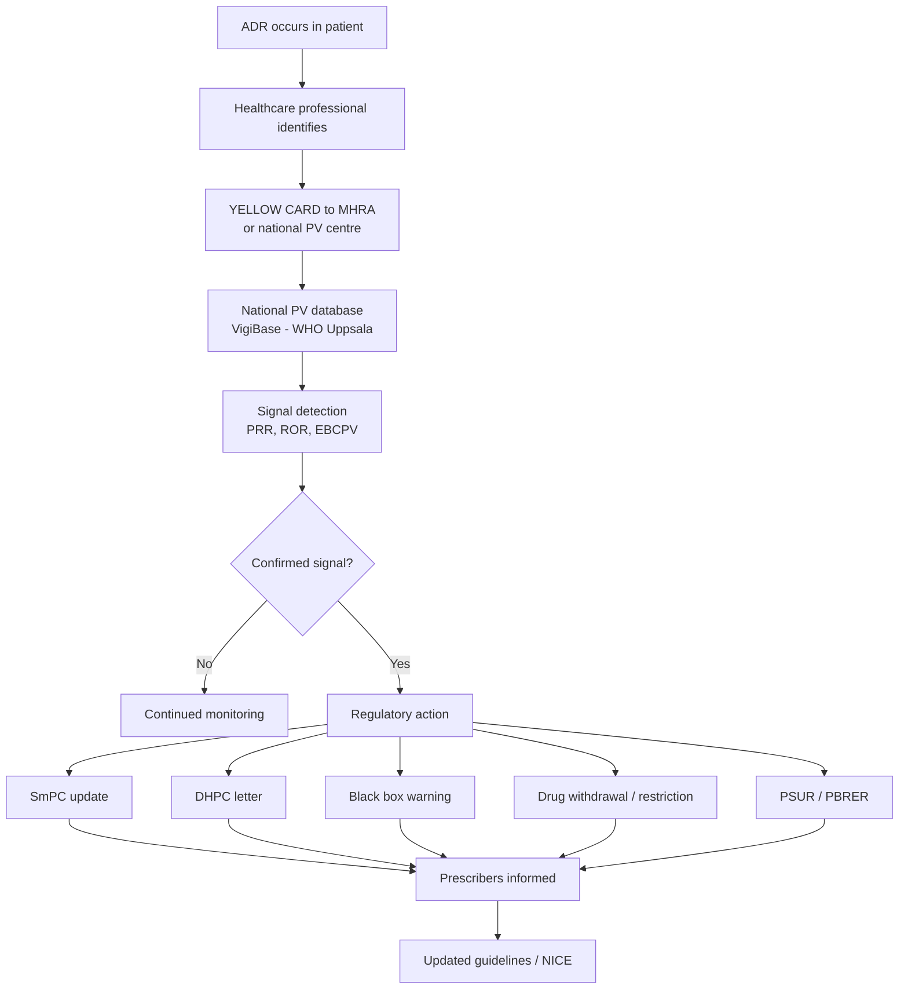
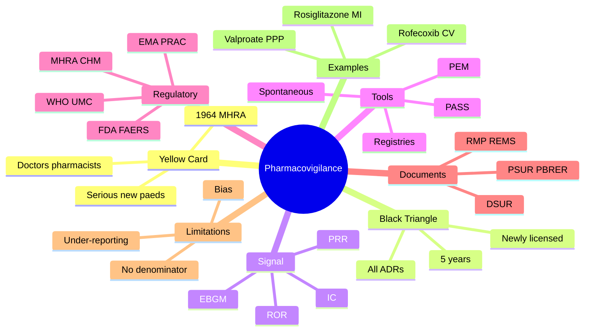

> [!info]
> **Disease-Level Topic** under **ADRs → Reporting and Pharmacovigilance**.
> Davidson 24e Ch2 — "Adverse Drug Reactions" (Maxwell SRJ).

## 1. 1. Learning Objectives
- [ ] Define **pharmacovigilance (PV)** and its purpose
- [ ] Describe the **Yellow Card Scheme (UK MHRA)**
- [ ] Identify drugs on the **Black Triangle** (▼) list
- [ ] Differentiate spontaneous reports from clinical trial data
- [ ] Explain **Phase IV surveillance** and post-marketing studies
- [ ] List WHO Pharmacovigilance Programme structure
- [ ] Discuss signal detection, PRR/ROR, PSUR/PBRER, RMP
- [ ] Recognise the role of healthcare professionals in ADR reporting

## 2. 2. Definition & Purpose

| Term | Definition |
|------|------------|
| **Pharmacovigilance** | Science and activities relating to detection, assessment, understanding, and prevention of adverse effects or any other drug-related problems (WHO) |
| **Adverse Drug Reaction (ADR)** | Noxious, unintended response at normal doses (WHO 1972) |
| **Serious ADR** | Fatal, life-threatening, hospitalising, disabling, congenital anomaly, or other medically significant |
| **Unexpected ADR** | Reaction not consistent with SmPC (Summary of Product Characteristics) |
| **Signal** | Reported information on a possible causal relationship between an ADR and a drug, not previously known or incompletely documented |

**Purpose:**
- Identify previously unknown ADRs (especially rare, delayed)
- Quantify risk (frequency, severity, populations)
- Update prescribing information (SmPC, PIL)
- Trigger regulatory action (warnings, restrictions, withdrawal)
- Support risk-benefit re-assessment

## 3. 3. Mermaid Algorithm — Pharmacovigilance Workflow

## 4. 4. Comparison Tables

### 1. 4.1 Yellow Card Scheme (UK MHRA)

| Feature | Detail |
|---------|--------|
| **Established** | 1964 (UK); 1st globally |
| **Trigger** | Thalidomide disaster (1956-62) |
| **Who reports** | Doctors, pharmacists, nurses, patients, CARs (Coroners) |
| **How** | Online, paper, app |
| **What to report** | Serious ADR; new/unexpected ADR; ADR to Black Triangle drug; ADR in child; congenital anomaly; ADR to herbal/OTC |
| **Confidentiality** | Patient identifier removed before MHRA |
| **Causality** | Not required — MHRA assesses |
| **Time** | Within 15 days for serious; ASAP |

### 2. 4.2 Black Triangle (▼) Scheme

| Feature | Detail |
|---------|--------|
| **Symbol** | ▼ (inverted black triangle) |
| **Indication** | Newly licensed drug (typically <5 yr) OR new formulation/route OR new indication |
| **Purpose** | Intensive post-marketing surveillance — ALL ADRs reportable (not just serious) |
| **List** | Updated monthly on BNF/MHRA |
| **Examples (recent)** | ▼ sacubitril-valsartan, ▼ SGLT2 inhibitors (early), ▼ CAR-T therapies, ▼ mRNA COVID vaccines, ▼ bispecific antibodies |
| **Duration** | Usually 5 yr, but may be extended if safety concerns |

### 3. 4.3 Pharmacovigilance Tools & Methods

| Tool | Description |
|------|-------------|
| **Spontaneous reports** | Voluntary (Yellow Card) — main source of signal |
| **Prescription Event Monitoring (PEM)** | UK Drug Safety Research Unit — patients identified from Rx |
| **Intensive Monitoring** | Hospital-based active surveillance |
| **Registries** | Disease-based or drug-based (e.g., TNF inhibitor registry) |
| **Sentinel Sites** | Designated hospitals for active reporting |
| **PSUR / PBRER** | Periodic Safety Update Report (now PBRER — Periodic Benefit-Risk Evaluation Report) — submitted by MAH |
| **RMP** | Risk Management Plan — proactive risk minimisation (now part of licence) |
| **PASS** | Post-Authorisation Safety Studies |
| **PAES** | Post-Authorisation Efficacy Studies |
| **DHPC** | Direct Healthcare Professional Communication — urgent safety info |

### 4. 4.4 Signal Detection — Quantitative Methods

| Measure | Formula | Interpretation |
|---------|---------|----------------|
| **PRR** (Proportional Reporting Ratio) | (a/b) / (c/d) where a=reports drug+ADR, b=reports drug only, c=reports ADR only, d=reports neither | PRR ≥2 = signal; ≥3 = strong signal |
| **ROR** (Reporting Odds Ratio) | (a × d) / (b × c) | ROR ≥2 = signal |
| **IC** (Information Component, WHO-UMC) | Bayesian shrinkage estimate | IC >0 = signal (positive) |
| **EBGM** (Empirical Bayes Geometric Mean, FDA) | Bayesian | EBGM ≥2 = signal |

### 5. 4.5 Pharmacovigilance — National & International

| Level | Body | Role |
|-------|------|------|
| **Global** | WHO Programme for International Drug Monitoring (Uppsala Monitoring Centre, UMC) | Maintains VigiBase; IC analysis; signal sharing |
| **EU** | EMA (European Medicines Agency) | PRAC (Pharmacovigilance Risk Assessment Committee) — PSUR assessment, RMP |
| **UK** | MHRA + CHM (Commission on Human Medicines) | Yellow Card; regulatory action |
| **US** | FDA (MedWatch) + FAERS | FAERS database; Sentinel System |
| **Japan** | PMDA | Japan PV system |

### 6. 4.6 Causality Assessment in PV

| Level | Description |
|-------|-------------|
| **Individual case** | Naranjo or WHO-UMC |
| **Aggregate (signal)** | PRR/ROR/IC in large database |
| **Confirmatory** | RCT, observational study, registry, case-control |

## 5. 5. FCPS/MRCP High-Yield Summary

| Pearl | Detail |
|-------|--------|
| Yellow Card established | 1964 (1st globally) |
| Trigger for UK PV | Thalidomide (phocomelia, 1956-62) |
| Threshold for strong signal (PRR) | ≥2 |
| Black Triangle duration | ~5 yr post-licensing |
| Reportable on Black Triangle | ALL ADRs (not just serious) |
| Yellow Card is for | All serious, new, or Black Triangle drug ADRs |
| Reporting ADR in child | Always report (rare events, off-label) |
| Pregnancy ADR | Always report (congenital anomalies) |
| PBRER (PSUR) | Submitted by MAH at intervals; assesses benefit-risk |
| RMP | Risk Management Plan; required for all new drugs |
| DHPC | Direct Healthcare Professional Communication — urgent safety alert |
| VigiBase | WHO global ADR database (Uppsala) |
| FAERS | FDA Adverse Event Reporting System (US) |
| Drug withdrawal example (signal) | Rofecoxib (Vioxx) 2004 — CV events; Rosiglitazone 2010 — MI |
| Spontaneous reporting limitation | Under-reporting (estimated <10%); bias; no denominator |
| When to report ADR | Any serious, new/unexpected, paediatric, congenital, or Black Triangle |

## 6. 6. Viva Questions (10)

1. **Define pharmacovigilance.**
   *The science and activities relating to the detection, assessment, understanding, and prevention of adverse effects or any other drug-related problems (WHO).*

2. **What was the trigger for modern pharmacovigilance?**
   *Thalidomide disaster (1956-62) — caused severe congenital anomalies (phocomelia) in >10,000 babies worldwide. Led to UK Yellow Card (1964) and Kefauver-Harris Amendment (US, 1962).*

3. **What is the Yellow Card Scheme? Who reports?**
   *UK MHRA's spontaneous ADR reporting system (1964). Healthcare professionals (doctors, pharmacists, nurses) and patients can report.*

4. **What should be reported via Yellow Card?**
   *All serious ADRs; new/unexpected ADRs; ADRs to Black Triangle drugs (▼); ADRs in children; congenital anomalies; ADR to herbal/OTC products.*

5. **What is the Black Triangle (▼) symbol?**
   *Inverted black triangle indicating a newly licensed drug (<5 yr) under intensive surveillance. ALL ADRs must be reported.*

6. **What is a "signal" in pharmacovigilance?**
   *Reported information on a possible causal relationship between an ADR and a drug, not previously known or incompletely documented. Detected via disproportionality analysis (PRR, ROR, IC).*

7. **What is PRR? Threshold for a signal?**
   *Proportional Reporting Ratio = (a/b)/(c/d) in spontaneous report database. PRR ≥2 = possible signal; ≥3 = strong signal.*

8. **What is PBRER?**
   *Periodic Benefit-Risk Evaluation Report (formerly PSUR) — submitted by Marketing Authorisation Holder at defined intervals, summarising global safety data and benefit-risk assessment.*

9. **What is a Risk Management Plan (RMP)?**
   *Document required for all new drug licences; describes identified risks, potential risks, missing information, and risk minimisation activities (e.g., Pregnancy Prevention Programme for thalidomide, isotretinoin, valproate).*

10. **What are the limitations of spontaneous reporting?**
    *Under-reporting (estimated <10% of serious ADRs); no denominator (cannot calculate incidence); reporter bias; duplicate reports; no comparator; confounded by polypharmacy. Must be complemented by active surveillance, registries, and analytical studies.*

## 7. 7. Confusions & Mnemonics

| Confusion | Resolution |
|-----------|------------|
| Yellow Card vs Black Triangle | Yellow = report ADR; Black Triangle = newly licensed, ALL ADRs reportable |
| PRR vs ROR | PRR = proportional reporting; ROR = odds ratio equivalent. Both used in PV. |
| ADR vs ADE | ADR = causally related; ADE = any untoward event |
| Signal vs known ADR | Signal = hypothesis; known ADR = confirmed in SmPC |
| PSUR vs PBRER | PSUR = older term; PBRER = new (2012) — assesses benefit-risk, not just safety |
| RMP vs REMS | RMP = EU; REMS = US Risk Evaluation and Mitigation Strategy |
| PBRER vs DSUR | PBRER = post-marketing; DSUR = development (annual safety report during trials) |
| Passive vs active surveillance | Passive = spontaneous (Yellow Card); Active = sentinel, registries, PEM |
| VigiBase vs FAERS | VigiBase = WHO global; FAERS = US only |
| Under-reporting reason | Time, fear of blame, unsure of causality, "well-known" ADR |
| Phase IV vs PV | Phase IV = post-marketing trials; PV = broader (spontaneous + studies) |
| Spontaneous vs stimulated reporting | Spontaneous = voluntary (Yellow Card); Stimulated = e.g., PEM |

**Mnemonic — Yellow Card: "**Y**ellow = **Y**ellow card reports all **Y**ou need (serious, new, paediatric, congenital, Black Triangle)"**

**Mnemonic — Black Triangle (▼): "**T**riangle = **T**race **T**horoughly"** (all ADRs in newly licensed drugs)

**Mnemonic — Signal threshold: "**PRR ≥2, ROR ≥2, IC >0, EBGM ≥2**"** (proportional analysis)

**Mnemonic — Reportable ADRs: "**SSNPP**"** (Serious, Suspected new, Neonate, Pregnancy, Paediatric, Plus Black Triangle)

**Mnemonic — PV hierarchy: "**G**lobal (WHO) > **R**egional (EMA) > **N**ational (MHRA) > **L**ocal (Trust)"**

## 8. 8. Mermaid Mind Map

## 9. 9. Spaced Repetition Tracker

| Topic | Day 1 | Day 3 | Day 7 | Day 14 | Day 30 |
|-------|-------|-------|-------|-------|--------|
| Yellow Card purpose | ☐ | ☐ | ☐ | ☐ | ☐ |
| Black Triangle criteria | ☐ | ☐ | ☐ | ☐ | ☐ |
| Signal definition | ☐ | ☐ | ☐ | ☐ | ☐ |
| PRR/ROR | ☐ | ☐ | ☐ | ☐ | ☐ |
| PBRER/RMP | ☐ | ☐ | ☐ | ☐ | ☐ |
| Thalidomide history | ☐ | ☐ | ☐ | ☐ | ☐ |

## 10. 10. Self-Test Scorecard

| Domain | Score (0-5) |
|--------|-------------|
| Yellow Card | /5 |
| Black Triangle | /5 |
| Signal detection | /5 |
| PRR/ROR | /5 |
| PBRER/RMP | /5 |
| PV limitations | /5 |
| **TOTAL** | **/30** |

## 11. 11. MCQs (10)

1. **The Yellow Card Scheme was established in the UK in:**
   A. 1944
   B. 1964 ✓
   C. 1984
   D. 2004
   E. 2014

2. **The trigger for modern pharmacovigilance was:**
   A. Aspirin-induced GI bleed
   B. Thalidomide disaster ✓
   C. Acetaminophen hepatotoxicity
   D. Rofecoxib CV events
   E. Pandemrix narcolepsy

3. **The Black Triangle (▼) symbol indicates:**
   A. A dangerous drug
   B. A newly licensed drug requiring intensive monitoring ✓
   C. A CD
   D. A withdrawn drug
   E. An off-label drug

4. **A signal in pharmacovigilance refers to:**
   A. A confirmed ADR
   B. A possible causal relationship not previously known ✓
   C. An SmPC update
   D. A drug withdrawal
   E. A serious ADR

5. **PRR threshold for a signal is:**
   A. ≥1
   B. ≥2 ✓
   C. ≥5
   D. ≥10
   E. ≥20

6. **PBRER is submitted by:**
   A. Doctors
   B. Pharmacists
   C. Marketing Authorisation Holder (MAH) ✓
   D. Patients
   E. Nurses

7. **Which ADR should be reported via Yellow Card?**
   A. Well-known side effect
   B. Serious, new, or Black Triangle drug ADR ✓
   C. Non-serious
   D. Common ADR in BNF
   E. Old drug reactions

8. **VigiBase is maintained by:**
   A. FDA
   B. EMA
   C. WHO Uppsala Monitoring Centre ✓
   D. MHRA
   E. NHS

9. **Rofecoxib was withdrawn in 2004 due to:**
   A. Hepatotoxicity
   B. Cardiovascular events ✓
   C. Renal failure
   D. SJS
   E. Agranulocytosis

10. **Limitations of spontaneous reporting include:**
    A. Over-reporting
    B. Has denominator
    C. Under-reporting, no denominator, bias ✓
    D. Strict causality required
    E. Population-based

## 12. 12. SBAs (5)

1. **A GP prescribes a newly licensed diabetes drug and the patient develops DKA within 2 weeks. The BEST action is:**
   - A) Stop and switch, no report
   - B) Report via Yellow Card — Black Triangle drug, ALL ADRs ✓
   - C) Wait for second case
   - D) Report to manufacturer only
   - E) Continue and observe

2. **A hospital pharmacist identifies an unusual cluster of pancreatitis cases with a gliptin. The next step is:**
   - A) Yellow Card for each
   - B) Submit aggregated signal to MHRA / CHM ✓
   - C) Wait for EMA
   - D) Publish only
   - E) Local review only

3. **An MAH submits an annual PBRER for a 10-year-old drug. The most important component is:**
   - A) Sales figures
   - B) Benefit-risk re-evaluation with cumulative safety data ✓
   - C) Marketing plan
   - D) Manufacturing data
   - E) Patent status

4. **A patient on ▼ drug develops mild headache. Should it be reported?**
   - A) No — too mild
   - B) Yes — all ADRs in Black Triangle drugs must be reported ✓
   - C) Only if serious
   - D) Only if hospitalised
   - E) Only if new

5. **Thalidomide is now used for multiple myeloma. The risk-minimisation tool is:**
   - A) Black Triangle
   - B) Pregnancy Prevention Programme (PPP) with iPLEDGE-style REMS ✓
   - C) Yellow Card
   - D) PBRER
   - E) DHPC

## 13. 13. Answer Key

### 1. MCQ Answers
1. **B** (1964 — first global PV system)
2. **B** (Thalidomide)
3. **B** (Newly licensed = intensive monitoring)
4. **B** (Possible causal relationship, new)
5. **B** (PRR ≥2)
6. **C** (MAH submits PBRER)
7. **B** (Serious, new, Black Triangle)
8. **C** (WHO Uppsala)
9. **B** (Vioxx — rofecoxib CV events)
10. **C** (Under-reporting, no denominator, bias)

### 2. SBA Answers
1. **B** — Black Triangle drug: report ALL ADRs (mild to serious).
2. **B** — Aggregated signal to MHRA/CHM (cluster suggests possible new ADR).
3. **B** — PBRER = Periodic Benefit-Risk Evaluation Report.
4. **B** — Black Triangle: all ADRs reportable, even mild.
5. **B** — Pregnancy Prevention Programme (PPP) — strict contraception, monthly pregnancy tests, iPLEDGE-style programme.

## 14. 14. Summary Box

> **Pharmacovigilance = detection, assessment, understanding, prevention of ADRs.** Yellow Card (UK, 1964) is the global template; thalidomide triggered it. Black Triangle (▼) = newly licensed, ALL ADRs reportable. Signal detection uses PRR ≥2 / ROR ≥2 / IC >0. PBRER (formerly PSUR) and RMP are regulatory tools. Spontaneous reporting has limitations: under-reporting (<10%), no denominator, bias. Examples: rofecoxib (CV), rosiglitazone (MI), valproate (PPP).

---

## 15. 15. Cross-Links
- **Parent Topic-Group**: [[../ADRs|ADRs]]
- **Sibling Topic-Groups**: [[Definition and classification]], [[Causality assessment]], [[Common ADR patterns by system]]
- **Heading Hub**: [[ADRs]]
- **Chapter MOC**: [[Clinical Therapeutics and Good Prescribing MOC]]
- **Related**: [[Drug Development and Regulation]]

**Last Updated:** 2026-06-15  
**Status: FULLY COMPLETE with Exam Suite (Viva 10, MCQ 10, SBA 5, Answer Key, Confusions, Mind Map, Spaced Repetition, Self-Test, Exam Modes)**
