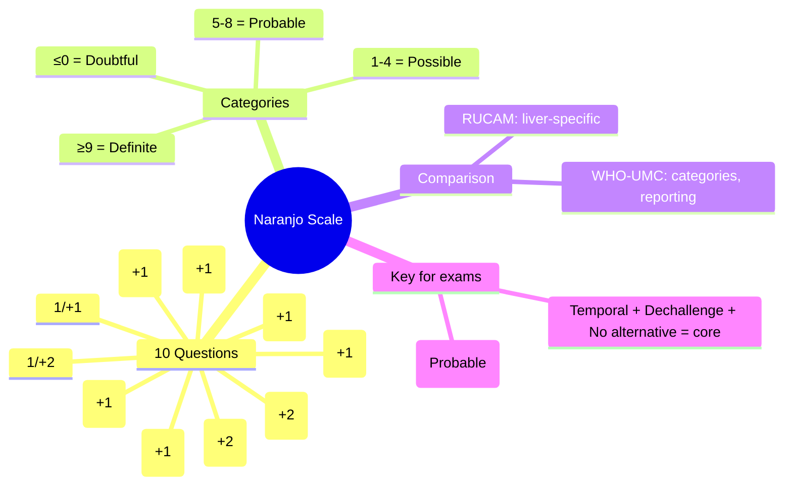

# Naranjo Probability Scale

**Status**: `draft` | **Chapter**: 2 — Clinical Therapeutics and Good Prescribing | **Heading**: Adverse Drug Reactions → Causality Assessment | **Exam Priority**: ⭐⭐ **HIGH** (Research, clinical scoring, VIVA)

---

## 🎯 Learning Objectives
- [ ] Calculate Naranjo score from 10 questions
- [ ] Interpret score categories: Definite, Probable, Possible, Doubtful
- [ ] Apply to clinical scenarios for ADR assessment
- [ ] Compare with WHO-UMC and RUCAM

---

## 📊 The 10 Questions (Score each)

| # | Question | Yes | No | Do Not Know |
|---|----------|-----|----|-------------|
| 1 | Are there previous conclusive reports on this reaction? | **+1** | 0 | 0 |
| 2 | Did the adverse event appear after the suspected drug was administered? | **+2** | -1 | 0 |
| 3 | Did the adverse reaction improve when the drug was discontinued or a specific antagonist was administered? | **+1** | 0 | 0 |
| 4 | Did the adverse reaction reappear when the drug was readministered? | **+2** | -1 | 0 |
| 5 | Are there alternative causes (other than the drug) that could have caused the reaction? | -1 | **+2** | 0 |
| 6 | Did the reaction reappear when a placebo was given? | -1 | **+1** | 0 |
| 7 | Was the drug detected in blood/other fluids in toxic concentrations? | **+1** | 0 | 0 |
| 8 | Was the reaction more severe when dose increased, or less severe when dose decreased? | **+1** | 0 | 0 |
| 9 | Did the patient have a similar reaction to the same or similar drugs in any previous exposure? | **+1** | 0 | 0 |
| 10 | Was the adverse event confirmed by objective evidence (lab, biopsy, etc.)? | **+1** | 0 | 0 |

---

## 📈 Score Interpretation

| Total Score | Category |
|-------------|----------|
| **≥9** | **Definite** |
| **5–8** | **Probable** |
| **1–4** | **Possible** |
| **≤0** | **Doubtful** |

---

## 🧮 Worked Example

**Case**: 65M on warfarin 5mg daily × 2yrs. Started clarithromycin 500mg BD for chest infection. Day 5: INR 8.2, haematuria. Clarithromycin stopped. Day 8: INR 2.8. No other drug changes. Warfarin held 2 days then restarted at lower dose.

| Q | Answer | Score |
|---|--------|-------|
| 1 | Previous reports: Clarithromycin ↑ warfarin (CYP3A4 inhibition) | **+1** |
| 2 | Event after drug: INR rise day 5 of clarithro | **+2** |
| 3 | Improved on discontinuation: INR ↓ after clarithro stopped | **+1** |
| 4 | Reappeared on readministration: Not done | 0 |
| 5 | Alternative causes: No other changes, diet stable | **+2** |
| 6 | Placebo: Not applicable | 0 |
| 7 | Drug level toxic: INR 8.2 (surrogate) | **+1** |
| 8 | Dose-response: Clarithro dose standard; warfarin held | 0 |
| 9 | Previous similar reaction: No | 0 |
| 10 | Objective evidence: INR lab value | **+1** |
| **Total** | | **8** |

**Interpretation**: **Probable** (5–8)

---

## ⚖️ Comparison: Naranjo vs WHO-UMC vs RUCAM

| Feature | **Naranjo** | **WHO-UMC** | **RUCAM** |
|---------|-------------|-------------|-----------|
| **Output** | Score (-4 to +13) → 4 categories | 6 Categories | Score (-8 to +14) → categories |
| **Questions** | 10 weighted items | Clinical judgment algorithm | 7 liver-specific domains |
| **Primary Use** | **Research, clinical trials, general ADR** | **Pharmacovigilance reporting (Yellow Card, VigiBase)** | **DILI / Hepatotoxicity specific** |
| **Rechallenge** | +2 if yes | Required for "Certain" | Key domain |
| **Dechallenge** | +1 if yes | Required for Probable/Certain | Key domain |
| **Alternative causes** | -1 to +2 (Q5) | Explicit exclusion for Probable/Certain | Major domain |
| **Inter-rater reliability** | Good (κ 0.7–0.8) | Moderate | Good (for DILI) |

---

## 🎯 FCPS/MRCP High-Yield Points

| Point | Detail |
|-------|--------|
| **Score ≥9 = Definite** | Requires rechallenge (+2) usually |
| **Score 5–8 = Probable** | Most clinical ADRs fall here |
| **Score 1–4 = Possible** | Insufficient data, alternative causes possible |
| **Score ≤0 = Doubtful** | Alternative cause likely |
| **Key questions** | Q2 (temporal), Q3 (dechallenge), Q4 (rechallenge), Q5 (alternatives), Q10 (objective) |
| **Rechallenge** | Rarely done clinically (esp. Type B); if done and +ve → strong evidence |
| **Placebo challenge** | Q6 — mostly research setting |

---

## ❓ Viva Questions (6)

| Q | Answer |
|---|--------|
| 1. How many questions in Naranjo? Score range? | 10 questions; score -4 to +13 |
| 2. Categories and cut-offs? | ≥9 Definite; 5–8 Probable; 1–4 Possible; ≤0 Doubtful |
| 3. Which questions give +2? | Q2 (temporal), Q4 (rechallenge), Q5 (alternative causes — if NO alternative = +2) |
| 4. Patient on drug develops reaction. Drug stopped, reaction improves. Not restarted. Max score? | Q1=1, Q2=2, Q3=1, Q4=0, Q5=2, Q7=1, Q10=1 → **8 (Probable)** — cannot reach Definite without rechallenge |
| 5. Naranjo vs WHO-UMC — which for Yellow Card? | **WHO-UMC** |
| 6. Limitation of Naranjo? | Rechallenge rarely done (unethical for serious ADRs); placebo challenge rarely done; subjective weighting |

---

## 🤯 Confusions & Mnemonics

| Confusion | Clarification |
|-----------|---------------|
| **Naranjo Definite vs WHO-UMC Certain** | Both need rechallenge; Naranjo ≥9, WHO-UMC Certain |
| **Q5 scoring** | **No alternative causes = +2**; Alternative causes = -1 |
| **Q6 placebo** | Rarely applicable clinically; mostly research |
| **Dose-response (Q8)** | Often unknown in clinical practice |

**Mnemonic for +2 questions**: **"TAR"** = **T**emporal (Q2), **A**lternatives absent (Q5), **R**echallenge (Q4)

---

## 🧠 Mind Map (Mermaid)

---

## 📅 Spaced Repetition Tracker

| Review | Date | Score | Next |
|--------|------|-------|------|
| 1 | | | 1d |
| 2 | | | 3d |
| 3 | | | 1w |
| 4 | | | 2w |
| 5 | | | 1m |
| 6 | | | 3m |

---

## 🧪 Self-Test Scorecard

| Section | Max | Score |
|---------|-----|-------|
| 10 Questions & scoring | 10 | |
| Categories & cut-offs | 4 | |
| Worked example | 6 | |
| Comparison table | 6 | |
| Viva answers | 6 | |
| **Total** | **32** | |

**Target**: ≥26/32 (80%)

---

## 📝 Exam Answer Modes

### Short Question (5 marks): *"Naranjo scale — questions, scoring, categories"*
List 10 questions with scores; 4 categories with cut-offs

### Viva (1 min): *"Warfarin + clarithromycin → INR 8. Naranjo score?"*
- Q1=1, Q2=2, Q3=1, Q4=0, Q5=2, Q7=1, Q10=1 → **8 = Probable**

### Last-Night Revision (1-liner):
- Naranjo: 10 Qs, score -4 to +13. ≥9 Definite, 5-8 Probable, 1-4 Possible, ≤0 Doubtful
- +2 for Temporal, Rechallenge, No Alternative
- Without rechallenge → max 8 (Probable)
- Yellow Card uses WHO-UMC, not Naranjo

---

## 📚 Summary Card

> **NARANJO ESSENTIALS:**
> - **TAR** = +2 questions: **T**emporal, **A**lternatives absent, **R**echallenge
> - **Core clinical**: Temporal + Dechallenge + No alternative = Probable (8)
> - **Definite needs Rechallenge** (rarely done)
> - **WHO-UMC for reporting**, Naranjo for research

---

## ❓ MCQs (10)

1. **Naranjo scale has how many questions?**
   A. 5
   B. **10** ✓
   C. 12
   D. 15
   E. 20

2. **Score range for Naranjo?**
   A. 0–10
   B. 1–10
   C. **-4 to +13** ✓
   D. 0–20
   E. -10 to +10

3. **Naranjo category for score of 7?**
   A. Definite
   B. **Probable** ✓
   C. Possible
   D. Doubtful
   E. Unclassifiable

4. **Which question gives +2 if NO alternative causes?**
   A. Q2
   B. Q3
   C. **Q5** ✓
   D. Q8
   E. Q10

5. **Maximum Naranjo score WITHOUT rechallenge?**
   A. 9
   B. **8** ✓
   C. 11
   D. 13
   E. 6

6. **Patient on drug develops ADR. Drug stopped, ADR resolves. Not restarted. Previous reports exist. Drug level toxic. Objective evidence. Score?**
   A. Definite
   B. **Probable** ✓
   C. Possible
   D. Doubtful
   (Q1=1, Q2=2, Q3=1, Q4=0, Q5=2, Q7=1, Q10=1 = 8)

7. **Causality assessment used for Yellow Card reporting:**
   A. Naranjo
   B. **WHO-UMC** ✓
   C. RUCAM
   D. CIOMS
   E. FDA categories

8. **RUCAM is specific for:**
   A. Cutaneous ADRs
   B. **Hepatotoxicity (DILI)** ✓
   C. Drug interactions
   D. Paediatric ADRs
   E. Anaphylaxis

9. **Q8 in Naranjo (dose-response) scores +1 if:**
   A. Dose increased and reaction worse, or dose decreased and reaction better
   B. Dose unchanged
   C. Drug stopped
   D. Alternative drug used
   E. Placebo given

10. **Naranjo "Definite" category requires which key element?**
    A. Positive dechallenge only
    B. **Positive rechallenge** ✓
    C. Drug level > toxic
    D. Previous similar reaction
    E. Placebo challenge negative

---

## 🃏 Flashcards (Anki-ready)

| Front | Back |
|-------|------|
| Naranjo questions | 10 questions, weighted -1 to +2 |
| Naranjo score range | -4 to +13 |
| Naranjo categories | ≥9 Definite, 5-8 Probable, 1-4 Possible, ≤0 Doubtful |
| +2 questions | Q2 Temporal, Q4 Rechallenge, Q5 No alternative |
| Max score without rechallenge | 8 (Probable) |
| Q5 scoring | No alternative = +2; Alternative = -1 |
| Naranjo vs WHO-UMC | Naranjo=score/research; WHO-UMC=categories/reporting |
| RUCAM use | DILI/hepatotoxicity specific |
| Yellow Card standard | WHO-UMC |

---

## ✅ Answer Keys

### MCQs
1. **B** — 10 questions
2. **C** — -4 to +13
3. **B** — 5-8 = Probable
4. **C** — Q5: no alternative = +2
5. **B** — Max 8 without rechallenge (+2)
6. **B** — 8 = Probable
7. **B** — WHO-UMC for pharmacovigilance reporting
8. **B** — RUCAM = DILI
9. **A** — Dose-response relationship
10. **B** — Rechallenge needed for Definite

---

*File: `/mnt/tb/Medicine/Clinical Therapeutics and Good Prescribing/ADRs/Causality assessment/Naranjo algorithm.md` | Status: `draft` → upgrade after review*