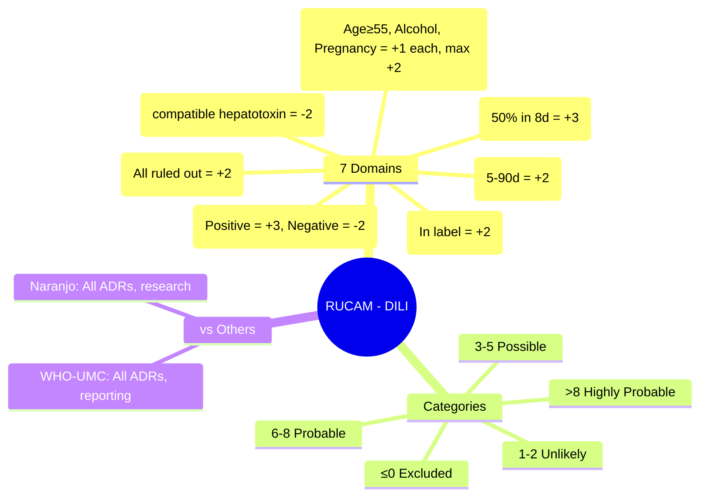

# RUCAM (Roussel Uclaf Causality Assessment Method)

**Status**: `draft` | **Chapter**: 2 — Clinical Therapeutics and Good Prescribing | **Heading**: Adverse Drug Reactions → Causality Assessment | **Exam Priority**: ⭐⭐ **HIGH** (DILI specific, regulatory standard)

---

## 🎯 Learning Objectives
- [ ] Apply RUCAM for drug-induced liver injury (DILI) causality assessment
- [ ] Score the 7 domains: Time to onset, Course, Risk factors, Concomitant drugs, Exclusion of alternatives, Previous hepatotoxicity, Rechallenge
- [ ] Interpret final score categories
- [ ] Know when to use RUCAM vs WHO-UMC vs Naranjo

---

## 📊 RUCAM Domains & Scoring

| Domain | Sub-items | Score Range |
|--------|-----------|-------------|
| **1. Time to onset** (from drug start) | 5–90 days (suggestive) / <5 or >90 (less suggestive) | **+2 to -2** |
| **2. Course after cessation** (dechallenge) | Decrease ≥50% in 8d (suggestive) / No info / Persistent | **+3 to 0** |
| **3. Risk factors** | Age ≥55 / Alcohol / Pregnancy | **+1 each (max +2)** |
| **4. Concomitant drugs** | Time compatible / Not compatible / Unknown | **+1 to -3** |
| **5. Exclusion of alternative causes** | All ruled out / Some ruled out / Not ruled out | **+2 to -3** |
| **6. Previous hepatotoxicity** | Reaction labeled in product info / Published but not labeled / Unknown | **+2 to 0** |
| **7. Rechallenge** | Positive / Negative / Not done | **+3 to -2** |

**Total Score Range: -8 to +14**

---

## 📈 Detailed Scoring

### Domain 1: Time to Onset
| Scenario | Score |
|----------|-------|
| 5–90 days after start | **+2** |
| <5 days (re-exposure) | **+1** |
| <5 days (first exposure) OR >90 days | **-1** |
| Not applicable | 0 |

### Domain 2: Course (Dechallenge)
| Scenario | Score |
|----------|-------|
| Decrease ≥50% ALT/AST within 8 days | **+3** |
| Decrease ≥50% within 30 days | **+2** |
| No information / Persistent >30 days | **0** |
| Continuous use (no cessation) | **0** |

### Domain 3: Risk Factors
| Factor | Score |
|--------|-------|
| Age ≥55 years | **+1** |
| Alcohol use (current) | **+1** |
| Pregnancy | **+1** |
| **Maximum** | **+2** |

### Domain 4: Concomitant Drugs
| Scenario | Score |
|----------|-------|
| None or incompatible timing | **0** |
| Compatible timing but not known hepatotoxin | **-1** |
| Compatible timing, known hepatotoxin | **-2** |
| Compatible timing, known hepatotoxin + positive rechallenge | **-3** |

### Domain 5: Exclusion of Alternative Causes
| Scenario | Score |
|----------|-------|
| All reasonable causes ruled out (Hep A/B/C/E, CMV, EBV, HSV, alcohol, biliary, ischaemic, autoimmune, metabolic) | **+2** |
| 5–6 causes ruled out | **+1** |
| 3–4 causes ruled out | **0** |
| <3 causes ruled out | **-2** |
| Non-hepatic cause highly probable | **-3** |

### Domain 6: Previous Hepatotoxicity
| Scenario | Score |
|----------|-------|
| Reaction in product label (SmPC) | **+2** |
| Published case reports but not in label | **+1** |
| No data / Unknown | **0** |

### Domain 7: Rechallenge
| Scenario | Score |
|----------|-------|
| Positive (ALT >2×ULN or doubling if baseline abnormal) | **+3** |
| Negative (re-exposed, no ALT rise) | **-2** |
| Not done / Not interpretable | **0** |

---

## 🏷️ Final Score Categories

| Total Score | Causality Category |
|-------------|-------------------|
| **>8** | **Highly probable** |
| **6–8** | **Probable** |
| **3–5** | **Possible** |
| **1–2** | **Unlikely** |
| **≤0** | **Excluded** |

---

## 🧮 Worked Example

**Case**: 58M, started amoxicillin-clavulanate 625mg TDS for sinusitis. Day 14: jaundice, ALT 450 (ULN 40), ALP 180 (ULN 120), Bilirubin 80. No alcohol, no other drugs. Hep A/B/C/E, CMV, EBV, autoimmune, biliary US all negative. Co-amoxiclav stopped. Day 22: ALT 180, Bilirubin 30. Product label mentions cholestatic hepatitis.

| Domain | Assessment | Score |
|--------|------------|-------|
| 1. Time to onset | 14 days (5–90) | **+2** |
| 2. Course | ALT ↓50% by day 22 (8d post-stop) | **+3** |
| 3. Risk factors | Age 58 ≥55 | **+1** |
| 4. Concomitant drugs | None | **0** |
| 5. Exclusion | All major causes ruled out (A-E, autoimmune, biliary, alcohol) | **+2** |
| 6. Previous hepatotoxicity | In product label | **+2** |
| 7. Rechallenge | Not done | **0** |
| **TOTAL** | | **10** |

**Category**: **Highly probable** (>8)

---

## ⚖️ RUCAM vs Others

| Feature | **RUCAM** | **WHO-UMC** | **Naranjo** |
|---------|-----------|-------------|-------------|
| **Specificity** | **DILI only** | All ADRs | All ADRs |
| **Structure** | 7 domains, weighted | 6 categories, algorithm | 10 questions, weighted |
| **Regulatory use** | **EMA/FDA for DILI** | Yellow Card, VigiBase | Research, clinical trials |
| **Rechallenge** | +3 / -2 | Certain only | +2 |
| **Dechallenge** | Up to +3 | Probable/Certain | +1 |
| **Alternative causes** | Detailed exclusion (5 domains) | Explicit | Q5 (-1 to +2) |

---

## 🎯 FCPS/MRCP High-Yield

| Point | Detail |
|-------|--------|
| **Use RUCAM for DILI** | Standard for regulatory, publications, expert review |
| **Time to onset** | 5–90 days = +2 (classic); <5 or >90 = less suggestive |
| **Dechallenge** | ≥50% ↓ in 8d = +3 (best score) |
| **Exclusion of alternatives** | Must rule out viral, autoimmune, biliary, alcohol, ischaemic, metabolic |
| **Rechallenge** | Rarely done; if done and positive = +3 (strongest evidence) |
| **Score >8** | Highly probable (regulatory action threshold) |

---

## ❓ Viva Questions (6)

| Q | Answer |
|---|--------|
| 1. What is RUCAM used for? | **Causality assessment for DILI (Drug-Induced Liver Injury)** |
| 2. How many domains? Score range? | 7 domains, -8 to +14 |
| 3. Time to onset scoring? | 5–90 days = +2; <5 or >90 = -1 |
| 4. Dechallenge scoring? | ≥50% ↓ ALT in 8d = +3; ≥50% in 30d = +2; no info = 0 |
| 5. What must be excluded in Domain 5? | Hep A/B/C/E, CMV, EBV, HSV, alcohol, biliary obstruction, ischaemic hepatitis, autoimmune, metabolic (Wilson's, α1-antitrypsin) |
| 6. RUCAM category for score 7? | **Probable** (6–8) |

---

## 🤯 Confusions & Mnemonics

| Confusion | Clarification |
|-----------|---------------|
| **RUCAM vs Naranjo for DILI** | RUCAM is **liver-specific**, validated for DILI; Naranjo is general |
| **RUCAM vs WHO-UMC** | RUCAM = detailed scoring for hepatotoxicity; WHO-UMC = categorical for all ADR reporting |
| **Rechallenge in DILI** | **Unethical** if severe; RUCAM gives +3 if positive, -2 if negative, 0 if not done |
| **Hy's Law vs RUCAM** | Hy's Law = prognosis (ALT>3× + Bil>2× = high mortality); RUCAM = causality |

**Mnemonic for Domains**: **"TIME COURSE RECHALLENGE"**
- **T**ime to onset
- **I**ntercurrent (Course/Dechallenge)
- **M**etabolic risk factors
- **E**xclusion of alternatives
- **C**oncomitant drugs
- **O**riginal (Previous hepatotoxicity)
- **R**echallenge
- **S**core = **E**vidence

---

## 🧠 Mind Map (Mermaid)

---

## 📅 Spaced Repetition Tracker

| Review | Date | Score | Next |
|--------|------|-------|------|
| 1 | | | 1d |
| 2 | | | 3d |
| 3 | | | 1w |
| 4 | | | 2w |
| 5 | | | 1m |
| 6 | | | 3m |

---

## 🧪 Self-Test Scorecard

| Section | Max | Score |
|---------|-----|-------|
| 7 Domains scoring | 14 | |
| Categories | 5 | |
| Worked example | 6 | |
| Comparison | 6 | |
| Viva answers | 6 | |
| **Total** | **37** | |

**Target**: ≥30/37 (80%)

---

## 📝 Exam Answer Modes

### Short Question (5 marks): *"RUCAM domains and scoring"*
List 7 domains with key scores

### Viva (1 min): *"58M, co-amoxiclav 14d, cholestatic hepatitis. All viral/autoimmune negative. Label mentions hepatotoxicity. RUCAM?"*
- Time +2, Course +3, Risk +1, Concomitant 0, Exclusion +2, Previous +2, Rechallenge 0 = **10 = Highly probable**

### Last-Night Revision (1-liner):
- RUCAM: 7 domains, -8 to +14. DILI specific. Time 5-90d=+2. Dechallenge 50%/8d=+3. Exclude all alternatives=+2. >8=Highly probable.

---

## 📚 Summary Card

> **RUCAM = DILI GOLD STANDARD**
> **7 Domains**: Time, Course, Risk, Concomitant, Exclusion, Previous, Rechallenge
> **Score >8** = Highly probable → Regulatory action
> **Use for**: DILI assessment, publications, expert committees
> **NOT for**: General ADRs (use WHO-UMC/Naranjo)

---

## ❓ MCQs (10)

1. **RUCAM is specifically designed for:**
   A. All ADRs
   B. Cutaneous ADRs
   C. **Drug-induced liver injury (DILI)** ✓
   D. Drug interactions
   E. Paediatric ADRs

2. **RUCAM total score range:**
   A. 0–10
   B. 1–10
   C. **-8 to +14** ✓
   D. -10 to +10
   E. 0–20

3. **Time to onset 5–90 days in RUCAM scores:**
   A. +1
   B. **+2** ✓
   C. +3
   D. 0
   E. -1

4. **Dechallenge: ALT decreases ≥50% within 8 days of stopping drug. Score:**
   A. +1
   B. +2
   C. **+3** ✓
   D. +4
   E. 0

5. **Maximum score for Risk Factors (Domain 3)?**
   A. +1
   B. **+2** ✓
   C. +3
   D. +4
   E. +5

6. **Exclusion of all reasonable alternative causes (Domain 5) scores:**
   A. +1
   B. **+2** ✓
   C. +3
   D. 0
   E. -1

7. **Positive rechallenge in RUCAM scores:**
   A. +1
   B. +2
   C. **+3** ✓
   D. +4
   E. 0

8. **RUCAM category for score of 9?**
   A. Probable
   B. **Highly probable** ✓
   C. Possible
   D. Unlikely
   E. Excluded

9. **Which is NOT an alternative cause to exclude in Domain 5?**
   A. Hepatitis A
   B. Autoimmune hepatitis
   C. Biliary obstruction
   D. **Myocardial infarction** ✓
   E. Alcohol

10. **RUCAM vs WHO-UMC: Which is used for Yellow Card reporting?**
    A. RUCAM
    B. **WHO-UMC** ✓
    C. Both equally
    D. Naranjo
    E. FDA MedWatch

---

## 🃏 Flashcards (Anki-ready)

| Front | Back |
|-------|------|
| RUCAM full name | Roussel Uclaf Causality Assessment Method |
| RUCAM use | DILI causality assessment (regulatory gold standard) |
| RUCAM domains | 7 domains, score -8 to +14 |
| Time to onset scoring | 5-90d = +2; <5d or >90d = -1 |
| Dechallenge scoring | ≥50% ↓ in 8d = +3; ≥50% in 30d = +2; none = 0 |
| Risk factors | Age≥55, Alcohol, Pregnancy = +1 each (max +2) |
| Exclusion alternatives | All ruled out = +2; 5-6 = +1; <3 = -2; non-hepatic probable = -3 |
| Previous hepatotox | In label = +2; published = +1; none = 0 |
| Rechallenge | Positive = +3; Negative = -2; Not done = 0 |
| RUCAM categories | >8 Highly probable; 6-8 Probable; 3-5 Possible; 1-2 Unlikely; ≤0 Excluded |

---

## ✅ Answer Keys

### MCQs
1. **C** — RUCAM = DILI specific
2. **C** — -8 to +14
3. **B** — 5–90 days = +2
4. **C** — ≥50% in 8d = +3
5. **B** — Max +2
6. **B** — All excluded = +2
7. **C** — Positive rechallenge = +3
8. **B** — >8 = Highly probable
9. **D** — MI not a hepatic alternative cause
10. **B** — Yellow Card uses WHO-UMC

---

*File: `/mnt/tb/Medicine/Clinical Therapeutics and Good Prescribing/ADRs/Causality assessment/RUCAM.md` | Status: `draft` → upgrade after review*