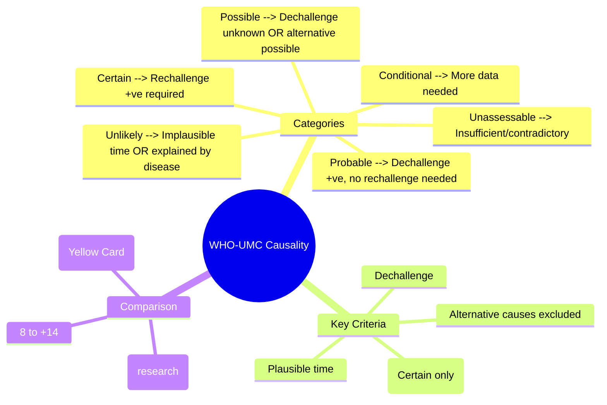

# WHO-UMC Causality Assessment

**Status**: `draft` | **Chapter**: 2 — Clinical Therapeutics and Good Prescribing | **Heading**: Adverse Drug Reactions → Causality Assessment | **Exam Priority**: ⭐⭐ **HIGH** (Standardised classification for reporting, VIVA)

---

## 🎯 Learning Objectives
- [ ] Apply WHO-UMC standardised case definitions for causality assessment
- [ ] Distinguish the 6 categories: Certain, Probable/Likely, Possible, Unlikely, Conditional/Unclassified, Unassessable
- [ ] Compare WHO-UMC vs Naranjo vs RUCAM
- [ ] Apply to clinical scenarios for Yellow Card reporting

---

## 📖 WHO-UMC Causality Categories

| Category | Criteria (ALL must be met) |
|----------|----------------------------|
| **1. Certain** | • Event + lab proof plausible time to drug<br>• Not explained by disease/other drugs<br>• **Positive dechallenge** (improvement on Stop)<br>• **Positive rechallenge** (recurrence on restart) — if done |
| **2. Probable / Likely** | • Event + lab proof plausible time to drug<br>• Not explained by disease/other drugs<br>• **Positive dechallenge**<br>• Rechallenge **not required** |
| **3. Possible** | • Event + lab proof plausible time to drug<br>• **Could be explained by disease/other drugs**<br>• Dechallenge info **incomplete/absent** |
| **4. Unlikely** | • Event + lab proof **implausible** time to drug<br>• **Explained by disease/other drugs** |
| **5. Conditional / Unclassified** | • Event + lab proof plausible time<br>• **More data needed** for assessment<br>• *Also used for reports under investigation* |
| **6. Unassessable / Unclassifiable** | • Insufficient/contradictory data<br>• Cannot be supplemented/verified |

---

## ⚖️ Comparison: WHO-UMC vs Naranjo vs RUCAM

| Feature | **WHO-UMC** | **Naranjo** | **RUCAM** |
|---------|-------------|-------------|-----------|
| **Type** | Categorical (6 classes) | Numerical score (-4 to +13) | Numerical score (-8 to +14) |
| **Use** | **Standard for pharmacovigilance reporting** (Yellow Card, VigiBase) | Clinical research, general ADR assessment | **Hepatotoxicity (DILI) specific** |
| **Dechallenge** | Required for Certain/Probable | +1 if positive | Key component |
| **Rechallenge** | Required for Certain only | +2 if positive | Key component |
| **Alternative causes** | Explicitly assessed | Scored (-1 to -2) | Major domain |
| **Previous knowledge** | Implicit | +1 if known reaction | Scored |
| **Complexity** | Low (clinical judgment) | Moderate (10 questions) | High (7 domains, liver-specific) |
| **Inter-rater reliability** | Moderate | Good | Good (for DILI) |

---

## 🔍 WHO-UMC Decision Algorithm (Simplified)

```mermaid
flowchart TD
    A[ADR Report Received] --> B{Plausible time relationship?}
    B -->|No| C[UNLIKELY]
    B -->|Yes| D{Explained by disease/other drugs?}
    D -->|Yes| C
    D -->|No| E{Dechallenge positive?}
    E -->|No/Unknown| F[POSSIBLE]
    E -->|Yes| G{Rechallenge positive?}
    G -->|Yes/Not done but certain| H[PROBABLE/LIKELY]
    G -->|Yes (done)| I[CERTAIN]
    G -->|No (done and negative)| C
```

---

## 📝 Clinical Application Examples

| Scenario | WHO-UMC Category | Reasoning |
|----------|------------------|-----------|
| Patient on warfarin → INR 8 → bleed → warfarin stopped → INR normalises → no rechallenge | **Probable** | Plausible time, not explained by disease, positive dechallenge, no rechallenge |
| Patient on allopurinol 2wk → SJS → allopurinol stopped → improves | **Probable** | Plausible time, not disease, positive dechallenge |
| Patient on allopurinol → SJS → accidentally restarted → SJS recurs | **Certain** | Positive rechallenge |
| Patient on multiple drugs (ACEi, statin, metformin) → cough → ACEi stopped → cough persists | **Unlikely** (for ACEi) | Explained by other cause (post-viral) or dechallenge negative |
| Patient on new drug → rash → drug continued → rash worsens → no dechallenge | **Possible** | Plausible time, could be disease, no dechallenge |
| Report: "Drug X caused death" — no dates, no labs, no other info | **Unassessable** | Insufficient data |

---

## 🎯 FCPS/MRCP High-Yield Points

| Point | Detail |
|-------|--------|
| **Rechallenge** | Only required for **Certain**; **never do rechallenge for Type B/SCAR** |
| **Dechallenge** | Required for **Probable** and **Certain** |
| **Time relationship** | Must be **plausible** (incubation period, half-life) |
| **Alternative causes** | Must be **excluded** for Probable/Certain |
| **Yellow Card** | Use WHO-UMC categories; **Probable + Certain = reportable** |
| **VigiBase** | WHO global DB uses WHO-UMC |

---

## ❓ Viva Questions (6)

| Q | Answer |
|---|--------|
| 1. WHO-UMC categories? | Certain, Probable/Likely, Possible, Unlikely, Conditional/Unclassified, Unassessable |
| 2. Difference between Certain and Probable? | **Certain requires positive rechallenge**; Probable has positive dechallenge but rechallenge not done/not required |
| 3. When is rechallenge absolutely contraindicated? | **Type B ADRs (SJS/TEN, DRESS, AHS, anaphylaxis, Torsades)** — never rechallenge |
| 4. Patient on drug develops rash. Drug stopped, rash improves. Not restarted. Category? | **Probable** (plausible time, not explained by disease, positive dechallenge) |
| 5. Naranjo vs WHO-UMC — which for pharmacovigilance reporting? | **WHO-UMC** (standard for Yellow Card, VigiBase, EudraVigilance) |
| 6. RUCAM is specific for which ADR type? | **Hepatotoxicity (DILI)** |

---

## 🤯 Confusions & Mnemonics

| Confusion | Clarification |
|-----------|---------------|
| **Probable vs Possible** | Probable = dechallenge positive + alternative excluded; Possible = dechallenge unknown/negative OR alternative possible |
| **Certain = rechallenge done?** | Yes — Certain **requires** positive rechallenge (or would be certain if done) |
| **WHO-UMC vs Naranjo** | WHO-UMC = categorical (reporting); Naranjo = score (research) |
| **Conditional vs Unassessable** | Conditional = more data expected; Unassessable = data insufficient/contradictory |

**Mnemonic:**
- **"C-P-P-U-C-U"** = **C**ertain, **P**robable, **P**ossible, **U**nlikely, **C**onditional, **U**nassessable
- **"Certain needs Rechallenge"** — the "C" in Certain = Re**c**hallenge

---

## 🧠 Mind Map (Mermaid)



---

## 📅 Spaced Repetition Tracker

| Review | Date | Score | Next |
|--------|------|-------|------|
| 1 | | | 1d |
| 2 | | | 3d |
| 3 | | | 1w |
| 4 | | | 2w |
| 5 | | | 1m |
| 6 | | | 3m |

---

## 🧪 Self-Test Scorecard

| Section | Max | Score |
|---------|-----|-------|
| 6 Categories definitions | 12 | |
| Comparison table | 8 | |
| Clinical scenarios | 8 | |
| Viva answers | 6 | |
| **Total** | **34** | |

**Target**: ≥27/34 (80%)

---

## 📝 Exam Answer Modes

### Short Question (5 marks): *"WHO-UMC causality categories"*
List 6 categories with 1-line criteria each

### Viva (1 min): *"Patient on allopurinol 10 days, SJS. Allopurinol stopped, improves. Causality?"*
- **Probable** — plausible time, not explained by disease, positive dechallenge, rechallenge contraindicated (Type B)

### Last-Night Revision (1-liner):
- WHO-UMC: Certain (rechallenge+), Probable (dechallenge+), Possible (maybe), Unlikely (no), Conditional (pending), Unassessable (insufficient)
- Never rechallenge Type B (SJS/TEN, DRESS, anaphylaxis)

---

## 📚 Summary Card

> **WHO-UMC HIERARCHY:**
> **Certain** > **Probable** > **Possible** > **Unlikely** > **Conditional** > **Unassessable**
>
> **KEY:** Dechallenge = Probable/Certain | Rechallenge = Certain only | **Never rechallenge SCAR**

---

## ❓ MCQs (8)

1. **Which WHO-UMC category requires a positive rechallenge?**
   A. Probable
   B. **Certain** ✓
   C. Possible
   D. Unlikely
   E. Conditional

2. **A patient on drug X develops rash. Drug stopped, rash resolves. Drug not restarted. Causality?**
   A. Certain
   B. **Probable** ✓
   C. Possible
   D. Unlikely
   E. Unassessable

3. **Patient on allopurinol 2 weeks develops SJS. Allopurinol stopped, patient improves. Rechallenge not done. WHO-UMC category?**
   A. Certain
   B. **Probable** ✓
   C. Possible
   D. Unlikely
   E. Unassessable

4. **Naranjo algorithm produces:**
   A. Categorical classification (6 classes)
   B. **Numerical score (-4 to +13)** ✓
   C. Binary yes/no
   D. Only for hepatotoxicity
   E. Only for Type A ADRs

5. **RUCAM is specifically designed for:**
   A. All ADRs
   B. Cutaneous ADRs
   C. **Hepatotoxicity (DILI)** ✓
   D. Drug interactions
   E. Paediatric ADRs

6. **Which category is used when more data is expected for assessment?**
   A. Possible
   B. Unlikely
   C. **Conditional/Unclassified** ✓
   D. Unassessable
   E. Probable

7. **Patient on 5 drugs develops cough. ACE inhibitor stopped, cough persists. Causality for ACEi?**
   A. Certain
   B. Probable
   C. Possible
   D. **Unlikely** ✓
   E. Unassessable

8. **Standard causality classification for Yellow Card / VigiBase reporting:**
   A. Naranjo
   B. **WHO-UMC** ✓
   C. RUCAM
   D. CIOMS
   E. FDA MedWatch categories

---

## 🃏 Flashcards (Anki-ready)

| Front | Back |
|-------|------|
| WHO-UMC 6 categories | Certain, Probable, Possible, Unlikely, Conditional, Unassessable |
| Certain criteria | Plausible time + not disease + dechallenge+ + **rechallenge+** |
| Probable criteria | Plausible time + not disease + **dechallenge+** (rechallenge not needed) |
| Possible criteria | Plausible time + **disease possible** OR **dechallenge unknown** |
| Unlikely criteria | Implausible time OR **explained by disease** |
| Conditional | Plausible time + **more data needed** |
| Unassessable | **Insufficient/contradictory** data |
| Never rechallenge | Type B: SJS/TEN, DRESS, AHS, Anaphylaxis, Torsades |
| WHO-UMC vs Naranjo | WHO-UMC = categorical (reporting); Naranjo = score (research) |
| RUCAM use | DILI/hepatotoxicity specific |
| Yellow Card standard | WHO-UMC |

---

## ✅ Answer Keys

### MCQs
1. **B** — Certain requires positive rechallenge
2. **B** — Positive dechallenge, no rechallenge = Probable
3. **B** — SJS = Type B, rechallenge contraindicated → Probable (dechallenge+)
4. **B** — Naranjo score -4 to +13
5. **C** — RUCAM = DILI specific
6. **C** — Conditional = more data needed
7. **D** — Dechallenge negative (cough persists) = Unlikely
8. **B** — WHO-UMC for pharmacovigilance reporting

---

*File: `/mnt/tb/Medicine/Clinical Therapeutics and Good Prescribing/ADRs/Causality assessment/WHO-UMC criteria.md` | Status: `draft` → upgrade after review*