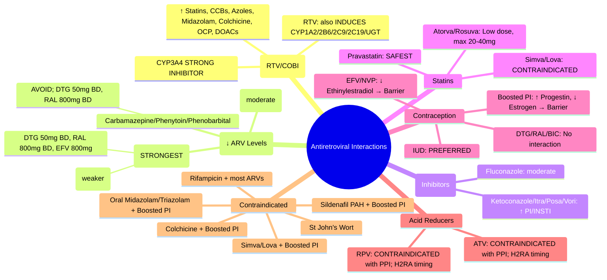

**Status**: `draft` | **Chapter**: 2 — Clinical Therapeutics and Good Prescribing | **Heading**: Drug Interactions → High-Risk Combination Profiles | **Exam Priority**: ⭐⭐⭐ **HIGH** (HIV medicine, polypharmacy, CYP3A4/UGT/P-gp complexity)

---

## 1. 1. 🎯 Learning Objectives
- [ ] Classify ARV drug classes by interaction potential (PIs, NNRTIs, INSTIs, Boosted regimens)
- [ ] Identify contraindicated combinations (CYP3A4/UGT/P-gp)
- [ ] Apply boosting principles (Ritonavir/Cobicistat) and interaction management
- [ ] Recognise key interactions: TB drugs, anticonvulsants, antifungals, statins, contraceptives, PPIs
- [ ] Execute management: dose adjust, substitute, monitor

---

## 2. 2. 📊 ARV Classes & Interaction Profiles

| Class | Drugs | **Key Enzymes/Transporters** | **Interaction Risk** |
|-------|-------|------------------------------|----------------------|
| **Protease Inhibitors (PIs)** | **Atazanavir (ATV), Darunavir (DRV), Lopinavir (LPV), Ritonavir (RTV)** | **CYP3A4 SUBSTRATE + STRONG INHIBITOR** (esp. RTV); P-gp substrate + inhibitor | **HIGHEST** — Inhibit CYP3A4, CYP2D6, P-gp, UGT1A1; ↑ levels of co-meds |
| **Pharmacokinetic Boosters** | **Ritonavir (RTV) 100mg, Cobicistat (COBI) 150mg** | **RTV: CYP3A4 STRONG INHIBITOR + INDUCER (CYP1A2, 2B6, 2C9, 2C19, UGT)**
**COBI: CYP3A4 STRONG INHIBITOR (no induction)** | **CRITICAL** — Boost PI/INSTI levels; inhibit CYP3A4/P-gp of co-meds |
| **NNRTIs** | **Efavirenz (EFV), Nevirapine (NVP), Rilpivirine (RPV), Doravirine (DOR), Etravirine (ETR)** | **EFV/NVP: CYP3A4 INDUCER + INHIBITOR (mixed)**
**RPV/DOR: CYP3A4 SUBSTRATE (no induction)**
**ETR: CYP3A4 INHIBITOR, CYP2B6/2C9/2C19 INDUCER** | **HIGH** — EFV/NVP induce CYP3A4 (↓ co-med levels); RPV/DOR need acid |
| **INSTIs** | **Raltegravir (RAL), Dolutegravir (DTG), Bictegravir (BIC), Cabotegravir (CAB)** | **RAL: UGT1A1 substrate (no CYP)**
**DTG/BIC: CYP3A4 + UGT1A1 substrate**
**CAB: UGT1A1 substrate** | **LOW–MODERATE** — RAL fewest CYP interactions; DTG/BIC need CYP3A4/UGT1A1 consideration |
| **NRTIs** | **Tenofovir (TDF/TAF), Abacavir (ABC), Lamivudine (3TC), Emtricitabine (FTC), Zidovudine (AZT)** | **Renal transporters (TDF/TAF: OAT1/3, P-gp; ABC: UGT); No CYP** | **LOW** — Mainly renal (TDF); ABC hypersensitivity (HLA-B*57:01) |

---

## 3. 3. ⚡ Critical Interaction Categories

### 1. 1. **TB Drugs (Rifamycins) — CONTRAINDICATED with most ARVs**
| Rifamycin | Effect on ARVs | Management |
|-----------|----------------|------------|
| **Rifampicin** | **↓ PI/INSTI/NNRTI levels 80–95% (CYP3A4/P-gp induction)** | **CONTRAINDICATED with most PIs, INSTIs (DTG/BIC), RPV/DOR** |
| | **EFV: ↓ levels ~25% → ↑ EFV dose to 800mg (if weight>50kg)** | EFV: ↑ to 800mg (with TDM) |
| | **DTG: ↓ levels ~50% → ↑ DTG to 50mg BD** | DTG: 50mg BD with rifampicin |
| | **RAL: ↓ levels ~40% → ↑ RAL to 800mg BD** | RAL: 800mg BD |
| **Rifabutin** | **Weaker inducer (~50% effect)** | **Preferred over rifampicin**; ↓ PI dose (e.g., ATV/r 300/100mg daily); monitor |
| | **DTG: standard dose** | DTG 50mg OD |

> **Rifampicin + ARV = MAJOR interaction** — **Avoid if possible; use rifabutin or adjust ARV per guidelines**

### 2. 2. **Anticonvulsants (Enzyme Inducers) — MAJOR**
| Anticonvulsant | Effect on ARVs | Management |
|----------------|----------------|------------|
| **Carbamazepine, Phenytoin, Phenobarbital** | **↓ PI/INSTI/NNRTI levels (CYP3A4/UGT induction)** | **AVOID if possible**; use non-inducing AEDs (Levetiracetam, Lamotrigine, Lacosamide, Valproate) |
| | **EFV: ↓ levels ~25%** | TDM if EFV used |
| | **DTG: ↓ levels ~50% → DTG 50mg BD** | DTG 50mg BD |
| | **RAL: ↓ levels ~40% → RAL 800mg BD** | RAL 800mg BD |
| | **RPV/DOR: CONTRAINDICATED** | **AVOID** |
| **Valproate, Levetiracetam, Lamotrigine, Lacosamide, Gabapentin, Pregabalin** | **No significant CYP induction** | **Preferred AEDs for HIV patients** |

### 3. 3. **Antifungals (Azoles) — MAJOR (CYP3A4 Inhibition)**
| Azole | Effect on ARVs | Management |
|-------|----------------|------------|
| **Ketoconazole, Itraconazole, Posaconazole, Voriconazole** | **↑ PI/INSTI levels (CYP3A4 inhibition)** | **Monitor for toxicity**; dose adjust PI; avoid with some NNRTIs |
| | **DTG/BIC: ↑ levels ~20–30%** | Usually no dose change; monitor |
| | **RAL: No significant interaction** | Safe |
| **Fluconazole** | **Moderate CYP3A4 inhibition; ↑ PI levels** | Monitor; ↓ PI dose if needed |
| | **DTG/BIC: Minimal** | Usually no dose change |

### 4. 4. **Statins — HIGH RISK (Myopathy/Rhabdo)**
| Statin | **Preferred with ARVs** | **Avoid / Dose Limit** |
|--------|------------------------|------------------------|
| **Atorvastatin** | **Start LOW (10mg), max 20–40mg** | Avoid >40mg with boosted PI |
| **Rosuvastatin** | **Start LOW (5–10mg), max 20mg** | Avoid >20mg with boosted PI |
| **Pravastatin** | **Preferred (minimal CYP3A4)** | **SAFEST** with boosted PI |
| **Simvastatin / Lovastatin** | — | **CONTRAINDICATED with boosted PI/Cobi** (↑ AUC 10–20x) |
| **Fluvastatin / Pitavastatin** | **Low interaction** | Generally safe |

### 5. 5. **Hormonal Contraception — COMPLEX**
| Contraceptive | Interaction | Management |
|---------------|-------------|------------|
| **Combined OCP (Estrogen + Progestin)** | **EFV/NVP/ETR/Rifampicin: ↓ Ethinylestradiol (↑ failure risk)** | **Add barrier method**; consider alternative ARV |
| | **Boosted PI: ↑ Progestin (↑ side effects); ↓ Ethinylestradiol** | **Add barrier method** |
| | **DTG/RAL/BIC: No significant interaction** | OK |
| **Progestin-only Pill / Implant / Injection** | **EFV/NVP: ↓ Progestin (↑ failure)** | **Add barrier method**; avoid implant with EFV |
| | **Boosted PI: ↑ Progestin** | Usually OK |
| **IUD (Cu/IUS)** | **No interaction** | **PREFERRED** (no enzyme interaction) |

### 6. 6. **PPIs / Acid-Reducing Agents — RPV/DOR/ATV/LEDIPASVIR**
| Acid Reducer | Affected ARV | Management |
|--------------|--------------|------------|
| **PPI** | **Rilpivirine (RPV) — CONTRAINDICATED** (↓ absorption) | Use H2RA (famotidine) 12h before or 4h after RPV |
| | **Atazanavir (ATV) — CONTRAINDICATED** (↓ absorption) | Avoid PPI; use H2RA 10h before/2h after |
| | **Ledipasvir (in Harvoni) — ↓ absorption** | Separate 4h |
| **H2RA** | **RPV — Take 12h before or 4h after** | OK with timing |
| | **ATV — Take 10h before or 2h after** | OK with timing |
| **Antacids** | **General separation 2h** | Standard |

### 7. 7. **Other Key Interactions**
| Drug | ARV Interaction | Management |
|------|-----------------|------------|
| **Colchicine** | **Boosted PI: ↑ Colchicine → Toxicity (myopathy, neuropathy)** | **CONTRAINDICATED** with boosted PI; avoid |
| **Sildenafil/Tadalafil (PAH)** | **Boosted PI: ↑ Levels → Hypotension, Priapism** | **CONTRAINDICATED** for PAH; reduce dose for ED (Sildenafil max 25mg/48h) |
| **Midazolam/Triazolam (Oral)** | **Boosted PI: ↑ Levels → Excessive sedation** | **CONTRAINDICATED** (IV midazolam OK with monitoring) |
| **Rifampicin** | See #1 | See #1 |
| **St John's Wort** | **Induces CYP3A4/P-gp → ↓ ARV levels** | **CONTRAINDICATED** |

---

## 4. 4. 🎯 FCPS/MRCP High-Yield Summary

| Pearl | Details |
|-------|---------|
| **Boosted PI (RTV/COBI)** | **Strong CYP3A4 inhibitor** — ↑ levels of co-meds (statins, azoles, CCBs, oral midazolam, colchicine, sildenafil PAH) |
| **EFV/NVP/Rifampicin** | **CYP3A4 inducers** — ↓ levels of PIs, INSTIs, NNRTIs, OCP |
| **Rifampicin + ARV** | **Contraindicated with most** — use rifabutin or adjust (DTG 50mg BD, RAL 800mg BD, EFV 800mg) |
| **Enzyme-inducing AEDs** | **Carbamazepine/Phenytoin/Phenobarbital** — avoid; use Levetiracetam/Lamotrigine |
| **Statins + Boosted PI** | **Pravastatin safest**; Atorva/Rosuva low dose; Simva/Lova CONTRAINDICATED |
| **OCP + EFV/Boosted PI** | **Add barrier method** — ↓ ethinylestradiol |
| **RPV/DOR + PPI** | **CONTRAINDICATED** — use H2RA with timing |
| **ATV + PPI** | **CONTRAINDICATED** |

---

## 5. 5. ❓ Viva Questions (10)

| Q | Answer |
|---|--------|
| 1. Ritonavir/Cobicistat boosting — effect on CYP3A4? | **Strong CYP3A4 inhibition** → ↑ levels of substrate drugs (statins, CCBs, azoles, midazolam, colchicine, OCP, DOACs) |
| 2. Rifampicin + Dolutegravir — management? | **Rifampicin induces CYP3A4/UGT1A1 → ↓ DTG ~50%** → **DTG 50mg BD** (instead of 50mg OD) |
| 3. Enzyme-inducing anticonvulsant + DTG — dose? | **Carbamazepine/Phenytoin/Phenobarbital → DTG 50mg BD** (instead of OD) |
| 4. Simvastatin + Darunavir/Ritonavir — safe? | **NO** — **CONTRAINDICATED** (↑ simvastatin AUC 10–20x → rhabdo); use **Pravastatin** |
| 5. Rilpivirine + PPI — why contraindicated? | **RPV requires acidic pH for absorption**; PPI ↓ absorption → virological failure |
| 6. EFV + Combined OCP — management? | **EFV induces CYP3A4 → ↓ ethinylestradiol** → **Add barrier method**; consider alternative ARV |
| 7. Carbamazepine + Atazanavir/Ritonavir — management? | **Carbamazepine induces CYP3A4 → ↓ ATV/RTV levels** → **AVOID**; switch to non-inducing AED (Levetiracetam) |
| 8. Colchicine + Lopinavir/Ritonavir — safe? | **NO** — **CONTRAINDICATED** (↑ colchicine → fatal myopathy/neuropathy) |
| 9. Hormonal implant + Efavirenz — failure risk? | **YES** — EFV induces metabolism → ↓ progestin → **Add barrier method**; avoid implant with EFV |
| 10. St John's Wort + ARVs — effect? | **Induces CYP3A4/P-gp → ↓ ARV levels** → **CONTRAINDICATED** |

---

## 6. 6. 🤯 Confusions & Mnemonics

| Confusion | Clarification |
|-----------|---------------|
| **Ritonavir vs Cobicistat** | **RTV: CYP3A4 inhibitor + INDUCER (CYP1A2, 2B6, 2C9, 2C19, UGT)**; **COBI: Pure CYP3A4 inhibitor** (no induction) |
| **DTG with Rifampicin vs Carbamazepine** | Both induce → **DTG 50mg BD** for both |
| **RAL vs DTG with Rifampicin** | **RAL: 800mg BD**; **DTG: 50mg BD** |
| **Pravastatin vs Simvastatin** | **Pravastatin = minimal CYP3A4 (safe)**; **Simvastatin = CYP3A4 substrate (CONTRAINDICATED with boosted PI)** |
| **RPV + PPI = CONTRAINDICATED** | RPV needs acid; **ATV also CONTRAINDICATED with PPI** |
| **EFV + OCP** | EFV ↓ ethinylestradiol → **barrier method** |

**Mnemonics:**
- **"RTV = BOOSTER = CYP3A4 INHIBITOR"** = ↑ statins, CCBs, azoles, midazolam, colchicine, OCP, DOACs
- **"RIFAMPICIN = INDUCER = KILLS ARV LEVELS"** = Use rifabutin or adjust (DTG BD, RAL BD, EFV 800mg)
- **"EIAED = NO WITH ARV"** = Carbamazepine, Phenytoin, Phenobarbital → use Levetiracetam, Lamotrigine
- **"STATINS + BOOSTED PI"** = **Pravastatin SAFE**; Atorva/Rosuva LOW DOSE; Simva/Lova NO
- **"RPV = ACID LOVER"** = NO PPI; H2RA with timing
- **"EFV + OCP = BARRIER METHOD"**
- **"COLCHICINE + BOOSTED PI = NO"**
- **"ST JOHN'S WORT = INDUCER = KILLS ARV"**

---

## 7. 7. 🧠 Mind Map (Mermaid)

---

## 8. 8. 📅 Spaced Repetition Tracker

| Review | Date | Score | Next |
|--------|------|-------|------|
| 1 | | | 1d |
| 2 | | | 3d |
| 3 | | | 1w |
| 4 | | | 2w |
| 5 | | | 1m |
| 6 | | | 3m |

---

## 9. 9. 🧪 Self-Test Scorecard

| Section | Max | Score |
|---------|-----|-------|
| ARV classes & enzymes | 8 | |
| Rifampicin interactions | 8 | |
| AED interactions | 8 | |
| Statin safety | 6 | |
| Contraception | 6 | |
| Acid reducers | 6 | |
| Contraindicated combos | 6 | |
| Viva answers | 10 | |
| **Total** | **56** | |

**Target**: ≥45/56 (80%)

---

## 10. 10. 📝 Exam Answer Modes

### 1. Short Question (5 marks): *"Rifampicin interactions with ARVs and management."*
- **Rifampicin = Strong CYP3A4/P-gp/UGT inducer** → ↓ PI/INSTI/NNRTI levels 80–95%
- **Contraindicated with most PIs, INSTIs (DTG/BIC), RPV/DOR**
- **Management**: **Use Rifabutin (weaker inducer)** OR adjust ARV:
  - **DTG: 50mg BD** (instead of OD)
  - **RAL: 800mg BD** (instead of 400mg BD)
  - **EFV: 800mg OD** (if >50kg, with TDM)
- **Avoid St John's Wort** (also induces)

### 2. Viva (1 min): *"Patient on Darunavir/Ritonavir needs simvastatin for hyperlipidaemia. Safe?"*
- **NO** — **Ritonavir strongly inhibits CYP3A4 → ↑ Simvastatin AUC 10–20x → Rhabdomyolysis risk**
- **Contraindicated**
- **Use Pravastatin** (minimal CYP3A4 metabolism) — **SAFEST**
- Alternative: Atorvastatin 10–20mg max or Rosuvastatin 5–20mg max with monitoring

### 3. Ward Round (30 sec): *"HIV patient on Efavirenz, started on Carbamazepine for seizures. Viral load rising. Why?"*
- **Carbamazepine induces CYP3A4 → ↑ Efavirenz metabolism → ↓ Efavirenz levels → Virological failure**
- **AVOID Carbamazepine** with EFV
- **Switch to Levetiracetam/Lamotrigine/Lacosamide** (non-inducing)
- Monitor viral load, EFV level if available

### 4. Last-Night Revision (1-liners):
- RTV/COBI = CYP3A4 inhibitor → ↑ co-med levels
- Rifampicin = inducer → DTG BD, RAL BD, EFV 800mg; use Rifabutin
- EIAEDs (Carba/Phenytoin/Phenobarb) = avoid with ARV; use LEV/LTG/LCM
- Statins + boosted PI: Pravastatin safest; Simva/Lova NO
- OCP + EFV/Boosted PI = barrier method
- RPV/DOR + PPI = CONTRAINDICATED
- ATV + PPI = CONTRAINDICATED
- Colchicine + Boosted PI = NO
- St John's Wort = inducer = NO

---

## 11. 11. 📚 Summary Card

> **ARV INTERACTIONS:**
> **BOOSTED PI (RTV/COBI)** = CYP3A4 INHIBITOR → ↑ Statins, CCBs, Azoles, Midazolam, Colchicine, OCP, DOACs
> **RIFAMPICIN** = INDUCER → DTG BD, RAL BD, EFV 800mg; **USE RIFABUTIN**
> **EIAEDs (Carba/PHT/PB)** = INDUCERS → AVOID; Use LEV/LTG/LCM
> **STATINS + BOOSTED PI** = PRAVASTATIN SAFE; Simva/Lova NO
> **RPV/ATV + PPI** = CONTRAINDICATED
> **EFV + OCP** = BARRIER METHOD
> **COLCHICINE + BOOSTED PI** = NO
> **ST JOHN'S WORT** = INDUCER = NO

---

## 12. 12. ❓ MCQs (12)

1. **Ritonavir/Cobicistat boosting — primary mechanism:**
   A. CYP3A4 induction
   B. **CYP3A4 inhibition** ✓
   C. P-gp induction
   D. UGT inhibition
   E. No CYP effect

2. **Rifampicin + Dolutegravir — correct DTG dose:**
   A. 50mg OD
   B. **50mg BD** ✓
   C. 50mg TDS
   D. 100mg OD
   E. Contraindicated

3. **Simvastatin + Darunavir/Ritonavir — management:**
   A. Safe at standard dose
   B. Reduce simvastatin to 10mg
   C. **Contraindicated; use Pravastatin** ✓
   D. Monitor CK only
   E. Switch to rosuvastatin 40mg

4. **Rilpivirine + PPI — contraindicated because:**
   A. ↑ RPV levels
   B. **↓ RPV absorption (requires acidic pH)** ✓
   C. ↑ PPI levels
   D. QT prolongation
   E. Hepatotoxicity

5. **Enzyme-inducing AED + DTG — DTG dose:**
   A. 50mg OD
   B. **50mg BD** ✓
   C. 50mg TDS
   D. 100mg OD
   E. Contraindicated

6. **EFV + Combined OCP — management:**
   A. No action needed
   B. **Add barrier method** ✓
   C. Increase OCP dose
   D. Stop EFV
   E. Switch to progestin-only

7. **Pravastatin + Boosted PI — safe because:**
   A. CYP3A4 inducer
   B. **Minimal CYP3A4 metabolism** ✓
   C. P-gp inhibitor
   D. UGT substrate
   E. No interaction

8. **Carbamazepine + Atazanavir/Ritonavir — management:**
   A. Increase ATV dose
   B. **AVOID; switch to non-inducing AED** ✓
   C. Monitor ATV level only
   D. Reduce RTV dose
   E. No interaction

9. **Colchicine + Lopinavir/Ritonavir:**
   A. Safe
   B. Reduce colchicine dose
   C. **Contraindicated** ✓
   D. Monitor renal function
   E. Use alternative PI

10. **St John's Wort + ARVs:**
    A. Safe
    B. **Induces CYP3A4/P-gp → ↓ ARV levels; Contraindicated** ✓
    C. Inhibits CYP3A4
    D. No interaction
    E. Only affects NNRTIs

11. **Atazanavir + PPI:**
    A. Safe
    B. **Contraindicated** ✓
    C. Dose adjust PPI
    D. Separate by 2h
    E. Use H2RA instead

12. **Raltegravir + Rifampicin — RAL dose:**
    A. 400mg BD
    B. **800mg BD** ✓
    C. 400mg TDS
    D. 1200mg BD
    E. Contraindicated

---

## 13. 13. 🃏 Flashcards (Anki-ready)

| Front | Back |
|-------|------|
| RTV/COBI mechanism | CYP3A4 inhibition → ↑ co-med levels |
| Rifampicin + DTG | DTG 50mg BD |
| Rifampicin + RAL | RAL 800mg BD |
| Rifampicin + EFV | EFV 800mg (with TDM) |
| EIAEDs + ARV | Avoid; use LEV/LTG/LCM/VPA |
| Statins + Boosted PI | Pravastatin SAFE; Atorva/Rosuva low dose; Simva/Lova NO |
| RPV + PPI | CONTRAINDICATED (needs acid) |
| ATV + PPI | CONTRAINDICATED |
| EFV + OCP | Barrier method |
| Colchicine + Boosted PI | Contraindicated |
| St John's Wort | Inducer → ↓ ARV levels |
| ATV + H2RA | Separate 10h before/2h after |
| RPV + H2RA | 12h before or 4h after |

---

## 14. 14. ✅ Answer Keys

### 1. MCQs
1. **B** — CYP3A4 inhibition
2. **B** — 50mg BD
3. **C** — Contraindicated; use Pravastatin
4. **B** — ↓ RPV absorption (requires acidic pH)
5. **B** — 50mg BD
6. **B** — Add barrier method
7. **B** — Minimal CYP3A4 metabolism
8. **B** — AVOID; switch to non-inducing AED
9. **C** — Contraindicated
10. **B** — Induces CYP3A4/P-gp → ↓ ARV levels; Contraindicated
11. **B** — Contraindicated
12. **B** — 800mg BD

---

*File: `/mnt/tb/Medicine/Clinical Therapeutics and Good Prescribing/Drug Interactions/Antiretroviral interactions.md` | Status: `draft` → upgrade after review*

## PasTest Scenario SBAs (Clinical Vignettes)

> **Auto-generated PasTest/Mediscope-style scenario SBAs** grounded in the authored source. Each scenario tests a real clinical fact (triad, specific sign, contraindication, trial, first-line Rx) extracted from the topic. *Source: Ch 2: Clinical Therapeutics — Antiretroviral interactions*

**Q1.** What is the most appropriate first-line therapy for Antiretroviral interactions?

  - **A.** Simva/Lova: CONTRAINDICATED
  - **B.** An advanced/surgical therapy reserved for refractory disease
  - **C.** Symptomatic treatment only, no disease-modifying therapy
  - **D.** Empiric broad-spectrum therapy without specific indication

  > **Answer: A** — Simva/Lova: CONTRAINDICATED
  >
  > *Source:* B --> Boosted PI (RTV/COBI) or EVG/c  C[**Simva/Lova: CONTRAINDICATED** Atorva: max 20mg (or 10mg with DRV/r) **PREFERRED: Pravastatin, Rosuvastatin** Rosuva max 10mg with DRV/r/ATV/r/COBI<br

