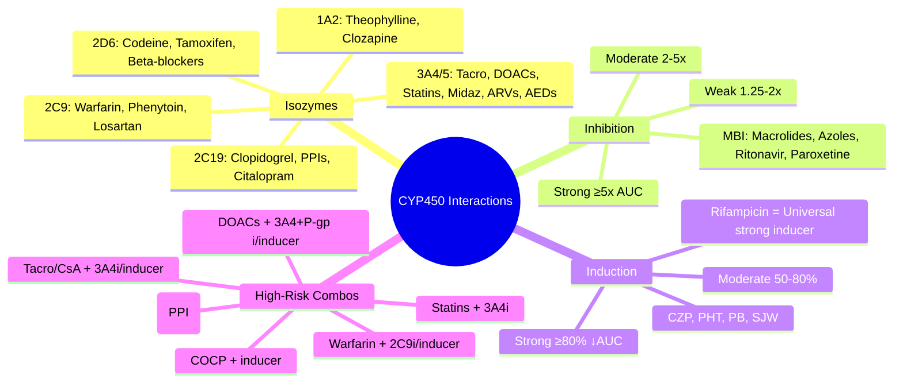

**Status**: `draft` | **Chapter**: 2 — Clinical Therapeutics and Good Prescribing | **Heading**: Drug Interactions → Metabolism Interactions | **Exam Priority**: ⭐⭐⭐ **HIGHEST** (Warfarin, DOACs, Immunosuppressants, ARVs, AEDs, Statins — daily clinical practice)

---

## 1. 1. 🎯 Learning Objectives
- [ ] Recall major CYP isozymes: 1A2, 2C9, 2C19, 2D6, 3A4/5 — substrates, inhibitors, inducers
- [ ] Predict interaction magnitude: strong/moderate/weak inhibitor/inducer
- [ ] Apply to high-risk drug combinations (Warfarin, DOACs, Tacrolimus, Statins, Clopidogrel, ARVs)
- [ ] Calculate dose adjustments and monitoring strategies
- [ ] Distinguish mechanism-based (MBI) vs reversible inhibition

---

## 2. 2. 🧬 CYP450 Isozymes — High-Yield Table

| Isozyme | % Hepatic CYP | Key Substrates (Exam Drugs) | Strong Inhibitors | Moderate Inhibitors | Strong Inducers |
|---------|---------------|----------------------------|-------------------|---------------------|-----------------|
| **CYP1A2** | ~13% | Theophylline, Clozapine, Olanzapine, Caffeine, Tacrine, Ropinirole | **Fluvoxamine**, Ciprofloxacin, Enoxacin | Amiodarone, Oral contraceptives | **Tobacco smoke**, Omeprazole, Insulin, Charcoal-broiled food |
| **CYP2C9** | ~18% | **Warfarin (S-warfarin)**, Phenytoin, Losartan, Irbesartan, Glipizide, Celecoxib, Ibuprofen, Amitriptyline | **Fluconazole**, Voriconazole, Miconazole, Sulfaphenazole, Amiodarone | Metronidazole, Trimethoprim, Fluvastatin | **Rifampicin**, Carbamazepine, Phenytoin, St John's Wort |
| **CYP2C19** | ~4% | **Clopidogrel (activation)**, Omeprazole, Esomeprazole, Lansoprazole, Citalopram, Escitalopram, Diazepam, Propranolol | **Fluvoxamine**, Fluoxetine, Ticlopidine, Voriconazole | Omeprazole, Esomeprazole, Fluoxetine, Sertraline | **Rifampicin**, Carbamazepine, Phenytoin, St John's Wort |
| **CYP2D6** | ~2% (high polymorphism) | **Codeine, Tramadol, Tamoxifen**, Metoprolol, Propranolol, Flecainide, Thioridazine, Haloperidol, Risperidone, Aripiprazole, Venlafaxine, Duloxetine, Paroxetine | **Paroxetine, Fluoxetine, Bupropion, Quinidine, Cinacalcet** | Duloxetine, Terbinafine | **Rifampicin** (weak), Dexamethasone |
| **CYP3A4/5** | ~30% (most abundant) | **Tacrolimus, Ciclosporin, Sirolimus**, **DOACs (Rivaroxaban, Apixaban)**, **Statins (Simva, Lovasta, Atorva)**, CCBs, **Midazolam, Triazolam**, **ARVs (PIs, NNRTIs)**, **AEDs (CZP, PHT, CBZ)**, **Macrolides**, **Azoles**, Opioids (Fentanyl, Oxycodone) | **Clarithromycin, Itraconazole, Ketoconazole, Voriconazole, Ritonavir, Cobicistat, Nefazodone, Grapefruit juice** | **Diltiazem, Verapamil, Erythromycin, Fluconazole, Aprepitant, Dronedarone, Ciprofloxacin, Grapefruit juice** | **Rifampicin, Carbamazepine, Phenytoin, Phenobarbital, St John's Wort, Modafinil, Efavirenz, Nevirapine, Etravirine** |

> **Polymorphism Alert**: CYP2D6 (PM/IM/EM/UM), CYP2C19 (PM/EM/UM), CYP2C9 (*2/*3), CYP3A5 (*3/*3 non-expressor)

---

## 3. 3. ⚡ Inhibition Potency Classification

| Category | AUC Increase | Clinical Action |
|----------|--------------|-----------------|
| **Strong** | **≥5-fold** | **Contraindicated** or **major dose reduction** (↓75–90%) + TDM |
| **Moderate** | **2–5-fold** | **Dose reduction** (↓50–75%) + monitoring |
| **Weak** | **1.25–2-fold** | **Monitor** / minor dose adjustment |

| Category | AUC Decrease | Clinical Action |
|----------|--------------|-----------------|
| **Strong** | **≥80%** (≤0.2x) | **Contraindicated** / switch drug |
| **Moderate** | **50–80%** (0.2–0.5x) | **Dose increase** / switch |
| **Weak** | **20–50%** (0.5–0.8x) | **Monitor** |

---

## 4. 4. 🎯 High-Risk Drug Interaction Algorithms

### 1. 1. Warfarin (S-warfarin = CYP2C9; R-warfarin = CYP3A4/1A2)
```mermaid
flowchart TD
    A[Patient on Warfarin] --> B{New drug started?}
    B -->|**Strong 2C9 inhibitor**
Fluconazole, Voriconazole, Miconazole, Amiodarone| C[**↓ Warfarin 30–50%**
INR q2–3d x1wk
Target INR unchanged]
    B -->|**Moderate 2C9 inhibitor**
Metronidazole, Trimethoprim, Fluvastatin| D[**↓ Warfarin 10–20%**
INR q3–4d]
    B -->|**Strong 3A4 inhibitor**
Clarithro, Azoles, Ritonavir| E[**↓ Warfarin 20–30%**
INR q2–3d]
    B -->|**Inducer (Rifampicin, CZP, PHT, SJW)**| F[**↑ Warfarin 2–3x**
INR q2–3d
May need 5–10mg/day]
    B -->|Antibiotic (non-inhibitor)| G[INR q3–4d x1wk
(gut flora → ↓ Vit K)]
```

### 2. 2. DOACs (Rivaroxaban/Apixaban = CYP3A4 + P-gp)
| Interacting Drug | Rivaroxaban | Apixaban | Dabigatran (P-gp only) |
|------------------|-------------|----------|------------------------|
| **Strong 3A4 + P-gp inhibitor** (Azoles, HIV PI, Clarithro) | **Avoid** (↑ bleed) | **↓ to 2.5mg BD** | **Avoid** / ↓75% |
| **Moderate 3A4 + P-gp inhibitor** (Diltiazem, Verapamil, Erythro, Aprepitant) | **Caution** (monitor) | **Standard dose** | **↓ dose** (110mg BD → 75mg BD) |
| **Strong inducer** (Rifampicin, CZP, PHT, PB, SJW) | **Avoid** (↓ efficacy) | **Avoid** | **Avoid** |

### 3. 3. Tacrolimus / Ciclosporin (CYP3A4 + P-gp)
```mermaid
flowchart TD
    A[Tacrolimus/Ciclosporin patient] --> B{Interacting drug?}
    B -->|**Strong 3A4 inhibitor**
Azoles, Clarithro, Ritonavir, Diltiazem/Verapamil (mod)| C[**↓ Dose 50–75%**
TDM q1–2d x1wk
Target: Tacro 5–15, CsA 100–300]
    B -->|**Inducer**
Rifampicin, CZP, PHT, PB, SJW| D[**↑ Dose 2–5x**
TDM q2–3d
Often cannot achieve target]
    B -->|**Grapefruit juice**| E[**Avoid** — unpredictable ↑]
```

### 4. 4. Statins (Simvastatin/Lovastatin/Atorvastatin = CYP3A4)
| Interacting Drug | Simva/Lovasta | Atorva | Rosuva/Prava (non-3A4) |
|------------------|---------------|--------|------------------------|
| **Strong 3A4 inhibitor** (Azoles, Clarithro, HIV PI, Nefazodone) | **CONTRAINDICATED** (rhabdo) | **↓ to 20mg max** / monitor | **Preferred** — safe |
| **Moderate 3A4 inhibitor** (Diltiazem, Verapamil, Erythro, Aprepitant, Ciproflo) | **↓ Simva 10mg max** / avoid Lova | **↓ Atorva 40mg max** | Safe |
| **Fibrates (gemfibrozil)** | **Avoid** (↑ myopathy) | Caution | **Fenofibrate preferred** |

### 5. 5. Clopidogrel (CYP2C19 activation → active metabolite)
```mermaid
flowchart TD
    A[Clopidogrel patient] --> B{2C19 inhibitor?}
    B -->|**PPI: Omeprazole, Esomeprazole**| C[**AVOID** — ↓ antiplatelet effect
Use Pantoprazole (weak 2C19i) or H2RA]
    B -->|**Fluvoxamine, Fluoxetine, Ticlopidine, Voriconazole**| D[**AVOID** — consider alternative antiplatelet]
    B -->|**Genetic: 2C19 PM (*2/*2, *3/*3)**| E[**↓ Activation** → consider prasugrel/ticagrelor]
```

### 6. 6. Oral Contraceptives (Ethinylestradiol = CYP3A4)
| Inducer | Action |
|---------|--------|
| Rifampicin, Carbamazepine, Phenytoin, Phenobarbital, Topiramate (>200mg), St John's Wort, Modafinil, ARVs (EFV, NVP) | **CONTRACEPTIVE FAILURE** → **Use alternative (IUD, depot, implant) + barrier** during and 4–8 weeks after |

---

## 5. 5. ⚠️ Mechanism-Based Inhibition (MBI) — Time-Dependent
| Drug | Target CYP | Clinical Implication |
|------|------------|---------------------|
| **Macrolides** (Clarithromycin, Erythromycin) | CYP3A4 | Interaction **persists days after stop**; ↑↑ AUC |
| **Azole antifungals** | CYP3A4, 2C9, 2C19 | MBI + reversible = potent |
| **Ritonavir / Cobicistat** | CYP3A4 | **Pharmacokinetic booster** — intentional MBI |
| **Paroxetine / Fluoxetine** | CYP2D6 | MBI → prolonged washout (weeks) |
| **Ticlopidine** | CYP2C19 | Irreversible — effect lasts platelet lifespan |

---

## 6. 6. 🎯 FCPS/MRCP High-Yield Scenarios

| Scenario | Interaction | Management |
|----------|-------------|------------|
| Warfarin + Fluconazole | **Strong 2C9i** → INR ↑↑ | ↓ Warfarin 30–50%, INR q2d |
| Warfarin + Rifampicin | **Strong inducer** → INR ↓↓ | ↑ Warfarin 2–3x, INR q2d |
| Rivaroxaban + Clarithromycin | **Strong 3A4+P-gpi** → bleed risk | **Avoid** / switch to apixaban 2.5mg BD |
| Tacrolimus + Voriconazole | **Strong 3A4i** → tacro ↑↑ | ↓ Tacro 75%, TDM daily |
| Simvastatin + Clarithromycin | **Strong 3A4i** → rhabdo | **Contraindicated** → switch to rosuvastatin |
| Clopidogrel + Omeprazole | **2C19i** → ↓ active metabolite | **Switch to pantoprazole/H2RA** |
| COCP + Carbamazepine | **Strong inducer** → failure | **Alternative contraception** |
| Midazolam + Ketoconazole | **Strong 3A4i** → prolonged sedation | **Avoid** / massive dose reduction |

---

## 7. 7. ❓ Viva Questions (12)

| Q | Answer |
|---|--------|
| 1. Most abundant hepatic CYP? Substrates? | **CYP3A4/5** (~30%) — Tacrolimus, DOACs, statins, midazolam, ARVs, AEDs, CCBs |
| 2. Warfarin metabolism? Key inhibitors? | **S-warfarin = CYP2C9** (potent); R-warfarin = CYP3A4/1A2. **Strong 2C9i**: Fluconazole, Voriconazole, Amiodarone, Miconazole |
| 3. DOACs + strong 3A4+P-gp inhibitor? | **Rivaroxaban: avoid**; **Apixaban: ↓ to 2.5mg BD**; **Dabigatran: avoid/↓75%** |
| 4. Tacrolimus + clarithromycin? | **Strong 3A4i** → ↓ Tacro 50–75%, TDM q1–2d |
| 5. Simvastatin + clarithromycin? | **CONTRAINDICATED** (rhabdomyolysis) → switch to rosuvastatin/pravastatin |
| 6. Clopidogrel + omeprazole? | **2C19 inhibition** → ↓ activation → ↓ antiplatelet effect → **avoid; use pantoprazole** |
| 7. COCP + enzyme inducer? | **Contraceptive failure** → alternative contraception (IUD, depot) + 4–8 weeks after |
| 8. Strong vs moderate inhibitor AUC change? | Strong ≥5-fold; Moderate 2–5-fold |
| 9. St John's Wort induces which CYPs? | **3A4, 2C9, 2C19, 1A2** — broad inducer (P-gp too) |
| 10. CYP2D6 UM + codeine? | **Toxic morphine levels** → respiratory depression, death |
| 11. MBI vs reversible inhibition? | **MBI**: time-dependent, covalent heme destruction (macrolides, azoles, ritonavir, paroxetine) — persists after stop |
| 12. Phenytoin + fluconazole? | **2C9i** → phenytoin ↑↑ (narrow TI) → ↓ phenytoin 25–50%, TDM q2–3d |

---

## 8. 8. 🤯 Confusions & Mnemonics

| Confusion | Clarification |
|-----------|---------------|
| **CYP3A4 vs 3A5** | 3A4 = major; 3A5 = polymorphic (*3/*3 = non-expressor). Tacrolimus metabolised by both. |
| **Inhibitor of activation (clopidogrel) vs substrate** | 2C19 inhibitor = **reduces** active metabolite = **therapeutic failure** (not toxicity) |
| **Rivaroxaban vs Apixaban with inhibitors** | Rivaroxaban more dependent on 3A4+P-gp → avoid strong inhibitors; Apixaban allows 2.5mg BD |
| **Grapefruit juice** | Inhibits **intestinal CYP3A4** (not hepatic) → affects oral bioavailability of high-extraction drugs |
| **Inducers take time** | Induction = protein synthesis → **days to weeks** for full effect; washout also weeks |

**Mnemonics:**
- **"1A2 = FLUVOX + CIPRO inhibit; TOBACCO induces"**
- **"2C9 = WARFARIN + PHENYTOIN; FLUCANAZOLE + AMIODARONE inhibit; RIFAMPICIN induces"**
- **"2C19 = CLOPIDOGREL + PPIs; OMEPRAZOLE inhibits (avoid); RIFAMPICIN induces"**
- **"2D6 = CODEINE + TAMOXIFEN + BETA-BLOCKERS; PAROXETINE/FLUOXETINE inhibit; RIFAMPICIN weak induce"**
- **"3A4 = THE KING: TACRO, DOACs, STATINS, MIDAZOLAM, ARVs, AEDs; AZOLES + CLARITHRO + RITONAVIR inhibit; RIFAMPICIN + CZP + PHT + SJW induce"**
- **"GRAPEFRUIT = gut 3A4 inhibitor only"**

---

## 9. 9. 🧠 Mind Map (Mermaid)



---

## 10. 10. 📅 Spaced Repetition Tracker

| Review | Date | Score | Next |
|--------|------|-------|------|
| 1 | | | 1d |
| 2 | | | 3d |
| 3 | | | 1w |
| 4 | | | 2w |
| 5 | | | 1m |
| 6 | | | 3m |

---

## 11. 11. 🧪 Self-Test Scorecard

| Section | Max | Score |
|---------|-----|-------|
| CYP table (isoforms, substrates, inhibitors, inducers) | 20 | |
| Inhibition/induction classification | 6 | |
| 6 High-risk algorithms | 18 | |
| MBI | 4 | |
| Viva answers | 12 | |
| **Total** | **60** | |

**Target**: ≥48/60 (80%)

---

## 12. 12. 📝 Exam Answer Modes

### 1. Long Question (10 marks): *"Discuss CYP3A4-mediated drug interactions with clinical examples."*
1. CYP3A4 = 30% hepatic CYP; substrates table
2. Strong inhibitors (azoles, clarithro, ritonavir) → dose reduction/TDM
3. Inducers (rifampicin, CZP, PHT, SJW) → therapeutic failure
4. Clinical scenarios: Tacrolimus, DOACs, Statins, Midazolam, ARVs
5. Management strategies

### 2. Short Question (5 marks): *"Warfarin + fluconazole interaction"*
- Fluconazole = strong CYP2C9 inhibitor
- S-warfarin (active) metabolised by 2C9
- INR ↑↑ → bleed risk
- Manage: ↓ warfarin 30–50%, INR q2–3d

### 3. Viva (2 min): *"Patient on rivaroxaban 20mg OD needs clarithromycin for pneumonia. Plan?"*
- **Strong 3A4+P-gp inhibitor** → rivaroxaban AUC ↑↑ → bleed risk
- **Avoid combination** → switch to **apixaban 2.5mg BD** (if CrCl allows) or **LMWH** for duration

### 4. Ward Round (30 sec): *"Clopidogrel + omeprazole — problem?"*
- Omeprazole inhibits CYP2C19 → ↓ clopidogrel activation → ↑ stent thrombosis/MI risk
- **Switch to pantoprazole (weak 2C19i) or H2RA**

### 5. Last-Night Revision (1-liners):
- 1A2: Fluvox/Cipro inhibit; Tobacco induces
- 2C9: Warfarin/Phenytoin; Fluconazole/Amiodarone inhibit; Rifampicin induces
- 2C19: Clopidogrel/PPIs; Omeprazole inhibits (avoid); Rifampicin induces
- 2D6: Codeine/Tamoxifen; Paroxetine/Fluoxetine inhibit; Rifampicin weak
- 3A4: King — Tacro, DOACs, Statins, ARVs, AEDs; Azoles/Clarithro/Ritonavir inhibit; Rifampicin/CZP/PHT/SJW induce
- Strong inhibitor ≥5x; Strong inducer ≥80% ↓
- MBI: Macrolides, Azoles, Ritonavir, Paroxetine — persists after stop

---

## 13. 13. 📚 Summary Card

> **CYP INTERACTION TRIAD FOR WARDS:**
> 1. **IDENTIFY** — Victim drug (substrate) + Perpetrator (inhibitor/inducer) + Isozyme
> 2. **CLASSIFY** — Strong/Moderate/Weak → Dose adjust or Avoid
> 3. **MONITOR** — TDM (Tacro, Warfarin, Phenytoin), INR, Renal, CK, Clinical

---

## 14. 14. ❓ MCQs (15)

1. **Which CYP isozyme metabolises S-warfarin (active enantiomer)?**
   A. CYP1A2
   B. **CYP2C9** ✓
   C. CYP2C19
   D. CYP2D6
   E. CYP3A4

2. **Strong CYP3A4 inhibitor + rivaroxaban — recommended action?**
   A. Continue rivaroxaban 20mg, monitor
   B. Reduce rivaroxaban to 15mg
   C. **Avoid rivaroxaban; switch to apixaban 2.5mg BD or LMWH** ✓
   D. Increase rivaroxaban to 30mg
   E. Stop anticoagulation

3. **Clopidogrel activation is mediated by:**
   A. CYP3A4
   B. CYP2C9
   C. **CYP2C19** ✓
   D. CYP2D6
   E. CYP1A2

4. **Omeprazole reduces clopidogrel efficacy via:**
   A. CYP3A4 inhibition
   B. **CYP2C19 inhibition** ✓
   C. P-gp inhibition
   D. Gastric pH change
   E. Protein binding displacement

5. **Patient on tacrolimus starts voriconazole. Tacrolimus dose adjustment?**
   A. Increase 2x
   B. No change
   C. **Decrease 50–75%** ✓
   D. Decrease 10%
   E. Stop tacrolimus

6. **Simvastatin + clarithromycin — why contraindicated?**
   A. Hepatotoxicity
   B. **Rhabdomyolysis (↑ statin AUC via CYP3A4 inhibition)** ✓
   C. Renal failure
   D. QT prolongation
   E. Lactic acidosis

7. **Which CYP is induced by St John's Wort?**
   A. CYP2D6 only
   B. CYP2C9 only
   C. **CYP3A4, 2C9, 2C19, 1A2 (broad)** ✓
   D. CYP2C19 only
   E. None (it inhibits)

8. **Carbamazepine is a strong inducer of:**
   A. CYP2D6 only
   B. **CYP3A4, 2C9, 2C19, 1A2** ✓
   C. CYP2C19 only
   D. CYP1A2 only
   E. UGT only

9. **Mechanism-based inhibition (MBI) is characteristic of:**
   A. Fluoxetine (reversible only)
   B. **Clarithromycin, Azoles, Ritonavir, Paroxetine** ✓
   C. Omeprazole
   D. Rifampicin
   E. Grapefruit juice

10. **Grapefruit juice inhibits:**
    A. Hepatic CYP3A4
    B. **Intestinal CYP3A4** ✓
    C. CYP2C9
    D. CYP2D6
    E. P-gp only

11. **CYP2D6 ultra-rapid metaboliser + codeine → risk of:**
    A. No analgesia
    B. **Respiratory depression (toxic morphine)** ✓
    C. Hepatotoxicity
    D. Seizures
    E. QT prolongation

12. **Phenytoin + fluconazole interaction: mechanism & management?**
    A. 3A4 induction; increase phenytoin
    B. **2C9 inhibition; decrease phenytoin 25–50%, TDM** ✓
    C. Protein binding displacement; no dose change
    D. 2C19 inhibition; increase phenytoin
    E. P-gp inhibition; monitor only

13. **DOAC least affected by CYP3A4 inhibitors?**
    A. Rivaroxaban
    B. **Apixaban** ✓
    C. Dabigatran
    D. Edoxaban
    E. All equally affected

14. **Strong inducer effect on AUC:**
    A. 2-fold increase
    B. **≥80% decrease (≤0.2x)** ✓
    C. 50% decrease
    D. No change
    E. 5-fold increase

15. **Drug requiring TDM when combined with CYP3A4 inhibitor: tacrolimus target trough?**
    A. 1–5 ng/mL
    B. **5–15 ng/mL** ✓
    C. 15–25 ng/mL
    D. 20–30 ng/mL
    E. 50–100 ng/mL

---

## 15. 15. 🃏 Flashcards (Anki-ready)

| Front | Back |
|-------|------|
| CYP1A2 inhibitors | Fluvoxamine, Ciprofloxacin, Enoxacin |
| CYP1A2 inducers | Tobacco smoke, Omeprazole, Charcoal-broiled food |
| CYP2C9 substrates | Warfarin (S), Phenytoin, Losartan, Glipizide, Celecoxib, Ibuprofen |
| CYP2C9 inhibitors | Fluconazole, Voriconazole, Miconazole, Amiodarone, Sulfaphenazole |
| CYP2C9 inducers | Rifampicin, Carbamazepine, Phenytoin, St John's Wort |
| CYP2C19 substrates | Clopidogrel (activation), PPIs, Citalopram, Diazepam |
| CYP2C19 inhibitors | Omeprazole, Esomeprazole, Fluvoxamine, Fluoxetine, Ticlopidine, Voriconazole |
| CYP2C19 inducers | Rifampicin, Carbamazepine, Phenytoin, St John's Wort |
| CYP2D6 substrates | Codeine, Tramadol, Tamoxifen, Metoprolol, Flecainide, Risperidone, Venlafaxine |
| CYP2D6 inhibitors | Paroxetine, Fluoxetine, Bupropion, Quinidine, Cinacalcet |
| CYP2D6 UM + codeine | Toxic morphine → respiratory depression |
| CYP3A4 substrates | Tacrolimus, Ciclosporin, DOACs, Statins (Simva/Lova/Atorva), Midazolam, ARVs, AEDs |
| CYP3A4 strong inhibitors | Clarithromycin, Azoles (Keto/Itra/Vori), Ritonavir, Cobicistat, Nefazodone, Grapefruit juice |
| CYP3A4 moderate inhibitors | Diltiazem, Verapamil, Erythromycin, Fluconazole, Aprepitant, Dronedarone |
| CYP3A4 strong inducers | Rifampicin, Carbamazepine, Phenytoin, Phenobarbital, St John's Wort, Modafinil, Efavirenz |
| Strong inhibitor AUC | ≥5-fold increase |
| Strong inducer AUC | ≥80% decrease (≤0.2x) |
| MBI drugs | Macrolides, Azoles, Ritonavir, Paroxetine, Ticlopidine |
| Warfarin + strong 2C9i | ↓ Warfarin 30–50%, INR q2–3d |
| Rivaroxaban + strong 3A4+P-gpi | Avoid; switch to Apixaban 2.5mg BD |
| Tacro + strong 3A4i | ↓ Dose 50–75%, TDM q1–2d |
| Simva + strong 3A4i | Contraindicated → Rosuva/Prava |
| Clopidogrel + Omeprazole | Avoid; use Pantoprazole/H2RA |
| COCP + inducer | Alternative contraception + 4–8 weeks |

---

## 16. 16. ✅ Answer Keys

### 1. MCQs
1. **B** — S-warfarin = CYP2C9
2. **C** — Rivaroxaban avoid with strong 3A4+P-gpi; apixaban 2.5mg BD alternative
3. **C** — Clopidogrel activation = CYP2C19
4. **B** — Omeprazole = 2C19 inhibitor
5. **C** — Voriconazole = strong 3A4i → ↓ tacro 50–75%
6. **B** — Rhabdo via CYP3A4 inhibition ↑ statin AUC
7. **C** — SJW broad inducer (3A4, 2C9, 2C19, 1A2 + P-gp)
8. **B** — CZP broad inducer (3A4, 2C9, 2C19, 1A2)
9. **B** — MBI: macrolides, azoles, ritonavir, paroxetine
10. **B** — Intestinal 3A4 only
11. **B** — CYP2D6 UM → toxic morphine
12. **B** — Phenytoin = 2C9 substrate; fluconazole = strong 2C9i
13. **B** — Apixaban least 3A4 dependent; allows 2.5mg BD with inhibitors
14. **B** — Strong inducer ≥80% ↓ AUC
15. **B** — Tacrolimus trough 5–15 ng/mL

---

*File: `/mnt/tb/Medicine/Clinical Therapeutics and Good Prescribing/Drug Interactions/CYP inhibition induction.md` | Status: `draft` → upgrade after review*
