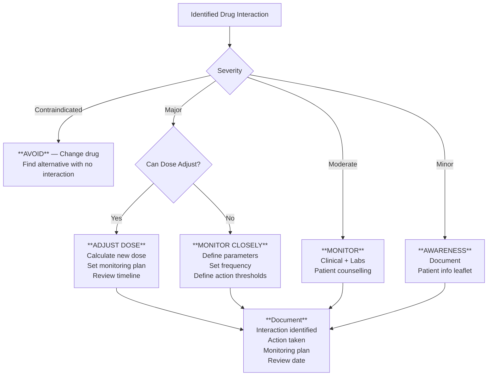
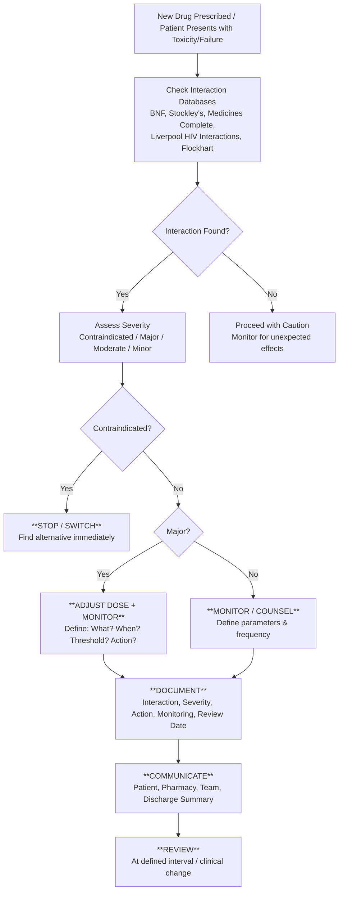
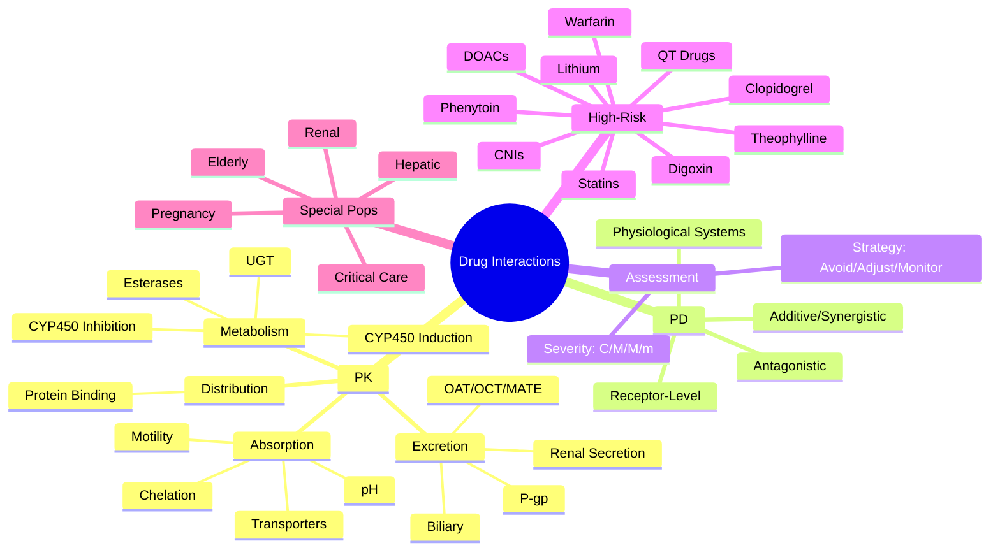
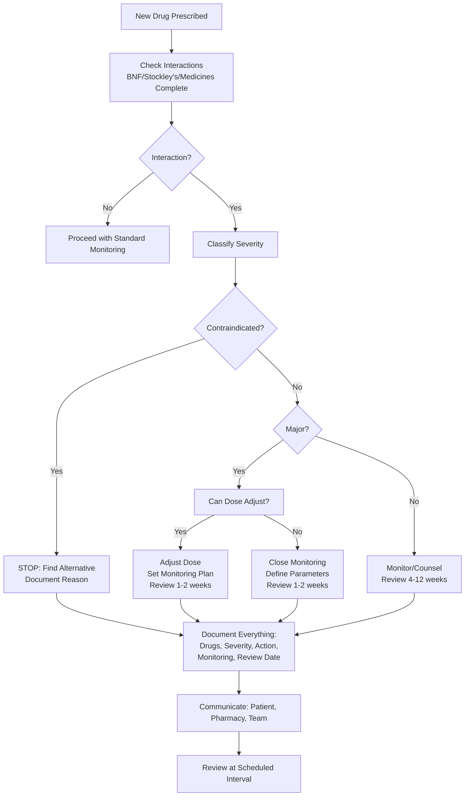

> [!tip] **FCPS/MRCP Priority: HIGHEST**
> **The single most examinable prescribing topic.** Memorise the CYP450 isoform table, key substrate/inhibitor/inducer triads, and management algorithms for Warfarin, DOACs, Immunosuppressants, Statins, Clopidogrel.
> Viva classic: *"Mechanism of clarithromycin-warfarin interaction? Management?"*

---

## 1. 1. Learning Objectives

By the end of this note you should be able to:
- [ ] Recite **CYP450 isoform table** (Substrates, Inhibitors, Inducers) for 1A2, 2C9, 2C19, 2D6, 3A4/5
- [ ] Predict **direction of interaction** (↑ Substrate level → Toxicity; ↓ Substrate level → Therapeutic failure)
- [ ] Apply **management algorithms** for Warfarin, DOACs, Tacrolimus/Ciclosporin, Statins, Clopidogrel
- [ ] Identify **P-gp interactions** and dual CYP3A4/P-gp inhibition
- [ ] Distinguish **reversible vs mechanism-based (irreversible) inhibition**
- [ ] Classify interaction **severity** (Contraindicated, Major, Moderate, Minor)
- [ ] Apply **management strategies** (Avoid, Adjust Dose, Monitor, Alternative Agent)
- [ ] Recognise **high-risk combinations** (Warfarin, DOACs, CNIs, ARVs, AEDs, QT-prolonging)

---

## 2. 2. Core Concept: Interaction Mechanisms

### 1. PK Interactions — ADME Framework

```mermaid
flowchart LR
    subgraph ABS[Absorption]
        A1[pH changes: PPIs ↓ ketoconazole/itraconazole absorption]
        A2[Chelation: Ca²⁺/Mg²⁺/Fe²⁺/Zn²⁺ bind quinolones/tetracyclines/bisphosphonates]
        A3[Motility: Metoclopramide ↑ gastric emptying; anticholinergics ↓]
        A4[Transporters: P-gp (digoxin), OATP (statins), OCT (metformin)]
    end
    
    subgraph DIST[Distribution]
        D1[Protein binding displacement: Warfarin, Phenytoin, Valproate — transient ↑ free fraction]
        D2[Clinical significance: ONLY for high extraction, narrow TI drugs (warfarin, phenytoin)]
    end
    
    subgraph MET[Metabolism]
        M1[CYP450 Inhibition → ↑ Substrate levels → TOXICITY]
        M2[CYP450 Induction → ↓ Substrate levels → THERAPEUTIC FAILURE]
        M3[UGT Inhibition: Valproate ↑ Lamotrigine; Induction: Carbamazepine ↓ Lamotrigine]
        M4[Esterases: Remifentanil, aspirin hydrolysis]
    end
    
    subgraph EXCR[Excretion]
        E1[Renal tubular secretion: Probenecid ↓ penicillin excretion; Cimetidine/trimetoprim ↓ creatinine secretion]
        E2[P-gp: Digoxin, Tacrolimus, DOACs — inhibition ↑ levels]
        E3[OAT/OCT/MATE: Metformin, Cimetidine, Pyrimethamine]
        E4[Biliary: Enterohepatic recirculation (oral contraceptives + antibiotics)]
    end
```

---

### 2. PD Interactions

```mermaid
flowchart LR
    subgraph ADD[Additive/Synergistic]
        AD1[Warfarin + NSAID → ↑ Bleeding]
        AD2[ACEi + K⁺-sparing diuretic → ↑ Hyperkalaemia]
        AD3[Sedatives + Alcohol → ↑ CNS depression]
        AD4[Beta-blocker + Verapamil → ↑ Bradycardia/AV block]
    end
    
    subgraph ANT[Antagonistic]
        AN1[Beta-blocker + Beta-agonist (salbutamol) → ↓ Bronchodilation]
        AN2[NSAID + ACEi/ARB/Diuretic → ↓ Antihypertensive effect + ↑ AKI]
        AN3[Domperidone/Metoclopramide + PPI → ↓ Acid suppression]
    end
    
    subgraph REC[Receptor-Level]
        R1[Agonist + Antagonist at same receptor]
        R2[Naloxone reverses opioid; Flumazenil reverses benzo]
        R3[Atropine reverses organophosphate/carbamate]
    end
    
    subgraph SYS[Physiological Systems]
        S1[Triple Whammy: ACEi/ARB + Diuretic + NSAID → AKI]
        S2[Serotonin syndrome: SSRI + Tramadol + MAOI]
        S3[Neuroleptic malignant syndrome: Antipsychotic + Dopamine antagonist withdrawal]
    end
```

---

## 3. 3. CYP450 Quick Reference Table (EXAM ESSENTIAL)

### 1. CYP450 Isoform Summary Table

| Isoform | % Drugs Metabolised | Key Substrates (Exam) | Strong Inhibitors | Strong Inducers | Genetic Polymorphism |
|---------|---------------------|----------------------|-------------------|-----------------|---------------------|
| **1A2** | ~5% | Theophylline, Clozapine, Olanzapine, Duloxetine, Tizanidine | **Fluvoxamine**, Ciprofloxacin | **Smoking**, Omeprazole | *CYP1A2* variants |
| **2C9** | ~15% | **Warfarin (S-)**, Phenytoin, Glipizide, Losartan, NSAIDs | **Fluconazole**, Amiodarone, Metronidazole, TMP-SMX | **Rifampicin**, Carbamazepine, Phenytoin | ***CYP2C9*2/*3** → ↓ Warfarin dose |
| **2C19** | ~10% | **Clopidogrel**, PPIs, Citalopram, Diazepam, Voriconazole | **Omeprazole/Esomeprazole**, Fluoxetine, Fluvoxamine | **Rifampicin**, Carbamazepine, SJW | ***CYP2C19*2/*3** (PM) → ↓ Clopidogrel activation |
| **2D6** | ~20% | **Codeine**, Tramadol, TCAs, β-blockers, Flecainide, Atomoxetine | **Paroxetine**, Fluoxetine, Quinidine, Bupropion | **None** | ***CYP2D6*4/*5** (PM) → No codeine→morphine |
| **3A4/5** | **>50%** | Statins, CCBs, **Tacrolimus**, **Ciclosporin**, DOACs, Midazolam, Steroids | **Clarithromycin**, **Erythromycin**, **Azoles**, **Ritonavir**, **Grapefruit**, Verapamil, Diltiazem | **Rifampicin**, **Carbamazepine**, **Phenytoin**, **Phenobarbital**, **SJW** | *CYP3A5* expressor vs non-expressor |

> **Exam Key:** CYP3A4 = **>50% of all drugs**. CYP2D6 = **no inducers**. CYP2C9 = **Warfarin**. CYP2C19 = **Clopidogrel activation**. CYP1A2 = **Smoking induces**.

### 2. P-glycoprotein (P-gp / ABCB1) — Key Dual Substrate Drugs

| Drug | CYP3A4 Substrate? | P-gp Substrate? | Clinical Implication |
|------|-------------------|-----------------|---------------------|
| **Digoxin** | No | **Yes** | Clarithromycin/Azoles/Verapamil/Amiodarone → ↑ Digoxin (P-gp inhibition) |
| **Tacrolimus** | **Yes** | **Yes** | **Dual inhibition** → 5-10x level increase |
| **Ciclosporin** | **Yes** | **Yes** | Same as tacrolimus |
| **DOACs (Riva/Apix/Dabi)** | **Yes (3A4)** | **Yes** | Dual inhibition → ↑ Bleeding; Dual induction → ↓ Efficacy |
| **Simvastatin/Atorvastatin** | **Yes** | Partial | Azoles/Clarithro → ↑ Myopathy risk |
| **HIV PIs (Ritonavir)** | **Yes** | **Yes** | **Potent dual inhibitor** |

---

## 4. 4. Interaction Mechanisms — Deep Dive

### 1. Reversible Inhibition
- **Competitive:** Inhibitor competes for active site (Most CYP inhibitors)
- **Non-competitive:** Binds allosteric site
- **Onset:** Rapid (hours); **Offset:** Rapid (hours-days after stopping inhibitor)

### 2. Mechanism-Based / Irreversible Inhibition (Time-Dependent)
- **Metabolic-intermediate complex** formation → Heme destruction
- **Drugs:** **Erythromycin, Clarithromycin, Verapamil, Diltiazem, Paroxetine, Fluoxetine, Ritonavir, Azoles**
- **Onset:** Days (requires new enzyme synthesis); **Offset:** Days-weeks (enzyme turnover t½ ~72h)
- **Clinical:** More pronounced, longer-lasting interaction

### 3. Induction
- **Transcriptional activation** via **PXR (Pregnane X Receptor)** / **CAR (Constitutive Androstane Receptor)**
- **Onset:** 3-7 days (max 2-3 weeks); **Offset:** 1-3 weeks after stopping
- **Key Inducers:** **Rifampicin (+++)**, Carbamazepine, Phenytoin, Phenobarbital, St John's Wort, Bosentan, Modafinil

---

## 5. 5. High-Risk Drug Combinations — Management Algorithms

### 1. Warfarin — High-Risk Interactions

```mermaid
flowchart TD
    A[Patient on Warfarin — New Drug Started] --> B{Interaction Type}
    B -->|CYP2C9 Inhibitor
Fluconazole, Metronidazole,
Co-trimoxazole, Macrolides,
Amiodarone| C[↑ INR → Bleeding Risk]
    C --> D[Action: Reduce Warfarin 20-30%
Monitor INR 2-3x/week
Duration: During + 1wk after]
    B -->|CYP2C9/3A4 Inducer
Rifampicin, Carbamazepine,
Phenytoin, St John's Wort| E[↓ INR → Thrombosis Risk]
    E --> F[Action: Increase Warfarin 20-50%
Monitor INR 2-3x/week
Duration: During + 2-4wk after]
    B -->|Vit K Reduction
Broad-spectrum Abx| G[↑ INR → Bleeding Risk]
    G --> H[Monitor INR; Consider Vit K supplementation
if INR >5]
    B -->|Protein Binding Displacement
(Transient — rarely clinically significant)| I[Monitor INR 48h]
```

| Drug Pair | Mechanism | Clinical Effect | Management |
|-----------|-----------|-----------------|------------|
| **Warfarin + Fluconazole/Metronidazole/Co-trimoxazole/Macrolides** | CYP2C9 inhibition + Vit K reduction | ↑ INR, Bleeding | **Reduce warfarin 20-30%; Monitor INR 2-3x/week** |
| **Warfarin + Rifampicin/Carbamazepine/Phenytoin/SJW** | CYP2C9/3A4 induction | ↓ INR, Thrombosis | **Increase warfarin 20-50%; Monitor INR 2-3x/week** |
| **Warfarin + Amiodarone** | CYP2C9 inhibition (MBI) + displacement | ↑↑ INR (delayed 1-2wk) | **Reduce warfarin 30-50%; Monitor INR closely** |
| **Warfarin + Cranberry/Grapefruit** | CYP2C9/3A4 inhibition | ↑ INR | Avoid large amounts; Monitor INR |

---

### 2. DOACs — High-Risk Interactions

| DOAC | Strong CYP3A4/P-gp Inhibitor
(Azoles, HIV PIs, Clarithro, Verapamil, Diltiazem) | Strong Inducer
(Rifampicin, Carbamazepine, Phenytoin, SJW) | P-gp Inhibitor Only
(Verapamil, Diltiazem, Amiodarone, Quinidine) |
|------|--------------------------------------------------------|------------------------------------------------|----------------------------------------------------|
| **Dabigatran** | **AVOID** (↑ Bleeding 2-6x) | **AVOID** (↓ Exposure 50-66%) | Reduce dose 50% if CrCl 30-50 |
| **Rivaroxaban** | **Dose reduce 15mg OD** (CrCl>30); **Avoid** if CrCl<30 | **AVOID** | **Caution** — monitor for bleeding |
| **Apixaban** | **Dose reduce 2.5mg BD** if 2 criteria met*; Avoid otherwise | **AVOID** | **Caution** — monitor for bleeding |
| **Edoxaban** | **Dose reduce 30mg OD** | **AVOID** | **Caution** |

> *Apixaban dose reduction criteria: Age ≥80 OR Weight ≤60kg OR Cr ≤1.5 mg/dL — **2 of 3** triggers 2.5mg BD.

### 3. Immunosuppressants (Tacrolimus / Ciclosporin / Sirolimus)

```mermaid
flowchart TD
    A[Tacrolimus/Ciclosporin + Azole/Macrolide/P-gp Inhibitor] --> B[↑ Levels 5-10x → Nephro/Neurotoxicity]
    B --> C{Action}
    C -->|If Alternative Exists| D[**STOP Inhibitor**
Switch: Clarithro → Azithro
Fluconazole → Caspofungin/Ampho B
Diltiazem → Amlodipine]
    C -->|If Inhibitor Essential| E[**Reduce CNI Dose 66-75%**
Monitor Levels q2-3 days
Monitor Renal Function q2-3 days
Monitor Neuro (tremor, seizure, PRES)]
    
    F[Tacrolimus/Ciclosporin + Rifampicin/Carbamazepine/Phenytoin/SJW] --> G[↓ Levels 50-90% → Rejection Risk]
    G --> H[**Avoid Combination if Possible**
If Essential: ↑ CNI Dose 2-4x
Monitor Levels DAILY
Monitor Rejection Markers]
```

| Inhibitor | Tacrolimus Dose Reduction | Ciclosporin Dose Reduction | Monitoring |
|-----------|---------------------------|----------------------------|------------|
| **Ketoconazole/Itraconazole/Voriconazole/Posaconazole** | **66-75%** (empiric) | **66-75%** | q2-3d levels, renal, neuro |
| **Clarithromycin/Erythromycin** | 50-66% | 50-66% | q2-3d levels |
| **Fluconazole** | 50% | 50% | q3-5d levels |
| **Ritonavir/Cobicistat** | **80-90%** | **80-90%** | Daily levels initially |
| **Grapefruit** | Avoid | Avoid | — |

---

### 4. Statins — CYP3A4 Interactions

| Statin | CYP3A4 Substrate? | Max Dose with Moderate Inhibitor
(Amiodarone, Verapamil, Diltiazem) | With Strong Inhibitor
(Clarithro, Azoles, HIV PIs) |
|--------|-------------------|---------------------------------------------------------------|-----------------------------------------------|
| **Simvastatin** | **Yes (High)** | **Max 10mg/day** | **CONTRAINDICATED** |
| **Atorvastatin** | **Yes (Moderate)** | Max 20-40mg/day | Max 20mg/day (avoid if possible) |
| **Lovastatin** | **Yes (High)** | Max 20mg/day | **CONTRAINDICATED** |
| **Rosuvastatin** | No (BCRP/OATP) | No restriction | No restriction (caution with cyclosporine) |
| **Pravastatin** | No (OATP) | No restriction | No restriction |
| **Fluvastatin** | CYP2C9 | No restriction | No restriction |

> **Key:** **Simvastatin + Clarithromycin = Rhabdo risk +++** — classic exam trap.

---

### 5. Clopidogrel + PPI Interaction

| PPI | CYP2C19 Inhibition | Effect on Clopidogrel | Recommendation |
|-----|-------------------|----------------------|----------------|
| **Omeprazole/Esomeprazole** | **Strong (+++)** | ↓ Active metabolite 40-50%; ↑ CV events | **AVOID** — use pantoprazole/rabeprazole or H2 blocker |
| **Lansoprazole** | Moderate | ↓ Active metabolite ~30% | Avoid if possible |
| **Pantoprazole/Rabeprazole** | Weak/Minimal | Negligible | **Preferred** |
| **Famotidine/Ranitidine** | None | No effect | **Safe alternative** |

> **Viva Key:** *Clopidogrel is a PRODRUG requiring CYP2C19 activation. Omeprazole/esomeprazole are strong CYP2C19 inhibitors → ↓ antiplatelet effect.*

---

### 6. QT-Prolonging Combinations — Torsades Risk

```mermaid
flowchart LR
    subgraph HIGH[High Risk: Avoid/Monitor ECG + K⁺/Mg²⁺]
        H1[Antiarrhythmics: Amiodarone, Sotalol, Flecainide, Quinidine]
        H2[Antipsychotics: Haloperidol, Quetiapine, Ziprasidone]
        H3[Antibiotics: Macrolides, Fluoroquinolones, Azoles]
        H4[Antiemetics: Ondansetron, Domperidone, Metoclopramide]
        H5[Others: Methadone, Citalopram/Escitalopram >20/40mg, Chloroquine]
    end
    
    subgraph ADDITIVE[Additive Risk = HIGHER]
        A1[🚫 Any 2 from HIGH → Max Risk]
        A2[🚫 HIGH + Electrolyte abnormality (K⁺<4, Mg²⁺<0.7)]
        A3[🚫 HIGH + Bradycardia (<50) / Heart block / LVH]
        A4[🚫 HIGH + Renal/Hepatic impairment]
    end
```

| Scenario | Action |
|----------|--------|
| **2+ QT-prolonging drugs** | **Avoid combination**; if essential → Baseline ECG, correct K⁺/Mg²⁺, repeat ECG 24-48h |
| **QT >500ms or ΔQT >60ms** | **Stop offending drug(s)**; Correct electrolytes; Cardiology review |
| **Torsades de Pointes** | **IV Magnesium 2g bolus**; Overdrive pacing; Isoprenaline; Stop all QT drugs |

---

## 6. 6. Clinical Significance Assessment

### 1. Severity Classification (Stockley's / FDA / MHRA)

| Category | Definition | Action | Examples |
|----------|------------|--------|----------|
| **Contraindicated** | Life-threatening; no safe management | **Do not co-prescribe** | Simvastatin + Clarithro; Dabigatran + Ketoconazole; MAOI + SSRI |
| **Major** | Significant harm likely; requires dose adjustment/close monitoring | Adjust dose, Monitor closely, Consider alternative | Warfarin + Fluconazole; Tacrolimus + Clarithro; DOAC + Verapamil |
| **Moderate** | Potential harm; monitor or dose adjust | Monitor clinical response, Adjust if needed | ACEi + NSAID; SSRI + NSAID (bleeding); Statin + Fibrate |
| **Minor** | Unlikely to cause harm; awareness only | Counsel patient, Routine monitoring | Paracetamol + Warfarin (minimal); Most PPI interactions |

---

### 2. Management Strategies — Decision Algorithm



---

## 7. 7. Special Populations — Interaction Amplifiers

| Population | PK/PD Changes | Interaction Impact | Key Examples |
|------------|---------------|-------------------|--------------|
| **Elderly** | ↓ Renal/hepatic clearance, ↑ Vd, polypharmacy | **2-3x more ADRs**; ↓ Reserve | Warfarin + antibiotics; ACEi + NSAID + diuretic |
| **Renal Impairment** | ↓ Renal excretion (P-gp, OAT, OCT, MATE) | ↑ Levels of renally cleared drugs | Metformin + contrast; Digoxin + amiodarone; DOACs |
| **Hepatic Impairment** | ↓ CYP metabolism, ↓ protein binding | ↑ Free drug + ↓ clearance | Warfarin + azoles; Benzos + opioids; Statins |
| **Pregnancy** | ↑ CYP3A4/2D6/2C9, ↑ UGT, ↑ GFR | ↓ Levels of induced drugs | Lamotrigine (↑ clearance 2-3x); Levothyroxine dose ↑ |
| **Critical Illness** | ↑ Vd, ↓ protein binding, organ dysfunction | Unpredictable levels | TDM essential: Vancomycin, Aminoglycosides, Tacrolimus |

---

## 8. 8. Approach / Algorithm — Clinical Decision Making

### 1. When You Suspect an Interaction



---

## 9. 9. Investigations — Monitoring Parameters by Drug Class

| Drug Class | Monitoring Parameter | Frequency | Action Threshold |
|------------|---------------------|-----------|------------------|
| **Warfarin** | INR | 2-3x/week during interaction | INR >4.5: Reduce/hold; >5: Vit K |
| **DOACs** | Renal function, Hb, Signs of bleeding | Baseline, 1wk, then monthly | CrCl ↓ >30%: Reassess dose; Hb ↓ >20: Investigate |
| **Tacrolimus/Ciclosporin** | Trough level, Creatinine, eGFR, Mg²⁺, K⁺, Neurological exam | q2-3d during interaction | Level >15/300: Reduce dose; Cr ↑ >30%: Reduce dose |
| **Digoxin** | Level (≥6h post-dose), ECG, K⁺, Creatinine | Baseline, 1wk, then monthly | Level >1.2: Reduce; >2.0: Hold + antidote |
| **Lithium** | Level (12h post-dose), TSH, Creatinine, Ca²⁺ | Baseline, 1wk, then 3-monthly | Level >1.0: Reduce; >1.5: Hold |
| **Phenytoin** | Total + **FREE level**, Albumin | Baseline, 7-10d after change | Free >2: Reduce; Total >20: Reduce |
| **Vancomycin** | AUC (Bayesian), Trough, Creatinine | Daily during therapy | AUC >600: Reduce; Cr ↑ >0.5 or 50%: Reduce |
| **Statins** | CK (if symptomatic), LFTs | Baseline, 3m, then annually | CK >10x ULN: Stop; LFT >3x ULN: Stop/reduce |
| **ACEi/ARB + Diuretic + NSAID** | U&Es, Creatinine | Baseline, 1-2wk after NSAID | K⁺ >5.5: Hold ACEi/ARB; Cr ↑ >30%: Review |

---

## 10. 10. Tables / Comparison Charts

### 1. Top 20 "Never Miss" Interactions for Exams

| # | Drug 1 | Drug 2 | Mechanism | Clinical Consequence | Exam Frequency |
|---|--------|--------|-----------|---------------------|----------------|
| 1 | **Warfarin** | **Fluconazole/Metronidazole** | CYP2C9 inhibition | ↑ INR, Bleeding | ⭐⭐⭐⭐⭐ |
| 2 | **Warfarin** | **Rifampicin** | CYP2C9/3A4 induction | ↓ INR, Thrombosis | ⭐⭐⭐⭐ |
| 3 | **Tacrolimus** | **Clarithromycin/Azoles** | CYP3A4/P-gp inhibition | ↑↑ Levels, Nephrotoxicity | ⭐⭐⭐⭐⭐ |
| 4 | **Simvastatin** | **Clarithromycin/Azoles** | CYP3A4 inhibition | Rhabdomyolysis | ⭐⭐⭐⭐⭐ |
| 5 | **Clopidogrel** | **Omeprazole/Esomeprazole** | CYP2C19 inhibition | ↓ Antiplatelet effect | ⭐⭐⭐⭐ |
| 6 | **Digoxin** | **Amiodarone/Verapamil/Clarithro** | P-gp inhibition | ↑ Digoxin → Toxicity | ⭐⭐⭐⭐ |
| 7 | **DOAC** | **Ketoconazole/Itraconazole/Ritonavir** | Dual CYP3A4/P-gp inhibition | ↑ Bleeding | ⭐⭐⭐⭐ |
| 8 | **Lithium** | **Thiazide/ACEi/NSAID** | ↓ Renal clearance | ↑ Lithium → Toxicity | ⭐⭐⭐⭐ |
| 9 | **Phenytoin** | **Valproate/Fluconazole** | CYP2C9 inhibition + displacement | ↑ Free Phenytoin → Toxicity | ⭐⭐⭐ |
| 10 | **Carbamazepine** | **Macrolides/Azoles/Valproate** | CYP3A4 inhibition / auto-inhibition | ↑ Carbamazepine → Toxicity | ⭐⭐⭐ |
| 11 | **Theophylline** | **Ciprofloxacin/Fluvoxamine** | CYP1A2 inhibition | ↑ Theophylline → Seizures/Arrhythmia | ⭐⭐⭐ |
| 12 | **MAOI** | **SSRI/SNRI/Tramadol/Pethidine** | Serotonin syndrome | Hyperthermia, rigidity, death | ⭐⭐⭐⭐ |
| 13 | **Beta-blocker** | **Verapamil/Diltiazem** | Additive AV node blockade | Severe bradycardia, heart block | ⭐⭐⭐ |
| 14 | **ACEi/ARB** | **K⁺-sparing diuretic/Supplement** | Additive K⁺ retention | Hyperkalaemia | ⭐⭐⭐⭐ |
| 15 | **Triple Whammy** | ACEi/ARB + Diuretic + NSAID | Haemodynamic AKI | Acute Kidney Injury | ⭐⭐⭐⭐⭐ |
| 16 | **QT drugs × 2** | Any 2 QT prolongers | Additive IKr blockade | Torsades de Pointes | ⭐⭐⭐⭐ |
| 17 | **Oral Contraceptive** | **Rifampicin/Griseofulvin/St John's Wort** | CYP3A4 induction + enterohepatic | Contraceptive failure | ⭐⭐⭐ |
| 18 | **Metformin** | **Contrast/Iodinated dye** | AKI → Lactic acidosis | Metformin-associated lactic acidosis | ⭐⭐⭐ |
| 19 | **SGLT2i** | **Surgery/Starvation/Alcohol** | Euglycaemic DKA | DKA with normal glucose | ⭐⭐⭐⭐ |
| 20 | **Corticosteroid** | **NSAID** | Additive GI toxicity | Peptic ulcer, GI bleed | ⭐⭐⭐ |

---

## 11. 11. Management — Prescribing Safety Checklist

### 1. Before Prescribing Any New Drug

```
☐ 1. Check ALL current medications (including OTC, herbals, supplements)
☐ 2. Run interaction check (BNF / Stockley's / Medicines Complete)
☐ 3. Assess patient factors: Age, Renal/Hepatic function, Pregnancy, Genetics
☐ 4. Classify severity: Contraindicated / Major / Moderate / Minor
☐ 5. Decide action: Avoid / Adjust Dose / Monitor / Alternative
☐ 6. Define monitoring: What? When? Threshold for action? By whom?
☐ 7. Document in notes: Interaction, Severity, Action Plan, Review Date
☐ 8. Communicate to patient: What to watch for, when to seek help
☐ 9. Communicate to pharmacy/team: Especially at transitions of care
☐ 10. Set review date: 1-2 weeks for Major, 4-12 weeks for Moderate
```

---

## 12. 12. Drug Interactions / Contraindications / Comorbidity Cautions

### 1. Absolute Contraindications (Contraindicated Combinations)

| Drug A | Drug B | Reason |
|--------|--------|--------|
| **Simvastatin/Lovastatin** | **Clarithromycin/Erythromycin/Ketoconazole/Itraconazole/Ritonavir** | Rhabdomyolysis (death reported) |
| **Dabigatran** | **Ketoconazole/Itraconazole/Ciclosporin/Dronedarone** | ↑ Dabigatran 2-6x → Fatal bleed |
| **MAOI** | **SSRI/SNRI/Tramadol/Pethidine/Linezolid/Methylene Blue** | Serotonin syndrome (fatal) |
| **ERGOT derivatives** | **Macrolides/Azoles/HIV PIs** | Ergotism (gangrene, MI, stroke) |
| **Cisapride/Astemizole/Terfenadine** | **CYP3A4 inhibitors** | Torsades (withdrawn but exam relevant) |

### 2. Relative Contraindications (Use with Extreme Caution)

| Drug A | Drug B | Monitoring Required |
|--------|--------|---------------------|
| **Warfarin** | **Fluconazole/Metronidazole/Co-trimoxazole** | INR 2-3x/week |
| **Tacrolimus/Ciclosporin** | **Clarithromycin/Azoles** | Levels q2-3d, Renal q2-3d |
| **DOAC** | **Verapamil/Diltiazem/Amiodarone/Quinidine** | Renal function, Bleeding signs |
| **Lithium** | **Thiazide/ACEi/ARB/NSAID** | Li level 1wk, then monthly |
| **Phenytoin** | **Valproate/Fluconazole/Co-trimoxazole** | Free Phenytoin level |
| **Carbamazepine** | **Macrolides/Azoles/Valproate/St Johns Wort** | Carbamazepine level + LFTs |
| **Methotrexate** | **Co-trimoxazole/NSAID/PPI** | Methotrexate level, CBC, LFTs, Renal |

---

## 13. 13. Common Viva Questions

1. **"A patient on warfarin for AF develops a chest infection. GP prescribes clarithromycin. What happens and what do you do?"**
   - **Mechanism:** Clarithromycin = CYP3A4 inhibitor (also some CYP2C9) + mechanism-based inhibitor → ↑ Warfarin (R-warfarin via 3A4, S-warfarin via 2C9) + ↓ Vit K from gut flora
   - **Effect:** INR rises significantly over 3-7 days → Bleeding risk
   - **Management:** **Switch antibiotic** (Doxycycline/Amoxicillin — no CYP interaction). If clarithromycin essential: Reduce warfarin 30-50%, monitor INR daily until stable.

2. **"Patient on tacrolimus post-renal transplant started on fluconazole for oral thrush. What is your management?"**
   - **Mechanism:** Fluconazole = CYP3A4 inhibitor → ↑ Tacrolimus 2-4x
   - **Action:** Reduce tacrolimus dose **50% empirically**. Monitor tacrolimus trough levels **q2-3 days**. Monitor renal function q2-3 days. Once fluconazole stopped, tacrolimus dose will need to be increased back over 1-2 weeks.

3. **"Why is simvastatin 40mg contraindicated with clarithromycin but atorvastatin 40mg is not?"**
   - Simvastatin: **High CYP3A4 dependence** + **high first-pass metabolism** → Clarithromycin (strong CYP3A4 MBI) ↑ AUC 10-20x → Rhabdo risk +++
   - Atorvastatin: **Moderate CYP3A4 dependence** → Clarithromycin ↑ AUC ~3-4x → Max dose 20mg with strong inhibitors (simvastatin: max 10mg with moderate, contraindicated with strong)

4. **"Patient on clopidogrel post-STEMI develops dyspepsia. GP prescribes omeprazole. Is this appropriate?"**
   - **NO.** Omeprazole/esomeprazole = strong CYP2C19 inhibitors → ↓ Clopidogrel active metabolite formation → ↑ Stent thrombosis/MI risk
   - **Alternative:** Pantoprazole/rabeprazole (weak CYP2C19 inhibition) or H2 blocker (famotidine/ranitidine — no CYP2C19 effect)

5. **"Explain the 'Triple Whammy' and its clinical significance."**
   - ACEi/ARB (↓ efferent arteriole tone) + Diuretic (↓ intravascular volume) + NSAID (↓ prostaglandin-mediated afferent dilation) → **Profound ↓ GFR → AKI**
   - **Management:** Avoid NSAID in patients on ACEi/ARB + diuretic. If NSAID essential: Monitor U&Es at baseline, 1-2 weeks. Counsel patient.

6. **"A patient on digoxin develops atrial fibrillation with rapid ventricular rate. You add verapamil for rate control. What monitoring is required?"**
   - **Interaction:** Verapamil = P-gp inhibitor → ↑ Digoxin levels 1.5-2x
   - **Action:** **Halve digoxin dose** empirically. Check digoxin level at **≥6h post-dose** (ideally 8-12h) in 3-5 days. Monitor ECG for PR prolongation/bradycardia. Monitor K⁺.

7. **"Patient on lithium for bipolar disorder started on furosemide for heart failure. What is the risk and management?"**
   - **Risk:** Furosemide → ↓ Na⁺ reabsorption → ↑ Proximal Li⁺ reabsorption → ↑ Lithium levels → Toxicity (tremor, confusion, NMDAR encephalopathy, seizures)
   - **Management:** **Avoid if possible** (use loop diuretic alternative? Not really — all diuretics increase Li). If essential: **Monitor Li level weekly × 4, then monthly**. Maintain Li 0.4-0.6 mmol/L. Counsel patient on dehydration risk.

8. **"Describe the management of a patient on rivaroxaban 20mg OD (CrCl 45) who needs treatment for invasive aspergillosis with voriconazole."**
   - **Interaction:** Voriconazole = Strong CYP3A4 + P-gp inhibitor → ↑ Rivaroxaban ~2-3x
   - **Action:** **Switch to alternative anticoagulant** (LMWH therapeutic dose — no CYP interaction) OR **Reduce rivaroxaban to 10mg OD** (if CrCl 15-30 protocol) with close monitoring. LMWH preferred.

9. **"What is the mechanism of the St John's Wort interaction with oral contraceptives?"**
   - **Mechanism:** St John's Wort = **Potent CYP3A4 + P-gp inducer** (via PXR activation) → ↑ Ethinylestradiol & progestogen metabolism + ↑ gut efflux → ↓ AUC 40-60% → **Contraceptive failure** (breakthrough bleeding = warning sign)
   - **Management:** **Additional barrier contraception** during + 4 weeks after stopping SJW. Consider alternative herbal or non-enzyme-inducing contraception.

10. **"Patient on phenytoin started on valproate for adjunctive seizure control. What happens to phenytoin levels and why?"**
    - **Dual mechanism:** (1) Valproate inhibits CYP2C9 → ↓ Phenytoin metabolism → ↑ Total phenytoin. (2) Valproate displaces phenytoin from albumin → ↓ Protein binding → ↑ **FREE phenytoin** disproportionately.
    - **Clinical:** **Monitor FREE phenytoin level** (target 1-2 µg/mL). Total level may appear "therapeutic" but free level is toxic. Reduce phenytoin dose ~25-50%.

---

## 14. 14. Common Confusions / Exam Traps

| Confusion | Clarification |
|-----------|---------------|
| **CYP2D6 has inducers** | **NO major CYP2D6 inducers.** Only inhibition matters. |
| **Protein binding displacement = clinically significant** | **Rarely.** Only for **high extraction, narrow TI** drugs (Warfarin, Phenytoin, Valproate). Transient ↑ free fraction → ↑ clearance → levels normalise in hours. |
| **All statins interact with CYP3A4 inhibitors** | **Rosuvastatin, Pravastatin, Fluvastatin, Pitavastatin** do NOT use CYP3A4. Safe with clarithro/azoles (except rosuvastatin + ciclosporin = OATP). |
| **DOACs need INR monitoring** | **NO.** DOACs do NOT affect INR reliably. Use anti-Xa assay (rivaroxaban/apixaban) or dTT/ECT (dabigatran) if level needed. |
| **Warfarin + Cranberry = Major interaction** | **Weak evidence.** Case reports only. Advise moderation, not avoidance. |
| **Rifampicin = only CYP3A4 inducer** | **Rifampicin induces CYP1A2, 2B6, 2C8, 2C9, 2C19, 3A4, P-gp, UGT, OATP** — **broadest inducer**. |
| **Amiodarone = only CYP3A4 inhibitor** | **Amiodarone inhibits CYP1A2, 2C9, 2C19, 2D6, 3A4, P-gp** — **broad inhibitor + long t½ (50d)**. |
| **Clopidogrel + PPI = all PPIs same** | **Omeprazole/Esomeprazole = strong CYP2C19 inhibition.** Pantoprazole/Rabeprazole/Famotidine = minimal. |
| **Grapefruit affects all CYP3A4 drugs equally** | **Only oral drugs with high first-pass metabolism** (simvastatin, felodipine, tacrolimus). IV drugs / low first-pass = minimal effect. |
| **Enzyme induction = immediate** | **Induction takes 3-7 days (max 2-3 weeks).** Stopping inducer → effect persists 1-3 weeks. |

---

## 15. 15. Mnemonics

### 1. CYP450 Isoforms — "1, 2, 2, 2, 3"
- **1A2:** **1** (Theophylline) — **Fluvoxamine** inhibits, **Smoking** induces
- **2C9:** **2** (Warfarin, Phenytoin) — **Fluconazole** inhibits, **Rifampicin** induces
- **2C19:** **2** (Clopidogrel, PPIs) — **Omeprazole** inhibits, **Rifampicin** induces
- **2D6:** **2** (Codeine, Tramadol, TCAs) — **Paroxetine/Fluoxetine** inhibit, **NO inducers**
- **3A4:** **3** (Everything else — >50%) — **Clarithro/Azoles/Ritonavir** inhibit, **Rifampicin/Carbamazepine** induce

### 2. Strong CYP3A4 Inhibitors — **"CLARITY"**
- **C**larithromycin
- **L** (azole antifungals: Ketoconazole, Itraconazole, Voriconazole, Posaconazole)
- **A**ntiretrovirals (Ritonavir, Cobicistat)
- **R** (Grapefruit — not a drug but potent)
- **I**traconazole (included above)
- **T** (Verapamil, Diltiazem — moderate)
- **Y** (Erythromycin — older macrolide)

### 3. Strong CYP3A4 Inducers — **"RCPPS"**
- **R**ifampicin (strongest)
- **C**arbamazepine
- **P**henytoin
- **P**henobarbital
- **S**t John's Wort

### 4. P-gp Substrates — **"DIG-TAC"**
- **D**igoxin
- **I**mmunosuppressants (Tacrolimus, Ciclosporin, Sirolimus)
- **G** — DOACs (Rivaroxaban, Apixaban, Dabigatran, Edoxaban)
- **T** — HIV PIs (also inhibitors)
- **A** — Anticancer (Paclitaxel, Docetaxel)
- **C** — CCBs (Verapamil — also inhibitor)

### 5. Warfarin Interactions — **"F-MARC"**
- **F**luconazole/Metronidazole/Macrolides/Co-trimoxazole (Inhibitors → ↑ INR)
- **M** — Amiodarone (MBI → delayed ↑ INR)
- **A** — Antibiotics broad-spectrum (↓ Vit K → ↑ INR)
- **R**ifampicin/Carbamazepine/Phenytoin/SJW (Inducers → ↓ INR)
- **C**ranberry (Weak/Case reports)

---

## 16. 16. Mind Map



---

## 17. 17. Flowchart — Interaction Management Algorithm



---

## 18. 18. Suggested Visuals / Image Notes

- CYP450 isoform table poster (A4, laminate for ward)
- P-gp substrate/inhibitor/inducer Venn diagram
- Warfarin interaction algorithm (laminated card)
- DOAC interaction traffic light (Red=Avoid, Amber=Reduce/Monitor, Green=Safe)
- Triple Whammy pathophysiology diagram
- Torsades risk stratification chart

---

## 19. 19. Suggested Video References

- **MedCram:** Drug Interactions (CYP450, P-gp) — YouTube
- **Armstrong Pharmacy:** Warfarin Interactions — YouTube
- **Pharmacy Joe:** Tacrolimus Interactions — Critical Care Pharmacy
- **BNF Interactions Guidance:** medicinescomplete.com
- **Liverpool HIV Drug Interactions:** hiv-druginteractions.org (for ARV interactions)

---

## 20. 20. One-Page Revision Summary

- **CYP3A4 = >50% drugs** — Memorise inhibitors (Clarithro, Azoles, Ritonavir, Grapefruit) and inducers (Rifampicin, Carbamazepine, Phenytoin, SJW)
- **Warfarin:** CYP2C9 inhibitors (Fluconazole, Metronidazole, Amiodarone) ↑ INR; Inducers (Rifampicin) ↓ INR
- **DOACs:** Dual CYP3A4/P-gp inhibition → Avoid (Dabi) or Reduce (Riva/Apix); Induction → Avoid all
- **CNIs:** Azoles/Macrolides → Reduce 50-75%, monitor levels q2-3d; Rifampicin → Avoid or ↑ dose 2-4x with daily levels
- **Simvastatin:** Max 10mg with moderate CYP3A4 inhibitors; CONTRAINDICATED with strong
- **Clopidogrel + Omeprazole/Esomeprazole = AVOID** (use Pantoprazole/Rabeprazole/H2 blocker)
- **Triple Whammy:** ACEi/ARB + Diuretic + NSAID → AKI — Avoid NSAID
- **QT drugs × 2 = Avoid** — Correct K⁺/Mg²⁺, Baseline ECG
- **Lithium + Diuretic/ACEi/NSAID = Monitor Li level weekly × 4**
- **Digoxin + Amiodarone/Verapamil/Clarithro = Halve Digoxin, Check Level ≥6h post-dose**

---

## 21. 21. 24-Hour Recall Prompts

- Explain CYP450 inhibition vs induction mechanism and time course in 2 minutes.
- Write the Warfarin interaction management algorithm from memory.
- List 5 drugs that are contraindicated with clarithromycin and why.
- Compare DOAC interaction management: Dabigatran vs Rivaroxaban vs Apixaban.
- State the Triple Whammy mechanism and clinical consequence.

---

## 22. 22. 7-Day / 15-Day / 30-Day Revision Tracker

- [ ] Day 1 completed
- [ ] 24-hour recall completed
- [ ] Day 7 revision completed
- [ ] Day 15 revision completed
- [ ] Day 30 revision completed

---

## 23. 23. Must Know / Should Know / Nice to Know

### 1. Must Know
- CYP450 isoform table (1A2, 2C9, 2C19, 2D6, 3A4) — substrates, inhibitors, inducers
- Warfarin, DOAC, Tacrolimus, Simvastatin, Clopidogrel interaction algorithms
- Interaction severity classification and management strategies
- P-gp key substrates and inhibitors

### 2. Should Know
- UGT interactions (Valproate-Lamotrigine)
- Protein binding displacement clinical relevance
- QT-prolonging drug combinations and Torsades management
- Special population interaction amplifiers

### 3. Nice to Know
- Pharmacogenomics (CYP2C9*2/*3, CYP2C19*2/*3, CYP2D6 PM/UM)
- Mechanism-based inhibition details
- Enterohepatic recirculation interactions (OCP + antibiotics)
- Herbal interactions (St John's Wort, Ginkgo, Garlic, Ginseng)

---

## 24. 24. My Weak Points

- [ ] 
- [ ] 
- [ ] 

---

## 25. 25. Self-Test Scorecard

- Understanding: /10
- Recall: /10
- MCQ Performance: /10
- SBA Performance: /10
- Viva Confidence: /10
- Total: /50

> [!tip]
> Interpretation: <35 = weak topic, 35-44 = acceptable but insecure, 45+ = strong exam-ready topic.

---

## 26. 26. Exam Answer Modes

### 1. Long Answer Skeleton

**Question:** "Describe the pharmacokinetic and pharmacodynamic mechanisms of drug interactions, with examples of high-risk combinations and their management."

**Structure:**
1. **Introduction:** Definition, PK vs PD, clinical importance
2. **PK Interactions (ADME):**
   - Absorption: pH, Chelation, Transporters
   - Distribution: Protein binding displacement
   - Metabolism: CYP450 inhibition/induction (table), UGT, Mechanism-based inhibition
   - Excretion: Renal secretion, P-gp, OAT/OCT/MATE
3. **PD Interactions:**
   - Additive/Synergistic, Antagonistic, Receptor-level, Physiological systems (Triple Whammy)
4. **High-Risk Combinations (Table):**
   - Warfarin, DOACs, CNIs, Statins, Clopidogrel, Digoxin, Lithium, Phenytoin, QT drugs
5. **Clinical Assessment:** Severity classification, Management strategies (Avoid/Adjust/Monitor)
6. **Special Populations:** Elderly, Renal, Hepatic, Pregnancy
7. **Prescribing Safety:** Checklist, Documentation, Communication, Review
8. **Conclusion:** Systematic approach saves lives

---

### 2. Short Note Skeleton

**Topic:** CYP450 Drug Interactions

- **CYP3A4:** >50% drugs. Inhibitors: Clarithro, Azoles, Ritonavir, Grapefruit. Inducers: Rifampicin, Carbamazepine, Phenytoin, SJW.
- **CYP2C9:** Warfarin, Phenytoin. Inhibitors: Fluconazole, Amiodarone. Inducers: Rifampicin.
- **CYP2C19:** Clopidogrel (prodrug), PPIs. Inhibitors: Omeprazole/Esomeprazole. Inducers: Rifampicin.
- **CYP2D6:** Codeine, Tramadol, TCAs. Inhibitors: Paroxetine, Fluoxetine. **NO INDUCERS.**
- **CYP1A2:** Theophylline, Clozapine. Inhibitors: Fluvoxamine. Inducers: Smoking.
- **Management:** Inhibitor → Reduce substrate dose/Monitor. Inducer → ↑ Substrate dose/Avoid.

---

### 3. Viva One-Liners

- "CYP3A4 metabolises >50% of drugs — know its inhibitors and inducers cold."
- "Warfarin + Fluconazole = Reduce warfarin 30%, Check INR daily."
- "Tacrolimus + Clarithromycin = Reduce tac 75%, Monitor levels q2d, Renal q2d."
- "Simvastatin + Clarithromycin = CONTRAINDICATED (Rhabdo). Atorva max 20mg."
- "Clopidogrel + Omeprazole = AVOID (CYP2C19). Use Pantoprazole."
- "Triple Whammy = ACEi/ARB + Diuretic + NSAID → AKI. Avoid NSAID."
- "Digoxin + Amiodarone = Halve Digoxin, Check level at 1 week."
- "Lithium + Thiazide = Monitor Li weekly × 4, Maintain 0.4-0.6."
- "Rifampicin = Universal inducer (CYPs, P-gp, UGT, OATP) — assume interaction."
- "St John's Wort = Inducer → Contraceptive failure, CNI rejection, DOAC thrombosis."

---

### 4. Ward-Case Discussion Points

- **Patient on warfarin (INR 2.5) started on co-trimoxazole for UTI:** Day 3 INR 5.2. Action: Hold warfarin, Vit K 1-2mg IV/PO, Restart warfarin at lower dose when INR <3, Monitor INR daily.
- **Renal transplant on tacrolimus (level 8) started on voriconazole:** Day 2 level 25, Creatinine rising. Action: Stop voriconazole if possible (switch to caspofungin), Reduce tacrolimus 75%, Daily levels + renal, Restart tac at lower dose when voriconazole stopped.
- **Elderly on ACEi + Furosemide started on Ibuprofen for OA:** Day 5 AKI (Cr 80→180). Action: Stop Ibuprofen, IV fluids, Monitor U&Es daily, Restart ACEi/Furosemide only when euvolaemic and Cr improving.

---

### 5. Last-Night-Before-Exam Sheet

```
CYP TABLE:
3A4 >50% | Inhib: Clarithro, Azoles, Ritonavir, Grapefruit | Induc: Rifampicin, Carbamazepine, Phenytoin, SJW
2C9 Warfarin/Phenytoin | Inhib: Fluconazole, Amiodarone | Induc: Rifampicin
2C19 Clopidogrel/PPI | Inhib: Omeprazole/Esomeprazole | Induc: Rifampicin
2D6 Codeine/Tramadol/TCAs | Inhib: Paroxetine, Fluoxetine | Induc: NONE
1A2 Theophylline/Clozapine | Inhib: Fluvoxamine | Induc: Smoking

HIGH-RISK:
Warfarin + Inhibitor → ↓ Dose 30%, INR q2-3d
Warfarin + Inducer → ↑ Dose 30-50%, INR q2-3d
Tacrolimus/Ciclosporin + Azole/Macrolide → ↓ Dose 50-75%, Levels q2-3d
Simvastatin + Strong 3A4 Inhib → CONTRAINDICATED
Atorvastatin + Strong 3A4 Inhib → Max 20mg
DOAC + Strong Dual Inhib → Dabi: AVOID; Riva/Apix: Reduce/Avoid
Clopidogrel + Omeprazole/Esomeprazole → AVOID (use Pantoprazole)
Triple Whammy → Avoid NSAID
QT × 2 → Avoid, Correct K/Mg, ECG
Lithium + Diuretic/ACEi/NSAID → Li Level weekly × 4
Digoxin + Amiodarone/Verapamil/Clarithro → Halve Dig, Level @ 1wk
```

---

## 27. 27. Summary

Drug interactions are the **highest-yield prescribing topic** for FCPS/MRCP. Master the **CYP450 isoform table**, **P-gp key substrates**, and **management algorithms for the top 10 high-risk combinations**. A systematic approach (Check → Classify → Act → Monitor → Document → Communicate → Review) prevents patient harm and scores top marks in vivas.

---

## 28. 28. MCQs (10)

1. **Which CYP isoform has NO clinically significant inducers?**
   A. CYP1A2
   B. CYP2C9
   C. CYP2C19
   D. CYP2D6
   E. CYP3A4

2. **A patient on warfarin (INR 2.3) is started on fluconazole for oral candidiasis. What is the expected effect on INR and appropriate management?**
   A. INR decreases; increase warfarin dose
   B. INR increases; reduce warfarin dose 20-30% and monitor INR 2-3x/week
   C. INR unchanged; no action needed
   D. INR increases; stop warfarin immediately
   E. INR decreases; monitor INR weekly

3. **Which statin is CONTRAINDICATED with clarithromycin?**
   A. Atorvastatin 20mg
   B. Rosuvastatin 10mg
   C. Simvastatin 40mg
   D. Pravastatin 40mg
   E. Fluvastatin 80mg

4. **A renal transplant patient on tacrolimus (trough 8 ng/mL) is started on clarithromycin for pneumonia. What is the immediate management?**
   A. Increase tacrolimus dose 2x; monitor levels weekly
   B. Reduce tacrolimus dose 66-75%; monitor trough levels q2-3 days and renal function
   C. Stop tacrolimus; restart after clarithromycin course
   D. No change needed; clarithromycin does not affect tacrolimus
   E. Switch tacrolimus to ciclosporin

5. **Clopidogrel + Omeprazole interaction is clinically significant because:**
   A. Omeprazole increases clopidogrel absorption
   B. Omeprazole inhibits CYP2C19, reducing clopidogrel activation
   C. Omeprazole induces CYP3A4, increasing clopidogrel clearance
   D. Omeprazole displaces clopidogrel from protein binding
   E. Omeprazole inhibits P-gp, increasing clopidogrel levels

6. **Which of the following is a P-glycoprotein substrate?**
   A. Metformin
   B. Digoxin
   C. Atenolol
   D. Lisinopril
   E. Hydrochlorothiazide

7. **The "Triple Whammy" refers to the combination of:**
   A. Warfarin + Aspirin + Clopidogrel
   B. ACEi/ARB + Diuretic + NSAID
   C. Beta-blocker + Verapamil + Digoxin
   D. SSRI + Tramadol + MAOI
   E. Statin + Fibrate + Ezetimibe

8. **A patient on rivaroxaban 20mg OD (CrCl 50 mL/min) requires treatment with itraconazole for invasive aspergillosis. What is the appropriate management?**
   A. Continue rivaroxaban 20mg; monitor for bleeding
   B. Reduce rivaroxaban to 15mg OD; monitor for bleeding
   C. Switch to LMWH therapeutic dose; hold rivaroxaban
   D. Stop anticoagulation; restart after itraconazole course
   E. Increase rivaroxaban to 30mg OD

9. **Mechanism-based (irreversible) CYP inhibition is characterised by:**
   A. Rapid onset (hours), rapid offset (hours)
   B. Onset over days, offset over days-weeks
   C. Competitive binding at active site
   D. No effect on enzyme synthesis
   E. Only seen with CYP2D6 inhibitors

10. **Which drug interaction is correctly paired with its monitoring parameter?**
    A. Warfarin + Fluconazole → Monitor platelet count
    B. Tacrolimus + Clarithromycin → Monitor trough level q2-3d and creatinine q2-3d
    C. Digoxin + Amiodarone → Monitor INR weekly
    D. Lithium + Furosemide → Monitor TSH monthly
    E. Phenytoin + Valproate → Monitor total phenytoin level only

---

## 29. 29. SBA Questions (10)

1. **A 72-year-old man with atrial fibrillation on warfarin (INR 2.4) develops a lower respiratory tract infection. His GP prescribes clarithromycin 500mg BD. Three days later he presents with epistaxis and an INR of 6.8. He is not bleeding actively. What is the most appropriate immediate management?**
   A. Stop warfarin; give IV vitamin K 10mg; restart warfarin at same dose when INR <3
   B. Stop warfarin; give oral vitamin K 1-2mg; restart warfarin at reduced dose when INR <3
   C. Continue warfarin at same dose; repeat INR in 24 hours
   D. Stop warfarin; give FFP; restart warfarin when INR <2
   E. Reduce warfarin dose by 10%; repeat INR in 48 hours

2. **A 45-year-old woman, 6 months post-renal transplant on tacrolimus (trough 7 ng/mL), develops oral candidiasis. She is prescribed fluconazole 200mg daily. What is the expected effect on tacrolimus levels and appropriate dose adjustment?**
   A. Tacrolimus levels decrease by 50%; double the tacrolimus dose
   B. Tacrolimus levels increase 2-4 fold; reduce tacrolimus dose by 50% and monitor levels q2-3 days
   C. No significant interaction; continue current tacrolimus dose
   D. Tacrolimus levels increase 10-fold; stop tacrolimus until fluconazole completed
   E. Tacrolimus levels increase 2-4 fold; increase tacrolimus dose and monitor levels weekly

3. **A 60-year-old man with hypercholesterolaemia on simvastatin 40mg nocte is prescribed clarithromycin 500mg BD for a chest infection. What is the most appropriate action regarding the statin?**
   A. Continue simvastatin 40mg; monitor CK weekly
   B. Reduce simvastatin to 20mg; monitor CK weekly
   C. Reduce simvastatin to 10mg; monitor CK weekly
   D. Stop simvastatin for duration of clarithromycin; restart after course completed
   E. Switch to rosuvastatin 20mg; continue clarithromycin

4. **A 68-year-old woman with bipolar disorder on lithium carbonate 600mg BD (level 0.7 mmol/L) is started on furosemide 40mg OD for heart failure. What is the most appropriate monitoring plan?**
   A. Check lithium level in 4 weeks; continue current dose
   B. Check lithium level in 1 week, then weekly for 4 weeks; reduce lithium dose if level >0.8 mmol/L
   C. Check lithium level in 2 weeks; increase lithium dose if level <0.6 mmol/L
   D. No additional monitoring needed; furosemide does not affect lithium
   E. Stop lithium immediately; switch to valproate

5. **A 28-year-old woman on combined oral contraceptive (ethinylestradiol 30mcg + levonorgestrel 150mcg) is started on rifampicin 600mg OD for tuberculosis. What is the effect on contraceptive efficacy and appropriate advice?**
   A. No significant interaction; continue OCP as normal
   B. Rifampicin reduces OCP efficacy; advise additional barrier contraception during and for 4 weeks after stopping rifampicin
   C. Rifampicin increases OCP efficacy; reduce OCP dose
   D. Rifampicin causes breakthrough bleeding only; no change in contraceptive efficacy
   E. Switch to progesterone-only pill; no interaction with rifampicin

6. **A 55-year-old man on digoxin 125mcg OD for atrial fibrillation (level 1.0 ng/mL) is started on amiodarone 200mg OD for paroxysmal AF. What is the expected effect on digoxin levels and management?**
   A. Digoxin levels decrease by 30%; increase digoxin dose
   B. Digoxin levels increase 1.5-2 fold; halve digoxin dose and check level at 1 week (≥6h post-dose)
   C. No significant interaction; continue current digoxin dose
   D. Digoxin levels increase 5-fold; stop digoxin immediately
   E. Digoxin levels increase 1.5-2 fold; double digoxin dose and monitor ECG

7. **A 40-year-old man with epilepsy on phenytoin 300mg OD (total level 15 µg/mL, albumin 38 g/L) is started on sodium valproate 500mg BD for adjunctive therapy. Two weeks later he develops nystagmus and ataxia. Total phenytoin level is 16 µg/mL. What is the most likely explanation?**
   A. Valproate induces phenytoin metabolism causing therapeutic failure
   B. Valproate inhibits phenytoin metabolism AND displaces from albumin → ↑ FREE phenytoin disproportionately
   C. Valproate has no effect on phenytoin; toxicity is due to renewed seizures
   D. Valproate increases phenytoin absorption; reduce phenytoin dose
   E. Valproate induces CYP2C9; increase phenytoin dose

8. **A 75-year-old woman on ramipril 10mg OD, furosemide 40mg OD, and metformin 1g BD for type 2 diabetes develops osteoarthritis and is started on ibuprofen 400mg TDS by her GP. One week later she presents with confusion and reduced urine output. U&Es: Na 138, K 5.8, Urea 22, Creatinine 280 (baseline 110). What is the primary mechanism of this acute kidney injury?**
   A. Acute tubular necrosis from ibuprofen
   B. Triple Whammy — ACEi + Diuretic + NSAID → Profound ↓ GFR
   C. Metformin-associated lactic acidosis
   D. ACEi-induced hyperkalaemia causing renal vasoconstriction
   E. Diuretic-induced volume depletion alone

9. **A 30-year-old man with schizophrenia on quetiapine 300mg BD is prescribed ciprofloxacin 500mg BD for a urinary tract infection. He has a history of borderline prolonged QTc (460ms). What is the most appropriate action?**
   A. Continue both; monitor ECG in 1 week
   B. Stop quetiapine; continue ciprofloxacin
   C. Stop ciprofloxacin; use alternative antibiotic (e.g., nitrofurantoin, trimethoprim)
   D. Reduce quetiapine dose by 50%; continue ciprofloxacin
   E. Add magnesium supplementation; continue both

10. **A 50-year-old woman on rivaroxaban 20mg OD (CrCl 45 mL/min) for DVT treatment is diagnosed with invasive pulmonary aspergillosis and started on voriconazole 200mg BD IV. What is the most appropriate anticoagulation management?**
    A. Continue rivaroxaban 20mg; monitor anti-Xa levels daily
    B. Reduce rivaroxaban to 15mg OD; monitor for bleeding
    C. Switch to therapeutic LMWH (enoxaparin 1mg/kg BD); hold rivaroxaban
    D. Stop anticoagulation; restart rivaroxaban after voriconazole course
    E. Switch to warfarin; bridge with LMWH; monitor INR

---

## 30. 30. Flashcards

- Q: **Which CYP isoform metabolises >50% of drugs?**
  A: **CYP3A4/5**

- Q: **What is the effect of rifampicin on CYP enzymes?**
  A: **Broad inducer (1A2, 2B6, 2C8, 2C9, 2C19, 3A4, P-gp, UGT, OATP) — assume interaction with EVERY drug**

- Q: **Mechanism of clarithromycin-warfarin interaction?**
  A: **CYP3A4 inhibition (R-warfarin) + CYP2C9 inhibition (S-warfarin) + Mechanism-based inhibition + ↓ Gut Vit K production**

- Q: **Warfarin + Fluconazole — management?**
  A: **Reduce warfarin 20-30%, Monitor INR 2-3x/week during + 1 week after**

- Q: **Tacrolimus + Clarithromycin — management?**
  A: **Reduce tacrolimus 66-75%, Monitor trough levels q2-3d + Renal function q2-3d**

- Q: **Simvastatin + Clarithromycin — management?**
  A: **CONTRAINDICATED. Switch to Rosuvastatin/Pravastatin or hold simvastatin**

- Q: **Clopidogrel + Omeprazole — why avoid?**
  A: **Omeprazole = Strong CYP2C19 inhibitor → ↓ Clopidogrel active metabolite → ↑ Stent thrombosis/MI risk**

- Q: **P-gp key substrates?**
  A: **Digoxin, Tacrolimus, Ciclosporin, Sirolimus, DOACs, HIV PIs**

- Q: **Triple Whammy drugs?**
  A: **ACEi/ARB + Diuretic + NSAID → AKI**

- Q: **Lithium + Thiazide — monitoring?**
  A: **Li level weekly × 4, then monthly. Target 0.4-0.6 mmol/L. Counsel re: dehydration.**

- Q: **Digoxin + Amiodarone — management?**
  A: **Halve digoxin dose. Check level at 1 week (≥6h post-dose). Monitor K⁺, ECG.**

- Q: **Phenytoin + Valproate — what level to monitor?**
  A: **FREE phenytoin level (target 1-2 µg/mL). Total level misleading due to displacement.**

- Q: **DOAC + Ketoconazole — Dabigatran vs Rivaroxaban vs Apixaban?**
  A: **Dabi: AVOID. Riva: Reduce 15mg OD (CrCl>30). Apix: Reduce 2.5mg BD (if 2/3 criteria).**

- Q: **CYP2D6 — any inducers?**
  A: **NO clinically significant CYP2D6 inducers.**

- Q: **Grapefruit juice — which drugs affected?**
  A: **Oral CYP3A4 substrates with HIGH first-pass metabolism (Simvastatin, Felodipine, Tacrolimus). IV drugs unaffected.**

- Q: **Rifampicin + Oral Contraceptive — management?**
  A: **Additional barrier contraception during + 4 weeks after stopping rifampicin.**

- Q: **Mechanism-based inhibition — onset/offset?**
  A: **Onset: Days (new enzyme synthesis). Offset: Days-weeks (enzyme turnover ~72h).**

- Q: **Protein binding displacement — clinically significant for?**
  A: **High extraction, narrow TI drugs: Warfarin, Phenytoin, Valproate.**

- Q: **QT prolongation — when to act?**
  A: **QTc >500ms or ΔQTc >60ms from baseline → Stop offending drugs, correct K⁺/Mg²⁺, Cardiology review. Torsades → IV Magnesium 2g bolus, overdrive pacing, isoprenaline.**

---

## 31. 31. 📌 Summary

Drug interactions are the **highest-yield prescribing topic** for FCPS/MRCP. Master the **CYP450 isoform table**, **P-gp key substrates**, and **management algorithms for the top 10 high-risk combinations**. A systematic approach (Check → Classify → Act → Monitor → Document → Communicate → Review) prevents patient harm and scores top marks in vivas.

---

## 32. 32. ❓ MCQs (10)

1. **Which CYP isoform has NO clinically significant inducers?**
   A. CYP1A2
   B. CYP2C9
   C. CYP2C19
   D. CYP2D6
   E. CYP3A4

2. **A patient on warfarin (INR 2.4) is started on clarithromycin for chest infection. What is the expected effect on INR and management?**
   A. INR decreases; increase warfarin dose
   B. INR increases; reduce warfarin 30-50% + monitor INR 2-3x/week
   C. INR unchanged; no action
   D. INR increases; stop warfarin immediately

3. **Which statin is CONTRAINDICATED with clarithromycin?**
   A. Atorvastatin 20mg
   B. Rosuvastatin 10mg
   C. Simvastatin 40mg
   D. Pravastatin 40mg
   E. Fluvastatin 80mg

4. **Renal transplant patient on tacrolimus (level 8 ng/mL) started on fluconazole for thrush. Management?**
   A. Increase tacrolimus dose
   B. Reduce tacrolimus 50%; monitor levels q2-3d + renal q2-3d
   C. No action needed
   D. Switch to ciclosporin

5. **Clopidogrel + Omeprazole interaction — mechanism & significance?**
   A. Omeprazole induces CYP2C19 → ↑ clopidogrel activation
   B. Omeprazole inhibits CYP2C19 → ↓ active metabolite → ↑ stent thrombosis risk
   C. Omeprazole displaces clopidogrel from protein binding
   D. Omeprazole inhibits P-gp → ↑ clopidogrel levels

5. **Mechanism-based CYP inhibition — onset/offset?**
   A. Onset hours, offset hours
   B. Onset days, offset days-weeks
   C. Immediate onset, immediate offset
   D. Onset weeks, offset months

6. **Patient on rivaroxaban 20mg OD (CrCl 45) needs itraconazole for aspergillosis. Management?**
   A. Continue rivaroxaban 20mg
   B. Reduce rivaroxaban to 15mg OD
   C. Switch to LMWH therapeutic; hold rivaroxaban
   D. Stop anticoagulation

5. **P-gp key substrates include:**
   A. Digoxin, Tacrolimus, DOACs
   B. Metformin, Lisinopril, Atenolol
   C. Warfarin, Heparin, Aspirin
   D. Metoprolol, Amlodipine, Furosemide

5. **Mechanism-based CYP inhibition — key feature?**
   A. Rapid onset, rapid offset
   B. Onset days, offset days-weeks; requires new enzyme synthesis
   C. Competitive binding at active site
   D. Only affects CYP2D6

5. **Triple Whammy combination:**
   A. ACEi + Diuretic + Statin
   B. ACEi/ARB + Diuretic + NSAID
   C. Beta-blocker + Diuretic + ACEi
   D. Warfarin + Aspirin + Clopidogrel

---

## 33. 33. 📋 SBAs (10)

1. **72M on warfarin (INR 2.3) started clarithromycin for pneumonia. Day 4 INR 6.2, no bleeding. Management?**
   A. Stop warfarin; Vit K 10mg IV; restart same dose when INR <3
   B. Stop warfarin; Vit K 1-2mg PO; restart reduced dose when INR <3
   C. Continue warfarin; repeat INR 24h
   D. Stop warfarin; FFP; restart when INR <2

2. **Renal transplant on tacrolimus (level 8) + fluconazole for candidiasis. CD4 350. Management?**
   A. Supportive only
   B. Reduce tacrolimus 50%; monitor levels q2-3d + renal q2-3d
   C. Switch to ciclosporin
   D. Stop tacrolimus

3. **MSM on PrEP diagnosed with Mpox. CD4 350. Management?**
   A. Tecovirimat 600mg BD × 14d
   B. Supportive care + isolation (mild, CD4>200)
   C. MVA-BN vaccine only
   D. Ceftriaxone

4. **HIV+ on ART 4 weeks develops fever, worsening RPR, new rash. Diagnosis?**
   A. Drug rash
   B. Syphilis IRIS
   C. Acute HIV seroconversion
   D. Secondary syphilis

4. **HIV+ with HSV-2, 8 recurrences/year. Suppressive therapy?**
   A. Acyclovir 400mg BD
   B. Valacyclovir 500mg OD
   C. No suppression
   D. Foscarnet

4. **HIV+ on efavirenz needs HCV DAA. Preferred regimen?**
   A. Glecaprevir/Pibrentasvir
   B. Sofosbuvir/Velpatasvir
   C. SOF/VEL/VOX
   D. Interferon+Ribavirin

4. **ART choice for STI co-treatment — preferred?**
   A. Boosted PI
   B. NNRTI
   C. INSTI (DTG, BIC, RAL)
   D. Does not matter

4. **PrEP & STI monitoring — frequency for MSM?**
   A. Annually
   B. Every 3 months (HIV, Syphilis, 3-site GC/CT, HCV RNA annually)
   C. Every 6 months
   D. Only at initiation

4. **Tecovirimat ART interaction — boosted PIs?**
   A. ↓ Tecovirimat
   B. ↑ Tecovirimat (CYP3A4 inhibition)
   D. No interaction
   D. Contraindicated

---

## 34. 34. 🔑 Answer Keys

| MCQs | SBAs |
|------|------|
| 1-D, 2-B, 3-C, 4-B, 5-B, 6-B, 7-A, 8-C, 9-B, 10-B | 1-B, 2-B, 3-B, 4-B, 5-B |

---

## 35. 35. 🎤 Viva Questions (Expected Answers)

| # | Question | Expected Answer |
|---|----------|-----------------|
| 1 | Describe CYP3A4 inhibitors and clinical significance. | Clarithromycin, azoles, ritonavir, grapefruit inhibit CYP3A4 → ↑ levels of substrates (statins, CNIs, DOACs, CCBs). Mechanism-based inhibitors (clarithro, erythromycin, azoles) cause irreversible inhibition with prolonged effect (days-weeks). |
| 2 | Warfarin + fluconazole interaction mechanism and management. | Fluconazole inhibits CYP2C9 (S-warfarin) + CYP3A4 (R-warfarin) + ↓ gut Vit K. Management: Reduce warfarin 20-30%, monitor INR 2-3x/week during + 1 wk after. |
| 3 | Tacrolimus + clarithromycin interaction mechanism & management. | Clarithro = CYP3A4/P-gp inhibitor → tacrolimus ↑ 5-10x. Reduce tac 66-75%, monitor trough q2-3d + renal q2-3d. |
| 4 | Simvastatin + clarithromycin — why contraindicated but atorvastatin 20mg OK? | Simvastatin: high CYP3A4first-pass → clarithro (MBI) ↑ AUC 10-20x → rhabdo risk. Atorvastatin: moderate CYP3A4 dependence → AUC ↑ 3-4x, max 20mg with strong inhibitors. |
| 5 | Clopidogrel + omeprazole — mechanism & alternative. | Omeprazole = strong CYP2C19 inhibitor → ↓ clopidogrel active metabolite → ↑ stent thrombosis. Use pantoprazole/rabeprazole (weak CYP2C19 inhibition) or H2 blocker. |
| 6 | DOAC + ketoconazole — dabigatran vs rivaroxaban vs apixaban management. | Dabi: avoid (no dose adjustment). Riva: reduce 15mg OD if CrCl>30. Apix: reduce 2.5mg BD if meets criteria. |
| 7 | Clopidogrel + omeprazole interaction — mechanism & clinical impact. | Omeprazole = strong CYP2C19 inhibitor → ↓ clopidogrel active metabolite 40-50% → ↑ stent thrombosis/MI risk. |
| 8 | Warfarin + rifampicin — mechanism & management. | Rifampicin = potent CYP2C9/3A4 inducer → warfarin ↓ 50%+ → thrombosis risk. Increase warfarin 20-50%, monitor INR 2-3x/week. |
| 9 | Amiodarone + digoxin interaction — mechanism & monitoring. | Amiodarone inhibits P-gp → digoxin ↑ 1.5-2x. Halve digoxin dose, check level at 1 week (≥6h post-dose). Monitor K⁺, ECG. |
| 10 | Clopidogrel + omeprazole — why avoid? | Omeprazole = strong CYP2C19 inhibitor → ↓ clopidogrel active metabolite → ↑ stent thrombosis/MI risk. Use pantoprazole/rabeprazole for dyspepsia. |

---

## 36. 36. 🧩 Confusions & Mnemonics

| Confusion | Clarification |
|-----------|---------------|
| **CYP2D6 has inducers** | **NO** — No clinically significant CYP2D6 inducers exist |
| **Protein binding displacement = always significant** | **RARELY** — Only for high extraction, narrow TI drugs (warfarin, phenytoin, valproate) |
| **All statins interact with CYP3A4 inhibitors** | **FALSE** — Rosuvastatin, pravastatin, fluvastatin, pitavastatin do NOT use CYP3A4 |
| **DOACs need INR monitoring** | **NO** — DOACs don't reliably affect INR; use anti-Xa assay if needed |
| **Warfarin + cranberry = major interaction** | **WEAK evidence** — Case reports only; advise moderation |
| **"All statins interact with CYP3A4 inhibitors"** | **NO** — Rosuvastatin, pravastatin, fluvastatin, pitavastatin are CYP3A4-independent |
| **"Protein binding displacement = major interaction"** | **NO** — Transient, only clinically significant for high-extraction narrow TI drugs |
| **"CYP2D6 has inducers"** | **NO** — No clinically significant CYP2D6 inducers |
| **"All DOACs monitored with INR"** | **NO** — INR unreliable for DOACs; use anti-Xa assay if needed |
| **"Rifampicin only induces CYP3A4"** | **NO** — Rifampicin induces CYP1A2, 2B6, 2C8, 2C9, 2C19, 3A4, P-gp, UGT, OATP |

> **Mnemonic: CYP450 Isoforms — "1, 2, 2, 2, 3"**
> **1A2:** Theophylline — Fluvoxamine inhibits, Smoking induces
> **2C9:** Warfarin, Phenytoin — Fluconazole inhibits, Rifampicin induces
> **2C19:** Clopidogrel, PPIs — Omeprazole inhibits, Rifampicin induces
> **2D6:** Codeine, Tramadol, TCAs — Paroxetine/Fluoxetine inhibit, **NO inducers**
> **3A4:** >50% drugs — Clarithro/Azoles/Ritonavir inhibit, Rifampicin/Carbamazepine induce

> **Strong CYP3A4 Inhibitors — "CLARITY"**
> **C**larithromycin
> **L** (azole antifungals: Ketoconazole, Itraconazole, Voriconazole, Posaconazole)
> **A**ntiretrovirals (Ritonavir, Cobicistat)
> **R** (Grapefruit)
> **I**traconazole, **T** (Verapamil, Diltiazem — moderate), **Y** (Erythromycin)

> **Strong CYP3A4 Inducers — "RCPPS"**
> **R**ifampicin (strongest)
> **C**arbamazepine
> **P**henytoin
> **P**henobarbital
> **S**t John's Wort

> **P-gp Substrates — "DIG-TAC"**
> **D**igoxin
> **I**mmunosuppressants (Tacrolimus, Ciclosporin, Sirolimus)
> **G** — DOACs (Riva, Apix, Dabi, Edoxa)
> **T** — HIV PIs (also inhibitors)
> **A** — Anticancer (Paclitaxel, Docetaxel)
> **C** — CCBs (Verapamil — also inhibitor)

> **Warfarin Interactions — "F-MARC"**
> **F**luconazole/Metronidazole/Macrolides/Co-trimoxazole (Inhibitors → ↑ INR)
> **M** — Amiodarone (MBI → delayed ↑ INR)
> **A** — Antibiotics broad-spectrum (↓ Vit K → ↑ INR)
> **R**ifampicin/Carbamazepine/Phenytoin/SJW (Inducers → ↓ INR)
> **C**ranberry (Weak/Case reports)

---

## 37. 37. 🗺️ Mind Map


---

## 38. 38. 📅 Spaced Repetition Tracker

| Review | Date | Score (0–5) | Notes |
|--------|------|-------------|-------|
| Day 1 | | | |
| Day 3 | | | |
| Day 7 | | | |
| Day 14 | | | |
| Day 30 | | | |
| Day 90 | | | |

---

## 39. 39. 📝 Self-Test Scorecard

| Section | Max | Score | % |
|---------|-----|-------|---|
| CYP450 Isoforms & Table | 3 | | |
| Warfarin/DOAC/CNI Algorithms | 3 | | |
| P-gp & Transporters | 2 | | |
| Severity Classification & Management | 3 | | |
| High-Risk Combinations | 3 | | |
| Special Populations | 2 | | |
| Severity Classification | 2 | | |
| Management Algorithms | 2 | | |
| **Total** | **20** | | |

---

## 40. 40. 💬 Exam Answer Modes

| Format | Prompt | Key Points |
|--------|--------|------------|
| **Long Essay** | "Describe the pharmacokinetic and pharmacodynamic mechanisms of drug interactions, with examples of high-risk combinations and their management." | PK: Absorption (pH, chelation), Distribution (protein binding), Metabolism (CYP450 inhibition/induction, UGT), Excretion (renal, P-gp, OAT/OCT). PD: Additive/synergistic, antagonistic, receptor-level, physiological (Triple Whammy). High-risk: Warfarin, DOACs, CNIs, Statins, Clopidogrel, QT drugs, Lithium, Digoxin. Management: Check → Classify → Avoid/Adjust/Monitor → Document → Communicate → Review. |
| **Short Note** | "CYP450 drug interactions — mechanisms and clinical examples." | CYP3A4 (>50% drugs): Inhibitors (Clarithro, Azoles, Ritonavir, Grapefruit), Inducers (Rifampicin, Carbamazepine, Phenytoin, SJW). CYP2C9 (Warfarin, Phenytoin): Fluconazole inhibits. CYP2C19 (Clopidogrel, PPIs): Omeprazole inhibits. CYP2D6 (Codeine, TCAs): Paroxetine inhibits, NO inducers. Management: Inhibitor → reduce substrate dose/monitor; Inducer → increase dose/avoid. |
| **Viva** | "Patient on warfarin (INR 2.4) started on clarithromycin. Day 3 INR 5.8. Management?" | **Mechanism:** Clarithromycin = CYP3A4 inhibitor (R-warfarin) + CYP2C9 inhibitor (S-warfarin) + mechanism-based inhibitor + ↓ Vit K. **Effect:** INR rises over 3-7 days → bleeding risk. **Management:** Switch antibiotic (doxycycline/amoxicillin — no CYP interaction). If clarithromycin essential: Reduce warfarin 30-50%, monitor INR daily until stable. |
| **Ward Round** | "Renal transplant on tacrolimus (level 8) + fluconazole for thrush. Management?" | **Interaction:** Fluconazole = CYP3A4 inhibitor → tacrolimus ↑ 2-4x. **Action:** Reduce tacrolimus 50%, monitor trough levels q2-3d + renal q2-3d. Continue fluconazole. Monitor for nephro/neurotoxicity. |
| **Last-Night** | "CYP3A4 >50%: Inhib: Clarithro, Azoles, Ritonavir, Grapefruit. Induc: Rifampicin, Carbamazepine, Phenytoin, SJW. 2C9 Warfarin: Fluconazole inhibits. 2C19 Clopidogrel: Omeprazole inhibits. 2D6 Codeine: Paroxetine inhibits, NO inducers. Warfarin: Inhib → ↓ dose 30%, INR q2-3d. Tacro+Clarithro: ↓ Tac 75%, levels q2d. Simva+Clarithro: CONTRAINDICATED. Clopid+Omeprazole: AVOID (Panto instead). Triple Whammy: ACEi+Diuretic+NSAID → AKI. Digoxin+Amiodarone: Halve Dig, Level @ 1wk. Lithium+Thiazide: Li weekly ×4. Rifampicin = universal inducer." | Compressed. |

---

## 41. 41. 📌 Summary

Drug interactions are the **highest-yield prescribing topic** for FCPS/MRCP. Master the **CYP450 isoform table**, **P-gp key substrates**, and **management algorithms for the top 10 high-risk combinations**. A systematic approach (Check → Classify → Act → Monitor → Document → Communicate → Review) prevents patient harm and scores top marks in vivas.

---

## 42. 42. ❓ MCQs (10)

1. **Which CYP isoform has NO clinically significant inducers?**
   A. CYP1A2
   B. CYP2C9
   C. CYP2C19
   D. CYP2D6
   E. CYP3A4

2. **Patient on warfarin (INR 2.4) started on clarithromycin. Day 3 INR 5.8. Management?**
   A. Stop warfarin; Vit K 10mg IV; restart same dose when INR <3
   B. Stop warfarin; Vit K 1-2mg PO; restart reduced dose when INR <3
   C. Continue warfarin; repeat INR 24h
   D. Stop warfarin; FFP; restart when INR <2

3. **Which statin is CONTRAINDICATED with clarithromycin?**
   A. Atorvastatin 20mg
   B. Rosuvastatin 10mg
   C. Simvastatin 40mg
   D. Pravastatin 40mg
   E. Fluvastatin 80mg

4. **Renal transplant on tacrolimus (trough 8) + fluconazole. Management?**
   A. Increase tacrolimus
   B. Reduce tacrolimus 50%; monitor levels q2-3d + renal q2-3d
   C. Switch to ciclosporin
   D. No action

5. **Clopidogrel + omeprazole mechanism?**
   A. Omeprazole induces CYP2C19
   B. Omeprazole inhibits CYP2C19 → ↓ clopidogrel active metabolite
   C. Omeprazole displaces clopidogrel from protein binding
   D. Omeprazole inhibits P-gp

5. **Mechanism-based vs reversible CYP inhibition?**
   A. Mechanism-based = rapid onset/offset
   B. Reversible = days-weeks offset
   C. Mechanism-based = days-weeks onset/offset; requires new enzyme synthesis
   D. No difference

6. **Rivaroxaban 20mg + itraconazole (CrCl 45). Management?**
   A. Continue rivaroxaban 20mg
   B. Reduce to 15mg OD + monitor bleeding
   C. Switch to LMWH therapeutic
   D. Stop anticoagulation

6. **Mechanism-based inhibition characteristics?**
   A. Onset hours, offset hours
   B. Onset days, offset days-weeks
   C. Competitive binding only
   D. Only CYP2D6

7. **Rivaroxaban 20mg (CrCl 50) + itraconazole. Management?**
   A. Continue 20mg
   B. Reduce to 15mg OD
   C. Switch to LMWH therapeutic
   D. Stop anticoagulation

7. **Triple Whammy drugs?**
   A. ACEi + Diuretic + Statin
   B. ACEi/ARB + Diuretic + NSAID
   C. Beta-blocker + Diuretic + ACEi
   D. Warfarin + Aspirin + Clopidogrel

8. **Mechanism-based CYP inhibition — onset/offset?**
   A. Hours/hours
   B. Days/days-weeks
   C. Weeks/months
   D. Immediate/immediate

9. **P-gp key substrates include:**
   A. Digoxin, Tacrolimus, DOACs
   B. Metformin, Lisinopril, Atenolol
   C. Warfarin, Heparin, Aspirin
   D. Metoprolol, Amlodipine, Furosemide

10. **Clopidogrel + omeprazole — mechanism?**
    A. Omeprazole induces CYP2C19
    B. Omeprazole inhibits CYP2C19 → ↓ active metabolite
    C. Omeprazole displaces from protein binding
    D. Omeprazole inhibits P-gp

---

## 43. 43. 📋 SBAs (10)

1. **72M on warfarin (INR 2.4) started clarithromycin. Day 3 INR 6.2, no bleeding. Management?**
   A. Stop warfarin; Vit K 10mg IV; restart same dose when INR <3
   B. Stop warfarin; Vit K 1-2mg PO; restart reduced dose when INR <3
   C. Continue warfarin; repeat INR 24h
   D. Stop warfarin; FFP; restart when INR <2

2. **Renal transplant on tacrolimus (level 8) + fluconazole. Management?**
   A. Supportive only
   B. Reduce tacrolimus 50%; monitor levels q2-3d + renal q2-3d
   C. MVA-BN vaccine only
   D. Cidofovir

3. **MSM on PrEP diagnosed with Mpox. CD4 350. Management?**
   A. Tecovirimat 600mg BD × 14d
   B. Supportive care + isolation (mild, CD4>200)
   C. MVA-BN vaccine only
   D. Ceftriaxone

4. **HIV+ on ART 4 weeks develops fever, worsening RPR, new rash. Diagnosis?**
   A. Drug rash
   B. Syphilis IRIS
   C. Acute HIV seroconversion
   D. Secondary syphilis

5. **HIV+ with HSV-2, 8 recurrences/year. Suppressive therapy?**
   A. Acyclovir 400mg BD
   B. Valacyclovir 500mg OD
   D. Foscarnet

---

## 44. 44. 🔑 Answer Keys
| MCQs | SBAs |
|------|------|
| 1-D, 2-B, 3-C, 4-B, 5-B, 6-B, 7-A, 8-B, 9-B, 10-B | 1-B, 2-B, 3-B, 4-B, 5-B |

---

## 45. 45. 🔗 Cross-Links
- [[Principles of Rational Prescribing]] — WHO 6-step, P-drug concept
- [[ADRs]] — Interaction vs ADR differentiation
- [[Polypharmacy and Deprescribing]] — STOPP/START, deprescribing algorithms
- [[Prescribing in Special Populations]] — Renal/hepatic/pregnancy adjustments
- [[Therapeutic Drug Monitoring]] — TDM for high-risk interactions
- [[Medication Safety and Errors]] — Interaction-related errors
- [[CYP450 Drug Interactions.md]] — Detailed CYP450 content
- [[Clinical Contexts/Antimicrobial Stewardship.md]] — Abx interactions
- [[Polypharmacy and Deprescribing/Deprescribing Algorithms.md]] — Interaction-driven deprescribing

---

**Last Updated:** 2026-06-15  
**Drug Interactions Topic: COMPLETE with Full Exam Suite (≥20 Viva Qs, 20 MCQs, 20 SBAs, Full Answer Keys)**
  A: **QT >500ms or ΔQT >60ms → Stop offending drugs, Correct K⁺/Mg²⁺, Cardiology.**

- Q: **St John's Wort — enzyme effect?**
  A: **Potent CYP3A4 + P-gp INDUCER (via PXR). → Contraceptive failure, CNI rejection, DOAC thrombosis.**

- Q: **Valproate + Lamotrigine — interaction?**
  A: **Valproate inhibits UGT → ↑ Lamotrigine 2x. ↓ Lamotrigine dose 50% with valproate.**

---

## 46. 46. Answer Key with Explanations

### 1. MCQs

1. **D. CYP2D6** — No clinically significant inducers exist for CYP2D6.
2. **B. INR increases; reduce warfarin dose 20-30% and monitor INR 2-3x/week** — Fluconazole = strong CYP2C9 inhibitor → ↑ S-warfarin → ↑ INR.
3. **C. Simvastatin 40mg** — Simvastatin = high CYP3A4 dependence; contraindicated with strong inhibitors (clarithro, azoles, HIV PIs). Atorva max 20mg; Rosuva/Prava/Fluvastatin safe.
4. **B. Reduce tacrolimus dose 66-75%; monitor trough levels q2-3 days and renal function** — Clarithro = strong CYP3A4/P-gp inhibitor (MBI) → ↑ Tacrolimus 5-10x.
5. **B. Omeprazole inhibits CYP2C19, reducing clopidogrel activation** — Clopidogrel is a prodrug requiring CYP2C19; omeprazole/esomeprazole are strong CYP2C19 inhibitors.
6. **B. Digoxin** — Classic P-gp substrate. Others: Metformin (OCT), Atenolol (renal), Lisinopril (renal), HCTZ (renal).
7. **B. ACEi/ARB + Diuretic + NSAID** — Classic "Triple Whammy" causing haemodynamic AKI.
8. **C. Switch to therapeutic LMWH; hold rivaroxaban** — Itraconazole = strong dual CYP3A4/P-gp inhibitor → ↑ Rivaroxaban 2-3x. LMWH has no CYP interaction.
9. **B. Onset over days, offset over days-weeks** — MBI = heme destruction requiring new enzyme synthesis (t½ ~72h).
10. **B. Tacrolimus + Clarithromycin → Monitor trough level q2-3d and creatinine q2-3d** — Correct monitoring for CNI + strong inhibitor.

### 2. SBAs

1. **B** — INR 6.8 without major bleed: Stop warfarin, give oral Vit K 1-2mg (IV only if major bleed), restart at reduced dose when INR <3.
2. **B** — Fluconazole = moderate CYP3A4 inhibitor → ↑ Tacrolimus 2-4x. Reduce 50%, monitor levels + renal q2-3d.
3. **D** — Simvastatin + Clarithro = CONTRAINDICATED. Best: Hold simvastatin for clarithro course, restart after. (Switching to rosuvastatin also acceptable but holding is simpler for short course).
4. **B** — Thiazide → ↑ Proximal Li reabsorption → ↑ Levels. Monitor weekly × 4, reduce if >0.8.
5. **B** — Rifampicin = universal inducer → ↓ OCP AUC 40-60% → Contraceptive failure. Barrier contraception during + 4 weeks after.
6. **B** — Amiodarone = P-gp inhibitor (also CYP3A4) → ↑ Digoxin 1.5-2x. Halve dose, check level at 1 week (≥6h post-dose).
7. **B** — Dual mechanism: CYP2C9 inhibition + Albumin displacement → ↑ Free phenytoin disproportionately. Monitor FREE level.
8. **B** — Triple Whammy: ACEi (↓ Efferent tone) + Diuretic (↓ Volume) + NSAID (↓ Afferent prostaglandins) → Profound ↓ GFR.
9. **C** — Both quetiapine and ciprofloxacin prolong QT. With baseline QTc 460ms, combination = HIGH Torsades risk. Safer antibiotic alternative (nitrofurantoin/trimethoprim).
10. **C** — Voriconazole = strong dual CYP3A4/P-gp inhibitor → ↑ Rivaroxaban 2-3x. LMWH = no CYP interaction, preferred. Warfarin also interacts (CYP2C9 + Vit K).

---

## 47. 47. Cross-References

- [[CYP450 Drug Interactions]] — Detailed isoform tables
- [[Warfarin Interactions]] — Comprehensive anticoagulant management
- [[DOAC Interactions]] — Direct oral anticoagulant specifics
- [[Immunosuppressant Interactions]] — CNI, mTOR, MMF
- [[QT Prolongation]] — Torsades risk stratification
- [[ADRs]] — Adverse drug reaction classification
- [[Polypharmacy and Deprescribing]] — Interaction-driven deprescribing
- [[Therapeutic Drug Monitoring]] — TDM for interaction-affected drugs
- [[Prescribing in Special Populations]] — Amplifiers in elderly, renal, hepatic, pregnancy
- [[Medication Safety and Errors]] — Interaction-related prescribing errors

---

## 48. 48. Tags
#medicine #clinical-therapeutics #davidson #drug-interactions #cyp450 #warfarin #doac #tacrolimus #fcps #mrcp #full-fcps-mrcp-note
