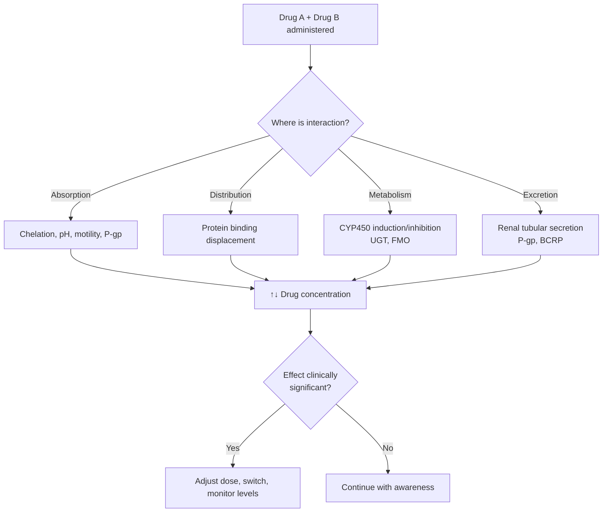
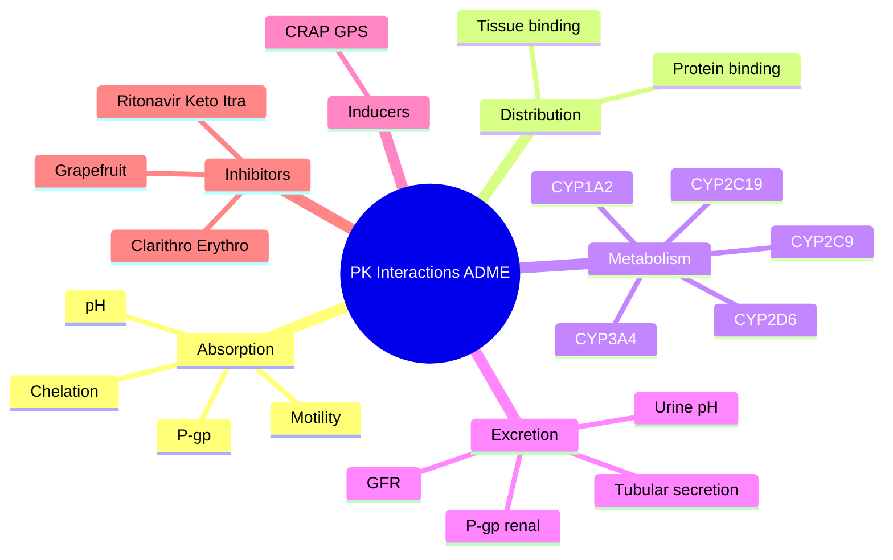

> [!info]
> **Disease-Level Topic** under **Drug Interactions → Pharmacokinetic Interactions**.
> Davidson 24e Ch2 — "Drug Interactions and Polypharmacy" (Maxwell SRJ).

## 1. 1. Learning Objectives
- [ ] Define pharmacokinetic (PK) vs pharmacodynamic (PD) drug interactions
- [ ] Describe ADME (Absorption, Distribution, Metabolism, Excretion) and where interactions occur
- [ ] Apply clinical examples at each ADME stage
- [ ] Recognise **CYP450 inducers** and **inhibitors**
- [ ] Identify high-risk drug combinations
- [ ] Use BNF "Interactions" appendix
- [ ] Counsel patients on common interactions (grapefruit, dairy, warfarin)

## 2. 2. ADME Stages of Pharmacokinetics

| Stage | Process | Where interactions occur |
|-------|---------|--------------------------|
| **A**bsorption | Drug enters systemic circulation | Gastric pH, chelation, transporters (P-gp), gut motility |
| **D**istribution | Drug disperses to tissues | Protein binding (albumin, α1-AGP) |
| **M**etabolism | Drug biotransformed (Phase I + II) | CYP450, UGT, MAO |
| **E**xcretion | Drug eliminated | Renal (GFR, tubular secretion), biliary, faecal |

## 3. 3. Mermaid Algorithm — PK Interaction Framework

## 4. 4. Comparison Tables

### 1. 4.1 Absorption Interactions

| Mechanism | Example | Effect |
|-----------|---------|--------|
| **Chelation** (Ca²⁺, Mg²⁺, Al³⁺, Fe²⁺) | Tetracycline / quinolone + dairy / antacid / iron | ↓ Absorption 50-90% |
| **Gastric pH ↑ (PPIs, H2-blockers, antacids)** | Ketoconazole/itraconazole + PPI | ↓ Absorption (need acidic pH) |
| **Gastric pH ↑ benefit** | CaCO₃ + levothyroxine | ↓ Levothyroxine absorption (separate by 4h) |
| **Gut motility** | Metoclopramide (↑ motility) + paracetamol | ↑ Paracetamol absorption (faster) |
| | Loperamide (↓ motility) + paracetamol | Delayed but same total absorption |
| **P-gp inhibition** | Quinidine + digoxin | ↑ Digoxin (P-gp efflux blocked) |
| **P-gp induction** | Rifampicin + digoxin | ↓ Digoxin (↑ P-gp efflux) |
| **Adsorption** | Activated charcoal + most drugs | ↓ Absorption (used in overdose) |
| **Grapefruit juice** | Felodipine, simvastatin, ciclosporin | ↑ Bioavailability (CYP3A4 inhibition in gut) |

### 2. 4.2 Distribution Interactions

| Mechanism | Example | Effect |
|-----------|---------|--------|
| **Protein binding displacement** | Warfarin + sulfonamides (less relevant with low Ka) | Theoretical ↑ free warfarin (transient) |
| | Phenytoin + valproate | ↑ Free phenytoin (monitor levels) |
| **Tissue binding displacement** | Digoxin + quinidine | ↑ Digoxin (↓ tissue binding + ↓ renal clearance) |

> **Clinical relevance:** Protein binding interactions are less important than once thought. Steady-state free drug concentration is unchanged unless elimination is also affected. Theophylline, warfarin, phenytoin are classic examples.

### 3. 4.3 Metabolism Interactions (CYP450)

#### Major CYP Isoforms & Substrates

| CYP | Substrates (selected) | % of drugs metabolised |
|-----|----------------------|------------------------|
| **CYP3A4/5** | Statins (simva, atorva), ciclosporin, tacrolimus, midazolam, fentanyl, amiodarone, protease inhibitors, CCB, sildenafil, apixaban, rivaroxaban, diltiazem | ~50% |
| **CYP2D6** | Codeine, tramadol, metoprolol, tamoxifen, haloperidol, antidepressants (TCA, SSRI-fluoxetine, paroxetine) | ~25% |
| **CYP2C9** | Warfarin-S, phenytoin, NSAIDs (ibuprofen, diclofenac), losartan, glipizide, fluvastatin | ~15% |
| **CYP2C19** | Clopidogrel, PPIs (omeprazole, esomeprazole), diazepam, voriconazole, sertraline | ~10% |
| **CYP1A2** | Theophylline, caffeine, clozapine, olanzapine, warfarin (minor), tizanidine | ~5% |
| **CYP2E1** | Alcohol, paracetamol, anaesthetics | ~5% |

#### CYP Inducers (Mnemonic: "**CRAP GPS**")

| Inducer | CYPs induced | Clinical effect |
|---------|--------------|-----------------|
| **C**arbamazepine | 1A2, 2C9, 2C19, 3A4 | ↓ Warfarin, OCP, simvastatin, ciclosporin |
| **R**ifampicin | 1A2, 2C9, 2C19, 3A4 (P-gp) | ↓ Most drugs |
| **A**lcohol (chronic) | 2E1, 3A4 | ↑ Paracetamol toxicity |
| **P**henytoin | 1A2, 2C9, 2C19, 3A4 | ↓ Warfarin, OCP, ciclosporin |
| **G**riseofulvin | 3A4 | ↓ OCP, warfarin |
| **P**henobarbital | 1A2, 2C9, 2C19, 3A4 | ↓ Many |
| **S**t John's Wort | 3A4 (P-gp) | ↓ Ciclosporin, OCP, simvastatin, apixaban |

#### CYP Inhibitors (Mnemonic: "**SEEK SSICK**" or "**I LOVE EUG**")

| Inhibitor | CYPs inhibited | Clinical effect |
|-----------|---------------|-----------------|
| **S**imvastatin, **S**ertraline | 2D6 (sertraline) | ↑ Substrate drug |
| **E**rythromycin, **E**somicin | 3A4 | ↑ Ciclosporin, simvastatin, apixaban |
| **E**xenical (orlistat) | — (no CYP effect) | — |
| **K**etoconazole, **K**etolide | 3A4 | ↑ Many |
| **SS**RI (fluoxetine, paroxetine) | 2D6 (paroxetine), others | ↑ TCA, metoprolol |
| **I**traconazole, **I**soniazid | 3A4 (itra) | ↑ Ciclosporin |
| **C**imetidine, **C**iprofloxacin | 1A2 (cipro), 3A4 (cime) | ↑ Theophylline |
| **K**ava | — | — |
| **A**miodarone, **A**prepitant | 3A4 | ↑ Many |
| **L**ansoprazole, **L**operamide | 3A4 (Lanso mild) | Modest |
| **O**meprazole | 2C19 | ↑ Clopidogrel metabolism↓ → ↓ antiplatelet effect |
| **V**erapamil, **V**oriconazole | 3A4 (Vori) | ↑ Simvastatin, ciclosporin |
| **E**thanol (acute) | 2E1, 3A4 | ↑ CNS depressants |
| **E**rythromycin (above) | — | — |
| **G**rapefruit | 3A4 (intestinal) | ↑ Statins, CCB, ciclosporin |
| **R**itonavir | 3A4 (very strong) | ↑ Most drugs — careful |
| **Q**uinidine | 2D6 | ↑ β-blockers, TCAs |

> **Mnemonic: "I LOVE EUG"** — Itraconazole, Lansoprazole, Omeprazole, Voriconazole, Erythromycin, **U** (Umbrella), Grapefruit

> **Strong 3A4 inhibitors ("**I** **C**an't **B**elieve **S**ome **A**sians **D**on't **G**row **P**umpkins"):** Itraconazole, Clarithromycin, B**I**something... Actually mnemonic: **"Pot KICKER"** — Protease inhibitors, Ketoconazole, Itraconazole, Clarithromycin, Erythromycin, Ritonavir.

### 4. 4.4 Excretion Interactions

| Mechanism | Example | Effect |
|-----------|---------|--------|
| **GFR reduction** | ACEi + diuretic + NSAID | ↓ Renal drug clearance (esp. lithium, digoxin) |
| **Tubular secretion competition** | Probenecid + penicillins, cephalosporins | ↓ Penicillin excretion → ↑ levels |
| | Trimethoprim + methotrexate | ↓ MTX clearance → toxicity |
| | NSAIDs + lithium | ↓ Li clearance → toxicity |
| **P-gp inhibition (renal)** | Quinidine, verapamil + digoxin | ↑ Digoxin (renal tubular P-gp) |
| **Urine pH change** | NaHCO₃ + salicylates | ↑ Salicylate excretion (alkaline urine) |
| | NH4Cl + amphetamines | ↑ Amphetamine excretion (acid urine) |
| **Biliary excretion** | Rifampicin + bile acid sequestrants | ↓ Rifampicin absorption (give 6h apart) |

## 5. 5. FCPS/MRCP High-Yield Summary

| Pearl | Detail |
|-------|--------|
| Most common PK interaction site | Metabolism (CYP450) |
| Most common CYP involved | CYP3A4 (50% of drugs) |
| Strongest CYP3A4 inducers | Rifampicin, carbamazepine, phenytoin, St John's Wort |
| Strongest CYP3A4 inhibitors | Ritonavir, ketoconazole, itraconazole, clarithromycin, grapefruit |
| Warfarin S-enantiomer | CYP2C9 |
| Warfarin R-enantiomer | CYP1A2, CYP3A4 |
| Clopidogrel activation | CYP2C19 — omeprazole inhibits → ↓ active metabolite |
| Statin + macrolide | ↑ Myopathy/rhabdomyolysis |
| Lithium + NSAID/ACEi/thiazide | ↑ Lithium toxicity (↓ clearance) |
| Methotrexate + trimethoprim | Additive antifolate → pancytopenia |
| Digoxin + amiodarone | ↑ Digoxin (P-gp + renal) |
| OCP + rifampicin | ↓ OCP efficacy → pregnancy |
| Warfarin + amiodarone | ↑ INR (↓ metabolism + ↓ clearance) |
| Warfarin + fluconazole | ↑ INR (CYP2C9 inhibition) |
| Warfarin + cranberry juice | ↑ INR (CYP2C9 inhibition) |
| Theophylline + ciprofloxacin | ↑ Theophylline (CYP1A2 inhibition) → toxicity |
| Methotrexate + aspirin | ↑ MTX toxicity (↓ renal clearance, protein binding) |
| Ciclosporin + St John's Wort | ↓ Ciclosporin (rejection risk) |
| Tacrolimus + diltiazem | ↑ Tacrolimus (CYP3A4 inhibition) |

## 6. 6. Viva Questions (10)

1. **Define pharmacokinetic interaction.**
   *An interaction in which one drug alters the absorption, distribution, metabolism, or excretion (ADME) of another drug, changing its plasma concentration.*

2. **What is the most common site of PK interactions?**
   *Metabolism (CYP450 enzymes), particularly CYP3A4 which metabolises ~50% of drugs.*

3. **Name the 4 major CYP isoforms and their key substrates.**
   *CYP3A4 (statins, ciclosporin, midazolam, CCB); CYP2D6 (codeine, metoprolol, TCA); CYP2C9 (warfarin, phenytoin, NSAIDs); CYP2C19 (clopidogrel, PPIs).*

4. **Name 5 strong CYP3A4 inducers.**
   *Rifampicin, carbamazepine, phenytoin, phenobarbital, St John's Wort.*

5. **Name 5 strong CYP3A4 inhibitors.**
   *Ritonavir, ketoconazole, itraconazole, clarithromycin, erythromycin, grapefruit juice.*

6. **Why does warfarin + amiodarone cause bleeding?**
   *Amiodarone inhibits CYP2C9 (warfarin-S metabolism) and CYP3A4 (warfarin-R); also displaces warfarin from protein binding. Reduces warfarin requirement by 30-50%. Reduce warfarin dose by 30-50% and monitor INR closely.*

7. **Why does ciclosporin + St John's Wort cause transplant rejection?**
   *St John's Wort induces CYP3A4 and P-gp → ↓ ciclosporin levels (often by 50%) → acute rejection. ALWAYS avoid St John's Wort in transplant patients.*

8. **What is the "triple whammy" for AKI?**
   *ACEi/ARB + diuretic + NSAID — particularly in dehydrated/elderly. All three impair renal autoregulation → AKI.*

9. **Why does clopidogrel + omeprazole require caution?**
   *Omeprazole inhibits CYP2C19, which activates clopidogrel (prodrug). ↓ Active metabolite → ↓ antiplatelet effect → ↑ CV events. FDA warning; use pantoprazole or H2-blocker instead.*

10. **Why does grapefruit juice + simvastatin cause rhabdomyolysis?**
    *Grapefruit inhibits intestinal CYP3A4 → ↑ simvastatin bioavailability → ↑ plasma levels → myopathy/rhabdomyolysis. Avoid or switch to pravastatin/rosuvastatin (not CYP3A4 metabolised).*

## 7. 7. Confusions & Mnemonics

| Confusion | Resolution |
|-----------|------------|
| PK vs PD | PK = concentration change; PD = effect change at same concentration |
| CYP3A4 induction vs inhibition | Induction = ↓ drug levels; Inhibition = ↑ drug levels |
| Generic vs brand PK | Same if bioequivalent (within 80-125%) |
| P-gp vs CYP3A4 | P-gp = transporter (efflux); CYP3A4 = metaboliser. Often co-regulated. |
| Grapefruit vs orange | Grapefruit only (furanocoumarins); orange safe |
| OCP + antibiotic | Most antibiotics do NOT affect OCP; only rifampicin + rifabutin reduce efficacy (CYP3A4 induction) |
| Warfarin + cranberry | ↑ INR (CYP2C9) |
| Digoxin + macrolide | ↑ Digoxin (P-gp inhibition); avoid clarithromycin/erythromycin |
| Theophylline + ciprofloxacin | ↑ Theophylline → toxicity (CYP1A2) |
| Methotrexate + trimethoprim | Additive antifolate → pancytopenia (avoid) |
| Lithium + NSAID | ↑ Lithium toxicity (↓ clearance) |

**Mnemonic — ADME: "**A**lways **D**eal **M**edications **E**ffectively"**

**Mnemonic — CYP3A4 inducers: "**CRAP GPS**"** (Carbamazepine, Rifampicin, Alcohol, Phenytoin, Griseofulvin, Phenobarbital, St John's Wort)

**Mnemonic — CYP3A4 inhibitors: "**SEEK SSICK**"** (Simvastatin, Erythromycin, Esomeprazole, Ketoconazole, SSRIs, Sodium bicarbonate, Itraconazole, Cimetidine, Ketolides)

**Mnemonic — Grapefruit: "**A**void **G**rapefruit with **S**tatins, **C**CB, **C**iclosporin, **A**pIXaban (AG-SCCA)"**

**Mnemonic — Lithium toxicity precipitants: "**NAT**"** — **N**SAIDs, **A**CEi, **T**hiazides

**Mnemonic — Triple whammy: "**A**CEi + **D**iuretic + **N**SAID = AKI"** (ADN)

## 8. 8. Mermaid Mind Map

## 9. 9. Spaced Repetition Tracker

| Topic | Day 1 | Day 3 | Day 7 | Day 14 | Day 30 |
|-------|-------|-------|-------|-------|--------|
| ADME definition | ☐ | ☐ | ☐ | ☐ | ☐ |
| CYP3A4 substrates | ☐ | ☐ | ☐ | ☐ | ☐ |
| CYP3A4 inducers | ☐ | ☐ | ☐ | ☐ | ☐ |
| CYP3A4 inhibitors | ☐ | ☐ | ☐ | ☐ | ☐ |
| Warfarin + amiodarone | ☐ | ☐ | ☐ | ☐ | ☐ |
| Triple whammy | ☐ | ☐ | ☐ | ☐ | ☐ |
| Grapefruit drugs | ☐ | ☐ | ☐ | ☐ | ☐ |

## 10. 10. Self-Test Scorecard

| Domain | Score (0-5) |
|--------|-------------|
| ADME framework | /5 |
| CYP substrates | /5 |
| CYP inducers | /5 |
| CYP inhibitors | /5 |
| Clinical examples | /5 |
| Management strategies | /5 |
| **TOTAL** | **/30** |

## 11. 11. MCQs (10)

1. **The most common site of pharmacokinetic interactions is:**
   A. Absorption
   B. Distribution
   C. Metabolism ✓
   D. Excretion
   E. All equally

2. **CYP3A4 metabolises approximately what percentage of all drugs?**
   A. 5%
   B. 15%
   C. 30%
   D. 50% ✓
   E. 80%

3. **Which of the following is a CYP3A4 INDUCER?**
   A. Ritonavir
   B. Ketoconazole
   C. Rifampicin ✓
   D. Grapefruit
   E. Clarithromycin

4. **Which of the following is a CYP3A4 INHIBITOR?**
   A. Rifampicin
   B. Carbamazepine
   C. Phenytoin
   D. Grapefruit juice ✓
   E. St John's Wort

5. **The "triple whammy" for AKI is:**
   A. ACEi + β-blocker + diuretic
   B. ACEi + diuretic + NSAID ✓
   C. ARB + statin + aspirin
   D. ACEi + CCB + statin
   E. NSAID + paracetamol + opioid

6. **Warfarin + amiodarone results in:**
   A. ↓ INR
   B. ↑ INR (bleeding risk) ✓
   C. No change
   D. ↑ Clotting
   E. ↑ Bleeding only

7. **Ciclosporin + St John's Wort causes:**
   A. Ciclosporin toxicity
   B. Ciclosporin level ↓ → rejection ✓
   C. No change
   D. Renal failure
   E. Hepatotoxicity

8. **Clopidogrel + omeprazole results in:**
   A. ↑ Clopidogrel effect
   B. ↓ Clopidogrel activation → ↓ antiplatelet effect ✓
   C. ↑ PPI effect
   D. Bleeding
   E. No change

9. **Lithium toxicity is most likely precipitated by:**
   A. Paracetamol
   B. Amoxicillin
   C. NSAID ✓
   D. Aspirin (low dose)
   E. Ramipril (decrease)

10. **Methotrexate + trimethoprim causes:**
    A. No interaction
    B. Pancytopenia (additive antifolate) ✓
    C. Hepatotoxicity
    D. Bleeding
    E. Renal failure

## 12. 12. SBAs (5)

1. **A 65-year-old post-MI patient on simvastatin develops myopathy. Recently started clarithromycin for pneumonia. Mechanism:**
   - A) CYP3A4 induction by clarithromycin
   - B) CYP3A4 inhibition by clarithromycin → ↑ simvastatin ✓
   - C) Renal failure from clarithromycin
   - D) P-gp induction
   - E) Grapefruit

2. **A transplant patient on ciclosporin takes St John's Wort for depression. Two weeks later, ciclosporin level is low. Mechanism:**
   - A) SJW inhibits CYP3A4
   - B) SJW induces CYP3A4 and P-gp → ↓ ciclosporin ✓
   - C) SJW displaces ciclosporin
   - D) SJW enhances renal clearance
   - E) SJW has no effect

3. **A patient on warfarin starts fluconazole for candidiasis. INR rises to 8. Mechanism:**
   - A) Fluconazole induces CYP2C9
   - B) Fluconazole inhibits CYP2C9 → ↓ warfarin-S metabolism ✓
   - C) Fluconazole displaces warfarin
   - D) Fluconazole enhances vitamin K
   - E) Warfarin dose too high

4. **A 60-year-old on lisinopril + indapamide takes ibuprofen for back pain and develops AKI. Mechanism:**
   - A) Triple whammy — ACEi + diuretic + NSAID → renal hypoperfusion ✓
   - B) NSAID overdose
   - C) Lisinopril + ibuprofen only
   - D) Diuretic toxicity
   - E. Indapamide toxicity

5. **A patient on theophylline for COPD takes ciprofloxacin for UTI. Two days later, develops nausea, tremor, tachycardia. Mechanism:**
   - A) Ciprofloxacin induces CYP1A2
   - B) Ciprofloxacin inhibits CYP1A2 → ↑ theophylline (toxicity) ✓
   - C) Ciprofloxacin displaces theophylline
   - D) Ciprofloxacin + theophylline = bleeding
   - E. Additive β-agonism

## 13. 13. Answer Key

### 1. MCQ Answers
1. **C** (Metabolism is the most common site)
2. **D** (CYP3A4 metabolises ~50% of drugs)
3. **C** (Rifampicin = inducer)
4. **D** (Grapefruit = inhibitor)
5. **B** (Triple whammy)
6. **B** (↑ INR = bleeding risk)
7. **B** (SJW ↓ ciclosporin → rejection)
8. **B** (Omeprazole ↓ clopidogrel activation)
9. **C** (NSAID ↓ Li clearance)
10. **B** (Pancytopenia — additive antifolate)

### 2. SBA Answers
1. **B** — Clarithromycin inhibits CYP3A4 → ↑ simvastatin → myopathy. Hold simvastatin or switch to azithromycin.
2. **B** — SJW induces CYP3A4 and P-gp → ↓ ciclosporin → rejection. AVOID SJW in transplant.
3. **B** — Fluconazole inhibits CYP2C9 → ↓ warfarin-S metabolism → ↑ INR. Reduce warfarin dose 30-50%.
4. **A** — Triple whammy (ACEi + diuretic + NSAID) → AKI. Hold ACEi + diuretic + NSAID, IV fluids.
5. **B** — Ciprofloxacin inhibits CYP1A2 → ↑ theophylline → toxicity. Use alternative (e.g., levofloxacin) or ↓ theophylline dose.

## 14. 14. Summary Box

> **PK interactions occur at ADME stages — most often at metabolism (CYP450).** CYP3A4 metabolises ~50% of drugs. Inducers (CRAP GPS): Rifampicin, Carbamazepine, Phenytoin, St John's Wort, Phenobarbital. Inhibitors: Ritonavir, Ketoconazole, Itraconazole, Clarithromycin, Erythromycin, Grapefruit. Key interactions: Warfarin + Amiodarone, OCP + Rifampicin, Ciclosporin + SJW, Simvastatin + Macrolide, Lithium + NSAID, Methotrexate + Trimethoprim, Theophylline + Ciprofloxacin. **Always use BNF Interactions appendix.**

---

## 15. 15. Cross-Links
- **Parent Topic-Group**: [[../Drug Interactions|Drug Interactions]]
- **Sibling Topic-Groups**: [[Clinical significance]], [[High-risk drug combinations]]
- **Heading Hub**: [[Drug Interactions]]
- **Chapter MOC**: [[Clinical Therapeutics and Good Prescribing MOC]]
- **Related**: [[ADRs]], [[CYP450 Drug Interactions]], [[Special Populations/Renal Impairment/Renal Drug Dosing]]

**Last Updated:** 2026-06-15  
**Status: FULLY COMPLETE with Exam Suite (Viva 10, MCQ 10, SBA 5, Answer Key, Confusions, Mind Map, Spaced Repetition, Self-Test, Exam Modes)**
