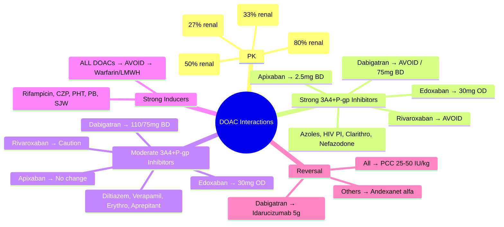

# DOAC High-Risk Interactions

**Status**: `draft` | **Chapter**: 2 — Clinical Therapeutics and Good Prescribing | **Heading**: Drug Interactions → High-Risk Combinations | **Exam Priority**: ⭐⭐⭐ **HIGHEST** (Increasing DOAC use, NICE/ESC guidelines, ward rounds)

---

## 🎯 Learning Objectives
- [ ] Know DOAC metabolism: CYP3A4 + P-gp (Rivaroxaban, Apixaban) vs P-gp only (Dabigatran, Edoxaban)
- [ ] Apply interaction tables for strong/moderate inhibitors and inducers
- [ ] Execute dose adjustment algorithms per NICE/ESC/UK guidelines
- [ ] Manage peri-procedural bridging and reversal
- [ ] Recognise contraindicated combinations

---

## 🧬 DOAC Pharmacokinetics

| DOAC | Metabolism | P-gp Substrate | Renal Clearance | Key Interactions |
|------|------------|----------------|-----------------|------------------|
| **Rivaroxaban** | **CYP3A4 (major) + CYP2J2 + P-gp** | **Yes** | ~33% (CrCl dependent) | **Strong 3A4+P-gp i → Avoid** |
| **Apixaban** | **CYP3A4 (major) + P-gp** | **Yes** | ~27% | **Strong 3A4+P-gp i → 2.5mg BD** |
| **Edoxaban** | Minimal CYP (mostly hydrolysis) + **P-gp** | **Yes** | **~50%** | **P-gp i → ↓ dose** |
| **Dabigatran** | **None (conjugation)** | **Yes** | **~80%** | **P-gp i → ↓ dose / Avoid** |

---

## ⚡ Interaction Classification & Dose Adjustments

### Strong CYP3A4 + P-gp Inhibitors
**Azole antifungals (Ketoconazole, Itraconazole, Voriconazole, Posaconazole), HIV PIs (Ritonavir, Cobicistat, Lopinavir/ritonavir), Clarithromycin, Nefazodone**

| DOAC | Standard Dose | **With Strong 3A4+P-gp Inhibitor** |
|------|---------------|-----------------------------------|
| **Rivaroxaban** | 20mg OD (15mg CrCl 15–49) | **CONTRAINDICATED / AVOID** — switch to Apixaban or LMWH |
| **Apixaban** | 5mg BD (2.5mg if ≥2: age≥80, wt≤60, CrCl≤30) | **↓ to 2.5mg BD** (if already 2.5mg → avoid) |
| **Edoxaban** | 60mg OD (30mg CrCl 15–50, wt≤60, P-gp i) | **↓ to 30mg OD** |
| **Dabigatran** | 150mg BD (110mg CrCl 30–49, age≥80, verapamil) | **Avoid** (CrCl<30) / **↓ to 75mg BD** (if CrCl 30–50) |

### Moderate CYP3A4 + P-gp Inhibitors
**Diltiazem, Verapamil, Erythromycin, Aprepitant, Dronedarone, Ciprofloxacin, Fluconazole, Amlodipine (weak), Ranolazine**

| DOAC | Standard Dose | **With Moderate 3A4+P-gp Inhibitor** |
|------|---------------|-------------------------------------|
| **Rivaroxaban** | 20mg OD | **Use with caution** — monitor renal, Hb; avoid if CrCl<30 |
| **Apixaban** | 5mg BD | **No dose adjustment** (standard 5mg BD; if 2.5mg BD → continue) |
| **Edoxaban** | 60mg OD | **↓ to 30mg OD** |
| **Dabigatran** | 150mg BD | **↓ to 110mg BD** (CrCl 30–50) / **75mg BD** (verapamil specifically) |

### Strong P-gp Inhibitors (No CYP3A4)
**Quinidine, Verapamil (also mod 3A4), Amiodarone, Ticagrelor, Carvedilol, Cyclosporine, Dronedarone, Ritonavir (also 3A4)**

| DOAC | Action |
|------|--------|
| **Dabigatran** | **↓ to 110mg BD** (CrCl 30–50) / **75mg BD** (verapamil) / **Avoid** (cyclosporine, dronedarone, ticagrelor if CrCl<50) |
| **Edoxaban** | **↓ to 30mg OD** |
| **Rivaroxaban/Apixaban** | As per 3A4+P-gp above |

### Strong Inducers
**Rifampicin, Carbamazepine, Phenytoin, Phenobarbital, St John's Wort, Modafinil, Efavirenz, Nevirapine, Etravirine, Bosentan**

| DOAC | **With Strong Inducer** |
|------|------------------------|
| **Rivaroxaban** | **CONTRAINDICATED / AVOID** — ↓ exposure → thrombosis risk |
| **Apixaban** | **CONTRAINDICATED / AVOID** |
| **Edoxaban** | **AVOID** |
| **Dabigatran** | **AVOID** |

---

## 📋 Clinical Decision Algorithm

```mermaid
flowchart TD
    A[Patient needs DOAC + interacting drug] --> B{Interactor type?}
    B -->|**Strong 3A4+P-gp inhibitor**<br/>Azoles, HIV PI, Clarithro, Nefazodone| C{Rivaroxaban?}
    C -->|Yes| D[**SWITCH to Apixaban 2.5mg BD**<br/>OR LMWH]
    C -->|No (Apixaban)| E[**Apixaban 2.5mg BD**<br/>(if already 2.5mg → avoid)]
    C -->|Edoxaban| F[**Edoxaban 30mg OD**]
    C -->|Dabigatran| G[**AVOID** → Apixaban/LMWH]
    B -->|**Moderate 3A4+P-gp inhibitor**<br/>Diltiazem, Verapamil, Erythro, Aprepitant| H{Rivaroxaban?}
    H -->|Yes| I[**Caution** — monitor Hb, renal<br/>Avoid if CrCl<30]
    H -->|Apixaban| J[**No dose change**]
    H -->|Edoxaban| K[**Edoxaban 30mg OD**]
    H -->|Dabigatran| L[**110mg BD** (CrCl 30–50) / **75mg BD** (verapamil)]
    B -->|**Strong Inducer**<br/>Rifampicin, CZP, PHT, PB, SJW| M[**AVOID ALL DOACs**<br/>Use Warfarin (dose adjust) or LMWH]
```

---

## 🎯 FCPS/MRCP High-Yield Scenarios

| Scenario | Correct Management |
|----------|-------------------|
| AF patient on rivaroxaban 20mg, needs clarithromycin for pneumonia | **Switch to apixaban 2.5mg BD** (if CrCl>25) or **LMWH** for duration |
| VTE on apixaban 5mg BD, starts itraconazole for fungal infection | **Reduce apixaban to 2.5mg BD** |
| DVT on edoxaban 60mg, starts verapamil for rate control | **Reduce edoxaban to 30mg OD** |
| AF on dabigatran 150mg BD, needs verapamil | **Reduce to 110mg BD** (or 75mg BD if verapamil specifically) |
| Patient on rivaroxaban, starts carbamazepine for seizures | **AVOID DOAC** → switch to **warfarin** (↑ dose 2–3x, INR q2–3d) or LMWH |
| CrCl 40, apixaban 5mg BD, starts ketoconazole | **Reduce to 2.5mg BD** |
| CrCl 20, rivaroxaban 15mg, needs fluconazole | **AVOID** → switch to apixaban 2.5mg BD or LMWH |

---

## ⚠️ Special Situations

### Renal Impairment + Inhibitor Combination
| DOAC | CrCl 15–29 | CrCl 30–49 |
|------|------------|------------|
| **Rivaroxaban** | 15mg OD (avoid if strong 3A4+P-gp i) | 15mg OD (caution with moderate i) |
| **Apixaban** | 2.5mg BD if ≥2 criteria (age≥80, wt≤60, CrCl≤30) | 5mg BD standard (2.5mg if ≥2 criteria) |
| **Edoxaban** | 30mg OD | 30mg OD if wt≤60 or P-gp i |
| **Dabigatran** | **Avoid** (CrCl<30) | 110mg BD (75mg with verapamil) |

### Peri-Procedural Management
| Bleed Risk | Last DOAC Dose | Restart |
|------------|----------------|---------|
| **Low** (dental, cataract, skin biopsy) | Skip 1 dose (×24h) | 24h post-op |
| **High** (major surgery, neurosurgery, spinal) | **Rivaroxaban/Apixaban/Edoxaban: 48h**<br/>**Dabigatran: 48h (CrCl≥50), 72h (CrCl 30–50)** | 48–72h post-op (haemostasis secured) |
| **Bridging** | **NO routine bridging** for DOACs (unlike warfarin) | — |

### Reversal Agents
| DOAC | Reversal Agent | Dose |
|------|----------------|------|
| **Rivaroxaban / Apixaban / Edoxaban** | **Andexanet alfa** | Bolus + 2h infusion (dose by drug/last dose) |
| **Dabigatran** | **Idarucizumab** | 5g IV (2 × 2.5g vials) |
| **All** | **PCC (4-factor)** | 25–50 IU/kg (if specific agent unavailable) |

---

## ❓ Viva Questions (10)

| Q | Answer |
|---|--------|
| 1. Rivaroxaban metabolism? | CYP3A4 (major) + CYP2J2 + P-gp; ~33% renal |
| 2. Apixaban metabolism? | CYP3A4 (major) + P-gp; ~27% renal |
| 3. Dabigatran metabolism? | **No CYP** (glucuronidation); **P-gp substrate**; **~80% renal** |
| 4. Strong 3A4+P-gp inhibitor + rivaroxaban? | **AVOID** — switch to apixaban 2.5mg BD or LMWH |
| 5. Same inhibitor + apixaban? | **Reduce to 2.5mg BD** |
| 6. Strong inducer (rifampicin) + any DOAC? | **AVOID ALL** — use warfarin or LMWH |
| 7. Verapamil + dabigatran 150mg BD (CrCl 45)? | **Reduce to 75mg BD** (verapamil specific) |
| 8. Peri-procedural: high bleed risk surgery, last apixaban dose? | **48h before** |
| 9. Dabigatran reversal agent? | **Idarucizumab 5g IV** |
| 10. Apixaban reversal agent? | **Andexanet alfa** (bolus + infusion) |

---

## 🤯 Confusions & Mnemonics

| Confusion | Clarification |
|-----------|---------------|
| **Rivaroxaban vs Apixaban with strong inhibitors** | Rivaroxaban more dependent on 3A4+P-gp → **avoid**; Apixaban allows **2.5mg BD** |
| **Dabigatran = no CYP** | Only P-gp; renal clearance 80% → avoid if CrCl<30 |
| **Edoxaban = P-gp only (minimal CYP)** | 50% renal; dose reduce 30mg OD with P-gp inhibitors |
| **Inducers = contraindicated for ALL DOACs** | Unlike warfarin (dose adjust), DOACs have no validated dose for inducers |
| **Bridging** | **NO routine bridging** for DOACs (rapid on/off); warfarin needs bridging |

**Mnemonics:**
- **"RIPPER DOACs"** = **R**ivaroxaban, **I**traconazole, **P**rotease inhibitors, **P**osaconazole, **E**rythromycin (clarithro), **R**itonavir = **Strong 3A4+P-gp inhibitors**
- **"RIVAROXABAN AVOIDS"** = **A**void with **V**ery strong inhibitors; **O**ther DOACs allow dose reduce
- **"APIXABAN ALLOWS 2.5"** = **A**pixaban **A**llows **2**.5mg **B**D with strong inhibitors
- **"DABIGATRAN = 80% RENAL"** = **D**abigatran **8**0% **R**enal, **A**void if CrCl<30
- **"INDUCERS = NO DOACs"** = **R**ifampicin, **C**ZP, **P**HT, **P**B, **S**JW → **Warfarin or LMWH**

---

## 🧠 Mind Map (Mermaid)



---

## 📅 Spaced Repetition Tracker

| Review | Date | Score | Next |
|--------|------|-------|------|
| 1 | | | 1d |
| 2 | | | 3d |
| 3 | | | 1w |
| 4 | | | 2w |
| 5 | | | 1m |
| 6 | | | 3m |

---

## 🧪 Self-Test Scorecard

| Section | Max | Score |
|---------|-----|-------|
| PK table | 8 | |
| Strong inhibitor adjustments | 8 | |
| Moderate inhibitor adjustments | 8 | |
| Inducer management | 4 | |
| Renal + inhibitor combo | 6 | |
| Peri-procedural | 4 | |
| Reversal agents | 4 | |
| Viva answers | 10 | |
| **Total** | **52** | |

**Target**: ≥42/52 (80%)

---

## 📝 Exam Answer Modes

### Short Question (5 marks): *"Rivaroxaban + clarithromycin"*
- Clarithromycin = strong CYP3A4+P-gp inhibitor
- Rivaroxaban = CYP3A4+P-gp substrate
- ↑ Rivaroxaban exposure → bleed risk
- **Avoid combination** → switch to **apixaban 2.5mg BD** or LMWH

### Viva (2 min): *"AF patient, CrCl 45, on apixaban 5mg BD. Starts itraconazole for aspergillosis. Plan?"*
- Itraconazole = strong CYP3A4+P-gp inhibitor
- Apixaban standard dose 5mg BD (CrCl 45, no other criteria)
- **Reduce to apixaban 2.5mg BD**
- Monitor Hb, renal function
- Restart 5mg BD after itraconazole stopped

### Ward Round (30 sec): *"DOAC patient needs urgent laparotomy. Last dose 12h ago. Bleed risk high."*
- **Delay 48h if possible** (apixaban/rivaroxaban/edoxaban)
- If emergency → **Andexanet alfa** (apixa/rivaro/edoxa) or **Idarucizumab** (dabi)
- PCC 4-factor if specific unavailable

### Last-Night Revision (1-liners):
- Rivaroxaban = CYP3A4+P-gp (33% renal) — AVOID strong inhibitors
- Apixaban = CYP3A4+P-gp (27% renal) — 2.5mg BD with strong inhibitors
- Edoxaban = P-gp mainly (50% renal) — 30mg OD with inhibitors
- Dabigatran = P-gp only (80% renal) — avoid CrCl<30
- Inducers (Rifampicin, CZP, PHT, PB, SJW) → AVOID ALL DOACs
- Strong inhibitors: Azoles, HIV PI, Clarithro, Nefazodone
- Moderate: Diltiazem, Verapamil, Erythro, Aprepitant
- Reversal: Dabi → Idarucizumab 5g; Others → Andexanet alfa; All → PCC
- No bridging for DOACs

---

## 📚 Summary Card

> **DOAC INTERACTION TRIAGE:**
> 1. **IDENTIFY**: DOAC + Perpetrator + Mechanism (3A4/P-gp/Inducer)
> 2. **CLASSIFY**: Strong inhibitor / Moderate inhibitor / Inducer
> 3. **ACT**: Avoid / Dose reduce / Switch / Bridge
>
> **MEMORY PEGS:**
> - **Rivaroxaban AVOIDS** strong inhibitors
> - **Apixaban ALLOWS 2.5mg BD**
> - **Inducers = NO DOACs** (Warfarin/LMWH)
> - **Dabigatran = 80% Renal** (avoid CrCl<30)

---

## ❓ MCQs (12)

1. **Rivaroxaban is metabolised by:**
   A. CYP2C9 only
   B. **CYP3A4 + P-gp** ✓
   C. P-gp only
   D. CYP2D6 + P-gp
   E. No CYP, P-gp only

2. **Dabigatran renal clearance:**
   A. 27%
   B. 33%
   C. 50%
   D. **80%** ✓
   E. 10%

3. **Strong CYP3A4+P-gp inhibitor + rivaroxaban — recommended:**
   A. Reduce rivaroxaban to 10mg OD
   B. **Avoid rivaroxaban; switch to apixaban 2.5mg BD or LMWH** ✓
   C. Continue rivaroxaban 20mg, monitor INR
   D. Increase rivaroxaban to 30mg OD
   E. Stop anticoagulation

4. **Same inhibitor + apixaban 5mg BD:**
   A. **Reduce to 2.5mg BD** ✓
   B. Avoid
   C. No change
   D. Reduce to 1.25mg BD
   E. Switch to rivaroxaban

5. **Strong inducer (rifampicin) + any DOAC:**
   A. Reduce dose 50%
   B. Monitor levels
   C. **Avoid all DOACs; use warfarin or LMWH** ✓
   D. No interaction
   E. Increase dose 2x

6. **Verapamil + dabigatran 150mg BD (CrCl 45):**
   A. Continue 150mg BD
   B. Reduce to 110mg BD
   C. **Reduce to 75mg BD** ✓ (verapamil specific)
   D. Avoid dabigatran
   E. Switch to apixaban

7. **Apixaban standard dose criteria for 2.5mg BD (≥2 of):**
   A. Age>75, Wt<50kg, CrCl<15
   B. **Age≥80, Wt≤60kg, CrCl≤30** ✓
   C. Age>70, Wt<60kg, CrCl<30
   D. Age≥75, Wt≤50kg, CrCl≤25
   E. Age>65, Wt<70kg, CrCl<40

8. **Edoxaban dose with P-gp inhibitor:**
   A. No change
   B. **Reduce to 30mg OD** ✓
   C. Reduce to 15mg OD
   D. Avoid
   E. Increase to 90mg OD

9. **Peri-procedural high bleed risk surgery — last DOAC dose:**
   A. 24h
   B. **48h** ✓
   C. 72h
   D. 12h
   E. 6h

10. **Dabigatran reversal agent:**
    A. Andexanet alfa
    B. **Idarucizumab 5g IV** ✓
    C. PCC only
    D. Vitamin K
    E. Protamine

11. **Apixaban reversal agent:**
    A. **Andexanet alfa** ✓
    B. Idarucizumab
    C. PCC only
    D. Vitamin K
    E. Protamine

12. **Bridging for DOACs peri-procedurally:**
    A. Always required
    B. Required if CrCl<30
    C. **Not routinely required** ✓
    D. Required for rivaroxaban only
    E. Required for dabigatran only

---

## 🃏 Flashcards (Anki-ready)

| Front | Back |
|-------|------|
| Rivaroxaban PK | CYP3A4 + P-gp substrate; 33% renal; 20mg OD (15mg CrCl 15–49) |
| Apixaban PK | CYP3A4 + P-gp substrate; 27% renal; 5mg BD (2.5mg if ≥2: age≥80, wt≤60, CrCl≤30) |
| Edoxaban PK | Minimal CYP, P-gp substrate; 50% renal; 60mg OD (30mg if CrCl 15–50, wt≤60, P-gp i) |
| Dabigatran PK | No CYP (glucuronidation), P-gp substrate; **80% renal**; 150mg BD (110mg CrCl 30–49, age≥80) |
| Strong 3A4+P-gp inhibitors | Azoles (Keto/Itra/Vori/Posa), HIV PI (Rito/Cobi/Lopinavir), Clarithro, Nefazodone |
| Moderate 3A4+P-gp inhibitors | Diltiazem, Verapamil, Erythro, Aprepitant, Dronedarone, Ciprofloxacin, Fluconazole |
| Strong inducers | Rifampicin, CZP, PHT, PB, SJW, Modafinil, EFV/NVP/ETR, Bosentan |
| Rivaroxaban + strong inhibitor | AVOID → Apixaban 2.5mg BD or LMWH |
| Apixaban + strong inhibitor | 2.5mg BD |
| Edoxaban + inhibitor | 30mg OD |
| Dabigatran + verapamil | 75mg BD (verapamil specific) / 110mg BD (other mod P-gp i) |
| Inducers + DOACs | AVOID ALL → Warfarin or LMWH |
| Peri-procedural high risk | Hold 48h (DOACs) |
| Dabi reversal | Idarucizumab 5g IV |
| Xa inhibitor reversal | Andexanet alfa (bolus + 2h infusion) |
| All DOACs reversal backup | 4-factor PCC 25–50 IU/kg |
| Bridging DOACs | NOT routinely required |

---

## ✅ Answer Keys

### MCQs
1. **B** — Rivaroxaban = CYP3A4 + P-gp
2. **D** — Dabigatran 80% renal
3. **B** — Avoid rivaroxaban with strong inhibitors
4. **A** — Apixaban 2.5mg BD
5. **C** — Avoid all DOACs with inducers
6. **C** — Dabigatran + verapamil = 75mg BD
7. **B** — Apixaban 2.5mg BD criteria: age≥80, wt≤60, CrCl≤30 (≥2)
8. **B** — Edoxaban 30mg OD with P-gp inhibitor
9. **B** — 48h hold for high bleed risk surgery
10. **B** — Idarucizumab 5g IV for dabigatran
11. **A** — Andexanet alfa for apixaban
12. **C** — No routine bridging for DOACs

---

*File: `/mnt/tb/Medicine/Clinical Therapeutics and Good Prescribing/Drug Interactions/High-risk drug combinations/DOAC interactions.md` | Status: `draft` → upgrade after review*