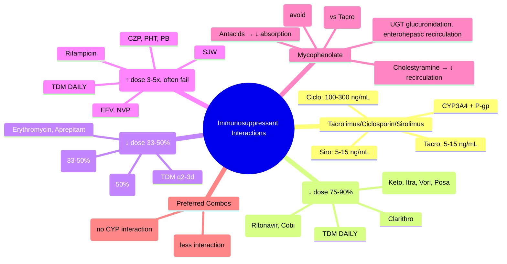

# Immunosuppressant Interactions

**Status**: `draft` | **Chapter**: 2 — Clinical Therapeutics and Good Prescribing | **Heading**: Drug Interactions → High-Risk Combinations | **Exam Priority**: ⭐⭐⭐ **HIGH** (Transplant wards, TDM essential, life-threatening interactions)

---

## 🎯 Learning Objectives
- [ ] Know tacrolimus, ciclosporin, sirolimus metabolism: CYP3A4 + P-gp
- [ ] Apply dose adjustments for strong/moderate inhibitors and inducers
- [ ] Identify contraindicated combinations (azole + tacrolimus = neuro/nephrotoxicity)
- [ ] Execute TDM monitoring protocols post-interaction
- [ ] Manage mycophenolate interactions (MPA glucuronidation, enterohepatic recirculation)

---

## 🧬 Immunosuppressant Pharmacokinetics

| Drug | Metabolism | Transporter | Therapeutic Range (Trough) | Key Feature |
|------|------------|-------------|----------------------------|-------------|
| **Tacrolimus** | **CYP3A4/5** (major) | **P-gp** (ABCB1) | **5–15 ng/mL** (kidney: 5–10; liver: 8–12; heart: 10–15) | Narrow TI; intra-patient variability high |
| **Ciclosporin** | **CYP3A4/5** | **P-gp** | **100–300 ng/mL** (C0); **AUC preferred** | More variable absorption; gum hyperplasia, hirsutism |
| **Sirolimus** | **CYP3A4** | **P-gp** | **5–15 ng/mL** (de novo kidney); **15–20** (high risk) | Long t½ (~60h); loading dose 6–15mg |
| **Everolimus** | **CYP3A4** | **P-gp** | **3–8 ng/mL** | Shorter t½ (~30h); no loading |
| **Mycophenolate (MMF/EC-MPS)** | **UGT1A9 → MPA glucuronide (MPAG)** | **OATP1B1/3, MRP2** | **MPA AUC 30–60 mg·h/L** (not trough) | Enterohepatic recirculation; 2° peak 6–12h |

---

## ⚡ Tacrolimus / Ciclosporin / Sirolimus — Interaction Table

| Interactor | Class | Effect on Tacro/Ciclo/Siro | Dose Adjustment | TDM |
|------------|-------|---------------------------|-----------------|-----|
| **Ketoconazole, Itraconazole, Voriconazole, Posaconazole** | **Strong CYP3A4 + P-gp inhibitor** | **↑↑ 5–10x** (nephro/neurotoxicity) | **↓ Dose 75–90%** (e.g., Tacro 0.5mg → 0.05mg) | **Daily ×1wk**, then q2–3d |
| **Fluconazole** | Moderate CYP3A4 + P-gp inhibitor | ↑ 2–3x | **↓ Dose 50%** | q2–3d ×1wk |
| **Clarithromycin, Erythromycin** | Moderate CYP3A4 + P-gp inhibitor | ↑ 2–4x | **↓ Dose 50–66%** | q2–3d |
| **Ritonavir, Cobicistat, HIV PIs** | Strong CYP3A4 + P-gp inhibitor | ↑↑ 5–10x | **↓ Dose 75–90%** | Daily ×1wk |
| **Diltiazem, Verapamil** | Moderate CYP3A4 + P-gp inhibitor | ↑ 2–3x | **↓ Dose 33–50%** | q2–3d |
| **Aprepitant/Fosaprepitant** | Moderate CYP3A4 inhibitor | ↑ 2x | **↓ Dose 33–50%** | q3–4d |
| **Grapefruit juice** | Intestinal CYP3A4 + P-gp inhibitor | **↑ Unpredictable (2–5x)** | **AVOID** | — |
| **Rifampicin** | **Strong CYP3A4 + P-gp inducer** | **↓ 80–90%** (rejection risk) | **↑ Dose 3–5x** (often impossible) | **Daily** — consider switch |
| **Carbamazepine, Phenytoin, Phenobarbital** | Strong CYP3A4 inducer | ↓ 70–90% | **↑ Dose 3–5x** | **Daily** — consider alternative AED (levetiracetam) |
| **St John's Wort** | CYP3A4 + P-gp inducer | ↓ 50–80% | **AVOID** | — |
| **Efavirenz, Nevirapine, Etravirine** | CYP3A4 inducer | ↓ 50–80% | ↑ Dose 2–3x | q2–3d |

---

## 📋 Tacrolimus + Azole — Clinical Algorithm

```mermaid
flowchart TD
    A[Transplant patient on Tacrolimus] --> B{Needs Antifungal?}
    B -->|**Invasive Candidiasis/Aspergillosis**| C{Azole choice?}
    C -->|**Voriconazole / Posaconazole**| D[**Preferred for moulds**<br/>**Tacro dose ↓ 90% (0.1x)**<br/>e.g., Tacro 3mg BD → 0.5mg OD<br/>**TDM DAILY ×7–10d**]
    C -->|**Fluconazole**| E[**Tacro dose ↓ 50%**<br/>**TDM q2–3d ×1wk**]
    C -->|**Isavuconazole**| F[**Less CYP3A4 inhibition**<br/>Tacro ↓ 33–50%<br/>TDM q2–3d]
    B -->|**Prophylaxis only**| G[**Fluconazole**<br/>Tacro ↓ 50%<br/>TDM q2–3d]
    B -->|**Alternative: Echinocandin**| H[**NO CYP interaction**<br/>Caspofungin, Micafungin, Anidulafungin<br/>**Tacro UNCHANGED**]
```

---

## 🔬 Mycophenolate (MMF/EC-MPS) Interactions

| Interactor | Mechanism | Effect on MPA (AUC) | Clinical Significance |
|------------|-----------|---------------------|----------------------|
| **Antacids (Mg/Al hydroxide)** | ↓ Absorption (binding) | ↓ 30–70% | Separate by 2h; avoid if possible |
| **Proton Pump Inhibitors** | ↓ Solubility (pH dependent) | ↓ 30–50% | **Avoid PPI**; use H2RA if needed |
| **Cholestyramine / Sevelamer** | Binds MPAG in gut → ↓ enterohepatic recirculation | ↓ 40–60% | Separate by 4h |
| **Rifampicin** | Induces UGT1A9/UGT2B7 | ↓ 50–60% | ↑ MMF dose if essential |
| **Acyclovir / Ganciclovir** | Renal tubular competition (OAT) | ↑ MPA (minor) | Monitor renal, MPA AUC |
| **Ciclosporin** | ↓ MRP2 biliary excretion of MPAG → ↓ enterohepatic recirculation | ↓ 30–50% | Tacrolimus preferred with MMF (less interaction) |
| **Norethisterone (OCP)** | Inhibits UGT → ↑ MPA | ↑ 20–30% | Monitor for myelosuppression |

---

## 🎯 FCPS/MRCP High-Yield Scenarios

| Scenario | Management |
|----------|------------|
| Kidney transplant on tacrolimus 3mg BD, diagnosed with invasive aspergillosis → voriconazole | **Tacrolimus ↓ to 0.3mg OD (90% reduction)**; **TDM DAILY ×7–10d**; target tacro 5–10 ng/mL |
| Liver transplant on tacrolimus, needs fluconazole for candiduria | **Tacrolimus ↓ 50%**; TDM q2–3d ×1wk |
| Heart transplant on tacrolimus, starts diltiazem for rate control | **Tacrolimus ↓ 33–50%**; TDM q2–3d |
| Kidney transplant on tacrolimus, starts rifampicin for TB | **Tacrolimus ↑ 3–5x** (often unachievable); **TDM DAILY**; consider **switch rifampicin → levofloxacin/moxifloxacin** or **switch AED if for seizures** |
| Transplant on MMF, prescribed omeprazole for gastritis | **AVOID PPI** → switch to **famotidine/ranitidine**; PPI ↓ MPA AUC 30–50% |
| Transplant on MMF + ciclosporin, switched to tacrolimus | **MPA AUC ↑ 30–50%** (ciclosporin inhibited MRP2); monitor for leukopenia, GI toxicity; may need MMF ↓ |

---

## ❓ Viva Questions (10)

| Q | Answer |
|---|--------|
| 1. Tacrolimus, ciclosporin, sirolimus metabolism? | **CYP3A4/5 + P-gp** |
| 2. Tacrolimus therapeutic trough (kidney transplant)? | **5–10 ng/mL** |
| 3. Voriconazole + tacrolimus — dose adjustment? | **↓ Tacrolimus 90% (0.1x original dose)**; TDM daily |
| 4. Fluconazole + tacrolimus — dose adjustment? | **↓ Tacrolimus 50%**; TDM q2–3d |
| 5. Rifampicin + tacrolimus — effect? Management? | **↓ Tacrolimus 80–90%** (induction); **↑ dose 3–5x**, TDM daily; consider alternative |
| 6. Diltiazem + ciclosporin? | **↓ Ciclosporin 33–50%**; TDM q2–3d |
| 7. Grapefruit juice + tacrolimus? | **AVOID** — unpredictable ↑ 2–5x (intestinal CYP3A4/P-gp inhibition) |
| 8. PPI + mycophenolate? | **AVOID** — ↓ MPA AUC 30–50%; use H2RA |
| 9. Ciclosporin + mycophenolate vs Tacrolimus + mycophenolate? | **Ciclosporin ↓ MPA AUC 30–50%** (inhibits MRP2 biliary excretion of MPAG); Tacrolimus less interaction |
| 10. Azole choice in transplant needing antifungal prophylaxis? | **Fluconazole** (less interaction, ↓ tacro 50%); avoid voriconazole/posaconazole unless mould infection |

---

## 🤯 Confusions & Mnemonics

| Confusion | Clarification |
|-----------|---------------|
| **Azoles: which has least CYP3A4 inhibition?** | **Isavuconazole < Fluconazole < Voriconazole ≈ Posaconazole < Itraconazole < Ketoconazole** |
| **Tacrolimus vs Ciclosporin with MMF** | Ciclosporin ↓ MPA AUC (inhibits MPAG biliary excretion); Tacrolimus preferred with MMF |
| **TDM timing** | **Trough (C0)** for tacro/ciclo/siro; **AUC** for MPA (not trough) |
| **Grapefruit juice** | Inhibits **intestinal CYP3A4 + P-gp** only → high variability, avoid entirely |
| **Rifampicin + immunosuppressant** | **Strong inducer** → therapeutic failure (rejection); often cannot overcome with dose ↑ |

**Mnemonics:**
- **"TACRO/CICLO/SIRO = CYP3A4 + P-gp"**
- **"AZOLE HIERARCHY"** = **I**savuconazole < **F**luconazole < **V**ori/**P**osa < **I**tra < **K**eto (inhibition potency)
- **"VORI = 90% TACRO DROP"** = Voriconazole → **Tacrolimus 0.1x dose**
- **"FLUC = 50% TACRO DROP"** = Fluconazole → **Tacrolimus 0.5x dose**
- **"RIFAMPICIN = REJECTION"** = Rifampicin → ↓ tacro 90% → **rejection risk**
- **"PPI KILLS MPA"** = PPI → ↓ MPA AUC → use H2RA
- **"CICLO LOWERS MPA"** = Ciclosporin ↓ MPA AUC (MRP2 inhibition) vs Tacrolimus

---

## 🧠 Mind Map (Mermaid)



---

## 📅 Spaced Repetition Tracker

| Review | Date | Score | Next |
|--------|------|-------|------|
| 1 | | | 1d |
| 2 | | | 3d |
| 3 | | | 1w |
| 4 | | | 2w |
| 5 | | | 1m |
| 6 | | | 3m |

---

## 🧪 Self-Test Scorecard

| Section | Max | Score |
|---------|-----|-------|
| PK table | 6 | |
| Inhibitor table | 10 | |
| Azole algorithm | 6 | |
| MMF interactions | 8 | |
| High-yield scenarios | 8 | |
| Viva answers | 10 | |
| **Total** | **48** | |

**Target**: ≥38/48 (80%)

---

## 📝 Exam Answer Modes

### Short Question (5 marks): *"Tacrolimus + voriconazole"*
- Voriconazole = strong CYP3A4+P-gp inhibitor
- Tacrolimus metabolised by CYP3A4/P-gp
- ↑ Tacrolimus 5–10x → nephro/neurotoxicity
- **Tacrolimus dose ↓ 90% (0.1x)**; **TDM DAILY ×7–10d**

### Viva (2 min): *"Kidney transplant on tacrolimus 4mg BD. Needs treatment for invasive aspergillosis. Plan?"*
- **Voriconazole preferred** (mould coverage)
- **Tacrolimus ↓ to 0.4mg OD (0.1x = 90% reduction)**
- **TDM DAILY ×7–10d**, then q2–3d
- Target tacro 5–10 ng/mL
- Monitor renal, electrolytes, neurotoxicity
- Alternative: Isavuconazole (less interaction, ↓ tacro 33–50%)

### Ward Round (30 sec): *"Transplant patient on MMF, prescribed omeprazole 20mg. Review."*
- **PPI ↓ MPA AUC 30–50%** (pH-dependent solubility + UGT inhibition)
- **Switch to famotidine/ranitidine** (H2RA — no significant interaction)
- Separate antacids by 2h if needed

### Last-Night Revision (1-liners):
- Tacro/Ciclo/Siro = CYP3A4 + P-gp
- Vori/Posa/Keto/Itra = strong inhibitors → Tacro ↓ 90%, TDM daily
- Fluconazole = Tacro ↓ 50%, TDM q2–3d
- Rifampicin = ↓ Tacro 90% → rejection; avoid or TDM daily
- Diltiazem/Verapamil = Tacro ↓ 33–50%
- Grapefruit = AVOID
- PPI + MMF = AVOID → H2RA
- Ciclosporin + MMF = ↓ MPA (Tacro preferred)
- Echinocandins = no CYP interaction (safe)

---

## 📚 Summary Card

> **TRANSPLANT INTERACTION TRIAD:**
> 1. **AZOLES** → Tacro ↓ 90% (vori/posa), 50% (fluco); TDM DAILY
> 2. **INDUCERS (Rifampicin, CZP, PHT, SJW)** → Tacro ↓ 90% → REJECTION; AVOID
> 3. **MMF + PPI** = AVOID; **Ciclo + MMF** = ↓ MPA (switch to Tacro)
>
> **SAFE ANTIFUNGAL** = Echinocandin (Caspofungin) — **NO CYP INTERACTION**

---

## ❓ MCQs (12)

1. **Tacrolimus, ciclosporin, sirolimus are metabolised by:**
   A. CYP2C9
   B. CYP2D6
   C. **CYP3A4/5 + P-gp** ✓
   D. CYP1A2
   D. UGT1A9

2. **Tacrolimus target trough for kidney transplant:**
   A. 1–5 ng/mL
   B. **5–10 ng/mL** ✓
   C. 10–20 ng/mL
   D. 20–30 ng/mL
   E. 50–100 ng/mL

3. **Voriconazole + tacrolimus — tacrolimus dose reduction:**
   A. 25%
   B. 50%
   C. 75%
   D. **90% (0.1x)** ✓
   E. No change

4. **Fluconazole + tacrolimus — dose reduction:**
   A. 10%
   B. **50%** ✓
   C. 75%
   D. 90%
   E. No change

5. **Rifampicin effect on tacrolimus:**
   A. Increases level 2x
   B. **Decreases level 80–90% (induction)** ✓
   C. No effect
   D. Increases level 5x
   E. Unpredictable

6. **Diltiazem + ciclosporin — dose adjustment:**
   A. No change
   B. **Decrease 33–50%** ✓
   C. Increase 50%
   D. Increase 2x
   D. Avoid

7. **Grapefruit juice + tacrolimus:**
   A. Safe, no interaction
   B. Predictable 2x increase
   C. **AVOID — unpredictable 2–5x increase** ✓
   D. Decreases level
   E. Only affects ciclosporin

8. **PPI + mycophenolate (MMF):**
   A. Increases MPA AUC
   B. No interaction
   C. **Decreases MPA AUC 30–50% — AVOID** ✓
   D. Increases MPA Cmax only
   E. Only affects enteric-coated MPS

9. **Ciclosporin + MMF vs Tacrolimus + MMF:**
   A. Ciclosporin increases MPA AUC
   B. **Ciclosporin decreases MPA AUC 30–50%** ✓
   C. No difference
   D. Tacrolimus decreases MPA more
   E. Tacrolimus increases MPA more

10. **Azole with LEAST CYP3A4 inhibition:**
    A. Ketoconazole
    B. Itraconazole
    C. Voriconazole
    D. **Isavuconazole** ✓
    E. Posaconazole

11. **Antifungal with NO CYP interaction (safe with tacrolimus):**
    A. Fluconazole
    B. **Caspofungin (Echinocandin)** ✓
    C. Voriconazole
    D. Itraconazole
    E. Ketoconazole

12. **Mycophenolate monitoring — preferred metric:**
    A. Trough level (C0)
    B. **MPA AUC (30–60 mg·h/L)** ✓
    C. Peak level
    D. Free MPA level
    E. MPAG level

---

## 🃏 Flashcards (Anki-ready)

| Front | Back |
|-------|------|
| Tacro/Ciclo/Siro metabolism | CYP3A4/5 + P-gp |
| Tacro kidney target trough | 5–10 ng/mL |
| Ciclo target trough | 100–300 ng/mL |
| Siro target trough | 5–15 ng/mL |
| Vori/Posa/Keto/Itra + Tacro | ↓ Tacro 90% (0.1x), TDM DAILY |
| Fluconazole + Tacro | ↓ Tacro 50%, TDM q2–3d |
| Diltiazem/Verapamil + Tacro/Ciclo | ↓ 33–50%, TDM q2–3d |
| Rifampicin + Tacro | ↓ 90% (induction) → REJECTION; avoid or TDM daily |
| Grapefruit juice + Tacro | AVOID — unpredictable 2–5x |
| PPI + MMF | AVOID — ↓ MPA AUC 30–50%; use H2RA |
| Antacid + MMF | Separate 2h — ↓ absorption |
| Ciclosporin + MMF | ↓ MPA AUC 30–50% (MRP2 inhibition) → Tacro preferred |
| Isavuconazole + Tacro | Less inhibition — ↓ Tacro 33–50% |
| Echinocandins + Tacro | NO CYP interaction — safe |
| MMF monitoring | MPA AUC 30–60 mg·h/L (not trough) |
| Azole inhibition hierarchy | Isavuconazole < Fluconazole < Vori/Posa < Itra < Keto |

---

## ✅ Answer Keys

### MCQs
1. **C** — CYP3A4/5 + P-gp
2. **B** — 5–10 ng/mL (kidney)
3. **D** — 90% reduction (0.1x)
4. **B** — 50% reduction
5. **B** — ↓ 80–90% (induction)
6. **B** — Decrease 33–50%
7. **C** — AVOID, unpredictable
8. **C** — Decreases MPA AUC 30–50%, AVOID PPI
9. **B** — Ciclosporin decreases MPA AUC
10. **D** — Isavuconazole least inhibition
11. **B** — Caspofungin (echinocandin) no CYP interaction
12. **B** — MPA AUC, not trough

---

*File: `/mnt/tb/Medicine/Clinical Therapeutics and Good Prescribing/Drug Interactions/High-risk drug combinations/Immunosuppressant interactions.md` | Status: `draft` → upgrade after review*