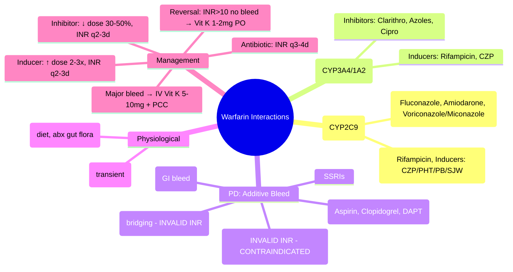

# Warfarin High-Risk Interactions

**Status**: `draft` | **Chapter**: 2 — Clinical Therapeutics and Good Prescribing | **Heading**: Drug Interactions → High-Risk Combinations | **Exam Priority**: ⭐⭐⭐ **HIGHEST** (Daily ward management, VIVA, patient safety)

---

## 🎯 Learning Objectives
- [ ] Categorise warfarin interactions: PK (CYP2C9, 3A4, 1A2, VKORC1), PD (additive anticoagulation, antiplatelet, GI bleed), Physiological (Vit K, protein binding)
- [ ] Apply management algorithm: INR monitoring frequency, dose adjustment, bridging
- [ ] Know absolute contraindications and "red flag" combinations
- [ ] Calculate dose adjustments for common scenarios

---

## ⚔️ Warfarin Interaction Categories

### 1. Pharmacokinetic — Metabolism (S-warfarin = CYP2C9)
| Inhibitor (↑ INR) | Potency | Inducer (↓ INR) |
|-------------------|---------|-----------------|
| **Fluconazole, Voriconazole, Miconazole** | **Strong 2C9** | **Rifampicin** (Strong) |
| **Amiodarone** | Strong 2C9 + 3A4 | **Carbamazepine, Phenytoin** (Strong) |
| **Trimethoprim, Sulfamethoxazole** | Moderate 2C9 | **Phenobarbital, Primidone** (Strong) |
| **Metronidazole** | Moderate 2C9 | **St John's Wort** (Moderate 3A4/2C9) |
| **Fluoxetine, Fluvoxamine** | Weak 2C9 | **Modafinil** (Weak) |
| **Sulfinpyrazone** | Moderate | |

### 2. Pharmacokinetic — Metabolism (R-warfarin = CYP3A4, 1A2, 2C19)
| Inhibitor (↑ INR) | Inducer (↓ INR) |
|-------------------|-----------------|
| Clarithromycin, Erythromycin, Azoles (3A4) | Rifampicin, Carbamazepine, Phenytoin (3A4) |
| Ciprofloxacin (1A2) | St John's Wort (3A4) |
| Omeprazole (2C19) | |

### 3. Pharmacodynamic — Additive Anticoagulant/Antiplatelet
| Drug | Mechanism | INR Effect | Bleed Risk |
|------|-----------|------------|------------|
| **Antiplatelets** (Aspirin, Clopidogrel, Ticagrelor, Prasugrel, Dipyridamole) | Platelet inhibition | None (↑ bleed) | **Synergistic** |
| **DOACs** (Rivaroxaban, Apixaban, Dabigatran, Edoxaban) | Direct anticoagulation | **Invalidates INR** | **Contraindicated** |
| **Heparins** (UFH, LMWH, Fondaparinux) | Antithrombin potentiation | **INV invalidates INR** | Additive (bridging) |
| **Thrombolytics** (Alteplase, Tenecteplase) | Fibrinolysis | N/A | **Contraindicated** |
| **NSAIDs** (Ibuprofen, Diclofenac, Naproxen) | Antiplatelet + Gastric injury | None | **Synergistic GI bleed** |
| **SSRIs/SNRIs** | Platelet serotonin depletion | None | ↑ GI bleed |

### 4. Physiological — Vitamin K & Protein Binding
| Factor | Effect on INR | Examples |
|--------|---------------|----------|
| **↓ Vitamin K intake** | ↑ INR | Malnutrition, NBM, TPN without Vit K, Broad-spectrum abx (gut flora ↓ Vit K synthesis) |
| **↑ Vitamin K intake** | ↓ INR | Leafy greens, Vit K supplements, Menaquinone |
| **Cranberry juice** | ↑ INR (case reports) | Avoid large amounts |
| **Alcohol (acute)** | ↑ INR (↓ metabolism) | Binge drinking |
| **Alcohol (chronic)** | ↓ INR (enzyme induction) | Chronic heavy use |
| **Displacement from albumin** | Transient ↑ free warfarin → ↑ effect | Valproate, Phenytoin, Sulfonamides — usually self-corrects |

---

## 📋 Management Algorithm

```mermaid
flowchart TD
    A[Patient on Warfarin] --> B{New drug / change?}
    B -->|**Strong 2C9 inhibitor**<br/>Fluconazole, Voriconazole, Amiodarone, Miconazole| C[↓ Warfarin 30–50%<br/>INR q2–3d x1wk<br/>Then q1–2wk]
    B -->|**Moderate 2C9 inhibitor**<br/>Metronidazole, TMP-SMX, Metronidazole| D[↓ Warfarin 10–20%<br/>INR q3–4d x1wk]
    B -->|**Strong 3A4 inhibitor**<br/>Clarithro, Azoles, Ritonavir| E[↓ Warfarin 20–30%<br/>INR q2–3d]
    B -->|**Inducer**<br/>Rifampicin, CZP, PHT, PB, SJW| F[↑ Warfarin 2–3x<br/>INR q2–3d<br/>May need 10–15mg/day]
    B -->|**Antiplatelet/NSAID/DOAC**| G[**Assess indication**<br/>If essential: PPI cover, INR q1–2wk, educate on bleed signs]
    B -->|**Antibiotic (non-inhibitor)**| H[INR q3–4d x1wk<br/>(gut flora Vit K)]
    B -->|**Diet change / NBM / TPN**| I[Monitor INR q2–3d<br/>Standardise Vit K intake]
```

---

## 🚨 Red Flag Combinations (Absolute Caution)

| Combination | Risk | Action |
|-------------|------|--------|
| **Warfarin + DOAC** | **Invalid INR, catastrophic bleed** | **NO** — switch one |
| **Warfarin + Thrombolytic** | **Intracranial haemorrhage** | **NO** |
| **Warfarin + Dual Antiplatelet** (Triple therapy) | **Major bleed** (HAS-BLED ↑↑) | Shortest duration; PPI mandatory; INR 2.0–2.5 |
| **Warfarin + High-dose NSAID** | **GI bleed, AKI** | Avoid; use paracetamol/opioid |
| **Warfarin + Fluconazole/Voriconazole** | **INR ↑↑ rapidly** | ↓ Warfarin 50%, INR daily |
| **Warfarin + Amiodarone** | **INR ↑↑ (long t½)** | ↓ Warfarin 30–50%, INR q2–3d x2wk |

---

## 📊 INR Monitoring Frequency by Scenario

| Scenario | Frequency |
|----------|-----------|
| Stable, no changes | Every 4–12 weeks |
| **New interacting drug (inhibitor)** | **q2–3 days × 1 week, then q1–2 weeks** |
| **New interacting drug (inducer)** | **q2–3 days × 1 week, then q1–2 weeks** |
| Antibiotic course (7–14d) | q3–4 days during + 1 week after |
| Post-dose adjustment | q2–3 days until stable ×2 |
| Supratherapeutic INR (4.5–10, no bleed) | q1–2 days until therapeutic |
| **INR >10 / Major bleed** | **Stat INR, Vit K, PCC/FFP per protocol** |

---

## 💊 Vit K Reversal Protocol (UK)

| INR | Bleeding | Vit K Dose | Route |
|-----|----------|------------|-------|
| **>10** | No | **1–2 mg** | **PO** (preferred) / IV |
| **4.5–10** | No | **Omit 1–2 doses** | — |
| **Any** | **Major / Life-threatening** | **5–10 mg** | **IV** + **PCC 25–50 IU/kg** |
| **Any** | **Minor** | **1–2 mg** | PO / IV |

> **PCC (Prothrombin Complex Concentrate)**: Beriplex® / Octaplex® — contains Factors II, VII, IX, X + Protein C/S. **Dose: 25–50 IU/kg** based on INR. **Recheck INR 30 min post-infusion.**

---

## 🎯 FCPS/MRCP High-Yield Scenarios

| Scenario | Interaction | Management |
|----------|-------------|------------|
| Warfarin + Fluconazole (systemic) | Strong 2C9i | ↓ Warfarin 50%, INR daily ×5d |
| Warfarin + Clarithromycin | Strong 3A4i | ↓ Warfarin 30%, INR q2–3d |
| Warfarin + Rifampicin | Strong inducer (2C9, 3A4) | ↑ Warfarin 2–3x, INR q2–3d |
| Warfarin + Amiodarone | Strong 2C9i + 3A4i (long t½) | ↓ Warfarin 30–50%, INR q2–3d ×2wk |
| Warfarin + TMP-SMX | Moderate 2C9i + PD (antiplatelet) | ↓ Warfarin 10–20%, INR q3–4d |
| Warfarin + Aspirin 75mg (secondary prevention) | Additive bleed | PPI cover, INR 2.0–2.5, educate |
| Warfarin + Dabigatran | **Invalid INR** | **Do not combine** |
| Warfarin + Broad-spectrum abx (Co-amoxiclav) | Gut flora ↓ Vit K | INR q3–4d during course |

---

## ❓ Viva Questions (10)

| Q | Answer |
|---|--------|
| 1. Warfarin metabolism — which enantiomer is active? Which CYP? | **S-warfarin (active) = CYP2C9**; R-warfarin = CYP3A4, 1A2, 2C19 |
| 2. Strongest CYP2C9 inhibitors for warfarin? | Fluconazole, Voriconazole, Miconazole, Amiodarone, Sulfaphenazole |
| 3. Warfarin + Rifampicin — direction of INR change? Management? | **INR ↓↓** (induction 2C9/3A4) → **↑ Warfarin dose 2–3x**, INR q2–3d |
| 4. Warfarin + Fluconazole — dose adjustment? Monitoring? | **↓ Warfarin 30–50%**, **INR daily ×5d** (q2–3d ×1wk) |
| 5. Warfarin + Amiodarone — why prolonged interaction? | Amiodarone t½ **~50 days** — inhibition persists weeks after stop |
| 6. Warfarin + Aspirin — INR effect? Bleed risk? | **No INR change**; **Synergistic bleed risk** → PPI, target INR 2.0–2.5 |
| 7. Can you give warfarin and rivaroxaban together? | **NO** — rivaroxaban invalidates INR, catastrophic bleed risk |
| 8. Warfarin + broad-spectrum antibiotic — mechanism? | **Gut flora suppression → ↓ Vit K synthesis → ↑ INR** (delayed 3–5 days) |
| 9. INR 8.5, no bleed — management? | **Omit 1–2 doses**; Vit K 1mg PO if risk factors (elderly, CKD); restart lower dose |
| 10. INR >10, major bleed — reversal? | **IV Vit K 5–10mg + PCC 25–50 IU/kg** (FFP if PCC unavailable); recheck INR 30min |

---

## 🤯 Confusions & Mnemonics

| Confusion | Clarification |
|-----------|---------------|
| **Warfarin + antibiotic — immediate INR rise?** | No — gut flora effect takes **3–5 days** (except metabolic inhibitors like metronidazole which are immediate) |
| **Vit K PO vs IV** | PO: 6–12h onset, sustained; IV: 1–2h onset, anaphylaxis risk (rare); **PO preferred unless major bleed** |
| **INR target with aspirin** | **2.0–2.5** (lower than standard 2.0–3.0) to mitigate bleed risk |
| **Amiodarone washout** | **Months** — do not assume interaction resolved quickly after stopping amiodarone |
| **Cranberry juice** | Case reports of ↑ INR; advise **avoid large regular amounts** |

**Mnemonics:**
- **"S-WARFARIN = CYP2C9"** — **S** for **S**tar (active), **S** for **S**trong inhibition (fluconazole, amiodarone)
- **"F.A.M."** = **F**luconazole, **A**miodarone, **M**iconazole = **Strong 2C9 inhibitors**
- **"R.I.P."** = **R**ifampicin, **I**nducers (**C**arbamazepine, **P**henytoin) → **INR drops**
- **"TRIPLE THERAPY"** = Warfarin + DAPT → **HAS-BLED ↑↑, shortest duration, PPI mandatory**
- **"INVALID INR"** = **DOACs, Heparins, Thrombolytics** — do not use INR to monitor

---

## 🧠 Mind Map (Mermaid)



---

## 📅 Spaced Repetition Tracker

| Review | Date | Score | Next |
|--------|------|-------|------|
| 1 | | | 1d |
| 2 | | | 3d |
| 3 | | | 1w |
| 4 | | | 2w |
| 5 | | | 1m |
| 6 | | | 3m |

---

## 🧪 Self-Test Scorecard

| Section | Max | Score |
|---------|-----|-------|
| PK inhibitors/inducers table | 12 | |
| PD interactions | 8 | |
| Management algorithm | 8 | |
| Red flags | 6 | |
| INR monitoring | 6 | |
| Vit K reversal | 6 | |
| Viva answers | 10 | |
| **Total** | **56** | |

**Target**: ≥45/56 (80%)

---

## 📝 Exam Answer Modes

### Short Question (5 marks): *"Warfarin + fluconazole"*
- Fluconazole = strong CYP2C9 inhibitor
- S-warfarin metabolised by 2C9
- ↑ Warfarin levels → ↑ INR → bleed
- Manage: ↓ Warfarin 30–50%, INR daily ×5d

### Viva (2 min): *"Patient on warfarin (INR 2.5) starts clarithromycin for pneumonia. Day 4: INR 6.8. No bleed. Management?"*
- Clarithromycin = strong CYP3A4 inhibitor → ↑ R-warfarin
- **Omit 1–2 warfarin doses**
- **Vit K 1mg PO** (elderly, INR >6)
- **Restart warfarin at 30% lower dose** when INR therapeutic
- **INR q2–3d** until stable

### Ward Round (30 sec): *"Warfarin patient prescribed co-amoxiclav for chest infection. INR monitoring?"*
- **INR q3–4 days during course and 1 week after** (gut flora Vit K suppression)

### Last-Night Revision (1-liners):
- S-warfarin = CYP2C9; R-warfarin = CYP3A4/1A2/2C19
- F.A.M. = Fluconazole, Amiodarone, Miconazole (strong 2C9i)
- R.I.P. = Rifampicin, Inducers (CZP, PHT) → INR drops
- DOACs + Warfarin = NO (invalid INR)
- Clarithro = 3A4i → ↓ warfarin 30%
- Amiodarone t½ 50d → interaction persists months
- INR >10 no bleed = Vit K 1–2mg PO
- Major bleed = IV Vit K 5–10mg + PCC 25–50 IU/kg
- Aspirin + Warfarin = PPI, INR 2.0–2.5

---

## 📚 Summary Card

> **WARFARIN INTERACTION TRIAD:**
> 1. **PK (CYP2C9/3A4)** — F.A.M. inhibit; R.I.P. induce
> 2. **PD (Bleed)** — Antiplatelets, NSAIDs, SSRIs, DOACs (NO)
> 3. **Vit K** — Diet, Antibiotics (gut flora)
>
> **MONITOR**: Inhibitor/Inducer → INR q2–3d; Abx → q3–4d
> **REVERSE**: >10 no bleed → Vit K 1–2mg PO; Major bleed → IV Vit K + PCC

---

## ❓ MCQs (12)

1. **Active enantiomer of warfarin and its metabolising enzyme:**
   A. R-warfarin, CYP3A4
   B. **S-warfarin, CYP2C9** ✓
   C. R-warfarin, CYP2C9
   D. S-warfarin, CYP1A2
   E. Both enantiomers, CYP2C9

2. **Strongest CYP2C9 inhibitors (FAM):**
   A. Fluoxetine, Amiodarone, Metronidazole
   B. **Fluconazole, Amiodarone, Miconazole/Voriconazole** ✓
   C. Fluvastatin, Atorvastatin, Miconazole
   D. Fenofibrate, Amiodarone, Metronidazole
   E. Furosemide, Amiodarone, Metronidazole

3. **Rifampicin effect on warfarin INR:**
   A. Increases INR
   B. **Decreases INR** ✓
   C. No effect
   D. Unpredictable
   E. Increases then decreases

4. **Warfarin + systemic fluconazole — dose adjustment:**
   A. Increase warfarin 20%
   B. No change
   C. **Decrease warfarin 30–50%** ✓
   D. Decrease warfarin 10%
   E. Stop warfarin

5. **Warfarin + clarithromycin — mechanism:**
   A. CYP2C9 inhibition
   B. **CYP3A4 inhibition (R-warfarin)** ✓
   C. Protein binding displacement
   D. Vitamin K antagonism
   E. Gut flora suppression

6. **Warfarin + dabigatran — correct statement:**
   A. Safe combination, monitor INR
   B. **Contraindicated — dabigatran invalidates INR** ✓
   C. Reduce warfarin dose by 50%
   D. Use INR to monitor dabigatran
   E. Bridging indication only

7. **Amiodarone interaction persists after stopping because:**
   A. Active metabolite
   B. **Long half-life (~50 days)** ✓
   C. Irreversible enzyme inhibition
   D. Protein binding displacement
   E. Induces its own metabolism

8. **Warfarin + aspirin 75mg — INR target:**
   A. 2.5–3.5
   B. **2.0–2.5** ✓
   C. 3.0–4.0
   D. No change (2.0–3.0)
   E. 1.5–2.0

9. **INR 8.5, no bleeding, elderly — management:**
   A. Continue same dose
   B. **Omit 1–2 doses + Vit K 1mg PO** ✓
   C. Vit K 5mg IV
   D. PCC 25 IU/kg
   E. FFP 15mL/kg

10. **Major bleed on warfarin, INR >5 — reversal:**
    A. Vit K 1mg PO only
    B. **IV Vit K 5–10mg + PCC 25–50 IU/kg** ✓
    C. FFP only
    D. IV Vit K 1mg only
    E. Hold warfarin only

11. **Broad-spectrum antibiotic + warfarin — INR rise mechanism:**
    A. CYP2C9 inhibition
    B. **Gut flora suppression → ↓ Vit K synthesis** ✓
    C. Protein binding displacement
    D. Reduced warfarin clearance
    E. Increased warfarin absorption

12. **Vitamin K route for non-bleeding supratherapeutic INR:**
    A. IV only
    B. **PO preferred** ✓
    C. IM
    D. SC
    E. IN

---

## 🃏 Flashcards (Anki-ready)

| Front | Back |
|-------|------|
| Warfarin active enantiomer | S-warfarin |
| S-warfarin metabolism | CYP2C9 |
| R-warfarin metabolism | CYP3A4, 1A2, 2C19 |
| FAM inhibitors | Fluconazole, Amiodarone, Miconazole/Voriconazole (strong 2C9) |
| RIP inducers | Rifampicin, Inducers (Carbamazepine, Phenytoin, Phenobarbital, St John's Wort) |
| Clarithromycin warfarin | 3A4 inhibitor → ↓ warfarin 30%, INR q2–3d |
| Amiodarone warfarin | Strong 2C9+3A4 inhibitor, t½ 50d → ↓ warfarin 30–50%, INR q2–3d ×2wk |
| Fluconazole warfarin | Strong 2C9i → ↓ warfarin 50%, INR daily ×5d |
| Rifampicin warfarin | Strong inducer → ↑ warfarin 2–3x, INR q2–3d |
| DOAC + Warfarin | CONTRAINDICATED — invalidates INR |
| Antiplatelet + Warfarin | Additive bleed → PPI, INR 2.0–2.5 |
| NSAID + Warfarin | Synergistic GI bleed → avoid |
| Abx + Warfarin | Gut flora ↓ Vit K → INR q3–4d during +1wk after |
| INR >10 no bleed | Omit 1–2 doses, Vit K 1–2mg PO |
| Major bleed + INR>5 | IV Vit K 5–10mg + PCC 25–50 IU/kg |
| Vit K route (non-bleed) | PO preferred (6–12h onset, sustained) |

---

## ✅ Answer Keys

### MCQs
1. **B** — S-warfarin active, CYP2C9
2. **B** — Fluconazole, Amiodarone, Miconazole/Voriconazole
3. **B** — Rifampicin induces → INR decreases
4. **C** — ↓ Warfarin 30–50%
5. **B** — Clarithromycin = 3A4 inhibitor (R-warfarin)
6. **B** — DOACs invalidate INR, contraindicated
7. **B** — Amiodarone t½ ~50 days
8. **B** — INR 2.0–2.5 with aspirin
9. **B** — Omit doses + Vit K 1mg PO (elderly)
10. **B** — IV Vit K 5–10mg + PCC
11. **B** — Gut flora suppression → ↓ Vit K
12. **B** — PO preferred

---

*File: `/mnt/tb/Medicine/Clinical Therapeutics and Good Prescribing/Drug Interactions/High-risk drug combinations/Warfarin interactions.md` | Status: `draft` → upgrade after review*