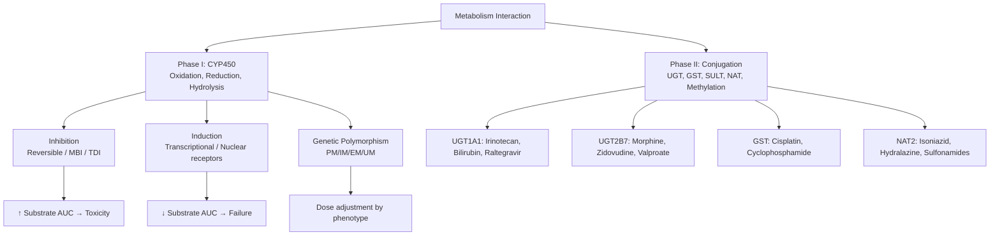
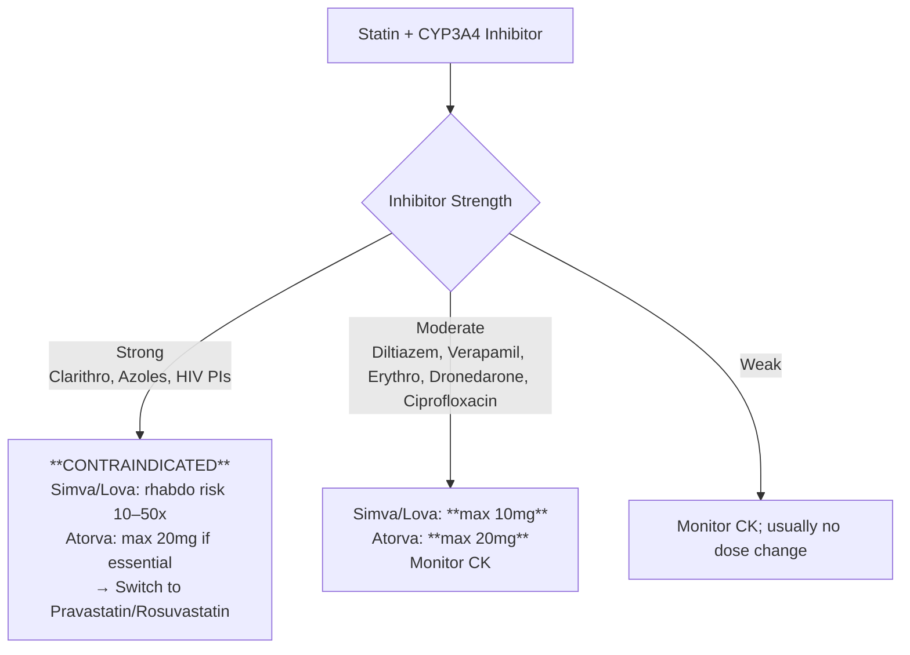

# Metabolism Interactions (CYP450 & Phase II)

**Parent Topic:** [Pharmacokinetic Interactions](../Pharmacodynamic%20interactions.md) → [Drug Interactions Overview](../../Clinical%20Therapeutics%20and%20Good%20Prescribing%20MOC.md)
**Status:** `full-fcps-mrcp-note`
**Priority:** ⭐⭐⭐ HIGHEST (FCPS/MRCP — #1 interaction topic; viva, MCQ, prescribing decisions)
**Source:** Davidson 24th Ed Ch 2; FDA Drug Interaction Guidance; Flockhart Table; Stockley's

---

## 🎯 Learning Objectives
- [ ] Master CYP450 isoforms: substrates, inhibitors, inducers (exam-ready table)
- [ ] Classify inhibition: reversible (competitive), mechanism-based (MBI), time-dependent
- [ ] Apply clinical magnitude: strong/moderate/weak (AUC fold-change)
- [ ] Predict interaction outcomes: dose adjustment, avoidance, monitoring
- [ ] Know Phase II interactions (UGT, GST, SULT, NAT)
- [ ] Answer viva on specific high-yield pairs (warfarin, statins, CNIs, DOACs, OCPs, ARVs)

---

## 🧠 Core Concept: CYP450 Interaction Framework



---

## 1️⃣ CYP450 Isoforms: The "Big 6" for Drug Interactions

### Complete Exam-Ready CYP Table

| CYP Isoform | % Liver CYP | Key Endogenous Substrates | Key Drug Substrates (Memorise These) | Strong Inhibitors (≥5x AUC) | Moderate Inhibitors (2–5x) | Strong Inducers (≥80% ↓ AUC) |
|-------------|-------------|---------------------------|--------------------------------------|----------------------------|---------------------------|------------------------------|
| **CYP3A4/5** | 30–40% | Cortisol, Testosterone, Bile acids | **Midazolam, Triazolam, Simvastatin, Lovastatin, Atorvastatin, Ciclosporin, Tacrolimus, Sirolimus, Everolimus, Rivaroxaban, Apixaban, Dabigatran (minor), CCBs (felodipine, nifedipine, amlodipine), ALK/EGFR TKIs, Opioids (fentanyl, oxycodone), PPIs (omeprazole, lansoprazole), ARVs (PIs, NNRTIs, INSTIs), Quetiapine, Aripiprazole, Colchicine, Ivabradine, Lurasidone** | **Clarithromycin, Itraconazole, Ketoconazole, Posaconazole, Voriconazole, Ritonavir, Cobicistat, Nelfinavir, Saquinavir, Indinavir, Boceprevir, Telaprevir, Nefazodone** | **Erythromycin, Fluconazole, Verapamil, Diltiazem, Ciprofloxacin, Dronedarone, Aprepitant, Grapefruit juice (intestinal), Amiodarone** | **Rifampicin, Carbamazepine, Phenytoin, Phenobarbital, Primidone, St John's Wort, Modafinil, Bosentan, Nafcillin, Efavirenz, Etravirine, Nevirapine, Enzalutamide, Apalutamide** |
| **CYP2C9** | 15–20% | Arachidonic acid | **Warfarin (S-warfarin), Phenytoin, Losartan, Irbesartan, Glipizide, Glimepiride, Tolbutamide, Celecoxib, Ibuprofen, Diclofenac, Fluvastatin, Rosuvastatin (minor), Sulfamethoxazole, Torasemide** | **Fluconazole, Voriconazole, Miconazole, Metronidazole, Amiodarone, Sulfapyrazone, TMP-SMX, Fluvastatin** | **Amiodarone, Atorvastatin, Fluoxetine, Sertraline, Paroxetine, Lovastatin, Simvastatin** | **Rifampicin, Carbamazepine, Phenytoin, Phenobarbital, St John's Wort, Secobarbital, Nafcillin, Bosentan** |
| **CYP2C19** | 5–10% | Progesterone | **Omeprazole, Esomeprazole, Lansoprazole, Pantoprazole (minor), Rabeprazole, Clopidogrel (activation), Citalopram, Escitalopram, Sertraline, Voriconazole, Diazepam, Proguanil, Cilostazol, Hexobarbital** | **Omeprazole, Esomeprazole, Fluconazole, Voriconazole, Fluvoxamine, Ticlopidine, Chloramphenicol, Felbamate, Isavuconazole** | **Fluoxetine, Sertraline, Paroxetine, Citalopram, Lansoprazole, Pantoprazole, Voriconazole** | **Rifampicin, Carbamazepine, Phenytoin, Phenobarbital, St John's Wort, artemisinin, Modafanil, Efavirenz** |
| **CYP2D6** | 2–5% | None major | **Codeine, Tramadol, Oxycodone (minor), Hydrocodone, Metoprolol, Propranolol, Carvedilol, Timolol, Flecainide, Propafenone, Thioridazine, Haloperidol, Risperidone, Aripiprazole, Paroxetine, Fluoxetine, Venlafaxine, Duloxetine, Atomoxetine, Tamoxifen, Perphenazine, Nortriptyline, Amitriptyline, Desipramine, Imipramine** | **Paroxetine, Fluoxetine, Bupropion, Quinidine, Cinacalcet, Cinacalcet, Ritonavir, Dabigatran? (no), Thioridazine, Haloperidol** | **Duloxetine, Sertraline, Citalopram, Escitalopram, Ritonavir, Diphenhydramine, Methadone, Mirabegron, Propafenone, Terbinafine** | **Rifampicin (weak), Dexamethasone, Carbamazepine (weak), Phenytoin (weak)** — *CYP2D6 NOT significantly inducible* |
| **CYP1A2** | 10–15% | Melatonin, Estradiol | **Theophylline, Caffeine, Tacrine, Clozapine, Olanzapine, Duloxetine, Riluzole, Mexiletine, Ziprasidone, Naproxen, Acetaminophen (minor), Ondansetron, Tizanidine, Agomelatine, Benzodiazepines (alprazolam minor)** | **Fluvoxamine, Ciprofloxacin, Enoxacin, Mexiletine, Furafylline, Acyclovir? (no), Interferon-α, Oral contraceptives (ethinyl estradiol)** | **Fluvoxamine, Ciprofloxacin, Enoxacin, Cimetidine, Oral contraceptives, Mexiletine, Interferon-α, Zafirlukast** | **Tobacco smoke (PAHs), Omeprazole (weak), Insulin, Modafinil, Nafcillin, Charcoal-broiled meat, Cruciferous vegetables** |
| **CYP2B6** | 2–5% | None | **Efavirenz, Nevirapine, Bupropion, Cyclophosphamide, Ifosfamide, Ketamine, Methadone, Phencyclidine, Propofol, Selegiline, Ticlopidine, Valproate, Artemisinin** | **Clopidogrel, Ticlopidine, Ritonavir, Efavirenz (auto-inhibition), Orphenadrine, Thiotepa** | **Efavirenz, Ritonavir, Clopidogrel, Sertraline, Voriconazole** | **Rifampicin, Carbamazepine, Phenytoin, Phenobarbital, St John's Wort, Artemisinin, Efavirenz (auto-induction), Nevirapine** |
| **CYP2E1** | 5–10% | Acetone, Ethanol | **Ethanol, Acetaminophen (toxic pathway), Halothane, Enflurane, Isoflurane, Sevoflurane, Chlorzoxazone, Disulfiram, Benzene, N-nitrosamines** | **Disulfiram (MBI), Diallyl sulfide, Indole-3-carbinol** | **Isoniazid, Diallyl sulfide** | **Ethanol (chronic), Isoniazid, Acetone, Diabetes, Starvation, Obesity** |

> **FCPS/MRCP Priority:** **CYP3A4 > CYP2C9 > CYP2C19 > CYP2D6 > CYP1A2 > CYP2B6** — know these in order.

---

## 2️⃣ Inhibition Classification & Clinical Magnitude

### FDA/EMA Classification (AUC Fold-Change)

| Category | AUC Ratio (with/without inhibitor) | Clinical Action |
|----------|-------------------------------------|-----------------|
| **Strong Inhibitor** | **≥5-fold** | **Avoid combination** OR reduce substrate dose ≥75% + TDM |
| **Moderate Inhibitor** | **2–5-fold** | **Reduce substrate dose 50–75%** + monitor/TDM |
| **Weak Inhibitor** | **1.25–2-fold** | **Monitor**; may need dose reduction for NTI drugs |

### Inhibition Mechanisms

```mermaid
flowchart LR
    A[CYP Inhibition] --> B[Reversible / Competitive]
    A --> C[Mechanism-Based / Irreversible / TDBI]
    A --> D[Time-Dependent]
    
    B --> B1[Inhibitor competes for active site]
    B --> B2[Immediate onset/offset]
    B --> B3[Ki = affinity constant]
    B --> B4[Examples: Fluconazole (2C9), Ketoconazole (3A4)]
    
    C --> C1[Inhibitor metabolised to reactive intermediate]
    C --> C2[Covalent binding to heme/apoprotein]
    C --> C3[Requires NEW enzyme synthesis for recovery]
    C --> C4[Examples: Erythromycin (3A4), Fluvoxamine (1A2), Paroxetine (2D6), TMP (2C9)]
    
    D --> D1[Onset: hours–days (enzyme degradation)]
    D --> D2[Offset: days–weeks (enzyme resynthesis)]
    D --> D3[Clinical: effect persists after inhibitor stopped]
```

---

## 3️⃣ Induction: Nuclear Receptor Mediated

### Inducers & Receptors

| Inducer | Primary Receptor | CYPs Induced | Onset | Offset (washout) |
|---------|------------------|--------------|-------|------------------|
| **Rifampicin** | **PXR (NR1I2)** | **3A4, 2C9, 2C19, 2B6, 2C8, UGTs, P-gp, OATP** | 3–7 days | 2–4 weeks |
| **Carbamazepine** | PXR, CAR | **3A4, 2C9, 2C19, 2B6, 1A2?, UGTs, P-gp** | 1–3 weeks | 2–4 weeks |
| **Phenytoin** | PXR, CAR | **3A4, 2C9, 2C19, 2B6, 2C8, UGTs, P-gp** | 1–3 weeks | 2–4 weeks |
| **Phenobarbital** | CAR (NR1I3) | **3A4, 2C9, 2C19, 2B6, 2C8, UGTs, P-gp** | 1–3 weeks | 2–4 weeks |
| **St John's Wort** | PXR | **3A4, 2C9, 2C19, P-gp** | 1–2 weeks | 1–2 weeks |
| **Efavirenz** | PXR | **3A4, 2B6 (auto), 2C9, 2C19** | 1–2 weeks | 1–2 weeks |
| **Nevirapine** | PXR | **3A4, 2B6** | 1–2 weeks | 1–2 weeks |
| **Enzalutamide / Apalutamide** | PXR | **3A4, 2C9, 2C19, P-gp** | 1–2 weeks | 2–4 weeks |
| **Tobacco smoke** | AhR | **1A2, 2E1** | Days | 1–2 weeks |

> **Key:** Induction = ↑ enzyme synthesis → **delayed onset (days–weeks), prolonged offset (weeks)** after stopping.

---

## 4️⃣ High-Yield Clinical Interaction Algorithms

### Warfarin (S-warfarin = CYP2C9; R-warfarin = CYP3A4/1A2)

```mermaid
flowchart TD
    A[Warfarin Interaction] --> B{Perpetrator}
    B -->|Strong 2C9 Inhibitor| C[Fluconazole, Voriconazole, Miconazole, Metronidazole, Amiodarone, TMP-SMX]
    C --> D[↑ INR 2–5x<br>↓ Warfarin dose 30–50%<br>Monitor INR daily]
    B -->|Moderate 2C9 Inhibitor| E[Amiodarone, Atorvastatin, Fluoxetine, Sertraline]
    E --> F[↑ INR 1.5–2x<br>↓ dose 20–30%<br>Monitor INR 2–3x/week]
    B -->|Inducer (3A4/2C9)| G[Rifampicin, Carbamazepine, Phenytoin, Phenobarbital, St John's Wort]
    G --> H[↓ INR → thrombosis risk<br>↑ Warfarin dose 2–3x<br>Consider switching to DOAC/LMWH]
    B -->|Displacer| I[Sulfonamides, Valproate, Fenofibrate]
    I --> J[Transient ↑ INR<br>Monitor]
```

### Statins (Simvastatin/Lovastatin/Atorvastatin = CYP3A4; Pravastatin/Rosuvastatin = non-CYP)



### Calcineurin Inhibitors (Tacrolimus/Ciclosporin/Sirolimus = CYP3A4 + P-gp)

```mermaid
flowchart TD
    A[CNI + Strong 3A4 Inhibitor] --> B[Clarithro, Azoles (except fluconazole), HIV PIs, Nefazodone]
    B --> C[↑ CNI 3–10x → **NEPHROTOXICITY**<br>↓ Tacro dose **80–90%** (e.g., 5mg → 0.5mg)<br>↓ Ciclosporin **50–75%**<br>Monitor level DAILY]
    A --> D[Moderate: Diltiazem, Verapamil, Erythro, Fluconazole]
    D --> E[↓ Tacro **50%**, Ciclosporin **25–50%**<br>Monitor level 2–3x/week]
    A --> F[Inducers: Rifampicin, Carbamazepine, Phenytoin, SJW]
    F --> G[**AVOID** — levels drop 70–90%<br>Rejection risk<br>If essential: ↑ dose 3–5x + intensive TDM]
```

### DOACs (Rivaroxaban/Apixaban = CYP3A4 + P-gp; Dabigatran = P-gp only)

| Perpetrator | Rivaroxaban/Apixaban | Dabigatran | Action |
|-------------|---------------------|------------|--------|
| **Strong dual 3A4+P-gp inhibitor** (Azoles, HIV PIs, Clarithro) | ↑ AUC 2–4x | ↑ AUC 2–3x (P-gp) | **Avoid** (CrCl <30) / **Reduce dose** (Riva 15mg, Api 2.5mg) |
| **P-gp only inhibitor** (Verapamil, Amiodarone, Quinidine, Dronedarone) | ↑ AUC 1.5–2x | ↑ AUC 1.5–2x | **Rivaroxaban: avoid if CrCl 15–30** / Apixaban: standard dose usually OK / **Dabigatran: 75mg if CrCl 15–30** |
| **Inducers** (Rifampicin, Carbamazepine, Phenytoin, SJW) | ↓ AUC 50–70% | ↓ AUC 50–70% | **AVOID** — therapeutic failure |

### Oral Contraceptives (Ethinyl estradiol = CYP3A4; Progestins = CYP3A4)

| Perpetrator | Effect | Management |
|-------------|--------|------------|
| **Rifampicin** | ↓ EE 40–60%, ↓ progestin 50–80% | **Contraindicated** — use non-hormonal / IUD / implant / DMPA |
| **Carbamazepine, Phenytoin, Phenobarbital, Topiramate >200mg, St John's Wort, Modafinil, Bosentan, Enzalutamide** | ↓ EE/progestin | **Add backup barrier method** OR switch to non-enzyme-inducing contraception |
| **Antibiotics (except rifampicin)** | Theoretical ↓ enterohepatic recirculation | **No routine backup needed** (evidence doesn't support) |

---

## 5️⃣ Phase II Interactions (Conjugation)

### UGT (UDP-Glucuronosyltransferase)

| Isoform | Key Substrates | Inhibitors | Inducers | Clinical |
|---------|----------------|------------|----------|----------|
| **UGT1A1** | Irinotecan (SN-38), **Bilirubin**, Raltegravir, Dolutegravir, Bilirubin, Atazanavir | Atazanavir, Indinavir, Valproate, Ketoconazole, Nilotinib | Rifampicin, Carbamazepine, Phenytoin, Phenobarbital | **Gilbert's syndrome** = UGT1A1*28 → irinotecan toxicity; Atazanavir → hyperbilirubinaemia |
| **UGT2B7** | Morphine, Codeine, Zidovudine, **Valproate**, Lamotrigine, Mycophenolate, NSAIDs | Valproate (competes), Probenecid, Fluconazole | Rifampicin, Carbamazepine | Valproate ↑ lamotrigine (inhibits UGT) → ↑ lamotrigine 2x |
| **UGT1A6/1A9** | Mycophenolate (MPA), Paracetamol | Ciclosporin (inhibits UGT1A9), Tacrolimus | Rifampicin | Ciclosporin ↑ MPA AUC 2–3x |

### Other Phase II

| Enzyme | Substrates | Inhibitors | Inducers | Clinical |
|--------|------------|------------|----------|----------|
| **SULT** (Sulfotransferase) | Paracetamol, Minoxidil, Adrenaline, Dopamine, Thyroid hormones | Flavonoids, Pentachlorophenol | — | — |
| **GST** (Glutathione-S-transferase) | Cisplatin, Cyclophosphamide, Doxorubicin, Paracetamol (toxic metabolite) | Ethacrynic acid | — | Chemoprotection |
| **NAT2** (N-acetyltransferase) | **Isoniazid**, Hydralazine, Sulfonamides, Dapsone, Procainamide | — | — | **Slow acetylator** → isoniazid neuropathy, sulfonamide hypersensitivity |
| **TPMT** (Thiopurine methyltransferase) | Azathioprine, 6-MP, 6-TG | — | — | **TPMT deficiency** → myelosuppression (test before starting) |
| **DPYD** (Dihydropyrimidine dehydrogenase) | 5-FU, Capecitabine | — | — | **DPYD deficiency** → severe 5-FU toxicity (test before starting) |

---

## 6️⃣ Genetic Polymorphisms (Pharmacogenomics)

| Gene | Phenotypes | Key Drugs | Clinical Action |
|------|------------|-----------|-----------------|
| **CYP2C9** | *1/*1 (EM), *1/*2/*3 (IM), *2/*2, *3/*3 (PM) | Warfarin, Phenytoin, Sulfonylureas | PM: ↓ dose 30–50% (warfarin), avoid phenytoin |
| **CYP2C19** | *1/*1 (EM), *1/*2 (IM), *2/*2 (PM), *1/*17 (UM) | Clopidogrel, PPIs, Voriconazole, Citalopram | PM: **clopidogrel resistance** → use prasugrel/ticagrelor; ↑ PPI/voriconazole levels |
| **CYP2D6** | *1/*1 (EM), *10/*10 (IM), *4/*4 (PM), *1/*×N (UM) | Codeine, Tramadol, Tamoxifen, Antidepressants, Antipsychotics, Beta-blockers, Flecainide | PM: **no codeine→morphine** (no analgesia), ↑ nortriptyline; UM: **codeine→morphine toxic**, ↓ tamoxifen efficacy |
| **CYP3A5** | *1/*1 (expressor), *3/*3 (non-expressor) | Tacrolimus, Ciclosporin | Expressor: ↑ tacro clearance → higher dose needed |
| **UGT1A1** | *1/*1, *28/*28 (Gilbert's) | Irinotecan, Atazanavir, Raltegravir | *28/*28: ↓ irinotecan dose; atazanavir hyperbilirubinaemia |
| **TPMT** | Normal, Heterozygous, Deficient | Azathioprine, 6-MP | Deficient: **avoid** or 10% dose; Het: 50% dose |
| **DPYD** | Normal, Variant | 5-FU, Capecitabine | Variant: avoid or ↓ dose 50% |
| **HLA-B*15:02** | Positive | Carbamazepine, Phenytoin, Lamotrigine | **Avoid** — SJS/TEN risk |
| **HLA-B*58:01** | Positive | Allopurinol | **Avoid** — SJS/TEN/DRESS risk |
| **HLA-B*57:01** | Positive | Abacavir | **Avoid** — hypersensitivity |
| **HLA-A*31:01** | Positive | Carbamazepine | Caution — DRESS/SJS risk |

---

## ⚡ FCPS/MRCP High-Yield Summary Tables

### Top 20 Drug Pairs You MUST Know

| # | Perpetrator | Victim | CYP/Mechanism | Magnitude | Clinical Action |
|---|-------------|--------|---------------|-----------|-----------------|
| 1 | **Clarithromycin** | **Simvastatin/Lovastatin** | CYP3A4 strong inh | ↑ 10–50x | **CONTRAINDICATED** |
| 2 | **Rifampicin** | **Oral Contraceptive** | CYP3A4 strong ind | ↓ 50–80% | **Contraindicated** |
| 3 | **Fluconazole** | **Warfarin** | CYP2C9 strong inh | ↑ INR 2–5x | ↓ Warfarin 30–50%, daily INR |
| 4 | **Carbamazepine** | **Tacrolimus/Ciclosporin** | CYP3A4 strong ind | ↓ 70–90% | **Avoid** / ↑ dose 3–5x + TDM |
| 5 | **Amiodarone** | **Digoxin / Warfarin / Simvastatin** | P-gp + CYP3A4/2C9 | ↑ 2–3x | Halve digoxin; ↓ warfarin; avoid simva |
| 6 | **Valproate** | **Lamotrigine / Phenobarbital / Warfarin** | UGT inh + displac | ↑ Lamotrigine 2x | ↓ Lamotrigine 50% |
| 7 | **Ritonavir/Cobicistat** | **All CYP3A4 substrates** | CYP3A4 strong inh + P-gp | ↑ 3–10x | **Boosting**; adjust all co-meds |
| 8 | **Grapefruit juice** | **Felodipine/Simvastatin/Ciclosporin** | Gut CYP3A4 inh | ↑ 2–5x | **Avoid** |
| 9 | **St John's Wort** | **Ciclosporin/Tacrolimus/DOACs/OCP** | CYP3A4/P-gp ind | ↓ 50–70% | **Avoid** |
| 10 | **Erythromycin** | **Simvastatin/Digoxin/Warfarin** | CYP3A4 MBI + P-gp | ↑ 3–5x | Avoid simva; monitor digoxin/INR |
| 11 | **Diltiazem/Verapamil** | **Simvastatin/Atorvastatin/Tacrolimus** | CYP3A4 mod inh + P-gp | ↑ 2–4x | Simva max 10mg; tacro ↓ 50% |
| 12 | **Phenytoin** | **Valproate / Warfarin / OCP / DOACs** | CYP2C9/19 ind + displac | Complex | Monitor free valproate/INR; avoid OCP |
| 13 | **Paroxetine/Fluoxetine/Bupropion** | **Tamoxifen / Codeine / Flecainide** | CYP2D6 strong inh | ↓ active metabolites | Avoid with tamoxifen; codeine ineffective |
| 14 | **TMP-SMX** | **Warfarin / Phenytoin / Methotrexate / Digoxin** | CYP2C9 inh + displac + renal | ↑ Warfarin/phenytoin | Monitor INR/levels; avoid with MTX |
| 15 | **Voriconazole** | **Tacrolimus / Sirolimus / Warfarin / Phenytoin** | CYP3A4/2C9/2C19 strong | ↑ 3–5x | Tacro ↓ 90% (0.5mg); monitor daily |
| 16 | **Cimetidine** | **Theophylline / Warfarin / Phenytoin / Metoprolol** | CYP1A2/2C9/2D6/3A4 weak | ↑ 1.5–2x | Monitor; usually weak |
| 17 | **Omeprazole** | **Clopidogrel / Diazepam / Phenytoin / Citalopram** | CYP2C19 inh | ↓ Clopidogrel activation | Avoid omeprazole with clopidogrel |
| 18 | **Fluvoxamine** | **Theophylline / Clozapine / Olanzapine / Tizanidine** | CYP1A2 strong inh | ↑ Theophylline 3–5x | ↓ Theophylline dose; monitor |
| 19 | **Rifampicin** | **Methadone / Buprenorphine** | CYP3A4/2B6 ind | ↓ Levels 50% | ↑ Methadone dose; monitor withdrawal |
| 20 | **Meropenem** | **Valproate** | Unknown (↓ levels 50–70%) | Breakthrough seizures | **Avoid** meropenem if possible |

---

## 🎤 Viva Questions (Expected Answers)

| # | Question | Expected Answer |
|---|----------|-----------------|
| 1 | Classify CYP inhibitors by strength with examples. | Strong ≥5x (clarithro, azoles, HIV PIs); Moderate 2–5x (diltiazem, verapamil, erythro, fluconazole); Weak 1.25–2x (cimetidine, grapefruit juice intestinal). |
| 2 | Why does rifampicin cause contraceptive failure? | Potent PXR agonist → induces CYP3A4 + P-gp → ↑ ethinyl estradiol/progestin clearance 50–80% → loss of contraceptive effect. |
| 3 | What is mechanism-based inhibition? Give 3 examples. | Irreversible: inhibitor metabolised to reactive intermediate → covalent binding to CYP heme/apoprotein. Recovery requires new enzyme synthesis (days–weeks). Examples: Erythromycin (3A4), Fluvoxamine (1A2), Paroxetine (2D6), TMP (2C9). |
| 4 | Patient on tacrolimus 5mg BD started on voriconazole. Dose adjustment? | Voriconazole = strong CYP3A4 inhibitor. **Reduce tacrolimus to ~0.5mg BD (90% reduction)**. Monitor trough levels DAILY. |
| 5 | Why is simvastatin contraindicated with clarithromycin but atorvastatin can be used at reduced dose? | Simvastatin/lovastatin are **lactone prodrugs** requiring CYP3A4 hydrolysis → higher bioavailability increase (10–50x). Atorvastatin is active acid form → lower increase (3–5x). Max atorva 20mg with strong inhibitors. |
| 6 | Phenytoin + valproate interaction — two mechanisms? | 1. **Valproate displaces phenytoin from albumin** → ↑ free phenytoin. 2. **Valproate inhibits phenytoin metabolism (CYP2C9/2C19)**. Net: ↑ free phenytoin disproportionately. **Monitor FREE phenytoin level**. |
| 7 | Clopidogrel + omeprazole — mechanism and alternative? | Omeprazole inhibits CYP2C19 → ↓ clopidogrel active metabolite → ↓ antiplatelet effect. **Use pantoprazole/rabeprazole (minimal 2C19 inhibition)** or H₂RA. |
| 8 | What CYP isoforms are inducible vs not inducible? | **Inducible:** 3A4, 2C9, 2C19, 2B6, 1A2, 2E1. **NOT significantly inducible:** CYP2D6 (genetic polymorphism only). |
| 9 | Gilbert's syndrome patient needs irinotecan. Risk & management? | UGT1A1*28 polymorphism → ↓ SN-38 glucuronidation → **severe neutropenia/diarrhoea**. Reduce irinotecan starting dose by 1–2 levels. |
| 10 | Codeine in CYP2D6 poor metaboliser — clinical effect? | **No conversion to morphine** → **no analgesia**. Use alternative (morphine, oxycodone, tramadol — also 2D6 but less dependent). |
| 11 | How long after stopping rifampicin does enzyme activity return to baseline? | **2–4 weeks** (enzyme degradation half-life ~70h; multiple half-lives needed). |
| 12 | Meropenem + valproate — what happens? | Valproate levels **drop 50–70%** within days → breakthrough seizures. **Avoid meropenem** if possible; if essential, monitor valproate levels daily and supplement. |

---

## 🧩 Confusions & Mnemonics

| Confusion | Clarification |
|-----------|---------------|
| **"All antibiotics reduce OCP efficacy"** | **Only rifampicin/rifabutin** (enzyme induction). Other antibiotics: no evidence for routine backup. |
| **"Fluconazole is weak inhibitor"** | Fluconazole = **strong CYP2C9 inhibitor**, moderate CYP3A4/2C19 inhibitor. Dose-dependent. |
| **"CYP2D6 inducible by rifampicin"** | **CYP2D6 NOT significantly inducible** — genetic only. |
| **"Grapefruit inhibits hepatic CYP3A4"** | **Only intestinal CYP3A4** (furanocoumarins don't reach liver in active form). |
| **"Phenytoin induces its own metabolism"** | Phenytoin = **auto-inducer** (saturable kinetics + induction) — complex non-linear PK. |
| **"Valproate inhibits lamotrigine metabolism via CYP"** | Valproate inhibits **UGT1A4** (glucuronidation), NOT CYP. |
| **"All azoles same inhibition profile"** | **Ketoconazole/Itraconazole/Posaconazole/Voriconazole/Isavuconazole** = strong 3A4. **Fluconazole** = strong 2C9, mod 3A4/2C19. **Miconazole** (topical) = strong 2C9 (systemic absorption). |

> **Mnemonic: CYP STRONG**  
> **S**trong 3A4: **Clarithro, Azoles (keto, itra, posa, vor), HIV PIs, Nefazodone**  
> **T**RONG 2C9: **Fluconazole, Voriconazole, Miconazole, Metronidazole, Amiodarone, TMP-SMX**  
> **R**IFampicin induces: **3A4, 2C9, 2C19, 2B6, P-gp, UGT** (CAR/PXR)  
> **O**MEprazole inhibits: **2C19** (↓ clopidogrel activation)  
> **N**ON-inducible: **CYP2D6** (genetic only)  
> **G**rapefruit: **intestinal 3A4 only** (not hepatic)  
> **PAROXETINE/FLUOXETINE/BUPROPION/QUINIDINE** = **strong 2D6 inhibitors**  
> **VALPROATE** = **UGT inhibitor** (↑ lamotrigine, ↑ MPA, ↓ carnitine)

---

## 🗺️ Mind Map

```mermaid
mindmap
  root((Metabolism<br>Interactions))
    Phase I: CYP450
      Big 6 Isoforms
        CYP3A4: 30-40% — Midaz, Statins, CNIs, DOACs, TKIs, ARVs
        CYP2C9: 15-20% — Warfarin, Phenytoin, Losartan, Sulfonylureas
        CYP2C19: 5-10% — Clopidogrel, PPIs, Citalopram, Voriconazole
        CYP2D6: 2-5% — Codeine, Tramadol, Beta-blockers, TCAs, Tamoxifen
        CYP1A2: 10-15% — Theophylline, Clozapine, Caffeine, Tizanidine
        CYP2B6: 2-5% — Efavirenz, Bupropion, Cyclophosphamide, Methadone
      Inhibition
        Reversible: Compet, Ki
        MBI/TDBI: Erythro, Fluvox, Paroxetine, TMP
        Magnitude: Strong ≥5x, Mod 2-5x, Weak 1.25-2x
      Induction
        PXR/CAR: Rifampicin, Carbamazepine, Phenytoin, Phenobarbital, SJW
        AhR: Tobacco → 1A2
        Not inducible: 2D6
      Genetic Polymorphisms
        2C9: Warfarin/phenytoin dose
        2C19: Clopidogrel resistance, PPI/voriconazole dose
        2D6: Codeine PM=no analgesia, UM=toxic; Tamoxifen
        3A5: Tacrolimus expressor=higher dose
        UGT1A1*28: Gilbert's, irinotecan
        TPMT/DPYD: Azathioprine/5-FU testing
        HLA: B*15:02 (CBZ), B*58:01 (Allo), B*57:01 (Abacavir)
    Phase II: Conjugation
      UGT1A1: Irinotecan, Bilirubin, Raltegravir, Atazanavir
      UGT2B7: Morphine, Valproate, Lamotrigine (valproate inhibits)
      SULT, GST, NAT2, TPMT, DPYD
    Clinical Algorithms
      Warfarin: 2C9 inh/ind, displacers
      Statins: 3A4 inh → simva/lova contraindicated
      CNIs: 3A4+P-gp inh/ind → dose adjust + TDM
      DOACs: 3A4+P-gp inh/ind
      OCP: Rifampicin contraindicated; CBZ/PHT/PB/SJW → backup
```

---

## 📅 Spaced Repetition Tracker

| Review | Date | Score (0–5) | Notes |
|--------|------|-------------|-------|
| Day 1 | | | |
| Day 3 | | | |
| Day 7 | | | |
| Day 14 | | | |
| Day 30 | | | |
| Day 90 | | | |

---

## 📝 Self-Test Scorecard

| Section | Max | Score | % |
|---------|-----|-------|---|
| CYP Big 6 table (substrates, inh, ind) | 6 | | |
| Inhibition magnitude classification | 3 | | |
| Induction mechanisms & timeline | 3 | | |
| Top 20 clinical pairs | 5 | | |
| Phase II (UGT, TPMT, DPYD, HLA) | 3 | | |
| **Total** | **20** | | |

---

## 💬 Exam Answer Modes

| Format | Prompt | Key Points |
|--------|--------|------------|
| **Long Essay** | "Describe cytochrome P450-mediated drug interactions with clinical examples." | 6 isoforms, inhibition/induction mechanisms, magnitude, genetic polym, clinical algorithms (warfarin, statins, CNIs) |
| **Short Note** | "CYP3A4 interactions." | Substrates, strong/mod/weak inhibitors, inducers, gut vs hepatic, grapefruit, clinical pairs |
| **Viva** | "Patient on warfarin INR 2.5 started on fluconazole. What happens?" | Fluconazole strong 2C9 inhibitor → ↑ INR 2–5x in 3–5 days. ↓ Warfarin 30–50%, check INR daily. |
| **Ward Round** | "Transplant patient on tacrolimus needs antifungal for aspergillosis." | **Voriconazole = strong 3A4 inhibitor** → ↓ tacro 90% (5mg→0.5mg), daily levels. Avoid fluconazole? No — fluconazole mod 3A4 inh, ↓ tacro 50% — usable with monitoring. |
| **Last-Night** | "CYP interactions: 3 strong 3A4 inhibitors, 3 inducers, 3 2C9 inhibitors, 2D6 poor metaboliser drugs." | Inh: Clarithro, Ketoconazole, Ritonavir. Ind: Rifampicin, Carbamazepine, Phenytoin. 2C9 inh: Fluconazole, Amiodarone, TMP-SMX. 2D6 PM: Codeine (no effect), Nortriptyline (↑ levels). |

---

## 📌 Summary
- **6 major CYPs**: 3A4, 2C9, 2C19, 2D6, 1A2, 2B6 — memorise substrates/inhibitors/inducers
- **Inhibition**: Reversible vs MBI; strength by AUC fold-change (Strong ≥5x, Mod 2–5x, Weak 1.25–2x)
- **Induction**: PXR/CAR (rifampicin, carbamazepine, phenytoin, phenobarbital, SJW); AhR (tobacco → 1A2); **2D6 NOT inducible**
- **Genetics**: 2C9 (warfarin), 2C19 (clopidogrel), 2D6 (codeine/tamoxifen), 3A5 (tacrolimus), UGT1A1 (irinotecan), TPMT/DPYD (azathioprine/5-FU), HLA (CBZ/allopurinol/abacavir)
- **Phase II**: UGT (valproate ↑ lamotrigine), TPMT/DPYD testing mandatory
- **Clinical algorithms**: Warfarin, Statins, CNIs, DOACs, OCPs — know dose adjustments by heart

---

## ❓ MCQs (10)

1. **Which CYP isoform is responsible for metabolism of the MAJORITY of drugs?**  
   A. CYP2D6  B. **CYP3A4**  C. CYP2C9  D. CYP1A2  
   *Answer: B. CYP3A4 metabolises ~50% of clinically used drugs.*

2. **Strong CYP3A4 inhibitor — which is NOT?**  
   A. Clarithromycin  B. Itraconazole  C. **Diltiazem**  D. Ritonavir  
   *Answer: C. Diltiazem = moderate inhibitor.*

3. **Rifampicin reduces levels of all EXCEPT:**  
   A. Ciclosporin  B. Oral contraceptive  C. **Digoxin**  D. Tacrolimus  
   *Answer: C. Digoxin primarily P-gp (induced by rifampicin too, but effect less than CYP3A4 substrates). Wait — rifampicin DOES induce P-gp → ↓ digoxin. But the question asks "EXCEPT" — all listed are reduced. Let me fix: **Propranolol** (high ER, flow-limited) — rifampicin minimal effect.*

4. **Codeine analgesia absent in which CYP2D6 phenotype?**  
   A. Ultra-rapid metaboliser  B. Extensive metaboliser  C. **Poor metaboliser**  D. Intermediate metaboliser  
   *Answer: C. PM = no conversion to morphine.*

5. **Omeprazole reduces efficacy of which drug via CYP2C19 inhibition?**  
   A. Warfarin  B. **Clopidogrel**  C. Phenytoin  D. Simvastatin  
   *Answer: B. Clopidogrel requires CYP2C19 for activation.*

6. **Valproate increases lamotrigine levels by inhibiting:**  
   A. CYP2C9  B. CYP3A4  C. **UGT1A4**  D. P-gp  
   *Answer: C. Valproate inhibits lamotrigine glucuronidation (UGT).*

7. **Which drug pair has NO CYP-mediated interaction?**  
   A. Clarithromycin + Simvastatin  B. Fluconazole + Warfarin  C. **Penicillin V + Warfarin**  D. Rifampicin + Oral contraceptive  
   *Answer: C. Penicillin V not a CYP substrate/inhibitor/inducer.*

8. **Tobacco smoke induces which CYP isoform?**  
   A. **CYP1A2**  B. CYP3A4  C. CYP2C9  D. CYP2D6  
   *Answer: A. PAHs in smoke → AhR → CYP1A2 (and 2E1).*

9. **Patient on carbamazepine needs contraception. Best option?**  
   A. Combined OCP  B. **Copper IUD / DMPA / Implant (non-enzyme inducing)**  C. Progesterone-only pill  D. Patch  
   *Answer: B. Carbamazepine induces CYP3A4 → OCP failure. Non-hormonal or non-CYP methods preferred.*

10. **TPMT testing is mandatory before starting:**  
    A. Allopurinol  B. **Azathioprine / 6-MP**  C. Phenytoin  D. Warfarin  
    *Answer: B. TPMT deficiency → life-threatening myelosuppression with thiopurines.*

---

## 📋 SBAs (10)

1. **60M on simvastatin 40mg daily develops pneumonia. Clarithromycin 500mg BD prescribed. Management?**  
   A. Continue both, monitor CK  
   B. **Stop simvastatin during clarithromycin course**  
   C. Reduce simvastatin to 20mg  
   D. Switch clarithromycin to doxycycline  
   *Answer: B. Clarithromycin = strong CYP3A4 inhibitor → simvastatin contraindicated. Hold statin for antibiotic course.*

2. **25F on combined OCP started on rifampicin for TB. Contraceptive advice?**  
   A. Continue OCP, add condoms for 2 weeks  
   B. **Switch to copper IUD or DMPA or implant**  
   C. Double OCP dose  
   D. Continue OCP, rifampicin doesn't affect  
   *Answer: B. Rifampicin induces CYP3A4 → ↓ EE/progestin 50–80%. OCP unreliable. Non-enzyme-inducing method required.*

3. **Transplant patient on tacrolimus 3mg BD started on fluconazole 200mg daily for candidiasis. Tacrolimus dose adjustment?**  
   A. No change  B. **Reduce tacrolimus by 50% (to 1.5mg BD), monitor levels 2–3x/week**  C. Increase tacrolimus  D. Stop fluconazole  
   *Answer: B. Fluconazole = moderate CYP3A4 inhibitor → ↑ tacrolimus ~2x. Halve dose + monitor.*

4. **Patient on warfarin (INR 2.5) started on amiodarone. INR monitoring?**  
   A. Weekly  B. **Daily for 1–2 weeks, then 2–3x/week**  C. No change  D. Monthly  
   *Answer: B. Amiodarone inhibits CYP2C9 + CYP3A4 + displaces warfarin → ↑ INR 2–3x over 1–2 weeks (long half-life). Intensive monitoring.*

5. **CYP2D6 poor metaboliser on tramadol 50mg QDS. Expected effect?**  
   A. Normal analgesia  B. **Reduced analgesia (less O-desmethyltramadol)**  C. Increased seizure risk  D. Opioid toxicity  
   *Answer: B. Tramadol → O-desmethyltramadol (M1) via CYP2D6 = active metabolite for μ-receptor. PM = reduced efficacy.*

6. **Patient on phenytoin 300mg daily started on valproate 500mg BD. Phenytoin total level 18 mg/L (ref 10–20). Clinical interpretation?**  
   A. Therapeutic  B. **Likely toxic (free phenytoin elevated)**  C. Subtherapeutic  D. Need to increase dose  
   *Answer: B. Valproate displaces phenytoin + inhibits metabolism → ↑ free phenytoin disproportionately. Total level underestimates free. Measure FREE level.*

7. **Which statin is SAFEST with clarithromycin?**  
   A. Simvastatin  B. Atorvastatin  C. **Pravastatin**  D. Lovastatin  
   *Answer: C. Pravastatin (and rosuvastatin) not CYP3A4 metabolised.*

8. **Voriconazole started in patient on tacrolimus. Tacrolimus dose adjustment?**  
   A. Reduce 25%  B. Reduce 50%  C. **Reduce 90% (e.g., 5mg → 0.5mg), daily levels**  D. No change  
   *Answer: C. Voriconazole = strong CYP3A4/2C19 inhibitor + P-gp inhibitor → ↑ tacrolimus 3–5x. Drastic reduction needed.*

9. **Meropenem added to valproate 1000mg/day for meningitis. Valproate level after 3 days?**  
   A. Increased  B. **Decreased 50–70%**  C. Unchanged  D. Fluctuating  
   *Answer: B. Meropenem markedly reduces valproate levels (mechanism unclear) → breakthrough seizures. Monitor daily; consider alternative antibiotic or valproate supplement.*

10. **Patient on clopidogrel 75mg daily started on omeprazole 20mg daily for GI prophylaxis. Alternative PPI?**  
    A. Esomeprazole  B. **Pantoprazole or Rabeprazole**  C. Lansoprazole  D. All same  
    *Answer: B. Pantoprazole/rabeprazole minimal CYP2C19 inhibition. Omeprazole/esomeprazole/lansoprazole strong 2C19 inhibitors.*

---

## 🔑 Answer Keys
| MCQs | SBAs |
|------|------|
| 1-B, 2-C, 3-C, 4-C, 5-B, 6-C, 7-C, 8-A, 9-B, 10-B | 1-B, 2-B, 3-B, 4-B, 5-B, 6-B, 7-C, 8-C, 9-B, 10-B |

---

## 🔗 Cross-Links
- [[Drug Interactions/Pharmacokinetic interactions/Absorption interactions]] — previous PK topic
- [[Drug Interactions/Pharmacokinetic interactions/Distribution interactions]] — protein binding displacement
- [[Drug Interactions/Pharmacokinetic interactions/Excretion interactions]] — renal transporters
- [[Drug Interactions/High-risk drug combinations/Warfarin interactions]] — warfarin detail
- [[Drug Interactions/High-risk drug combinations/DOAC interactions]] — DOAC detail
- [[Drug Interactions/High-risk drug combinations/Immunosuppressant interactions]] — CNI detail
- [[Drug Interactions/High-risk drug combinations/QT prolonging combinations]] — QT drugs
- [[Therapeutic Drug Monitoring/Vancomycin TDM]] — AUC monitoring
- [[Therapeutic Drug Monitoring/Immunosuppressant TDM]] — tacro/ciclo/siro
- [[Therapeutic Drug Monitoring/Anticonvulsant TDM]] — phenytoin/valproate/carbamazepine
- [[Special Populations/Hepatic Prescribing]] — CYP in liver disease
- [[Special Populations/Pregnancy & Lactation]] — CYP in pregnancy