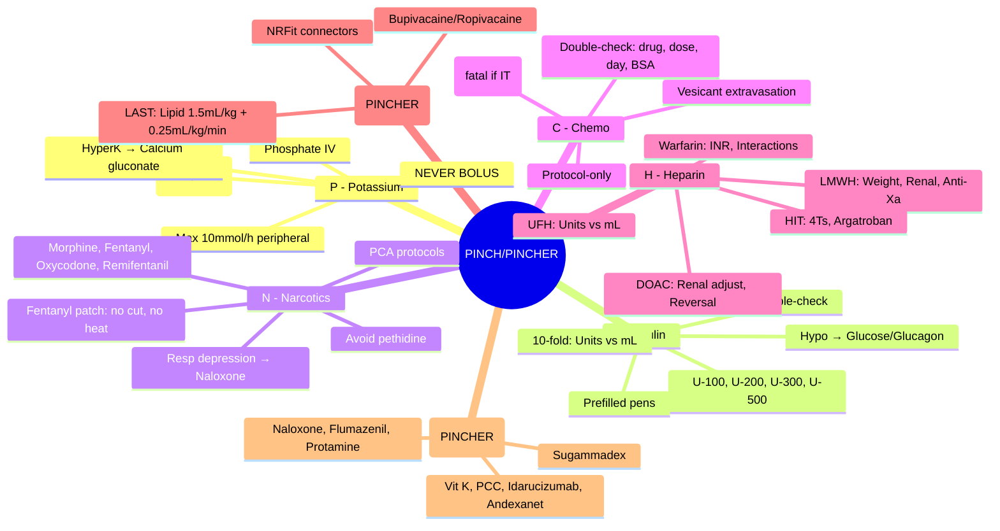

**Status**: `draft` | **Chapter**: 2 — Clinical Therapeutics and Good Prescribing | **Heading**: Medication Safety and Errors | **Exam Priority**: ⭐⭐⭐ **HIGHEST** (Daily clinical practice, governance, FCPS/MRCP staple)

---

## 1. 1. 🎯 Learning Objectives
- [ ] List PINCH/PINCHER high-alert drug categories
- [ ] Identify specific high-risk drugs within each category
- [ ] Apply specific safety strategies for each (double-check, monitoring, standardisation)
- [ ] Recognise classic error scenarios and mitigation

---

## 2. 2. 📌 PINCH / PINCHER Acronym

| Letter | **PINCH** | **PINCHER** (Expanded) |
|--------|-----------|------------------------|
| **P** | **Potassium** (Concentrated KCl, K⁺-sparing diuretics) | **Potassium** + **P**hosphate (IV), **P**rothrombin complex |
| **I** | **Insulin** (All types, U-100, U-200, U-300, U-500) | **Insulin** |
| **N** | **Narcotics** / **Opioids** (Morphine, Fentanyl, Oxycodone, Alfentanil, Remifentanil) | **N**arcotics/Opioids |
| **C** | **Chemotherapy** / **Cytotoxics** (IV, Oral, Intrathecal) | **Chemotherapy** + **C**ardioplegia |
| **H** | **Heparin** / **Anticoagulants** (UFH, LMWH, Fondaparinux, DOACs, Warfarin) | **H**eparin/Anticoagulants + **H**ypoglycaemics (Sulfonylureas, Insulin) |
| **E** | — | **E**pidural / **E**xternal ventricular drain drugs |
| **R** | — | **R**eversal agents (Naloxone, Flumazenil, Protamine, Vitamin K, Idarucizumab, Andexanet) |

> **PINCH** = Core 5 categories; **PINCHER** = Adds epidural, reversal agents, phosphate, cardioplegia

---

## 3. 3. 🧪 Category Details & Safety Strategies

### 1. P — **Potassium (Concentrated) & Phosphate**
| High-Risk Formulations | **KCl 15% (20 mmol/10mL), KCl 20% (26.4 mmol/10mL), K₂HPO₄/KH₂PO₄ IV** |
|------------------------|--------------------------------------------------------------------------|
| **Classic Errors** | **IV Bolus of conc. KCl → Cardiac arrest**; Wrong rate (mL/h vs mmol/h); Oral vs IV confusion |
| **Toxicity** | **Hyperkalaemia → Peaked T, Wide QRS, Sine wave, VF/Asystole** |
| **Safety Strategies** | **NEVER give IV bolus**; **Max infusion rate 10 mmol/h** (central 20 mmol/h); **Premixed bags only**; **Pump mandatory**; **Double-check concentration & rate**; **Continuous ECG** if >20 mmol/h |
| **Antidote** | **Calcium Gluconate 10% 10mL IV** (cardiac protection); Insulin + Glucose; Salbutamol; Dialysis |

### 2. I — **Insulin**
| High-Risk Aspects | **Multiple concentrations (U-100, U-200, U-300, U-500); Multiple types (Rapid, Short, Intermediate, Long, Mixed); Units vs mL confusion** |
|-------------------|-------------------------------------------------------------------------------------------------------------------------------|
| **Classic Errors** | **10-fold (Units vs mL)**; Wrong insulin type (Rapid vs Long); Wrong patient; Sliding scale errors; Omitted dose |
| **Toxicity** | **Hypoglycaemia → Confusion, Seizure, Coma, Death** |
| **Safety Strategies** | **Prefilled pens / cartridges**; **U-100 only on wards (U-500 ICU only)**; **"Units" never abbreviated**; **Independent double-check** (dose, type, patient, BG); **Standardised sliding scales**; **Bedside BG before admin** |
| **Antidote** | **IV Glucose 10% 50–100mL**; **Glucagon 1mg IM/IV**; Complex carbs if conscious |

### 3. N — **Narcotics / Opioids**
| High-Risk Drugs | **Morphine, Oxycodone, Fentanyl (Patch, IV, Sublingual), Alfentanil, Remifentanil, Pethidine, Tramadol, Codeine, Buprenorphine, Methadone** |
|-----------------|--------------------------------------------------------------------------------------------------------------------|
| **Classic Errors** | **Wrong dose (10-fold)**; **Wrong route** (IV epidural fentanyl); **Patch errors** (cutting, multiple patches, heat); **PCA pump programming**; **Opioid-naïve dosing** |
| **Toxicity** | **Respiratory Depression** (↓ RR, ↑ CO₂, ↓ SpO₂, Pinpoint pupils, Sedation); **Naloxone reversal** |
| **Safety Strategies** | **Standard concentrations**; **PCA protocols (lockout, max 4h dose)**; **Fentanyl patch: NO cutting, NO heat, max 72h**; **Naloxone prescribed PRN with opioid orders**; **Sedation score monitoring** (POSS/SAS); **Avoid pethidine** (normeperidine seizures) |
| **Antidote** | **Naloxone 400mcg IV** (repeat q2–3min; infuse 0.4–4mg/h if recurrent) |

### 4. C — **Chemotherapy / Cytotoxics**
| High-Risk Aspects | **Narrow TI, Complex regimens (cycles, days), Intrathecal route, Vesicants, Weight/BSA dosing, Supportive care complexity** |
|-------------------|------------------------------------------------------------------------------------------------------------------|
| **Classic Errors** | **Wrong day/cycle**; **Wrong drug** (similar names: Vincristine/Vinblastine); **Intrathecal Vincristine (FATAL)**; **Dose calc error (BSA vs weight)**; **Missing supportive care** (anti-emetic, hydration, G-CSF) |
| **Toxicity** | **Myelosuppression, Mucositis, Neuropathy, Cardiotoxicity, Extravasation (vesicants), TLS** |
| **Safety Strategies** | **Protocol-driven orders only (pre-printed/electronic)**; **Independent double-check** (drug, dose, day, cycle, BSA, route); **Vincristine: NEVER intrathecal — separate syringe, label "FOR IV USE ONLY"**; **Pharmacist verification mandatory**; **Extravasation protocols** |
| **Antidotes** | **Mesna** (Ifosfamide/Cyclophosphamide bladder); **Dexrazoxane** (Anthracycline extravasation/cardio); **Hyaluronidase** (Vinca extravasation); **Sodium thiosulfate** (Cisplatin extravasation) |

### 5. H — **Heparin / Anticoagulants**
| High-Risk Drugs | **UFH (IV, SC), LMWH (Enoxaparin, Dalteparin, Tinzaparin), Fondaparinux, Warfarin, DOACs (Apixaban, Rivaroxaban, Dabigatran, Edoxaban), Argatroban, Bivalirudin** |
|-----------------|------------------------------------------------------------------------------------------------------------------------------------------------|
| **Classic Errors** | **UFH: Units vs mL, Bolus vs Infusion, Weight-based calc**; **LMWH: Weight-based, Renal adjust, Anti-Xa monitoring**; **Warfarin: INR monitoring, Loading dose, Interaction missed**; **DOAC: Renal adjust missed, Wrong dose (CrCl), Reversal agent confusion** |
| **Toxicity** | **Bleeding (Major, ICH, GI)**; **HIT (UFH/LMWH)**; **Warfarin Skin Necrosis** |
| **Safety Strategies** | **Weight-based dosing with max caps**; **Standardised nomograms/protocols**; **Anti-Xa monitoring for LMWH (renal/CrCl<30, obesity, pregnancy)**; **INR monitoring protocol**; **DOAC renal adjustment table on every order**; **Reversal agents available** (Protamine, Vitamin K, PCC, Idarucizumab, Andexanet) |
| **Antidotes** | **Protamine** (UFH 1mg/100u, LMWH 1mg/1mg enoxaparin); **Vitamin K** (Warfarin); **PCC** (Warfarin urgent); **Idarucizumab** (Dabigatran); **Andexanet alfa** (Rivaroxaban/Apixaban) |

### 6. E — **Epidural / External Ventricular Drain Drugs** (PINCHER)
| High-Risk Drugs | **Epidural: Bupivacaine, Levobupivacaine, Ropivacaine, Fentanyl, Sufentanil, Clonidine**; **EVD: Antimicrobials, Thrombolytics** |
|-----------------|-------------------------------------------------------------------------------------------------------------|
| **Classic Errors** | **IV Bupivacaine given epidurally (or vice versa) → Cardiac arrest**; **Wrong concentration**; **Wrong route (IV vs Epidural)**; **Pump programming** |
| **Toxicity** | **Local Anaesthetic Systemic Toxicity (LAST): CNS (seizures) → CVS (arrhythmia, collapse)**; **Epidural haematoma (anticoagulated)** |
| **Safety Strategies** | **Separate storage**; **Different connectors (NRFit for neuraxial)**; **Clear labelling "EPIDURAL ONLY" / "IV ONLY"**; **Pump library with hard limits**; **Anticoagulation timing protocol** (ASRA guidelines) |
| **Antidote** | **20% Lipid Emulsion (Intralipid) 1.5mL/kg bolus + 0.25mL/kg/min infusion** (LAST) |

### 7. R — **Reversal Agents** (PINCHER)
| Agent | **Reverses** | **Key Dosing** |
|-------|--------------|----------------|
| **Naloxone** | Opioids | **400mcg IV** (repeat q2–3min; infuse 0.4–4mg/h) |
| **Flumazenil** | Benzodiazepines | **200mcg IV** (repeat q1min to 1mg; caution: seizure risk in BZD dependent) |
| **Protamine** | Heparin (UFH 1mg/100u; LMWH 1mg/1mg enoxaparin) | **1mg/100u UFH**; max 50mg |
| **Vitamin K (Phytomenadione)** | Warfarin | **5–10mg IV** (urgent); 1–5mg PO (non-urgent) |
| **PCC (4-factor)** | Warfarin (urgent) | **25–50 units/kg** (INR-based) |
| **Idarucizumab** | Dabigatran | **5g IV (2×2.5g vials)** |
| **Andexanet alfa** | Rivaroxaban, Apixaban, Edoxaban | **Bolus + infusion** (dose by agent/dose/timing) |
| **Sugammadex** | Rocuronium/Vecuronium | **2–4mg/kg** (routine); **16mg/kg** (immediate reversal) |

---

## 4. 4. 🎯 FCPS/MRCP High-Yield Summary

| Pearl | Details |
|-------|---------|
| **PINCH** | **Potassium (conc.), Insulin, Narcotics, Chemo, Heparin** |
| **PINCHER** | + **Epidural, Reversal agents, Phosphate, Cardioplegia** |
| **KCl IV** | **NEVER BOLUS**; Max 10mmol/h peripheral; Premixed bags; Pump |
| **Insulin** | **Units vs mL = 10-fold**; Prefilled pens; Double-check |
| **Opioids** | **Respiratory depression**; Naloxone PRN; Sedation scores |
| **Chemo** | **Protocol-only**; Double-check; **Vincristine NEVER intrathecal** |
| **Heparin** | **Units vs mL**; Weight-based; Anti-Xa (LMWH renal/obese); DOAC renal adjust |
| **Epidural** | **NRFit connectors**; LAST = Lipid emulsion 20% |
| **Reversal** | **Naloxone, Flumazenil, Protamine, Vit K, PCC, Idarucizumab, Andexanet, Sugammadex** |

---

## 5. 5. ❓ Viva Questions (10)

| Q | Answer |
|---|--------|
| 1. PINCH — what does each letter stand for? | **P**otassium (conc.), **I**nsulin, **N**arcotics, **C**hemo, **H**eparin |
| 2. Concentrated KCl IV — max infusion rate? | **Peripheral: 10 mmol/h**; **Central: 20 mmol/h**; **NEVER IV BOLUS** |
| 3. Insulin 10-fold error — classic scenario? | **Units vs mL confusion** (e.g., 10 units drawn as 10mL in U-100 = 1000 units) |
| 4. Opioid toxicity — key sign requiring naloxone? | **Respiratory depression** (RR <8–10, SpO₂ <90%, ↑ CO₂, Pinpoint pupils, Sedation) |
| 5. Vincristine — why "NEVER intrathecal"? | **FATAL** — ascending paralysis, encephalopathy, death; **Use "FOR IV USE ONLY" syringes** |
| 6. LMWH anti-Xa monitoring — when required? | **Renal impairment (CrCl<30), Obesity (>100kg or BMI>40), Pregnancy, Extreme weight** |
| 7. DOAC renal adjustment — Apixaban CrCl 15–29? | **2.5mg BD** (standard 5mg BD) |
| 8. Local Anaesthetic Systemic Toxicity (LAST) — antidote? | **20% Lipid Emulsion (Intralipid) 1.5mL/kg bolus + 0.25mL/kg/min infusion** |
| 9. Warfarin reversal — urgent (bleeding/INR>10)? | **PCC 25–50 units/kg + Vitamin K 5–10mg IV** |
| 10. Dabigatran reversal? | **Idarucizumab 5g IV (2×2.5g vials)** |

---

## 6. 6. 🤯 Confusions & Mnemonics

| Confusion | Clarification |
|-----------|---------------|
| **PINCH vs PINCHER** | PINCH = core 5; PINCHER = + Epidural, Reversal, Phosphate, Cardioplegia |
| **KCl rate** | Peripheral 10 mmol/h; Central 20 mmol/h; **NEVER BOLUS** |
| **Insulin U-100 vs U-500** | U-100 = standard (100u/mL); U-500 = 5x concentrated (ICU only) |
| **LMWH renal** | CrCl<30 → **Anti-Xa monitor OR switch to UFH**; DOACs have specific CrCl cutoffs |
| **LAST** | **CNS first (seizures) → CVS (arrhythmia/collapse)**; Lipid emulsion 1.5mL/kg + 0.25mL/kg/min |
| **Vincristine** | **NEVER intrathecal** — separate syringe, "FOR IV USE ONLY" label |
| **Reversal agents** | Naloxone (opioids), Flumazenil (BZD), Protamine (heparin), Vit K/PCC (warfarin), Idarucizumab (dabigatran), Andexanet (Xa inhibitors), Sugammadex (roc/vec) |

**Mnemonics:**
- **"PINCH"** = **P**otassium, **I**nsulin, **N**arcotics, **C**hemo, **H**eparin
- **"PINCHER"** = + **E**pidural, **R**eversal, Phosphate, Cardioplegia
- **"KCL NEVER BOLUS"** = Max 10mmol/h peripheral, 20 central
- **"INSULIN 10-FOLD"** = Units vs mL; Prefilled pens; Double-check
- **"OPIOID = RESP DEPRESSION"** = Naloxone 400mcg IV; Sedation scores
- **"VINCRISTINE = IV ONLY"** = Fatal if intrathecal
- **"LMWH ANTI-XA"** = CrCl<30, Obese, Pregnancy, Extreme weight
- **"LAST = LIPID"** = 1.5mL/kg bolus + 0.25mL/kg/min
- **"REVERSAL KIT"** = Naloxone, Flumazenil, Protamine, Vit K, PCC, Idarucizumab, Andexanet, Sugammadex

---

## 7. 7. 🧠 Mind Map (Mermaid)

---

## 8. 8. 📅 Spaced Repetition Tracker

| Review | Date | Score | Next |
|--------|------|-------|------|
| 1 | | | 1d |
| 2 | | | 3d |
| 3 | | | 1w |
| 4 | | | 2w |
| 5 | | | 1m |
| 6 | | | 3m |

---

## 9. 9. 🧪 Self-Test Scorecard

| Section | Max | Score |
|---------|-----|-------|
| PINCH categories | 6 | |
| Potassium | 6 | |
| Insulin | 6 | |
| Opioids | 6 | |
| Chemo | 6 | |
| Heparin/Anticoags | 8 | |
| Epidural/LAST | 6 | |
| Reversal agents | 6 | |
| Viva answers | 10 | |
| **Total** | **60** | |

**Target**: ≥48/60 (80%)

---

## 10. 10. 📝 Exam Answer Modes

### 1. Short Question (5 marks): *"PINCH high-alert drugs and key safety strategies."*
- **P**otassium: Conc. KCl — **NEVER BOLUS**, max 10mmol/h, premixed bags, pump
- **I**nsulin: **Units vs mL = 10-fold** — prefilled pens, double-check, BG before
- **N**arcotics: **Respiratory depression** — Naloxone PRN, sedation scores, PCA protocols
- **C**hemo: **Protocol-only**, double-check, **Vincristine IV ONLY**
- **H**eparin: **Units vs mL**, weight-based, Anti-Xa (renal/obese), DOAC renal adjust

### 2. Viva (1 min): *"Patient on morphine PCA, RR 6, pinpoint pupils. Management?"*
- **Opioid toxicity / Respiratory depression**
- **Naloxone 400mcg IV** (repeat q2–3min to effect)
- **Oxygen, Ventilatory support** if needed
- **Stop PCA**; Monitor RR, SpO₂, sedation score (SAS/POSS)
- **Naloxone infusion 0.4–4mg/h** if recurrent (short half-life)

### 3. Ward Round (30 sec): *"Prescription: KCl 20mmol in 100mL NS over 1 hour. Safe?"*
- **Rate = 20mmol/h** → **EXCEEDS peripheral max (10mmol/h)**
- **Change to**: 20mmol in 200mL over 2h (10mmol/h) OR use central line (max 20mmol/h)
- **Premixed bag preferred**; Pump mandatory; ECG monitoring

### 4. Last-Night Revision (1-liners):
- PINCH = K+, Insulin, Narcotics, Chemo, Heparin
- KCl = NEVER BOLUS, Max 10mmol/h peripheral
- Insulin = Units vs mL (10-fold), Prefilled pens
- Opioids = Resp depression, Naloxone 400mcg, Sedation scores
- Chemo = Protocol-only, Vincristine IV ONLY
- Heparin = Units vs mL, LMWH renal→Anti-Xa, DOAC renal adjust
- LAST = Lipid 1.5mL/kg + 0.25mL/kg/min
- Reversal: Naloxone, Flumazenil, Protamine, Vit K, PCC, Idarucizumab, Andexanet, Sugammadex

---

## 11. 11. 📚 Summary Card

> **PINCHER HIGH-ALERT:**
> **P** = KCl (NEVER BOLUS, 10mmol/h max) / Phosphate
> **I** = Insulin (Units vs mL = 10-fold; Prefilled pens)
> **N** = Narcotics (Resp depression → Naloxone; Sedation scores)
> **C** = Chemo (Protocol-only; Vincristine IV ONLY; Double-check)
> **H** = Heparin (Units vs mL; LMWH Anti-Xa if renal/obese; DOAC renal adjust)
> **E** = Epidural (NRFit; LAST → Lipid 1.5mL/kg)
> **R** = Reversal (Naloxone, Flumazenil, Protamine, Vit K, PCC, Idarucizumab, Andexanet, Sugammadex)

---

## 12. 12. ❓ MCQs (15)

1. **PINCH — what does "P" stand for?**
   A. Penicillin
   B. **Potassium (concentrated)** ✓
   C. Propofol
   D. Paracetamol
   E. Phenytoin

2. **Concentrated KCl IV — maximum peripheral infusion rate:**
   A. 5 mmol/h
   B. **10 mmol/h** ✓
   C. 20 mmol/h
   D. 40 mmol/h
   E. No limit

3. **Insulin 10-fold error — most common cause:**
   A. Wrong patient
   B. **Units vs mL confusion** ✓
   C. Wrong insulin type
   D. Expired insulin
   E. Calculation error

4. **Opioid toxicity — key sign for naloxone:**
   A. Nausea
   B. **Respiratory depression (RR <8–10)** ✓
   C. Constipation
   D. Pruritus
   E. Urinary retention

5. **Vincristine — why "NEVER intrathecal"?**
   A. Causes headache
   B. **FATAL: ascending paralysis, encephalopathy, death** ✓
   C. Ineffective
   C. Causes sepsis
   E. Not soluble

6. **LMWH Anti-Xa monitoring — NOT indicated in:**
   A. CrCl <30 mL/min
   B. Obesity (BMI >40)
   C. Pregnancy
   D. **Normal renal, normal weight, non-pregnant** ✓
   E. Extreme low weight

7. **Apixaban dose for CrCl 15–29 mL/min:**
   A. 5mg BD
   B. **2.5mg BD** ✓
   C. 5mg OD
   D. 2.5mg OD
   E. Contraindicated

8. **Local Anaesthetic Systemic Toxicity (LAST) — antidote:**
   A. Naloxone
   B. Flumazenil
   C. **20% Lipid Emulsion (1.5mL/kg bolus + 0.25mL/kg/min)** ✓
   D. Protamine
   E. Vitamin K

9. **Warfarin urgent reversal (major bleeding):**
   A. Vitamin K alone
   B. **PCC 25–50 units/kg + Vitamin K 5–10mg IV** ✓
   C. FFP only
   D. Protamine
   E. Idarucizumab

10. **Dabigatran reversal agent:**
    A. Andexanet alfa
    B. **Idarucizumab** ✓
    C. PCC
    D. Vitamin K
    E. Sugammadex

11. **Fentanyl transdermal patch — safety rule:**
    A. Can cut to adjust dose
    B. Can apply heat for faster onset
    C. **NO cutting, NO heat, max 72h** ✓
    D. Change daily
    E. Apply to broken skin

12. **Concentrated KCl IV bolus — immediate risk:**
    A. Hypokalaemia
    B. **Cardiac arrest (Hyperkalaemia → VF/Asystole)** ✓
    C. Phlebitis only
    D. Hyponatraemia
    E. Metabolic alkalosis

13. **LMWH vs UFH in renal impairment (CrCl<30):**
    A. LMWH preferred
    B. **UFH preferred (or LMWH + Anti-Xa)** ✓
    C. Both contraindicated
    D. DOAC preferred
    E. No difference

14. **Sugammadex — reverses:**
    A. Succinylcholine
    B. **Rocuronium / Vecuronium** ✓
    C. Cisatracurium
    D. All neuromuscular blockers
    E. Neostigmine

15. **Epidural connector standard (neuraxial):**
    A. Luer lock
    B. **NRFit** ✓
    C. Spike
    D. Quick-connect
    E. No standard

---

## 13. 13. 🃏 Flashcards (Anki-ready)

| Front | Back |
|-------|------|
| PINCH | Potassium, Insulin, Narcotics, Chemo, Heparin |
| PINCHER | + Epidural, Reversal, Phosphate, Cardioplegia |
| KCl max rate | 10mmol/h peripheral, 20mmol/h central, NEVER BOLUS |
| KCl bolus risk | Cardiac arrest (hyperK → VF) |
| Insulin 10-fold | Units vs mL |
| Insulin safety | Prefilled pens, double-check, BG before |
| Opioid tox | Resp depression → Naloxone 400mcg IV |
| Naloxone infusion | 0.4–4mg/h if recurrent |
| Vincristine | IV ONLY (fatal if intrathecal) |
| Chemo safety | Protocol-only, double-check |
| LMWH Anti-Xa | CrCl<30, Obese, Pregnancy, Extreme weight |
| Apixaban CrCl 15-29 | 2.5mg BD |
| DOAC renal | Specific CrCl cutoffs each agent |
| LAST antidote | 20% Lipid 1.5mL/kg bolus + 0.25mL/kg/min |
| Warfarin urgent reversal | PCC + Vit K IV |
| Dabigatran reversal | Idarucizumab 5g IV |
| Andexanet reversal | Rivaroxaban, Apixaban, Edoxaban |
| Fentanyl patch | NO cut, NO heat, 72h max |
| Sugammadex | Rocuronium, Vecuronium |
| Epidural connector | NRFit |

---

## 14. 14. ✅ Answer Keys

### 1. MCQs
1. **B** — Potassium (concentrated)
2. **B** — 10 mmol/h
3. **B** — Units vs mL confusion
4. **B** — Respiratory depression
5. **B** — FATAL
6. **D** — Normal renal, normal weight, non-pregnant
7. **B** — 2.5mg BD
8. **C** — 20% Lipid Emulsion
9. **B** — PCC + Vitamin K IV
10. **B** — Idarucizumab
11. **C** — NO cutting, NO heat, max 72h
12. **B** — Cardiac arrest
13. **B** — UFH preferred (or LMWH + Anti-Xa)
14. **B** — Rocuronium / Vecuronium
15. **B** — NRFit

---

*File: `/mnt/tb/Medicine/Clinical Therapeutics and Good Prescribing/Medication Safety/High-risk drugs - PINCH.md` | Status: `draft` → upgrade after review*
