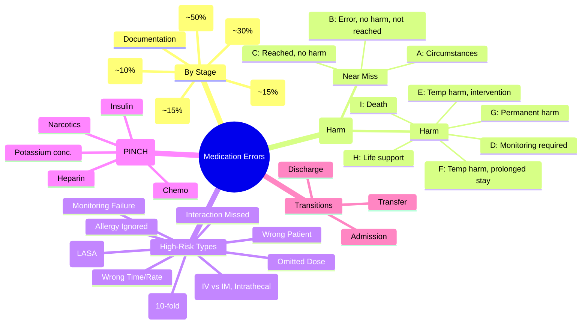

**Status**: `draft` | **Chapter**: 2 — Clinical Therapeutics and Good Prescribing | **Heading**: Medication Safety and Errors | **Exam Priority**: ⭐⭐⭐ **HIGH** (Patient safety, governance, FCPS/MRCP)

---

## 1. 1. 🎯 Learning Objectives
- [ ] Classify medication errors by stage (prescribing, dispensing, administration, monitoring)
- [ ] Apply NCC MERP / NRLS harm grading
- [ ] Identify high-risk situations (transitions, LASA, high-alert drugs)
- [ ] Execute error reporting and root cause analysis basics

---

## 2. 2. 📊 Classification by Stage (Medication Use Process)

| Stage | Definition | Examples | Frequency |
|-------|------------|----------|-----------|
| **Prescribing** | Error in drug selection, dose, route, frequency, duration, indication, contraindication | Wrong drug, wrong dose, allergy ignored, interaction missed, renal/hepatic adjustment omitted | **~50% of errors** |
| **Transcribing** | Error in communicating prescription (paper/electronic) | Illegible handwriting, decimal point error, wrong patient, abbreviation misinterpretation | ~10% |
| **Dispensing** | Error in pharmacy supply | Wrong drug/strength/quantity, labelling error, wrong patient, expired drug | ~15% |
| **Administration** | Error in giving drug to patient | Wrong patient, wrong drug, wrong dose, wrong route, wrong time, wrong rate, omitted dose | **~30% of errors** |
| **Monitoring** | Failure to monitor response, toxicity, levels, labs | Missed INR, missed lithium level, missed renal function, missed TDM | ~15% |
| **Documentation** | Error in recording | Omitted administration, double documentation, wrong dose recorded | Variable |

---

## 3. 3. 🌡️ NCC MERP Harm Grading (NCC MERP Index)

| Category | Definition | Example |
|----------|------------|---------|
| **A** | **Circumstances/error prone** — No error occurred | Look-alike drugs stored together |
| **B** | **Error occurred, No harm** — Did not reach patient | Prescribed penicillin to allergic patient, caught by pharmacist |
| **C** | **Error reached patient, No harm** | Wrong dose given, no adverse effect |
| **D** | **Error reached patient, Monitoring required** | Wrong dose given, extra monitoring (e.g., INR) needed |
| **E** | **Error reached patient, Temporary harm, Intervention required** | Hypoglycaemia from insulin overdose → IV dextrose |
| **F** | **Error reached patient, Temporary harm, Prolonged hospitalisation** | Fall from sedative overdose → fracture, extended stay |
| **G** | **Error reached patient, Permanent harm** | Anaphylactic death from known allergy ignored |
| **H** | **Error reached patient, Life-sustaining intervention required** | Cardiac arrest from K⁺ bolus error → resuscitation |
| **I** | **Error reached patient, Death** | Fatal overdose, wrong route (intrathecal vincristine) |

> **A–C = "Near Miss" (No harm); D–I = "Adverse Events" (Harm)**

---

## 4. 4. 🏥 NRLS (National Reporting and Learning System) — UK

| Degree of Harm | Definition |
|----------------|------------|
| **No Harm** | Error prevented or no adverse outcome |
| **Low** | Minor injury (bruise, minor rash), minimal intervention |
| **Moderate** | Significant injury, requires treatment (e.g., IV fluids, antidote) |
| **Severe** | Permanent harm, life-threatening, requires ICU |
| **Death** | Fatal outcome |

---

## 5. 5. 🔍 High-Risk Error Types (Exam Favourites)

| Error Type | Definition | Classic Example |
|------------|------------|-----------------|
| **Wrong Drug** | Drug prescribed/dispensed/administered ≠ intended | **Hydralazine vs Hydroxyzine**, **Celecoxib vs Celecoxib**, **Propranolol vs Propafenone** |
| **Wrong Dose** | Dose ≠ prescribed/indicated | **10mg vs 1mg**, **mg vs mcg**, **10-fold error** (decimal point) |
| **Wrong Route** | Route ≠ intended | **IV instead of IM**, **Intrathecal vincristine**, **Oral instead of IV** |
| **Wrong Patient** | Drug given to ≠ intended patient | Bedside verification failure |
| **Wrong Time** | Administered outside acceptable window | **Antibiotic delayed >1h**, **Insulin given without meal** |
| **Omitted Dose** | Prescribed dose not given | **VTE prophylaxis missed**, **Antiepileptic missed** |
| **Wrong Rate** | IV infusion rate incorrect | **Heparin 1000 units/h instead of 100** |
| **Allergy/Contraindication Ignored** | Known allergy/contraindication not checked | **Penicillin given to allergic patient** |
| **Drug Interaction Missed** | Clinically significant interaction not identified | **Warfarin + Clarithromycin**, **Digoxin + Verapamil** |
| **Monitoring Failure** | Required lab/level not checked | **INR not checked on warfarin**, **Lithium level missed** |

---

## 6. 6. 🎯 FCPS/MRCP High-Yield Summary

| Pearl | Details |
|-------|---------|
| **Prescribing errors** | Most common (~50%) |
| **Administration errors** | Second most common (~30%) |
| **NCC MERP** | A–C = Near miss; D–I = Harm |
| **Decimal point errors** | **10-fold** (0.1mg vs 1mg, 1mg vs 10mg) |
| **LASA (Look-Alike Sound-Alike)** | High-risk pairs (see LASA list below) |
| **High-alert drugs (PINCH)** | **P**otassium, **I**nsulin, **N**arcotics, **C**hemo, **H**eparin |
| **Transitions of care** | Admission, Transfer, Discharge — highest error risk |

---

## 7. 7. ❓ Viva Questions (8)

| Q | Answer |
|---|--------|
| 1. Classify medication errors by stage of medication use process. | Prescribing (~50%), Transcribing (~10%), Dispensing (~15%), Administration (~30%), Monitoring (~15%), Documentation |
| 2. NCC MERP categories A–I — which are "near miss" vs "harm"? | **A–C = Near Miss (no harm)**; **D–I = Harm (reached patient)** |
| 3. Most common stage for medication errors? | **Prescribing (~50%)** |
| 4. High-alert drugs (PINCH) — list? | **P**otassium (concentrated), **I**nsulin, **N**arcotics/Opioids, **C**hemotherapy, **H**eparin/Anticoagulants |
| 5. LASA — give 5 examples? | **Hydralazine/Hydroxyzine, Celebrate/Celebrex, Propranolol/Propafenone, Hydromorphone/Morphine, Dopamine/Dobutamine, Clonidine/Klonopin** |
| 6. Decimal point error — classic example? | **0.1mg vs 1mg** (10-fold); **1mg vs 10mg**; **10 units vs 1 unit insulin** |
| 7. Transitions of care — highest risk times? | **Admission, Ward transfer, Discharge** — medication reconciliation critical |
| 8. Difference between error and adverse drug reaction (ADR)? | **Error = preventable process failure**; **ADR = harm directly attributable to drug at normal dose** (not necessarily an error) |

---

## 8. 8. 🤯 Confusions & Mnemonics

| Confusion | Clarification |
|-----------|---------------|
| **Error vs ADR** | **Error = preventable process failure** (wrong dose, wrong drug); **ADR = inherent drug property at normal dose** (not necessarily an error) |
| **Near miss vs Harm** | **Near miss (A–C)** = error caught or no harm; **Harm (D–I)** = patient injured |
| **Prescribing vs Transcribing** | Prescribing = decision-making; Transcribing = communication of order |
| **Administration error types** | Wrong patient, drug, dose, route, time, rate, omission |

**Mnemonics:**
- **"MERP A-I"** = **A**=Circumstances, **B**=Error no harm, **C**=Reached no harm, **D**=Monitor, **E**=Temp harm intervention, **F**=Prolonged stay, **G**=Permanent harm, **H**=Life support, **I**=Death
- **"PINCH"** = **P**otassium (concentrated), **I**nsulin, **N**arcotics, **C**hemo, **H**eparin
- **"LASA PAIRS"** = **Hydralazine/Hydroxyzine, Cel**ebrate/**Cel**ebrex, **Prop**ranolol/**Prop**afenone, **Hydro**morphone/**Mor**phine, **Dopa**mine/**Dobu**tamine
- **"10-FOLD ERROR"** = **Decimal point** (0.1 vs 1, 1 vs 10, 10 vs 100)
- **"5 RIGHTS + 1"** = **Right Patient, Drug, Dose, Route, Time, DOCUMENTATION**

---

## 9. 9. 🧠 Mind Map (Mermaid)

---

## 10. 10. 📅 Spaced Repetition Tracker

| Review | Date | Score | Next |
|--------|------|-------|------|
| 1 | | | 1d |
| 2 | | | 3d |
| 3 | | | 1w |
| 4 | | | 2w |
| 5 | | | 1m |
| 6 | | | 3m |

---

## 11. 11. 🧪 Self-Test Scorecard

| Section | Max | Score |
|---------|-----|-------|
| Classification by stage | 6 | |
| NCC MERP | 8 | |
| High-risk types | 8 | |
| PINCH drugs | 6 | |
| Viva answers | 8 | |
| **Total** | **36** | |

**Target**: ≥29/36 (80%)

---

## 12. 12. 📝 Exam Answer Modes

### 1. Short Question (5 marks): *"Classify medication errors by stage. What is the most common stage?"*
- **Prescribing** (~50%) — wrong drug, dose, allergy, interaction, renal adjustment
- **Transcribing** (~10%) — illegible, decimal point, abbreviation
- **Dispensing** (~15%) — wrong drug/strength, labelling
- **Administration** (~30%) — wrong patient/drug/dose/route/time/rate/omission
- **Monitoring** (~15%) — missed INR, lithium, TDM, renal function
- **Most common: Prescribing (~50%)**

### 2. Viva (1 min): *"What are PINCH drugs? Why are they high-alert?"*
- **P**otassium (concentrated) — **cardiac arrest if bolus**
- **I**nsulin — **hypoglycaemia, 10-fold errors (units vs mL)**
- **N**arcotics/Opioids — **respiratory depression, sedation**
- **C**hemotherapy — **narrow TI, complex regimens**
- **H**eparin/Anticoagulants — **bleeding, HIT, monitoring critical**

### 3. Ward Round (30 sec): *"Prescription: 'Morphine 10mg IV stat'. Nurse finds 10mg/mL and 1mg/mL vials. Risk?"*
- **10-fold error risk** — 10mg from 1mg/mL = 10mL (large volume) vs 10mg from 10mg/mL = 1mL
- **LASA / concentration confusion** — independent double-check required
- **Use prefilled syringes / standard concentrations**

### 4. Last-Night Revision (1-liners):
- Prescribing = ~50% errors; Administration = ~30%
- NCC MERP: A-C = Near miss; D-I = Harm
- PINCH = K+, Insulin, Narcotics, Chemo, Heparin
- LASA pairs: Hydralazine/Hydroxyzine, Propranolol/Propafenone, Hydromorphone/Morphine
- 10-fold errors = decimal point (0.1 vs 1mg)
- Transitions = Admission, Transfer, Discharge = reconcile

---

## 13. 13. 📚 Summary Card

> **MEDICATION ERRORS:**
> **MOST COMMON = PRESCRIBING (~50%)**
> **NCC MERP**: A-C = Near Miss; D-I = Harm
> **PINCH** = K+, Insulin, Narcotics, Chemo, Heparin
> **10-FOLD** = Decimal point (0.1 vs 1mg)
> **LASA** = Hydralazine/Hydroxyzine, Propranolol/Propafenone, HydroMORphone/Morphine
> **TRANSITIONS** = Admit, Transfer, Discharge = RECONCILE

---

## 14. 14. ❓ MCQs (10)

1. **Most common stage for medication errors:**
   A. Dispensing
   B. Administration
   C. **Prescribing** ✓
   D. Monitoring
   E. Transcribing

2. **NCC MERP Category E — definition:**
   A. Error, no harm
   B. **Error reached patient, temporary harm, intervention required** ✓
   C. Permanent harm
   D. Death
   E. Near miss

3. **PINCH high-alert drugs — what does 'P' stand for?**
   A. Penicillin
   B. **Potassium (concentrated)** ✓
   C. Propofol
   D. Paracetamol
   E. Prednisolone

4. **Look-Alike Sound-Alike (LASA) pair — hydralazine confused with:**
   A. Hydrocortisone
   B. **Hydroxyzine** ✓
   C. Hydromorphone
   D. Hyoscine
   E. Hydrochlorothiazide

5. **10-fold dosing error — classic example:**
   A. 1mg vs 2mg
   B. **0.1mg vs 1mg** ✓
   C. 5mg vs 10mg
   D. 10mg vs 20mg
   E. 100mg vs 200mg

6. **NCC MERP — which categories are "Near Miss"?**
   A. D–I
   B. **A–C** ✓
   C. E–H
   D. A–B only
   E. C–D

7. **Medication reconciliation — highest risk transitions:**
   A. Admission only
   B. **Admission, Transfer, Discharge** ✓
   C. Discharge only
   D. Ward round only
   E. Outpatient only

8. **Wrong route error — classic example:**
   A. Oral instead of IV
   B. **Intrathecal vincristine** ✓
   C. IM instead of SC
   D. Topical instead of oral
   E. IV instead of IO

9. **Omitted dose — high-risk example:**
   A. Vitamin supplement
   B. **VTE prophylaxis (heparin)** ✓
   C. Laxative
   D. Antacid
   E. Multivitamin

10. **Difference between medication error and ADR:**
    A. Error = drug property; ADR = process failure
    B. **Error = preventable process failure; ADR = harm from drug at normal dose** ✓
    C. Both are preventable
    D. Both are dose-related
    E. No difference

---

## 15. 15. 🃏 Flashcards (Anki-ready)

| Front | Back |
|-------|------|
| Most common error stage | Prescribing (~50%) |
| Administration errors | ~30% |
| NCC MERP A-C | Near miss |
| NCC MERP D-I | Harm |
| PINCH | Potassium (conc), Insulin, Narcotics, Chemo, Heparin |
| 10-fold error | Decimal point (0.1 vs 1mg) |
| LASA: Hydralazine | Hydroxyzine |
| LASA: Propranolol | Propafenone |
| LASA: Hydromorphone | Morphine |
| LASA: Dopamine | Dobutamine |
| High-risk transitions | Admission, Transfer, Discharge |
| Error vs ADR | Error = preventable process failure; ADR = drug property at normal dose |
| Intrathecal vincristine | Fatal wrong route error |

---

## 16. 16. ✅ Answer Keys

### 1. MCQs
1. **C** — Prescribing (~50%)
2. **B** — Temp harm, intervention required
3. **B** — Potassium (concentrated)
4. **B** — Hydroxyzine
5. **B** — 0.1mg vs 1mg
6. **B** — A–C
7. **B** — Admission, Transfer, Discharge
8. **B** — Intrathecal vincristine
9. **B** — VTE prophylaxis
10. **B** — Error = preventable process failure; ADR = harm from drug at normal dose

---

*File: `/mnt/tb/Medicine/Clinical Therapeutics and Good Prescribing/Medication Safety/Types of medication errors.md` | Status: `draft` → upgrade after review*
