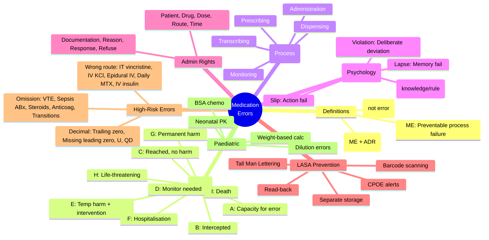

**Parent Topic:** [Medication Safety and Errors](../../Medication%20Safety%20and%20Errors.md) → [Clinical Therapeutics Overview](../../Clinical%20Therapeutics%20and%20Good%20Prescribing%20MOC.md)
**Status:** `full-fcps-mrcp-note`
**Priority:** ⭐⭐⭐ HIGHEST (FCPS/MRCP — error classification, NCC MERP, WHO taxonomy, high-risk situations)
**Source:** Davidson 24th Ed Ch 2; NCC MERP Taxonomy; WHO Medication Without Harm; ISMP Guidelines; NPSA/NRLS; NHS Patient Safety Strategy; BNF Prescribing Safety

---

## 1. 1. 🎯 Learning Objectives
- [ ] Define **medication error** vs **adverse drug event (ADE)** vs **adverse drug reaction (ADR)**
- [ ] Classify errors using **NCC MERP Index** (Categories A–I) and **WHO Taxonomy**
- [ ] Apply **Prescribing, Transcribing, Dispensing, Administration, Monitoring** (PTDAM) framework
- [ ] Identify **high-risk error types**: wrong drug, wrong dose, wrong patient, wrong route, wrong time, omission
- [ ] Distinguish **active errors** (slips/lapses/mistakes) vs **latent conditions** (system failures)
- [ ] Know **Look-Alike Sound-Alike (LASA)** drugs and **Tall Man Lettering**
- [ ] Apply **PINCH** high-risk drug classes
- [ ] Answer viva: "Classify this error using NCC MERP" and "How to prevent LASA errors?"

---

## 2. 2. 🧠 Core Concept: Definitions & Taxonomy

### 1. Key Definitions

| Term | Definition |
|------|------------|
| **Medication Error (ME)** | Any preventable event that may cause or lead to inappropriate medication use or patient harm while the medication is in the control of the healthcare professional, patient, or consumer (NCC MERP) |
| **Adverse Drug Event (ADE)** | Injury resulting from medical intervention related to a drug (includes errors + ADRs) |
| **Adverse Drug Reaction (ADR)** | Noxious, unintended response to a drug at normal doses (Type A/B) — **not an error** |
| **Near Miss** | Error that reached patient but caused no harm (NCC MERP Category B–C) |
| **Potential ADE** | Error with potential to cause harm but intercepted (Category A–C) |
| **Preventable ADE** | Harm from an error (Category E–I) |
| **Non-preventable ADE** | ADR (no error) |

### 2. Relationship
```mermaid
flowchart LR
    A[Medication
Error] --> B{Intercepted?}
    B -->|Yes| C[Near Miss /
Potential ADE
(Cat A-C)]
    B -->|No| D[Actual Error
Reaches Patient]
    D --> E{Harm?}
    E -->|No| F[Error, No Harm
(Cat D)]
    E -->|Yes| G[Preventable ADE
(Cat E-I)]
    H[ADR
(Type A/B)] --> I[Non-preventable ADE]
    G --> J[Total ADEs]
    I --> J
```

---

## 3. 3. ️⃣ NCC MERP Index — Harm-Based Classification (Categories A–I)

| Category | Description | Harm Level | Example |
|----------|-------------|------------|---------|
| **A** | **Circumstances/events with capacity to cause error** (no error occurred) | None | Look-alike drug names on shelf; confusing label |
| **B** | **Error occurred but did not reach patient** (intercepted) | None | Pharmacist catches prescribing error before dispensing |
| **C** | **Error reached patient but did not cause harm** | None | Wrong dose given but no clinical effect |
| **D** | **Error reached patient, required monitoring/pre-treatment** but no harm | None | Double dose given → monitor vitals, no harm |
| **E** | **Error caused temporary harm, required intervention** | Temporary | Wrong drug → allergic reaction → treated with antihistamine |
| **F** | **Error caused temporary harm, required initial/prolonged hospitalisation** | Temporary (hospital) | Overdose → admission for observation |
| **G** | **Error caused permanent harm** | Permanent | Intrathecal vincristine → paralysis |
| **H** | **Error required intervention to sustain life** | Life-threatening | Tenfold insulin overdose → ICU, ventilation |
| **I** | **Error resulted in death** | Death | Potassium chloride IV push → cardiac arrest |

> **Exam Key:** *Categories A–D = no harm (near miss/potential). E–I = harm occurred (preventable ADE). I = death.*

---

## 4. 4. ️⃣ WHO Taxonomy — Process-Based Classification

### 1. Stages of Medication Use Process

| Stage | Description | Typical Errors |
|-------|-------------|----------------|
| **Prescribing** | Selecting drug, dose, route, frequency, duration | Wrong drug, wrong dose, allergy ignored, interaction missed, indication unclear |
| **Transcribing** | Writing/entering order (paper → electronic) | Illegible handwriting, decimal point error, abbreviation misread, wrong patient |
| **Dispensing** | Preparing & supplying drug | Wrong drug/strength/quantity, labelling error, LASA confusion, expiry missed |
| **Administration** | Giving drug to patient | Wrong patient, wrong route, wrong time, wrong rate, omitted dose, technique error |
| **Monitoring/Documentation** | Follow-up, lab review, response assessment | Missed TDM, missed renal/hepatic monitoring, failure to act on ADR, documentation error |

### 2. Error Types (Psychological Classification)

| Type | Description | Example |
|------|-------------|---------|
| **Slip** | **Action not as planned** (attentional failure) | Intended to write 5mg, wrote 50mg (motor slip) |
| **Lapse** | **Memory failure** (forgotten step) | Forgot to prescribe VTE prophylaxis on admission |
| **Mistake** | **Plan wrong** (knowledge/rule-based failure) | Prescribed penicillin for "penicillin allergy" (knowledge) or used adult dose in child (rule) |
| **Violation** | **Deliberate deviation** from protocol | Giving IV push instead of infusion to save time |

---

## 5. 5. ️⃣ PTDAM Framework — Practical Classification

```mermaid
flowchart TD
    A[Medication Use Process] --> B[Prescribing]
    A --> C[Transcribing]
    A --> D[Dispensing]
    A --> E[Administration]
    A --> F[Monitoring]
    
    B --> B1[Wrong drug
Wrong dose
Wrong frequency
Allergy ignored
Interaction missed
Indication unclear
Contraindication missed]
    C --> C1[Illegible writing
Decimal error (5.0 vs .5)
Abbreviation (U→units, QD→OD)
Wrong patient ID]
    D --> D1[Wrong drug/strength
LASA confusion
Labelling error
Expiry missed
Compounding error]
    E --> E1[Wrong patient
Wrong route (IV vs IM)
Wrong time (±1h vs >1h)
Wrong rate (IV infusion)
Omitted dose
Technique error (inhaler)]
    F --> F1[Missed TDM
Missed renal/hepatic monitor
Missed ADR recognition
Failure to act on result
Documentation error]
```

### 1. High-Yield: Administration "Rights" (Expanded)

| Right | Description | Error Type |
|-------|-------------|------------|
| **Right Patient** | Two identifiers (name + DOB/MRN) | Wrong patient |
| **Right Drug** | Match prescription, check allergies | Wrong drug |
| **Right Dose** | Calculate, double-check, weight-based | Wrong dose |
| **Right Route** | IV/IM/SC/PO/PR/Inhaler/Topical | Wrong route |
| **Right Time** | ±30 min (standard) / ±1h (extended) | Wrong time |
| **Right Documentation** | Record immediately after admin | Documentation error |
| **Right Reason** | Indication matches diagnosis | Indication error |
| **Right Response** | Monitor for effect/ADR | Monitoring error |
| **Right to Refuse** | Respect autonomy | Ethical error |

---

## 6. 6. ️⃣ Look-Alike Sound-Alike (LASA) Drugs

### 1. Mechanism
- **Visual similarity** (look-alike): similar spelling, packaging, font
- **Phonetic similarity** (sound-alike): similar pronunciation
- **Strength similarity**: same drug, different strength (e.g., 5mg vs 50mg)

### 2. Prevention Strategies

| Strategy | Implementation |
|----------|----------------|
| **Tall Man Lettering** | Highlight dissimilar letters: **hydrOXYzine** vs **hydrALAZINE**, **dopamine** vs **DOBUTamine**, **glipiZIDE** vs **glyBURIDE** |
| **Separate storage** | Physical separation in pharmacy/ward |
| **Electronic alerts** | CPOE pop-up for LASA pairs |
| **Read-back verification** | Verbal orders: read back drug name, dose, patient |
| **Barcode scanning** | At dispensing and administration |
| **Patient education** | "Know your medicines" |

### 3. High-Risk LASA Pairs (Must Know for Exam)

| Pair | Risk |
|------|------|
| **HydrALAZINE / HydrOXYzine** | Antihypertensive vs Antihistamine |
| **Dopamine / DOBUTamine** | Vasopressor vs Inotrope |
| **GlipiZIDE / GlyBURIDE** | Sulfonylureas (different potency/duration) |
| **CloZAPINE / ClomiPRAMINE / CloBAZam** | Antipsychotic vs TCA vs Anticonvulsant |
| **Carbamazepine / CarbIMAZOLE / CarBOPLATIN** | Anticonvulsant vs Antithyroid vs Chemo |
| **Methotrexate / Metolazone** | Immunosuppressant vs Diuretic |
| **PrednisoLONE / PredniSONE / Methylprednisolone** | Corticosteroids (different potency) |
| **FentaNYL / SufentaNYL / AlfentaNYL** | Opioids (potency 100x, 500x, 10x morphine) |
| **Insulin Glargine / Insulin Lispro / Insulin Aspart** | Long-acting vs Rapid-acting |
| **Bisoprolol / Bisacodyl** | Beta-blocker vs Laxative |
| **AmLODIPINE / AmIODARONE** | CCB vs Antiarrhythmic |
| **Ceftriaxone / Cefotaxime / CefTAZIDIME** | Cephalosporins (different spectra) |
| **Zolpidem / Zopiclone** | Z-drugs (similar but not identical) |
| **Lamotrigine / Lamivudine / Labetalol** | Anticonvulsant vs ARV vs Alpha/beta-blocker |

> **Tall Man Lettering Examples (ISMP/FDA):**
> - **bupropion** vs **busPIRone**
> - **chlorproMAZINE** vs **chlorproPAMIDE**
> - **DOBUTamine** vs **dopamine**
> - **glipiZIDE** vs **glyBURIDE**
> - **hydrALAZINE** vs **hydrOXYzine**
> - **methylPREDNISolone** vs **methylTESTOSTERONE**
> - **nitroGLYCERIN** vs **nitroPRUSSIDE**
> - **OxyCODONE** vs **OxyCONTIN** (brand)
> - **vinBLASTINE** vs **vinCRISTINE** (fatal if swapped)

---

## 7. 7. ️⃣ High-Risk Error Scenarios

### 1. Wrong Route Errors (Often Fatal)

| Error | Consequence | Prevention |
|-------|-------------|------------|
| **Intrathecal vincristine** | Ascending paralysis, death | **Never** store vincristine near intrathecal drugs; use separate syringe labels; "FOR IV USE ONLY" |
| **IV potassium chloride bolus** | Cardiac arrest | **Never** give KCl IV push; only via controlled infusion pump |
| **Epidural bupivacaine IV** | Cardiovascular collapse, seizures | Clear labelling; separate storage; coloured syringes |
| **Oral methotrexate daily instead of weekly** | Pancytopenia, mucositis, death | Weekly dosing protocols; "METHOTREXATE — WEEKLY DOSE" bold label; patient counselling |
| **IV insulin instead of SC** | Hypoglycaemia, death | Separate insulin syringes; barcode scanning |

### 2. Decimal Point / Dose Errors (10x / 100x)

| Error | Example | Prevention |
|-------|---------|------------|
| **Trailing zero** | 5.0mg read as 50mg | **Never use trailing zeros** (write 5mg not 5.0mg) |
| **Missing leading zero** | .5mg read as 5mg | **Always use leading zero** (write 0.5mg not .5mg) |
| **Abbreviation "U"** | 10U read as 100 (units) | **Write "units"** |
| **Abbreviation "QD"** | QD read as QID (4x daily) | **Write "daily" or "once daily"** |
| **mg vs mcg** | 100mcg read as 100mg | Write "micrograms" or "mcg" clearly |

### 3. Omission Errors

| Type | Example | Risk |
|------|---------|------|
| **VTE prophylaxis omitted** | Post-op, immobile medical patient | PE, DVT |
| **Antibiotic omitted in sepsis** | Delayed >1h | Mortality ↑ 7–8% per hour |
| **Steroid omitted in adrenal insufficiency** | Addisonian crisis | Life-threatening |
| **Anticoagulant omitted in AF** | Stroke | Disabling/fatal |
| **Drug omitted at transitions** | Admission/discharge/transfer | Rebound, withdrawal, treatment failure |

---

## 8. 8. ️⃣ Paediatric / Neonatal Specific Errors

| Factor | Error Risk | Mitigation |
|--------|------------|------------|
| **Weight-based dosing** | Calculation error (mg/kg) | Weight-based CPOE; double-check calc; use ideal body weight for obese |
| **Body surface area (BSA)** | Chemo dosing errors | BSA calculator; protocol sheets |
| **Dilution/concentration** | 10x concentration errors | Standard concentrations; ready-to-use preparations |
| **Off-label / unlicensed** | No paediatric formulation | Compounding standards; specialist pharmacy |
| **Neonatal renal/hepatic immaturity** | Accumulation toxicity | Age-specific dosing (e.g., gentamicin extended interval) |

---

## 9. 9. ️⃣ Error Reporting & Learning

### 1. Reporting Culture
- **Just Culture**: Distinguish human error (console), at-risk behaviour (coach), reckless behaviour (punish)
- **Psychological safety**: No blame for reporting
- **Mandatory reporting**: Death, severe harm (UK: Never Events; NHS: PSII)

### 2. Reporting Systems
- **UK**: NRLS (National Reporting and Learning System) → LFPSE (Learn from Patient Safety Events)
- **US**: FAERS, MedWatch, ISMP MERP
- **International**: WHO VigiBase

### 3. Root Cause Analysis (RCA) — See [Root Causes & Systems Approach](../Medication%20Safety%20and%20Errors/Root%20Causes%20and%20Systems%20Approach.md)

---

## 10. 10. ⚡ FCPS/MRCP High-Yield Summary

| Concept | Key Points |
|---------|------------|
| **ME vs ADE vs ADR** | ME = preventable process failure; ADE = harm from drug (includes ME + ADR); ADR = noxious response at normal dose (not error) |
| **NCC MERP Categories** | A=capacity for error; B=intercepted; C=reached patient no harm; D=monitoring needed; E=temporary harm + intervention; F=hospitalisation; G=permanent harm; H=life-threatening; I=death |
| **WHO Stages** | Prescribing, Transcribing, Dispensing, Administration, Monitoring |
| **Error Types** | Slip (action), Lapse (memory), Mistake (plan), Violation (deliberate) |
| **Administration Rights** | Patient, Drug, Dose, Route, Time, Documentation, Reason, Response, Refuse |
| **LASA Prevention** | Tall Man Lettering, separate storage, barcode scanning, read-back, CPOE alerts |
| **High-Risk LASA Pairs** | HydrALAZINE/hydrOXYzine, Dopamine/DOBUTamine, GlipiZIDE/glyBURIDE, CloZAPINE/ClomiPRAMINE, FentaNYL/SufentaNYL, vinBLASTINE/vinCRISTINE |
| **Decimal Rules** | **No trailing zeros** (5mg not 5.0mg); **Always leading zero** (0.5mg not .5mg); Write "units" not "U"; Write "daily" not "QD" |
| **Wrong Route Fatal Errors** | Intrathecal vincristine, IV KCl bolus, Epidural bupivacaine IV, Daily methotrexate, IV insulin |
| **Omission High-Risk** | VTE prophylaxis, Sepsis antibiotics, Steroids in adrenal insufficiency, Anticoagulants in AF |
| **Paediatric** | Weight-based calc errors, BSA chemo, dilution errors, off-label, neonatal immaturity |

---

## 11. 11. 🎤 Viva Questions (Expected Answers)

| # | Question | Expected Answer |
|---|----------|-----------------|
| 1 | Define medication error vs ADE vs ADR. | **ME**: Preventable event causing inappropriate medication use/harm. **ADE**: Injury from drug intervention (includes ME + ADR). **ADR**: Noxious unintended response at normal dose — **not an error**. |
| 2 | NCC MERP Category E vs F? | **E**: Temporary harm requiring intervention (e.g., allergic reaction treated). **F**: Temporary harm requiring hospitalisation (e.g., overdose admission). |
| 3 | Classify: Pharmacist catches 10x morphine overdose before dispensing. | **Category B** — Error occurred but did not reach patient (intercepted). |
| 4 | Classify: Patient given double dose of warfarin, INR 8, given vit K, no bleed. | **Category D** — Error reached patient, required monitoring/pre-treatment (vit K), no harm. |
| 5 | Slip vs Lapse vs Mistake — give examples. | **Slip**: Action not as planned — wrote 50mg instead of 5mg. **Lapse**: Memory failure — forgot VTE prophylaxis. **Mistake**: Wrong plan — prescribed penicillin to allergic patient (knowledge) or adult dose in child (rule). |
| 6 | What is Tall Man Lettering? Give 3 examples. | Highlighting dissimilar letters in LASA names: **hydrALAZINE/hydrOXYzine**, **DOBUTamine/dopamine**, **glipiZIDE/glyBURIDE**, **vinBLASTINE/vinCRISTINE**, **cloZAPINE/clomiPRAMINE**. |
| 7 | Why avoid trailing zeros and abbreviations "U" and "QD"? | **Trailing zero**: 5.0mg → 50mg (10x). **Leading zero missing**: .5mg → 5mg (10x). **"U"**: 10U → 100 units. **"QD"**: QD → QID (4x daily). |
| 8 | What are the 5 "Rights" of drug administration? | **Patient, Drug, Dose, Route, Time** (Expanded: Documentation, Reason, Response, Refuse). |
| 9 | Most dangerous wrong-route errors? | **Intrathecal vincristine** (paralysis/death), **IV KCl bolus** (cardiac arrest), **Epidural bupivacaine IV** (CV collapse), **Daily methotrexate** (pancytopenia), **IV insulin** (hypoglycaemia). |
| 10 | High-risk omission errors in hospital? | **VTE prophylaxis omitted**, **Sepsis antibiotics delayed**, **Steroids omitted in adrenal insufficiency**, **Anticoagulation omitted in AF**, **Drugs omitted at transitions of care**. |

---

## 12. 12. 🧩 Confusions & Mnemonics

| Confusion | Clarification |
|-----------|---------------|
| **"ADR is a medication error"** | **NO.** ADR = inherent drug property at normal dose (Type A/B). ME = preventable process failure. ADR can *result* from error (e.g., overdose → Type A ADR), but ADR itself is not an error. |
| **"Near miss = no error occurred"** | **NO.** Near miss = error **occurred but intercepted** before reaching patient (Category B–C). "Capacity for error" (Category A) = no error yet. |
| **"Category D = harm"** | **NO.** Category D = error reached patient, required monitoring/pre-treatment, **but NO harm**. Harm starts at Category E. |
| **"All LASA errors are look-alike"** | **Both** look-alike (visual) AND sound-alike (phonetic). Tall Man Lettering addresses visual. Read-back addresses sound-alike. |
| **"Paediatric dosing = just weight-based"** | **Also BSA** (chemo), **age-based** (neonates), **dilution/concentration** errors. Neonatal renal/hepatic immaturity = different PK. |
| **"Violation = mistake"** | **Violation = deliberate** deviation from protocol (e.g., giving IV push to save time). Mistake = unintentional wrong plan. |

> **Mnemonic: MEDICATION ERRORS**  
> **M**ERP Categories: A=capacity, B=intercepted, C=no harm, D=monitor, E=harm+intervention, F=hospital, G=permanent, H=life-threat, I=death  
> **E**rror types: Slip (action), Lapse (memory), Mistake (plan), Violation (deliberate)  
> **D**efinitions: ME≠ADE≠ADR — ME=process fail, ADE=harm from drug, ADR=noxious response normal dose  
> **I**ntercepted = Near miss (B-C); Reached patient no harm (D); Harm (E-I)  
> **C**ategories WHO: Prescribing, Transcribing, Dispensing, Administration, Monitoring  
> **A**dmin Rights: Patient, Drug, Dose, Route, Time, Documentation, Reason, Response, Refuse  
> **T**all Man Lettering: hydrALAZINE/hydrOXYzine, DOBUTamine/dopamine, glipiZIDE/glyBURIDE, vinBLASTINE/vinCRISTINE  
> **I**LASA pairs: Hydralazine/hydroxyzine, Dopamine/dobutamine, Glipizide/glyburide, Clozapine/clomipramine, Fentanyl/sufentanil  
> **O**mission risks: VTE prophylaxis, Sepsis antibiotics, Steroids (adrenal), Anticoagulation (AF), Transitions  
> **N**o trailing zeros (5mg not 5.0mg); **L**eading zero always (0.5mg not .5mg)  
> **W**rite "units" not "U"; "daily" not "QD"; "micrograms" not "mcg"  
> **R**oute fatal errors: Intrathecal vincristine, IV KCl bolus, Epidural bupivacaine IV, Daily MTX, IV insulin  
> **O**mission at transitions: Admission, Transfer, Discharge — med rec essential  
> **R**CA: System approach (Swiss cheese), not blame — See Root Causes note  
> **S**ystems: Just Culture — Human error (console), At-risk (coach), Reckless (punish)

---

## 13. 13. 🗺️ Mind Map



---

## 14. 14. 📅 Spaced Repetition Tracker

| Review | Date | Score (0–5) | Notes |
|--------|------|-------------|-------|
| Day 1 | | | |
| Day 3 | | | |
| Day 7 | | | |
| Day 14 | | | |
| Day 30 | | | |
| Day 90 | | | |

---

## 15. 15. 📝 Self-Test Scorecard

| Section | Max | Score | % |
|---------|-----|-------|---|
| Definitions (ME/ADE/ADR) | 2 | | |
| NCC MERP Categories (A–I) | 3 | | |
| WHO Stages / PTDAM | 3 | | |
| Error Types (Slip/Lapse/Mistake/Violation) | 2 | | |
| Admin Rights (9) | 2 | | |
| LASA / Tall Man Lettering | 3 | | |
| High-Risk Error Scenarios | 3 | | |
| Paediatric / Reporting | 2 | | |
| **Total** | **20** | | |

---

## 16. 16. 💬 Exam Answer Modes

| Format | Prompt | Key Points |
|--------|--------|------------|
| **Long Essay** | "Classify medication errors and describe prevention strategies." | Definitions, NCC MERP, WHO stages, error types, admin rights, LASA prevention, high-risk scenarios, decimal rules, paediatric, reporting culture |
| **Short Note** | "NCC MERP Index." | Categories A–I with examples; harm vs no harm distinction |
| **Viva** | "Junior doctor prescribes 5.0mg morphine. Patient given 50mg. Classify and prevent." | **Category E** (temp harm + intervention) or **F** (if admitted). Prevention: **no trailing zeros** (5mg), CPOE dose limits, barcode admin, double-check. |
| **Ward Round** | "Nurse administers IV vincristine intrathecally." | **Never Event**. **Category I** (death) or **G** (permanent harm). Prevention: separate storage, "FOR IV ONLY" labels, different syringes, pharmacy prepares intrathecal separately. |
| **Last-Night** | "MERP: A,B,C,D no harm; E,F,G,H,I harm. Admin rights: 5+4. LASA: 3 pairs. Decimal: 2 rules. Fatal routes: 3." | MERP: A-D no harm, E-I harm. Rights: Patient/Drug/Dose/Route/Time + Doc/Reason/Response/Refuse. LASA: Hydralazine/hydroxyzine, Dopamine/dobutamine, Vincristine/vinblastine. Decimal: No trailing zero, leading zero. Fatal: IT vincristine, IV KCl, Epidural IV. |

---

## 17. 17. 📌 Summary
- **ME** = preventable process failure; **ADE** = harm from drug (ME + ADR); **ADR** = noxious response at normal dose (not error)
- **NCC MERP**: A=capacity, B=intercepted, C=reached no harm, D=monitor needed, **E=temporary harm+intervention**, F=hospitalisation, G=permanent harm, H=life-threatening, I=death
- **WHO Stages**: Prescribing, Transcribing, Dispensing, Administration, Monitoring
- **Error Types**: Slip (action), Lapse (memory), Mistake (knowledge/rule), Violation (deliberate)
- **Admin Rights**: Patient, Drug, Dose, Route, Time, Documentation, Reason, Response, Refuse
- **LASA Prevention**: Tall Man Lettering (hydrALAZINE/hydrOXYzine, DOBUTamine/dopamine, glipiZIDE/glyBURIDE, vinBLASTINE/vinCRISTINE), separate storage, barcode, read-back
- **Decimal Rules**: **No trailing zeros** (5mg), **Always leading zero** (0.5mg), Write "units"/"daily"/"micrograms"
- **Fatal Wrong-Route**: Intrathecal vincristine, IV KCl bolus, Epidural bupivacaine IV, Daily methotrexate, IV insulin
- **High-Risk Omissions**: VTE prophylaxis, Sepsis antibiotics, Steroids (adrenal), Anticoagulation (AF), Transitions of care

---

## 18. 18. ❓ MCQs (10)

1. **Medication error that reached patient but caused no harm = NCC MERP Category:**  
   A. B  B. **C**  C. D  D. E  
   *Answer: B. Category C = error reached patient, no harm. B = intercepted before patient. D = monitoring needed.*

2. **Difference between ADE and ADR:**  
   A. ADE is preventable, ADR is not  B. **ADE includes medication errors; ADR does not**  C. ADR only Type A  D. Same thing  
   *Answer: B. ADE = harm from drug intervention (includes errors + ADRs). ADR = noxious response at normal dose (not an error).*

3. **Trailing zero error: 5.0mg written, interpreted as:**  
   A. 0.5mg  B. 5mg  C. **50mg**  D. 500mg  
   *Answer: C. 5.0mg → 50mg (10x overdose). Never use trailing zeros.*

4. **"U" for units — 10U read as:**  
   A. 1 unit  B. **100 units**  C. 10 units  D. 1000 units  
   *Answer: B. "U" looks like "0" → 10U → 100. Write "units".*

5. **Slip vs Mistake: Prescribing penicillin to patient with documented penicillin allergy is:**  
   A. Slip  B. Lapse  C. **Mistake (knowledge-based)**  D. Violation  
   *Answer: C. Wrong plan due to knowledge failure (didn't know/check allergy). Slip = action error (e.g., wrong drug selected from dropdown).*

6. **Tall Man Lettering for hydralazine/hydroxyzine:**  
   A. HYDRALAZINE/HYDROXYZINE  B. **hydrALAZINE/hydrOXYzine**  C. HydrALAZINE/HydrOXYzine  D. HYDralazine/HYDroxyzine  
   *Answer: B. Highlight dissimilar letters: AL vs OXY.*

7. **Most dangerous wrong-route error (often fatal):**  
   A. IM instead of IV  B. **Intrathecal vincristine**  C. SC instead of IM  D. PO instead of IV  
   *Answer: B. Intrathecal vincristine → ascending paralysis, death. Never Event.*

8. **Category of error: Double dose of warfarin given, INR 8, vit K given, no bleed:**  
   A. C  B. **D**  C. E  D. F  
   *Answer: B. Category D = error reached patient, required monitoring/pre-treatment (vit K), no harm.*

9. **Omission error with highest mortality if missed in sepsis:**  
   A. VTE prophylaxis  B. **Antibiotics (delay >1h)**  C. Steroid  D. Anticoagulant  
   *Answer: B. Sepsis: mortality ↑ 7–8% per hour of antibiotic delay.*

10. **Paediatric dosing error risk factor:**  
    A. Fixed dosing  B. **Weight-based calculation**  C. Adult formulations  D. No monitoring  
    *Answer: B. Weight-based calculation errors (mg/kg) are the #1 paediatric dosing error source.*

---

## 19. 19. 📋 SBAs (10)

1. **Foundation doctor prescribes "morphine 5.0mg IV" for post-op pain. Nurse administers 50mg. Patient requires naloxone and ICU admission. NCC MERP Category?**  
   A. C  B. D  C. **E**  D. F  
   *Answer: C. Temporary harm (respiratory depression) requiring intervention (naloxone, ICU) = Category E. If prolonged ICU stay = F.*

2. **Pharmacist dispenses hydrOXYzine instead of hydrALAZINE for hypertension. Patient takes 2 doses, develops drowsiness but no harm. Category?**  
   A. **C**  B. D  C. E  D. F  
   *Answer: A. Error reached patient, no harm = Category C. Drowsiness = expected effect of wrong drug, not "harm requiring intervention".*

3. **Which abbreviation is SAFE to use?**  
   A. QD  B. U  C. **daily**  D. .5mg  
   *Answer: C. "daily" is safe. QD→QID, U→0, .5mg→5mg all dangerous.*

4. **Intrathecal vincristine error — why is it fatal?**  
   A. Cardiotoxicity  B. **Ascending paralysis (myelin destruction)**  C. Hepatic necrosis  D. Renal failure  
   *Answer: B. Vincristine is a microtubule inhibitor → destroys myelin in CNS → ascending paralysis, encephalopathy, death.*

5. **Neonatal gentamicin dosing — special consideration?**  
   A. Same mg/kg as adult  B. **Extended interval (e.g., 36-48h) due to immature renal function**  C. Higher mg/kg  D. Oral preferred  
   *Answer: B. Neonates have ↓ renal clearance → extended interval dosing (Hartford nomogram / 4-5mg/kg q36-48h).*

6. **Just Culture: Nurse bypasses barcode scanner to save time. This is:**  
   A. Human error  B. **At-risk behaviour**  C. Reckless behaviour  D. System failure  
   *Answer: B. At-risk behaviour (chooses shortcut, drift from protocol). Coach/educate. Human error = inadvertent slip. Reckless = conscious disregard of substantial risk.*

7. **Transition of care — highest risk for omission error:**  
   A. Admission  B. **Discharge**  C. Ward transfer  D. Clinic visit  
   *Answer: B. Discharge: medications stopped, started, changed; communication to GP/community pharmacy often incomplete.*

8. **Look-alike pair: vinblastine vs vincristine — key difference in toxicity:**  
   A. Vinblastine: neurotoxicity; Vincristine: myelosuppression  B. **Vinblastine: myelosuppression; Vincristine: neurotoxicity**  C. Both same  D. Vincristine: cardiotoxicity  
   *Answer: B. Vinblastine = dose-limiting myelosuppression. Vincristine = dose-limiting neurotoxicity. Swapping = fatal.*

9. **Medication reconciliation at admission — primary purpose:**  
   A. Cost saving  B. **Identify discrepancies between pre-admission and hospital meds**  C. Formulary compliance  D. Research data  
   *Answer: B. Med rec = accurate medication list across transitions to prevent omission/duplication/dosing errors.*

10. **WHO taxonomy stage: Doctor writes "5mg" but intends "0.5mg" — decimal error. Which stage?**  
    A. Prescribing  B. **Transcribing**  C. Dispensing  D. Administration  
    *Answer: B. Transcribing = recording the order (paper or electronic). Prescribing = clinical decision. Dispensing = pharmacy supply. Administration = giving to patient.*

---

## 20. 20. 🔑 Answer Keys
| MCQs | SBAs |
|------|------|
| 1-B, 2-B, 3-C, 4-B, 5-C, 6-B, 7-B, 8-B, 9-B, 10-B | 1-C, 2-A, 3-C, 4-B, 5-B, 6-B, 7-B, 8-B, 9-B, 10-B |

---

## 21. 21. 🔗 Cross-Links
- [[Medication Safety and Errors/Root Causes and Systems Approach]] — Swiss cheese, RCA, human factors
- [[Medication Safety and Errors/PINCH High-Risk Drugs]] — Drugs most associated with errors
- [[Drug Interactions/Pharmacokinetic interactions]] — Interaction errors at prescribing stage
- [[Special Populations/Paediatric Prescribing]] — Paediatric error vulnerabilities
- [[Special Populations/Elderly Prescribing]] — Polypharmacy/error risk in elderly
- [[Polypharmacy and Deprescribing/Assessment Tools]] — STOPP/START preventing prescribing errors
- [[Clinical Context/Perioperative Prescribing]] — Perioperative error risks (VTE, antibiotics, anticoagulation)
- [[Therapeutic Drug Monitoring]] — Monitoring errors (missed TDM)
