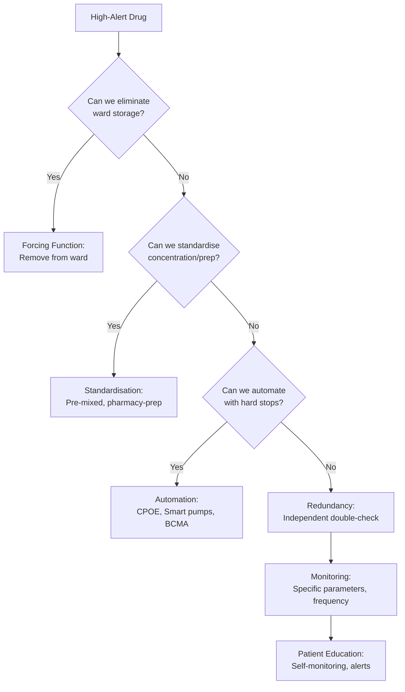
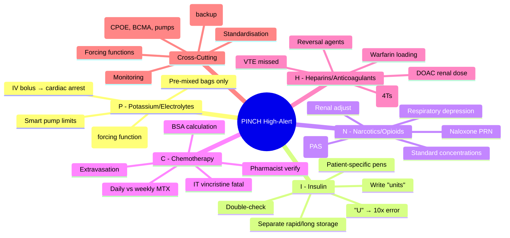

**Parent Topic:** [Medication Safety and Errors](../../Medication%20Safety%20and%20Errors.md) → [Clinical Therapeutics Overview](../../Clinical%20Therapeutics%20and%20Good%20Prescribing%20MOC.md)
**Status:** `full-fcps-mrcp-note`
**Priority:** ⭐⭐⭐ HIGHEST (FCPS/MRCP — ISMP high-alert medications, PINCH mnemonic, error prevention strategies)
**Source:** Davidson 24th Ed Ch 2; ISMP High-Alert Medication Lists; NHS Never Events; BNF; NPSA Alerts; WHO Medication Without Harm

---

## 1. 1. 🎯 Learning Objectives
- [ ] Define **PINCH** mnemonic for high-alert medications
- [ ] Identify **specific risks** for each PINCH class
- [ ] Apply **error prevention strategies** for each class (forcing functions, double-checks, monitoring)
- [ ] Know **ISMP high-alert list** beyond PINCH
- [ ] Distinguish **high-alert** (error → severe harm) vs **high-risk** (inherent toxicity)
- [ ] Answer viva: "What are PINCH drugs? How to prevent insulin errors?"

---

## 2. 2. 🧠 Core Concept: PINCH Mnemonic

| Letter | Class | Why High-Alert |
|--------|-------|----------------|
| **P** | **Potassium & other electrolytes** (concentrated KCl, K₂HPO₄, MgSO₄, NaCl 20%) | IV bolus → cardiac arrest; hyperkalaemia; confusion with flushes |
| **I** | **Insulin** (all types) | 10x overdose (U vs 0); wrong type (rapid vs long); hypoglycaemia → coma/death |
| **N** | **Narcotics/Opioids** (injectable: morphine, fentanyl, oxycodone, diamorphine) | Respiratory depression; sedation; wrong dose/route; PCA errors |
| **C** | **Chemotherapy** (cytotoxics: methotrexate, vincristine, cisplatin, etc.) | Narrow TI; daily vs weekly (MTX); intrathecal vs IV (vincristine); extravasation |
| **H** | **Heparins & Anticoagulants** (UFH, LMWH, warfarin, DOACs, fondaparinux) | Bleeding; thrombosis; HIT; monitoring complexity; reversal challenges |

> **Key Distinction:** *High-alert* = medications that bear **heightened risk of significant harm when used in error** (ISMP). *High-risk* = medications with inherent toxicity even when used correctly. PINCH drugs are BOTH.

---

## 3. 3. ️⃣ P — Potassium & Concentrated Electrolytes

### 1. Specific Risks

| Risk | Mechanism | Consequence |
|------|-----------|-------------|
| **IV bolus administration** | KCl pushed IV instead of infused | Cardiac arrest (asystole, VF) |
| **Wrong concentration** | 20% KCl vs 0.9% saline; 10% vs 1% | 10–20x overdose |
| **Confusion with flushes** | Similar vials, same storage | Inadvertent bolus |
| **Rapid infusion** | Pump error, no guardrails | Hyperkalaemia, arrhythmia |
| **Incorrect dilution** | Manual preparation error | Variable dose |

### 2. Prevention Strategies (Forcing Functions Priority)

| Strategy | Implementation |
|----------|----------------|
| **Remove from ward stock** | **Concentrated KCl, K₂HPO₄, MgSO₄, NaCl 20% — NOT on wards** (NHS Never Event) |
| **Pre-mixed bags only** | Standard concentrations: KCl 20mmol/100mL, 40mmol/100mL |
| **Pharmacy preparation** | All IV electrolytes prepared by pharmacy |
| **Smart pump drug library** | Hard limits: max rate 10mmol/h (peripheral), 20mmol/h (central) |
| **Separate storage** | If must stock: locked, separate from flushes, Tall Man labelling |
| **Double-check** | Independent double-check for any ward preparation |
| **CPOE protocols** | Order sets with standard concentrations, rate limits |

### 3. Key Monitoring
- Continuous cardiac monitoring for central KCl >20mmol/h
- Serial K⁺ levels (1–2h after infusion)
- ECG changes: peaked T, widened QRS, sine wave

---

## 4. 4. ️⃣ I — Insulin

### 1. Specific Risks

| Risk | Mechanism | Consequence |
|------|-----------|-------------|
| **"U" for units** | 10U written as 100 (U looks like 0) | 10x overdose → hypoglycaemia |
| **Wrong insulin type** | Rapid (aspart/lispro/glulisine) vs Long (glargine/detemir/degludec) vs Mixed | Hypoglycaemia (rapid given as basal) or hyperglycaemia/DKA (basal given as bolus) |
| **Wrong patient** | Multiple insulin pens on trolley | Hypoglycaemia in non-diabetic |
| **Abbreviation errors** | QD vs QID; SS vs SL; U vs 0 | Dosing frequency/route errors |
| **Pen device errors** | Dial wrong dose; air shot omitted; needle not changed | Over/under-dose, infection |
| **Concentrated insulin** | U200, U300, U500 vs U100 | 2–5x overdose if not adjusted |

### 2. Prevention Strategies

| Strategy | Implementation |
|----------|----------------|
| **Write "units" never "U"** | Mandatory in CPOE, prescriptions, charts |
| **Separate storage by type** | Rapid-acting (clear) vs Long-acting (clear) — colour-coded labels |
| **Patient-specific pens** | Label with patient name; never share pens |
| **Double-check** | Independent double-check for all IV insulin; SC insulin at transitions |
| **CPOE defaults** | Standard order sets: basal-bolus, sliding scale, DKA protocol |
| **Smart pump library** | IV insulin: max rate, concentration limits |
| **Patient self-administration** | Where competent — reduces administration errors |
| **Hypoglycaemia protocol** | Mandatory on all insulin prescriptions |

### 3. Key Monitoring
- **Blood glucose** pre-meals + bedtime (basal-bolus)
- **Hourly** for IV insulin (DKA/HHS)
- **Ketones** if BG >15mmol/L or unwell
- **Renal function** — dose adjustment for glargine/detemir in CKD

---

## 5. 5. ️⃣ N — Narcotics/Opioids (Injectable)

### 1. Specific Risks

| Risk | Mechanism | Consequence |
|------|-----------|-------------|
| **Respiratory depression** | High dose, opioid-naïve, renal impairment, elderly | Apnoea, hypoxia, death |
| **Wrong drug/strength** | Morphine 10mg/mL vs 30mg/mL; Fentanyl 50mcg/mL vs 100mcg/mL | 3–10x overdose |
| **PCA errors** | Wrong drug/concentration; demand dose/lockout; bystander activation | Overdose or inadequate analgesia |
| **Route errors** | IV instead of SC/IM; epidural instead of IV | Rapid onset → respiratory arrest |
| **Fentanyl patches** | Heat exposure; cutting patch; opioid-naïve | Fatal overdose |
| **Codeine in CYP2D6 ultra-rapid metabolisers** | → Morphine | Respiratory depression in children |

### 2. Prevention Strategies

| Strategy | Implementation |
|----------|----------------|
| **Standard concentrations** | Morphine 1mg/mL, 10mg/mL, 30mg/mL — colour-coded |
| **Fentanyl: 50mcg/mL standard** | No 100mcg/mL on general wards |
| **PCA protocols** | Pre-set protocols; pharmacist verification; patient education |
| **Naloxone availability** | Prescribed PRN with every opioid prescription |
| **Sedation scoring** | Regular sedation/respiratory rate monitoring (e.g., PAS score) |
| **Renal adjustment** | Morphine → avoid in CKD (M6G accumulation); use oxycodone/fentanyl |
| **Opioid-naïve dosing** | Start low: morphine 1–2mg IV, 5–10mg PO; titrate |
| **Avoid meperidine (pethidine)** | Neurotoxic metabolite (normeperidine) — seizures |

### 3. Key Monitoring
- **Respiratory rate** (not just SpO₂) — RR <8 = red flag
- **Sedation score** (PAS: 0=alert, 1=drowsy, 2=frequently drowsy, 3=unresponsive)
- **Pain score** — reassess 30min post-IV, 1h post-PO
- **Bowel function** — prophylaxis for constipation

---

## 6. 6. ️⃣ C — Chemotherapy (Cytotoxics)

### 1. Specific Risks

| Risk | Drug | Consequence |
|------|------|-------------|
| **Daily vs weekly methotrexate** | Methotrexate (non-oncology: RA, psoriasis) | Pancytopenia, mucositis, renal/hepatic failure, death |
| **Intrathecal vs IV vincristine** | Vincristine (and vinblastine) | **Fatal**: ascending paralysis, encephalopathy |
| **Extravasation** | Vesicants: doxorubicin, vincristine, vinblastine, cisplatin | Tissue necrosis, amputation |
| **Wrong protocol/day** | Cyclophosphamide, cisplatin, 5-FU regimens | Overdose toxicity or underdose treatment failure |
| **BSA calculation error** | All cytotoxics (mg/m²) | Dose error 10–20% |
| **Renal/hepatic adjustment missed** | Carboplatin (Calvert), methotrexate, cisplatin | Accumulation toxicity |

### 2. Prevention Strategies (Highest Level)

| Strategy | Implementation |
|----------|----------------|
| **Methotrexate weekly protocol** | **"WEEKLY DOSE" bold on prescription**; patient card; pharmacy dispensing weekly blister |
| **Intrathecal separation** | **Only trained staff**; separate yellow syringes; "FOR INTRATHECAL USE ONLY"; pharmacy prepares separately |
| **Extravasation protocol** | Antidotes at bedside (dexrazoxane, DMSO, hyaluronidase); immediate stop, aspirate, elevate |
| **BSA verification** | Independent double-check BSA; CPOE calculator; protocol sheets |
| **Protocol-specific ordering** | CPOE regimen selection (e.g., CHOP, FOLFOX, R-CHOP) — auto-calculates doses |
| **Pharmacist verification** | Every chemotherapy order verified by oncology pharmacist |
| **Patient education** | Oral chemo: specific counselling, diary, 24h helpline |

### 3. Key Monitoring
- **FBC, U&E, LFT** before each cycle
- **Renal function** for carboplatin (Calvert), methotrexate, cisplatin
- **Neuropathy** (vincristine, cisplatin, paclitaxel)
- **Cardiac** (anthracyclines — LVEF baseline, cumulative dose)
- **Pulmonary** (bleomycin — DLCO baseline)

---

## 7. 7. ️⃣ H — Heparins & Anticoagulants

### 1. Specific Risks by Class

| Class | Key Risks |
|-------|-----------|
| **UFH (IV)** | Bolus errors; infusion rate errors; HIT (Type II); protamine reversal dosing; monitoring aPTT/anti-Xa |
| **LMWH (SC)** | Weight-based dosing; renal adjustment (CrCl<30); HIT (lower risk); monitoring anti-Xa (if needed); spine/epidural timing |
| **Warfarin** | Narrow TI; INR monitoring; drug/food interactions; bridging; loading doses; genetic variability (CYP2C9, VKORC1) |
| **DOACs** | Renal adjustment (CrCl thresholds); no routine monitoring (but when needed: anti-Xa calibrated); reversal agents (idarucizumab, andexanet); adherence critical (short half-life) |
| **Fondaparinux** | Renal contraindication (CrCl<20); no reversal; HIT risk (low); weight extremes |

### 2. High-Risk Scenarios

| Scenario | Risk | Prevention |
|----------|------|------------|
| **VTE prophylaxis missed** | PE/DVT | CPOE default on admission; nurse prompt |
| **Therapeutic anticoagulation held** | Thrombosis (AF, VTE, valve) | Clear hold/restart criteria; pharmacy review |
| **Warfarin loading dose** | Over-anticoagulation | Protocol: 5mg/3mg/1mg based on age/comorbidities; INR day 3 |
| **DOAC in renal impairment** | Accumulation → bleed | CrCl check at prescription; dose adjustment table in CPOE |
| **HIT missed** | Thrombosis, limb loss, death | 4Ts score; daily platelet count days 5–14; stop heparin if suspected |
| **Neuraxial block on anticoagulant** | Epidural haematoma | Timing guidelines: LMWH 12h/24h; UFH 4–6h; warfarin INR<1.5; DOAC 24–48h |

### 3. Prevention Strategies

| Strategy | Implementation |
|----------|----------------|
| **VTE risk assessment** | Mandatory on admission (NHS: risk assessment tool) |
| **CPOE protocols** | Weight-based LMWH; renal-adjusted DOAC; warfarin loading protocol |
| **Pharmacist anticoagulation service** | Warfarin dosing, DOAC review, HIT monitoring, bridging |
| **INR/anti-Xa monitoring** | Point-of-care INR; lab anti-Xa for LMWH/DOAC if indicated |
| **Patient-held records** | Warfarin yellow book; DOAC alert card |
| **Reversal protocols** | Protamine (UFH), vitamin K/PCC (warfarin), idarucizumab (dabigatran), andexanet (apixaban/rivaroxaban) |

---

## 8. 8. ️⃣ ISMP Additional High-Alert Classes (Beyond PINCH)

| Class | Examples | Key Risk |
|-------|----------|----------|
| **Neuromuscular blockers** | Rocuronium, vecuronium, atracurium, suxamethonium | Respiratory arrest if not ventilated |
| **Adrenergic agonists/antagonists** | Noradrenaline, adrenaline, dobutamine, labetalol, GTN | Haemodynamic instability |
| **Anaesthetic agents** | Propofol, thiopental, sevoflurane | Unconsciousness, apnoea |
| **Parenteral nutrition** | Hypertonic glucose, lipid emulsions | Line sepsis, metabolic complications |
| **Sodium chloride >0.9%** | 20%, 30% NaCl | Hypernatraemia, osmotic demyelination |
| **Magnesium sulfate** | Obstetric (pre-eclampsia) | Respiratory depression, cardiac arrest |
| **Oxytocin** | Postpartum haemorrhage | Uterine rupture, water intoxication |
| **Epidural/intrathecal meds** | Bupivacaine, fentanyl, diamorphine | Wrong route → catastrophe |

---

## 9. 9. ️⃣ Unified Prevention Framework for ALL High-Alert Drugs

### 1. Independent Double-Check — When Mandatory

| Drug Class | Verification Points |
|------------|---------------------|
| **Insulin (IV/SC)** | Drug, dose, type, patient, BG, calculation |
| **Heparins/anticoagulants** | Drug, dose, weight, renal function, indication, monitoring plan |
| **Chemotherapy** | Protocol, dose, BSA, day, patient, consent, pre-meds |
| **Opioids (IV/PCA)** | Drug, concentration, dose, patient, lockout, limits |
| **KCl/electrolytes** | Drug, concentration, volume, rate, line, monitoring |
| **NM blockers** | Drug, dose, patient, ventilation confirmed |

---

## 10. 10. ⚡ FCPS/MRCP High-Yield Summary

| PINCH | Drug | Top 3 Risks | Top 3 Preventions |
|-------|------|-------------|-------------------|
| **P** | Potassium/concentrated electrolytes | IV bolus → cardiac arrest; wrong conc; confusion with flush | **Remove from wards**; pre-mixed bags only; smart pump limits |
| **I** | Insulin | "U" → 10x; wrong type (rapid vs long); wrong patient | Write **"units"**; separate storage by type; patient-specific pens |
| **N** | Narcotics/opioids (injectable) | Respiratory depression; wrong strength; PCA errors | Standard concentrations; naloxone PRN; sedation scoring |
| **C** | Chemotherapy | Daily MTX (vs weekly); IT vincristine; extravasation | **Weekly MTX protocol**; IT separate/yellow syringes; extravasation kit |
| **H** | Heparins/anticoagulants | VTE missed; HIT; DOAC renal dose; bleed | VTE risk assess on admission; pharmacist anticoag service; CrCl check |

> **Viva Key:** *PINCH drugs share: narrow therapeutic index, high error consequence, need for forcing functions/standardisation, mandatory monitoring, independent double-checks.*

---

## 11. 11. 🎤 Viva Questions (Expected Answers)

| # | Question | Expected Answer |
|---|----------|-----------------|
| 1 | What does PINCH stand for? | **P**otassium/electrolytes, **I**nsulin, **N**arcotics/opioids, **C**hemotherapy, **H**eparins/anticoagulants |
| 2 | Why is concentrated KCl a Never Event on wards? | **IV bolus → cardiac arrest**. Forcing function: remove from wards, only pre-mixed bags, pharmacy preparation. |
| 3 | How to prevent insulin "U" errors? | **Write "units" never "U"**; CPOE enforce; separate rapid/long-acting storage; patient-specific pens; double-check. |
| 4 | Methotrexate for rheumatoid arthritis — key safety rule? | **WEEKLY DOSE ONLY**. Protocol: bold "WEEKLY" on Rx, patient card, pharmacy weekly dispensing, folic acid 5mg weekly. |
| 5 | Vincristine intrathecal error — why fatal? | **Ascending paralysis, encephalopathy, death**. Prevention: separate yellow syringes, "FOR INTRATHECAL USE ONLY", trained staff only, pharmacy prepares separately. |
| 6 | LMWH in renal impairment (CrCl<30)? | **Dose adjust or switch to UFH**. Enoxaparin 1mg/kg → 1mg/kg daily (not BD); monitor anti-Xa. Avoid fondaparinux if CrCl<20. |
| 7 | Warfarin loading dose protocol? | **Age/comorbidity based**: <60y no comorbidity 5mg OD; >60y or comorbidity 3mg OD; fragile 1mg OD. INR day 3, then adjust. |
| 8 | DOAC reversal agents? | **Dabigatran → idarucizumab**; **Apixaban/rivaroxaban → andexanet alfa**; **All → PCC (4-factor)** if specific unavailable. |
| 9 | HIT — diagnosis and immediate action? | **4Ts score** (Thrombocytopenia, Timing, Thrombosis, oTher causes). **STOP all heparin** (UFH/LMWH) immediately; start non-heparin anticoag (argatroban, fondaparinux, DOAC); confirm PF4 ELISA/SRA. |
| 10 | Independent double-check — when mandatory for PINCH? | IV insulin, therapeutic anticoagulation, chemotherapy, IV opioids/PCA, IV KCl/electrolytes, NM blockers. Verify: drug, dose, patient, calculation, monitoring. |

---

## 12. 12. 🧩 Confusions & Mnemonics

| Confusion | Clarification |
|-----------|---------------|
| **"High-alert = high-risk"** | **Different.** High-alert = error causes severe harm (PINCH). High-risk = inherent toxicity (e.g., warfarin bleed at therapeutic dose). Many drugs are both. |
| **"Double-check is enough for PINCH"** | **No.** Double-check = human-dependent, confirmation bias. **Forcing functions, standardisation, automation** are more effective. Double-check is backup. |
| **"All chemotherapy is PINCH"** | **Yes, but** non-oncology methotrexate (weekly) is special high-risk for daily dosing error. Intrathecal vincristine is unique wrong-route risk. |
| **"DOACs don't need monitoring"** | **Routine monitoring not needed**, but **renal function (CrCl) mandatory at prescription and review**. Anti-Xa calibrated assay if bleed/emergency surgery. |
| **"HIT only with UFH"** | **HIT occurs with LMWH too** (lower incidence ~0.1–1% vs 1–5% UFH). Fondaparinux very low risk. Stop ALL heparins if HIT suspected. |
| **"Naloxone reverses all opioid effects"** | **Naloxone reverses respiratory depression/sedation**. Does NOT reverse constipation, ileus, urinary retention. Duration < opioid → re-sedation risk. |

> **Mnemonic: PINCH SAFETY**  
> **P**otassium: **Remove from wards**; pre-mixed bags; smart pump limits; cardiac monitoring  
> **I**nsulin: **Write "units"**; separate rapid/long storage; patient pens; double-check; hypoglycaemia protocol  
> **N**arcotics: **Standard concentrations**; naloxone PRN; sedation scoring (PAS); renal adjust (avoid morphine CKD)  
> **C**hemo: **Weekly MTX protocol**; **IT vincristine separate/yellow**; extravasation kit; BSA double-check; pharmacist verify  
> **H**eparins: **VTE risk assess admission**; weight-based LMWH; CrCl for DOAC; **4Ts for HIT**; reversal protocols  
> **S**tandardise: Concentrations, protocols, order sets, labelling (Tall Man)  
> **A**utomate: CPOE hard stops, smart pumps, BCMA, ADC  
> **F**orcing functions: No KCl on wards, NM blockers theatre only, IT chemo separate, oral/IV incompatible  
> **E**ducation: Patient self-management, alert cards, 24h helpline for oral chemo  
> **T**raining: Competency for high-alert drugs; simulation for emergencies (HIT, extravasation, hypoglycaemia)  
> **Y**ou monitor: Specific parameters (K⁺, BG, RR/sedation, FBC/INR/anti-Xa, platelets) at defined frequencies

---

## 13. 13. 🗺️ Mind Map

---

## 14. 14. 📅 Spaced Repetition Tracker

| Review | Date | Score (0–5) | Notes |
|--------|------|-------------|-------|
| Day 1 | | | |
| Day 3 | | | |
| Day 7 | | | |
| Day 14 | | | |
| Day 30 | | | |
| Day 90 | | | |

---

## 15. 15. 📝 Self-Test Scorecard

| Section | Max | Score | % |
|---------|-----|-------|---|
| PINCH mnemonic & rationale | 3 | | |
| Potassium/electrolytes | 2 | | |
| Insulin | 2 | | |
| Narcotics/opioids | 2 | | |
| Chemotherapy | 3 | | |
| Heparins/anticoagulants | 3 | | |
| ISMP additional classes | 2 | | |
| Prevention hierarchy | 3 | | |
| **Total** | **20** | | |

---

## 16. 16. 💬 Exam Answer Modes

| Format | Prompt | Key Points |
|--------|--------|------------|
| **Long Essay** | "Describe the PINCH high-alert medications and system-level strategies to prevent errors." | PINCH definition, each class risks, forcing functions, standardisation, automation, double-checks, monitoring, Just Culture |
| **Short Note** | "Methotrexate weekly dosing error prevention." | Weekly protocol, bold labelling, patient card, pharmacy dispensing, folic acid, Never Event |
| **Viva** | "Patient on warfarin, INR 8, no bleed. Management and prevention?" | Hold warfarin, vit K 1–2mg PO, restart at lower dose when INR therapeutic. Prevention: pharmacist anticoag service, loading protocol, INR monitoring, patient education. |
| **Ward Round** | "Nurse draws up morphine 30mg/mL instead of 10mg/mL for IV. Caught before admin." | **Near miss (Category B)**. System fix: standardise to 1mg/mL and 10mg/mL only; remove 30mg/mL from ward; colour-coded labels; barcode scanning. |
| **Last-Night** | "PINCH: 5 classes. K: remove wards. Insulin: write units. Narc: naloxone+scaling. Chemo: weekly MTX, IT separate. Heparin: VTE assess, 4Ts, DOAC renal." | PINCH. K: forcing function. I: "units". N: naloxone/PAS. C: weekly MTX, yellow IT. H: VTE assess, 4Ts, CrCl DOAC. |

---

## 17. 17. 📌 Summary
- **PINCH** = Potassium/electrolytes, Insulin, Narcotics/opioids, Chemotherapy, Heparins/anticoagulants
- **High-alert** = error → severe harm; **High-risk** = inherent toxicity; PINCH drugs are both
- **Hierarchy of prevention**: Forcing functions > Automation > Standardisation > Double-checks > Rules > Education > Vigilance
- **P**: Remove concentrated electrolytes from wards; pre-mixed bags; smart pumps
- **I**: Write "units"; separate rapid/long storage; patient-specific pens; hypoglycaemia protocol
- **N**: Standard concentrations; naloxone PRN; sedation scoring; renal adjustment
- **C**: Weekly MTX protocol; IT vincristine separate/yellow syringes; extravasation kit; pharmacist verification
- **H**: VTE risk assessment on admission; weight-based LMWH; CrCl for DOACs; 4Ts for HIT; reversal protocols
- **Independent double-check** mandatory for all PINCH: verify drug, dose, patient, calculation, monitoring plan

---

## 18. 18. ❓ MCQs (10)

1. **PINCH mnemonic — "C" stands for:**  
   A. Corticosteroids  B. **Chemotherapy**  C. Calcium  D. Cardiovascular drugs  
   *Answer: B. Chemotherapy (cytotoxics).*

2. **Most effective prevention for concentrated KCl errors:**  
   A. Double-check  B. Education  C. **Remove from ward stock**  D. Poster reminders  
   *Answer: C. Forcing function — make error impossible by not stocking on wards.*

3. **Insulin prescription — "10U" misread as:**  
   A. 1 unit  B. **100 units**  C. 10 units  D. 1000 units  
   *Answer: B. "U" looks like "0" → 10U → 100. Always write "units".*

4. **Methotrexate for rheumatoid arthritis — fatal error:**  
   A. Wrong day  B. **Daily instead of weekly**  C. Wrong route  D. Drug interaction  
   *Answer: B. Daily dosing → pancytopenia, mucositis, death. Weekly protocol mandatory.*

5. **Vincristine given intrathecally — outcome:**  
   A. Myelosuppression  B. **Ascending paralysis, encephalopathy, death**  C. Neuropathy  D. SIADH  
   *Answer: B. Vincristine is microtubule inhibitor → destroys CNS myelin → fatal ascending paralysis.*

6. **LMWH dose adjustment in renal impairment (CrCl<30):**  
   A. No change  B. **Reduce dose / switch to UFH**  C. Increase dose  D. Monitor anti-Xa only  
   *Answer: B. Enoxaparin 1mg/kg BD → 1mg/kg OD if CrCl<30; or switch to UFH infusion.*

7. **HIT — immediate action on suspicion:**  
   A. Reduce heparin dose  B. **Stop ALL heparins (UFH + LMWH); start non-heparin anticoagulant**  C. Check platelets only  D. Continue, monitor  
   *Answer: B. Stop all heparin immediately; start argatroban/fondaparinux/DOAC; confirm with 4Ts, PF4 ELISA.*

8. **DOAC reversal — dabigatran specific agent:**  
   A. Andexanet alfa  B. **Idarucizumab**  C. PCC  D. Vitamin K  
   *Answer: B. Idarucizumab = anti-dabigatran antibody. Andexanet = anti-Xa (apixaban/rivaroxaban).*

9. **Independent double-check — limitation:**  
   A. Too fast  B. **Confirmation bias; not truly independent; workflow disruption**  C. Requires doctor  D. Not needed  
   *Answer: B. Human-dependent; prone to confirmation bias; disrupts workflow. Not substitute for system redesign.*

10. **Which is NOT a PINCH drug?**  
    A. Insulin  B. Heparin  C. **Digoxin**  D. Vincristine  
    *Answer: C. Digoxin = high-risk (narrow TI) but not in PINCH mnemonic. TDM drug.*

---

## 19. 19. 📋 SBAs (10)

1. **Foundation doctor writes "insulin 10U" on drug chart. Nurse reads 100 units, administers. Patient hypoglycaemic coma. Primary prevention?**  
   A. Double-check policy  B. **CPOE enforces "units" not "U"**  C. Nurse education  D. Patient education  
   *Answer: B. Forcing function at source (CPOE) prevents abbreviation error entirely.*

2. **72F on enoxaparin 1mg/kg BD for VTE treatment. CrCl 25 mL/min. Correct adjustment?**  
   A. Continue same dose  B. **Enoxaparin 1mg/kg OD**  C. Switch to warfarin  D. Reduce to 0.5mg/kg BD  
   *Answer: B. CrCl<30: enoxaparin 1mg/kg once daily (or UFH infusion).*

3. **Patient on weekly methotrexate 15mg for RA. GP prescribes daily by mistake. Pharmacist dispenses 28 tablets. Prevention failed at:**  
   A. Prescribing  B. Dispensing  C. **Both prescribing AND dispensing**  D. Administration  
   *Answer: C. System failure: prescriber error + pharmacist failed weekly protocol check (Never Event).*

4. **Epidural haematoma risk — which anticoagulant timing is CORRECT?**  
   A. LMWH prophylactic: 4h before  B. **LMWH therapeutic: 24h before**  C. Warfarin: INR<2.0  D. DOAC: 12h before  
   *Answer: B. LMWH therapeutic (BD) = 24h; prophylactic (OD) = 12h. Warfarin INR<1.5. DOAC 24–48h.*

5. **Neuromuscular blocker on general ward — system response?**  
   A. Double-check before admin  B. **Remove from ward stock (forcing function) — only in theatre/ICU**  C. Education  D. Label "PARALYSIS RISK"  
   *Answer: B. Never Event prevention: NM blockers not on wards. Only where ventilation immediately available.*

---

## 20. 20. 🔑 Answer Keys
| MCQs | SBAs |
|------|------|
| 1-B, 2-C, 3-B, 4-B, 5-B, 6-B, 7-B, 8-B, 9-B, 10-C | 1-B, 2-B, 3-C, 4-B, 5-B |

---

## 21. 21. 🔗 Cross-Links
- [[Medication Safety and Errors/Error Types and Classification]] — Error taxonomy, NCC MERP for PINCH errors
- [[Medication Safety and Errors/Root Causes and Systems Approach]] — Swiss cheese, forcing functions hierarchy
- [[Therapeutic Drug Monitoring]] — TDM for PINCH (digoxin, lithium, anticonvulsants, immunosuppressants)
- [[Special Populations/Renal Prescribing]] — Renal dosing for PINCH (LMWH, DOACs, morphine, chemotherapy)
- [[Special Populations/Elderly Prescribing]] — STOPP/START for PINCH in elderly
- [[Clinical Context/Perioperative Prescribing]] — VTE prophylaxis, anticoagulation bridging, NM blockers
- [[Polypharmacy and Deprescribing/Assessment Tools]] — STOPP criteria for PINCH in polypharmacy

## PasTest Scenario SBAs (Clinical Vignettes)

> **Auto-generated PasTest/Mediscope-style scenario SBAs** grounded in the authored source. Each scenario tests a real clinical fact (triad, specific sign, contraindication, trial, first-line Rx) extracted from the topic. *Source: Ch 2: Clinical Therapeutics — PINCH High-Risk Drugs*

**Q1.** What is the most appropriate first-line therapy for PINCH High-Risk Drugs?

  - **A.** Intrathecal separation + Only trained staff
  - **B.** An advanced/surgical therapy reserved for refractory disease
  - **C.** Symptomatic treatment only, no disease-modifying therapy
  - **D.** Empiric broad-spectrum therapy without specific indication

  > **Answer: A** — Intrathecal separation + Only trained staff
  >
  > *Source:* **Intrathecal separation**   **Only trained staff**; separate yellow syringes; "FOR INTRATHECAL USE ONLY"; pharmacy prepares separately

