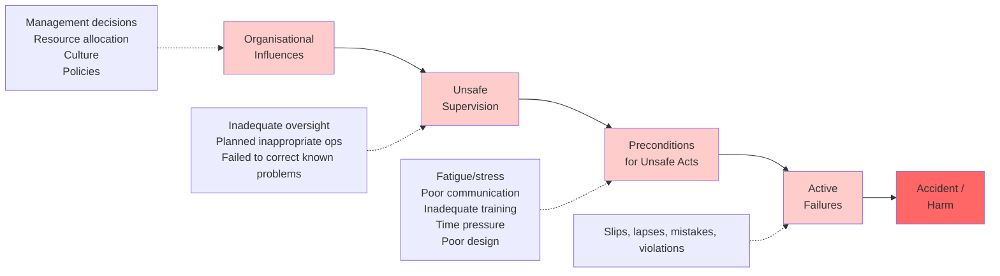
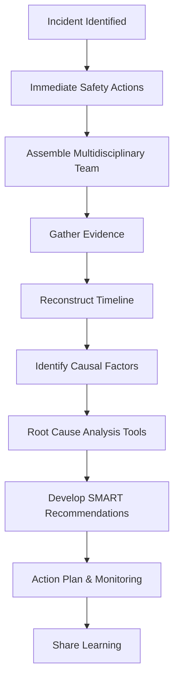
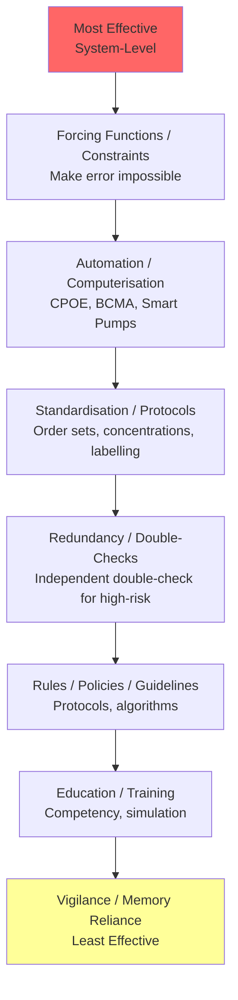
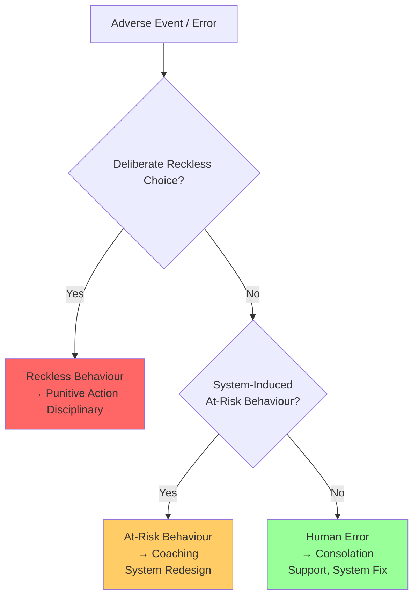
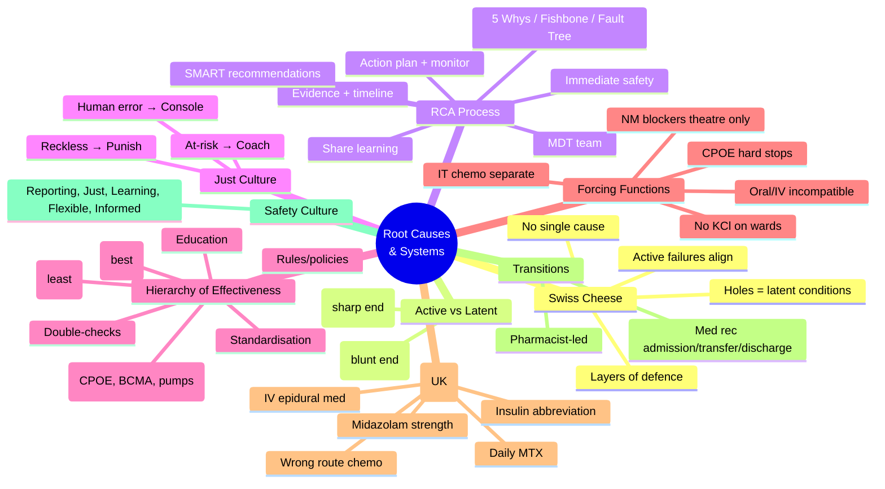

**Parent Topic:** [Medication Safety and Errors](../../Medication%20Safety%20and%20Errors.md) → [Clinical Therapeutics Overview](../../Clinical%20Therapeutics%20and%20Good%20Prescribing%20MOC.md)
**Status:** `full-fcps-mrcp-note`
**Priority:** ⭐⭐⭐ HIGHEST (FCPS/MRCP — Swiss cheese model, human factors, RCA, Just Culture, safety interventions)
**Source:** Davidson 24th Ed Ch 2; Reason's Swiss Cheese Model; WHO Patient Safety Curriculum; NHS Patient Safety Strategy; NPSA Root Cause Analysis; HFE (Human Factors Engineering); ISMP Medication Safety Self-Assessment

---

## 1. 1. 🎯 Learning Objectives
- [ ] Explain **Reason's Swiss Cheese Model** of accident causation
- [ ] Apply **Human Factors Engineering (HFE)** principles: latent conditions vs active failures
- [ ] Conduct **Root Cause Analysis (RCA)** using 5 Whys, Fishbone (Ishikawa), Fault Tree
- [ ] Distinguish **active errors** (sharp end) vs **latent conditions** (blunt end)
- [ ] Apply **Just Culture** algorithm: human error → console; at-risk behaviour → coach; reckless → punish
- [ ] Identify **system-level interventions** (forcing functions, standardisation, simplification, automation)
- [ ] Know **Never Events** (UK) and **Sentinel Events** (US) — medication-related
- [ ] Answer viva: "Why do medication errors happen?" and "How to investigate a serious incident?"

---

## 2. 2. 🧠 Core Concept: Swiss Cheese Model (James Reason)

### 1. The Model

### 2. Key Principles

| Concept | Description |
|---------|-------------|
| **Layers of defence** | Multiple barriers (protocols, checks, training, technology) — each has holes |
| **Holes = latent conditions** | System weaknesses that exist before the event (staffing, design, culture) |
| **Active failures** | Unsafe acts by frontline staff (slips, lapses, mistakes, violations) — "sharp end" |
| **Trajectory of accident** | Holes align momentarily → defences breached → harm |
| **Holes dynamic** | Open, close, shift — influenced by workload, fatigue, interruptions |
| **No single cause** | Accidents = combination of active failures + latent conditions |

> **Viva Key:** *"Errors are not caused by bad people, but by bad systems that allow good people to make mistakes. The Swiss Cheese Model shows how latent conditions (holes) align with active failures to cause harm."*

---

## 3. 3. ️⃣ Active Failures vs Latent Conditions

| Dimension | Active Failures (Sharp End) | Latent Conditions (Blunt End) |
|-----------|----------------------------|-------------------------------|
| **Timing** | Immediately before accident | Exist long before (days–years) |
| **Who** | Frontline staff (doctors, nurses, pharmacists) | Designers, managers, policy-makers, procurement |
| **Type** | Slips, lapses, mistakes, violations | Poor design, inadequate staffing, bad culture, missing protocols |
| **Visibility** | Obvious at time of event | Hidden until accident occurs |
| **Examples** | Wrong dose selected, drug omitted, wrong patient | Look-alike packaging, no barcode scanning, fatigue from 12h shifts, ambiguous protocol |
| **Intervention** | Training, reminders, double-checks | **System redesign**: forcing functions, standardisation, automation, culture change |

### 1. Classification of Active Failures

| Type | Definition | Example | Countermeasure |
|------|------------|---------|----------------|
| **Slip** | Action not as intended (attentional) | Intended 5mg, typed 50mg | Forcing functions, CPOE limits, barcode |
| **Lapse** | Memory failure (omission) | Forgot to sign VTE prophylaxis | Checklists, CPOE defaults, prompts |
| **Mistake** | Wrong plan (knowledge/rule) | Prescribed contraindicated drug | Decision support, education, protocols |
| **Violation** | Deliberate deviation | Gave IV push instead of infusion | Culture change, simplify process, address root cause |

---

## 4. 4. ️⃣ Root Cause Analysis (RCA) Methodology

### 1. When to Do RCA
- **Never Events** (UK) / **Sentinel Events** (US) — mandatory
- **Serious Incidents** (moderate/severe harm, death)
- **Recurring near misses** (pattern)
- **Regulatory requirement** (CQC, MHRA, NHS England)

### 2. RCA Steps (NHS PSII Framework)

### 3. RCA Tools

| Tool | Description | Best For |
|------|-------------|----------|
| **5 Whys** | Iterative questioning to reach root cause | Simple, linear causal chains |
| **Fishbone (Ishikawa)** | Categories: People, Process, Equipment, Environment, Management, Materials | Complex, multi-factorial |
| **Fault Tree Analysis** | Top-down: undesired event → logic gates (AND/OR) → basic events | Technical/system failures |
| **Barrier Analysis** | Identifies failed/barriers (Swiss cheese holes) | Aligns with Swiss cheese model |
| **Change Analysis** | Compare "what should happen" vs "what happened" | Procedural deviations |

### 4. 5 Whys Example: Patient given IV potassium chloride bolus → cardiac arrest

| Why? | Answer |
|------|--------|
| 1. Why cardiac arrest? | IV KCl bolus → hyperkalaemia |
| 2. Why IV KCl bolus given? | Nurse drew up KCl from vial, pushed IV |
| 3. Why nurse pushed IV? | Thought it was flush/normal saline; vial looked similar |
| 4. Why vial looked similar? | **Standardised grey cap for all concentrated electrolytes**; no distinct labelling |
| 5. Why no distinct labelling/forcing function? | **Procurement decision based on cost; no safety review; no barcode scanning at bedside** |
| **Root Cause** | **System failure: Concentrated KCl available on ward; no forcing function (separate storage, barcode, pre-mixed bags only); procurement without safety assessment** |

---

## 5. 5. ️⃣ Human Factors Engineering (HFE) Principles

### 1. Core Principles

| Principle | Application in Medication Safety |
|-----------|----------------------------------|
| **Design for human limitations** | Limit memory load (checklists, protocols); reduce cognitive load (standardised order sets) |
| **Standardisation** | Concentrations, labelling, dosing units, protocols, equipment |
| **Simplification** | Reduce steps, eliminate unnecessary complexity, fewer drug strengths |
| **Forcing Functions / Constraints** | Make error impossible: KCl not stocked on wards; IV-only ports; scanfail = stop |
| **Automation / Technology** | CPOE with decision support, barcode medication administration (BCMA), smart pumps |
| **Effective Communication** | SBAR, read-back, closed-loop, structured handover |
| **Fatigue Management** | Duty hours, break schedules, workload monitoring |
| **Environment Design** | Lighting, noise reduction, interruption-free zones (medication safety huddles) |
| **Teamwork / Culture** | Psychological safety, speaking up, briefings/debriefings |

### 2. Hierarchy of Effectiveness (ISMP)

> **Key Insight:** *Education and vigilance are necessary but NOT sufficient. System redesign (forcing functions, automation) is most effective.*

---

## 6. 6. ️⃣ Just Culture (Sidney Dekker / David Marx)

### 1. The Algorithm

### 2. Three Behaviours

| Behaviour | Definition | Response | Example |
|-----------|------------|----------|---------|
| **Human Error** | Inadvertent action (slip, lapse, mistake) | **Console** — support, fix system | Nurse selects wrong drug from alphabetical list (slip) |
| **At-Risk Behaviour** | Drift from protocol, risk not recognised | **Coach** — discuss, redesign system | Nurse regularly skips barcode scan to save time |
| **Reckless Behaviour** | Conscious disregard of substantial risk | **Punish** — disciplinary | Nurse diverts opioids for personal use |

> **Viva Key:** *"Just Culture distinguishes between human error (console), at-risk behaviour (coach), and reckless behaviour (punish). Most errors are human error or at-risk behaviour driven by system flaws. Blaming individuals discourages reporting and prevents learning."*

---

## 7. 7. ️⃣ Medication-Related Never Events (UK) / Sentinel Events (US)

### 1. UK Never Events (NHS England) — Medication Related

| Never Event | Description |
|-------------|-------------|
| **1. Wrong route administration of chemotherapy** | Intrathecal instead of IV, or IV instead of intrathecal |
| **2. Wrong route administration of oral/enteral medication** | IV instead of PO/NG; epidural instead of IV |
| **3. Intravenous administration of epidural medication** | Bupivacaine IV → cardiovascular collapse |
| **4. Overdose of insulin due to abbreviations/incorrect device** | "U" for units; wrong insulin pen |
| **5. Overdose of methotrexate for non-cancer treatment** | Daily instead of weekly dosing |
| **6. Administration of medication by wrong route** | General category (e.g., IV KCl bolus) |
| **7. Failure to prescribe/administer VTE prophylaxis** | In high-risk patient (if policy exists) |
| **8. Mis-selection of high-strength midazolam** | 10mg/mL instead of 1mg/mL or 2mg/mL |
| **9. Retained foreign object post-procedure** | Guidewire, swab (not strictly medication but related) |

### 2. US Sentinel Events (Joint Commission) — Medication Related

| Sentinel Event | Description |
|----------------|-------------|
| **Patient death/serious injury from medication error** | Wrong drug, dose, route, patient |
| **Heparin overdose/underdose** | Protamine reversal needed; HIT; thrombosis |
| **Insulin overdose** | Hypoglycaemic coma, death |
| **Chemotherapy overdose** | Wrong protocol, dosing error |
| **Opioid overdose** | Respiratory depression, death |
| **Anticoagulant error** | Warfarin/DOAC — bleed/thrombosis |
| **Neuromuscular blocker without ventilation** | Awareness, anoxia |

---

## 8. 8. ️⃣ System-Level Interventions (High-Impact)

### 1. Forcing Functions / Constraints (Most Effective)

| Intervention | Example |
|--------------|---------|
| **Remove concentrated electrolytes from wards** | KCl, K₂HPO₄, MgSO₄, NaCl 20% — only pre-mixed bags or pharmacy-prepared |
| **Neuromuscular blockers not on wards** | Only in theatre/ICU with ventilation |
| **Intrathecal chemotherapy only by trained staff** | Separate yellow-labelled syringes; "FOR INTRATHECAL USE ONLY" |
| **Oral syringes incompatible with IV lines** | ENFit connectors for enteral; Luer-lock for IV |
| **Maximum dose limits in CPOE/smart pumps** | Morphine 30mg max single dose; insulin 50 units max |
| **Default dosing in CPOE** | VTE prophylaxis auto-selected on admission |
| **Hard stops for allergies/contraindications** | Cannot override without consultant authorisation |

### 2. Automation & Technology

| Technology | Error Prevented |
|------------|-----------------|
| **CPOE (Computerised Provider Order Entry)** | Illegible writing, dose errors, allergy alerts, interaction alerts, dosing guidance |
| **BCMA (Barcode Medication Administration)** | Wrong patient, wrong drug, wrong dose, wrong time, wrong route |
| **Smart Infusion Pumps** | Rate errors, bolus errors, drug library with dose limits |
| **Automated Dispensing Cabinets (ADC)** | Wrong drug selection, inventory control, profile-based dispensing |
| **Electronic Medication Reconciliation** | Omissions, duplications, discrepancies at transitions |

### 3. Standardisation

| Standardisation | Impact |
|-----------------|--------|
| **Standard concentrations** | e.g., Noradrenaline 4mg/50mL = 80mcg/mL nationally; no calculation needed |
| **Tall Man Lettering** | LASA differentiation on labels, screens, shelves |
| **Standard order sets / pathways** | Sepsis bundle, VTE prophylaxis, insulin sliding scale, NIV protocols |
| **Unit-of-use packaging** | Single-dose vials, pre-filled syringes — no drawing up |
| **Weight-based dosing protocols** | Paediatric/renal/hepatic — embedded in CPOE |

### 4. Independent Double-Check (Redundancy)

| When Required | Process |
|---------------|---------|
| **High-risk drugs (PINCH)** | Two qualified professionals independently verify drug, dose, patient, calculation |
| **Chemotherapy** | Two nurses verify protocol, dose, patient, BSA, consent |
| **Insulin** | Two nurses verify type, dose, patient, blood glucose |
| **Opioids (injectable)** | Two nurses verify drug, dose, patient |
| **Paediatric IV meds** | Two nurses verify calculation, dilution, rate |
| **Limitation** | **Not a substitute for system redesign** — human-dependent, prone to confirmation bias, workflow disruption |

---

## 9. 9. ️⃣ High-Risk Situations & Specific Interventions

### 1. Transitions of Care (Admission, Transfer, Discharge)

| Risk | Intervention |
|------|--------------|
| **Medication discrepancies 30–70%** | **Medication reconciliation** by pharmacist/technician within 24h admission |
| **Omissions** | Structured med rec form; compare ≥2 sources (patient, GP, pharmacy, summary care record) |
| **Duplications** | Automated comparison in EMR |
| **Discharge errors** | Pharmacist discharge review; patient counselling; GP summary within 24h |

### 2. High-Alert Medicines (PINCH) — See [PINCH High-Risk Drugs](../Medication%20Safety%20and%20Errors/PINCH%20High-Risk%20Drugs.md)

### 3. Paediatrics / Neonates

| Risk | Intervention |
|------|--------------|
| **Weight-based calculation errors** | CPOE with mandatory weight; BSA calculator; standard concentrations |
| **Dilution errors** | Ready-to-use preparations; pharmacy-prepared IVs |
| **Off-label/unlicensed** | Formulary with age-specific dosing; specialist pharmacy |
| **Neonatal renal/hepatic immaturity** | Age-specific protocols (e.g., gentamicin extended interval) |

### 4. Look-Alike Sound-Alike (LASA) — See [Error Types & Classification](../Medication%20Safety%20and%20Errors/Error%20Types%20and%20Classification.md)

---

## 10. 10. ️⃣ Safety Culture & Reporting

### 1. Elements of Safety Culture

| Element | Description |
|---------|-------------|
| **Reporting Culture** | Easy, confidential, non-punitive reporting; feedback to reporters |
| **Just Culture** | Fair distinction: human error (console), at-risk (coach), reckless (punish) |
| **Learning Culture** | Analyse incidents, share lessons, implement changes, measure impact |
| **Flexible Culture** | Flatten hierarchy during crisis; empower frontline to stop unsafe acts |
| **Informed Culture** | Data-driven; safety metrics visible; leadership walkabouts |

### 2. Reporting Barriers & Enablers

| Barrier | Enabler |
|---------|---------|
| Fear of blame/punishment | Just Culture policy; anonymous reporting option |
| No feedback on reports | Closed-loop: reporter informed of outcome/actions |
| Reporting too time-consuming | One-click reporting; voice reporting; integrated in EMR |
| "Nothing changes" | Visible improvement projects; safety huddles share changes |
| Hierarchy / fear of seniors | Psychological safety training; leadership modelling reporting |

---

## 11. 11. ⚡ FCPS/MRCP High-Yield Summary

| Concept | Key Points |
|---------|------------|
| **Swiss Cheese Model** | Multiple defence layers with holes (latent conditions); active failures penetrate when holes align; no single cause |
| **Active vs Latent** | Active = frontline slips/lapses/mistakes/violations (sharp end); Latent = system flaws from management/design (blunt end) |
| **RCA Tools** | 5 Whys (simple), Fishbone (multifactorial), Fault Tree (technical), Barrier Analysis (Swiss cheese) |
| **Just Culture** | Human error → **console**; At-risk behaviour → **coach**; Reckless → **punish** |
| **Hierarchy of Effectiveness** | Forcing functions > Automation > Standardisation > Double-checks > Rules > Education > Vigilance |
| **Forcing Functions (Medication)** | Remove KCl from wards, NM blockers not on wards, intrathecal chemo separate, oral/IV connectors incompatible, CPOE hard stops |
| **Never Events (UK)** | Wrong route chemo, wrong route oral/enteral, IV epidural med, insulin overdose (abbrev), daily MTX, wrong route general, missed VTE prophylaxis, midazolam strength |
| **Transitions of Care** | Medication reconciliation at admission/transfer/discharge by pharmacist; structured process |
| **CPOE/BCMA/Smart Pumps** | Technology barriers: prescribing, administration, infusion errors |
| **Safety Culture** | Reporting, Just, Learning, Flexible, Informed — psychological safety essential |

---

## 12. 12. 🎤 Viva Questions (Expected Answers)

| # | Question | Expected Answer |
|---|----------|-----------------|
| 1 | Explain the Swiss Cheese Model in medication safety. | **Multiple layers of defence** (protocols, checks, tech, training) each with **holes (latent conditions)**. Holes open/close/shift. **Active failures** (slips/lapses/mistakes/violations) penetrate when holes align momentarily. **No single root cause** — combination of active failures + latent conditions. |
| 2 | Difference between active failure and latent condition? | **Active failure**: Frontline error immediately before event (slip, lapse, mistake, violation) — "sharp end". **Latent condition**: System flaw existing long before (design, staffing, culture, procurement) — "blunt end". |
| 3 | How to investigate a serious medication incident? | **RCA**: 1) Immediate safety actions, 2) MDT team, 3) Gather evidence, 4) Timeline, 5) Causal factors, 6) Tools (5 Whys, Fishbone), 7) SMART recommendations, 8) Action plan + monitor, 9) Share learning. |
| 4 | 5 Whys example for IV KCl bolus death. | 1) Why death? Hyperkalaemia. 2) Why hyperK? IV KCl bolus. 3) Why bolus? Nurse pushed vial IV. 4) Why vial on ward? Procurement stored concentrated KCl on ward. 5) Why? Cost-based procurement, no safety review, no forcing function. **Root cause = system failure**. |
| 5 | Just Culture: Nurse bypasses barcode scanner daily to save time. Response? | **At-risk behaviour** — drift from protocol, risk not recognised. **Coach** — discuss why, redesign workflow (make scanning faster/easier), address system pressure. NOT punish (not reckless). |
| 6 | Just Culture: Nurse diverts opioids for personal use. Response? | **Reckless behaviour** — conscious disregard of substantial risk. **Punish** — disciplinary, regulatory referral. |
| 7 | What is a forcing function? Give 3 medication examples. | **Design that makes error impossible**: 1) Concentrated KCl not on wards (only pre-mixed), 2) Neuromuscular blockers only in theatre/ICU, 3) Intrathecal chemo separate yellow syringes, 4) Oral/IV connectors incompatible (ENFit vs Luer), 5) CPOE hard stops for allergies/max dose. |
| 8 | Hierarchy of intervention effectiveness (ISMP)? | **Forcing functions/constraints** > Automation/CPOE/BCMA > Standardisation/protocols > Independent double-checks > Rules/policies > Education/training > **Vigilance** (least effective). |
| 9 | UK Never Events — medication related? | Wrong route chemo, wrong route oral/enteral, IV epidural med, insulin overdose (abbrev/device), daily MTX (non-cancer), wrong route general, missed VTE prophylaxis (if policy), midazolam strength mis-selection. |
| 10 | Medication reconciliation at transitions — why critical? | **30–70% discrepancy rate** at admission/transfer/discharge. Omissions, duplications, dose errors → harm. Pharmacist-led med rec within 24h reduces errors 50–80%. |

---

## 13. 13. 🧩 Confusions & Mnemonics

| Confusion | Clarification |
|-----------|---------------|
| **"RCA is about finding WHO to blame"** | **NO.** RCA = **system-based** analysis. Identifies **latent conditions** (system flaws). Blame undermines reporting and learning. Just Culture separates behaviour types. |
| **"Double-check is the best prevention"** | **NO.** Double-check is **mid-level** (human-dependent, confirmation bias, workflow disruption). **Forcing functions, automation, standardisation** are more effective. |
| **"Education prevents errors"** | **Education is necessary but NOT sufficient**. Lowest in hierarchy. Errors occur despite knowledge due to fatigue, interruptions, poor design. System redesign > training. |
| **"All near misses should have RCA"** | **NO.** RCA for **serious incidents, never events, recurring patterns**. Near misses analysed via **trend analysis, thematic review** — not full RCA each time. |
| **"Just Culture = no accountability"** | **NO.** Just Culture = **fair accountability**. Reckless = punish. At-risk = coach (system fix). Human error = console (system fix). Distinguishes behaviour, not outcome. |
| **"Swiss cheese holes = errors"** | **Holes = latent conditions (system weaknesses)**. Errors = active failures. Holes exist before the event; errors align with holes. |

> **Mnemonic: ROOT CAUSE SAFETY**  
> **R**eason's Swiss Cheese: Layers of defence, holes = latent conditions, active failures align → harm  
> **O**rganisational influences: Management decisions, resources, culture, policies  
> **O**versight unsafe: Inadequate supervision, failed to correct known problems  
> **T**ransitions of care: Med rec at admission/transfer/discharge — 30-70% discrepancies  
> **C**ausal analysis: 5 Whys, Fishbone, Fault Tree, Barrier Analysis — systematic, not blame  
> **A**ctive vs Latent: Active = frontline (sharp end); Latent = system (blunt end)  
> **U**nsafe acts: Slips, Lapses, Mistakes, Violations — classify to target intervention  
> **S**ystem interventions hierarchy: Forcing functions > Automation > Standardisation > Double-checks > Rules > Education > Vigilance  
> **E**ffective forcing functions: No KCl on wards, NM blockers in theatre only, IT chemo separate, Oral/IV incompatible, CPOE hard stops  
> **S**entinel/Never Events: Wrong route chemo, IV epidural, insulin abbreviation, daily MTX, missed VTE, midazolam strength  
> **J**ust Culture: Human error → Console; At-risk → Coach; Reckless → Punish  
> **A**utomation: CPOE, BCMA, Smart pumps, ADC — technology barriers  
> **F**atigue management: Duty hours, breaks, workload — latent condition  
> **E**nvironment: Lighting, noise, interruption-free zones — HFE  
> **T**eamwork: SBAR, read-back, briefings, psychological safety — culture  
> **Y**ou report: Reporting culture + feedback + learning = sustainable safety  
> **S**afety culture 5 elements: Reporting, Just, Learning, Flexible, Informed  
> **A**lways RCA for: Never Events, Sentinel Events, Serious harm/death, Recurring patterns  
> **F**eedback loop: Report → Analyse → Action → Monitor → Share → Repeat  
> **E**ducation last: Necessary but not sufficient — fix the system, not just the person  
> **T**echnology enabling: Barcode, CPOE, Smart pumps, ADC, EMR reconciliation  
> **Y**our role: Speak up, report, participate in RCA, champion system fixes

---

## 14. 14. 🗺️ Mind Map

---

## 15. 15. 📅 Spaced Repetition Tracker

| Review | Date | Score (0–5) | Notes |
|--------|------|-------------|-------|
| Day 1 | | | |
| Day 3 | | | |
| Day 7 | | | |
| Day 14 | | | |
| Day 30 | | | |
| Day 90 | | | |

---

## 16. 16. 📝 Self-Test Scorecard

| Section | Max | Score | % |
|---------|-----|-------|---|
| Swiss Cheese Model | 3 | | |
| Active vs Latent | 2 | | |
| RCA Process & Tools | 3 | | |
| Just Culture (3 behaviours) | 3 | | |
| Hierarchy of Effectiveness | 2 | | |
| Forcing Functions (5+) | 3 | | |
| Never Events / Sentinel Events | 2 | | |
| Transitions / Safety Culture | 2 | | |
| **Total** | **20** | | |

---

## 17. 17. 💬 Exam Answer Modes

| Format | Prompt | Key Points |
|--------|--------|------------|
| **Long Essay** | "Describe the systems approach to medication safety and how it differs from a person-centred approach." | Swiss cheese, latent vs active, RCA, Just Culture, hierarchy of effectiveness, forcing functions, technology, culture |
| **Short Note** | "Just Culture in medication safety." | Three behaviours: human error (console), at-risk (coach), reckless (punish); fair accountability |
| **Viva** | "Patient died from IV KCl bolus on ward. How would you investigate?" | RCA: immediate safety, MDT, timeline, 5 Whys (KCl on ward → procurement → no forcing function), root cause = system, recommendations: remove KCl, pre-mixed bags, barcode, smart pumps. |
| **Ward Round** | "Nurse reports near miss: almost gave concentrated KCl IV. System response?" | **Report → Analyse → System fix**: Remove concentrated KCl from ALL wards immediately; use pre-mixed bags; CPOE hard stop; barcode scanning; staff debrief; share learning. NOT blame nurse. |
| **Last-Night** | "Swiss cheese: 4 layers. Active vs latent. RCA: 5 Whys. Just Culture: 3 responses. Hierarchy: forcing > auto > standard > double > rules > edu > vigilance. Never events: 5." | Swiss cheese layers. Active=frontline, Latent=system. 5 Whys for KCl. Just: Console/Coach/Punish. Hierarchy. Never: Wrong route chemo, IV epidural, insulin abbrev, daily MTX, midazolam strength. |

---

## 18. 18. 📌 Summary
- **Swiss Cheese Model**: Multiple defence layers with dynamic holes (latent conditions); active failures (slips, lapses, mistakes, violations) penetrate when holes align
- **Active vs Latent**: Active = frontline errors (sharp end); Latent = system flaws from management/design/procurement (blunt end)
- **RCA**: Systematic, multi-disciplinary, uses 5 Whys/Fishbone/Fault Tree; identifies root causes (systemic), produces SMART recommendations
- **Just Culture**: Human error → **console**; At-risk behaviour → **coach**; Reckless behaviour → **punish**
- **Hierarchy of Effectiveness**: **Forcing functions** > Automation/CPOE/BCMA > Standardisation > Independent double-checks > Rules/policies > Education/training > **Vigilance**
- **Key Forcing Functions**: Remove concentrated KCl from wards; NM blockers only in theatre/ICU; Intrathecal chemo separate; Incompatible oral/IV connectors; CPOE hard stops
- **Never Events (UK)**: Wrong route chemo, IV epidural, insulin abbreviation overdose, daily MTX, missed VTE prophylaxis, midazolam strength
- **Transitions**: Medication reconciliation by pharmacist at admission/transfer/discharge — reduces discrepancies 50–80%
- **Safety Culture**: Reporting, Just, Learning, Flexible, Informed — psychological safety essential for reporting

---

## 19. 19. ❓ MCQs (10)

1. **In the Swiss Cheese Model, holes in the cheese represent:**  
   A. Active failures  B. **Latent conditions**  C. Near misses  D. Safety barriers  
   *Answer: B. Holes = latent conditions (system weaknesses). Active failures = trajectory through holes.*

2. **Latent conditions are created by:**  
   A. Frontline nurses  B. **Designers, managers, policymakers**  C. Patients  D. Pharmacists  
   *Answer: B. Latent conditions = blunt end decisions (design, staffing, procurement, culture).*

3. **Hierarchy of effectiveness (ISMP) — MOST effective intervention:**  
   A. Education  B. Double-checks  C. **Forcing functions/constraints**  D. Rules/policies  
   *Answer: C. Forcing functions make error impossible (e.g., remove KCl from wards).*

4. **Nurse consistently skips barcode scanning to save time. Just Culture classification?**  
   A. Human error  B. **At-risk behaviour**  C. Reckless behaviour  D. System failure  
   *Answer: B. At-risk = drift from protocol, risk not recognised. Coach + system redesign.*

5. **Nurse diverts fentanyl for personal use. Just Culture classification?**  
   A. Human error  B. At-risk behaviour  C. **Reckless behaviour**  D. Latent condition  
   *Answer: C. Reckless = conscious disregard of substantial risk. Punish.*

6. **5 Whys — purpose in RCA?**  
   A. Assign blame  B. **Identify root cause by iterative questioning**  C. Count errors  D. Train staff  
   *Answer: B. Iterative "why" to reach systemic root cause, not proximal cause.*

7. **Which is a forcing function in medication safety?**  
   A. Double-check policy  B. Education session  C. **Concentrated potassium removed from ward stock**  D. Poster on wall  
   *Answer: C. Makes error impossible (cannot give IV KCl bolus if not on ward).*

8. **UK Never Event: "Wrong route administration of chemotherapy" refers to:**  
   A. Oral instead of IV  B. **Intrathecal instead of IV (or vice versa)**  C. Subcutaneous instead of IM  D. Wrong drug selected  
   *Answer: B. Intrathecal vincristine instead of IV = fatal Never Event.*

9. **Medication reconciliation at admission — who should lead?**  
   A. Junior doctor  B. **Pharmacist/pharmacy technician**  C. Nurse  D. Patient  
   *Answer: B. Pharmacist-led med rec most effective (reduces errors 50–80%).*

10. **Least effective intervention in hierarchy?**  
    A. Standardisation  B. **Education/training**  C. Automation  D. Forcing functions  
    *Answer: B. Education/training is second-least; vigilance is least. Education necessary but not sufficient.*

---

## 20. 20. 📋 SBAs (10)

1. **Patient dies after IV potassium chloride bolus on medical ward. RCA using 5 Whys reveals: KCl vials stored on ward for "emergency access." Root cause?**  
   A. Nurse error  B. **System failure: concentrated KCl available on ward without forcing function**  C. Lack of training  D. Poor labelling  
   *Answer: B. Root cause is latent condition: procurement/management decision to stock concentrated KCl on ward. Solution = forcing function (remove from wards).*

2. **Anaesthetist accidentally administers epidural bupivacaine IV instead of rocuronium. Patient has cardiovascular collapse. Never Event category?**  
   A. Wrong route chemo  B. **IV administration of epidural medication**  C. Wrong route oral  D. Insulin overdose  
   *Answer: B. "Intravenous administration of epidural medication" is a specific UK Never Event.*

3. **CPOE alerts for drug allergy but allows override with free-text reason. This is:**  
   A. Forcing function  B. **Soft stop (not forcing function)**  C. Hard stop  D. Automation failure  
   *Answer: B. Soft stop = can override. Hard stop/forcing function = cannot proceed without authorisation.*

4. **Independent double-check for high-risk medicines — major limitation?**  
   A. Time-consuming  B. **Confirmation bias; not independent; workflow disruption**  C. Requires two doctors  D. Not evidence-based  
   *Answer: B. Humans prone to confirmation bias; often not truly independent; disrupts workflow. Not substitute for system redesign.*

5. **Just Culture: Junior doctor prescribes 10x dose due to decimal error (5.0mg → 50mg). No patient harm. Response?**  
   A. Punish  B. Coach  C. **Console (human error)**  D. Ignore  
   *Answer: C. Inadvertent slip (decimal error) = human error. Console + system fix (remove trailing zeros in CPOE).*

6. **What is the PRIMARY purpose of medication reconciliation at discharge?**  
   A. Reduce readmissions  B. **Ensure accurate medication communication to GP/community**  C. Save money  D. Audit compliance  
   *Answer: B. Accurate transfer of medication info to next care provider prevents omissions/duplications/errors post-discharge.*

7. **Swiss Cheese Model: "Holes" are dynamic because:**  
   A. They move randomly  B. **They open/close/shift with workload, fatigue, interruptions, staffing**  C. They are managed by AI  D. They only open during errors  
   *Answer: B. Latent conditions fluctuate – e.g., understaffing opens holes; good supervision closes them.*

8. **Standardised noradrenaline concentration (4mg/50mL = 80mcg/mL) nationally — what level of intervention?**  
   A. Forcing function  B. Automation  C. **Standardisation**  D. Double-check  
   *Answer: C. Standardisation of concentrations = eliminates calculation errors, mid-level effectiveness.*

9. **Reporting culture enabler — most important?**  
   A. Mandatory reporting  B. **Psychological safety + feedback to reporter**  C. Financial incentives  D. Public league tables  
   *Answer: B. Psychological safety (no fear of blame) + closed-loop feedback = sustainable reporting.*

10. **Fault Tree Analysis uses which logic gates?**  
    A. IF/THEN  B. **AND / OR**  C. TRUE/FALSE  D. YES/NO  
    *Answer: B. Fault Tree: top event → AND/OR gates → basic events. AND = all required; OR = any one sufficient.*

---

## 21. 21. 🔑 Answer Keys
| MCQs | SBAs |
|------|------|
| 1-B, 2-B, 3-C, 4-B, 5-C, 6-B, 7-C, 8-B, 9-B, 10-B | 1-B, 2-B, 3-B, 4-B, 5-C, 6-B, 7-B, 8-C, 9-B, 10-B |

---

## 22. 22. 🔗 Cross-Links
- [[Medication Safety and Errors/Error Types and Classification]] — Error taxonomy, NCC MERP, LASA
- [[Medication Safety and Errors/PINCH High-Risk Drugs]] — High-alert medicines requiring forcing functions
- [[Polypharmacy and Deprescribing/Barriers to Deprescribing]] — System barriers to safe deprescribing
- [[Special Populations/Paediatric Prescribing]] — Paediatric-specific system vulnerabilities
- [[Clinical Context/Perioperative Prescribing]] — Perioperative safety (VTE, antibiotics, anticoagulation)
- [[Therapeutic Drug Monitoring]] — Monitoring as safety net (missed TDM = monitoring error)
- [[Drug Interactions/High-risk drug combinations]] — Interaction alerts in CPOE (automation)
