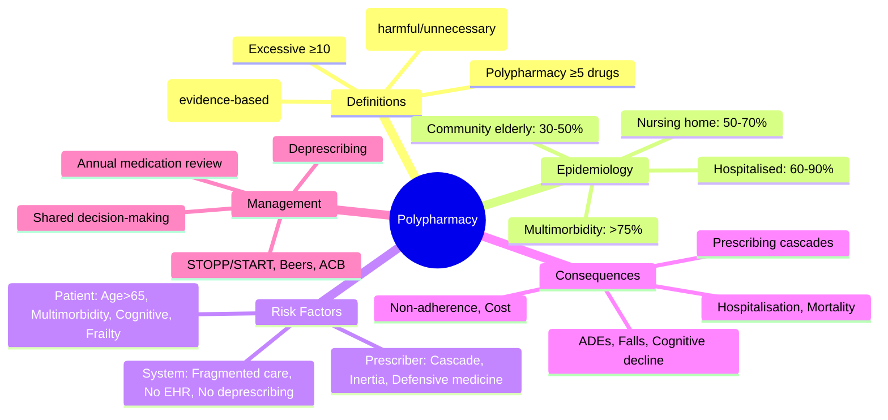

**Status**: `draft` | **Chapter**: 2 — Clinical Therapeutics and Good Prescribing | **Heading**: Polypharmacy and Deprescribing | **Exam Priority**: ⭐⭐⭐ **HIGH** (Geriatric medicine core, FCPS/MRCP common)

---

## 1. 1. 🎯 Learning Objectives
- [ ] Define polypharmacy — minor/major/excessive
- [ ] Differentiate appropriate vs inappropriate polypharmacy
- [ ] Recognise epidemiology in elderly, multimorbidity, nursing homes
- [ ] Identify risk factors for problematic polypharmacy
- [ ] Apply prescribing appropriateness frameworks

---

## 2. 2. 📖 Definitions

| Term | Definition | Clinical Significance |
|------|------------|------------------------|
| **Polypharmacy** | Use of **≥5 medications** (most common definition) | Risk threshold; ↑ ADEs, falls, hospitalisation |
| **Minor Polypharmacy** | 2–4 medications | Often appropriate |
| **Major Polypharmacy** | **≥5 medications** | Reassess need, deprescribing opportunity |
| **Excessive/Hyper-polypharmacy** | **≥10 medications** | High ADE risk; deprescribing mandatory |
| **Appropriate Polypharmacy** | Multiple drugs with proven benefit, individualised, optimised | **Acceptable** when evidence-based |
| **Inappropriate Polypharmacy** | At least one unnecessary, harmful, or duplicative medication | **Reassess, deprescribe** |

---

## 3. 3. 📊 Epidemiology

| Setting | Polypharmacy Prevalence |
|---------|-------------------------|
| **Community-dwelling elderly (>65y)** | **30–50%** |
| **Nursing/Residential care** | **50–70%** |
| **Hospitalised elderly** | **60–90%** |
| **Multimorbidity (≥3 conditions)** | **>75%** |
| **Heart failure patients** | **>90%** (GDMT) |
| **HIV patients** | **>80%** (ART + comorbidities) |
| **Cancer patients** | **>70%** (chemo + supportive + comorbidities) |

---

## 4. 4. ⚠️ Risk Factors for Problematic Polypharmacy

| Patient Factors | System Factors | Prescriber Factors |
|----------------|----------------|---------------------|
| **Age >65 years** | **Fragmented care** (multiple specialists) | **Prescribing cascade** |
| **Multimorbidity (≥3 conditions)** | **Poor EHR interoperability** | **Inadequate medication review** |
| **Cognitive impairment/dementia** | **Lack of deprescribing culture** | **Therapeutic inertia** |
| **Multiple prescribers (≥3)** | **Hospital discharge without reconciliation** | **Disease-specific guidelines (HF, DM, CKD)** |
| **Polypharmacy at admission** | **No pharmacist involvement** | **Patient/family pressure** |
| **Falls risk** | **Repeat prescriptions without review** | **Time constraints** |
| **Frailty** | **Inadequate primary care follow-up** | **Fear of consequences (inertia)** |
| **Low health literacy** | **Free drug samples** | **Influence of pharmaceutical reps** |
| **Limited life expectancy** | **Guidelines push add-on therapy** | **Defensive medicine** |

---

## 5. 5. 📈 Consequence Categories

| Domain | Consequences |
|--------|--------------|
| **Adverse Drug Events (ADEs)** | ↑ Hospital admissions (5–10% of admissions), ↑ ED visits, ↑ mortality |
| **Falls & Fractures** | ↑ Risk (BZD, antipsychotics, antihypertensives, hypoglycaemics) |
| **Cognitive Impairment** | Anticholinergic burden, delirium, dementia progression |
| **Functional Decline** | ↓ ADLs, ↑ frailty, ↓ QoL |
| **Malnutrition** | Anorexia from multiple drugs, dry mouth, dysphagia |
| **Hospital Readmission** | ↑ 30-day readmission rates |
| **Mortality** | ↑ All-cause mortality (linear with drug count >5) |
| **Cost** | ↑ Patient cost, ↑ Healthcare system cost, ↑ Insurance |
| **Non-Adherence** | **Polypharmacy #1 cause** of non-adherence (pill burden, complexity) |
| **Drug Interactions** | ↑ Linear with drug count |
| **Prescribing Cascades** | Drug A side effect → Drug B prescribed → Drug B side effect → Drug C prescribed |

---

## 6. 6. 🎯 FCPS/MRCP High-Yield

| Pearl | Details |
|-------|---------|
| **Polypharmacy threshold** | **≥5 drugs** (most common); **≥10 = excessive** |
| **Appropriate vs Inappropriate** | Appropriate = evidence-based, individualised; Inappropriate = at least one harmful/unnecessary |
| **Multimorbidity prevalence** | >50% of patients >65 years have ≥3 conditions |
| **Prescribing cascade** | ADE misinterpreted as new disease → another drug added |
| **Medication review** | Recommended **annually in elderly**, **every 3–6 months in frail/high-risk** |
| **STOPP/START** | **Screening Tool of Older Persons' Prescriptions** (inappropriate) / **Screening Tool to Alert to Right Treatment** (omission) |

---

## 7. 7. ❓ Viva Questions (6)

| Q | Answer |
|---|--------|
| 1. Define polypharmacy. Differentiate appropriate vs inappropriate. | **≥5 medications**; **Appropriate** = evidence-based, individualised, optimised (e.g., HF GDMT); **Inappropriate** = at least one unnecessary, harmful, or duplicative drug |
| 2. Common causes of problematic polypharmacy? | **Multimorbidity, multiple prescribers, fragmented care, prescribing cascades, lack of deprescribing culture, therapeutic inertia** |
| 3. What is a prescribing cascade? Give 2 examples. | **ADE misinterpreted as new disease → another drug added**. Examples: (1) NSAID → hypertension → antihypertensive; (2) Anticholinergic → constipation → laxative; (3) Ca-channel blocker → oedema → diuretic; (4) Metoclopramide → EPS → levodopa (worsens Parkinson's) |
| 4. Consequences of polypharmacy — list 6? | ADEs, falls/fractures, cognitive impairment, hospitalisation, non-adherence, prescribing cascades, mortality, cost |
| 5. When should medication review be done in elderly? | **Annually in stable elderly**; **every 3–6 months in frail/high-risk**; at any care transition |
| 6. Most important single intervention to reduce polypharmacy harm? | **Structured medication review** (using STOPP/START, Beers, or anticholinergic burden) with shared decision-making |

---

## 8. 8. 🤯 Confusions & Mnemonics

| Confusion | Clarification |
|-----------|---------------|
| **Polypharmacy = always bad?** | **No** — appropriate polypharmacy (HF, DM, HIV) is evidence-based and beneficial |
| **Polypharmacy = drug-drug interaction risk** | ↑ Linear with drug count; **rule of thumb: each additional drug = ↑ 5–10% ADE risk** |
| **Polypharmacy ≠ overprescribing** | Polypharmacy = **count of drugs**; overprescribing = **inappropriate drug count** |
| **Prescribing cascade ≠ side effect** | Cascade = **misinterpreted ADE → new drug** (the trap) |

**Mnemonics:**
- **"POLYPHARMACY = 5+ DRUGS"** = threshold for review
- **"APPROPRIATE POLYPHARMACY"** = HF GDMT, DM, HIV, Asthma — evidence-based
- **"INAPPROPRIATE POLYPHARMACY"** = At least one harmful/unnecessary/duplicative
- **"ADE CASCADE"** = **A**DE → **D**isease misdiagnosis → **E**scalating drug list
- **"STOPP/START"** = **S**creening **T**ool **O**lder **P**ersons' **P**rescriptions / **S**creening **T**ool **A**lert **R**ight **T**reatment

---

## 9. 9. 🧠 Mind Map (Mermaid)

---

## 10. 10. 📅 Spaced Repetition Tracker

| Review | Date | Score | Next |
|--------|------|-------|------|
| 1 | | | 1d |
| 2 | | | 3d |
| 3 | | | 1w |
| 4 | | | 2w |
| 5 | | | 1m |
| 6 | | | 3m |

---

## 11. 11. 🧪 Self-Test Scorecard

| Section | Max | Score |
|---------|-----|-------|
| Definitions | 6 | |
| Epidemiology | 6 | |
| Risk factors | 8 | |
| Consequences | 8 | |
| Viva answers | 6 | |
| **Total** | **34** | |

**Target**: ≥27/34 (80%)

---

## 12. 12. 📝 Exam Answer Modes

### 1. Short Question (5 marks): *"Define polypharmacy. Differentiate appropriate vs inappropriate polypharmacy."*
- **Polypharmacy = ≥5 medications** (minor 2–4, major ≥5, excessive ≥10)
- **Appropriate** = evidence-based, individualised, optimised (e.g., HF GDMT = ACEi+BB+MRA+SGLT2i+loop diuretic)
- **Inappropriate** = ≥1 unnecessary, harmful, duplicative drug
- **Consequences**: ↑ ADEs, falls, cognitive decline, mortality, cost, non-adherence

### 2. Viva (1 min): *"What is a prescribing cascade? Give 3 examples."*
- **ADE misinterpreted as new disease → another drug added**
- Examples: (1) **NSAID → HTN → antihypertensive**; (2) **Anticholinergic → constipation → laxative**; (3) **CCB → oedema → diuretic**; (4) **Metoclopramide → EPS → levodopa** (worsens Parkinson's)

### 3. Last-Night Revision (1-liners):
- Polypharmacy = **≥5 drugs** (excessive ≥10)
- Appropriate = evidence-based (HF, DM, HIV, Asthma)
- Inappropriate = ≥1 harmful/unnecessary
- Multimorbidity >75% polypharmacy
- Prescribing cascade = ADE → new drug
- Medication review: **annual in elderly, 3–6mo in frail**

---

## 13. 13. 📚 Summary Card

> **POLYPHARMACY = ≥5 DRUGS**
> **APPROPRIATE** = Evidence-based (HF, DM, HIV)
> **INAPPROPRIATE** = ≥1 harmful/unnecessary drug
> **CONSEQUENCES** = ADEs, Falls, Cognitive ↓, Mortality, Cost, Non-adherence
> **MANAGEMENT** = Annual review + STOPP/START + Deprescribing

---

## 14. 14. ❓ MCQs (8)

1. **Most common threshold for polypharmacy:**
   A. ≥3 drugs
   B. **≥5 drugs** ✓
   C. ≥8 drugs
   D. ≥10 drugs
   E. ≥15 drugs

2. **Excessive polypharmacy threshold:**
   A. ≥5
   B. ≥7
   C. **≥10** ✓
   D. ≥15
   E. ≥20

3. **Appropriate polypharmacy example:**
   A. Same drug class duplication
   B. **HFrEF on ACEi + BB + MRA + SGLT2i + Loop diuretic (GDMT)** ✓
   C. PPI for stress ulcer in ward
   D. Opioid + BZD + muscle relaxant
   E. Anticholinergic + sedative

4. **Prescribing cascade example:**
   A. ACEi + ARB for HTN
   B. **NSAID → hypertension → antihypertensive added** ✓
   C. ASA + Clopidogrel for ACS
   D. ACEi + BB for HF
   E. Statin + Ezetimibe for hyperlipidaemia

5. **Recommended medication review frequency in elderly:**
   A. Every visit
   B. **Annually in stable; 3–6 months in frail/high-risk** ✓
   C. Every 5 years
   D. Only on admission
   E. Never unless symptomatic

6. **Polypharmacy prevalence in hospitalised elderly:**
   A. 10–20%
   B. 30–40%
   C. 50–60%
   D. **60–90%** ✓
   E. >95%

7. **Polypharmacy is a risk factor for:**
   A. Single ADEs only
   B. **↑ ADEs, falls, cognitive decline, hospitalisation, mortality** ✓
   C. Increased drug efficacy
   D. Decreased drug cost
   E. Improved adherence

8. **Polypharmacy #1 cause of:**
   A. Improved QoL
   B. **Non-adherence** ✓
   C. Reduced pill burden
   D. Lower cost
   E. Better outcomes

---

## 15. 15. 🃏 Flashcards (Anki-ready)

| Front | Back |
|-------|------|
| Polypharmacy threshold | ≥5 drugs |
| Excessive polypharmacy | ≥10 drugs |
| Appropriate polypharmacy | Evidence-based, individualised (HF, DM, HIV) |
| Inappropriate polypharmacy | ≥1 harmful/unnecessary/duplicative drug |
| Prescribing cascade | ADE misinterpreted as new disease → another drug |
| Prescribing cascade examples | NSAID→HTN→antihypertensive; Anticholinergic→constipation→laxative; CCB→oedema→diuretic |
| Medication review frequency | Annually in stable elderly; 3–6mo in frail |
| STOPP/START | Screening Tool Older Persons' Prescriptions / Right Treatment |
| Polypharmacy prevalence (hospitalised elderly) | 60–90% |
| Polypharmacy #1 cause of | Non-adherence |

---

## 16. 16. ✅ Answer Keys

### 1. MCQs
1. **B** — ≥5 drugs
2. **C** — ≥10
3. **B** — GDMT for HFrEF
4. **B** — NSAID→HTN cascade
5. **B** — Annual stable, 3–6mo frail
6. **D** — 60–90%
7. **B** — Multiple adverse outcomes
8. **B** — Non-adherence

---

*File: `/mnt/tb/Medicine/Clinical Therapeutics and Good Prescribing/Polypharmacy/Definition and epidemiology.md` | Status: `draft` → upgrade after review*
