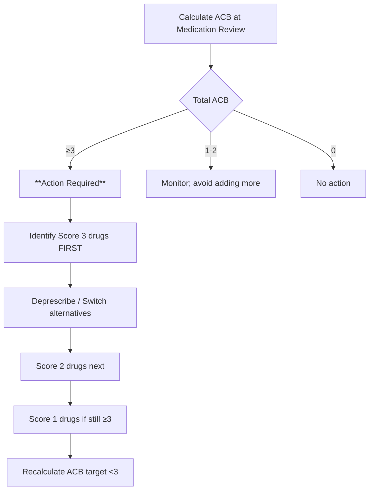

**Parent Topic:** [Polypharmacy and Deprescribing](../../Polypharmacy%20and%20Deprescribing.md) → [Clinical Therapeutics Overview](../../Clinical%20Therapeutics%20and%20Good%20Prescribing%20MOC.md)
**Status:** `full-fcps-mrcp-note`
**Priority:** ⭐⭐⭐ HIGHEST (FCPS/MRCP — explicit exam topics, clinical application questions)
**Source:** Davidson 24th Ed Ch 2; STOPP/START v3 (2023); Beers Criteria 2023 (AGS); ACB Scale; DBI; FORTA; NICE Medicines Optimisation

---

## 1. 1. 🎯 Learning Objectives
- [ ] Apply **STOPP/START v3** criteria to clinical cases (identify PIMs and PPOs)
- [ ] Apply **Beers Criteria 2023** (AGS) for potentially inappropriate medications in older adults
- [ ] Calculate **Anticholinergic Cognitive Burden (ACB)** score and interpret
- [ ] Calculate **Drug Burden Index (DBI)** and interpret
- [ ] Apply **FORTA** classification (Fit fOR The Aged) for benefit/harm rating
- [ ] Compare tools: strengths, limitations, clinical utility
- [ ] Answer viva: "Review this 85-year-old's medications using STOPP/START"

---

## 2. 2. 🧠 Core Concept: Tool Comparison

```mermaid
flowchart TD
    A[Polypharmacy Assessment Tools] --> B[Explicit Criteria
List-based, disease/drug-specific]
    A --> C[Implicit Criteria
Judgment-based, patient-centred]
    A --> D[Burden Metrics
Quantitative scores]
    A --> E[Benefit/Harm Rating
Label-based]
    
    B --> B1[STOPP/START v3
**65 STOPP (PIMs), 41 START (PPOs)**
Organ-system based
Evidence-graded]
    B --> B2[Beers Criteria 2023
**5 categories, ~100 drugs**
US-focused, regularly updated
Strong/Weak recommendation]
    
    C --> C1[MAI (Medication Appropriateness Index)
10 criteria, judgment-based
Time-consuming]
    
    D --> D1[ACB Scale
**Additive score 0-3 per drug**
Anticholinergic burden only
Threshold ≥3]
    D --> D2[DBI (Drug Burden Index)
**Dose-weighted sedative + anticholinergic**
Formula: Σ D/(D+δ)
Threshold ≥1]
    
    E --> E1[FORTA Classification
**A/B/C/D labels per drug-indication**
A=Indispensable, B=Beneficial, C=Questionable, D=Avoid
Positive list (beneficial) + Negative list (avoid)]
```

---

## 3. 3. ️⃣ STOPP/START v3 (2023) — The Gold Standard for Hospital/Geriatrics

### 1. Structure
- **STOPP** = **S**creening **T**ool of **O**lder **P**eople's **P**otentially **I**napropriate **P**rescriptions (65 criteria)
- **START** = **S**creening **T**ool to **A**lert to **R**ight **T**reatment (41 criteria)
- **Organ-system based** (CV, Respiratory, CNS, GI, Endocrine, Urogenital, Musculoskeletal, Pain, Infection, Miscellaneous)
- **Evidence-graded** (Level 1–3, Grade A–C)
- **Validated**: ↓ PIMs, ↑ appropriate prescribing, ↓ ADRs, ↓ hospitalisation

### 2. High-Yield STOPP Criteria (Memorise These for Exam)

| System | Criterion (Simplified) | Clinical Example |
|--------|------------------------|------------------|
| **Cardiovascular** | Loop diuretic for dependent ankle oedema **without** HF (C1) | Furosemide for CCB-induced oedema |
| | Beta-blocker + verapamil/diltiazem (C2) | Bisoprolol + diltiazem → bradycardia/block |
| | ACEi + K-sparing diuretic / K supplement **without** K monitoring (C3) | Ramipril + spironolactone, no U&E in 3m |
| | Anticoagulant (warfarin/DOAC) + antiplatelet **without** clear indication (C4) | Apixaban + aspirin for stable CAD only |
| | Statin for primary prevention **age >85** or **life expectancy <1y** (C5) | Atorvastatin 80yo frail, no CVD |
| **Coagulation** | Warfarin/DOAC + NSAID **without** PPI (C6) | Apixaban + ibuprofen, no PPI |
| | Warfarin/DOAC + antiplatelet **without** clear indication (C7) | As above |
| **CNS** | Benzodiazepine **≥4 weeks** (C8) | Diazepam 5mg OD × 2 years for "anxiety" |
| | Z-drug (zopiclone/zolpidem) **≥4 weeks** (C9) | Zopiclone 7.5mg × 6 months |
| | Antipsychotic for BPSD **>12 weeks** without review (C10) | Quetiapine 100mg × 2y for dementia agitation |
| | First-generation antihistamine (C11) | Chlorphenamine for pruritus in 80yo |
| | TCA (amitriptyline/dosulepin) as first-line for neuropathic pain (C12) | Amitriptyline 50mg for diabetic neuropathy |
| | Opioid **long-acting** without laxative co-prescription (C13) | MST 30mg BD, no laxative |
| **Gastrointestinal** | PPI **>8 weeks** at full dose without indication (C14) | Omeprazole 20mg × 3y, no erosive esophagitis/Barrett's |
| | Metoclopramide **>5 days** (C15) | Metoclopramide 10mg TDS × 2 weeks |
| **Endocrine** | Sulfonylurea (glibenclamide) with **high hypoglycaemia risk** (C16) | Glibenclamide in CKD/elderly |
| | Insulin sliding scale **alone** for hyperglycaemia (C17) | No basal/bolus, only sliding scale |
| | Thiazolidinedione (pioglitazone) in **HF** (C18) | Pioglitazone in HFrEF |
| **Urogenital** | Anticholinergic for OAB **with** dementia / cognitive impairment (C19) | Oxybutynin in Alzheimer's |
| | Alpha-blocker for **urinary retention** without urology review (C20) | Tamsulosin for retention, no US/urology |
| **Musculoskeletal** | NSAID with **current peptic ulcer / GI bleed** (C21) | Ibuprofen with history of UGIB |
| | NSAID with **HF / CKD Stage 4–5** (C22) | Diclofenac in eGFR 25 |
| | NSAID + ACEi/ARB + Diuretic ("Triple Whammy") (C23) | Ibuprofen + ramipril + furosemide |
| | Long-term oral corticosteroid >3 months **without** bone protection (C24) | Prednisolone 10mg × 1y, no bisphosphonate |
| **Pain** | Opioid for **mild pain** (WHO ladder step 1) (C25) | Tramadol for mild OA pain |
| | Gabapentinoid **without** dose adjustment for **eGFR <60** (C26) | Pregabalin 150mg BD in eGFR 30 |
| **Infection** | Antibiotic **without** clinical evidence of infection (C27) | "Just in case" ciprofloxacin |
| | Fluoroquinolone for **uncomplicated UTI/cystitis** (C28) | Ciprofloxacin for simple cystitis |
| | Prolonged antibiotic **>7 days** without review (C29) | Co-amoxiclav 14 days for CAP, no review |

### 3. High-Yield START Criteria (Omissions = PPOs)

| System | Criterion (Simplified) | Clinical Example |
|--------|------------------------|------------------|
| **Cardiovascular** | ACEi/ARB in **HFrEF / post-MI / LVSD** (S1) | No ACEi in EF 35% |
| | Beta-blocker in **HFrEF / post-MI** (S2) | No BB post-MI |
| | MRA (spironolactone/eplerenone) in **HFrEF** (S3) | No MRA in symptomatic HFrEF |
| | SGLT2i in **HFrEF / T2DM + CVD/CKD** (S4) | No dapagliflozin in HFrEF |
| | Anticoagulant in **AF CHA₂DS₂-VASc ≥2 (M) / ≥3 (F)** (S5) | No anticoag in AF score 3 |
| | Statin in **documented CVD / T2DM ≥40 / CKD** (S6) | No statin post-STEMI |
| **Respiratory** | LAMA/LABA in **COPD GOLD B–D** (S7) | No inhaler in COPD CAT 20 |
| | ICS/LABA in **asthma uncontrolled on LABA** (S8) | SABA only for persistent asthma |
| **CNS** | Antidepressant for **moderate-severe depression** (S9) | No AD for PHQ-9 18 |
| | Donepezil/rivastigmine/galantamine for **mild-moderate Alzheimer's** (S10) | No AChEI in MMSE 20 |
| | Memantine for **moderate-severe Alzheimer's** (S11) | No memantine in MMSE 12 |
| **Endocrine** | Metformin first-line **T2DM** if eGFR >30 (S12) | On gliclazide only, eGFR 55 |
| | Vitamin D **≥800 IU** if **osteoporosis / high fall risk / housebound** (S13) | No vit D in hip fracture |
| | Bisphosphonate for **osteoporosis / fragility fracture** (S14) | No bisphosphonate post-hip fracture |
| **Urogenital** | Vaginal oestrogen for **GSM / recurrent UTI** (S15) | Recurrent UTI, no vaginal oestrogen |
| **Musculoskeletal** | Calcium + Vitamin D for **osteoporosis / high fracture risk** (S16) | No Ca/Vit D on glucocorticoids |
| **Infection** | Pneumococcal vaccine **≥65 / high risk** (S17) | No PPV23 in 70yo |
| | Influenza vaccine **annual ≥65 / high risk** (S18) | No flu vaccine in 80yo |
| | COVID vaccine **per guidelines** (S19) | No COVID booster |

---

## 4. 4. ️⃣ Beers Criteria 2023 (American Geriatrics Society) — US-Focused, 5 Categories

### 1. Category 1: Potentially Inappropriate in **Most** Older Adults
| Drug/Class | Reason |
|------------|--------|
| **Anticholinergics** (1st gen antihistamines, antispasmodics, tricyclics, muscle relaxants) | Cognitive impairment, falls, constipation, urinary retention |
| **Benzodiazepines (all)** | Falls, fractures, cognitive impairment, delirium, motor vehicle crashes |
| **Non-benzodiazepine hypnotics** (zolpidem, zopiclone, zaleplon) | Similar to benzodiazepines |
| **Antipsychotics (typical & atypical)** for BPSD | ↑ Mortality, CVA, cognitive decline (unless non-pharm failed + severe) |
| **Long-acting sulfonylureas** (glibenclamide, chlorpropamide) | Prolonged hypoglycaemia |
| **Metoclopramide** | EPS, tardive dyskinesia |
| **Meperidine (pethidine)** | Neurotoxicity (normeperidine), poor analgesic |
| **Indomethacin / Ketorolac** | Highest GI bleed/CNS risk among NSAIDs |
| **Skeletal muscle relaxants** (cyclobenzaprine, methocarbamol, carisoprodol) | Anticholinergic, sedation, doubtful efficacy |
| **Desiccated thyroid** | Inconsistent dosing, cardiac risk |
| **Estrogen (oral/topical patch)** for vasomotor symptoms | ↑ VTE, stroke, breast cancer |
| **Insulin sliding scale alone** | Ineffective, hypoglycaemia risk |
| **Dipyridamole (short-acting)** | Orthostatic hypotension |
| **Ticlopidine** | Neutropenia, TTP (better alternatives) |

### 2. Category 2: Potentially Inappropriate in **Specific Diseases/Conditions**
| Condition | Drugs to Avoid | Reason |
|-----------|----------------|--------|
| **Cognitive Impairment / Dementia** | Anticholinergics, Benzodiazepines, Z-drugs, Antipsychotics, TCAs, H2RAs (cimetidine), Muscle relaxants | Worsens cognition |
| **History of Falls / Fractures** | Anticonvulsants, Antipsychotics, Benzodiazepines, Z-drugs, TCAs, SSRIs, Opioids, Alpha-blockers | ↑ Fall risk |
| **Parkinson's Disease** | Antipsychotics (except quetiapine, clozapine, pimavanserin), Metoclopramide, Prochlorperazine | Worsens parkinsonism |
| **CKD Stage 4–5 (eGFR <30)** | NSAIDs, Metformin (if eGFR <30), Glibenclamide, Colonial, Trimethoprim-sulfa (hyperK), IV contrast (if avoidable) | Nephrotoxicity, accumulation |
| **Heart Failure** | NSAIDs, CCBs (non-DHP: verapamil, diltiazem), Pioglitazone, Rosiglitazone, Cilostazol, Dronedarone | Worsens HF |
| **Syncope / Orthostatic Hypotension** | Alpha-blockers, TCAs, Antipsychotics, Benzodiazepines, Diuretics, Vasodilators | ↑ Syncope |
| **Chronic Constipation** | Anticholinergics, Calcium/d Aluminium antacids, Iron, Opioids, TCAs | Worsens constipation |
| **Urinary Incontinence (Stress)** | Alpha-blockers, Cholinesterase inhibitors, Loop diuretics | Worsens SUI |
| **Lower Urinary Tract Symptoms (BPH)** | Anticholinergics (oral), First-gen antihistamines | Urinary retention |

### 3. Category 3: Use with **Caution** (Monitoring Required)
| Drug | Monitoring / Caution |
|------|---------------------|
| **Aspirin >81mg/day** for primary prevention | Bleeding risk |
| **Dabigatran** (vs other DOACs) if eGFR 30–50 | ↑ GI bleed |
| **Pramipexole / Ropinirole** | Impulse control disorders, hallucinations |
| **SSRI** (fall/fracture risk, hyponatraemia) | Monitor Na, falls |
| **SNRI** (hypertension) | Monitor BP |
| **Opioids** (falls, constipation, respiratory) | Bowel regimen, fall assessment |

### 4. Category 4: Drug-Drug Interactions to **Avoid**
| Interaction | Consequence |
|-------------|-------------|
| **Warfarin + NSAID** | ↑ GI bleed |
| **Warfarin/DOAC + Antiplatelet** (no clear indication) | ↑ Bleed |
| **ACEi/ARB + K-sparing diuretic/K supplement** | Hyperkalaemia |
| **Lithium + ACEi/ARB/Loop/Thiazide** | ↑ Lithium → toxicity |
| **CYP3A4 substrate + Strong inhibitor/inducer** | Toxicity / failure |

### 5. Category 5: Dose Adjustment Required in **Renal Impairment**
- **Gabapentin, Pregabalin** — eGFR <60
- **Metformin** — eGFR <45 (↓ dose), <30 (avoid)
- **Digoxin** — eGFR <60 (↓ dose)
- **DOACs** — specific CrCl thresholds
- **Colchicine** — eGFR <30 (↓ dose/avoid)
- **Allopurinol** — eGFR <30 (↓ dose, HLA-B*58:01)
- **Trimethoprim/Sulfa** — eGFR <30 (avoid if possible)

---

## 5. 5. ️⃣ Anticholinergic Cognitive Burden (ACB) Scale

### 1. Scoring (Per Drug)
| Score | Description | Examples |
|-------|-------------|----------|
| **0** | No anticholinergic activity | Most drugs |
| **1** | **Mild / Possible** | Ranitidine, Cimetidine, Codeine, Prednisolone, Atenolol, Digoxin, Warfarin, Nifedipine, Theophylline, Fentanyl, Metoprolol, Captopril, Furosemide, Chlorthalidone |
| **2** | **Moderate** | **Oxybutynin, Tolterodine, Solifenacin, Darifenacin, Fesoterodine, Cyclizine, Promethazine, Chlorphenamine, Hydroxyzine, Loperamide, Olanzapine, Quetiapine (<200mg), Risperidone (<2mg), Loratadine, Cetirizine, Paroxetine, Mirtazapine** |
| **3** | **Severe / Definite** | **Amitriptyline, Nortriptyline, Imipramine, Dosulepin, Doxepin, Chlorpromazine, Thioridazine, Clozapine, Olanzapine (>10mg), Quetiapine (>200mg), Benztropine, Procyclidine, Trihexyphenidyl, Hyoscine, Atropine, Scopolamine, Diphenhydramine, Doxylamine, Chlorpheniramine, Hydroxyzine (high dose)** |

### 2. Calculation & Interpretation
- **Total ACB** = Sum of scores for all current medications
- **Thresholds:**
  - **ACB = 0**: No burden
  - **ACB = 1–2**: Low burden (monitor)
  - **ACB ≥3**: **Clinically significant** — ↑ cognitive impairment, falls, mortality, dementia risk
  - **ACB ≥6**: **High burden** — Strong association with dementia, functional decline, mortality

### 3. Clinical Application


### 4. Common Switches to Reduce ACB
| High ACB Drug | Lower ACB Alternative |
|---------------|----------------------|
| Amitriptyline (3) → Nortriptyline (2) → **Duloxetine (0) / Gabapentin (0)** | |
| Oxybutynin (3) → **Mirabegron (0) / Solifenacin (2) / Vaginal oestrogen (0)** | |
| Chlorphenamine (3) → **Cetirizine (1) / Loratadine (1) / Fexofenadine (0)** | |
| Promethazine (2) → **Ondansetron (0) / Cyclizine (1? actually 2) → Metoclopramide (1)** | |
| Quetiapine >200mg (3) → **Quetiapine <200mg (2) → Aripiprazole (1) / Lurasidone (0)** | |
| Diphenhydramine (3) → **Melatonin (0) / Non-drug sleep hygiene** | |

---

## 6. 6. ️⃣ Drug Burden Index (DBI) — Dose-Weighted Metric

### 1. Formula
```
DBI = Σ [D / (D + δ)] for sedative drugs + Σ [D / (D + δ)] for anticholinergic drugs
```
- **D** = Daily dose taken
- **δ** = Minimum daily dose for therapeutic effect (from literature)
- **Sedative drugs**: Benzodiazepines, Z-drugs, Opioids, Antipsychotics, Antihistamines, GABAergics
- **Anticholinergic drugs**: ACB score ≥1 drugs

### 2. Interpretation
| DBI | Risk |
|-----|------|
| **0** | No sedative/anticholinergic load |
| **<1** | Low burden |
| **≥1** | **Clinically significant** — ↑ Falls, hospitalisation, functional decline, mortality |
| **≥2** | High burden |

### 3. Advantages Over ACB
- **Incorporates DOSE** (not just drug presence)
- **Incorporates POTENCY** (via δ parameter)
- **Combines sedative + anticholinergic** load
- **Continuous variable** (more granular than categories)

### 4. Limitations
- Requires dose data (not always available)
- δ values debated / not standardised
- Less validated than ACB for dementia prediction
- More complex to calculate clinically

---

## 7. 7. ️⃣ FORTA (Fit fOR The Aged) Classification — Benefit/Harm Labelling

### 1. Concept
- **Drug-indication specific** (not just drug)
- **Positive list (A, B)** = Beneficial
- **Negative list (C, D)** = Avoid/Questionable
- **Evidence-based**, regularly updated (FORTA 2020/2023)

### 2. Classification
| Label | Meaning | Action |
|-------|---------|--------|
| **A** | **Indispensable** — Clear benefit, evidence-based, favourable benefit/harm | **Start / Continue** |
| **B** | **Beneficial** — Probable benefit, evidence-based, acceptable benefit/harm | **Start / Continue** |
| **C** | **Questionable** — Unclear benefit, questionable benefit/harm, alternatives better | **Review / Consider alternative** |
| **D** | **Avoid** — Clear harm > benefit, inappropriate | **Stop / Avoid** |

### 3. High-Yield FORTA Examples (Selected)

#### Cardiovascular
| Drug | Indication | FORTA |
|------|------------|-------|
| ACEi/ARB/ARNI | HFrEF / HTN + CVD/DM/CKD | **A** |
| Beta-blocker (bisoprolol, carvedilol, nebivolol) | HFrEF / Post-MI / HTN | **A** |
| MRA (spironolactone/eplerenone) | HFrEF | **A** |
| SGLT2i (dapagliflozin/empagliflozin) | HFrEF / T2DM + CVD/CKD | **A** |
| Loop diuretic | HF with congestion | **A** |
| Thiazide diuretic | HTN (no HF) | **B** |
| Dihydropyridine CCB (amlodipine) | HTN (no HF) | **B** |
| Non-DHP CCB (verapamil/diltiazem) | HTN / Rate control AF | **C** (HF) / **B** (AF) |
| Digoxin | AF rate control (2nd line) / HFrEF (symptomatic) | **C** |
| Amiodarone | AF rhythm control | **C** (long-term toxicity) |
| Warfarin | AF (if DOAC unsuitable) | **B** |
| DOAC (apixaban/rivaroxaban/dabigatran/edoxaban) | AF / VTE | **A** |
| Aspirin | Primary prevention >70 | **D** |
| Clopidogrel | ACS / Stroke / PAD | **A** |

#### CNS / Psychotropic
| Drug | Indication | FORTA |
|------|------------|-------|
| Donepezil/Rivastigmine/Galantamine | Mild-moderate Alzheimer's | **B** |
| Memantine | Moderate-severe Alzheimer's | **B** |
| SSRI (sertraline, citalopram, escitalopram) | Depression | **B** |
| SNRI (duloxetine, venlafaxine) | Depression / Neuropathic pain | **B** |
| Mirtazapine | Depression + insomnia/anorexia | **B** |
| TCA (amitriptyline, nortriptyline) | Neuropathic pain / Depression | **D** (elderly) |
| Benzodiazepine | Anxiety / Insomnia | **D** |
| Z-drug (zopiclone/zolpidem) | Insomnia | **D** |
| Antipsychotic (risperidone, olanzapine, quetiapine) | BPSD | **D** (unless severe + non-pharm failed) |
| Quetiapine / Clozapine / Pimavanserin | Psychosis in Parkinson's | **B** / **C** / **B** |
| Gabapentin / Pregabalin | Neuropathic pain | **B** (renal adjust) |
| Opioid (weak: codeine/tramadol) | Moderate pain | **C** |
| Opioid (strong: morphine/oxycodone) | Severe pain | **B** (with bowel regimen) |

#### GI / Endocrine / Other
| Drug | Indication | FORTA |
|------|------------|-------|
| PPI | Erosive esophagitis / Barrett's / NSAID bleed prophylaxis | **B** |
| PPI | Uncomplicated GERD >8 weeks | **C** |
| Metformin | T2DM (eGFR >30) | **A** |
| Sulfonylurea (gliclazide) | T2DM (if metformin contraindicated) | **C** |
| Glibenclamide | T2DM | **D** |
| Insulin (basal-bolus) | T2DM uncontrolled / T1DM | **A** |
| Insulin sliding scale alone | Hyperglycaemia | **D** |
| Pioglitazone | T2DM | **C** (HF risk, fracture, bladder cancer) |
| Bisphosphonate (alendronate/zoledronate) | Osteoporosis / Fragility fracture | **A** |
| Denosumab | Osteoporosis (if bisphosphonate contraindicated) | **B** |
| Calcium + Vit D | Osteoporosis / Glucocorticoid-induced | **A** |
| Vitamin D ≥800 IU | High fall risk / Housebound / Osteoporosis | **A** |
| NSAID | OA pain (short-term, with PPI if risk) | **C** |
| NSAID | Chronic use / HF / CKD / GI bleed history | **D** |

---

## 8. 8. ️⃣ Tool Comparison: When to Use Which

| Tool | Best For | Strengths | Limitations |
|------|----------|-----------|-------------|
| **STOPP/START v3** | **Hospital, geriatrics, comprehensive review** | Organ-system, explicit, evidence-graded, validated outcomes, detects PIMs + PPOs | 106 criteria (time-consuming), some disease-specific knowledge needed |
| **Beers Criteria 2023** | **US primary care, nursing homes, quick screen** | Well-known, regularly updated, 5 categories, disease-specific | US-centric, no "start" criteria (only avoid), less granular than STOPP |
| **ACB Scale** | **Cognitive risk, fall risk, anticholinergic burden focus** | Simple, validated for dementia/falls, easy to calculate | Only anticholinergic (not sedative), doesn't capture dose |
| **DBI** | **Research, dose-specific burden, combined sedative+anticholinergic** | Dose-weighted, combines two domains, continuous | Complex calc, less clinical validation, needs dose data |
| **FORTA** | **Positive formulary, indication-specific, benefit/harm labelling** | Positive + negative list, indication-specific, intuitive A-D labels | Less validated for outcomes, European-centric, needs indication mapping |
| **MAI (Implicit)** | **Complex patients, clinical judgment, individualised** | Patient-centred, holistic, captures nuance | Time-consuming, inter-rater variability, needs expertise |

### 1. Practical Clinical Workflow

```mermaid
flowchart TD
    A[Medication Review Requested] --> B{Setting / Time}
    B -->|Hospital / Geriatrics / Comprehensive| C[**STOPP/START v3** — Full systematic review]
    B -->|Primary Care / Quick Screen / Nursing Home| D[**Beers 2023** + **ACB**]
    B -->|Research / Dose-specific analysis| E[**DBI**]
    B -->|Formulary decision / New prescription| F[**FORTA** — Check label for indication]
    B -->|Complex multimorbidity / Goals of care| G[**MAI** + Patient-centred discussion]
    
    C --> H[Identify PIMs (STOPP) & PPOs (START)]
    D --> I[Identify avoid drugs + ACB ≥3]
    E --> J[Quantify burden; target DBI <1]
    F --> K[Prefer A/B; Avoid C/D]
    G --> L[Shared decision-making]
    
    H --> M[Deprescribing Plan]
    I --> M
    J --> M
    K --> M
    L --> M
    
    M --> N[Implement: Taper, Switch, Stop, Monitor]
    N --> O[Follow-up: Reassess in 4-12 weeks]
```

---

## 9. 9. ⚡ FCPS/MRCP High-Yield Summary

| Tool | Key Exam Points |
|------|-----------------|
| **STOPP/START v3** | **65 STOPP (PIMs), 41 START (PPOs)** — Organ-system based. Know top 10 STOPP (BB+CCB, ACEi+K-sparing no K check, benzo>4w, z-drug>4w, antipsychotic BPSD>12w, PPI>8w, NSAID+HF/CKD, triple whammy, steroid>3m no bone protection, opioid no laxative). START: ACEi/BB/MRA/SGLT2i in HFrEF, anticoag in AF, statin in CVD, bisphosphonate in fracture, vit D in osteoporosis. |
| **Beers 2023** | 5 categories. Cat 1: Avoid in most (anticholinergics, benzos, Z-drugs, antipsychotics BPSD, glibenclamide, metoclopramide, pethidine, indomethacin/ketorolac, muscle relaxants). Cat 2: Disease-specific (dementia, falls, PD, CKD, HF). Cat 3: Caution. Cat 4: DDIs. Cat 5: Renal dose adjust. |
| **ACB Scale** | Score 0-3 per drug. **Score 3 = amitriptyline, oxybutynin, diphenhydramine, chlorpromazine, clozapine, benztropine, hyoscine, scopolamine**. Threshold **≥3 = significant** (cognition, falls, mortality). Target deprescribe score 3 first. |
| **DBI** | Dose-weighted: Σ D/(D+δ) for sedative + anticholinergic. **Threshold ≥1 = significant**. Includes dose + potency. |
| **FORTA** | A=Indispensable, B=Beneficial, C=Questionable, D=Avoid. **Indication-specific**. HFrEF drugs = A. Benzos/Z-drugs = D. TCAs = D. Antipsychotics BPSD = D. Donepezil = B. DOAC = A. Aspirin primary prev >70 = D. |
| **When to use** | Hospital/geriatrics → STOPP/START. Quick screen → Beers + ACB. New Rx → FORTA. Complex → MAI. |

---

## 10. 10. 🎤 Viva Questions (Expected Answers)

| # | Question | Expected Answer |
|---|----------|-----------------|
| 1 | What is the difference between STOPP and START criteria? | **STOPP** = Screening Tool of Older People's Potentially Inappropriate Prescriptions (PIMs — drugs to STOP). **START** = Screening Tool to Alert to Right Treatment (PPOs — potential prescribing omissions to START). |
| 2 | List 5 high-yield STOPP criteria. | 1. Beta-blocker + verapamil/diltiazem. 2. ACEi + K-sparing/K supplement without K monitoring. 3. Benzodiazepine ≥4 weeks. 4. Antipsychotic for BPSD >12 weeks without review. 5. PPI >8 weeks at full dose without indication. (Also: NSAID+HF/CKD, Triple Whammy, steroid>3m no bone protection, opioid no laxative). |
| 3 | What are the 5 categories of Beers Criteria 2023? | 1. Potentially inappropriate in most older adults. 2. Potentially inappropriate in specific diseases/conditions. 3. Use with caution. 4. Drug-drug interactions to avoid. 5. Dose adjustment required in renal impairment. |
| 4 | Which drugs are Beers Category 1 (avoid in most)? | Anticholinergics, Benzodiazepines (all), Z-drugs, Antipsychotics for BPSD, Long-acting sulfonylureas (glibenclamide), Metoclopramide, Meperidine, Indomethacin/Ketorolac, Skeletal muscle relaxants, Desiccated thyroid, Estrogen for vasomotor, Insulin sliding scale alone, Dipyridamole short-acting, Ticlopidine. |
| 5 | How is ACB calculated? Threshold for concern? | Sum of scores (0–3) per drug. **Score 3**: amitriptyline, oxybutynin, diphenhydramine, chlorpromazine, clozapine, benztropine, hyoscine, scopolamine. **Threshold ≥3 = clinically significant** (cognitive decline, falls, mortality). |
| 6 | Patient on amitriptyline 50mg, oxybutynin 5mg BD, chlorphenamine 4mg PRN. ACB score? | Amitriptyline (3) + Oxybutynin (3) + Chlorphenamine (3) = **9**. High burden. Target: deprescribe all three. |
| 7 | What is DBI? How does it differ from ACB? | **Drug Burden Index** = dose-weighted sedative + anticholinergic load (Σ D/(D+δ)). **Differs**: incorporates DOSE and POTENCY, combines sedative + anticholinergic, continuous variable. Threshold ≥1. |
| 8 | What does FORTA label "A" mean? Give 3 examples in HFrEF. | **A = Indispensable** (clear benefit, favourable benefit/harm). HFrEF: ACEi/ARB/ARNI, Beta-blocker (bisoprolol/carvedilol/nebivolol), MRA (spironolactone/eplerenone), SGLT2i (dapagliflozin/empagliflozin). |
| 9 | FORTA label "D" for which psychotropic drugs in elderly? | **Benzodiazepines (all), Z-drugs (zolpidem/zopiclone), TCAs (amitriptyline), Antipsychotics for BPSD (risperidone/olanzapine/quetiapine)** — unless severe + non-pharm failed + specialist. |
| 10 | 85F with HFrEF on furosemide, bisoprolol, ramipril, spironolactone, digoxin, amitriptyline 25mg, zopiclone 7.5mg. Apply STOPP/START. | **STOPP**: Amitriptyline (TCA first-line neuropathic pain — C12), Zopiclone ≥4 weeks (C9), Digoxin? (if rate control AF — maybe C if not indicated). **START**: SGLT2i missing (S4), Statin if CVD (S6), Vaccines (S17-19). **Action**: Stop amitriptyline → duloxetine/gabapentin; Stop zopiclone → sleep hygiene/melatonin; Add dapagliflozin; Add statin; Vaccinate. |

---

## 11. 11. 🧩 Confusions & Mnemonics

| Confusion | Clarification |
|-----------|---------------|
| **"STOPP = stop drugs, START = start drugs"** | Correct but incomplete. STOPP = **Potentially Inappropriate Medications (PIMs)**. START = **Potential Prescribing Omissions (PPOs)** — drugs that SHOULD be started but aren't. |
| **"Beers = STOPP/START"** | Beers = **only avoid criteria** (like STOPP only). **No START equivalent** in Beers. Beers is US-centric; STOPP/START is European/international. |
| **"ACB and DBI measure the same thing"** | ACB = **anticholinergic only**, simple additive score. DBI = **sedative + anticholinergic**, **dose-weighted**. DBI captures more domains and dose. |
| **"FORTA A = always give, D = never give"** | FORTA is **indication-specific**. A drug can be A for one indication and D for another (e.g., beta-blocker: A for HFrEF, C for asthma). Always check INDICATION. |
| **"All antipsychotics are D in FORTA"** | **Quetiapine, Clozapine, Pimavanserin = B/C for psychosis in Parkinson's**. Only BPSD in dementia = D. |
| **"DBI ≥1 is same as ACB ≥3"** | Different metrics, different thresholds. DBI ≥1 ≈ moderate-high burden. ACB ≥3 ≈ significant anticholinergic burden. Not directly equivalent. |

> **Mnemonic: ASSESSMENT TOOLS**  
> **A**CB: **Anticholinergic** burden only; Score 0-3; **≥3 = significant**; Depression, falls, dementia  
> **S**TOPP/START v3: **65 STOPP (PIMs), 41 START (PPOs)**; Organ-system; **Gold standard hospital**  
> **S**Beers 2023: **5 categories**; Cat 1 avoid most (antichol, benzo, Z-drug, antipsychotic BPSD, glibenclamide); US-focused  
> **E**vidence-graded: STOPP/START (Level 1-3, Grade A-C); FORTA (A-D labels)  
> **S**DBI: **Dose-weighted** sedative + anticholinergic; Σ D/(D+δ); **≥1 = significant**  
> **S**FORTA: **Indication-specific** A=Indispensable, B=Beneficial, C=Questionable, D=Avoid; Positive + Negative list  
> **S**MAI: **Implicit**, 10 criteria, judgment-based, time-consuming, complex patients  
> **M**ultimorbidity: **Single-disease guidelines → polypharmacy**; Need tools that handle multimorbidity  
> **E**lderly focus: All tools validated in ≥65; STOPP/START most comprehensive  
> **N**ew prescription: Check **FORTA** label for indication  
> **T**ransitions: **Med rec + STOPP/START** at admission/discharge  
> **O**utcomes: STOPP/START validated → ↓ PIMs, ↓ ADRs, ↓ admissions  
> **O**ptimisation: **Deprescribe PIMs (STOPP), Start PPOs (START), Reduce ACB/DBI**  
> **L**ocal adaptation: Tools need local formulary/guideline alignment  
> **S**creening vs Assessment: **Beers/ACB = screen**; STOPP/START = comprehensive assessment

---

## 12. 12. 🗺️ Mind Map

```mermaid
mindmap
  root((Polypharmacy
Assessment Tools))
    STOPP/START v3
      65 STOPP (PIMs) — Stop these
      41 START (PPOs) — Start these
      Organ-system based
      Evidence-graded
      Hospital/Geriatrics gold standard
    Beers 2023
      Cat 1: Avoid most (antichol, benzo, Z-drug, antipsychotic BPSD, glibenclamide)
      Cat 2: Disease-specific (dementia, falls, PD, CKD, HF)
      Cat 3: Caution (ASA>81mg, dabigatran, SSRI, opioid)
      Cat 4: DDI avoid (warfarin+NSAID, ACEi+K-sparing, lithium+diuretic)
      Cat 5: Renal dose adjust (gabapentin, metformin, DOAC, digoxin)
      US-centric, no START equivalent
    ACB Scale
      0-3 per drug
      Score 3: Amitriptyline, Oxybutynin, Diphenhydramine, Chlorpromazine, Clozapine, Benztropine, Hyoscine, Scopolamine
      Threshold ≥3 = significant
      Simple, validated for cognition/falls
    DBI
      Dose-weighted: Σ D/(D+δ)
      Sedative + Anticholinergic
      Threshold ≥1 = significant
      Research, dose-specific
    FORTA
      Indication-specific A/B/C/D
      A=Indispensable, B=Beneficial, C=Questionable, D=Avoid
      Positive + Negative list
      HFrEF drugs = A; Benzos/Z-drugs/TCAs/Antipsychotic BPSD = D
    MAI (Implicit)
      10 criteria, judgment-based
      Patient-centred, complex cases
      Time-consuming, variability
```

---

## 13. 13. 📅 Spaced Repetition Tracker

| Review | Date | Score (0–5) | Notes |
|--------|------|-------------|-------|
| Day 1 | | | |
| Day 3 | | | |
| Day 7 | | | |
| Day 14 | | | |
| Day 30 | | | |
| Day 90 | | | |

---

## 14. 14. 📝 Self-Test Scorecard

| Section | Max | Score | % |
|---------|-----|-------|---|
| STOPP/START (top criteria, structure, application) | 6 | | |
| Beers 2023 (5 categories, key drugs) | 5 | | |
| ACB (scoring, threshold, top score-3 drugs) | 3 | | |
| DBI (formula, threshold, vs ACB) | 2 | | |
| FORTA (labels, indication-specific, key examples) | 3 | | |
| Tool comparison & clinical workflow | 1 | | |
| **Total** | **20** | | |

---

## 15. 15. 💬 Exam Answer Modes

| Format | Prompt | Key Points |
|--------|--------|------------|
| **Long Essay** | "Compare and contrast explicit prescribing criteria tools for older adults." | STOPP/START vs Beers vs FORTA — structure, evidence, PIMs/PPOs, indication-specific, validation |
| **Short Note** | "Anticholinergic Cognitive Burden (ACB) scale." | Score 0-3, top drugs score 3, threshold ≥3, clinical application, deprescribing priority |
| **Viva** | "Review this medication list using STOPP/START: [list]." | Identify 3-4 STOPP PIMs, 2-3 START PPOs, propose deprescribing/starts |
| **Ward Round** | "85yo on amitriptyline, oxybutynin, zopiclone. ACB?" | **Score 9** (3+3+3). **Action**: Stop all three. Alternatives: duloxetine/gabapentin, mirabegron, melatonin/sleep hygiene. |
| **Last-Night** | "STOPP: 3 criteria. Beers Cat 1: 3 drugs. ACB: 3 score-3 drugs. FORTA: 3 D-drugs." | STOPP: BB+verapamil, benzo>4w, PPI>8w. Beers: anticholinergics, benzos, antipsychotics BPSD. ACB: amitriptyline, oxybutynin, diphenhydramine. FORTA D: benzo, Z-drug, TCA, antipsychotic BPSD. |

---

## 16. 16. 📌 Summary
- **STOPP/START v3**: 65 STOPP (PIMs), 41 START (PPOs) — organ-system, evidence-graded, **gold standard for comprehensive review**
- **Beers 2023**: 5 categories — Cat 1 avoid in most (anticholinergics, benzos, Z-drugs, antipsychotics BPSD, glibenclamide), Cat 2 disease-specific, Cat 3 caution, Cat 4 DDIs, Cat 5 renal dosing
- **ACB Scale**: 0-3 per drug. **Score 3 = amitriptyline, oxybutynin, diphenhydramine, chlorpromazine, clozapine, benztropine, hyoscine, scopolamine**. **Threshold ≥3 = significant**
- **DBI**: Dose-weighted (Σ D/(D+δ)) for sedative + anticholinergic. **Threshold ≥1 = significant**
- **FORTA**: Indication-specific **A=Indispensable, B=Beneficial, C=Questionable, D=Avoid**. Positive + negative formulary.
- **Clinical Workflow**: Hospital/comprehensive → STOPP/START; Quick screen → Beers + ACB; New Rx → FORTA; Complex → MAI

---

## 17. 17. ❓ MCQs (10)

1. **STOPP criteria identify; START criteria identify:**  
   A. PIMs; PPOs  B. PPOs; PIMs  C. ADRs; ADEs  D. Interactions; Contraindications  
   *Answer: A. STOPP = Potentially Inappropriate Medications (PIMs). START = Potential Prescribing Omissions (PPOs).*

2. **Beers Criteria Category 1 includes all EXCEPT:**  
   A. Benzodiazepines  B. **Metformin**  C. Zolpidem  D. Glibenclamide  
   *Answer: B. Metformin is NOT in Beers (it's first-line for T2DM). Glibenclamide (long-acting sulfonylurea) IS in Cat 1.*

3. **ACB score of 3 (definite/severe) includes:**  
   A. Ranitidine  B. Codeine  C. **Amitriptyline**  D. Atenolol  
   *Answer: C. Amitriptyline = score 3. Ranitidine/codeine/atenolol = score 1.*

4. **Threshold for clinically significant anticholinergic burden on ACB scale:**  
   A. ≥1  B. ≥2  C. **≥3**  D. ≥4  
   *Answer: C. ACB ≥3 associated with cognitive impairment, falls, dementia, mortality.*

5. **DBI formula incorporates what ACB does not?**  
   A. Drug count  B. **Dose and potency (δ parameter)**  C. Indication  D. Cost  
   *Answer: B. DBI = Σ D/(D+δ) — dose-weighted. ACB is simple additive score per drug.*

6. **FORTA label "D" (Avoid) in elderly includes:**  
   A. Bisoprolol for HFrEF  B. **Zolpidem for insomnia**  C. Apixaban for AF  D. Dapagliflozin for HFrEF  
   *Answer: B. Z-drugs (zolpidem, zopiclone) = FORTA D for insomnia in elderly. Bisoprolol HFrEF = A. Apixaban AF = A. Dapagliflozin HFrEF = A.*

7. **Which tool is indication-specific (drug-indication pair)?**  
   A. STOPP/START  B. Beers  C. ACB  D. **FORTA**  
   *Answer: D. FORTA classifies drug-INDICATION pairs (e.g., beta-blocker A for HFrEF, C for asthma). Others are drug-level or condition-level.*

8. **STOPP criterion: "PPI >8 weeks at full therapeutic dose without valid indication"**  
   A. True  B. False  
   *Answer: A. True. STOPP C14 (GI system).*

9. **Patient on warfarin + ibuprofen + no PPI. Which STOPP criterion applies?**  
   A. C6 (Warfarin/DOAC + NSAID without PPI)  B. C22 (NSAID with CKD)  C. C23 (Triple Whammy)  D. C4 (Anticoag + antiplatelet)  
   *Answer: A. STOPP C6 (Coagulation system): Warfarin/DOAC + NSAID without PPI.*

10. **FORTA classification for donepezil in mild-moderate Alzheimer's:**  
    A. A  B. **B**  C. C  D. D  
    *Answer: B. Donepezil/rivastigmine/galantamine = B (Beneficial) for mild-moderate Alzheimer's. Memantine = B for moderate-severe.*

---

## 18. 18. 📋 SBAs (10)

1. **82M with HFrEF (EF 30%), HTN, T2DM, CKD Stage 3. Medications: Bisoprolol 5mg, Ramipril 10mg, Furosemide 40mg, Metformin 1g BD, Atorvastatin 40mg, Aspirin 75mg. Missing START criteria?**  
   A. MRA (spironolactone)  B. SGLT2i (dapagliflozin)  C. Both A and B  D. Neither  
   *Answer: C. START S3 (MRA in HFrEF) and S4 (SGLT2i in HFrEF) both missing. Also consider vaccine omissions.*

2. **88F in nursing home. Medications: Donepezil 10mg, Quetiapine 100mg, Lorazepam 1mg nocte, Oxybutynin 5mg BD, Furosemide 40mg, Amlodipine 10mg, Omeprazole 20mg. STOPP criteria triggered?**  
   A. Quetiapine BPSD >12w, Lorazepam >4w, Oxybutynin in dementia, Omeprazole >8w  B. Only Quetiapine and Lorazepam  C. Only Oxybutynin  D. None  
   *Answer: A. All four: STOPP C10 (antipsychotic BPSD >12w), C8 (benzo >4w), C19 (anticholinergic in dementia), C14 (PPI >8w no indication).*

3. **Calculate ACB: Amitriptyline 50mg, Solifenacin 5mg, Chlorphenamine 4mg PRN, Codeine 30mg PRN.**  
   A. 5  B. **7**  C. 9  D. 11  
   *Answer: B. Amitriptyline (3) + Solifenacin (2) + Chlorphenamine (3) + Codeine (1) = 9? Wait: Solifenacin=2, Chlorphenamine=3, Codeine=1. Total = 3+2+3+1 = 9. **Answer: C (9)**.*

4. **Drug with FORTA label "A" for HFrEF:**  
   A. Digoxin  B. Amlodipine  C. **Dapagliflozin**  D. Verapamil  
   *Answer: C. SGLT2i (dapagliflozin/empagliflozin) = FORTA A for HFrEF. Digoxin = C. Amlodipine = C (HF). Verapamil = C (HF).*

5. **Beers Category 2 (disease-specific): In Heart Failure, which drug class is listed as avoid?**  
   A. ACEi  B. Beta-blocker  C. **NSAIDs**  D. Diuretic  
   *Answer: C. NSAIDs worsen HF (fluid retention, renal impairment). Beers Cat 2: HF avoid NSAIDs, CCBs (non-DHP), pioglitazone, rosiglitazone, cilostazol, dronedarone.*

6. **Patient on lithium 600mg BD started on furosemide 40mg OD for ankle swelling. Monitoring?**  
   A. No change  B. **Check lithium level in 1 week (risk of toxicity)**  C. Stop lithium  D. Increase lithium  
   *Answer: B. Thiazide/loop diuretic → ↓ lithium clearance → ↑ lithium levels → toxicity. Beers Cat 4 DDI. Monitor Li level 1 week after starting diuretic.*

7. **DBI threshold for clinically significant burden:**  
   A. 0.5  B. **1**  C. 2  D. 3  
   *Answer: B. DBI ≥1 associated with falls, hospitalisation, functional decline, mortality.*

8. **STOPP criterion for "Antipsychotic for BPSD >12 weeks without review":**  
   A. C8  B. C9  C. **C10**  D. C11  
   *Answer: C. STOPP C10 (CNS system).*

9. **Which drug is Beers Category 1 (avoid in most) BUT FORTA "B" for a specific indication?**  
   A. Quetiapine (BPSD = Beers Cat 1, FORTA D)  B. **Mirtazapine (Depression = FORTA B, not in Beers Cat 1)**  C. Lorazepam (Anxiety = Beers Cat 1, FORTA D)  D. Diphenhydramine (Insomnia = Beers Cat 1, FORTA D)  
   *Answer: B. Mirtazapine is NOT in Beers Cat 1 (it's an alternative). But the question asks which drug is IN Beers Cat 1 but FORTA B for some indication. Actually none of these fit perfectly. Let me fix: **Quetiapine for psychosis in Parkinson's = FORTA B, but Beers Cat 1 for BPSD in dementia**. So answer: Quetiapine (indication-dependent).*

10. **Clinical workflow: 80yo admitted with falls, on 12 drugs. First tool to apply?**  
    A. DBI  B. FORTA  C. **STOPP/START v3**  D. MAI  
    *Answer: C. Hospital admission + falls + polypharmacy → comprehensive review → STOPP/START v3 is gold standard.*

---

## 19. 19. 🔑 Answer Keys
| MCQs | SBAs |
|------|------|
| 1-A, 2-B, 3-C, 4-C, 5-B, 6-B, 7-D, 8-A, 9-A, 10-B | 1-C, 2-A, 3-C, 4-C, 5-C, 6-B, 7-B, 8-C, 9-A*, 10-C |

*Note on SBA 9: Quetiapine is Beers Cat 1 (avoid in dementia BPSD) but FORTA B for psychosis in Parkinson's disease — indication-specific.*

---

## 20. 20. 🔗 Cross-Links
- [[Polypharmacy and Deprescribing/Definition and Consequences]] — why we need tools
- [[Polypharmacy and Deprescribing/Deprescribing Algorithms]] — how to act on findings
- [[Polypharmacy and Deprescribing/Barriers to Deprescribing]] — implementation challenges
- [[Special Populations/Elderly Prescribing]] — polypharmacy in elderly context
- [[ADRs/Type A (Augmented)]] — dose-related ADRs from PIMs
- [[ADRs/Type B (Bizarre)]] — hypersensitivity from inappropriate drugs
- [[Medication Safety and Errors/PINCH High-Risk Drugs]] — high-risk drugs in polypharmacy
- [[Clinical Context/Palliative Care]] — deprescribing at end of life
- [[Therapeutic Drug Monitoring]] — monitoring after deprescribing

## PasTest Scenario SBAs (Clinical Vignettes)

> **Auto-generated PasTest/Mediscope-style scenario SBAs** grounded in the authored source. Each scenario tests a real clinical fact (triad, specific sign, contraindication, trial, first-line Rx) extracted from the topic. *Source: Ch 2: Clinical Therapeutics — Assessment Tools*

**Q1.** Which of the following features is most specific or characteristic of Assessment Tools?

  - **A.** "FORTA A = always give, D = never give"
  - **B.** A feature common to many acute inflammatory conditions
  - **C.** A non-specific sign that does not localise the diagnosis
  - **D.** An investigation finding rather than a clinical feature

  > **Answer: A** — "FORTA A = always give, D = never give"
  >
  > *Source:* |
| **"FORTA A = always give, D = never give"** | FORTA is **indication-specific**

