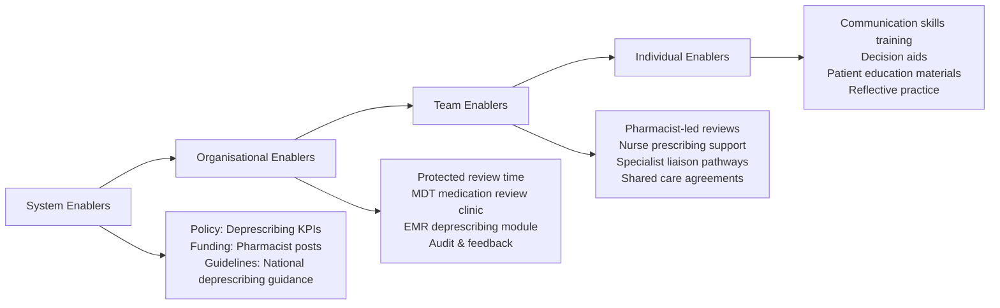
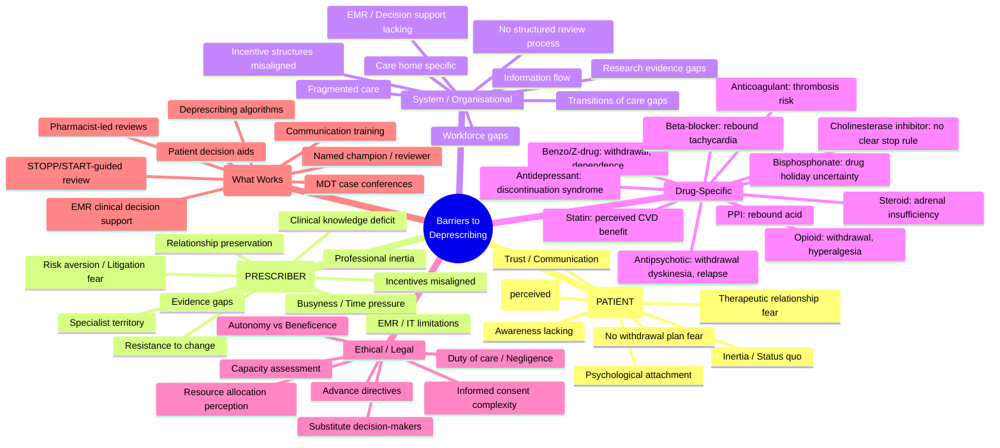

**Parent Topic:** [Polypharmacy and Deprescribing](../../Polypharmacy%20and%20Deprescribing.md) → [Clinical Therapeutics Overview](../../Clinical%20Therapeutics%20and%20Good%20Prescribing%20MOC.md)
**Status:** `full-fcps-mrcp-note`
**Priority:** ⭐⭐⭐ HIGHEST (FCPS/MRCP — implementation science, communication, ethical/legal, systemic factors)
**Source:** Davidson 24th Ed Ch 2; Reeve et al. "Barriers and enablers to deprescribing" (2017); NICE Medicines Optimisation; BGS Good Practice Guide; Cochrane Reviews on Deprescribing Interventions

---

## 1. 1. 🎯 Learning Objectives
- [ ] Categorise barriers: Patient, Prescriber, System, Drug-specific, Ethical/Legal
- [ ] Apply **PATIENT** mnemonic for patient barriers
- [ ] Apply **PRESCRIBER** mnemonic for clinician barriers
- [ ] Identify system/organisational barriers
- [ ] Know enablers/facilitators for each barrier category
- [ ] Apply shared decision-making framework for deprescribing conversations
- [ ] Answer viva: "Why is deprescribing difficult in practice?" and "How to overcome barriers?"

---

## 2. 2. 🧠 Core Concept: Barrier Categories

```mermaid
flowchart TD
    A[Barriers to Deprescribing] --> B[Patient-Level Barriers]
    A --> C[Prescriber-Level Barriers]
    A --> D[System / Organisational Barriers]
    A --> E[Drug-Specific Barriers]
    A --> F[Ethical / Legal Barriers]
    
    B --> B1[Psychological attachment
Fear of withdrawal/relapse
Lack of awareness
Therapeutic relationship
Cognitive impairment
Health literacy]
    C --> C1[Inertia / Status quo bias
Fear of harm / litigation
Lack of knowledge/confidence
Time constraints
Guideline conflict
Therapeutic relationship]
    D --> D1[Fragmented care
Lack of medication review
IT/EMR limitations
Incentive structures
Formulary restrictions
Transitions of care gaps]
    E --> E1[Withdrawal syndromes
Disease rebound
No clear taper protocol
Long half-life / active metabolites
Patient on "specialist" drug]
    F --> F1[Duty of care vs autonomy
Informed consent complexity
Capacity assessment
Advance directives
Medico-legal fear]
```

---

## 3. 3. ️⃣ Patient-Level Barriers: The PATIENT Framework

### 1. PATIENT Mnemonic

| Letter | Barrier | Description | Enabler/Strategy |
|--------|---------|-------------|------------------|
| **P** | **Psychological attachment** | "This pill keeps me alive"; identity tied to medication; fear of losing benefit | Explore beliefs; validate; trial of reduction; emphasise "test dose reduction" not "stopping forever" |
| **A** | **Awareness lacking** | Doesn't know drug is inappropriate; thinks all drugs necessary; unaware of ADRs | Education; show STOPP/START/Beers evidence; shared decision aids; "Your kidney function means this drug accumulates" |
| **T** | **Therapeutic relationship fear** | "My doctor will abandon me"; "Specialist will be angry"; loyalty to prescriber | Continuity of care; involve original prescriber; "We're working together, not against your specialist" |
| **I** | **Inertia / Status quo** | "I've taken it for 20 years"; habit; routine; don't question | Normalise review: "Everyone's meds reviewed yearly"; link to health goals (falls, memory) |
| **E** | **Evidence of benefit (perceived)** | "I feel better on it"; attributes wellness to drug; placebo effect; fear of relapse | Distinguish perception vs evidence; trial reduction with monitoring; "Let's try 4 weeks lower dose" |
| **N** | **No withdrawal plan fear** | Fear of withdrawal symptoms; past bad experience; no taper plan offered | Co-create taper plan; slow taper; rescue plan; "We'll go at your pace, with support" |
| **T** | **Trust/communication issues** | Language barriers; health literacy; cognitive impairment; family conflict | Plain language; teach-back; involve family/carer; interpreter; written plans |

### 2. Additional Patient Barriers
- **Fear of relapse/recurrence** — especially antidepressants, antipsychotics, opioids, PPIs
- **Cognitive impairment** — inability to understand, consent, adhere to taper
- **Family/carer pressure** — "Don't stop mum's pills"; carer burden of monitoring
- **Cost concerns** — "New drug expensive"; "Why stop free drug?"
- **Polypharmacy normalisation** — "Everyone my age takes this many"

---

## 4. 4. ️⃣ Prescriber-Level Barriers: The PRESCRIBER Framework

### 1. PRESCRIBER Mnemonic

| Letter | Barrier | Description | Enabler/Strategy |
|--------|---------|-------------|------------------|
| **P** | **Professional inertia** | "If it ain't broke, don't fix it"; status quo bias; clinical momentum | Routine triggers (age 75, admission, new diagnosis); audit/feedback; "Deprescribing as quality metric" |
| **R** | **Risk aversion / Litigation fear** | "If I stop and patient harmed, I'm liable"; defensive prescribing | Evidence-based guidelines (STOPP/START); documentation of shared decision; medico-legal support |
| **E** | **Evidence gaps** | "No trial data for deprescribing in frail elderly"; uncertainty | Use explicit criteria (STOPP/START); pragmatic approach; "Absence of evidence ≠ evidence of absence" |
| **S** | **Specialist territory** | "Cardiologist started it, not my place to stop"; siloed care | Interdisciplinary communication; shared care agreements; "I'll write to cardiologist with suggestion" |
| **C** | **Clinical knowledge deficit** | Unaware of STOPP/START/Beers; don't know taper protocols; drug interactions | Education/Training; pocket cards; EMR alerts; pharmacist-led reviews |
| **R** | **Relationship preservation** | "Patient will think I'm giving up"; don't want to upset patient | Frame as "optimising"; "Reducing side effects to improve quality of life"; shared decision |
| **I** | **Incentives misaligned** | QOF/Quality payments for *starting* drugs (e.g., ACEi, statin); none for stopping | Align incentives; deprescribing KPIs; "Medication review" as quality indicator |
| **B** | **Busyness / Time pressure** | 10-min consult; review takes 30+ min; no protected time | Dedicated medication review slots; pharmacist-led; pre-review by pharmacist/nurse |
| **E** | **EMR/IT limitations** | No deprescribing module; hard to track taper; no STOPP/START integration | EMR deprescribing templates; taper schedules; decision support alerts |
| **R** | **Resistance to change** | "This is how I've always practiced"; sceptical of guidelines | Audit/feedback; peer champions; case-based learning; show patient outcomes |

### 2. Additional Prescriber Barriers
- **Diagnostic uncertainty** — "Is this symptom drug-related or disease?"
- **Guideline conflict** — Single-disease guidelines say START, multimorbidity says STOPP
- **Lack of follow-up systems** — No safety net for monitoring after deprescribing
- **Formulary/Commissioning restrictions** — Can't switch to preferred alternative

---

## 5. 5. ️⃣ System / Organisational Barriers

| Barrier | Description | Solution/Enabler |
|---------|-------------|------------------|
| **Fragmented care** | Multiple prescribers (GP, cardiologist, psychiatrist, geriatrician, dentist); no single overview | **Named medication reviewer**; shared record; interdisciplinary MDT |
| **Transitions of care gaps** | Admission/discharge/transfer → discrepancies 30–70%; no reconciled list | **Medication reconciliation** at every transition; discharge medication review |
| **Lack of structured review process** | No routine review; repeat prescribing without indication check | **Annual structured review** (age ≥75, care home, ≥10 drugs, frailty); pharmacist-led |
| **EMR/Decision support lacking** | No STOPP/START integration; no taper templates; alerts only for starting | **EMR deprescribing module**; taper schedulers; STOPP/START alerts |
| **Incentive structures** | Pay-for-performance for *starting* (QOF, HEDIS); no reward for stopping | **Deprescribing KPIs**; "Appropriate polypharmacy" metrics; shared savings |
| **Workforce gaps** | No pharmacist in team; GP time-poor; no deprescribing champion | **Embed clinical pharmacist**; deprescribing nurse; training |
| **Information flow** | Specialist letters don't include deprescribing plans; OTC/herbal not recorded | **Standardised communication**; patient-held medication list; include OTC |
| **Care home specific** | "When required" (PRN) given regularly; no review; agency staff | **Regular pharmacist reviews**; STOPP/START for care homes; PRN audit |
| **Research evidence gaps** | Few RCTs of deprescribing outcomes in multimorbidity/frailty | **Pragmatic trials**; real-world evidence; observational data |

---

## 6. 6. ️⃣ Drug-Specific Barriers

| Drug Class | Barrier | Management Strategy |
|------------|---------|---------------------|
| **Benzodiazepines / Z-drugs** | Withdrawal (anxiety, insomnia, seizures); dependence; patient attachment | **Slow taper** (weeks–months); CBT-I for insomnia; switch to melatonin; patient education |
| **Antidepressants (SSRI/SNRI/TCA)** | Discontinuation syndrome (dizziness, electric shocks, flu-like); relapse fear | **Taper over 4+ weeks** (longer if high dose/long duration); monitor; restart if relapse |
| **Antipsychotics** | Withdrawal dyskinesia; relapse (psychosis/BPSD); specialist ONLY perception | **Reduce by 25–50% every 1–2 weeks**; monitor; involve psychiatrist; non-pharm first |
| **Opioids** | Withdrawal (pain, anxiety, GI); hyperalgesia; patient fear of pain | **Taper 10% weekly** (slower if long-term); non-opioid alternatives; pain management plan |
| **PPIs** | Rebound acid hypersecretion; patient "need" for symptom control | **Step down**: PPI → H2RA → antacid → on-demand; lifestyle measures; 4–8 week taper |
| **Beta-blockers** | Rebound tachycardia/HTN; ischaemia risk if CAD | **Taper over 1–2 weeks**; monitor HR/BP; avoid abrupt stop if CAD |
| **Corticosteroids** | Adrenal insufficiency; disease flare | **Physiological taper** (weeks–months); stress dosing education; specialist input |
| **Anticoagulants** | Thrombosis risk if stopped inappropriately | **Only stop if indication resolved** (e.g., AF ablated, VTE >3m provoked); shared decision with haematology |
| **Statins** | Perceived CVD risk; guideline conflict (primary prevention >85) | **Shared decision**; life expectancy discussion; consider stopping if frailty/life expectancy <1y |
| **Bisphosphonates** | "Drug holiday" uncertainty; fracture risk | **Review after 3–5y (oral) / 3y (IV)**; bone density; fracture risk; drug holiday if low risk |
| **Cholinesterase inhibitors** | Perceived cognitive benefit; family resistance; no clear stop rule | **Review at 6–12m**; stop if no benefit (MMSE decline >2-3 points/year, functional decline) |

---

## 7. 7. ️⃣ Ethical & Legal Barriers

| Barrier | Description | Navigation |
|---------|-------------|------------|
| **Autonomy vs Beneficence** | Patient wants to continue; clinician thinks harm > benefit | **Shared decision-making**; informed consent; respect refusal if capacity |
| **Capacity assessment** | Cognitive impairment → can patient consent to deprescribing? | **Mental Capacity Act** (UK) / local law; assess decision-specific; involve advocate/family |
| **Advance directives** | Patient previously said "never stop my heart pills" | **Review in context**; current best interest; advance care planning conversations |
| **Duty of care / Negligence** | Fear: "If I deprescribe and harm occurs, I'm negligent" | **Evidence-based guidelines** (STOPP/START); documentation; shared decision = defence |
| **Informed consent complexity** | Explaining uncertainty, NNT/NNH, withdrawal risk in 10 mins | **Decision aids**; written info; pharmacist support; multiple conversations |
| **Substitute decision-makers** | Family demands continue/stop against patient wishes/clinician view | **Best interest framework**; patient's known wishes; ethics consultation if conflict |
| **Resource allocation** | "Deprescribing saves money — is that the motive?" | **Transparent**: "Goal is safety/quality, not cost"; patient benefit primary |

---

## 8. 8. ️⃣ Enablers / Facilitators: Overcoming Barriers

### 1. Multilevel Intervention Framework



### 2. Evidence-Based Enablers (What Works)

| Intervention | Evidence | Effect |
|--------------|----------|--------|
| **Pharmacist-led medication review** | Cochrane RCT meta-analysis | ↓ PIMs 20–30%; ↓ ADRs; ↓ falls |
| **STOPP/START-guided review** | RCT (O'Mahony et al.) | ↓ PIMs 40%; ↓ ADRs; cost-saving |
| **Patient decision aids** | Systematic review | ↑ Knowledge; ↑ participation; ↑ deprescribing |
| **Multidisciplinary case conferences** | Geriatric evaluation trials | ↓ Inappropriate drugs; ↑ appropriate drugs |
| **EMR clinical decision support** | Cluster RCT (STOPP/START alerts) | ↓ PIM prescribing at point of care |
| **Deprescribing algorithms/protocols** | Implementation studies | ↑ Confidence; ↑ deprescribing rates |
| **Communication training (shared decision-making)** | Qualitative + RCT | ↑ Patient satisfaction; ↑ adherence to taper |
| **Named medication reviewer / champion** | Service evaluations | Sustained culture change; ↑ review rates |

---

## 9. 9. ️⃣ Deprescribing Conversation Framework: The 5-Step Approach

### 1. Step 1: Prepare
- Review medications (STOPP/START, Beers, ACB, FORTA)
- Identify target drugs (PIMs, high ACB, no indication)
- Check guidelines, taper protocols, alternatives
- Consider patient context: goals, frailty, life expectancy, preferences

### 2. Step 2: Introduce
> **"I'd like to review your medications to make sure they're still the best for you. Some medicines that were right before might not be right now. Can we talk about this?"**

### 3. Step 3: Explore (Shared Decision-Making)
| Technique | Example |
|-----------|---------|
| **Ask-Tell-Ask** | "What do you know about this medicine?" → Tell evidence → "What do you think?" |
| **Elicit goals** | "What matters most to you? Staying independent? Avoiding falls? Memory?" |
| **Present options** | "We could continue, reduce slowly, or stop with a plan. What feels right?" |
| **Use numbers** | "Out of 100 people like you, this drug prevents 2 heart attacks but causes 10 falls." |
| **Address fears** | "You're worried about withdrawal. We'll go very slowly, and I'll see you weekly." |

### 4. Step 4: Agree & Plan
- **Co-create taper plan**: Drug, current dose, reduction schedule, monitoring, rescue plan
- **Written plan** given to patient/carer
- **Follow-up schedule** (phone/video/in-person at 1–2 weeks, then monthly)
- **Safety net**: "If X happens, call Y / go to Z"

### 5. Step 5: Monitor & Review
- Assess for: withdrawal symptoms, disease recurrence, ADR resolution, goal achievement
- Adjust taper speed: slower if symptoms, faster if well
- Celebrate success: "You've stopped 3 drugs and feel steadier on your feet!"
- Document outcome in EMR (deprescribing outcome: success/partial/failed)

---

## 10. 10. ️⃣ Special Populations: Extra Barriers

| Population | Extra Barriers | Adaptations |
|------------|----------------|-------------|
| **Care Home Residents** | PRN given regularly; agency staff; no GP review; family distant; swallowing issues | **Pharmacist-led 6-monthly reviews**; STOPP/START; PRN audit; liquid formulations |
| **Dementia / Cognitive Impairment** | Capacity fluctuates; can't self-report ADRs; family proxy; behavioural expressions of distress | **Best interest decisions**; involve family/advocate; observational pain/distress scales; slow tapers |
| **End of Life / Palliative** | Goal shift: comfort > prevention; "Why stop statin if dying?"; symptom control priority | **Explicit goals-of-care conversation**; STOPPFrail criteria; stop preventives (statin, bisphosphonate, antihypertensive if asymptomatic) |
| **Intellectual Disability** | Communication barriers; carer-dependent; atypical ADR presentation; long-term psychotropics | **Annual health check + med review**; easy-read materials; carer education; specialist LD psychiatrist |
| **Ethnic Minority / Non-English Speakers** | Health literacy; cultural beliefs about medicines; interpreter access; trust | **Professional interpreter**; culturally adapted materials; community pharmacist; family involvement |

---

## 11. 11. ⚡ FCPS/MRCP High-Yield Summary

| Barrier Category | Key Barriers | Key Enablers |
|------------------|--------------|--------------|
| **Patient (PATIENT)** | Psychological attachment, Awareness lack, Therapeutic relationship fear, Inertia, Evidence of benefit (perceived), No withdrawal plan, Trust/communication | Education, shared decision aids, trial reduction, co-created taper, continuity |
| **Prescriber (PRESCRIBER)** | Professional inertia, Risk aversion, Evidence gaps, Specialist territory, Clinical knowledge deficit, Relationship preservation, Incentives misaligned, Busyness, EMR limitations, Resistance to change | Routine triggers, guidelines, documentation, interdisciplinary comms, training, protected time, EMR tools, champion |
| **System** | Fragmented care, Transition gaps, No review process, Poor EMR, Misaligned incentives, Workforce gaps, Info flow, Care home issues | Named reviewer, reconciliation, annual review, EMR module, deprescribing KPIs, embedded pharmacist, standardised comms |
| **Drug-Specific** | Withdrawal syndromes (benzos, ADs, antipsychotics, opioids, PPIs, BBs, steroids); disease rebound; no taper protocol | Evidence-based taper schedules; monitoring; patient education; specialist liaison |
| **Ethical/Legal** | Autonomy vs beneficence, Capacity, Advance directives, Negligence fear, Informed consent complexity, Substitute decision-makers | Shared decision-making, capacity assessment, documentation, decision aids, best interest framework |

---

## 12. 12. 🎤 Viva Questions (Expected Answers)

| # | Question | Expected Answer |
|---|----------|-----------------|
| 1 | What are the main categories of barriers to deprescribing? | **Patient-level, Prescriber-level, System/Organisational, Drug-specific, Ethical/Legal** |
| 2 | Use the PATIENT mnemonic to describe patient barriers. | **P**sychological attachment, **A**wareness lacking, **T**herapeutic relationship fear, **I**nertia, **E**vidence of benefit (perceived), **N**o withdrawal plan fear, **T**rust/communication issues |
| 3 | Use the PRESCRIBER mnemonic for clinician barriers. | **P**rofessional inertia, **R**isk aversion, **E**vidence gaps, **S**pecialist territory, **C**linical knowledge deficit, **R**elationship preservation, **I**ncentives misaligned, **B**usyness, **E**MR limitations, **R**esistance to change |
| 4 | Why do prescribers fear litigation when deprescribing? | "If I stop a drug and patient harmed, I'm liable." Defensive prescribing. **Enabler**: Evidence-based guidelines (STOPP/START), documentation of shared decision-making, medico-legal advice. |
| 5 | What system changes would facilitate deprescribing? | Protected review time, pharmacist-led reviews, EMR deprescribing module, deprescribing KPIs, medication reconciliation at transitions, named medication reviewer, MDT case conferences. |
| 6 | Patient on lorazepam 2mg nocte × 10 years refuses to stop. Barriers? | **Patient**: Psychological attachment, fear of withdrawal/insomnia, perceived benefit. **Prescriber**: Relationship preservation, time, lack of taper confidence. **Approach**: Empathise, educate on risks (falls, cognition), co-create VERY slow taper (0.25mg reduction every 2–4 weeks), CBT-I, melatonin, regular follow-up. |
| 7 | How do you handle "Specialist started it, I can't stop it"? | **Communication**: Write to specialist with STOPP/START evidence, propose taper plan, ask for agreement. **Shared care agreement**: Define deprescribing responsibilities. **If urgent safety issue**: Stop with documentation, inform specialist. |
| 8 | What is the 5-step deprescribing conversation framework? | 1. **Prepare** (review, identify targets), 2. **Introduce** (normalize review), 3. **Explore** (shared decision-making, ask-tell-ask, goals, options, numbers), 4. **Agree & Plan** (co-create taper, written plan, follow-up, safety net), 5. **Monitor & Review** (withdrawal, recurrence, adjust, document). |
| 9 | End-of-life patient on statin, bisphosphonate, ACEi. Family wants all continued. | **Goals-of-care conversation**: Shift from prevention to comfort. **STOPPFrail**: Stop statin, bisphosphonate (no benefit in limited life expectancy). ACEi: continue if symptomatic HF, else consider stop. **Frame**: "These won't help comfort; they add pill burden and side effects." |
| 10 | What evidence-based interventions increase deprescribing success? | **Pharmacist-led reviews** (Cochrane: ↓ PIMs 20–30%), **STOPP/START-guided review** (↓ PIMs 40%), **Patient decision aids** (↑ participation), **MDT case conferences**, **EMR decision support** (↓ PIM prescribing), **Deprescribing algorithms**, **Communication training**. |

---

## 13. 13. 🧩 Confusions & Mnemonics

| Confusion | Clarification |
|-----------|---------------|
| **"Deprescribing = stopping drugs"** | Deprescribing = **planned, supervised, monitored dose reduction OR stopping** of inappropriate medication. Not abrupt cessation. |
| **"If patient refuses, I can't deprescribe"** | **Respect autonomy** if capacity. Document shared decision. Revisit later. Exception: immediate safety risk (e.g., hypoglycaemia on sulfonylurea in CKD) → may need to act in best interest. |
| **"Specialist drugs are off-limits"** | **Collaborate, don't abdicate.** GPs can and should question specialist prescriptions if inappropriate. Specialist liaison pathways help. |
| **"No evidence for deprescribing = don't do it"** | **Absence of evidence ≠ evidence of absence.** Use explicit criteria (STOPP/START), physiological reasoning, NNT/NNH. Pragmatic approach. |
| **"Deprescribing saves money → that's the motive"** | **Primary goal = patient safety/quality of life.** Cost-saving is secondary benefit. Be transparent with patients. |
| **"Older people don't want to stop drugs"** | **Many DO want fewer pills** when risks explained. Studies show ~90% willing to stop ≥1 drug if doctor recommends. |

> **Mnemonic: BARRIERS TO DEPRESCRIBING**  
> **B**eliefs (patient): Psychological attachment, perceived benefit, fear of relapse  
> **A**wareness: Patient doesn't know drug inappropriate; prescriber doesn't know STOPP/START  
> **R**elationship fears: Patient fears abandonment; prescriber fears upsetting patient  
> **R**isk aversion: Litigation fear; defensive prescribing; "if I stop and harm..."  
> **I**nertia: Status quo bias (both patient & prescriber); "always been on it"  
> **E**vidence gaps: No deprescribing RCTs in frail multimorbid; guideline conflict  
> **R**esources: Time, pharmacist, EMR support, protected review slots  
> **S**ystem fragmentation: Multiple prescribers, no overview, transition gaps  
> **T**aper complexity: Withdrawal syndromes, no protocols, disease rebound fear  
> **O**rganisational incentives: QOF rewards starting, not stopping; no deprescribing KPIs  
> **D**rug-specific: Benzos, ADs, antipsychotics, opioids, PPIs, steroids — each needs protocol  
> **E**thical/Legal: Autonomy vs beneficence, capacity, advance directives, negligence fear  
> **P**atient factors: Cognitive impairment, health literacy, family pressure, cost concerns  
> **R**esistance to change: "Always done it this way"; scepticism of guidelines  
> **E**MR limitations: No taper templates, no STOPP/START alerts, hard to track  
> **S**pecialist territory: "Not my drug to stop"; siloed care, no shared agreements  
> **C**ommunication gaps: No shared decision-making skills; no decision aids; language barriers  
> **R**eview absence: No routine trigger; repeat prescribing without indication check  
> **I**ncentives misaligned: Pay for starting, not stopping; volume over value  
> **B**usyness: 10-min consult; review needs 30+ min; no protected time  
> **I**nformation flow: Specialist letters no deprescribing plan; OTC/herbal not recorded  
> **N**o follow-up system: No safety net after deprescribing; who monitors?  
> **G**oals of care mismatch: Prevention vs comfort (especially end-of-life)

---

## 14. 14. 🗺️ Mind Map



---

## 15. 15. 📅 Spaced Repetition Tracker

| Review | Date | Score (0–5) | Notes |
|--------|------|-------------|-------|
| Day 1 | | | |
| Day 3 | | | |
| Day 7 | | | |
| Day 14 | | | |
| Day 30 | | | |
| Day 90 | | | |

---

## 16. 16. 📝 Self-Test Scorecard

| Section | Max | Score | % |
|---------|-----|-------|---|
| PATIENT mnemonic (7 patient barriers) | 4 | | |
| PRESCRIBER mnemonic (10 prescriber barriers) | 4 | | |
| System barriers (5+) | 3 | | |
| Drug-specific barriers (5+ classes) | 3 | | |
| Ethical/legal barriers (4+) | 2 | | |
| Enablers / 5-step conversation framework | 4 | | |
| **Total** | **20** | | |

---

## 17. 17. 💬 Exam Answer Modes

| Format | Prompt | Key Points |
|--------|--------|------------|
| **Long Essay** | "Discuss barriers to deprescribing in older adults and strategies to overcome them." | PATIENT, PRESCRIBER, System, Drug-specific, Ethical; Enablers: pharmacist reviews, STOPP/START, decision aids, MDT, EMR, algorithms, communication training |
| **Short Note** | "Patient barriers to deprescribing (PATIENT mnemonic)." | 7 barriers with enablers |
| **Viva** | "80yo on diazepam 5mg × 20 years. Daughter says 'don't stop it'. How to approach?" | Explore fears (PATIENT), educate risks (falls, cognition), shared decision, co-create VERY slow taper (0.5mg q2-4w), CBT-I, melatonin, involve daughter, regular review, document |
| **Ward Round** | "Patient on quetiapine 100mg for dementia agitation × 3 years. STOPP says stop. Psychiatrist started it." | STOPP C10 (antipsychotic BPSD >12w). Write to psychiatrist with evidence. Propose taper 25% q1-2w. Monitor BPSD. Non-pharm first. If refusal: document shared decision, revisit. |
| **Last-Night** | "Barriers: 3 patient, 3 prescriber, 3 system. Enablers: 3 evidence-based. 5-step conversation." | PATIENT (3), PRESCRIBER (3), System (fragmented, transitions, no review). Enablers: pharmacist review, STOPP/START, decision aids. 5-step: Prepare, Introduce, Explore, Agree, Monitor. |

---

## 18. 18. 📌 Summary
- **Patient barriers (PATIENT)**: Psychological attachment, Awareness lacking, Therapeutic relationship fear, Inertia, Evidence of benefit (perceived), No withdrawal plan, Trust/communication
- **Prescriber barriers (PRESCRIBER)**: Professional inertia, Risk aversion, Evidence gaps, Specialist territory, Clinical knowledge deficit, Relationship preservation, Incentives misaligned, Busyness, EMR limitations, Resistance to change
- **System barriers**: Fragmented care, Transition gaps, No review process, Poor EMR, Misaligned incentives, Workforce gaps
- **Drug-specific**: Withdrawal syndromes (benzos, ADs, antipsychotics, opioids, PPIs, BBs, steroids), rebound, disease recurrence, no taper protocols
- **Ethical/Legal**: Autonomy vs beneficence, capacity, advance directives, negligence fear, informed consent complexity
- **Enablers**: Pharmacist-led reviews, STOPP/START, decision aids, MDT, EMR support, algorithms, communication training, named champion
- **Conversation**: Prepare → Introduce → Explore (shared decision) → Agree & Plan (co-create taper) → Monitor & Review

---

## 19. 19. ❓ MCQs (10)

1. **PATIENT mnemonic: "P" stands for:**  
   A. Polypharmacy  B. **Psychological attachment**  C. Prescriber  D. Protocol  
   *Answer: B. Psychological attachment — "This pill keeps me alive."*

2. **PRESCRIBER mnemonic: "R" (first R) stands for:**  
   A. Review  B. **Risk aversion / Litigation fear**  C. Resistance  D. Relationship  
   *Answer: B. Risk aversion / Litigation fear — "If I stop and harm occurs, I'm liable."*

3. **Which is a SYSTEM barrier to deprescribing?**  
   A. Patient fears withdrawal  B. Prescriber lacks knowledge  C. **Fragmented care with multiple prescribers**  D. Drug has withdrawal syndrome  
   *Answer: C. Fragmented care = system barrier. Others are patient, prescriber, drug-specific.*

4. **Most common patient barrier to deprescribing benzodiazepines?**  
   A. Cost  B. **Fear of withdrawal/insomnia recurrence**  C. Lack of awareness  D. Family pressure  
   *Answer: B. Fear of withdrawal symptoms and return of insomnia/anxiety.*

5. **Evidence-based enabler with strongest RCT evidence:**  
   A. Patient leaflets  B. **Pharmacist-led medication review**  C. GP education  D. EMR alerts alone  
   *Answer: B. Cochrane meta-analysis: pharmacist-led reviews ↓ PIMs 20–30%, ↓ ADRs, ↓ falls.*

6. **In the 5-step conversation, "Explore" involves:**  
   A. Writing the taper plan  B. **Shared decision-making: ask-tell-ask, elicit goals, present options, use numbers**  C. Checking blood tests  D. Contacting specialist  
   *Answer: B. Explore = shared decision-making conversation.*

7. **End-of-life deprescribing: which preventive drug is MOST appropriate to stop?**  
   A. Beta-blocker for HFrEF  B. **Statin for primary prevention**  C. Anticoagulant for AF  D. Inhaler for COPD  
   *Answer: B. Statin primary prevention: no benefit in limited life expectancy (STOPPFrail). BB for HFrEF = symptom control. Anticoag for AF = stroke prevention (symptom if stroke). Inhaler = symptom control.*

8. **Prescriber barrier: "Cardiologist started the amiodarone, not my place to stop." This is:**  
   A. Professional inertia  B. **Specialist territory**  C. Risk aversion  D. Evidence gaps  
   *Answer: B. Specialist territory (PRESCRIBER "S").*

9. **Deprescribing is defined as:**  
   A. Stopping all unnecessary drugs abruptly  B. **Planned, supervised dose reduction or stopping of inappropriate medication with monitoring**  C. Switching to cheaper generics  D. Reducing doses due to renal impairment only  
   *Answer: B. Key elements: planned, supervised, inappropriate medication, monitoring.*

10. **Which intervention has NO evidence for increasing deprescribing?**  
    A. Pharmacist-led review  B. STOPP/START-guided review  C. **Passive education leaflets alone**  D. Patient decision aids  
    *Answer: C. Passive leaflets alone ineffective. Need active shared decision-making, decision aids, pharmacist support.*

---

## 20. 20. 📋 SBAs (10)

1. **85F on temazepam 20mg nocte × 15y for insomnia. Refuses to stop: "I won't sleep." Most likely barrier?**  
   A. Cost  B. **Fear of withdrawal/relapse (Patient: No withdrawal plan fear, Evidence of benefit)**  C. Lack of awareness  D. Family pressure  
   *Answer: B. PATIENT "N" (No withdrawal plan fear) and "E" (Evidence of benefit perceived).*

2. **GP wants to stop patient's amitriptyline 50mg (neuropathic pain) per STOPP. Patient on it 10y. Best approach?**  
   A. Stop immediately  B. **Co-create slow taper (10mg reduction q2w), offer duloxetine/gabapentin, regular review**  C. Refer to pain clinic only  D. Continue, document exception  
   *Answer: B. Taper + alternative + monitoring = safe deprescribing.*

3. **Care home resident on 12 drugs. No medication review in 2 years. System barrier?**  
   A. Patient refusal  B. **Lack of structured review process**  C. Prescriber knowledge deficit  D. Drug withdrawal risk  
   *Answer: B. System: no routine review process for care homes.*

4. **Patient with dementia (MMSE 15) on risperidone 1mg BD for agitation × 2y. Daughter (proxy) insists continue. STOPP triggered. Action?**  
   A. Stop immediately  B. **Best interest meeting: discuss risks (stroke, mortality), propose slow taper, non-pharm alternatives, document**  C. Defer to daughter  D. Increase dose  
   *Answer: B. Capacity impaired → best interest decision. Document discussion. Slow taper if agreed.*

5. **GP practice: QOF pays for statin prescribing in CVD. No incentive for stopping statin in frail 90yo. Barrier?**  
   A. Clinical knowledge  B. **Incentives misaligned (PRESCRIBER "I")**  C. EMR limitations  D. Specialist territory  
   *Answer: B. PRESCRIBER "I" = Incentives misaligned.*

6. **Deprescribing conversation Step 3 (Explore) — which technique is used?**  
   A. Write prescription  B. **Ask-Tell-Ask + elicit goals + present options + use numbers**  C. Order blood test  D. Refer to specialist  
   *Answer: B. Core shared decision-making techniques.*

7. **Patient on PPI 40mg OD × 5y for "dyspepsia" (no endoscopy). STOPP C14. Taper plan?**  
   A. Stop immediately  B. **Step down: 40mg → 20mg 4w → 20mg alt day 4w → H2RA PRN 4w → stop; lifestyle advice**  C. Continue indefinitely  D. Switch to ranitidine  
   *Answer: B. PPI taper: step down over 8–12 weeks to avoid rebound acid hypersecretion.*

8. **End-of-life patient (weeks prognosis) on atorvastatin, alendronate, ramipril, morphine. Which to CONTINUE?**  
   A. Atorvastatin  B. Alendronate  C. **Ramipril (if symptomatic HF)**  D. All preventive  
   *Answer: C. Ramipril if symptomatic HF = symptom control. Statin/bisphosphonate = stop (STOPPFrail). Morphine = symptom control.*

9. **Most effective single intervention to reduce PIMs in primary care?**  
   A. GP education seminar  B. **Pharmacist-led medication review**  C. EMR alert pop-up  D. Patient leaflet  
   *Answer: B. Strongest RCT evidence (Cochrane).*

10. **Ethical principle primarily challenged when patient with capacity refuses deprescribing of a harmful drug?**  
    A. Beneficence  B. **Autonomy**  C. Non-maleficence  D. Justice  
    *Answer: B. Autonomy (patient's right to decide) vs Beneficence (clinician's duty to do good). Respect autonomy if capacity.*

---

## 21. 21. 🔑 Answer Keys
| MCQs | SBAs |
|------|------|
| 1-B, 2-B, 3-C, 4-B, 5-B, 6-B, 7-B, 8-B, 9-B, 10-C | 1-B, 2-B, 3-B, 4-B, 5-B, 6-B, 7-B, 8-C, 9-B, 10-B |

---

## 22. 22. 🔗 Cross-Links
- [[Polypharmacy and Deprescribing/Definition and Consequences]] — why deprescribing needed
- [[Polypharmacy and Deprescribing/Assessment Tools]] — STOPP/START, Beers, ACB, FORTA to identify targets
- [[Polypharmacy and Deprescribing/Deprescribing Algorithms]] — specific taper protocols per drug class
- [[Special Populations/Elderly Prescribing]] — multimorbidity, frailty context
- [[Clinical Context/Palliative Care]] — end-of-life deprescribing (STOPPFrail)
- [[Medication Safety and Errors/Error Types]] — ADRs from inappropriate polypharmacy
- [[Therapeutic Drug Monitoring]] — monitoring during tapers (lithium, anticonvulsants, immunosuppressants)
