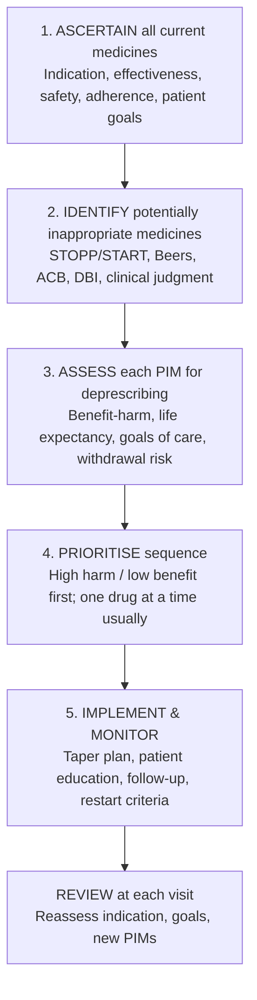
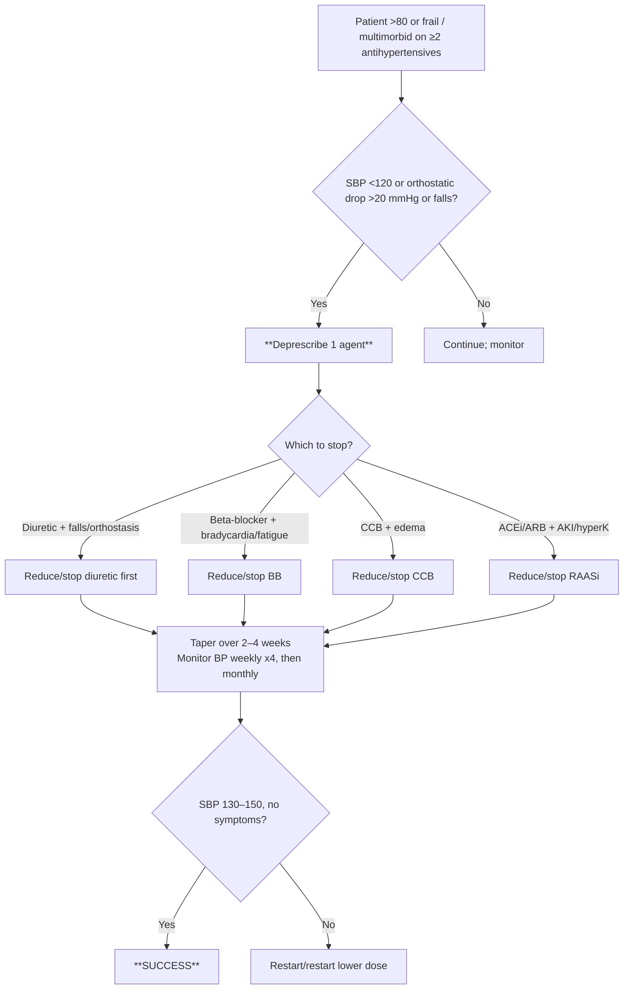
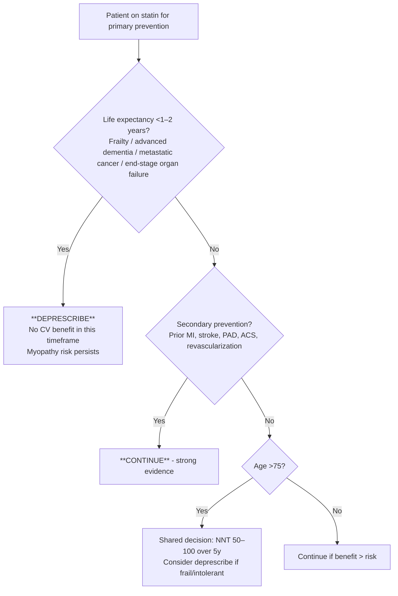
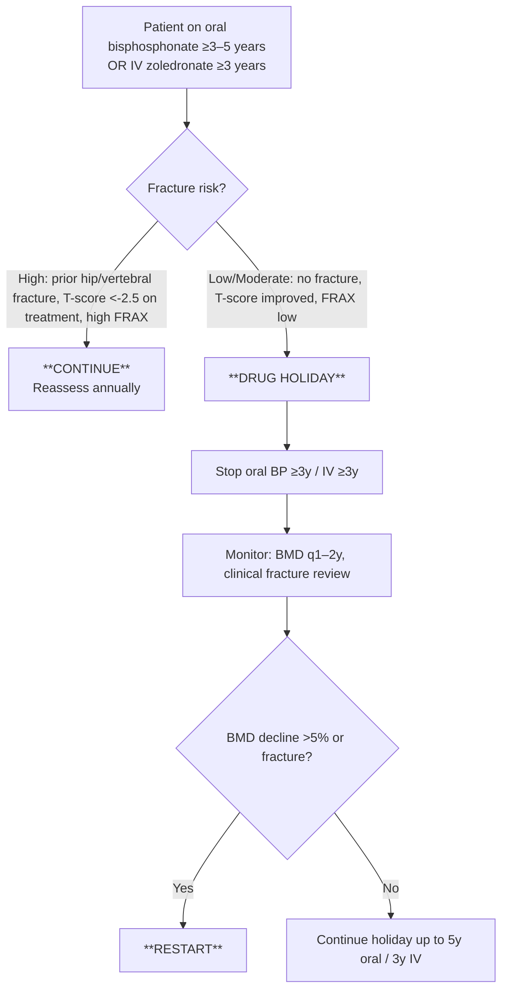
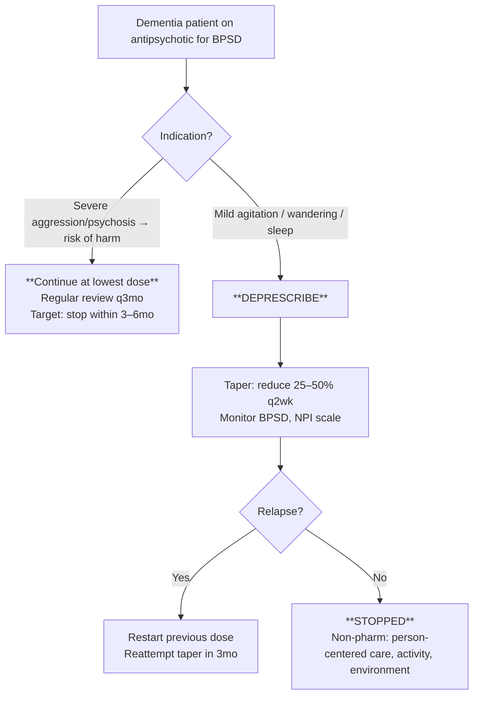
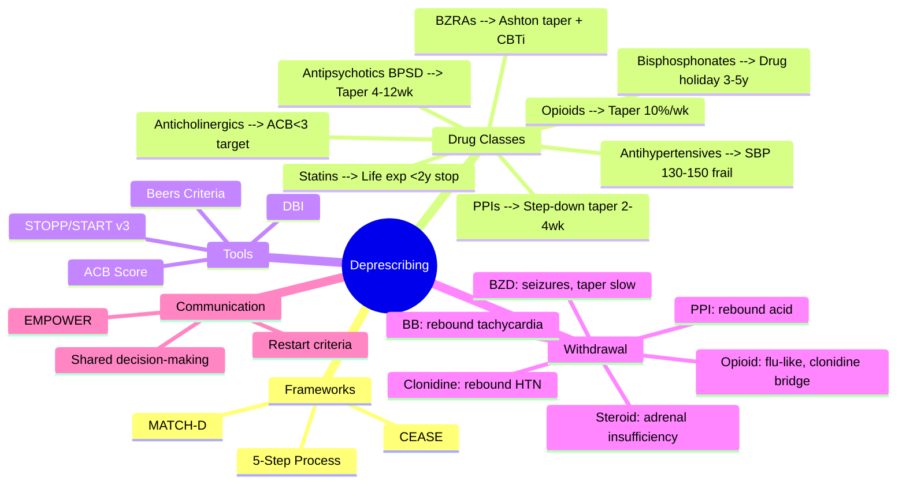

**Status**: `draft` | **Chapter**: 2 — Clinical Therapeutics and Good Prescribing | **Heading**: Polypharmacy & Deprescribing | **Exam Priority**: ⭐⭐⭐ **HIGHEST** (FCPS/MRCP ward rounds, SBA favorites, patient safety)

---

## 1. 1. 🎯 Learning Objectives
- [ ] Define deprescribing and distinguish from non-adherence / dose reduction
- [ ] Apply structured deprescribing frameworks (5-step, CEASE, MATCH-D)
- [ ] Execute drug-class specific algorithms (PPIs, benzodiazepines, anticholinergics, antihypertensives, statins, bisphosphonates, antipsychotics, opioids)
- [ ] Calculate Antichognitive Burden (ACB) and Drug Burden Index (DBI)
- [ ] Manage withdrawal syndromes and rebound phenomena
- [ ] Communicate deprescribing decisions (shared decision-making, EMPOWER brochure)

---

## 2. 2. 📐 Core Deprescribing Frameworks

### 1. 5-Step Deprescribing Process (Reeve et al.)


### 2. CEASE Algorithm (Australian)
| Step | Action |
|------|--------|
| **C**urrent medications | List all with indication, dose, duration |
| **E**levated risk | Identify PIMs (STOPP, Beers, clinical judgment) |
| **A**ssess | Benefit vs harm, alignment with goals, withdrawal risk |
| **S**top/Reduce | Prioritise, taper, monitor |
| **E**valuate | Review outcomes, document, communicate |

### 3. MATCH-D Criteria (for Dementia)
| M | **M**edication review indicated? |
|---|---|
| A | **A**ppropriate indication? |
| T | **T**ime to benefit > life expectancy? |
| C | **C**ognitive/functional impairment from drug? |
| H | **H**arm > benefit? |
| D | **D**ecision: deprescribe? |

---

## 3. 3. 💊 Drug-Class Specific Deprescribing Algorithms

### 1. 1. Proton Pump Inhibitors (PPIs) — **#1 Deprescribing Target**

```mermaid
flowchart TD
    A[Patient on PPI >4–8 weeks] --> B{Current Indication?}
    B -->|GERD healed / asymptomatic| C[**Step-down approach**]
    B -->|Uncomplicated GERD maintenance| C
    B -->|Stress ulcer prophylaxis (ICU) discharged| C
    B -->|Barrett's / Severe erosive esophagitis / Zollinger-Ellison / Chronic NSAID/anticoagulant + GI risk| D[**CONTINUE** - long-term indication]
    B -->|H. pylori eradicated| C
    C --> E[Taper: daily → alternate day → PRN → stop\nOR switch to H2RA PRN]
    E --> F{Relapse symptoms?}
    F -->|Yes| G[Restart lowest effective dose\nReassess need for maintenance]
    F -->|No| H[**SUCCESSFULLY DEPRESCRIBED**\nLifestyle: weight loss, head elevation, avoid triggers]
```

**Rebound Acid Hypersecretion**: 40–60% after abrupt stop → **taper 2–4 weeks**
**Restart Criteria**: Troublesome symptoms >2x/week, erosive esophagitis on endoscopy

---

### 2. 2. Benzodiazepines / Z-drugs (BZRA)

```mermaid
flowchart TD
    A[Patient on BZRA >4 weeks] --> B{Indication still valid?}
    B -->|Insomnia: CBT-i available| C[**TAPER & STOP**]
    B -->|Anxiety: SSRI/SNRI optimized| C
    B -->|Spasticity / Alcohol withdrawal / Palliative| D[**CONTINUE** - review regularly]
    B -->|Seizure disorder (clonazepam)| D
    C --> E[Taper schedule:\n• Short-acting (lorazepam, oxazepam, zopiclone): reduce 25% q1–2wk\n• Long-acting (diazepam, clonazepam): reduce 10–25% q1–2wk\n• Convert to diazepam equivalent if complex\n• Slower if high dose / long duration / elderly]
    E --> F{Withdrawal symptoms?}
    F -->|Mild: anxiety, insomnia, tremor| G[Pause taper 1–2 weeks\nNon-pharm: CBT-i, sleep hygiene, relaxation]
    F -->|Severe: seizures, psychosis, delirium| H[Return to previous dose\nSlower taper: 5–10% q2–4wk]
    F -->|None| I[Continue taper to zero]
```

**Ashton Manual** taper (diazepam equivalent):
- >40 mg diazepam eq: reduce 2 mg q1–2wk
- 20–40 mg: reduce 1–2 mg q1–2wk
- 10–20 mg: reduce 1 mg q1–2wk
- <10 mg: reduce 0.5 mg q1–2wk

---

### 3. 3. Anticholinergics (ACB ≥3 Target)

```mermaid
flowchart TD
    A[Calculate ACB Score\n≥3 = high priority] --> B{Identify ACB contributors}
    B -->|Tricyclics (amitriptyline 3)| C[Switch: duloxetine, nortriptyline (ACB 1), gabapentinoid]
    B -->|First-gen antihistamines (diphenhydramine 3)| C2[Switch: cetirizine, loratadine (ACB 0)]
    B -->|Antispasmodics (oxybutynin 3)| C3[Switch: mirabegron, solifenacin (ACB 1)]
    B -->|Antipsychotics (chlorpromazine 3, olanzapine 3)| C4[Reduce dose / switch: quetiapine (1), aripiprazole (1)]
    B -->|Opioids (morphine 1, codeine 1)| C5[Review indication; non-opioid alternatives]
    C & C2 & C3 & C4 & C5 --> D[Taper one at a time\nMonitor cognition, falls, constipation]
    D --> E{Reassess ACB at 4–12 weeks}
    E -->|ACB <3| F[**TARGET ACHIEVED**]
    E -->|ACB ≥3| G[Next agent]
```

**ACB Scale (0–3):**
- 0 = none; 1 = mild; 2 = moderate; 3 = severe
- **Target ACB <3** (↑ falls, delirium, dementia progression, mortality)

---

### 4. 4. Antihypertensives (Overtreatment in Frail Elderly)



**STOPP v3**: "Antihypertensives → SBP <120 mmHg in frail elderly" = PIM
**Target SBP**: 130–150 mmHg (frail >80); <130 if robust with CVD

---

### 5. 5. Statins (Primary Prevention in Limited Life Expectancy)



**Key**: NNT for primary prevention >75yo = ~50–100 over 5 years; **time-to-benefit 2–3 years**

---

### 6. 6. Bisphosphonates (Drug Holiday)



**Drug Holiday Evidence**: FLEX trial (alendronate 10y vs 5y+5y holiday) — similar non-vertebral fracture; ↑ clinical vertebral fracture in holiday group.

---

### 7. 7. Antipsychotics in Dementia (BPSD)



**Black Box Warning**: ↑ mortality (1.6–1.7x), ↑ stroke (3x) in dementia
**STOPP v3**: Antipsychotic for BPSD >12 weeks without review = PIM

---

### 8. 8. Opioids (Chronic Non-Cancer Pain)

```mermaid
flowchart TD
    A[Patient on chronic opioid >3 months] --> B{Functional improvement?\nPain score ↓30% + function ↑}
    B -->|No| C[**DEPRESCRIBE**]
    B -->|Yes but high risk (OME >90, sedatives, resp disease)| D[**TAPER TO SAFER DOSE**]
    B -->|Yes, low risk| E[Continue; review q3mo]
    C --> F[Taper schedule:\n• OME <50mg: reduce 10% q1wk\n• OME 50–90mg: reduce 10% q2wk\n• OME >90mg: reduce 5–10% q2–4wk\n• Pause if withdrawal\n• Non-opioid: duloxetine, gabapentinoid, PT, CBT]
    F --> G{MME <50 or off?}
    G -->|Yes| H[**SUCCESS**]
    G -->|No| I[Continue taper]
```

**CDC 2022 / NICE 2021**: Avoid >90 MME; taper if no benefit

---

## 4. 4. 📊 Anticholinergic Burden (ACB) & Drug Burden Index (DBI)

### 1. ACB Calculation (Cumulative)
| ACB Score | Examples |
|-----------|----------|
| **0** | Most antibiotics, antihypertensives, statins, PPIs, metformin |
| **1** | Ranitidine, nortriptyline, paroxetine, quetiapine, solifenacin, digoxin, prednisone |
| **2** | Amitriptyline (some scales), doxepin, clomipramine, chlorpheniramine, cyproheptadine |
| **3** | **Amitriptyline, imipramine, doxepin >50mg, chlorpromazine, olanzapine, clozapine, oxybutynin, tolterodine, diphenhydramine, hydroxyzine, cyclizine, promethazine, scopolamine, atropine, benztropine, trihexyphenidyl** |

**Target**: ACB **<3** (each point ↑ falls 1.2x, delirium 1.5x, cognitive decline)

### 2. DBI (Drug Burden Index)
$$DBI = \sum \frac{D}{D + \delta}$$
- $D$ = daily dose; $\delta$ = dose for 50% maximal effect
- **Sedation + Anticholinergic sub-scores**
- DBI ≥1 = ↑ falls, ↓ function, ↑ hospitalization

---

## 5. 5. 🛑 Withdrawal Syndromes & Rebound Management

| Drug Class | Withdrawal Syndrome | Onset | Duration | Management |
|------------|-------------------|-------|----------|------------|
| **Benzodiazepines** | Anxiety, insomnia, tremor, seizures, psychosis | 6–12h (short) / 2–7d (long) | Weeks–months | Slow taper (Ashton), diazepam conversion, CBT-i |
| **Antidepressants (SSRI/SNRI)** | Dizziness, "brain zaps", nausea, anxiety, flu-like | 1–3 days | 1–3 weeks | Taper 4+ weeks; fluoxetine self-tapers (long t½) |
| **Beta-blockers** | Rebound tachycardia, hypertension, angina, MI | 1–3 days | 1–2 weeks | Taper 2–4 weeks; avoid abrupt stop in CAD |
| **Clonidine** | Rebound hypertension (↑↑ BP), anxiety, tremor | 12–24h | Days | Taper 1–2 weeks; never stop abruptly |
| **Corticosteroids** | Adrenal insufficiency, fatigue, arthralgia, hypotension | Days–weeks | Weeks–months | Taper by 2.5–5mg q1–2wk (prednisolone); assess HPA axis |
| **Opioids** | Yawning, sweating, diarrhea, anxiety, piloerection | 6–12h (short) / 24–48h (long) | 5–10 days | Taper 10%/wk; clonidine 0.1mg PRN, loperamide, buprenorphine bridge |
| **PPIs** | Rebound acid hypersecretion → heartburn | 2–5 days | 1–3 weeks | Taper 2–4 weeks; H2RA PRN bridge |
| **Gabapentinoids** | Anxiety, insomnia, nausea, pain, seizures (rare) | 12–48h | 1–2 weeks | Taper 1–2 weeks (↑ seizure risk if epilepsy) |

---

## 6. 6. 🗣️ Communication Scripts (Shared Decision-Making)

### 1. EMPOWER Brochure Approach (PPIs, BZRAs)
1. **E**xplain: "This medicine may no longer be needed"
2. **M**otivate: "Stopping can reduce falls / improve memory"
3. **P**rovide: "Here's a taper plan + alternatives"
4. **O**ffer: "We'll do this together, slowly"
5. **W**atch: "I'll follow up in 2 weeks"
6. **E**valuate: "How are you feeling?"
7. **R**eassure: "We can restart if needed"

### 2. Sample Script (Anticholinergic)
> "Mrs. Ahmed, your amitriptyline for sleep scores 3 on the anticholinergic scale. At your age, this increases falls risk by 30% and may worsen memory. I'd like to switch you to low-dose nortriptyline (score 1) or melatonin, and taper the amitriptyline over 4 weeks. We'll review in 2 weeks. If sleep worsens, we'll adjust. Does that sound reasonable?"

---

## 7. 7. 🎯 FCPS/MRCP High-Yield Summary

| Deprescribing Scenario | Key Action | Taper Speed |
|------------------------|------------|-------------|
| PPI >8 weeks, no indication | Step-down: daily → alternate → PRN → stop | 2–4 weeks |
| BZRA >4 weeks, insomnia | Taper + CBT-i | 4–12 weeks (Ashton) |
| ACB ≥3 in elderly | Switch high-ACB → low-ACB alternatives | One drug at a time, 2–4 weeks each |
| Antihypertensive + SBP<120/falls | Stop 1 agent (diuretic first) | 2–4 weeks |
| Statin primary prevention + life exp <2y | Stop | Immediate |
| Bisphosphonate 3–5y, low fracture risk | Drug holiday | Stop; monitor BMD q1–2y |
| Antipsychotic BPSD >12w no review | Taper to stop | 4–12 weeks |
| Opioid chronic pain no functional gain | Taper 10%/week | Weeks–months |

---

## 8. 8. ❓ Viva Questions (10)

| Q | Expected Answer |
|---|-----------------|
| 1. Define deprescribing. How does it differ from non-adherence? | **Deprescribing**: supervised, planned dose reduction/stopping of inappropriate medicine; **Non-adherence**: patient-initiated, unplanned, often hidden |
| 2. What are the 5 steps of the deprescribing process? | 1) Ascertain all meds 2) Identify PIMs (STOPP/Beers) 3) Assess each for deprescribing 4) Prioritise sequence 5) Implement & monitor |
| 3. Patient on omeprazole 20mg daily 2 years for "GERD" now asymptomatic. Plan? | **Step-down taper**: 20mg daily → 20mg alternate day → 10mg daily → PRN → stop over 4 weeks; lifestyle advice; restart if symptoms >2x/week |
| 4. 80-year-old on lorazepam 2mg nocte 5 years for sleep. Deprescribing plan? | **Convert to diazepam equivalent** (2mg lorazepam = 20mg diazepam); Ashton taper: reduce 2mg q1–2wk; CBT-i + sleep hygiene; expect 10–20 weeks |
| 5. How do you calculate ACB? Target score? | Sum ACB scores of all drugs (0–3 each); **Target <3**; each point ↑ falls/delirium |
| 6. When to deprescribe statin in primary prevention? | Life expectancy <1–2 years (frailty, advanced dementia, metastatic cancer); no CV benefit in this timeframe |
| 7. Bisphosphonate drug holiday: criteria & monitoring? | Oral ≥3y / IV ≥3y + low fracture risk (no prior hip/vertebral, T-score improved, low FRAX); monitor BMD q1–2y; restart if ↓BMD >5% or fracture |
| 8. Antipsychotic in dementia: when to deprescribe? | BPSD mild/moderate, >12 weeks without review (STOPP v3); taper 25–50% q2wk; non-pharm first |
| 9. Clonidine withdrawal: presentation & prevention? | **Rebound hypertension** (can be severe), anxiety, tremor; **taper 1–2 weeks**; never stop abruptly |
| 10. Patient on chronic opioid 80 MME, no functional improvement. Taper plan? | **Reduce 10%/week** (5–10% if >90 MME); non-opioid multimodal (duloxetine, PT, CBT); pause for withdrawal; target <50 MME or off |

---

## 9. 9. 🤯 Confusions & Mnemonics

| Confusion | Clarification |
|-----------|---------------|
| **Deprescribing vs dose reduction** | Deprescribing = **stopping** (with tapering); dose reduction = lowering dose but continuing |
| **Drug holiday vs deprescribing** | Drug holiday = **planned temporary stop** with restart criteria (bisphosphonates); deprescribing = permanent stop unless relapse |
| **ACB vs DBI** | ACB = simple additive score (0–3 per drug); DBI = pharmacokinetic model (dose/δ), more precise but complex |
| **STOPP vs Beers** | STOPP = explicit criteria + clinical context (organ failure, falls); Beers = US-focused, age-based lists |
| **Time-to-benefit** | Statins 2–3y; bisphosphonates 1–2y; antihypertensives 1–2y; anticoagulation (AF) immediate |

**Mnemonics:**
- **"CEASE"** = Current, Elevated risk, Assess, Stop, Evaluate
- **"MATCH-D"** = Medication, Appropriate, Time-to-benefit, Cognitive, Harm, Decision
- **"PILL"** for deprescribing priority: **P**reventable harm, **I**ndication lost, **L**imited life expectancy, **L**ow benefit

---

## 10. 10. 🧠 Mind Map (Mermaid)



---

## 11. 11. 📅 Spaced Repetition Tracker

| Review | Date | Score (0–5) | Next Interval |
|--------|------|-------------|---------------|
| 1 (Learn) | | | 1 day |
| 2 | | | 3 days |
| 3 | | | 1 week |
| 4 | | | 2 weeks |
| 5 | | | 1 month |
| 6 | | | 3 months |

---

## 12. 12. 🧪 Self-Test Scorecard

| Section | Max | Score | % |
|---------|-----|-------|---|
| Frameworks (5-step, CEASE, MATCH-D) | 8 | | |
| Drug-class algorithms (8 classes) | 16 | | |
| ACB/DBI calculation | 6 | | |
| Withdrawal syndromes | 8 | | |
| Communication | 4 | | |
| Viva answers | 10 | | |
| **Total** | **52** | | |

**Target**: ≥42/52 (80%)

---

## 13. 13. 📝 Exam Answer Modes

### 1. Long Question (10 marks): *"Describe a structured approach to deprescribing in an 85-year-old frail patient on 12 medications including omeprazole, lorazepam, amitriptyline, and 3 antihypertensives with SBP 110 mmHg."*
**Structure:**
1. **Framework** (2): 5-step process / CEASE — ascertain all meds, identify PIMs via STOPP v3/Beers
2. **PIM Identification** (3): Omeprazole (no active indication >8w), Lorazepam (BZRA >4w insomnia), Amitriptyline (ACB 3), Antihypertensives (SBP<120 + falls risk)
3. **Prioritisation** (2): High harm first — amitriptyline (falls/delirium), lorazepam (falls/fracture), then antihypertensives (SBP<120), then PPI
4. **Taper Plans** (2): Amitriptyline→nortriptyline 4wk; Lorazepam→diazepam Ashton 12wk; Stop 1 antihypertensive 2wk; PPI step-down 4wk
5. **Monitoring & Communication** (1): EMPOWER, restart criteria, follow-up 2wk

### 2. Short Question (5 marks): *"PPI deprescribing algorithm"*
- Indication review → if no active indication (healed GERD, stress prophylaxis discharged) → step-down taper (daily→alternate→PRN→stop) over 2–4 weeks → lifestyle → restart if symptoms >2x/week

### 3. Viva (2 min): *"80yo on amitriptyline 50mg nocte for sleep. ACB? Alternative? Taper?"*
- ACB = **3** (high). **Stop**: switch to melatonin 2mg or nortriptyline 10mg (ACB 1). Taper amitriptyline 25mg→10mg→stop over 4 weeks. Monitor sleep, mood, anticholinergic SEs.

### 4. Ward Round (30 sec): *"Patient on bisphosphonate 5 years. When drug holiday?"*
- Oral ≥3y / IV ≥3y + **low fracture risk** (no hip/vertebral fracture, T-score >-2.5, low FRAX) → stop, monitor BMD q1–2y, restart if fracture or BMD ↓>5%

### 5. Last-Night Revision (1-liners):
- PPI: step-down 2–4wk
- BZD: Ashton (diazepam equiv) + CBTi
- ACB target <3
- Statin: stop if life exp <2y (primary prev)
- Bisphosphonate: holiday 3–5y low risk
- Antipsychotic BPSD: taper 4–12wk
- Clonidine: NEVER stop abrupt (rebound HTN)
- Opioid: taper 10%/wk

---

## 14. 14. 📚 Summary Card

> **Deprescribing PRIORITY ORDER (PILL):**
> 1. **P**reventable harm (anticholinergics, BZRAs, antipsychotics)
> 2. **I**ndication lost (PPIs, duplicate therapy)
> 3. **L**imited life expectancy (statins, bisphosphonates primary prev)
> 4. **L**ow benefit/high burden (antihypertensives to SBP<120)

---

## 15. 15. ❓ MCQs (10)

1. **Which framework uses the mnemonic CEASE for deprescribing?**
   A. 5-Step Process
   B. **CEASE Algorithm** ✓
   C. MATCH-D
   D. STOPP/START
   E. Beers Criteria

2. **An 82-year-old woman on omeprazole 20 mg daily for 3 years for "reflux" is now asymptomatic. What is the recommended deprescribing approach?**
   A. Stop omeprazole abruptly
   B. **Step-down taper: daily → alternate day → PRN → stop over 2–4 weeks** ✓
   C. Switch to ranitidine 150 mg bd indefinitely
   D. Continue lifelong; no need to review
   E. Reduce to 10 mg daily and continue indefinitely

3. **Target Anticholinergic Burden (ACB) score in older adults is:**
   A. 0
   B. <1
   C. **<3** ✓
   D. <5
   E. <10

4. **Which drug has ACB score of 3?**
   A. Paroxetine
   B. Nortriptyline
   C. **Amitriptyline** ✓
   D. Quetiapine
   E. Solifenacin

5. **Bisphosphonate drug holiday is considered after:**
   A. 1 year oral / 1 year IV
   B. 2 years oral / 2 years IV
   C. **3–5 years oral / 3 years IV** ✓
   D. 5 years oral / 5 years IV
   E. 10 years oral / 5 years IV

6. **In dementia with BPSD, antipsychotics should be deprescribed if:**
   A. Used for >4 weeks
   B. **Used for >12 weeks without review** ✓
   C. Only if patient develops stroke
   D. Only if family requests
   E. Never; lifelong treatment needed

7. **Rebound hypertension on abrupt cessation is CLASSIC for:**
   A. Beta-blockers
   B. ACE inhibitors
   C. **Clonidine** ✓
   D. Calcium channel blockers
   E. Diuretics

8. **Statin deprescribing in primary prevention is most appropriate when:**
   A. Age >65
   B. LDL <2.0 mmol/L
   C. **Life expectancy <1–2 years** ✓
   D. Mild myalgia
   E. Diabetes mellitus

9. **Ashton Manual taper for benzodiazepines uses which agent for conversion?**
   A. Lorazepam
   B. **Diazepam** ✓
   C. Clonazepam
   D. Alprazolam
   E. Oxazepam

10. **Opioid taper rate for chronic non-cancer pain (OME <50 mg):**
    A. 25% per week
    B. **10% per week** ✓
    C. 50% per week
    D. 10% per day
    E. Stop immediately

---

## 16. 16. 🔬 SBAs (10)

1. **A 78-year-old man (Clinical Frailty Scale 6) takes 14 medications including: ramipril 10mg, amlodipine 10mg, indapamide 2.5mg, bisoprolol 5mg, omeprazole 20mg (3 years, no current symptoms), lorazepam 1mg nocte (5 years, insomnia), amitriptyline 25mg nocte (sleep), atorvastatin 20mg (primary prevention). Sitting BP 110/65, standing 95/60. He has fallen twice in 3 months. Which deprescribing intervention is HIGHEST PRIORITY?**
   A. Stop atorvastatin
   B. Stop omeprazole
   C. **Stop amitriptyline (ACB 3) and lorazepam (BZRA)** ✓
   D. Stop indapamide
   E. Stop bisoprolol

2. **An 85-year-old woman with metastatic ovarian cancer (life expectancy 3 months) is on atorvastatin 40mg for primary prevention. Her daughter asks if it can be stopped. What is the MOST APPROPRIATE advice?**
   A. Continue; statins have pleiotropic benefits
   B. Reduce to 20mg
   C. **Stop atorvastatin; no cardiovascular benefit in this timeframe** ✓
   D. Switch to ezetimibe
   E. Check LDL first; stop only if <2.0

3. **A 72-year-old man has taken alendronate 70mg weekly for 5 years. He has no prior fractures. DXA shows femoral neck T-score -1.8 (improved from -2.4). FRAX 10-year major osteoporotic fracture risk 8%. What is the RECOMMENDED management?**
   A. Continue alendronate indefinitely
   B. **Drug holiday: stop alendronate; monitor BMD q1–2y; restart if fracture or BMD decline >5%** ✓
   C. Switch to denosumab
   D. Reduce to 70mg monthly
   E. Stop permanently; no further monitoring needed

4. **A 68-year-old woman on clonidine 0.1mg bd for hypertension misses 3 doses. She presents with BP 210/110, anxiety, tremor, headache. What is the MOST LIKELY diagnosis?**
   A. Pheochromocytoma
   B. **Clonidine withdrawal (rebound hypertension)** ✓
   C. Acute stroke
   D. Thyrotoxicosis
   E. Panic attack

5. **A 75-year-old man with dementia (MMSE 18) has been on risperidone 1mg bd for 6 months for "agitation." He is now sedated, has fallen once, and his agitation has improved. What is the BEST next step?**
   A. Continue risperidone lifelong
   B. Increase to 2mg bd
   C. **Taper risperidone over 4–12 weeks; non-pharmacological BPSD management** ✓
   D. Switch to haloperidol 1mg bd
   E. Add donepezil

6. **A 60-year-old woman on venlafaxine XR 150mg daily for 2 years wants to stop. She has no current depressive symptoms. What is the RECOMMENDED taper schedule?**
   A. Stop abruptly
   B. Reduce by 75mg weekly
   C. **Reduce by 37.5mg every 2–4 weeks; monitor for discontinuation syndrome** ✓
   E. Switch to fluoxetine 20mg then stop

7. **An 80-year-old woman (frail) on omeprazole 20mg daily for 4 years (indication: past GI bleed on NSAID, NSAID stopped 2 years ago) wants to reduce pills. What is the BEST approach?**
   A. Stop omeprazole abruptly
   B. **Step-down taper over 4 weeks: 20mg daily → 20mg alternate → 10mg daily → PRN → stop** ✓
   C. Continue indefinitely; past GI bleed = lifelong indication
   D. Switch to famotidine 20mg bd lifelong
   E. Reduce to 10mg daily and continue

8. **Which statement about Drug Burden Index (DBI) is TRUE?**
   A. DBI only measures anticholinergic burden
   B. **DBI incorporates dose-response relationships (D/(D+δ)) for sedative and anticholinergic drugs** ✓
   C. DBI >0 is abnormal
   D. DBI is calculated only for antipsychotics
   E. DBI replaces STOPP/START criteria

9. **A 70-year-old man on chronic oxycodone 60mg daily (OME 90mg) for low back pain has no functional improvement after 6 months. He wants to taper. What is the RECOMMENDED initial taper rate?**
   A. 25% per week
   B. **5–10% every 2–4 weeks** ✓
   C. 50% per week
   D. Switch to buprenorphine patch immediately
   E. Stop abruptly with clonidine cover

10. **In the EMPOWER brochure approach to deprescribing, what does "E" stand for?**
    A. Eliminate
    B. **Explain** ✓
    C. Evaluate
    D. Educate
    E. Empathize

---

## 17. 17. 🃏 Flashcards (Anki-ready)

| Front | Back |
|-------|------|
| Deprescribing definition | Supervised, planned dose reduction/stopping of potentially inappropriate medication |
| 5-Step Deprescribing Process | 1) Ascertain 2) Identify PIMs 3) Assess 4) Prioritise 5) Implement & Monitor |
| CEASE mnemonic | Current, Elevated risk, Assess, Stop, Evaluate |
| MATCH-D mnemonic | Medication, Appropriate, Time-to-benefit, Cognitive, Harm, Decision |
| PPI deprescribing | Step-down taper 2–4wk if no active indication (healed GERD, stress prophylaxis) |
| BZRA deprescribing | Ashton taper (diazepam equiv) + CBTi; 4–12wk |
| ACB target | **<3** |
| ACB 3 drugs | Amitriptyline, oxybutynin, chlorpromazine, olanzapine, diphenhydramine, scopolamine |
| Statin deprescribe primary prev | Life expectancy <1–2y |
| Bisphosphonate holiday | Oral ≥3y / IV ≥3y + low fracture risk → stop, BMD q1–2y |
| Antipsychotic BPSD deprescribe | >12w no review → taper 4–12wk |
| Clonidine withdrawal | Rebound HTN; taper 1–2wk; NEVER abrupt |
| Opioid taper chronic pain | 10%/wk (<50 MME); 5–10%/2–4wk (>90 MME) |
| EMPOWER | Explain, Motivate, Provide, Offer, Watch, Evaluate, Reassure |
| PILL priority | Preventable harm, Indication lost, Limited life expectancy, Low benefit |

---

## 18. 18. ✅ Answer Keys

### 1. MCQs
1. **B** — CEASE Algorithm (Australian)
2. **B** — Step-down taper over 2–4 weeks
3. **C** — ACB target <3
4. **C** — Amitriptyline ACB 3
5. **C** — 3–5y oral / 3y IV
6. **B** — STOPP v3: >12 weeks without review
7. **C** — Clonidine rebound hypertension
8. **C** — Life expectancy <1–2 years
9. **B** — Diazepam conversion (long half-life)
10. **B** — 10% per week

### 2. SBAs
1. **C** — Anticholinergic (amitriptyline ACB 3) + BZRA (lorazepam) = highest fall/delirium risk; PILL priority #1
2. **C** — Statin primary prevention: time-to-benefit 2–3y; no benefit if life exp <2y
3. **B** — FLEX/other trials: drug holiday after 3–5y oral if low fracture risk
4. **B** — Classic clonidine withdrawal: rebound hypertension + anxiety/tremor
5. **C** — STOPP v3: antipsychotic BPSD >12w without review = PIM; taper + non-pharm
6. **C** — SNRI taper: 37.5mg q2–4wk; monitor discontinuation syndrome
7. **B** — PPI step-down taper; indication lost (NSAID stopped 2y ago)
8. **B** — DBI = Σ D/(D+δ) for sedative+anticholinergic; dose-response model
9. **B** — CDC/NICE: 10%/wk if <50 MME; 5–10%/2–4wk if >90 MME
10. **B** — Explain (first step of EMPOWER)

---

*File: `/mnt/tb/Medicine/Clinical Therapeutics and Good Prescribing/Polypharmacy and Deprescribing/Deprescribing Algorithms.md` | Status: `draft` → upgrade to `full-fcps-mrcp-note` after review*

## PasTest Scenario SBAs (Clinical Vignettes)

> **Auto-generated PasTest/Mediscope-style scenario SBAs** grounded in the authored source. Each scenario tests a real clinical fact (triad, specific sign, contraindication, trial, first-line Rx) extracted from the topic. *Source: Ch 2: Clinical Therapeutics — Deprescribing Algorithms*

**Q1.** What is the most appropriate first-line therapy for Deprescribing Algorithms?

  - **A.** Beta-blockers
  - **B.** An advanced/surgical therapy reserved for refractory disease
  - **C.** Symptomatic treatment only, no disease-modifying therapy
  - **D.** Empiric broad-spectrum therapy without specific indication

  > **Answer: A** — Beta-blockers
  >
  > *Source:* **Beta-blockers**   Rebound tachycardia, hypertension, angina, MI   1–3 days   1–2 weeks   Taper 2–4 weeks; avoid abrupt stop in CAD

