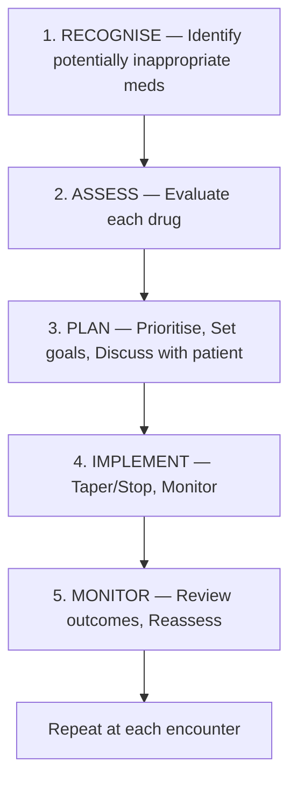
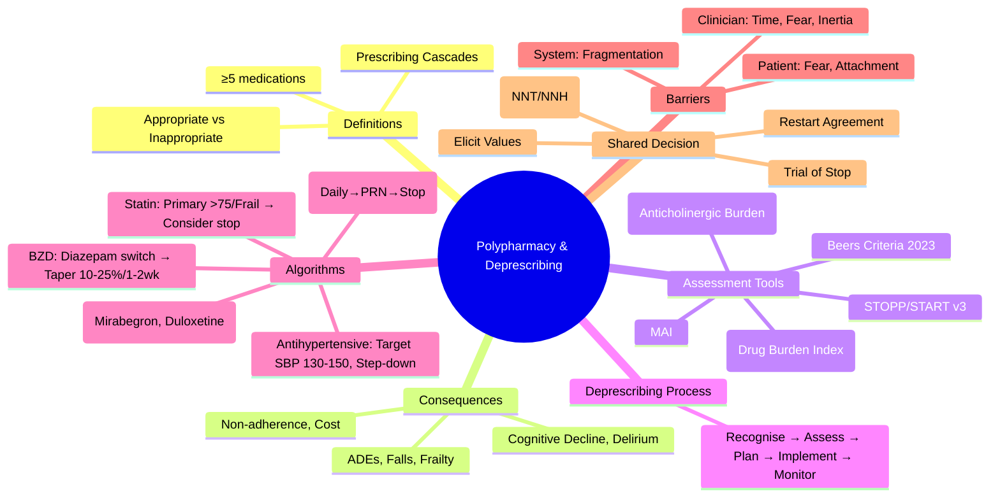

> [!tip] **FCPS/MRCP Priority: HIGH**
> **Elderly Medicine staple.** STOPP/START v3, Beers Criteria, Deprescribing algorithms, Barriers, Medication review process.
> Viva: *"85-year-old woman on 12 medications including PPI, benzodiazepine, statin. Walk me through your deprescribing approach."*

---

## 1. 1. Learning Objectives
By the end of this note you should be able to:
- [ ] Define polypharmacy and distinguish appropriate vs inappropriate
- [ ] Apply **STOPP/START v3 criteria** for medication review
- [ ] Identify **Beers Criteria 2023** potentially inappropriate medications
- [ ] Calculate **Anticholinergic Burden Scale (ACB)** and **Drug Burden Index (DBI)**
- [ ] Execute **deprescribing process** (Recognise → Assess → Plan → Implement → Monitor)
- [ ] Apply **deprescribing algorithms** for PPIs, Benzodiazepines, Anticholinergics, Statins, Antihypertensives
- [ ] Address **barriers** and use **shared decision-making**

---

## 2. 2. Definitions & Epidemiology

| Term | Definition |
|------|------------|
| **Polypharmacy** | Concurrent use of **≥5 regular medications** (some define ≥10 as "excessive") |
| **Appropriate Polypharmacy** | Multiple drugs for complex multimorbidity with **evidence-based indication** for each |
| **Inappropriate Polypharmacy** | Drugs without indication, therapeutic duplication, high-risk combinations, prescribing cascades |
| **Prescribing Cascade** | ADR misinterpreted as new condition → New drug prescribed → Further ADRs |

### 1. Epidemiology
- **>50% of adults >65** take ≥5 medications
- **>30% take ≥10** medications
- **Leading cause** of avoidable hospital admissions (6-10% admissions drug-related)
- **Cost:** £100M+/year in UK from avoidable ADRs

---

## 3. 3. Consequences of Polypharmacy

| Consequence | Mechanism | Impact |
|-------------|-----------|--------|
| **Adverse Drug Events (ADEs)** | ↑ Drug interactions, Altered PK/PD | 10-20% hospital admissions in elderly |
| **Falls & Fractures** | Sedatives, Antihypertensives, Anticholinergics | Hip fracture mortality 20-30% at 1 year |
| **Frailty & Functional Decline** | Cumulative anticholinergic/sedative burden | Loss of independence, Care home admission |
| **Cognitive Impairment & Delirium** | Anticholinergics, Benzodiazepines, Opioids | Accelerated dementia, Hospital-acquired delirium |
| **Non-adherence** | Pill burden, Complexity, Cost | Treatment failure, Wasted resources |
| **Prescribing Cascades** | ADR → New diagnosis → New drug | Spiral of inappropriate prescribing |
| **Healthcare Costs** | ADEs, Hospitalisation, Unnecessary drugs | £Billions annually |

---

## 4. 4. STOPP/START Criteria Version 3 (2023) — Ireland/EU Standard

> **STOPP** = Screening Tool of Older People's Potentially Inappropriate Prescriptions  
> **START** = Screening Tool to Alert to Right Treatment

### 1. STOPP v3 — Selected High-Yield Criteria (Section Letters)

| Section | Criterion | Clinical Rationale |
|---------|-----------|-------------------|
| **A** | **A1**: Any drug without evidence-based clinical indication | Core principle — Every drug must have indication |
| **A** | **A2**: Drug prescribed beyond recommended duration without review | Prevents legacy prescribing |
| **B** | **B1**: Benzodiazepines >4 weeks (Falls, Cognitive impairment, Dependence) | High fall risk, Delirium |
| **B** | **B2**: Z-drugs (Zolpidem, Zopiclone) >4 weeks | Similar to BZDs |
| **B** | **B3**: First-generation antihistamines (Anticholinergic burden) | Delirium, Constipation, Urinary retention |
| **B** | **B4**: Antipsychotics for BPSD >12 weeks without review | ↑ Stroke, Mortality in dementia |
| **C** | **C1**: Loop diuretic for ankle oedema without HF/renal/hepatic cause | Treat cause, not symptom |
| **C** | **C2**: Thiazide diuretic with current significant hyponatraemia (<130) | Worsens hyponatraemia |
| **D** | **D1**: NSAID + HF (NYHA III/IV) | ↑ Fluid retention, Worsens HF |
| **D** | **D2**: NSAID + CKD (eGFR <30) | ↑ AKI risk |
| **D** | **D3**: NSAID + Anticoagulant (Warfarin/DOAC/LMWH) | ↑↑ GI Bleed risk |
| **D** | **D4**: PPI >8 weeks without indication (↑ Fracture, C. diff, B12↓, Mg↓) | Review indication regularly |
| **E** | **E1**: Warfarin 1st VTE >6 months (DOAC preferred) | DOACs safer, No monitoring |
| **E** | **E2**: Aspirin + Warfarin/DOAC without clear indication (↑ Bleed) | Dual therapy only if clear indication (e.g., recent stent) |
| **F** | **F1**: ACEi/ARB + K-sparing diuretic + K supplement without K monitoring | Hyperkalaemia risk |
| **G** | **G1**: Aspirin primary prevention >70 years (↑ Bleed, Doubtful benefit) | ASCEND trial: No net benefit |
| **G** | **G2**: Statin primary prevention >85 years (Limited evidence) | Consider deprescribing |
| **H** | **H1**: Anticholinergic + Anticholinergic (Cumulative burden) | Cognitive decline, Falls |
| **I** | **I1**: Duplicate drug class (e.g., Two ACEi, Two NSAIDs) | No added benefit, ↑ Toxicity |

### 2. START v3 — Selected High-Yield Criteria

| Section | Criterion | Indication |
|---------|-----------|------------|
| **A** | **A1**: Vitamin D + Calcium in osteoporosis/fragility fracture | Bone health |
| **B** | **B1**: ACEi/ARB in HFrEF (LVEF ≤40%) | Mortality benefit |
| **C** | **C1**: Beta-blocker in HFrEF post-MI | Mortality benefit |
| **D** | **D1**: Statin in established CVD (Secondary prevention) | CVD risk reduction |
| **E** | **E1**: Anticoagulant in AF (CHA₂DS₂-VASc ≥2 men, ≥3 women) | Stroke prevention |
| **F** | **F1**: Bisphosphonate in osteoporosis (T-score ≤-2.5 or fragility fracture) | Fracture prevention |
| **G** | **G1**: PPI with NSAID/aspirin in high GI bleed risk | GI protection |

---

## 5. 5. Beers Criteria 2023 (American Geriatrics Society) — Key "Avoid" Drugs

| Drug Class | Examples | Reason to Avoid | Alternative |
|------------|----------|-----------------|-------------|
| **Benzodiazepines** (All) | Diazepam, Lorazepam, Alprazolam, Clonazepam | Falls, Delirium, Cognitive decline, Dependence | Non-drug (CBT-i), Melatonin, **Lorazepam/Oxazepam short-term if essential** |
| **Non-BZD Hypnotics** | Zolpidem, Zopiclone, Zaleplon | Similar to BZDs; ↑ Falls, Fractures | Sleep hygiene, CBT-i |
| **First-gen Antihistamines** | Diphenhydramine, Chlorphenamine, Hydroxyzine, Promethazine | Strong anticholinergic → Delirium, Constipation, Urinary retention | **2nd-gen (Cetirizine, Loratadine, Fexofenadine)** |
| **Tricyclic Antidepressants** | Amitriptyline, Nortriptyline, Imipramine, Doxepin | Anticholinergic, Orthostatic hypotension, Arrhythmia | **SSRIs (Sertraline, Citalopram), SNRIs, Mirtazapine** |
| **Skeletal Muscle Relaxants** | Cyclobenzaprine, Methocarbamol, Carisoprodol, Baclofen (chronic) | Anticholinergic, Sedation, Weak evidence | Physiotherapy, Topical NSAIDs |
| **NSAIDs (Chronic Use)** | Ibuprofen, Naproxen, Diclofenac, Indomethacin | GI bleed, AKI, HF exacerbation, ↑ BP | Paracetamol, Topical NSAIDs, Opioids (short-term) |
| **Digoxin >0.125mg/day** | — | Narrow TI, Toxicity in renal impairment, No mortality benefit in AF | **Rate control: Beta-blockers, CCBs, Digoxin ≤0.125mg** |
| **Alpha-blockers (HTN)** | Doxazosin, Prazosin, Terazosin | Orthostatic hypotension, Falls, Syncope | ACEi/ARB, CCB, Thiazide |
| **Estrogens (Oral Systemic)** | Conjugated estrogens, Estradiol | VTE, Stroke, Breast cancer, Dementia | Transdermal if essential; Non-hormonal |
| **Anticholinergics (High ACB)** | Oxybutynin, Tolterodine, Solifenacin, Benztropine, Trihexyphenidyl | Cognitive decline, Constipation, Urinary retention | **Mirabegron, Vibegron (β3 agonists)**, Pelvic floor PT |
| **Proton Pump Inhibitors (Long-term >8wk)** | Omeprazole, Lansoprazole, Esomeprazole | Fracture, C. diff, B12 deficiency, Hypomagnesaemia | **Review indication; Step down to H2RA/On-demand** |
| **Antipsychotics (BPSD)** | Risperidone, Olanzapine, Quetiapine, Haloperidol | ↑ Stroke, Mortality in dementia; Use <12 weeks | Non-drug first; **Quetiapine/Clozapine if essential** |

---

## 6. 6. Assessment Tools for Polypharmacy

### 1. Anticholinergic Burden Scale (ACB) — Score ≥3 = High Risk
| Score 3 (Strong) | Score 2 (Moderate) | Score 1 (Mild) |
|------------------|---------------------|----------------|
| Amitriptyline, Chlorpromazine, Clozapine, Diphenhydramine, Oxybutynin, Scopolamine, Atropine, Benztropine, Trihexyphenidyl | Carbamazepine, Cyclobenzaprine, Disopyramide, Loxapine, Methotrimeprazine, Olanzapine, Paroxetine, Pimozide, Risperidone, Amantadine | Atenolol, Bupropion, Cimetidine, Codeine, Colchicine, Digoxin, Fentanyl, Furosemide, Haloperidol, Hydralazine, Isosorbide, Metoprolol, Morphine, Nifedipine, Prednisolone, Quetiapine, Ranitidine, Theophylline, Tramadol, Warfarin |

### 2. Drug Burden Index (DBI)
> **DBI = Σ (Dose / (Dose + δ))** for sedative + anticholinergic drugs
> **δ** = Dose at 50% maximal effect (Population estimate)
> **DBI ≥1.0** = High burden → ↑ Falls, ↓ Function, ↑ Mortality

### 3. Medication Appropriateness Index (MAI)
- 10-item implicit criteria (Indication, Effectiveness, Dosage, Directions, Interactions, Duplication, Duration, Cost, Monitoring, Patient preference)
- Used in research; Less practical for clinical use

---

## 7. 7. Deprescribing Framework

### 1. 5-Step Deprescribing Process



#### Step 1: RECOGNISE
- Apply **STOPP/START**, **Beers**, **ACB**, **DBI**
- Identify: No indication, Duplicate, High-risk, Prescribing cascade, Non-adherence

#### Step 2: ASSESS (Per Drug)
| Question | Action if YES |
|----------|---------------|
| Is there a current indication? | **Stop** if no |
| Is benefit > harm for THIS patient? | **Stop/Reduce** if harm > benefit |
| Is there a safer alternative? | **Switch** |
| Is the dose appropriate (Renal/Hepatic/Age)? | **Adjust** |
| Is there a prescribing cascade? | **Stop precipitating drug** |

#### Step 3: PLAN
- **Prioritise:** Highest harm (Falls, Bleeding, Cognitive, Anticholinergic) first
- **One drug at a time** (Usually)
- **Taper schedule** (BZDs, Steroids, Beta-blockers, Opioids)
- **Shared decision-making** — Patient values, Goals of care, Life expectancy

#### Step 4: IMPLEMENT
- **Taper** (Not abrupt stop for: BZDs, Steroids, Beta-blockers, Opioids, Antidepressants, Gabapentinoids)
- **Monitor** withdrawal symptoms, Return of symptoms
- **Document** rationale, Plan, Follow-up

#### Step 5: MONITOR
- **Reassess** at 2-4 weeks, 3 months, 6 months
- **Restart** if symptoms return AND benefit > harm
- **Update** medication list, Communicate to team

---

## 8. 8. Deprescribing Algorithms — High-Yield Drug Classes

### 1. PPI Deprescribing
```mermaid
flowchart TD
    A[PPI >8 weeks] --> B{Current Indication?}
    B -->|Yes (Barrett's, Severe oesophagitis, Chronic NSAID, Zollinger-Ellison)| C[Continue; Annual review]
    B -->|No / Resolved (H. pylori eradicated, Stress ulcer prophylaxis ended)| D[Step-Down Approach]
    D --> E[Daily → On-demand (PRN) → Stop]
    E --> F[Monitor Rebound Symptoms 2-4 weeks]
    F --> G{Recurrence?}
    G -->|Yes| H[Restart Lowest Effective Dose]
    G -->|No| I[Successful Deprescribing]
```

**Rebound Acid Hypersecretion:** Peaks at 1-2 weeks post-cessation → Warn patient, Provide antacid/alginate PRN

### 2. Benzodiazepine/Z-Drug Deprescribing
```mermaid
flowchart TD
    A[BZD/Z-drug >4 weeks] --> B[Assess: Dependence, Indication, Patient Readiness]
    B --> C[**Switch to Diazepam** (Long half-life, Smooth taper) — Equivalent dose]
    C --> D[**Taper: Reduce 10-25% every 1-2 weeks**]
    D --> E[**Pause/Slow** if Withdrawal Symptoms (Anxiety, Insomnia, Tremor, Seizure risk)]
    E --> F[**CBT-i for Insomnia** / Anxiety Management]
    F --> G[**Supportive Care** — Sleep hygiene, Relaxation, Non-drug]
```

**Diazepam Equivalents:** Lorazepam 1mg = Diazepam 10mg; Alprazolam 0.5mg = Diazepam 5mg; Zolpidem 10mg ≈ Diazepam 5-10mg

### 3. Anticholinergic Deprescribing
```mermaid
flowchart TD
    A[ACB Score ≥3] --> B[Identify ALL Anticholinergic Drugs]
    B --> C{Prioritise by: ACB Score + Indication Strength}
    C --> D[**Stop/Reduce Strongest (Score 3) First**]
    D --> E[**Substitute**: Oxybutynin → Mirabegron; Amitriptyline → Duloxetine/Sertraline; Diphenhydramine → Cetirizine]
    E --> F[Monitor Cognitive Function, Bowel/Bladder]
```

### 4. Statin Deprescribing (Primary Prevention Elderly)
```mermaid
flowchart TD
    A[Statin Primary Prevention >75y / Frail / Limited Life Expectancy] --> B{Clinical ASCVD?}
    B -->|Yes (Secondary Prevention)| C[**Continue** — Evidence strong]
    B -->|No (Primary Prevention)| D{Assess: Frailty, Life Expectancy, ADR, Patient Preference}
    D -->|Frail, Limited LE, ADR (Myalgia), Patient Declines| E[**Deprescribe** — Stop, Monitor Lipids]
    D -->|Robust, Long LE, No ADR, Patient Wants| F[**Continue** — Individualised]
```

### 5. Antihypertensive Deprescribing (Frailty/Falls)
```mermaid
flowchart TD
    A[Falls / Orthostatic Hypotension / Frailty / SBP <120 on Treatment] --> B[Review All Antihypertensives]
    B --> C{**Step-Down Priority**: 1. Alpha-blockers 2. Diuretics 3. CCBs 4. ACEi/ARB 5. Beta-blockers}
    C --> D[**Reduce/Stop ONE drug at a time**]
    D --> E[**Monitor: BP (Home), Standing BP, Symptoms, Renal Function**]
    E --> F[Target SBP **130-150** in Frail Elderly (SPRINT, HYVET)]
```

---

## 9. 9. Barriers to Deprescribing & Solutions

| Barrier Domain | Specific Barrier | Solution |
|----------------|------------------|----------|
| **Patient** | Fear of symptom return, "Doctor knows best", Attachment to pill | **Education**, Shared decision-making, Trial of taper, "We can restart" |
| **Clinician** | Lack of time, Fear of litigation, Uncertainty guidelines, Inertia | **Structured tools (STOPP/START)**, Multidisciplinary review, Pharmacist-led |
| **System** | Fragmented care, No ownership, Poor communication, Incentives for prescribing | **Medication reconciliation ATD**, Pharmacist in GP/ward, Electronic deprescribing alerts |

---

## 10. 10. Shared Decision-Making in Deprescribing

### 1. Elicit Patient Priorities
- "What matters most to you?" (Independence, Avoiding falls, Minimising pills, Longevity)
- **Goals of care:** Curative vs Palliative vs Functional

### 2. Explain Benefit-Harm
- **Absolute terms:** "This drug reduces your 5-year stroke risk from 5% to 3% (NNT=50), but increases fall risk from 20% to 30% (NNH=10)"
- **Visual aids:** Icon arrays, Decision aids

### 3. Negotiate Plan
- **Trial of discontinuation:** "Let's try stopping for 4 weeks and see how you feel"
- **Restart agreement:** "If symptoms return and bother you, we'll restart"

---

## 11. 11. FCPS/MRCP High-Yield Summary

| Topic | Key Points |
|-------|------------|
| **Polypharmacy Definition** | ≥5 regular medications; Appropriate vs Inappropriate |
| **STOPP/START v3** | A1 (No indication), B1 (BZD>4wk), D4 (PPI>8wk), E1 (Warfarin>6m VTE), G1 (Aspirin primary prev>70), H1 (Anticholinergic burden) |
| **Beers 2023 "Avoid"** | BZDs, Z-drugs, 1st-gen antihistamines, TCAs, Muscle relaxants, Chronic NSAIDs, Digoxin>0.125mg, Alpha-blockers HTN, Oral estrogens, High ACB drugs |
| **ACB Score ≥3** = High Risk | Amitriptyline, Oxybutynin, Diphenhydramine, Chlorpromazine, Clozapine, Scopolamine = Score 3 |
| **DBI ≥1.0** = High Burden | Sedative + Anticholinergic load |
| **Deprescribing Process** | **Recognise → Assess → Plan → Implement → Monitor** |
| **PPI Algorithm** | Step-down: Daily → PRN → Stop; Warn rebound 1-2wk; Restart if recurrence |
| **BZD Algorithm** | Switch to Diazepam → Taper 10-25%/1-2wk → CBT-i → Supportive |
| **Anticholinergic** | Identify all → Substitute (Oxybutynin→Mirabegron, Amitriptyline→Duloxetine) |
| **Statin Primary >75/Frail** | Consider stop if limited LE, ADR, Patient preference; Continue if secondary prevention |
| **Antihypertensive Frailty** | Target SBP 130-150; Step-down: Alpha-blockers → Diuretics → CCBs → ACEi/ARB → Beta-blockers |
| **Barriers** | Patient (Fear), Clinician (Time/Fear), System (Fragmentation) |
| **Shared Decision** | Elicit values, Absolute benefit-harm (NNT/NNH), Trial of stop, Restart agreement |

---

## 12. 12. Viva Questions (MRCP PACES / FCPS)

| Question | Expected Answer |
|----------|-----------------|
| **85yo woman on 12 meds: Omeprazole 20mg, Diazepam 5mg, Amitriptyline 25mg, Atorvastatin 40mg, Ramipril 10mg, Furosemide 40mg, Bisoprolol 2.5mg, Paracetamol 1g QDS, Codeine 30mg QDS, Lactulose, Calcium/Vit D, Aspirin 75mg. No clear CVD. Review.** | **STOPP/START Review:** 1. **Omeprazole >8wk no indication** → Step down PRN → Stop (D4). 2. **Diazepam >4wk** → Switch to diazepam (already on), Taper 10-25%/1-2wk, CBT-i (B1). 3. **Amitriptyline (ACB 3)** → Switch to duloxetine/sertraline (H1). 4. **Atorvastatin primary prevention >85y** → Consider deprescribe (G2). 5. **Aspirin primary prevention >70** → Stop (G1). 6. **Codeine** → Avoid (Beers), Switch to paracetamol + topical. 7. **Furosemide** → Check indication (Ankle oedema without HF? C1). **Communicate plan, Trial stops, Monitor.** |
| **STOPP vs START — difference?** | **STOPP** = **Stop** inappropriate drugs (Potentially inappropriate prescriptions); **START** = **Start** omitted indicated drugs (Potential prescribing omissions) |
| **Beers Criteria — which antihistamine to avoid?** | **First-generation:** Diphenhydramine, Chlorphenamine, Hydroxyzine, Promethazine — **Strong anticholinergic**; Use 2nd-gen (Cetirizine, Loratadine, Fexofenadine) |
| **PPI deprescribing — rebound management?** | **Step-down:** Daily → On-demand → Stop; **Rebound peaks 1-2 weeks**; Provide antacid/alginate PRN; Restart if symptomatic recurrence |
| **Benzodiazepine taper — key principles?** | **Switch to diazepam** (Long half-life); **Reduce 10-25% every 1-2 weeks**; **Pause/slow** if withdrawal; **CBT-i for insomnia**; Non-drug support |
| **Anticholinergic Burden Scale — score 3 drugs?** | Amitriptyline, Chlorpromazine, Clozapine, Diphenhydramine, Oxybutynin, Scopolamine, Atropine, Benztropine, Trihexyphenidyl |
| **Statin deprescribing in 85yo primary prevention?** | **Consider stop** if frailty, limited life expectancy, adverse effects (myalgia), patient preference; **Continue if secondary prevention (ASCVD)**; Shared decision-making |
| **Prescribing cascade example?** | **CCB → Ankle oedema → Diuretic prescribed** (Instead of stopping CCB); **NSAID → Hypertension → Antihypertensive added**; **Cholinesterase inhibitor → Urinary incontinence → Anticholinergic added** |
| **Shared decision-making — how to explain NNT/NNH?** | "For every 50 people taking this statin for 5 years, 1 heart attack is prevented. For every 10 people taking this sedative, 1 extra person has a fall. What matters more to you?" |

---

## 13. 13. Confusions & Mnemonics

| Confusion | Clarification |
|-----------|---------------|
| **STOPP/START — which is which?** | **STOPP** = **S**top inappropriate; **START** = **S**tart omitted |
| **Beers vs STOPP** | **Beers** = US (AGS), Explicit drug list; **STOPP/START** = EU/Ireland, Criteria-based, Includes START (omissions) |
| **ACB vs DBI** | **ACB** = Anticholinergic-specific (3/2/1 scoring); **DBI** = Sedative + Anticholinergic combined (Dose-weighted formula) |
| **PPI rebound vs relapse** | **Rebound** = Physiological acid hypersecretion 1-2wk post-stop (Self-limiting); **Relapse** = Return of underlying disease (Needs restart) |
| **BZD taper — why diazepam?** | **Long half-life (20-100h + active metabolites)** → Smooth withdrawal, Less interdose withdrawal |
| **Deprescribing vs Non-adherence** | **Deprescribing** = Planned, Supervised, Shared decision; **Non-adherence** = Unintentional/Intentional stopping without plan |

**Mnemonic: STOPP-DEPRESCRIBE**
- **S**TOP inappropriate (STOPP criteria)
- **T**aper slowly (BZDs, Steroids, Beta-blockers, Opioids)
- **O**ne drug at a time (Usually)
- **P**rioritise high harm (Falls, Bleeds, Cognitive, ACB)
- **P**atient-centered (Shared decision, Values, Goals)
- **D**rug Burden Index / ACB calculated
- **E**vidence-based alternatives (Mirabegron, Duloxetine, CBT-i)
- **P**rescribing cascades identified
- **R**eview at each encounter (Med rec ATD)
- **E**ducate patient (Benefit-harm, NNT/NNH)
- **S**hared decision-making documented
- **C**ommunicate to team (GP, Pharmacy, Carers)
- **R**estart agreement if symptoms return
- **I**mplement with monitoring (2wk, 3mo, 6mo)
- **B**arriers addressed (Time, Fear, System)
- **E**valuate outcomes (Falls, Cognition, Adherence, Satisfaction)

---

## 14. 14. Mind Map



---

## 15. 15. Spaced Repetition Trackers
| Review Interval | Date Completed | Confidence (1-5) | Notes |
|-----------------|----------------|------------------|-------|
| 24 hours | | | |
| 7 days | | | |
| 15 days | | | |
| 30 days | | | |
| 90 days | | | |

---

## 16. 16. Self-Test Scorecard
| Section | Score /5 | Last Attempt |
|---------|----------|--------------|
| STOPP/START v3 Criteria | | |
| Beers Criteria 2023 | | |
| ACB/DBI Calculation | | |
| Deprescribing Process | | |
| PPI/BZD/Anticholinergic Algorithms | | |
| Statin/Antihypertensive Deprescribing | | |
| Barriers & Shared Decision | | |

---

## 17. 17. Exam Answer Modes

### 1. Long Answer Skeleton
1. Define polypharmacy, Apply STOPP/START/Beers to case
2. Identify inappropriate drugs, Calculate ACB/DBI
3. Prioritise deprescribing targets (Harm, Patient goals)
4. Outline taper plans for each (PPI, BZD, Anticholinergic, etc.)
5. Address barriers, Shared decision-making, Monitoring plan

### 2. Short Note Skeleton
- **Polypharmacy:** ≥5 meds; Inappropriate = No indication, Duplication, High-risk
- **STOPP v3:** A1(No indication), B1(BZD>4wk), D4(PPI>8wk), E1(Warf>6m VTE), G1(Aspirin>70 primary), H1(ACB)
- **START v3:** A1(Vit D/Ca), B1(ACEi HFrEF), E1(Anticoag AF), F1(Bisphosphonate)
- **Beers:** BZDs, Z-drugs, 1st-gen antihistamines, TCAs, Muscle relaxants, NSAIDs chronic, Digoxin>0.125, Alpha-blockers, Estrogens, High ACB
- **ACB≥3:** Amitriptyline, Oxybutynin, Diphenhydramine, Chlorpromazine, Clozapine
- **Deprescribe:** Recognise→Assess→Plan→Implement→Monitor
- **PPI:** Daily→PRN→Stop (Rebound 1-2wk)
- **BZD:** Diazepam switch→Taper 10-25%/1-2wk→CBT-i
- **Anticholinergic:** Substitute (Oxybutynin→Mirabegron, Amitriptyline→Duloxetine)
- **Statin Primary >75:** Consider stop (Frailty, LE, ADR, Preference)
- **Antihypertensive Frailty:** SBP 130-150, Step-down Alpha→Diuretic→CCB→ACEi/ARB→BB

### 3. Viva One-Liners
- "STOPP = Stop inappropriate; START = Start omitted"
- "Beers = US list; STOPP/START = EU criteria + omissions"
- "ACB ≥3 = High risk cognitive decline/falls"
- "PPI deprescribe: Step-down, Warn rebound 1-2wk"
- "BZD deprescribe: Diazepam switch, Taper 10-25%/1-2wk, CBT-i"
- "Anticholinergic deprescribe: Substitute (Mirabegron, Duloxetine)"
- "Statin primary >75: Consider stop if frail/LE/ADR; Continue secondary"
- "Shared decision: Elicit values, NNT/NNH absolute, Trial stop, Restart agreement"

### 4. Ward-Case Discussion Points
- Every elderly admission: **Medication reconciliation ATD** → **STOPP/START review**
- **Identify prescribing cascades** (CCB→Oedema→Diuretic; NSAID→HTN→Antihypertensive)
- **Calculate ACB** — If ≥3, prioritise anticholinergic deprescribing
- **PPI review** — "Why started? Duration? Indication current?"
- **Deprescribing = Process, not event** — Document rationale, Plan, Follow-up

### 5. Last-Night-Before-Exam Sheet
- **STOPP:** A1(Noind), B1(BZD>4w), D4(PPI>8w), E1(Warf>6mVTE), G1(Asp>70prim), H1(ACB)
- **START:** A1(VitD/Ca), B1(ACEi HFrEF), C1(BB HFrEF), D1(Statin 2nd), E1(Anticoag AF), F1(Bisphos), G1(PPI+NSAID)
- **Beers:** BZD, Z-drug, 1st-gen AH, TCA, Muscle relax, NSAID chron, Dig>0.125, Alpha-block, Estrogen, High ACB
- **ACB 3:** Amitrip, Oxybutynin, Diphenhyd, Chlorprom, Clozapine, Scopolamine
- **Process:** Recognise→Assess→Plan→Implement→Monitor
- **PPI:** Daily→PRN→Stop; Rebound 1-2wk
- **BZD:** Diazepam switch; Taper 10-25%/1-2wk; CBT-i
- **Antichol:** Substitute (Mirabegron, Duloxetine)
- **Statin 1°>75:** Stop if Frail/LE/ADR/Pref; Continue 2°
- **HTN Frail:** SBP 130-150; Step-down Alpha→Diuretic→CCB→ACEi→BB

---

## 18. 18. Summary
Polypharmacy (≥5 medications) drives ADEs, falls, cognitive decline, and non-adherence in elderly. **STOPP/START v3** provides explicit criteria for inappropriate prescriptions (STOPP: A1, B1, D4, E1, G1, H1) and omissions (START: A1, B1, E1). **Beers Criteria 2023** lists drugs to avoid (BZDs, Z-drugs, 1st-gen antihistamines, TCAs, chronic NSAIDs, high ACB drugs). **ACB ≥3** and **DBI ≥1** indicate high burden. **Deprescribing** follows 5-step process (Recognise→Assess→Plan→Implement→Monitor) with specific algorithms for PPIs (step-down), BZDs (diazepam switch + taper), anticholinergics (substitution), statins (consider stop primary prevention >75/frail), antihypertensives (SBP 130-150 in frailty). **Barriers** (patient fear, clinician time, system fragmentation) addressed via **shared decision-making** using absolute benefit-harm (NNT/NNH), trial of discontinuation, and restart agreements.

---

## 19. 19. MCQs (10)
1. **STOPP criteria identify:**
   A. Drugs to start  B. **Potentially inappropriate prescriptions to stop**  C. Monitoring parameters  D. Drug interactions
2. **Beers Criteria 2023 — which drug class is NOT "Avoid"?**
   A. Benzodiazepines  B. **SSRIs**  C. First-generation antihistamines  D. Tricyclic antidepressants
3. **Anticholinergic Burden Scale — score ≥3 indicates:**
   A. Low risk  B. Moderate risk  C. **High risk (Cognitive decline, Falls)**  D. No risk
4. **PPI deprescribing step-down order:**
   A. Stop → PRN → Daily  B. **Daily → PRN → Stop**  C. PRN → Daily → Stop  D. Stop immediately
5. **Benzodiazepine taper — preferred switch agent:**
   A. Lorazepam  B. **Diazepam**  C. Alprazolam  D. Zolpidem
6. **STOPP criterion for PPI >8 weeks without indication:**
   A. D1  B. **D4**  C. D2  D. D3
7. **START criterion for anticoagulation in AF:**
   A. A1  B. B1  C. **E1**  D. F1
8. **Deprescribing statin in primary prevention >75 years — key consideration:**
   A. Always continue  B. **Frailty, Life expectancy, ADR, Patient preference**  C. LDL level only  D. Never deprescribe
9. **Prescribing cascade example:**
   A. Drug interaction  B. **ADR misinterpreted as new condition → New drug**  C. Therapeutic duplication  D. Non-adherence
10. **Shared decision-making in deprescribing — best approach:**
    A. Doctor decides  B. **Elicit patient values, Present absolute NNT/NNH, Trial of stop, Restart agreement**  C. Stop all at once  D. Defer to family

---

## 20. 20. SBA Questions (10)
1. **82M on omeprazole 20mg daily for 2 years for "dyspepsia" (resolved). STOPP criterion?**
   A. A1  B. B1  C. **D4**  D. E1
2. **78F on diazepam 5mg nocte for 6 months for insomnia. STOPP criterion?**
   A. **B1**  B. B2  C. B3  D. B4
3. **Patient on amitriptyline 25mg, oxybutynin 5mg, diphenhydramine 25mg PRN. ACB score?**
   A. 2  B. 4  C. **9** (Amitriptyline 3 + Oxybutynin 3 + Diphenhydramine 3)  D. 6
4. **PPI deprescribing — rebound acid hypersecretion typically peaks at:**
   A. 24 hours  B. **1-2 weeks**  C. 4 weeks  D. 8 weeks
5. **Benzodiazepine taper — initial dose reduction per step:**
   A. 50%  B. **10-25%**  C. 5-10%  D. 30-50%
6. **85yo frail woman, no CVD, on atorvastatin 20mg for primary prevention. Deprescribe?**
   A. Always continue  B. **Consider stop (Frailty, Limited LE, Shared decision)**  C. Increase dose  D. Switch to rosuvastatin
7. **Antihypertensive deprescribing priority in falls/frailty:**
   A. ACEi first  B. Beta-blocker first  C. **Alpha-blocker → Diuretic → CCB → ACEi/ARB → Beta-blocker**  D. Diuretic first
8. **Which is a START criterion?**
   A. Stop PPI >8 weeks  B. **Start anticoagulant in AF (CHA₂DS₂-VASc ≥2)**  C. Stop BZD >4 weeks  D. Stop NSAID in CKD
9. **Patient on calcium channel blocker develops ankle oedema → Furosemide added. This is:**
   A. Drug interaction  B. **Prescribing cascade**  C. Therapeutic duplication  D. Adherence issue
10. **Deprescribing process — correct sequence:**
    A. Plan → Assess → Recognise → Implement → Monitor  B. **Recognise → Assess → Plan → Implement → Monitor**  C. Implement → Recognise → Assess → Plan → Monitor  D. Assess → Recognise → Plan → Implement → Monitor

---

## 21. 21. Flashcards
- Q: **STOPP = ?**
  A: **Stop** inappropriate prescriptions
- Q: **START = ?**
  A: **Start** omitted indicated drugs
- Q: **STOPP D4 = ?**
  A: **PPI >8 weeks without indication**
- Q: **STOPP B1 = ?**
  A: **Benzodiazepines >4 weeks**
- Q: **Beers "Avoid" top 3?**
  A: BZDs, 1st-gen antihistamines, TCAs
- Q: **ACB Score 3 drugs?**
  A: Amitriptyline, Oxybutynin, Diphenhydramine, Chlorpromazine, Clozapine
- Q: **PPI deprescribe algorithm?**
  A: Daily → PRN → Stop; Warn rebound 1-2wk
- Q: **BZD deprescribe algorithm?**
  A: Switch to Diazepam → Taper 10-25%/1-2wk → CBT-i
- Q: **Anticholinergic deprescribe?**
  A: Substitute (Oxybutynin→Mirabegron, Amitriptyline→Duloxetine)
- Q: **Statin deprescribe primary >75?**
  A: Consider stop if Frail/LE/ADR/Pref; Continue secondary

---

## 22. 22. Answer Key with Explanations

### 1. MCQs
1. **B** — STOPP = Screening Tool of Older People's Potentially **Inappropriate Prescriptions**
2. **B** — SSRIs are preferred in elderly; BZDs, 1st-gen antihistamines, TCAs are "Avoid"
3. **C** — ACB ≥3 = High risk for cognitive decline, falls, delirium, mortality
4. **B** — Step-down: Daily → On-demand (PRN) → Stop (Rebound peaks 1-2 weeks)
5. **B** — Diazepam = Long half-life + Active metabolites = Smooth taper
6. **B** — STOPP D4: PPI >8 weeks without appropriate indication
7. **C** — START E1: Anticoagulant in AF (CHA₂DS₂-VASc ≥2 men, ≥3 women)
8. **B** — Consider deprescribing if frailty, limited life expectancy, ADR, patient preference; Continue if secondary prevention
9. **B** — Prescribing cascade = ADR (e.g., CCB oedema) misinterpreted as new condition → New drug (Diuretic)
10. **B** — Shared decision: Elicit values, Absolute NNT/NNH, Trial of stop, Restart if needed

### 2. SBAs
1. **C** — D4: PPI >8 weeks without indication (Dyspepsia resolved)
2. **A** — B1: Benzodiazepines >4 weeks (Diazepam 6 months)
3. **C** — Amitriptyline (3) + Oxybutynin (3) + Diphenhydramine (3) = **9** (High risk)
4. **B** — Rebound acid hypersecretion peaks at **1-2 weeks** post-cessation
5. **B** — Taper **10-25% every 1-2 weeks** (Slower if withdrawal symptoms)
6. **B** — Frail >75 primary prevention: **Consider stop** (Shared decision); Secondary prevention = Continue
7. **C** — Step-down priority: **Alpha-blocker → Diuretic → CCB → ACEi/ARB → Beta-blocker**
8. **B** — START E1 = Start anticoagulant in AF; Others are STOPP criteria
9. **B** — CCB → Oedema → Diuretic = Classic prescribing cascade (Should stop/reduce CCB instead)
10. **B** — **Recognise → Assess → Plan → Implement → Monitor**

---

## 23. 23. Local Navigation
- **Parent Heading**: [[Polypharmacy and Deprescribing|Polypharmacy and Deprescribing]]
- **Chapter Map**: [[Davidson Chapter 2 - Clinical Therapeutics Hierarchy|Chapter 2 Hierarchy]]
- **Chapter MOC**: [[Clinical Therapeutics and Good Prescribing MOC]]
- **Related**: [[Elderly Prescribing]], [[Frailty]], [[Medication Reconciliation]], [[STOPP/START Criteria v3]], [[Beers Criteria 2023]], [[Deprescribing Algorithms]], [[Anticholinergic Burden]], [[Drug Burden Index]], [[Falls Risk]], [[Cognitive Impairment]], [[Anticholinergic Burden Scale]], [[Prescribing Cascades]]
