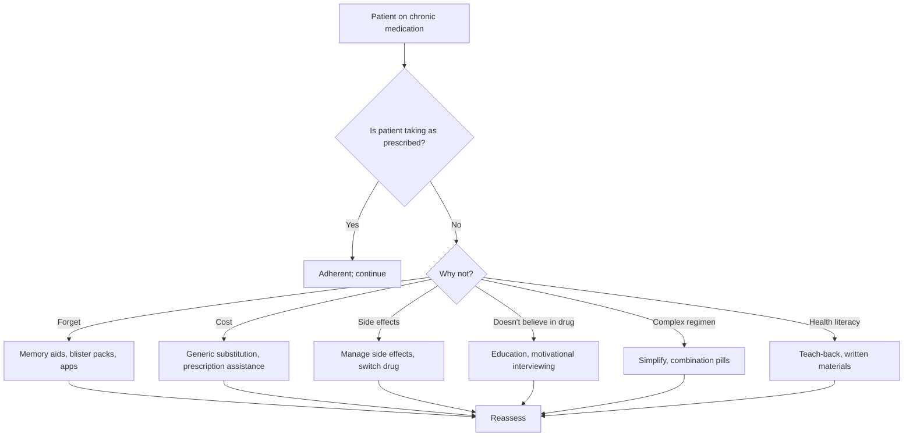
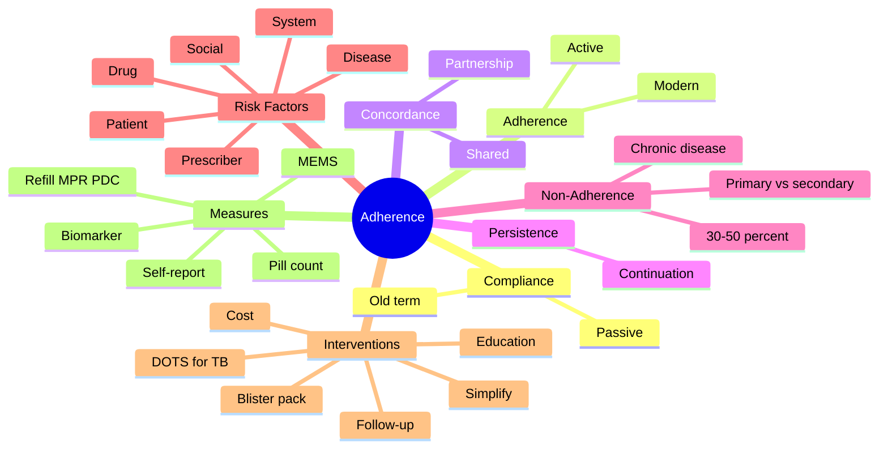

# Compliance, Adherence & Concordance

> [!info]
> **Disease-Level Topic** under **Principles of Clinical Pharmacology → Factors Influencing Drug Response**.
> Davidson 24e Ch2 (Maxwell) — "Adherence" / "Concordance" framework.

## 1. Learning Objectives
- [ ] Define **compliance, adherence, concordance, persistence**
- [ ] Recognise the magnitude of non-adherence
- [ ] Identify **risk factors** for non-adherence
- [ ] Apply strategies to **improve adherence**
- [ ] Differentiate intentional vs unintentional non-adherence
- [ ] Discuss **ethics and patient-centred prescribing**

## 2. Core Concepts

| Term | Definition | Modern Term? |
|------|-----------|--------------|
| **Compliance** | Patient follows prescriber's instructions | Older term; passive; discouraged |
| **Adherence** | Patient's behaviour matches agreed Rx | Modern; non-judgmental |
| **Concordance** | Therapeutic partnership; shared decision-making | Modern; patient-centred |
| **Persistence** | Continuing to take medication over time | Time-based measure |
| **Primary non-adherence** | Never fills prescription | Initial |
| **Secondary non-adherence** | Stops taking after starting | Mid-treatment |
| **Intentional non-adherence** | Patient chooses not to take | Active decision |
| **Unintentional non-adherence** | Forgets, can't afford, etc. | Passive |
| **MPR (Medication Possession Ratio)** | Days supplied / days in period | Quantitative measure |
| **PDC (Proportion of Days Covered)** | Days with medication available / total days | Alternative measure |
| **Polypharmacy** | ≥5 medications | Adherence risk factor |

## 3. Mermaid Algorithm — Adherence Assessment

## 4. Comparison Tables

### 4.1 Compliance vs Adherence vs Concordance

| Term | Definition | Patient Role | Prescriber Role | Era |
|------|-----------|--------------|-----------------|-----|
| **Compliance** | Patient follows instructions | Passive recipient | Directive | Older (paternalistic) |
| **Adherence** | Patient's behaviour matches agreed Rx | Active | Guide/educator | Modern (1990s+) |
| **Concordance** | Shared decision-making; therapeutic partnership | Equal partner | Collaborator | Modern (2000s+) |
| **Persistence** | Continuing to take medication over time | Active | Long-term support | Modern |

### 4.2 Non-Adherence: Magnitude & Cost

| Statistic | Value |
|-----------|-------|
| **Overall non-adherence in chronic disease** | 30-50% |
| **Long-term chronic conditions (HTN, DM, asthma)** | 50-70% non-adherence |
| **Cost of non-adherence (US)** | $100-300 billion/year in avoidable healthcare |
| **Hospital admissions due to non-adherence** | 10-25% of all admissions |
| **Medication-related admissions** | 5-10% of all admissions |
| **Adherence in transplant** | ~25-50% non-adherent (cyclosporin, tacrolimus) |
| **Adherence in HIV** | ~30-40% non-adherent |
| **Asthma controller use** | ~30-50% as prescribed |
| **OCP typical use failure** | 9% (perfect use 0.3%) |
| **Antihypertensive use at 1 year** | ~50% stop or reduce |
| **Statin use at 2 years** | ~50% stop |

### 4.3 Risk Factors for Non-Adherence

| Category | Risk Factors |
|----------|--------------|
| **Patient** | Cognitive impairment, mental illness, substance abuse, low health literacy, denial, asymptomatic disease |
| **Disease** | Chronic, asymptomatic (HTN, dyslipidaemia), mental illness, HIV (stigma) |
| **Drug** | Multiple medications (polypharmacy), complex regimen, side effects, frequent dosing, expensive, slow onset of action |
| **Prescriber** | Poor communication, no follow-up, paternalistic, not addressing concerns |
| **System** | Cost, access, refill barriers, fragmented care |
| **Social** | Lack of support, stigma (HIV, mental illness), cultural beliefs |

### 4.4 Strategies to Improve Adherence

| Strategy | Description | Evidence Level |
|----------|-------------|----------------|
| **Simplify regimen** | OD or BD dosing; combination pills; fewer drugs | Strong |
| **Education** | Clear instructions, teach-back, written materials | Strong |
| **Memory aids** | Pill organisers, blister packs, alarms, smartphone apps | Moderate |
| **Reminders** | Phone calls, text messages, alerts | Moderate |
| **Refill programmes** | Auto-refill, mail order, 90-day supplies | Moderate |
| **Cost reduction** | Generics, prescription assistance, formulary | Strong |
| **Engagement** | Shared decision-making, motivational interviewing | Strong |
| **Adherence monitoring** | Pharmacy refill data, electronic monitors, MEMS caps | Strong |
| **Side effect management** | Switch drugs, dose adjustment, education | Strong |
| **Regular follow-up** | Clinic visits, phone calls, telehealth | Strong |
| **Family involvement** | Caregiver support, family education | Moderate |
| **Multidisciplinary** | Pharmacist, nurse, social worker | Strong |
| **Culturally competent care** | Address language, beliefs, stigma | Strong |
| **Directly observed therapy** | Witnessed dosing (TB) | Strong for TB |
| **Motivational interviewing** | Explore ambivalence, build motivation | Moderate |

### 4.5 Special Populations & Adherence

| Population | Issues | Solutions |
|------------|--------|-----------|
| **Elderly** | Cognitive, polypharmacy, vision/hearing | Pill organisers, blister packs, simple regimens, caregiver |
| **Children** | Taste, swallowing, parental involvement | Liquid formulations, education, school nurse |
| **Mental illness** | Insight, cognitive, stigma | Depot injections, assertive outreach, family support |
| **HIV** | Stigma, lifelong, complex | Simplified ART (single-tablet), adherence counsellors |
| **Transplant** | Lifelong, side effects, complex | Education, monitoring, regular follow-up |
| **Asthma** | Asymptomatic periods, inhaled drugs | Education on controller vs reliever, written action plans |
| **Diabetes** | Multiple drugs, monitoring, lifestyle | Multidisciplinary team, education, glucose monitoring |
| **TB** | Long, side effects, public health | DOTS (Directly Observed Treatment, Short-course) |

### 4.6 Adherence Measures

| Measure | Description | Pros | Cons |
|---------|-------------|------|------|
| **Self-report** | Patient interview/questionnaire | Cheap, fast | Overestimate, recall bias |
| **Pill count** | Pills remaining / expected | Objective | Can discard before visit |
| **Refill data** | Pharmacy records (MPR, PDC) | Objective, large-scale | Doesn't confirm ingestion |
| **Electronic monitoring** | MEMS cap (records openings) | Objective, real-time | Expensive, can be defeated |
| **Biomarker** | Drug level, biomarker (HbA1c, BP) | Direct, clinical | Variable drug levels |
| **Direct observation** | Witnessed dosing | Gold standard | Not feasible for chronic |

### 4.7 Ethical Aspects of Concordance

| Principle | Application |
|-----------|-------------|
| **Autonomy** | Respect patient choice, even if not taking medication |
| **Beneficence** | Act in patient's best interest |
| **Non-maleficence** | Don't force treatment; consider consequences |
| **Justice** | Fair access to medications |
| **Informed consent** | Explain risks/benefits, alternatives |
| **Shared decision-making** | Discuss options, patient's values |
| **Confidentiality** | Sensitive conditions (HIV, mental illness) |
| **Duty of care** | Continue to support patient even if non-adherent |
| **Cultural sensitivity** | Respect beliefs; ask about alternative therapies |
| **Capacity assessment** | Determine capacity for treatment decisions |

## 5. FCPS/MRCP High-Yield Summary

| Pearl | Detail |
|-------|--------|
| Non-adherence rate | 30-50% in chronic disease; up to 70% in some conditions |
| Adherence in transplant | 25-50% non-adherent; significant rejection risk |
| Adherence in HIV | 30-40% non-adherent; resistance risk |
| Adherence in HTN | ~50% stop or reduce within 1 year |
| Adherence in asthma | 30-50% as prescribed; ICS particularly low |
| Compliance vs Adherence | Compliance is older (passive); Adherence is modern (active) |
| Concordance | Shared decision-making; patient-centred |
| Polypharmacy | ≥5 medications; adherence risk |
| OCP typical use failure | 9% (perfect use 0.3%) |
| Simplest regimen | OD or BD; combination pills |
| Adherence interventions | Simplify, education, blister packs, cost reduction, follow-up |
| DOT (TB) | Directly observed therapy; gold standard for TB |
| Pill organisers | Improve adherence in elderly |
| MEMS cap | Electronic monitoring; gold standard objective measure |
| MPR (Medication Possession Ratio) | Days supplied / days in period |
| PDC | Days with medication / total days |
| Adherence < 80% | Often considered "non-adherent" |
| Asthma controller | Use ICS regularly; reliever (SABA) only as needed |
| Statin discontinuation | ~50% at 2 years; muscle pain often cited |
| Warfarin non-adherence | Risk of stroke or bleeding |
| Lithium non-adherence | Relapse risk in bipolar |

## 6. Viva Questions (10)

1. **Define compliance, adherence, and concordance.**
   *Compliance: patient follows instructions (passive). Adherence: patient's behaviour matches agreed Rx (active). Concordance: shared decision-making and therapeutic partnership.*

2. **What is the typical non-adherence rate in chronic disease?**
   *30-50% in chronic conditions; up to 70% in some. ~50% of patients on antihypertensives stop or reduce within 1 year.*

3. **A 70-year-old on 8 medications misses doses frequently. Best intervention?**
   *Simplify regimen (combination pills, OD dosing). Pill organiser. Blister pack. Caregiver support. Pharmacist medication review (potentially deprescribe). Address cognitive/hearing/vision issues. Single pharmacy for refills.*

4. **A patient with bipolar disorder on lithium is admitted with lithium toxicity. History of poor adherence. What is a better long-term strategy?**
   *Consider depot/long-acting antipsychotic (e.g., paliperidone, aripiprazole LAI) for adherence. Or use lithium level monitoring. Education on importance. Family support. Mood stabiliser with longer t½ (valproate).*

5. **What is the difference between intentional and unintentional non-adherence?**
   *Intentional: patient chooses not to take (side effects, doesn't believe, cost concerns). Unintentional: forget, can't afford, runs out, complexity. Different interventions: education (intentional) vs memory aids (unintentional).*

6. **A patient with asthma uses salbutamol 4-5 times daily. No inhaled corticosteroid. What's wrong?**
   *Asthma should be controlled with ICS (controller) + SABA as needed (reliever). Patient overusing SABA suggests poor control. Risk of fatal asthma. Education on controller vs reliever, written action plan, regular review.*

7. **A patient with TB misses doses. Public health concern. Best intervention?**
   *DOTS (Directly Observed Treatment, Short-course). Patient takes medication under supervision (e.g., daily at clinic, or with community health worker). Improves adherence, prevents resistance, supports public health.*

8. **What is the MPR?**
   *Medication Possession Ratio: total days of medication supplied / total days in the period. ≥80% generally considered adherent. < 80% = non-adherent. Pharmacy refill data.*

9. **A 45-year-old is started on statin for primary prevention. Stops after 2 weeks due to muscle pain. Best response?**
   *Don't dismiss. Assess: CK, ALT, creatinine, urinalysis. Consider: 1) trial another statin (different metabolism), 2) lower dose, 3) alternate-day dosing, 4) switch to non-statin (ezetimibe, PCSK9 inhibitor), 5) CoQ10 trial (limited evidence), 6) Re-evaluate indication and risk-benefit.*

10. **A patient with HIV misses doses of ART. Consequences?**
    *Non-adherence to ART leads to viral resistance, treatment failure, disease progression, transmission. Modern ART regimens are forgiving, but consistently < 90% adherence leads to failure. Adherence support: counsellors, simplified regimens, fixed-dose combinations.*

## 7. Confusions & Mnemonics

| Confusion | Resolution |
|-----------|------------|
| Compliance vs Adherence | Compliance: passive (older); Adherence: active (modern) |
| Adherence vs Concordance | Adherence: behaviour; Concordance: partnership |
| Adherence vs Persistence | Adherence: taking correctly; Persistence: continuing over time |
| Intentional vs Unintentional | Intentional: choice; Unintentional: accident |
| Primary vs secondary | Primary: never fill Rx; Secondary: stop after start |
| Adherence rate | 30-50% chronic disease |
| Polypharmacy | ≥5 meds |
| Adherence interventions | Simplify, education, blister pack, cost, follow-up |
| DOT (TB) | Directly observed therapy |
| MPR | Days supplied / days in period |
| PDC | Days with medication / total days |
| Adherence < 80% | Non-adherent (general rule) |
| Compliance education | Teach-back, written materials |
| Concordance | Shared decision-making |
| Adherence in transplant | ~25-50% non-adherent |
| Adherence in HIV | ~30-40% non-adherent |
| OCP perfect use | 0.3% failure |
| OCP typical use | 9% failure |
| Asthma controller | ICS; not SABA |
| Statin muscle pain | Try another statin, lower dose, alternate-day |

**Mnemonic — Adherence interventions: "**S**implify, **E**ducate, **M**emory aids, **B**lister pack, **C**ost, **F**ollow-up"** (SEM-BCF)

**Mnemonic — Adherence measures: "**S**elf-report, **P**ill count, **R**efill data (MPR, PDC), **E**lectronic (MEMS), **B**iomarker, **D**irect observation"** (SPR-EBD)

**Mnemonic — Risk factors: "**P**atient, **D**isease, **D**rug, **P**rescriber, **S**ystem, **S**ocial"** (PDDPSS)

**Mnemonic — Concordance principles: "**A**utonomy, **B**eneficence, **N**on-maleficence, **J**ustice, **I**nformed consent"** (ABNJI)

**Mnemonic — Polypharmacy: "**5** or more"**

**Mnemonic — DOTS for TB: "**D**irectly **O**bserved **T**herapy, **S**hort-course"** (DOT-S)

**Mnemonic — Asthma: "**C**ontroller **C**ontains **I**CS (**C**orticosteroid); **R**eliever is **R**escue **SABA**"**

## 8. Mermaid Mind Map

## 9. Spaced Repetition Tracker

| Topic | Day 1 | Day 3 | Day 7 | Day 14 | Day 30 |
|-------|-------|-------|-------|-------|--------|
| Definitions | ☐ | ☐ | ☐ | ☐ | ☐ |
| Magnitude | ☐ | ☐ | ☐ | ☐ | ☐ |
| Risk factors | ☐ | ☐ | ☐ | ☐ | ☐ |
| Interventions | ☐ | ☐ | ☐ | ☐ | ☐ |
| Measures | ☐ | ☐ | ☐ | ☐ | ☐ |
| Special populations | ☐ | ☐ | ☐ | ☐ | ☐ |

## 10. Self-Test Scorecard

| Domain | Score (0-5) |
|--------|-------------|
| Definitions | /5 |
| Risk factors | /5 |
| Interventions | /5 |
| Measures | /5 |
| Concordance | /5 |
| **TOTAL** | **/25** |

## 11. MCQs (10)

1. **Adherence in chronic disease is approximately:**
   A. 90%
   B. 50-70% (i.e., 30-50% non-adherent) ✓
   C. 25%
   D. 10%
   E. 95%

2. **Concordance is best described as:**
   A. Patient follows instructions
   B. Shared decision-making and therapeutic partnership ✓
   C. Patient takes medication correctly
   D. Patient continues to take medication
   E. Patient reports to clinic

3. **Polypharmacy is defined as:**
   A. ≥2 medications
   B. ≥5 medications ✓
   C. ≥10 medications
   D. Any prescription
   E. Long-term medication

4. **The gold standard objective adherence measure is:**
   A. Self-report
   B. Pill count
   C. MEMS (electronic monitoring) ✓
   D. MPR
   E. PDC

5. **A patient on ART misses doses. Risk:**
   A. Diabetes
   B. Viral resistance and treatment failure ✓
   C. Hypertension
   D. Renal failure
   E. Liver failure

6. **OCP typical use failure rate is:**
   A. 0.3%
   B. 3%
   C. 9% ✓
   D. 30%
   E. 50%

7. **Which is most effective for TB adherence?**
   A. Pill organiser
   B. DOTS (Directly Observed Treatment) ✓
   C. Education
   D. Combination pills
   E. Pharmacy refill

8. **A patient with asthma uses salbutamol 4-5x/day without ICS. Risk:**
   A. Osteoporosis
   B. Diabetes
   C. Fatal asthma attack ✓
   D. Renal failure
   E. Hypertension

9. **MPR is calculated as:**
   A. Days supplied / days in period ✓
   B. Days taken / days prescribed
   C. Pills taken / pills prescribed
   D. Visits / year
   E. Refills / year

10. **Best intervention to improve adherence in elderly on multiple drugs:**
    A. Multiple pharmacy visits
    B. Pill organiser, blister pack, simplify regimen ✓
    C. Discontinue all
    D. Switch to liquid
    E. Increase dose

## 12. SBAs (5)

1. **A 70-year-old is on 8 medications and misses doses. Best first step:**
   - A) Add more medications
   - B) Pharmacist medication review; simplify; consider deprescribing ✓
   - C) Increase dose
   - D) Hospital admission
   - E) Add caregiver (not first)

2. **A patient with TB misses doses. Best public health intervention:**
   - A) Education alone
   - B) Pill organiser
   - C) DOTS (Directly Observed Treatment, Short-course) ✓
   - D) Hospital admission
   - E) Combination pills

3. **A patient on ART for HIV has viral load rising despite "good adherence" claims. Most likely cause:**
   - A) Resistance from inconsistent adherence (subtherapeutic levels) ✓
   - B) Drug failure
   - C) Wrong diagnosis
   - D) Compliance
   - E) Tolerance

4. **A 60-year-old on statin for 2 years stops. Most common reason:**
   - A) Cost
   - B) Side effects (muscle pain) ✓
   - C) Doesn't believe
   - D) Forgetful
   - E) Doctor stopped

5. **A patient with bipolar stops lithium. Risk:**
   - A) Hypertension
   - B) Diabetes
   - C) Manic relapse ✓
   - D) Renal failure
   - E. Hypothyroidism

## 13. Answer Key

### MCQ Answers
1. **B** (30-50% non-adherent)
2. **B** (Shared decision-making)
3. **B** (≥5 medications)
4. **C** (MEMS = gold standard objective)
5. **B** (Resistance and failure)
6. **C** (9% typical use)
7. **B** (DOTS for TB)
8. **C** (Fatal asthma)
9. **A** (MPR formula)
10. **B** (Simplify + blister pack)

### SBA Answers
1. **B** — Pharmacist review; simplify and deprescribe.
2. **C** — DOTS for TB adherence.
3. **A** — Inconsistent ART → subtherapeutic → resistance.
4. **B** — Statin muscle pain is common reason for discontinuation.
5. **C** — Lithium non-adherence → manic relapse.

## 14. Summary Box

> **Compliance (passive) → Adherence (active) → Concordance (partnership).** **Non-adherence** 30-50% in chronic disease. **Risk factors:** patient (cognition), disease (chronic, asymptomatic), drug (polypharmacy, side effects), prescriber, system (cost, access), social (stigma). **Interventions:** simplify (OD, combination pills), education (teach-back, written), memory aids (blister pack, apps), cost reduction, regular follow-up, family support, DOTS for TB. **Measures:** self-report, pill count, refill (MPR, PDC), MEMS (gold standard), biomarker, direct observation. **Polypharmacy** = ≥5 meds. **MPR** = days supplied / days in period.

---

## Cross-Links
- **Parent Heading**: [[../../Principles of Clinical Pharmacology|Principles of Clinical Pharmacology]]
- **Sibling Topics**: [[Age, Weight, and Sex]], [[Genetics and Pharmacogenomics]], [[Disease States]]
- **Chapter MOC**: [[Clinical Therapeutics and Good Prescribing MOC]]
- **Related**: [[Polypharmacy and Deprescribing]], [[Principles of Rational Prescribing]]

**Last Updated:** 2026-06-15  
**Status: FULLY COMPLETE with Exam Suite (Viva 10, MCQ 10, SBA 5, Answer Key, Confusions, Mind Map, Spaced Repetition, Self-Test, Exam Modes)**
