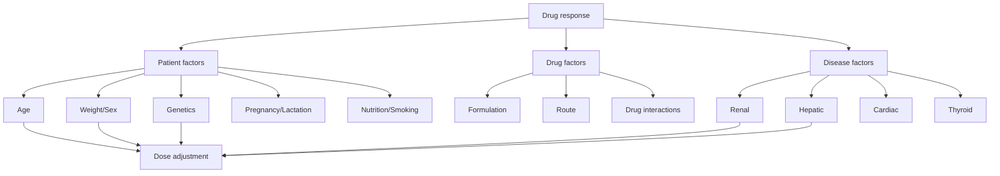
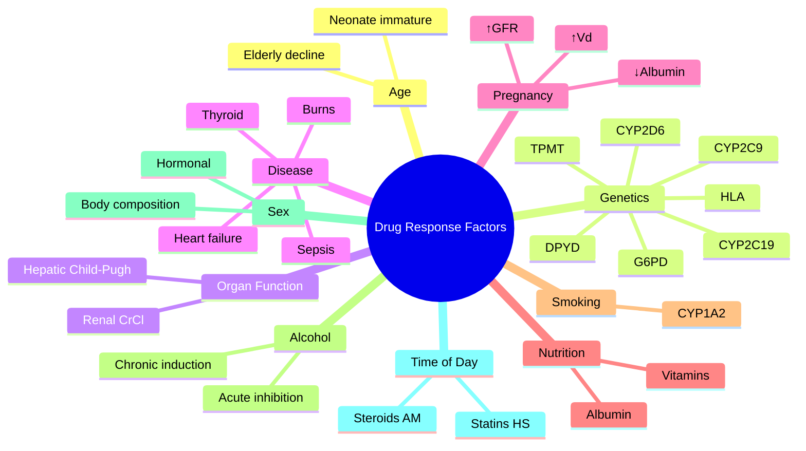

# Pharmacokinetics — Factors Influencing Drug Response

> [!info]
> **Disease-Level Topic** under **Principles of Clinical Pharmacology → Pharmacokinetics**.
> Davidson 24e Ch2 (Maxwell) — "Factors affecting drug response: age, organ function, genetics, drug interactions, drug formulation".

## 1. Learning Objectives
- [ ] Identify **patient-specific factors** affecting drug response
- [ ] Apply **age-related** dose adjustments (paediatric, elderly)
- [ ] Describe effect of **organ dysfunction** (renal, hepatic) on drug response
- [ ] Apply **genetic polymorphisms** (pharmacogenomics)
- [ ] Recognise **disease-state** modifications
- [ ] Discuss **nutritional state** and **smoking** effects
- [ ] Address **gender/sex** differences

## 2. Core Concepts

| Factor | Effect on Response | Examples |
|--------|-------------------|----------|
| **Age** | Paediatric (immature organs), elderly (↓ function) | Dose adjust in both |
| **Body size** | Weight-based dosing | mg/kg |
| **Sex/gender** | Body composition, hormonal | Higher Vd for lipophilic in F |
| **Genetics** | CYP polymorphisms, HLA | CYP2D6 PM, HLA-B*15:02 |
| **Organ function** | Renal/hepatic impairment | CrCl, Child-Pugh |
| **Disease** | Altered PK and PD | HF, thyroid, sepsis |
| **Pregnancy** | ↑ Vd, ↑ GFR, ↑ metabolism | Adjust doses |
| **Lactation** | Drug in breast milk | Avoid toxic drugs |
| **Nutrition** | Albumin, vitamins | Phenytoin (vitamin D), warfarin (vit K) |
| **Smoking** | CYP1A2 induction | Theophylline, clozapine |
| **Alcohol** | Acute vs chronic effects | Paracetamol (chronic = toxicity) |
| **Time of day** | Chronopharmacology | Statins (HS), corticosteroids (morning) |
| **Drug formulation** | Absorption rate | Modified release |

## 3. Mermaid Algorithm — Factors Influencing Drug Response

## 4. Comparison Tables

### 4.1 Age-Related Pharmacokinetic Changes

| Parameter | Neonate/Infant | Child | Adult | Elderly |
|-----------|----------------|-------|-------|---------|
| **Body water** | ↑ (more TBW) | Normal | Normal | ↓ |
| **Body fat** | ↓ | ↓ | Normal | ↑ |
| **Plasma albumin** | ↓ (less bound) | Normal | Normal | ↓ |
| **Gastric pH** | ↑ (less acid) | Normal | Normal | ↑ (less acid) |
| **Gastric emptying** | Slow | Faster | Normal | Slow |
| **GI motility** | Variable | Normal | Normal | Slow |
| **Hepatic enzymes** | Immature (some) | Mature | Mature | ↓ (some) |
| **GFR** | Low at birth; mature by 1-2 y | Mature | Mature | ↓ |
| **Renal blood flow** | Low | Mature | Mature | ↓ |
| **CYP activity** | Variable | Mature | Mature | ↓ |

**Clinical implications:**
- **Neonates:** ↑ Vd for water-soluble drugs (need higher mg/kg); ↓ protein binding; immature liver/kidney
- **Elderly:** ↓ CL for many drugs (lower doses); ↑ t½; ↑ sensitivity (e.g., anticoagulants, opioids, BZD); ↑ fall risk; polypharmacy

### 4.2 Genetic Polymorphisms (Pharmacogenomics)

| Gene | Drugs | Phenotype | Clinical Effect |
|------|-------|-----------|-----------------|
| **CYP2D6** | Codeine, tramadol, tamoxifen, haloperidol, metoprolol, propafenone | UM (1-3%), EM (40-50%), IM (5-10%), PM (5-10%) | Codeine: PM = no analgesia; Tamoxifen: PM = no effect |
| **CYP2C19** | Clopidogrel, PPIs, voriconazole, sertraline, diazepam, proguanil | UM, EM, IM, PM | Clopidogrel: PM = stent thrombosis; Voriconazole: PM = toxicity |
| **CYP2C9** | Warfarin, phenytoin, glipizide, losartan | *1, *2, *3 | Warfarin: *2/*3 = ↓ dose (↑ bleeding) |
| **VKORC1** | Warfarin | AA, AG, GG | AA = ↓ dose; GG = ↑ dose |
| **TPMT** | Azathioprine, 6-MP | Normal, intermediate, deficient | Deficient = severe myelosuppression |
| **NUDT15** | Azathioprine | Low, intermediate, high | Myelosuppression (esp. Asians) |
| **DPYD** | 5-FU, capecitabine, tegafur | Normal, deficient | Deficient = severe toxicity (death) |
| **UGT1A1** | Irinotecan, atazanavir, nilotinib | *1/*1, *28/*28 (Gilbert's), *28/*28 (Crigler-Najjar) | Irinotecan: severe neutropenia |
| **G6PD** | Primaquine, dapsone, sulfonamides, nitrofurantoin, fava beans | Variable (X-linked) | Haemolysis in deficient |
| **NAT2** | Isoniazid, hydralazine, procainamide, sulfonamides | Slow/fast acetylator | Slow = drug-induced lupus |
| **HLA-B*15:02** | Carbamazepine, oxcarbazepine, lamotrigine | Positive (Asian) | SJS/TEN |
| **HLA-B*57:01** | Abacavir | Positive | Hypersensitivity syndrome |
| **HLA-B*58:01** | Allopurinol | Positive (Han Chinese, Thai) | SJS/TEN |
| **HLA-A*31:01** | Carbamazepine | Positive (European, Japanese) | SJS/TEN |
| **F5 (Factor V Leiden)** | OCP, HRT, pregnancy | Positive | VTE risk (avoid OCP if homozygous) |
| **MTHFR** | Methotrexate | TT variant | ↑ Toxicity |

### 4.3 Pregnancy-Related PK Changes

| Parameter | Change | Effect |
|-----------|--------|--------|
| **Plasma volume** | ↑ 50% | ↑ Vd (hydrophilic) |
| **Body fat** | ↑ | ↑ Vd (lipophilic) |
| **GFR** | ↑ 50% | ↑ CL (renally cleared) |
| **Hepatic blood flow** | ↑ | ↑ CL (high E drugs) |
| **CYP activity** | Variable (CYP3A4 ↑; CYP1A2 ↓) | Variable |
| **Albumin** | ↓ (dilution) | ↑ Free fraction |
| **Cardiac output** | ↑ | ↑ absorption (IM, SC) |
| **Gastric pH** | Variable | Variable absorption |
| **GI motility** | ↓ | Slower absorption |

**Clinical implications:**
- ↑ Dose for hydrophilic drugs (e.g., amoxicillin, cephalexin)
- ↑ Dose for renally-cleared drugs (β-lactams, lithium)
- Monitor free level for highly bound drugs (phenytoin, valproate)
- Avoid teratogenic drugs (warfarin, valproate, ACEi, methotrexate, isotretinoin, alcohol)
- Avoid drugs late in pregnancy that cause neonatal adaptation (SSRIs, opioids, BZD)

### 4.4 Renal Impairment Dose Adjustments

| CrCl (mL/min) | Stage | Action |
|---------------|-------|--------|
| **> 60** | Stage 1-2 | Standard dose |
| **30-60** | Stage 3a | Often reduce dose; extend interval |
| **15-30** | Stage 3b/4 | Reduce dose significantly; extend interval |
| **< 15** | Stage 5 (dialysis) | Substantial reduction; monitor levels |

**Drugs requiring dose adjustment:**
- Aminoglycosides, vancomycin, teicoplanin
- Digoxin, lithium, methotrexate
- Allopurinol, gabapentin, pregabalin
- ACEi/ARBs (cautious start)
- Metformin (avoid < 30)
- DOACs (dose reduce)
- β-lactams (some)
- Famciclovir, aciclovir
- LMWH (CrCl < 30: UFH preferred)
- Atenolol, sotalol
- Ranitidine, nizatidine
- Cetirizine, fexofenadine
- Duloxetine, memantine
- Tramadol, morphine (active metabolite accumulation)

**Drugs NOT requiring adjustment:**
- Most non-renal-cleared (e.g., theophylline, digoxin isn't all renal, lithium IS)
- Lipophilic, hepatically metabolised
- Bound drugs with low renal contribution

### 4.5 Hepatic Impairment Dose Adjustments

| Child-Pugh | Score | Action |
|------------|-------|--------|
| **A (mild)** | 5-6 | Generally standard; careful monitoring |
| **B (moderate)** | 7-9 | Reduce dose 25-50%; extend interval |
| **C (severe)** | 10-15 | Reduce dose 50% or avoid |

**Drugs requiring adjustment in cirrhosis:**
- Morphine (↓ CL)
- Midazolam, diazepam
- Propranolol
- Verapamil
- Warfarin (variable; ↑ sensitivity)
- Statins (avoid or reduce in decompensated)
- ACEi (start low; risk of AKI in ascites)

**Drugs to AVOID in cirrhosis:**
- NSAIDs (renal failure, GI bleed)
- Sedatives (BZD, opioids) — hepatic encephalopathy risk
- Aminoglycosides (renal + ototoxic)
- Direct hepatotoxins (paracetamol high dose, methotrexate, isoniazid, ketoconazole)
- ACEi/ARBs (can precipitate AKI; cautious in ascites)

### 4.6 Other Conditions Affecting Drug Response

| Condition | Effect | Drugs Affected |
|-----------|--------|----------------|
| **Heart failure** | ↓ hepatic blood flow → ↓ CL; ↓ CO → ↓ absorption | Lidocaine, propranolol, theophylline |
| **Hypothyroidism** | ↓ CL; ↑ sensitivity | Multiple |
| **Hyperthyroidism** | ↑ CL; ↓ sensitivity | Multiple |
| **Burns** | ↑ Vd; ↑ CL | Aminoglycosides |
| **Sepsis** | ↑ capillary leak; ↑ Vd; ↓ protein | Multiple |
| **Obesity** | ↑ Vd for lipophilic | Midazolam, lipophilic drugs |
| **Cachexia** | ↓ Vd; ↓ albumin | Multiple |
| **Pregnancy** | ↑ Vd; ↑ GFR; ↓ albumin | Multiple |
| **Lactation** | Drug in milk | Lipid-soluble, basic drugs (caution) |
| **Sleep** | Sympathetic tone ↓ | Antihypertensives, sedatives |
| **Stress** | ↑ sympathetic | Antihypertensives |
| **Smoking** | CYP1A2 induction | Theophylline, clozapine, olanzapine |
| **Alcohol (acute)** | CNS depression additive | Sedatives, opioids |
| **Alcohol (chronic)** | CYP2E1 induction | Paracetamol (toxicity), isoniazid, warfarin |

### 4.7 Nutritional State

| State | Effect | Drugs Affected |
|-------|--------|----------------|
| **Starvation/cachexia** | ↓ albumin (↑ free fraction) | Phenytoin, valproate, warfarin |
| **Obesity** | ↑ Vd for lipophilic | Midazolam, lipophilic drugs |
| **Vitamin K deficiency** | ↑ warfarin effect | Warfarin |
| **Vitamin D deficiency** | ↑ osteomalacia risk with antiresorptives | Bisphosphonates |
| **Iron deficiency** | ↑ iron absorption (paradoxical) | Iron supplements |
| **Low calcium** | ↑ neuromuscular excitability | Affects antiarrhythmics |
| **Low magnesium** | ↑ QT prolongation | Multiple QT-prolonging drugs |
| **Low potassium** | ↑ digoxin toxicity, ↑ QT | Digoxin, QT-prolonging drugs |
| **High protein diet** | Competes with levodopa | Levodopa (large neutral AA) |
| **Low protein diet** | Affects warfarin | Variable |

### 4.8 Sex/Gender Differences

| Difference | Detail |
|------------|--------|
| **Body composition** | F: more body fat (↑ Vd for lipophilic); M: more muscle |
| **Body water** | M: higher TBW; F: lower (V distributable volume for water-soluble) |
| **Gastric emptying** | Slower in F |
| **Hepatic metabolism** | CYP3A4: F > M (oral contraceptives); CYP1A2: M > F |
| **Renal function** | Smaller kidney size in F; CrCl calculated with 0.85 factor |
| **Pregnancy** | See 4.3 |
| **Specific drugs** | Zolpidem: 5 mg for F (vs 10 mg M); QT risk higher in F |
| **Hormonal contraception** | Affects many drug levels (cyclosporine, lamotrigine) |

## 5. FCPS/MRCP High-Yield Summary

| Pearl | Detail |
|-------|--------|
| Neonate GFR mature | 1-2 years |
| Elderly: watch for | Falls, delirium, anticholinergic, sedation, bleeding |
| Drugs to AVOID in elderly (Beers) | BZD, anticholinergics, TCAs, antipsychotics, PUD meds, sulphonylureas |
| CYP2D6 PM drugs | Codeine, tramadol, tamoxifen, haloperidol, metoprolol |
| CYP2C19 PM drugs | Clopidogrel, PPIs, voriconazole, sertraline |
| TPMT deficient | Severe myelosuppression with azathioprine |
| DPYD deficient | Severe toxicity with 5-FU (death) |
| G6PD deficient | Haemolysis with primaquine, dapsone, sulfonamides |
| HLA-B*15:02 positive (Asian) | Carbamazepine SJS/TEN |
| Pregnancy ↑ GFR | ↑ Clearance of renally-cleared drugs (β-lactams) |
| Pregnancy ↓ albumin | ↑ Free fraction of highly-bound drugs |
| Pregnancy drugs AVOID | Warfarin, valproate, ACEi, methotrexate, isotretinoin, alcohol, NSAIDs (3rd trimester) |
| Hepatic impairment (C-P C) | Reduce dose 50%; avoid BZD, opioids, NSAIDs |
| Heart failure | ↓ Hepatic flow → ↓ CL of high E drugs (lidocaine) |
| Smoking + theophylline | ↑ CL → higher dose |
| Hyperthyroid | ↑ CL; Hypothyroid = ↓ CL |
| Obesity (lipophilic) | Use TBW |
| Obesity (hydrophilic) | Use IBW/adjusted |
| Time-of-day dosing | Statins (HS); corticosteroids (morning); ACEi (HS) |
| Sublingual GTN | Bypasses first-pass (works) |
| Pharmacogenomic tests | Clopidogrel (CYP2C19), codeine (CYP2D6), azathioprine (TPMT), 5-FU (DPYD), abacavir (HLA-B*57:01), carbamazepine (HLA-B*15:02) |

## 6. Viva Questions (10)

1. **List 5 factors that influence drug response.**
   *Age (paediatric, elderly), body size/weight, organ function (renal, hepatic), genetics, sex, pregnancy, disease states, nutrition, smoking, alcohol, drug interactions, drug formulation.*

2. **What is the clinical relevance of CYP2D6 polymorphism for codeine?**
   *Codeine requires CYP2D6 to convert to morphine. Poor metabolisers (PM, 5-10% of Caucasians) have no analgesia. Ultra-rapid metabolisers (UM, 1-3%) have rapid conversion and risk of toxicity (respiratory depression). FDA black box warning.*

3. **Why is HLA-B*15:02 screening recommended before carbamazepine in Asians?**
   *HLA-B*15:02 is strongly associated with SJS/TEN in Asian populations (Han Chinese, Thai, Malaysian) when given carbamazepine. FDA recommends screening in at-risk populations. Positive patients should receive alternative (e.g., levetiracetam, valproate).*

4. **How does pregnancy affect drug pharmacokinetics?**
   *Plasma volume ↑ 50%, body fat ↑, GFR ↑ 50%, albumin ↓ (↑ free fraction), CYP3A4 ↑ (some), CYP1A2 ↓. Effect: ↑ Vd for hydrophilic drugs; ↑ CL for renally-cleared drugs; ↑ free fraction of highly-bound drugs.*

5. **What dose adjustment is needed for aminoglycosides in renal failure?**
   *Loading dose unchanged (depends on Vd). Maintenance: reduce dose OR extend interval (Hartford nomogram: 5-7 mg/kg every 24-48 h). Monitor trough levels.*

6. **What is the Beers Criteria?**
   *List of potentially inappropriate medications (PIMs) for older adults (≥65 y). Includes BZD, anticholinergics, TCAs, antipsychotics, sulphonylureas (long-acting), NSAIDs (chronic), zolpidem, etc. Used to reduce ADRs in elderly.*

7. **Why does smoking affect theophylline dosing?**
   *Cigarette smoke induces CYP1A2 (and possibly others). Smokers metabolise theophylline faster → ↓ levels → need higher doses. On stopping smoking, levels rise (dose reduction needed).*

8. **How does hypothyroidism affect drug response?**
   *↓ CYP activity → ↓ CL → ↑ drug levels. ↑ Sensitivity at receptor level. Multiple drugs affected. In myxoedema, give lower doses and titrate slowly.*

9. **A patient on digoxin develops toxicity after starting amiodarone. Why?**
   *Amiodarone increases digoxin levels by: (1) displacing from tissue (P-gp inhibition), (2) reducing renal clearance. Digoxin dose should be reduced by 30-50% when starting amiodarone.*

10. **A patient on chronic corticosteroid therapy undergoes surgery. What is the perioperative plan?**
    *HPA axis suppression. Stress-dose hydrocortisone (100 mg IV at induction, then 50 mg 8-hourly for 24-72 h, then taper). Resume usual oral steroid when stable.*

## 7. Confusions & Mnemonics

| Confusion | Resolution |
|-----------|------------|
| Age vs organ function | Age affects both directly + indirectly via organ decline |
| CYP2D6 vs CYP2C19 | CYP2D6 for codeine, tamoxifen; CYP2C19 for clopidogrel, PPIs |
| TPMT vs NUDT15 | Both affect azathioprine; TPMT (Caucasians), NUDT15 (Asians) |
| DPYD test | Pre-screen for 5-FU/capecitabine; death in deficient |
| G6PD inheritance | X-linked; males predominantly affected |
| Pregnancy drug class | A (safe), B (probably), C (caution), D (avoid), X (contraindicated) |
| Pregnancy ↑ GFR | β-lactams need higher doses |
| Pregnancy ↓ albumin | Free fraction of phenytoin, valproate, warfarin ↑ |
| Lactation drugs to avoid | Lithium, amiodarone, methotrexate, opioids, cytotoxic |
| CrCl formula | (140 - age) × wt × F / (72 × SCr) |
| Hepatic adjustment | Child-Pugh; reduce 25% in B, 50% in C |
| Smoking + CYP1A2 | ↑ CL of theophylline, clozapine, olanzapine |
| Acute vs chronic alcohol | Acute inhibits; chronic induces CYP2E1 |
| Obesity weight | TBW (lipophilic), IBW (hydrophilic) |
| Cachexia weight | Use actual (low weight) |
| Thyroid state | Hyper = ↑ CL; Hypo = ↓ CL |
| Heart failure | ↓ Hepatic flow → ↓ CL of high E drugs |
| CYP3A4 OCP | OCP inhibits CYP1A2, CYP2C19; affects many drugs |
| OCP and drugs | OCP levels ↓ by enzyme inducers; drug effect on OCP = weak |
| Drug-induced lupus | Hydralazine, procainamide, isoniazid, minocycline, methyldopa, quinidine, chlorpromazine |
| Beers criteria | AVOID in elderly: long-acting BZD, anticholinergics, TCAs, antipsychotics, sulphonylureas |
| Polypharmacy | ≥5 medications; risk of interactions, ADRs, falls, confusion |

**Mnemonic — Drugs to AVOID in elderly (Beers): "**B**enzos **A**nticholinergics **T**CAs **A**ntipsychotics"** (BATA)

**Mnemonic — CYP2D6 drugs: "**C**odeine, **T**ramadol, **T**amoxifen, **H**aloperidol, **M**etoprolol"** (CTTHM)

**Mnemonic — Pharmacogenomic tests: "**2D6** codeine, **2C19** clopidogrel, **TPMT** azathioprine, **DPYD** 5-FU, **G6PD** primaquine"** (2-2-T-D-G)

**Mnemonic — Pregnancy drug classification: "**A**=safe, **B**=likely, **C**=caution, **D**=damage, **X**=contraindicated"**

**Mnemonic — Smoking + theophylline: "**S**mokers **S**moke **S**o require **H**igher **T**heophylline"**

**Mnemonic — G6PD drugs: "**P**rimaquine, **D**apsone, **S**ulfa, **N**itro, **F**ava"** (PDSNF)

**Mnemonic — Pregnancy drug avoidance: "**W**arfarin, **V**alproate, **A**CEi, **M**ethotrexate, **I**sotretinoin, **A**lcohol, **N**SAIDs"** (WVAMIAN)

## 8. Mermaid Mind Map

## 9. Spaced Repetition Tracker

| Topic | Day 1 | Day 3 | Day 7 | Day 14 | Day 30 |
|-------|-------|-------|-------|-------|--------|
| Age effects | ☐ | ☐ | ☐ | ☐ | ☐ |
| Pharmacogenomics | ☐ | ☐ | ☐ | ☐ | ☐ |
| Renal adjustment | ☐ | ☐ | ☐ | ☐ | ☐ |
| Hepatic adjustment | ☐ | ☐ | ☐ | ☐ | ☐ |
| Pregnancy | ☐ | ☐ | ☐ | ☐ | ☐ |
| Beers | ☐ | ☐ | ☐ | ☐ | ☐ |

## 10. Self-Test Scorecard

| Domain | Score (0-5) |
|--------|-------------|
| Age | /5 |
| Genetics | /5 |
| Renal | /5 |
| Hepatic | /5 |
| Pregnancy | /5 |
| Disease | /5 |
| **TOTAL** | **/30** |

## 11. MCQs (10)

1. **CYP2D6 poor metabolisers get NO analgesia from:**
   A. Paracetamol
   B. Codeine ✓
   C. Tramadol (parent)
   D. Morphine
   E. Fentanyl

2. **HLA-B*15:02 screening is recommended before carbamazepine in:**
   A. All patients
   B. Caucasian patients
   C. Asian patients (Han Chinese, Thai, Malaysian) ✓
   D. African patients
   E. Children only

3. **TPMT deficiency requires dose adjustment for:**
   A. Methotrexate
   B. Azathioprine ✓
   C. 6-mercaptopurine (prodrug of azathioprine)
   D. All of the above (TPMT affects both AZA and 6-MP)

4. **Pregnancy increases:**
   A. GFR
   B. Plasma volume
   C. Both A and B ✓
   D. Neither
   E. Albumin

5. **Smoking affects theophylline by:**
   A. Decreasing metabolism
   B. Increasing CYP1A2 → ↑ metabolism ✓
   C. Increasing CYP2D6
   D. Decreasing absorption
   E. Increasing clearance via kidney

6. **Which drug is contraindicated in pregnancy?**
   A. Paracetamol
   B. Warfarin ✓
   C. Amoxicillin
   D. Levothyroxine
   E. Iron

7. **In severe hepatic impairment (Child-Pugh C), morphine dose should be:**
   A. Doubled
   B. Reduced by 25%
   C. Reduced by 50% or avoided ✓
   D. Standard
   E. Stopped permanently

8. **Aminoglycoside dosing in CKD (CrCl 30):**
   A. Standard dose
   B. Loading dose + reduced/extended maintenance ✓
   C. Loading dose only
   D. No dose needed
   E. Daily low dose

9. **G6PD deficiency haemolysis is caused by:**
   A. Penicillin
   B. Primaquine ✓
   C. Erythromycin
   D. Paracetamol
   E. NSAIDs (some)

10. **In acute heart failure, theophylline level may:**
    A. Decrease (↑ CL)
    B. Increase (↓ CL due to ↓ hepatic flow) ✓
    C. Stay the same
    D. Vary with food
    E. Be unmeasurable

## 12. SBAs (5)

1. **A 30-year-old is given codeine for post-op pain. No relief. Best explanation:**
   - A) Non-compliance
   - B) CYP2D6 poor metaboliser — cannot convert codeine to morphine ✓
   - C) Allergy
   - D) Wrong diagnosis
   - E) Drug interaction

2. **A 50-year-old Asian patient is being started on carbamazepine for epilepsy. Pre-treatment screening should include:**
   - A) TPMT
   - B) HLA-B*15:02 (SJS/TEN risk in Asians) ✓
   - C) CYP2D6
   - D) G6PD
   - E) HLA-B*57:01

3. **A patient on azathioprine develops severe pancytopenia. Cause:**
   - A) Drug allergy
   - B) TPMT deficiency → 6-TG accumulation → myelosuppression ✓
   - C) Viral infection
   - D) Bone marrow failure
   - E) Wrong diagnosis

4. **A pregnant patient needs antibiotics for UTI. Best choice:**
   - A) Tetracycline
   - B) Nitrofurantoin (avoid in 1st/3rd; 2nd OK)
   - C) Cephalexin or amoxicillin (pregnancy-safe) ✓
   - D) Quinolone
   - E) Aminoglycoside

5. **A 75-year-old is started on theophylline. The dose should be:**
   - A) Standard
   - B) Reduced (elderly have ↓ CL) ✓
   - C) Doubled
   - D) Divided into multiple doses
   - E) Stopped

## 13. Answer Key

### MCQ Answers
1. **B** (Codeine = CYP2D6)
2. **C** (HLA-B*15:02 in Asians)
3. **D** (TPMT affects AZA + 6-MP)
4. **C** (Pregnancy ↑ GFR + volume)
5. **B** (Smoking induces CYP1A2)
6. **B** (Warfarin = teratogenic)
7. **C** (Reduce 50% in C-P C)
8. **B** (Loading + reduce)
9. **B** (Primaquine in G6PD)
10. **B** (↑ Theophylline in HF)

### SBA Answers
1. **B** — CYP2D6 PM = no codeine→morphine conversion = no analgesia.
2. **B** — HLA-B*15:02 screening in Asians before carbamazepine.
3. **B** — TPMT deficiency → toxic 6-TG levels → myelosuppression.
4. **C** — Cephalexin/amoxicillin safe in pregnancy; tetracycline/quinolone contraindicated.
5. **B** — Elderly have ↓ CL; reduce theophylline dose.

## 14. Summary Box

> **Factors:** age (neonate immature; elderly decline), genetics (CYP2D6/CYP2C19/TPMT/DPYD/G6PD/HLA), renal (CrCl), hepatic (Child-Pugh), pregnancy (↑ Vd, ↑ GFR, ↓ albumin), lactation (avoid toxic), nutrition (albumin, vitamins), smoking (CYP1A2), alcohol (acute inhibits, chronic induces), sex, time of day. **Beers criteria** for elderly: avoid long-acting BZD, anticholinergics, TCAs, antipsychotics. **Pregnancy avoid:** warfarin, valproate, ACEi, methotrexate, isotretinoin, NSAIDs (3rd trimester). **Pharmacogenomic tests:** codeine (CYP2D6), clopidogrel (CYP2C19), azathioprine (TPMT/NUDT15), 5-FU (DPYD), abacavir (HLA-B*57:01), carbamazepine (HLA-B*15:02 in Asians).

---

## Cross-Links
- **Parent Heading**: [[../../Principles of Clinical Pharmacology|Principles of Clinical Pharmacology]]
- **Sibling Topics**: [[Compliance, Adherence, Concordance]] | (sibling: Adherence within same heading)
- **Chapter MOC**: [[Clinical Therapeutics and Good Prescribing MOC]]
- **Related**: [[Special Populations/Renal Impairment/Renal Drug Dosing]], [[Special Populations/Hepatic Impairment/Hepatic Drug Dosing]], [[Special Populations/Elderly Prescribing]], [[Special Populations/Pregnancy and Lactation]]

**Last Updated:** 2026-06-15  
**Status: FULLY COMPLETE with Exam Suite (Viva 10, MCQ 10, SBA 5, Answer Key, Confusions, Mind Map, Spaced Repetition, Self-Test, Exam Modes)**
