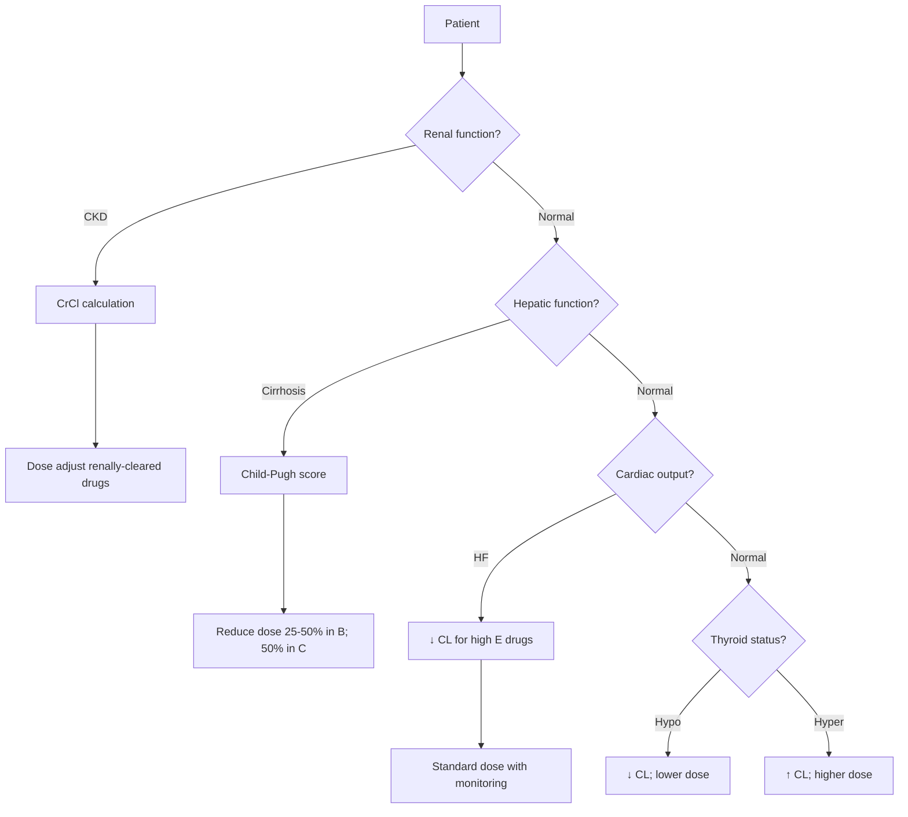
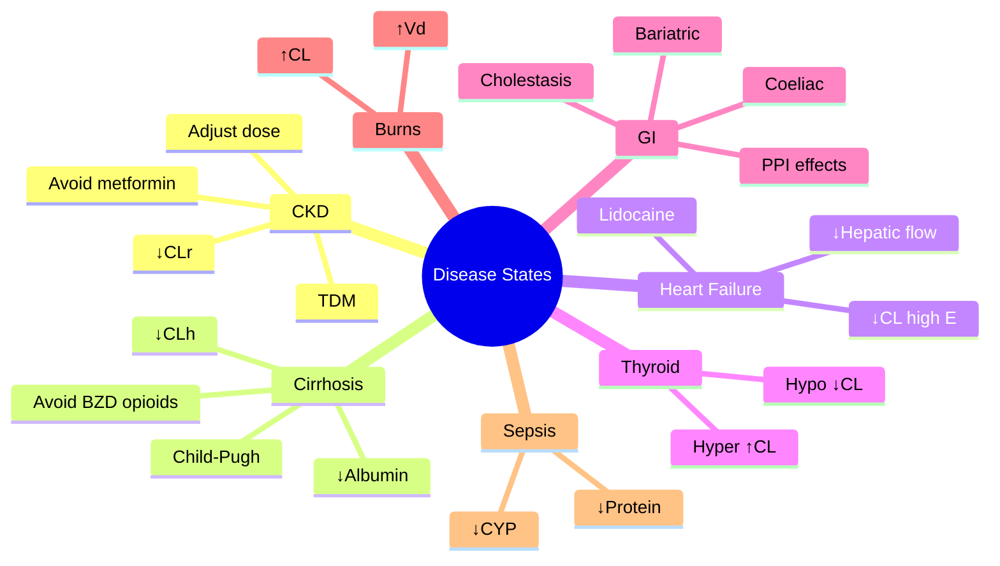

# Pharmacokinetics — Disease States (Renal, Hepatic, Cardiac, Thyroid, GI)

> [!info]
> **Disease-Level Topic** under **Principles of Clinical Pharmacology → Pharmacokinetics**.
> Davidson 24e Ch2 (Maxwell) — "Disease states" (within factors affecting drug response).

## 1. Learning Objectives
- [ ] Recognise how **renal disease** alters drug response
- [ ] Apply **hepatic adjustment** in cirrhosis
- [ ] Explain **cardiac failure** effects on PK
- [ ] Discuss **thyroid disease** effects
- [ ] Address **GI disease** effects
- [ ] Apply **CKD and Liver disease** dose adjustments

## 2. Core Concepts

| Disease | PK Effect | Drugs Most Affected |
|---------|-----------|---------------------|
| **CKD** | ↓ CLr, ↓ protein binding, ↑ Vd (some), ↓ CYP (uremia) | Aminoglycosides, digoxin, lithium, ACEi |
| **Cirrhosis** | ↓ CLh (↓ CYP, ↓ flow), ↓ albumin, ↓ clotting, ↑ portosystemic shunting | Morphine, midazolam, warfarin, statins |
| **Heart failure** | ↓ CO → ↓ hepatic flow, ↓ GFR (severe) | Lidocaine, propranolol, theophylline |
| **Hypothyroidism** | ↓ CYP, ↓ renal blood flow | Multiple |
| **Hyperthyroidism** | ↑ CYP, ↑ renal blood flow | Multiple |
| **IBD (Crohn's, UC)** | ↓ Absorption, ↑ motility | Variable |
| **Coeliac disease** | ↓ Absorption | Variable |
| **Bariatric surgery** | ↓ Absorption (esp. extended-release) | Variable |
| **Pancreatitis** | ↓ Lipid-soluble drug absorption | Variable |
| **Cholestasis** | ↓ Biliary excretion | P-gp substrates |
| **Burns** | ↑ Vd, ↑ CL (hypermetabolic) | Aminoglycosides |
| **Sepsis** | ↑ Capillary leak, ↓ protein, ↓ CYP | Multiple |

## 3. Mermaid Algorithm — Disease State Dose Adjustment

## 4. Comparison Tables

### 4.1 Renal Impairment Dose Adjustments

| Parameter | Change | Effect on Dosing |
|-----------|--------|------------------|
| **GFR/CrCl** | ↓ | ↓ Dose or extend interval |
| **Vd (water-soluble)** | ↑ (fluid overload) | ↑ Loading dose |
| **Vd (lipophilic)** | Variable | Less affected |
| **Protein binding** | ↓ (hypoalbuminaemia, uraemia) | ↑ Free fraction (phenytoin, valproate) |
| **CYP activity** | ↓ in uraemia (esp. CYP3A4, CYP2C9) | ↓ CL of hepatically-cleared |
| **Active metabolites** | Accumulate (e.g., M6G, NAPA) | Toxicity |
| **Transporter function** | Altered | OAT, OCT affected |

**CKD drugs to AVOID or dose adjust:**
- Metformin (avoid eGFR < 30)
- NSAIDs (renal + GI risk)
- Aminoglycosides (reduce + TDM)
- Vancomycin (TDM)
- Digoxin (reduce; not dialysed)
- Lithium (reduce; TDM)
- Methotrexate (high dose: hydration + leucovorin)
- ACEi/ARBs (cautious start, monitor K+)
- Direct oral anticoagulants (DOACs) — reduce
- LMWH (CrCl < 30: use UFH or reduce)
- Gabapentin, pregabalin (reduce)
- Allopurinol (reduce; oxypurinol accumulates)
- Aciclovir, valacyclovir (crystalline nephropathy)
- Atenolol, sotalol (renal cleared)
- Nitrofurantoin (ineffective CrCl < 30)
- Baclofen (reduce; risk of encephalopathy)
- Bisphosphonates (caution in severe CKD)
- Gadolinium (NSF risk in CKD 4-5)

### 4.2 Hepatic Impairment Dose Adjustments

| Parameter | Change | Effect on Dosing |
|-----------|--------|------------------|
| **CYP activity** | ↓ (esp. CYP3A4, CYP2C19) | ↓ CL |
| **Hepatic blood flow** | ↓ (shunting) | ↓ CL of high E drugs |
| **Albumin** | ↓ | ↑ Free fraction |
| **Biliary excretion** | ↓ | Drug accumulation (P-gp substrates) |
| **Clotting factors** | ↓ | Bleeding risk; warfarin tricky |
| **Volume of distribution** | ↑ (ascites, oedema) | ↑ Loading dose (some drugs) |
| **First-pass metabolism** | ↓ (portosystemic shunting) | ↑ Bioavailability of high E drugs |

**Drugs to AVOID in cirrhosis:**
- NSAIDs (renal failure, GI bleed)
- Sedatives: BZD, opioids (encephalopathy)
- Aminoglycosides (renal + ototoxic)
- Direct hepatotoxins (paracetamol high dose, methotrexate, isoniazid, ketoconazole)
- ACEi/ARBs (can precipitate AKI in ascites)
- Statins (in decompensated)
- Vasopressin analogues (in hyponatraemia/SIADH caution)

**Drugs requiring dose reduction in cirrhosis:**
- Morphine (↓ CL; M6G accumulation)
- Midazolam, diazepam, alprazolam
- Propranolol, labetalol
- Verapamil, diltiazem
- Warfarin (variable; ↑ sensitivity due to ↓ clotting factors)
- Proton pump inhibitors
- H2 receptor antagonists
- Macrolides (erythromycin, clarithromycin)
- Metronidazole
- Omeprazole, esomeprazole (CYP2C19)

### 4.3 Heart Failure Effects

| Effect | Mechanism | Drugs Affected |
|--------|-----------|----------------|
| ↓ Hepatic blood flow | ↓ CO → ↓ liver perfusion | Lidocaine, propranolol, theophylline, morphine (high E) |
| ↓ GFR (severe) | ↓ Renal perfusion | ACEi, furosemide (↓ efficacy), digoxin |
| ↓ Absorption (oedema, gut oedema) | Gut wall oedema | Furosemide (variable), others |
| ↑ Vd (oedema) | Fluid overload | Aminoglycosides (need higher loading) |
| ↓ CYP activity (severity-related) | Hypoxia, congestion | Variable |
| Hypokalaemia (diuretics) | ↑ Digoxin toxicity | Digoxin |
| Hyponatraemia (severity-related) | SIADH-like | Multiple |

### 4.4 Thyroid Disease

| Status | CYP Activity | Renal Function | Dose Adjustment |
|--------|--------------|----------------|-----------------|
| **Hypothyroid** | ↓ | ↓ Renal blood flow | ↓ Dose; titrate slowly |
| **Hyperthyroid** | ↑ | ↑ GFR | ↑ Dose; monitor |

**Specific considerations:**
- **Hypothyroid:** ↑ Sensitivity to CNS depressants (BZD, opioids), anticoagulants; ↓ CL of multiple drugs; bradycardia with β-blockers
- **Hyperthyroid:** ↓ Sensitivity to inotropes; ↑ CL; may need higher digoxin, β-blocker doses
- **Thyroid replacement (levothyroxine):** Start low, titrate by TSH (6-week intervals)

### 4.5 GI Disease Effects

| Condition | Effect | Drugs Affected |
|-----------|--------|----------------|
| **Achal/gastroparesis** | Delayed absorption | Paracetamol, others |
| **IBS (diarrhoea)** | ↓ Absorption | OCP, antibiotics, ER formulations |
| **IBD (active flare)** | ↓ Absorption (mucosal damage) | Variable; consider IV |
| **Coeliac** | ↓ Absorption (villous atrophy) | Variable; iron, B12, folate deficiency |
| **Bariatric (Roux-en-Y)** | ↓ Absorption (esp. ER, lipophilic) | OCP, ER opioids, lipophilic drugs |
| **Pancreatic insufficiency** | ↓ Lipophilic absorption | Vitamins A, D, E, K; some drugs |
| **Cholestasis** | ↓ Fat-soluble drug absorption | Vitamins A, D, E, K; OCP, cyclosporine, tacrolimus |
| **PPI use (long-term)** | ↓ Acid, ↓ Ca²⁺, Mg²⁺, B12 absorption | Bisphosphonates, iron, B12, levothyroxine, ketoconazole |
| **H. pylori eradication** | ↑ pH (transient) | Acid-dependent drugs |

## 5. FCPS/MRCP High-Yield Summary

| Pearl | Detail |
|-------|--------|
| CKD adjustment drugs | Aminoglycosides, vancomycin, digoxin, lithium, MTX, ACEi, metformin, DOACs, gabapentin, allopurinol |
| CKD avoid | Metformin (eGFR < 30), nitrofurantoin (ineffective), tetracyclines (anti-anabolic) |
| Cirrhosis avoid | NSAIDs, BZD, opioids, ACEi (in ascites) |
| Cirrhosis reduce | Morphine, midazolam, propranolol, verapamil |
| Liver Child-Pugh | A (mild) → standard; B (mod) → reduce 25-50%; C (severe) → reduce 50% or avoid |
| Heart failure | ↓ Hepatic flow → ↓ CL (high E drugs: lidocaine, propranolol) |
| Hypothyroid | ↓ CL; ↓ renal flow; ↓ CYP |
| Hyperthyroid | ↑ CL; ↑ GFR |
| Hypothyroid + warfarin | ↑ Sensitivity; ↓ dose |
| Liver + warfarin | Variable; ↓ clotting factors |
| Coeliac + drugs | Variable; consider separate iron, B12 |
| Bariatric + ER | ↓ Absorption of extended-release |
| PPI long-term | ↓ Mg²⁺, Ca²⁺, B12, Fe; C. difficile risk |
| Cholestasis | ↓ Fat-soluble drug absorption (vit A, D, E, K) |
| GFR estimation | Cockcroft-Gault for drug dosing |
| Liver function tests | Don't predict metabolism well; use Child-Pugh |
| Albumin | ↓ in cirrhosis → ↑ free fraction |
| Bilirubin | Not reliable for hepatic metabolism |
| Child-Pugh components | Albumin, bilirubin, INR, ascites, encephalopathy |
| MELD score | For transplant; not for drug dosing |
| Renal dose formula | Standard dose × (patient CrCl / normal CrCl) |
| Hepatic dose formula | No validated formula; clinical judgement + TDM |

## 6. Viva Questions (10)

1. **A patient with CKD (CrCl 25) needs antibiotic for UTI. Nitrofurantoin or trimethoprim?**
   *Nitrofurantoin is INEFFECTIVE in CKD (CrCl < 30) — cannot achieve urinary concentration. Trimethoprim is acceptable but may cause hyperkalaemia and false ↑ SCr (blocks tubular secretion). Consider cephalexin or amoxicillin-clavulanate.*

2. **A patient with cirrhosis (Child-Pugh B) is in severe pain. Best opioid choice?**
   *Avoid morphine (active metabolite M6G accumulates; risk of encephalopathy). Consider tramadol (reduce dose) or oxycodone (reduce dose, careful monitoring). Or use local/regional analgesia (e.g., epidural, nerve block) when possible.*

3. **A patient with heart failure is given lidocaine. Effect?**
   *Lidocaine is a high E drug (extraction ratio > 0.7). Hepatic metabolism depends on hepatic blood flow. HF reduces hepatic flow → ↓ lidocaine CL → ↑ levels → toxicity risk. Reduce dose or use alternative.*

4. **A patient with hypothyroidism is started on warfarin. Effect on INR?**
   *Hypothyroid patients have ↑ sensitivity to warfarin (↓ CYP, ↓ clotting factor metabolism). Lower doses needed. In myxoedema, monitor closely; levothyroxine replacement can reverse the effect.*

5. **A patient with CKD (eGFR 25) is given metformin. What is the risk?**
   *Metformin is contraindicated in eGFR < 30 due to lactic acidosis risk. Accumulation occurs. Stop or switch to alternative (insulin, gliclazide, sitagliptin, etc.). Reduce dose at eGFR 30-45.*

6. **A patient with severe liver disease (Child-Pugh C) is given paracetamol. Safe dose?**
   *Standard doses of paracetamol (up to 4 g/day) are safe in cirrhosis; avoid exceeding 2-3 g/day in decompensated disease. Paracetamol is still preferred over NSAIDs (which are contraindicated). Avoid alcohol and high doses (>4 g).*

7. **A patient on chronic PPI develops hypomagnesaemia. Why?**
   *Long-term PPIs can cause hypomagnesaemia via reduced intestinal absorption (TRPM6 channel). Monitor Mg²⁺ in chronic PPI use. Other risks: ↓ Ca²⁺ (osteoporosis, fractures), ↓ B12, ↑ C. difficile.*

8. **A patient on digoxin is started on amiodarone. Effect?**
   *Amiodarone inhibits P-gp and reduces digoxin renal clearance. Digoxin level can rise 30-50%. Reduce digoxin dose by 30-50% when starting amiodarone. Monitor digoxin level.*

9. **A patient with cirrhosis develops AKI (HRS, hepatorenal syndrome). Best management?**
   *Terlipressin (vasopressin analogue) + albumin is first-line. Midodrine + octreotide + albumin is alternative. Avoid nephrotoxic drugs (NSAIDs, aminoglycosides, contrast). Liver transplant is definitive.*

10. **A patient on amiodarone with severe renal failure (CrCl 15). Toxicity risk?**
    *Amiodarone is highly lipophilic, large Vd, hepatically metabolised (CYP3A4), biliary excretion. Not significantly renally cleared. Dose adjustment usually not needed. However, monitor for pulmonary, hepatic, thyroid, ocular, neuro, skin toxicities (cumulative).*

## 7. Confusions & Mnemonics

| Confusion | Resolution |
|-----------|------------|
| CKD dose adjustment | CrCl × (dose factor) or standard dose × (CrCl/normal) |
| Cirrhosis adjustment | Child-Pugh; reduce 25-50% in B; 50% in C |
| CKD avoid drugs | Metformin, nitrofurantoin, NSAIDs, aminoglycosides |
| Cirrhosis avoid drugs | NSAIDs, BZD, opioids, ACEi (in ascites) |
| HF high E drugs | Lidocaine, propranolol, theophylline, morphine (↓ CL) |
| Hypothyroid + warfarin | ↑ Sensitivity; ↓ dose |
| Hyperthyroid + warfarin | ↓ Sensitivity; ↑ dose (controversial) |
| Cockcroft-Gault | Use for drug dosing; not eGFR |
| Child-Pugh | Use for hepatic drug dosing |
| MELD | Transplant only |
| Cholestasis | ↓ Fat-soluble vitamin absorption |
| Bariatric + ER | ↓ Absorption of extended-release |
| Coeliac | Villous atrophy → ↓ absorption; consider IV |
| PPI long-term | ↓ Mg²⁺, Ca²⁺, B12, Fe; C. difficile, fracture risk |
| Acute vs chronic HF | Acute: ↓ flow; chronic: adaptation |
| HF hepatic effects | ↓ Flow → ↓ CYP → ↓ CL |
| Albumin ↓ in cirrhosis | ↑ Free fraction of phenytoin, valproate, warfarin |
| TDM in CKD | Vancomycin, aminoglycosides, digoxin, lithium |
| TDM in cirrhosis | Phenytoin (free), valproate, lithium (renal) |

**Mnemonic — CKD dose adjustment drugs: "**A**minoglycosides, **V**ancomycin, **D**igoxin, **L**ithium, **M**ethotrexate, **A**CEi, **M**etformin, **D**OACs, **G**abapentin"** (AVDLM-AMDG)

**Mnemonic — Cirrhosis avoid: "**N**o **N**SAIDs/**B**enzos/**O**pioids/**A**CEi (in ascites) = **NNBOA**"**

**Mnemonic — HF high E drugs: "**L**idocaine, **P**ropranolol, **T**heophylline, **M**orphine = **LPTM**"** (Liver perfusion drugs)

**Mnemonic — Hypothyroidism + warfarin: "**H**ypothyroid = **H**igher sensitivity; **H**alve the **H**eparin"; "**H**yperthyroid = **H**igher CL; **H**igher dose"

**Mnemonic — Child-Pugh: "**A**lbumin, **B**ilirubin, **I**NR, **A**scites, **E**ncephalopathy"** (ABIAE)

**Mnemonic — Cockcroft-Gault: "(140 - age) × wt × F / 72 × SCr; F = 1 male, 0.85 female"**

**Mnemonic — Nitrofurantoin in CKD: "**N**o **N**ephron **N**o **N**itrofurantoin"** (4 Ns; ineffective if CrCl < 30)

**Mnemonic — Bariatric + ER: "**B**ypass **B**reaks **E**xtended **R**elease"** (no ER after bariatric)

## 8. Mermaid Mind Map

## 9. Spaced Repetition Tracker

| Topic | Day 1 | Day 3 | Day 7 | Day 14 | Day 30 |
|-------|-------|-------|-------|-------|--------|
| CKD | ☐ | ☐ | ☐ | ☐ | ☐ |
| Cirrhosis | ☐ | ☐ | ☐ | ☐ | ☐ |
| HF | ☐ | ☐ | ☐ | ☐ | ☐ |
| Thyroid | ☐ | ☐ | ☐ | ☐ | ☐ |
| GI | ☐ | ☐ | ☐ | ☐ | ☐ |

## 10. Self-Test Scorecard

| Domain | Score (0-5) |
|--------|-------------|
| CKD | /5 |
| Cirrhosis | /5 |
| HF | /5 |
| Thyroid | /5 |
| GI | /5 |
| **TOTAL** | **/25** |

## 11. MCQs (10)

1. **In CKD (CrCl 25), which drug is contraindicated?**
   A. Digoxin
   B. Metformin ✓
   C. Atenolol
   D. Allopurinol
   E. Gabapentin

2. **Nitrofurantoin in CKD (CrCl 25):**
   A. Effective
   B. Ineffective (low urinary concentration) ✓
   C. Toxic
   D. Same dose
   E. Need loading

3. **A patient with cirrhosis (Child-Pugh C) needs analgesia. Best choice:**
   A. Morphine
   B. NSAIDs
   C. Paracetamol (max 2-3 g/day) or tramadol ✓
   D. Codeine
   E. Pethidine

4. **Drugs to AVOID in cirrhosis:**
   A. Paracetamol
   B. NSAIDs ✓
   C. Cephalosporins
   D. Penicillins
   E. Beta-lactams

5. **Heart failure reduces clearance of:**
   A. Digoxin
   B. Lidocaine (high E) ✓
   C. Gentamicin
   D. Lithium
   E. Atenolol

6. **In hypothyroidism, drug doses should generally be:**
   A. Increased
   B. Reduced ✓
   C. Doubled
   D. Unchanged
   E. Stopped

7. **Long-term PPI use can cause:**
   A. Hyperkalaemia
   B. Hypomagnesaemia ✓
   C. Hyponatraemia
   D. Hypercalcaemia
   E. Hypoglycaemia

8. **Cholestasis impairs absorption of:**
   A. Water-soluble vitamins
   B. Fat-soluble vitamins (A, D, E, K) ✓
   C. Minerals
   D. Proteins
   E. Carbohydrates

9. **Bariatric surgery impairs absorption of:**
   A. IV drugs
   B. Extended-release drugs ✓
   C. Sublingual drugs
   D. Topical drugs
   E. All drugs equally

10. **Child-Pugh B cirrhosis: morphine dose should be:**
    A. Doubled
    B. Reduced by 25-50% ✓
    C. Same
    D. Stopped permanently
    E. Increased

## 12. SBAs (5)

1. **A 70-year-old with eGFR 20 has T2DM on metformin 1 g BD. Best action:**
   - A) Continue same dose
   - B) Stop metformin (contraindicated at eGFR < 30) ✓
   - C) Reduce to 500 mg BD
   - D) Switch to insulin only
   - E) Add another oral

2. **A patient with cirrhosis (Child-Pugh C) is agitated. Best management:**
   - A) Diazepam
   - B) Midazolam
   - C) Haloperidol (lower dose) ✓
   - D) Chlorpromazine
   - E) Morphine

3. **A patient on digoxin is started on amiodarone. Best action:**
   - A) Increase digoxin
   - B) Reduce digoxin by 30-50% (P-gp/CYP3A4 interaction) ✓
   - C) Continue same dose
   - D) Stop digoxin
   - E) Switch to beta-blocker

4. **A patient with hypothyroidism is on warfarin 5 mg. INR rises. Mechanism:**
   - A) Increased absorption
   - B) Decreased CYP + ↓ clotting factors = ↑ sensitivity ✓
   - C) Drug interaction
   - D) Compliance
   - E) Wrong dose

5. **A patient with CKD (CrCl 20) is on lithium for bipolar. Best action:**
   - A) Continue same dose
   - B) Reduce dose; monitor level; avoid thiazides/NSAIDs ✓
   - C) Stop lithium
   - D) Switch to valproate
   - E) Add NSAID

## 13. Answer Key

### MCQ Answers
1. **B** (Metformin contraindicated eGFR < 30)
2. **B** (Nitrofurantoin ineffective)
3. **C** (Paracetamol max 2-3 g in C-P C)
4. **B** (NSAIDs avoid in cirrhosis)
5. **B** (Lidocaine high E)
6. **B** (Reduced in hypothyroidism)
7. **B** (Hypomagnesaemia)
8. **B** (Fat-soluble vitamins)
9. **B** (ER drugs)
10. **B** (Reduce 25-50% in C-P B)

### SBA Answers
1. **B** — Stop metformin at eGFR < 30 (lactic acidosis).
2. **C** — Haloperidol preferred (less hepatic encephalopathy).
3. **B** — Reduce digoxin 30-50% (P-gp/CYP3A4).
4. **B** — Hypothyroidism ↑ warfarin sensitivity.
5. **B** — Reduce lithium; avoid thiazides, NSAIDs (↑ Li level).

## 14. Summary Box

> **CKD**: dose adjust aminoglycosides, vancomycin, digoxin, lithium, MTX, ACEi, metformin (avoid eGFR < 30), DOACs, gabapentin, allopurinol. **Nitrofurantoin** ineffective if CrCl < 30. **Cirrhosis**: avoid NSAIDs, BZD, opioids, ACEi (in ascites); reduce morphine, midazolam, propranolol, verapamil (Child-Pugh B: 25-50%, C: 50%). **Heart failure**: ↓ hepatic flow → ↓ CL of high E drugs (lidocaine, propranolol, theophylline). **Hypothyroidism**: ↓ CL, ↑ warfarin sensitivity. **Hyperthyroidism**: ↑ CL. **PPI long-term**: ↓ Mg²⁺, Ca²⁺, B12, Fe; C. difficile. **Bariatric surgery**: ↓ ER drug absorption. **Cockcroft-Gault** for drug dosing; **Child-Pugh** for liver.

---

## Cross-Links
- **Parent Heading**: [[../../Principles of Clinical Pharmacology|Principles of Clinical Pharmacology]]
- **Sibling Topics**: [[Age, Weight, and Sex]], [[Genetics and Pharmacogenomics]], [[Adherence and Concordance]]
- **Chapter MOC**: [[Clinical Therapeutics and Good Prescribing MOC]]
- **Related**: [[Excretion and Clearance]], [[Special Populations/Renal Impairment/Renal Drug Dosing]], [[Special Populations/Hepatic Impairment/Hepatic Drug Dosing]]

**Last Updated:** 2026-06-15  
**Status: FULLY COMPLETE with Exam Suite (Viva 10, MCQ 10, SBA 5, Answer Key, Confusions, Mind Map, Spaced Repetition, Self-Test, Exam Modes)**
