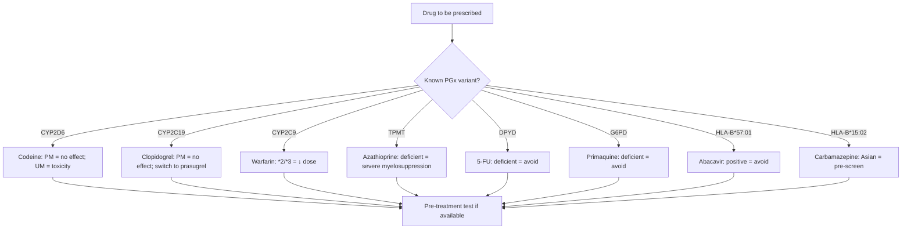
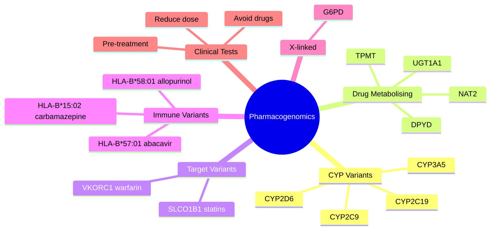

# Pharmacokinetics — Genetics and Pharmacogenomics

> [!info]
> **Disease-Level Topic** under **Principles of Clinical Pharmacology → Pharmacokinetics**.
> Davidson 24e Ch2 (Maxwell) — "Genetics" (within factors affecting drug response).

## 1. Learning Objectives
- [ ] Define **pharmacogenomics** and its clinical relevance
- [ ] Identify **major pharmacogenomic variants** affecting drug response
- [ ] Apply tests for **CYP2D6, CYP2C19, CYP2C9, TPMT, DPYD, G6PD, HLA**
- [ ] Recognise **racial/ethnic** pharmacogenomic differences
- [ ] Discuss **pros and cons** of pharmacogenomic testing
- [ ] Apply to **drug selection and dosing**

## 2. Core Concepts

| Term | Definition |
|------|-----------|
| **Pharmacogenomics** | Study of genetic variations affecting drug response |
| **Polymorphism** | Variant allele present in >1% of population |
| **Poor metaboliser (PM)** | Loss-of-function variants; ↓ metabolism |
| **Intermediate metaboliser (IM)** | Reduced function |
| **Extensive (normal) metaboliser (EM)** | Most common, normal function |
| **Ultra-rapid metaboliser (UM)** | Gain-of-function; ↑ metabolism |
| **Prodrug activation** | Drug activated by metabolism (codeine → morphine) |
| **Pharmacogenomic testing** | Pre-treatment screening for variants |
| **Hard-typed polymorphism** | Mendelian (single gene) — G6PD, TPMT |
| **HLA association** | Immune-mediated ADR (SJS/TEN) — HLA-B alleles |

## 3. Mermaid Algorithm — Pharmacogenomic Decision

## 4. Comparison Tables

### 4.1 Major Pharmacogenomic Variants

| Gene | Drugs Affected | Phenotype | Clinical Action |
|------|----------------|-----------|-----------------|
| **CYP2D6** | Codeine, tramadol, tamoxifen, haloperidol, metoprolol, propafenone, oxycodone, fluoxetine, paroxetine, amitriptyline | UM (1-3%), EM (40-50%), IM (5-10%), PM (5-10%) | Codeine: PM = no analgesia; switch to morphine. Tamoxifen: PM = no effect; switch to aromatase inhibitor |
| **CYP2C19** | Clopidogrel, PPIs (omeprazole), voriconazole, sertraline, fluoxetine, diazepam, proguanil, moclobemide | UM (~5%), EM (35-50%), IM (18-45%), PM (10-25% in Asians) | Clopidogrel: PM = use prasugrel/ticagrelor. Voriconazole: PM = toxicity, dose reduce |
| **CYP2C9** | Warfarin, phenytoin, glipizide, losartan, ibuprofen, diclofenac, celecoxib, fluvastatin | *1 (normal), *2, *3 (reduced) | Warfarin: *2/*3 carriers need 30-50% lower dose; algorithm: warfarin dosing |
| **VKORC1** | Warfarin | AA, AG, GG | AA = lower dose required; GG = higher dose |
| **CYP3A5** | Tacrolimus | *1 expressor (10-30% Caucasians; 50% Africans), *3 non-expressor | Tacrolimus: non-expressors need lower dose |
| **TPMT** | Azathioprine, 6-MP | Normal (90%), intermediate (10%), deficient (0.3%) | Deficient: avoid azathioprine OR 10% dose with monitoring |
| **NUDT15** | Azathioprine, 6-MP | Low activity variants (esp. Asians) | Deficient: reduce dose; risk of myelosuppression |
| **DPYD** | 5-FU, capecitabine, tegafur | Normal, intermediate, deficient (0.2%) | Deficient: AVOID (death). Intermediate: reduce dose ≥50% |
| **UGT1A1** | Irinotecan, atazanavir, nilotinib, raltegravir | *1/*1, *28/*28 (Gilbert's), *28/*28 (Crigler-Najjar) | Irinotecan: *28/*28 = severe neutropenia; reduce dose |
| **G6PD** | Primaquine, dapsone, sulfonamides, nitrofurantoin, methylene blue, fava beans, aspirin (high) | Variable (X-linked; A- in Africans, Mediterranean in Greeks) | Deficient: avoid oxidant drugs |
| **NAT2** | Isoniazid, hydralazine, procainamide, dapsone, sulfonamides | Slow/fast acetylator | Slow: drug-induced lupus risk; efficacy issues |
| **HLA-B*15:02** | Carbamazepine, oxcarbazepine, lamotrigine, phenytoin | Positive (Han Chinese, Thai, Malaysian, Indian) | Positive: AVOID carbamazepine; use alternative (LEV, valproate) |
| **HLA-B*57:01** | Abacavir | Positive (Caucasians ~5%) | Positive: AVOID abacavir (hypersensitivity) |
| **HLA-B*58:01** | Allopurinol | Positive (Han Chinese, Thai) | Positive: AVOID allopurinol (SJS/TEN) |
| **HLA-A*31:01** | Carbamazepine | Positive (Europeans, Japanese) | Positive: AVOID carbamazepine |
| **HLA-B*13:01** | Dapsone | Positive (Asians) | SJS/TEN risk |
| **HLA-DRB1** | Hydralazine, minocycline, methyldopa | Positive | Drug-induced lupus |

### 4.2 Ethnic Differences in Pharmacogenomics

| Gene | Ethnic Group | Notable Variants |
|------|--------------|------------------|
| **CYP2D6** | Caucasian | 5-10% PM, 1-3% UM |
| | Asian | 1% PM (low) |
| | North African/Ethiopian | 20-30% UM (very high) |
| **CYP2C19** | Asian | 10-25% PM (high) |
| | Caucasian | 2-5% PM |
| **CYP2C9** | Caucasian | *2 (10-15%), *3 (5-10%) |
| | Asian | Lower frequency of *2, *3 |
| **TPMT** | Caucasian | 0.3% deficient |
| **NUDT15** | Asian | 10-15% intermediate/low (much higher than Caucasians) |
| **HLA-B*15:02** | Han Chinese, Thai, Malaysian, Indian | 5-15% positive |
| | Caucasian | <1% positive |
| **HLA-B*57:01** | Caucasian | 5-8% positive |
| | African | Lower |
| **HLA-B*58:01** | Han Chinese, Thai | 5-10% positive |
| **G6PD** | African | A- variant (10-20% males) |
| | Mediterranean | Mediterranean variant (severe) |
| | Asian | Canton variant |
| **NAT2** | Slow acetylator | 50-60% Caucasians, 10-30% Asians |

### 4.3 Codeine PGx in Practice

| Phenotype | CYP2D6 | Codeine to Morphine | Effect |
|-----------|--------|---------------------|--------|
| **Ultra-rapid (UM)** | Multiple copies | Rapid, ↑ morphine | Toxicity (respiratory depression) — FDA black box |
| **Extensive (EM)** | Normal | Normal | Analgesia (10% conversion) |
| **Intermediate (IM)** | Reduced | Reduced | ↓ Analgesia |
| **Poor (PM)** | No function | None | No analgesia |

**Clinical implications:**
- Avoid codeine in PM (no effect)
- Avoid codeine in UM (toxicity risk) — FDA black box for paediatric use after tonsillectomy
- For analgesia in PM/IM: use morphine, fentanyl, hydromorphone (not CYP2D6-dependent)
- For analgesia in UM: avoid codeine; use alternative

### 4.4 Clopidogrel PGx in Practice

| CYP2C19 | Active Metabolite | Platelet Inhibition | Stent Thrombosis Risk |
|---------|-------------------|---------------------|------------------------|
| **UM (*17)** | ↑ | ↑ | ↓ (possibly ↑ bleeding) |
| **EM** | Normal | Normal | Baseline |
| **IM** | Reduced | Reduced | ↑ |
| **PM (*2, *3)** | Minimal | None | ↑↑ (FDA black box) |

**Clinical action:**
- CYP2C19 PM/IM: use prasugrel (not CYP2C19-dependent) or ticagrelor
- Especially important in acute coronary syndrome (ACS) and post-PCI

### 4.5 Warfarin PGx in Practice

| Gene | Variant | Effect on Dose |
|------|---------|----------------|
| **CYP2C9** | *2/*3 | ↓ Dose 30-50% (↑ bleeding risk) |
| **VKORC1** | AA | ↓ Dose |
| | GG | ↑ Dose |

**Clinical use:** Algorithms (e.g., IWPC) incorporate age, sex, weight, smoking, amiodarone, CYP2C9, VKORC1. May explain 50-60% of dose variability. CPIC guidelines recommend using genotype-guided dosing for CYP2C9 and VKORC1.

## 5. FCPS/MRCP High-Yield Summary

| Pearl | Detail |
|-------|--------|
| Most important pharmacogenomic tests | CYP2D6, CYP2C19, CYP2C9, TPMT, DPYD, G6PD, HLA-B*57:01, HLA-B*15:02 |
| Codeine PM | 5-10% of Caucasians; no analgesia; switch to morphine |
| Codeine UM | 1-3%; toxicity risk; avoid (FDA black box) |
| Clopidogrel PM | CYP2C19 *2, *3; stent thrombosis; use prasugrel or ticagrelor |
| Voriconazole PM | Toxicity; reduce dose |
| Warfarin CYP2C9 *2/*3 | ↓ Dose 30-50% |
| Warfarin VKORC1 AA | ↓ Dose required |
| Azathioprine TPMT deficient | Severe myelosuppression; avoid or 10% dose |
| 5-FU DPYD deficient | Avoid (death); pre-screen mandatory |
| Irinotecan UGT1A1 *28/*28 | Severe neutropenia |
| Primaquine G6PD | Haemolysis in deficient |
| Abacavir HLA-B*57:01 | Hypersensitivity; pre-screen all patients |
| Carbamazepine HLA-B*15:02 (Asian) | SJS/TEN; pre-screen in at-risk populations |
| Allopurinol HLA-B*58:01 (Asian) | SJS/TEN; pre-screen |
| HLA-B*57:01 distribution | Mainly Caucasians |
| HLA-B*15:02 distribution | Mainly Han Chinese, Thai, Malaysian |
| NUDT15 in Asians | Affects azathioprine myelosuppression |
| DPYD deficiency | 0.2% (homozygous); mostly asymptomatic; toxicity with 5-FU |
| Tramadol PM | No effect (similar to codeine) |
| Tamoxifen PM | No effect; switch to aromatase inhibitor (postmenopausal) |
| Fluoxetine and CYP2D6 | Inhibitor (not substrate); drug interactions |
| Beta-blocker PGx | Metoprolol, carvedilol affected by CYP2D6 |
| Atorvastatin PGx | SLCO1B1 variant: ↑ myopathy risk |
| Clopidogrel + PPI | Omeprazole inhibits CYP2C19 → ↓ clopidogrel activation; use pantoprazole |

## 6. Viva Questions (10)

1. **What is pharmacogenomics?**
   *The study of how genetic variations affect drug response (PK and PD). Variants in drug-metabolising enzymes (CYP), drug targets (receptors, transporters), and immune-related genes (HLA) can alter efficacy and toxicity.*

2. **A patient is started on codeine but has no pain relief. Why?**
   *CYP2D6 poor metaboliser (PM). Codeine requires conversion to morphine for analgesia. PMs (~5-10% Caucasians) cannot convert → no morphine → no analgesia. Switch to morphine or another opioid not dependent on CYP2D6.*

3. **A patient is on clopidogrel after PCI for ACS and develops stent thrombosis. Pharmacogenomic explanation?**
   *CYP2C19 loss-of-function (*2, *3) variant. Clopidogrel requires CYP2C19 to be activated to its antiplatelet metabolite. PMs have minimal active metabolite → no platelet inhibition → stent thrombosis. Switch to prasugrel (CYP3A4/CYP2B6-dependent) or ticagrelor (not a prodrug).*

4. **Why is HLA-B*15:02 screening required before carbamazepine in Asians?**
   *HLA-B*15:02 is strongly associated with SJS/TEN in Asian populations (Han Chinese, Thai, Malaysian, Indian). FDA recommends pre-treatment screening. Positive patients should receive alternative (e.g., levetiracetam, valproate).*

5. **What is the clinical consequence of DPYD deficiency?**
   *DPYD (dihydropyrimidine dehydrogenase) metabolises 5-FU (and capecitabine, tegafur). Deficiency (0.2% homozygous, 3-5% partial) leads to severe toxicity (mucositis, diarrhoea, neutropenia, neurotoxicity, death). Pre-screen mandatory; avoid or substantial dose reduction.*

6. **A patient on azathioprine develops severe pancytopenia. Pharmacogenomic cause?**
   *TPMT (thiopurine methyltransferase) deficiency (~0.3% of population). Azathioprine is metabolised to 6-TG, normally inactivated by TPMT. Deficiency leads to 6-TG accumulation → myelosuppression. Pre-screen or start low and monitor FBC.*

7. **Why is abacavir contraindicated in HLA-B*57:01 positive patients?**
   *HLA-B*57:01 is associated with abacavir hypersensitivity syndrome (rash, fever, GI, respiratory, hypotension). Severe, life-threatening. Pre-treatment screening mandatory in most guidelines. Use alternative NRTI (e.g., tenofovir, emtricitabine).*

8. **What is the difference between pharmacogenomics and pharmacogenetics?**
   *Pharmacogenetics: study of single gene variants affecting drug response. Pharmacogenomics: broader study of the entire genome's effect on drug response. Often used interchangeably; pharmacogenomics is the modern term.*

9. **A patient is started on warfarin and requires 7 mg/day. Another requires 1 mg/day. Pharmacogenomic basis?**
   *CYP2C9 (metabolises S-warfarin) and VKORC1 (target of warfarin) variants. *2/*3 CYP2C9 carriers have ↓ metabolism → lower dose. VKORC1 AA variant → lower dose required (less VKOR expressed). Algorithm: e.g., IWPC dose prediction.*

10. **What is G6PD deficiency and how does it affect prescribing?**
    *X-linked enzyme deficiency; affects RBCs' ability to handle oxidative stress. Common in African (A- variant, 10-20% males), Mediterranean, Asian populations. Avoid oxidant drugs: primaquine, dapsone, sulfonamides, nitrofurantoin, methylene blue, fava beans. Causes haemolytic anaemia.*

## 7. Confusions & Mnemonics

| Confusion | Resolution |
|-----------|------------|
| CYP2D6 PM drugs | Codeine, tramadol, tamoxifen, haloperidol, metoprolol |
| CYP2C19 PM drugs | Clopidogrel, PPIs, voriconazole |
| CYP2C9 *2/*3 drugs | Warfarin, phenytoin (↓ dose) |
| TPMT deficiency | Azathioprine (severe myelosuppression) |
| DPYD deficiency | 5-FU (death) — pre-screen |
| UGT1A1 *28 | Irinotecan (neutropenia) |
| G6PD deficiency | Primaquine, dapsone, sulfonamides, nitrofurantoin, methylene blue |
| HLA-B*57:01 | Abacavir (hypersensitivity) |
| HLA-B*15:02 | Carbamazepine in Asians (SJS/TEN) |
| HLA-B*58:01 | Allopurinol in Asians (SJS/TEN) |
| NUDT15 | Azathioprine in Asians (myelosuppression) |
| Codeine PM | No analgesia; switch |
| Codeine UM | Toxicity; avoid (FDA black box) |
| Clopidogrel PM | Stent thrombosis; use prasugrel/ticagrelor |
| Warfarin CYP2C9 *2/*3 | ↓ Dose 30-50% |
| VKORC1 AA | ↓ Dose |
| Atorvastatin SLCO1B1 | ↑ Myopathy risk (reduce dose or switch) |
| Fluoxetine/paroxetine | CYP2D6 INHIBITORS (not substrates) |
| Quinidine | CYP2D6 inhibitor |
| Metoprolol CYP2D6 | PM may need lower dose |

**Mnemonic — Pharmacogenomic tests: "**2D6**-codeine, **2C19**-clopidogrel, **2C9**-warfarin, **TPMT**-azathioprine, **DPYD**-5-FU, **G6PD**-primaquine"** (2-2-2-T-D-G)

**Mnemonic — HLA-B*15:02: "**A**sian **C**arbamazepine **S**JS/**T**EN"**

**Mnemonic — G6PD drugs to AVOID: "**P**rimaquine, **D**apsone, **S**ulfa, **N**itro, **F**ava"** (PDSNF)

**Mnemonic — DPYD: "**D**on't **P**ump 5-FU on **D**eficient"** (DP-D)

**Mnemonic — Codeine UM: "**U**ltra-rapid **M**etaboliser = **U**nintended **M**orphine **D**eluge"**

**Mnemonic — HLA-B*57:01: "**A**bacavir **A**voidance **A**voids **A**llergy"** (4 As)

**Mnemonic — TMPT: "**T**hio**P**urine **M**ethyl**T**ransferase **T**hrows **T**hings **T**oxic without TPMT"**

## 8. Mermaid Mind Map

## 9. Spaced Repetition Tracker

| Topic | Day 1 | Day 3 | Day 7 | Day 14 | Day 30 |
|-------|-------|-------|-------|-------|--------|
| CYP2D6 | ☐ | ☐ | ☐ | ☐ | ☐ |
| CYP2C19 | ☐ | ☐ | ☐ | ☐ | ☐ |
| CYP2C9 | ☐ | ☐ | ☐ | ☐ | ☐ |
| TPMT | ☐ | ☐ | ☐ | ☐ | ☐ |
| DPYD | ☐ | ☐ | ☐ | ☐ | ☐ |
| G6PD | ☐ | ☐ | ☐ | ☐ | ☐ |
| HLA | ☐ | ☐ | ☐ | ☐ | ☐ |

## 10. Self-Test Scorecard

| Domain | Score (0-5) |
|--------|-------------|
| CYP2D6 | /5 |
| CYP2C19 | /5 |
| CYP2C9 | /5 |
| TPMT | /5 |
| DPYD | /5 |
| G6PD | /5 |
| HLA | /5 |
| **TOTAL** | **/35** |

## 11. MCQs (10)

1. **A CYP2D6 poor metaboliser will have no effect from:**
   A. Paracetamol
   B. Codeine ✓
   C. Morphine
   D. Fentanyl
   E. NSAIDs

2. **Clopidogrel resistance in CYP2C19 PM is best managed by:**
   A. Doubling clopidogrel dose
   B. Switching to prasugrel or ticagrelor ✓
   C. Adding aspirin
   D. Adding heparin
   E. Stopping therapy

3. **HLA-B*57:01 is associated with hypersensitivity to:**
   A. Carbamazepine
   B. Abacavir ✓
   C. Allopurinol
   D. Phenytoin
   E. Nevirapine

4. **G6PD deficiency causes haemolysis with:**
   A. Penicillin
   B. Primaquine ✓
   C. Erythromycin
   D. Paracetamol
   E. NSAIDs (most)

5. **TPMT deficiency requires dose adjustment for:**
   A. Methotrexate
   B. Azathioprine ✓
   C. 5-FU
   D. Cyclophosphamide
   E. Cisplatin

6. **DPYD deficiency causes severe toxicity with:**
   A. Methotrexate
   B. Azathioprine
   C. 5-FU ✓
   D. Cyclophosphamide
   E. Doxorubicin

7. **HLA-B*15:02 is screened in Asians before:**
   A. Abacavir
   B. Carbamazepine ✓
   C. Allopurinol
   D. Phenytoin
   D. Valproate

8. **UGT1A1*28/*28 is associated with toxicity from:**
   A. Irinotecan ✓
   B. Cisplatin
   C. Doxorubicin
   D. Vincristine
   E. Paclitaxel

9. **CYP2C9*2/*3 carriers need warfarin dose:**
   A. Standard
   B. Lower (30-50%) ✓
   C. Higher
   D. Doubled
   E. Halved only

10. **NUDT15 variant (Asian) affects:**
    A. Methotrexate
    B. Azathioprine (myelosuppression) ✓
    C. 5-FU
    D. Cyclophosphamide
    E. 6-MP (parent)

## 12. SBAs (5)

1. **A patient is given codeine for post-op pain. No relief. Best test:**
   - A) LFTs
   - B) CYP2D6 genotype ✓
   - C) Renal function
   - D) Allergy test
   - E) Compliance test

2. **A Caucasian patient starts abacavir for HIV. Pre-treatment screening should include:**
   - A) TPMT
   - B) HLA-B*57:01 ✓
   - C) CYP2D6
   - D) G6PD
   - E) HLA-B*15:02

3. **A patient is planned for 5-FU chemotherapy. Pre-treatment screening should include:**
   - A) TPMT
   - B) DPYD ✓
   - C) CYP2D6
   - D) G6PD
   - E) HLA-B*57:01

4. **An Asian patient needs carbamazepine for epilepsy. Best pre-screening test:**
   - A) TPMT
   - B) HLA-B*57:01
   - C) HLA-B*15:02 ✓
   - D) CYP2D6
   - E) CYP2C9

5. **A patient on clopidogrel post-PCI has stent thrombosis despite compliance. Cause:**
   - A) Non-adherence
   - B) CYP2C19 loss-of-function → no active metabolite ✓
   - C) Stent malposition
   - D) Drug interaction with aspirin
   - E. Heparin resistance

## 13. Answer Key

### MCQ Answers
1. **B** (Codeine = CYP2D6)
2. **B** (Prasugrel/ticagrelor)
3. **B** (Abacavir = HLA-B*57:01)
4. **B** (Primaquine = G6PD)
5. **B** (Azathioprine = TPMT)
6. **C** (5-FU = DPYD)
7. **B** (Carbamazepine = HLA-B*15:02)
8. **A** (Irinotecan = UGT1A1)
9. **B** (Lower dose 30-50%)
10. **B** (Azathioprine = NUDT15 in Asians)

### SBA Answers
1. **B** — CYP2D6 PM = no codeine→morphine conversion.
2. **B** — HLA-B*57:01 screening before abacavir.
3. **B** — DPYD screening before 5-FU.
4. **C** — HLA-B*15:02 screening in Asians before carbamazepine.
5. **B** — CYP2C19 PM = no clopidogrel activation.

## 14. Summary Box

> **Pharmacogenomic tests:** CYP2D6 (codeine, tamoxifen), CYP2C19 (clopidogrel), CYP2C9 (warfarin), TPMT (azathioprine), DPYD (5-FU, AVOID if deficient), UGT1A1 (irinotecan), G6PD (primaquine, dapsone), HLA-B*57:01 (abacavir, AVOID), HLA-B*15:02 (carbamazepine in Asians), HLA-B*58:01 (allopurinol in Asians), NUDT15 (azathioprine in Asians). Ethnic differences matter: HLA-B*15:02 mostly Han Chinese/Thai/Malaysian; HLA-B*57:01 mostly Caucasians. Warfarin: CYP2C9*2/*3 = ↓ dose 30-50%; VKORC1 AA = ↓ dose. Clopidogrel: PMs use prasugrel/ticagrelor.

---

## Cross-Links
- **Parent Heading**: [[../../Principles of Clinical Pharmacology|Principles of Clinical Pharmacology]]
- **Sibling Topics**: [[Age, Weight, and Sex]], [[Compliance, Adherence, Concordance]]
- **Chapter MOC**: [[Clinical Therapeutics and Good Prescribing MOC]]
- **Related**: [[Metabolism and Biotransformation]], [[Drug Interactions]], [[ADRs]]

**Last Updated:** 2026-06-15  
**Status: FULLY COMPLETE with Exam Suite (Viva 10, MCQ 10, SBA 5, Answer Key, Confusions, Mind Map, Spaced Repetition, Self-Test, Exam Modes)**
