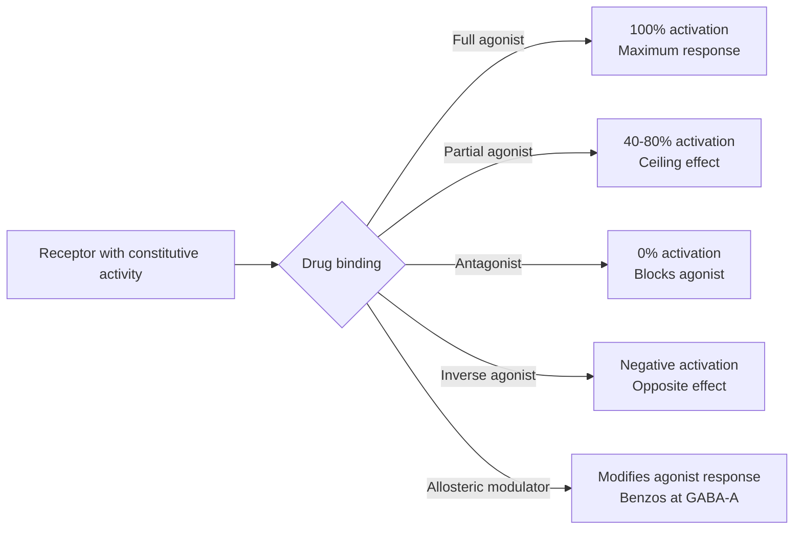
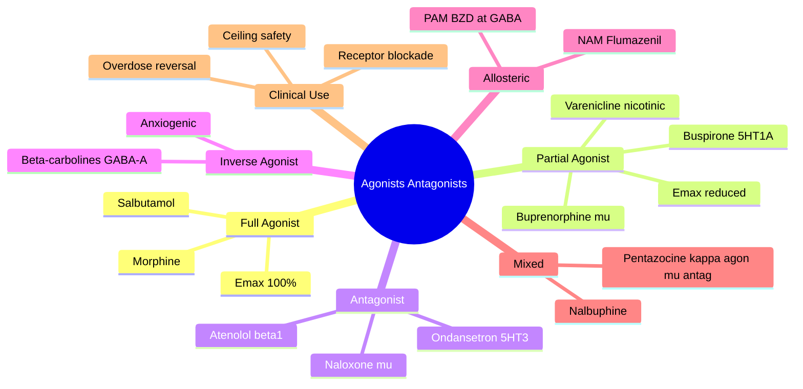

# Pharmacodynamics — Agonists, Partial Agonists & Antagonists

> [!info]
> **Disease-Level Topic** under **Principles of Clinical Pharmacology → Pharmacodynamics**.
> Davidson 24e Ch2 (Maxwell) — "Affinity, selectivity, agonist, antagonist".

## 1. Learning Objectives
- [ ] Define and differentiate **agonist, partial agonist, antagonist, inverse agonist**
- [ ] Classify **competitive, non-competitive, irreversible** antagonism
- [ ] Predict effects on **dose-response curves**
- [ ] Apply concepts clinically: naloxone (reversal), buprenorphine (ceiling), β-blocker (asthma)
- [ ] Recognise **mixed agonist-antagonists** (e.g., pentazocine)
- [ ] Understand **allosteric modulators** (e.g., benzodiazepines at GABA-A)

## 2. Definitions and Core Concepts

| Term | Definition | Emax | Example |
|------|-----------|------|---------|
| **Full agonist** | Binds + fully activates receptor | 100% | Morphine (μ), Salbutamol (β2) |
| **Partial agonist** | Binds + activates, but ceiling effect | <100% | Buprenorphine (μ), Buspirone (5-HT1A partial) |
| **Antagonist** | Binds + no activation; blocks agonist | 0% | Naloxone (μ), Ondansetron (5-HT3) |
| **Inverse agonist** | Binds + produces opposite effect to agonist (when constitutive activity present) | <0% (negative intrinsic activity) | Beta-carbolines at GABA-A (anxiogenic) |

## 3. Mermaid Algorithm — Drug-Receptor Activity Spectrum

## 4. Comparison Tables

### 4.1 Competitive vs Non-Competitive vs Irreversible Antagonism

| Feature | Competitive | Non-Competitive | Irreversible |
|---------|-------------|-----------------|--------------|
| **Binding site** | Same as agonist | Different site | Same site (covalent/slow) |
| **Effect on Emax** | Same (unchanged) | Reduced | Reduced (or same if spare receptors) |
| **Effect on dose-response** | Right-shift (parallel) | Right-shift + ↓Emax | Right-shift + ↓Emax |
| **Overcome by ↑ agonist** | Yes | No | No |
| **Reversibility** | Reversible | Reversible (usually) | Irreversible |
| **Duration** | Short (depends on t½) | Variable | Long (until new receptor made) |
| **Examples** | Atenolol (β1), Ranitidine (H2), Ondansetron (5-HT3) | Phenoxybenzamine (α - actually irreversible), Ketamine (NMDA channel blocker) | Aspirin (COX-1), MAOIs, Phenoxybenzamine (α) |

### 4.2 Clinical Examples of Agonists and Antagonists

| Receptor | Agonist | Antagonist |
|----------|---------|------------|
| **β1** | Dobutamine | Atenolol, Bisoprolol |
| **β2** | Salbutamol, Salmeterol | Propranolol (non-selective) |
| **α1** | Phenylephrine | Prazosin, Doxazosin |
| **α2** | Clonidine, Dexmedetomidine | Yohimbine |
| **H1** | Histamine | Cetirizine, Loratadine |
| **H2** | Impromidine (research) | Ranitidine, Famotidine |
| **μ-opioid** | Morphine, Fentanyl | Naloxone, Naltrexone |
| **5-HT3** | — (not used clinically) | Ondansetron, Granisetron |
| **5-HT1B/1D** | Sumatriptan | — |
| **5-HT2A** | LSD (hallucinogen) | Risperidone (atypical antipsychotic) |
| **D2** | Bromocriptine, Pramipexole | Haloperidol, Metoclopramide |
| **ACh (muscarinic)** | Bethanechol, Pilocarpine | Atropine, Glycopyrronium |
| **ACh (nicotinic Nm)** | Suxamethonium (depolarising) | Pancuronium, Rocuronium (non-depolarising) |
| **GABA-A** | Benzodiazepines (positive allosteric modulators) | Flumazenil (antagonist) |
| **NMDA** | Glutamate | Ketamine, Memantine, Magnesium |
| **AT1 angiotensin** | Angiotensin II | Losartan, Valsartan (ARBs) |
| **V1a vasopressin** | Vasopressin/ADH | Conivaptan, Tolvaptan (vaptans) |

### 4.3 Mixed Agonist-Antagonists

| Drug | Action |
|------|--------|
| **Pentazocine** | κ agonist + μ antagonist (less potent, less respiratory depression) |
| **Nalbuphine** | κ agonist + μ antagonist |
| **Buprenorphine** | Partial μ agonist + κ antagonist |
| **Butorphanol** | κ agonist + μ partial agonist |
| **Eptazocine** | Mixed |

### 4.4 Inverse Agonists

| Drug | Receptor | Effect |
|------|----------|--------|
| **Beta-carbolines** | GABA-A (BZD site) | Anxiogenic, convulsant |
| **DMCM** | GABA-A | Convulsant |
| **Rimonabant** | CB1 cannabinoid | Appetite suppressant (withdrawn) |
| **Buspirone** | 5-HT1A partial agonist (acts as inverse agonist at high dose) | Anxiolytic |

### 4.5 Allosteric Modulators (vs Orthosteric)

| Type | Definition | Example |
|------|-----------|---------|
| **Orthosteric** | Binds at same site as endogenous agonist | Most drugs (morphine, propranolol) |
| **Allosteric positive (PAM)** | Binds different site; enhances agonist effect | Benzodiazepines (GABA-A) — ↑ Cl⁻ current |
| **Allosteric negative (NAM)** | Binds different site; reduces agonist effect | Flumazenil (BZD antagonist at GABA-A) |
| **Silent allosteric modulator (SAM)** | Binds different site; no effect alone; blocks modulator | — |

**Example: GABA-A receptor and benzodiazepines**
- Endogenous agonist: GABA (opens Cl⁻ channel → hyperpolarisation)
- Benzodiazepines: bind at BZD site (different from GABA site) → positive allosteric modulator → ↑ frequency of channel opening → ↑ Cl⁻ current → anxiolytic, sedative
- Flumazenil: BZD antagonist → blocks BZD effect (used in BZD overdose)
- NOT a direct GABA agonist — needs GABA present

## 5. FCPS/MRCP High-Yield Summary

| Pearl | Detail |
|-------|--------|
| Naloxone | μ antagonist; reverses opioid overdose (respiratory depression) |
| Flumazenil | BZD antagonist; reverses BZD overdose (caution: seizure in chronic BZD users) |
| β-blocker in asthma | Even β1-selective can cause bronchospasm at high dose (relative selectivity) |
| Cardioselective β-blockers | Atenolol, bisoprolol, metoprolol, nebivolol (β1) |
| Buprenorphine | Partial μ agonist; ceiling effect on respiratory depression; safer in overdose |
| Pentazocine | Mixed agonist-antagonist; lower abuse potential but can precipitate withdrawal in opioid-dependent |
| Aspirin | Irreversible COX-1 inhibitor; antiplatelet effect lasts 7-10 days (platelet lifespan) |
| MAOIs | Irreversible; need 2-week washout |
| Phenoxybenzamine | Irreversible α-blocker; used in phaeochromocytoma |
| Benzodiazepines | Positive allosteric modulators at GABA-A (NOT direct agonists) |
| Buspirone | 5-HT1A partial agonist; anxiolytic (delayed onset) |
| Varenicline | Partial α4β2 nicotinic agonist; smoking cessation (reduces craving) |
| Dopamine agonists | Bromocriptine, pramipexole, ropinirole for Parkinson's |
| Mixed agonist-antagonists | Less prone to abuse (lower euphoric effect) |

## 6. Viva Questions (10)

1. **Differentiate agonist, partial agonist, and antagonist.**
   *Agonist: binds + fully activates (Emax 100%). Partial agonist: binds + activates but cannot achieve Emax (ceiling). Antagonist: binds + blocks without activation (Emax 0).*

2. **What is an inverse agonist?**
   *Drug that binds to a receptor with constitutive (spontaneous) activity and produces the OPPOSITE effect to a full agonist (negative intrinsic activity). E.g., beta-carbolines at GABA-A produce anxiogenic effect (opposite of benzodiazepines).*

3. **Differentiate competitive and non-competitive antagonism on a dose-response curve.**
   *Competitive: parallel right-shift; Emax unchanged (can be overcome by ↑ agonist). Non-competitive: right-shift with ↓Emax (cannot be overcome).*

4. **What is a positive allosteric modulator (PAM)? Give an example.**
   *Drug that binds at a site DIFFERENT from the agonist site and ENHANCES the agonist effect. Example: benzodiazepines at GABA-A (bind at BZD site, ↑ frequency of Cl⁻ channel opening when GABA binds).*

5. **Why is buprenorphine safer in overdose than full μ agonists?**
   *Partial μ agonist with ceiling effect on respiratory depression. Above a certain dose, no further respiratory depression. Full agonists (morphine) have linear dose-response — higher dose = more respiratory depression.*

6. **How does flumazenil reverse benzodiazepine overdose?**
   *Flumazenil is a competitive BZD antagonist at the BZD binding site on GABA-A. Blocks the allosteric enhancement → ↓ Cl⁻ current → reverses CNS depression. Caution: can precipitate seizures in chronic BZD users.*

7. **Why does the effect of aspirin on platelets last 7-10 days?**
   *Aspirin irreversibly inhibits COX-1 in platelets. Platelets cannot make new COX-1 (no nucleus). Effect persists until new platelets are made (~7-10 days). Other cells (endothelium) regenerate COX-1 within hours.*

8. **What is the difference between a mixed agonist-antagonist and a partial agonist?**
   *Mixed agonist-antagonist = activates one receptor subtype and blocks another (e.g., pentazocine: κ agonist + μ antagonist). Partial agonist = activates one receptor sub-maximally (single receptor).*

9. **A patient on high-dose morphine for cancer pain is given pentazocine. What happens?**
   *Pentazocine is a μ antagonist (and κ agonist). In a patient dependent on a full μ agonist, pentazocine PRECIPITATES OPIOID WITHDRAWAL by displacing morphine from μ receptors. Avoid in opioid-tolerant patients.*

10. **What is the mechanism of varenicline in smoking cessation?**
    *Varenicline is a partial agonist at α4β2 nicotinic acetylcholine receptors. Reduces craving (partial stimulation) and blocks the rewarding effect of nicotine (antagonist effect when nicotine present). More effective than NRT or bupropion.*

## 7. Confusions & Mnemonics

| Confusion | Resolution |
|-----------|------------|
| Agonist vs antagonist | Agonist ACTIVATES; antagonist BLOCKS |
| Partial agonist vs full agonist | Partial = ceiling (submaximal); Full = max effect |
| Competitive vs non-competitive | Competitive = same site, overcome; Non-competitive = different site, no overcome |
| Irreversible vs slowly reversible | Irreversible = covalent bond; Slowly reversible = tight binding |
| Inverse agonist vs antagonist | Inverse agonist requires constitutive activity; antagonist simply blocks agonist |
| Allosteric vs orthosteric | Allosteric = different site; Orthosteric = same site as endogenous agonist |
| Positive vs negative allosteric | PAM enhances; NAM reduces |
| BZD mechanism | PAM at GABA-A, NOT direct GABA agonist |
| Mixed agonist-antagonist in opioid use | Can PRECIPITATE withdrawal in opioid-dependent patients |
| Buprenorphine in OT | Safer (ceiling), less abuse potential |
| Naloxone onset | IV: 1-2 min; IM/SC: 2-5 min; short t½ (30-90 min) — may need re-dosing |
| Flumazenil in chronic BZD | AVOID — can precipitate seizures |
| Pentazocine in opioid use | AVOID — precipitates withdrawal |
| Receptor occupancy for full effect | Cardiac β: 5-10%; Bronchial β2: 100% (no reserve) |

**Mnemonic — BZD site: "**F**lumazenil **F**ixes **F**rantic **F**rank (BZD overdose) but causes **F**its in chronic users"**

**Mnemonic — Mixed agonist-antagonist: "**P**entazocine **P**recipitates **P**ainkiller withdrawal"** (in opioid-dependent)

**Mnemonic — Partial agonists with ceiling: "**B**uprenorphine (μ), **B**uspirone (5-HT1A), **V**arenicline (α4β2 nicotinic)" = BBV**

**Mnemonic — Antagonist reversal: "**N**aloxone for **O**pioid, **F**lumazenil for **B**ZD, **A**tropine for **M**uscarinic"** (NOF + AMB)

## 8. Mermaid Mind Map

## 9. Spaced Repetition Tracker

| Topic | Day 1 | Day 3 | Day 7 | Day 14 | Day 30 |
|-------|-------|-------|-------|-------|--------|
| Agonist/Antagonist/Partial | ☐ | ☐ | ☐ | ☐ | ☐ |
| Competitive vs non-competitive | ☐ | ☐ | ☐ | ☐ | ☐ |
| Allosteric modulators | ☐ | ☐ | ☐ | ☐ | ☐ |
| Naloxone use | ☐ | ☐ | ☐ | ☐ | ☐ |
| Buprenorphine ceiling | ☐ | ☐ | ☐ | ☐ | ☐ |
| Pentazocine warning | ☐ | ☐ | ☐ | ☐ | ☐ |
| BZD + GABA-A mechanism | ☐ | ☐ | ☐ | ☐ | ☐ |
| Varenicline | ☐ | ☐ | ☐ | ☐ | ☐ |

## 10. Self-Test Scorecard

| Domain | Score (0-5) |
|--------|-------------|
| Definitions | /5 |
| Agonist spectrum | /5 |
| Antagonism types | /5 |
| Allosteric | /5 |
| Clinical reversals | /5 |
| Mixed/partial | /5 |
| **TOTAL** | **/30** |

## 11. MCQs (10)

1. **A partial agonist is a drug that:**
   A. Has full efficacy
   B. Has reduced Emax compared to full agonist ✓
   C. Has no effect
   D. Antagonises the receptor
   E. Is an inverse agonist

2. **A competitive antagonist causes:**
   A. Right-shift in dose-response with reduced Emax
   B. Right-shift in dose-response with unchanged Emax ✓
   C. Left-shift in dose-response
   D. No change in dose-response
   E. Reduced agonist effect only at high dose

3. **Aspirin is an example of:**
   A. Competitive reversible antagonist
   B. Non-competitive antagonist
   C. Irreversible antagonist ✓
   D. Partial agonist
   E. Inverse agonist

4. **Benzodiazepines are best described as:**
   A. Direct GABA agonists
   B. Positive allosteric modulators at GABA-A ✓
   C. GABA antagonists
   D. Negative allosteric modulators
   E. GABA reuptake inhibitors

5. **Buprenorphine is safer than morphine in overdose because:**
   A. Faster clearance
   B. Lower potency
   C. Ceiling effect on respiratory depression (partial μ agonist) ✓
   D. Better oral bioavailability
   E. Less CNS penetration

6. **Naloxone reverses opioid overdose by:**
   A. Agonising μ receptors
   B. Antagonising μ receptors ✓
   C. Partial agonism
   D. Inverse agonism
   E. GABA modulation

7. **Flumazenil is used for:**
   A. Opioid overdose
   B. Benzodiazepine overdose ✓
   C. Alcohol intoxication
   D. Paracetamol toxicity
   E. Cocaine overdose

8. **Pentazocine in a patient on morphine may cause:**
   A. Sedation
   B. Respiratory depression
   C. Precipitated opioid withdrawal ✓
   D. Hypotension
   E. Hypertension

9. **Varenicline is a:**
   A. Full nicotinic agonist
   B. Partial α4β2 nicotinic agonist ✓
   C. Nicotinic antagonist
   D. Dopamine reuptake inhibitor
   E. MAOI

10. **An inverse agonist:**
    A. Blocks agonist effect only
    B. Reduces constitutive (spontaneous) receptor activity ✓
    C. Is the same as antagonist
    D. Has no clinical use
    E. Activates the receptor maximally

## 12. SBAs (5)

1. **A drug is added to a tissue with 50% receptor occupancy producing 50% effect. At 100% occupancy, only 70% effect. This drug is a:**
   - A) Full agonist
   - B) Partial agonist ✓
   - C) Antagonist
   - D) Inverse agonist
   - E) Non-competitive antagonist

2. **A patient takes morphine 60 mg qds for chronic cancer pain. Prescribed pentazocine for breakthrough pain. Likely outcome:**
   - A) Better analgesia
   - B) Precipitated withdrawal (μ antagonism) ✓
   - C) No change
   - D) Respiratory depression
   - E) Hypertension

3. **A patient overdoses on diazepam. Flumazenil is given. Mechanism of reversal:**
   - A) GABA agonism
   - B) BZD site antagonism at GABA-A ✓
   - C) Chloride channel blockade
   - D) Benzodiazepine displacement from albumin
   - E) Increased diazepam metabolism

4. **Aspirin 75 mg OD for 7 days. Stopped 5 days before surgery. Platelet function at day 5 post-stop:**
   - A) Fully inhibited (100% dysfunction)
   - B) Normal (aspirin effect has worn off) ✓
   - C) Partially inhibited (~50%)
   - D) Hyperactive
   - E) Unknown

5. **Drug X has full agonist effect, then Drug Y is added producing right-shift of dose-response with same Emax. Y is:**
   - A) Partial agonist
   - B) Competitive antagonist ✓
   - C) Non-competitive antagonist
   - D) Inverse agonist
   - E) Irreversible antagonist

## 13. Answer Key

### MCQ Answers
1. **B** (Partial agonist = submaximal Emax)
2. **B** (Competitive: parallel right-shift, same Emax)
3. **C** (Aspirin = irreversible COX-1)
4. **B** (BZDs = positive allosteric modulators at GABA-A)
5. **C** (Buprenorphine = ceiling effect)
6. **B** (Naloxone = μ antagonist)
7. **B** (Flumazenil = BZD antagonist)
8. **C** (Pentazocine precipitates withdrawal in opioid-dependent)
9. **B** (Varenicline = partial α4β2 nicotinic agonist)
10. **B** (Inverse agonist reduces constitutive activity)

### SBA Answers
1. **B** — Partial agonist: ceiling effect (Emax 70% even at full occupancy).
2. **B** — Pentazocine = μ antagonist; in opioid-dependent patient → precipitated withdrawal.
3. **B** — Flumazenil = BZD site antagonist on GABA-A receptor.
4. **B** — Aspirin irreversibly inhibits platelet COX-1; 7-10 days for new platelets. After 5 days, ~50% of platelets are new (functional). After 7-10 days, fully recovered.
5. **B** — Right-shift with same Emax = competitive antagonism.

## 14. Summary Box

> **Agonist = full activation; Partial agonist = ceiling; Antagonist = blocks; Inverse agonist = opposite of agonist.** Competitive antagonists shift dose-response right (same Emax); non-competitive reduce Emax. Allosteric modulators bind different site (BZDs are PAMs at GABA-A). Naloxone (μ antag) reverses opioid OD; Flumazenil (BZD site) reverses BZD OD. Buprenorphine (partial μ) safer in OD due to ceiling. Pentazocine precipitates withdrawal in opioid-dependent. Aspirin = irreversible COX-1 (effect 7-10 d).

---

## Cross-Links
- **Parent Heading**: [[../../Principles of Clinical Pharmacology|Principles of Clinical Pharmacology]]
- **Sibling Topics**: [[Drug Targets and Receptors]], [[Dose-Response and Therapeutic Index]], [[Desensitisation, Tolerance, Withdrawal]]
- **Chapter MOC**: [[Clinical Therapeutics and Good Prescribing MOC]]
- **Related**: [[ADRs]], [[Polypharmacy and Deprescribing]]

**Last Updated:** 2026-06-15  
**Status: FULLY COMPLETE with Exam Suite (Viva 10, MCQ 10, SBA 5, Answer Key, Confusions, Mind Map, Spaced Repetition, Self-Test, Exam Modes)**
