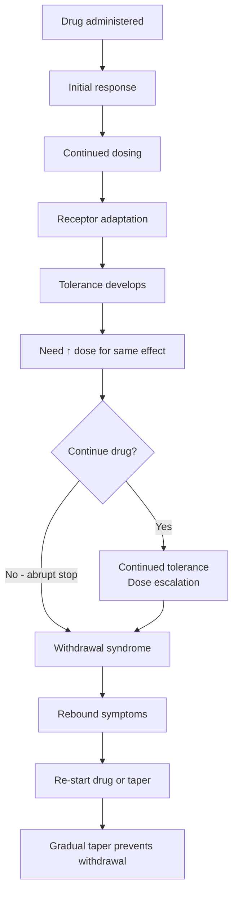
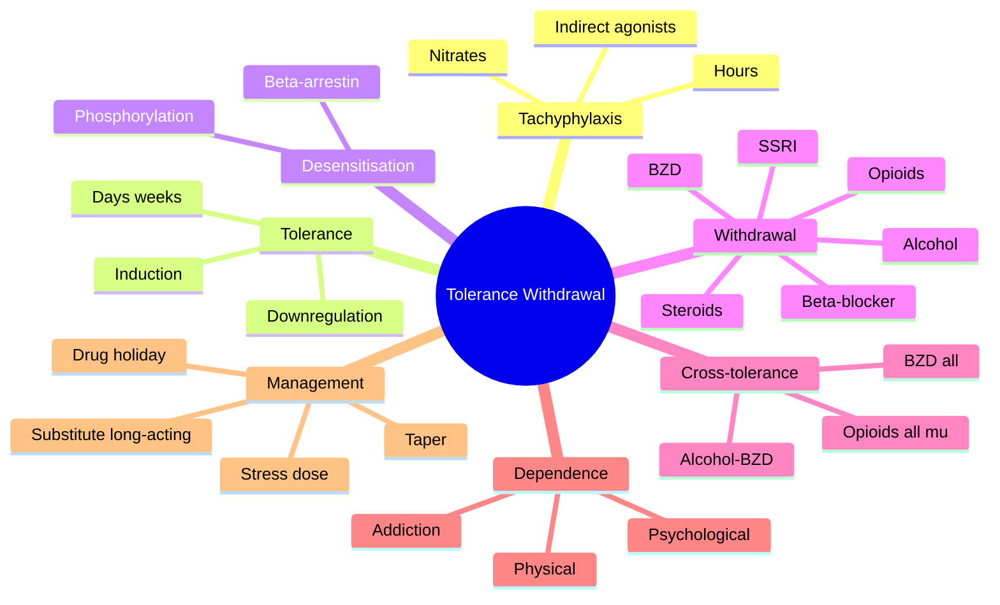

# Pharmacodynamics — Desensitisation, Tolerance, Tachyphylaxis & Withdrawal

> [!info]
> **Disease-Level Topic** under **Principles of Clinical Pharmacology → Pharmacodynamics**.
> Davidson 24e Ch2 (Maxwell) — "Desensitisation and withdrawal".

## 1. Learning Objectives
- [ ] Define and differentiate **tachyphylaxis, tolerance, desensitisation, downregulation**
- [ ] Explain mechanisms of each
- [ ] Identify clinical examples of each
- [ ] Recognise **withdrawal syndromes** (alcohol, benzos, opioids, steroids, SSRIs, β-blockers)
- [ ] Apply tapering principles to prevent withdrawal
- [ ] Distinguish **physical dependence** from **psychological dependence (addiction)**

## 2. Core Concepts

| Term | Definition | Timeframe | Mechanism |
|------|-----------|-----------|-----------|
| **Tachyphylaxis** | Rapid loss of response (within hours or after first dose) | Minutes to hours | Mediator depletion, receptor phosphorylation, internalisation |
| **Desensitisation** | Reduced response despite continued drug | Seconds to days | Receptor phosphorylation, β-arrestin binding, G-protein uncoupling |
| **Tolerance** | Decreased effect with continued use; requires ↑ dose | Days to weeks | Receptor downregulation, counter-regulatory mechanisms, enzyme induction |
| **Refractoriness** | Complete loss of response | Variable | Multiple mechanisms |
| **Downregulation** | ↓ Receptor number | Hours to days | Internalisation, degradation, ↓ synthesis |
| **Upregulation** | ↑ Receptor number | Days | ↑ synthesis, ↓ degradation |
| **Sensitisation** | ↑ Response with continued use | Days to weeks | Receptor upregulation, sensitisation |
| **Withdrawal** | Symptoms on drug cessation or dose reduction | Variable | Rebound overactivity of suppressed system |
| **Rebound** | Return of original disease, often worse | Days to weeks | Receptor upregulation + disease return |
| **Physical dependence** | Adaptive state causing withdrawal on cessation | — | Neuroadaptation (not addiction) |
| **Psychological dependence (addiction)** | Compulsive drug-seeking despite harm | — | Reward pathway (dopamine, opioid) |

## 3. Mermaid Algorithm — Tolerance and Withdrawal Cycle

## 4. Comparison Tables

### 4.1 Tachyphylaxis vs Tolerance vs Desensitisation

| Feature | Tachyphylaxis | Tolerance | Desensitisation |
|---------|---------------|-----------|-----------------|
| **Time** | Within hours | Days-weeks | Seconds-days |
| **Mechanism** | Mediator depletion, receptor phosphorylation | Downregulation, counter-regulation | Phosphorylation, β-arrestin, G-protein uncoupling |
| **Reversible** | Often quickly (hours) | Slowly (days) | Often quickly (minutes-hours) |
| **Examples** | Nitrates (nitroglycerin tolerance), nicotine, indirect agonists (ephedrine, tyramine), insulin (downregulation) | Opioids, benzodiazepines, alcohol, amphetamines, caffeine | β-adrenergic (β2 in asthma with chronic use), GPCRs in general |
| **Clinical management** | Drug holiday, alternate drug | ↑ dose, switch, taper | Drug holiday, ↑ dose, switch |

### 4.2 Tolerance Mechanisms

| Type | Mechanism | Example |
|------|-----------|---------|
| **Pharmacokinetic (dispositional)** | ↑ metabolism (enzyme induction) | Rifampicin induces CYP → ↓ drug levels |
| **Pharmacodynamic (cellular)** | Receptor downregulation, counter-regulation | Opioids, β-agonists, benzodiazepines |
| **Behavioural (learned)** | Compensation through behaviour | Alcohol intoxication → learned to walk |
| **Conditioned** | Cue-related compensatory response | Smell of alcohol → craving in alcoholic |
| **Acute** | Within first dose | Tachyphylaxis (indirect agonists) |
| **Chronic** | Days-weeks | Opioids, benzos |
| **Cross-tolerance** | Tolerance to similar drugs in same class | All opioids; all benzodiazepines; all barbiturates |

### 4.3 Withdrawal Syndromes

| Drug | Onset | Features | Management |
|------|-------|----------|------------|
| **Alcohol** | 6-24 h | Tremor, anxiety, sweating, nausea, seizures, DT (delirium tremens at 48-96 h: confusion, hallucinations, autonomic instability) | Long-acting benzo (chlordiazepoxide, diazepam); thiamine; supportive |
| **Benzodiazepines** | 1-7 d | Anxiety, insomnia, tremor, sweating, perceptual changes, seizures (esp. short-acting) | Switch to long-acting (diazepam); slow taper over weeks-months |
| **Barbiturates** | 2-4 d | Similar to alcohol/BZD; severe seizures | Switch to long-acting barbiturate; slow taper |
| **Opioids** | 6-12 h (short-acting); 24-72 h (long-acting) | Rhinorrhoea, lacrimation, yawning, mydriasis, piloerection ("cold turkey"), muscle aches, GI cramps, diarrhoea, anxiety | Methadone substitution or buprenorphine; clonidine; loperamide; supportive |
| **Cocaine/stimulants** | "Crash" 1-2 d | Depression, hypersomnia, ↑ appetite, craving | Supportive; consider bromocriptine in severe cases |
| **Nicotine** | 2-3 d | Irritability, craving, ↑ appetite, ↓ concentration | NRT, varenicline, bupropion |
| **SSRIs** | 2-5 d | "SSRI discontinuation syndrome": dizziness, nausea, "brain zaps", paresthesia, insomnia, flu-like | Slow taper; re-start; switch to fluoxetine (long t½) |
| **TCAs** | 2-5 d | Similar to SSRI; cholinergic rebound (urinary retention, mydriasis) | Slow taper |
| **MAOIs** | 2-5 d | Anxiety, agitation, hallucinations, severe (rebound ↑ 5HT/NA) | Slow taper; fluoxetine bridge |
| **Corticosteroids** | Days to weeks (HPA suppression) | Weakness, hypotension, hypoglycaemia, ↓ stress response | Slow taper; stress-dose hydrocortisone in acute illness |
| **β-blockers** | 1-3 d | Rebound HTN, tachycardia, angina, MI | Slow taper over 1-2 weeks; avoid in ischaemic heart disease |
| **Clonidine (α2 agonist)** | 12-24 h | Rebound HTN, anxiety, tachycardia | Taper; restart if severe |
| **Anticholinergics** | 1-3 d | Cholinergic rebound: salivation, lacrimation, sweating, GI cramps, urinary retention | Slow taper |
| **Antipsychotics** | Days to weeks | Withdrawal dyskinesia, agitation, insomnia, psychosis (rebound) | Slow taper; consider anticholinergic for dystonia |
| **Anticonvulsants (esp. barbiturates, BZD)** | Variable | Seizure (rebound), anxiety, tremor | Slow taper; switch to long-acting |
| **Baclofen (intrathecal)** | Hours if abrupt | Severe: rebound spasticity, hyperthermia, rhabdomyolysis, multiorgan failure | Oral baclofen rescue; slow taper |

### 4.4 Cross-Tolerance

| Class | Cross-tolerance within class | Cross-tolerance between classes |
|-------|------------------------------|----------------------------------|
| Opioids | YES (all μ agonists) | Partial (e.g., methadone and morphine) |
| Benzodiazepines | YES (all BZD) | YES with barbiturates, alcohol (allosteric GABA modulators) |
| Barbiturates | YES | YES with BZD, alcohol |
| Alcohol | — | YES with BZD, barbiturates |
| Amphetamines | YES (all stimulants) | Limited |
| Nitrates | YES (all nitrates) | — |

### 4.5 Dependence vs Addiction

| Feature | Physical Dependence | Addiction (Psychological Dependence) |
|---------|--------------------|--------------------------------------|
| **Definition** | Adaptive state → withdrawal on cessation | Compulsive drug-seeking despite harm |
| **Mechanism** | Neuroadaptation to chronic exposure | Reward pathway (dopamine, nucleus accumbens) |
| **Withdrawal** | Yes (physical symptoms) | Yes + craving, drug-seeking |
| **Continued use** | To avoid withdrawal (any) | To obtain reward/euphoria (specific) |
| **Examples** | All patients on chronic opioids, benzos, steroids | Heroin, cocaine, methamphetamine (most) |
| **Therapy** | Taper to avoid withdrawal | Detox + rehab; relapse prevention |

## 5. FCPS/MRCP High-Yield Summary

| Pearl | Detail |
|-------|--------|
| Tachyphylaxis mechanism | Mediator depletion (e.g., tyramine, ephedrine) or receptor phosphorylation |
| Nitrate tolerance | Continuous NTG → loss of effect; need nitrate-free interval (overnight) |
| β2 tolerance in asthma | Regular salbutamol → ↓ bronchodilator response; SABAs should be PRN |
| Opioid tolerance | ↓ effect with chronic use; need ↑ dose (rotate opioids for incomplete cross-tolerance) |
| BZD withdrawal | Life-threatening seizures; slow taper over weeks-months |
| Alcohol withdrawal seizures | 6-48 h after last drink; treat with long-acting BZD |
| Delirium tremens (DT) | 48-96 h; confusion, hallucinations, autonomic instability, mortality 5-15% untreated |
| SSRI discontinuation | "Brain zaps", dizziness; NOT addiction; manage with slow taper or fluoxetine |
| Corticosteroid withdrawal | Adrenal suppression; need slow taper + stress-dose hydrocortisone |
| β-blocker withdrawal | Rebound HTN, angina, MI; always taper over 1-2 weeks |
| Clonidine withdrawal | Rebound HTN; similar to β-blocker; always taper |
| Cross-tolerance | Opioids (all μ), BZD (all), alcohol-BZD-barbiturates |
| Dependence ≠ addiction | Dependence = physical withdrawal; addiction = compulsive drug-seeking |
| Receptor upregulation | β-blocker, α2 agonist withdrawal; leads to supersensitivity |

## 6. Viva Questions (10)

1. **Differentiate tachyphylaxis and tolerance.**
   *Tachyphylaxis: rapid loss of effect (minutes-hours), often due to mediator depletion or receptor phosphorylation. Tolerance: slower (days-weeks), due to receptor downregulation or counter-regulatory mechanisms.*

2. **Why do continuous nitrate infusions lose effect (nitrate tolerance)?**
   *Sustained nitrate exposure depletes sulfhydryl groups and increases oxidative stress, leading to impaired bioactivation of nitrates to NO. Mitigated by nitrate-free intervals (e.g., 8-12 h overnight).*

3. **What is the mechanism of alcohol withdrawal seizures?**
   *Chronic alcohol enhances GABA-A inhibition and reduces NMDA excitation. On withdrawal, sudden loss of inhibition → hyperexcitability → seizures. Long-acting benzodiazepines (diazepam, chlordiazepoxide) replace the lost GABA effect.*

4. **When does delirium tremens (DT) occur after alcohol cessation?**
   *48-96 hours after last drink. Features: confusion, hallucinations (often visual), autonomic instability (tachycardia, hypertension, fever), diaphoresis, tremor. Mortality 5-15% if untreated. Treat with IV benzodiazepines, supportive care, thiamine.*

5. **Why is "SSRI discontinuation syndrome" not addiction?**
   *Symptoms (dizziness, "brain zaps", nausea, paresthesia) are withdrawal from physical dependence, NOT compulsive drug-seeking. SSRIs don't cause euphoria or reward-pathway activation. Discontinuation is uncomfortable but not addictive.*

6. **How do you taper a patient on chronic corticosteroids?**
   *Gradual taper over weeks-months, depending on duration and dose. <3 weeks: can stop abruptly. ≥3 weeks OR ≥7.5 mg/day prednisolone OR Cushingoid features: taper slowly (e.g., reduce by 2.5-5 mg every 1-2 weeks). Add stress-dose hydrocortisone for acute illness/surgery.*

7. **A patient on atenolol 100 mg for angina stops abruptly. Develops severe chest pain 2 days later. Mechanism?**
   *β-receptor upregulation during chronic blockade; on withdrawal, increased receptor pool exposed to catecholamines → rebound tachycardia, HTN, and increased O₂ demand → angina/MI. Always taper β-blockers over 1-2 weeks.*

8. **What is the role of β-arrestin in receptor desensitisation?**
   *β-arrestin binds phosphorylated receptors, preventing further G-protein coupling (desensitisation) and targeting the receptor for internalisation (downregulation). β-arrestin pathway is also a separate signalling cascade (biased agonism).*

9. **Differentiate physical dependence from addiction.**
   *Physical dependence: adaptive state with withdrawal on cessation (occurs in ALL chronic opioid/BZD users). Addiction: compulsive drug-seeking, craving, continued use despite harm (occurs in some). Dependence ≠ addiction; most chronic pain patients are dependent but not addicted.*

10. **What is the "kindling phenomenon" in alcohol withdrawal?**
    *Repeated episodes of alcohol withdrawal lead to progressively more severe withdrawal (lower threshold for seizures, more autonomic instability). Each withdrawal episode worsens the next. Reinforces the need to manage withdrawal promptly and consider relapse prevention.*

## 7. Confusions & Mnemonics

| Confusion | Resolution |
|-----------|------------|
| Tachyphylaxis vs tolerance | Tachyphylaxis = hours; Tolerance = days-weeks |
| Desensitisation vs downregulation | Desensitisation = functional; Downregulation = ↓ receptor number |
| Physical vs psychological dependence | Physical = withdrawal; Psychological = craving/addiction |
| Withdrawal vs relapse | Withdrawal = physical symptoms on cessation; Relapse = return of original disease/condition |
| Rebound vs recurrence | Rebound = exaggerated return; Recurrence = normal disease return |
| Cross-tolerance | All opioids (μ); All BZD; Alcohol-BZD-barbiturates |
| SSRI discontinuation vs addiction | Discontinuation = physical (brain zaps); NOT addiction |
| Nitrate tolerance management | Nitrate-free interval (8-12 h overnight) |
| BZD withdrawal seizure | Use long-acting BZD (diazepam) for taper |
| Corticosteroid taper | <3 weeks → abrupt OK; ≥3 weeks → slow taper + stress dose |
| β-blocker withdrawal | Always taper over 1-2 weeks (esp. ischaemic heart disease) |
| Tolerance reversal | Drug holiday (e.g., PPIs), reduce dose, switch class |

**Mnemonic — Tachyphylaxis examples: "**I**ndirect **A**gonists **D**eplete (**IAD**): Ephedrine, Tyramine, Amphetamine"**

**Mnemonic — Withdrawal syndromes: "**A**lcohol **B**arbiturates **O**pioids → BZD/Alcohol-withdrawal seizures"** (ABO=BZDW)

**Mnemonic — SSRI discontinuation: "**F**luoxetine **H**as **L**ong **H**alf-life — switch to fluoxetine for taper"** (FHLH)

**Mnemonic — Corticosteroid taper: "**7**-**3** rule: ≥**7** mg × ≥**3** weeks → taper"** (≥7.5 mg/day × ≥3 weeks)

**Mnemonic — β-blocker withdrawal: "**B**eta-**B**locker = **B**eware, **B**ig problem, **B**ack it down"** (always taper)

**Mnemonic — Dependence vs addiction: "**A**ll chronic users are **D**ependent; only some are **A**ddicted"** (ADA)

## 8. Mermaid Mind Map

## 9. Spaced Repetition Tracker

| Topic | Day 1 | Day 3 | Day 7 | Day 14 | Day 30 |
|-------|-------|-------|-------|-------|--------|
| Tachyphylaxis | ☐ | ☐ | ☐ | ☐ | ☐ |
| Tolerance mechanisms | ☐ | ☐ | ☐ | ☐ | ☐ |
| Nitrate tolerance | ☐ | ☐ | ☐ | ☐ | ☐ |
| Alcohol withdrawal | ☐ | ☐ | ☐ | ☐ | ☐ |
| BZD withdrawal | ☐ | ☐ | ☐ | ☐ | ☐ |
| Opioid withdrawal | ☐ | ☐ | ☐ | ☐ | ☐ |
| SSRI discontinuation | ☐ | ☐ | ☐ | ☐ | ☐ |
| Corticosteroid taper | ☐ | ☐ | ☐ | ☐ | ☐ |
| β-blocker withdrawal | ☐ | ☐ | ☐ | ☐ | ☐ |

## 10. Self-Test Scorecard

| Domain | Score (0-5) |
|--------|-------------|
| Tachyphylaxis | /5 |
| Tolerance | /5 |
| Desensitisation | /5 |
| Withdrawal syndromes | /5 |
| Cross-tolerance | /5 |
| Dependence vs addiction | /5 |
| **TOTAL** | **/30** |

## 11. MCQs (10)

1. **Tachyphylaxis is best described as:**
   A. Tolerance developing over weeks
   B. Rapid loss of effect (hours) due to mediator depletion or receptor phosphorylation ✓
   C. Downregulation of receptors
   D. Cumulative toxicity
   E. Drug interaction

2. **Continuous transdermal nitroglycerin loses effect due to:**
   A. Tolerance from sulfhydryl depletion ✓
   B. Receptor downregulation
   C. Drug interaction
   D. Renal failure
   E. Hepatic failure

3. **Delirium tremens typically occurs:**
   A. 6-12 h after last drink
   B. 24-48 h after last drink
   C. 48-96 h after last drink ✓
   D. 5-7 d after last drink
   E. 2 weeks after last drink

4. **Corticosteroid taper is required if duration of treatment is:**
   A. <1 week
   B. 1-2 weeks
   C. ≥3 weeks (esp. ≥7.5 mg/day prednisolone) ✓
   D. <3 days
   E. Always

5. **Benzodiazepine withdrawal is best managed with:**
   A. Antipsychotics
   B. Long-acting benzodiazepine (diazepam) slow taper ✓
   C. SSRI
   D. β-blocker
   E. Sudden discontinuation

6. **"Brain zaps" are characteristic of:**
   A. Opioid withdrawal
   B. SSRI discontinuation syndrome ✓
   C. Alcohol withdrawal
   D. BZD withdrawal
   E. Cocaine withdrawal

7. **β-blocker withdrawal may cause:**
   A. Bradycardia
   B. Rebound hypertension, tachycardia, angina, MI ✓
   C. Heart failure
   D. AV block
   E. Constipation

8. **Cross-tolerance is seen:**
   A. Only within opioids
   B. Among all benzodiazepines ✓
   C. Only with alcohol
   D. Only with stimulants
   E. Never

9. **"Physical dependence" is best defined as:**
   A. Compulsive drug-seeking
   B. Adaptive state causing withdrawal on cessation ✓
   C. Craving without withdrawal
   D. Psychological reliance
   E. Recreational use

10. **"Kindling phenomenon" in alcohol withdrawal refers to:**
    A. Progressive worsening with repeated withdrawal episodes ✓
    B. Tolerance to alcohol
    C. Craving for alcohol
    D. Liver damage
    E. Blackouts

## 12. SBAs (5)

1. **A patient on continuous nitroglycerin infusion for 24 h develops chest pain. Next best action:**
   - A) Increase infusion rate
   - B) Add another nitrate
   - C) Suspect nitrate tolerance; provide nitrate-free interval (8-12 h/day) ✓
   - D) Switch to beta-blocker
   - E) Stop infusion

2. **A 50-year-old alcoholic stops drinking. 24 h later has generalised tonic-clonic seizure. Most likely cause:**
   - A) Status epilepticus
   - B) Alcohol withdrawal seizure (6-48 h after last drink) ✓
   - C) Hypoglycaemia
   - D) Wernicke's
   - E) Hepatic encephalopathy

3. **A patient on prednisolone 30 mg/day for 3 months is planned for surgery. Best perioperative plan:**
   - A) Continue usual dose
   - B) Stop 1 day before
   - C) Stress-dose hydrocortisone (100 mg IV at induction, then 6-hourly) ✓
   - D) Switch to hydrocortisone orally
   - E) Double oral dose

4. **A patient on paroxetine (SSRI) for 6 months stops abruptly. Develops dizziness, "electric shocks", nausea 3 days later. Diagnosis:**
   - A) Serotonin syndrome
   - B) SSRI discontinuation syndrome ✓
   - C) Major depression relapse
   - D) Vestibular dysfunction
   - E. Anxiety disorder

5. **A patient on morphine 200 mg/day for chronic cancer pain is rotated to a different opioid at 50% equivalent dose due to tolerance. The mechanism for incomplete cross-tolerance is:**
   - A) Different receptor subtypes
   - B) Individual receptor heterogeneity ✓
   - C) Metabolism differences
   - D) Drug interactions
   - E) No cross-tolerance

## 13. Answer Key

### MCQ Answers
1. **B** (Tachyphylaxis = rapid, hours)
2. **A** (Sulfhydryl depletion → NO synthesis failure)
3. **C** (DT at 48-96 h)
4. **C** (≥3 weeks OR ≥7.5 mg/day)
5. **B** (Diazepam taper)
6. **B** (Brain zaps = SSRI discontinuation)
7. **B** (Rebound HTN, tachycardia, angina, MI)
8. **B** (All BZD cross-tolerant)
9. **B** (Physical dependence = withdrawal)
10. **A** (Kindling = progressive worsening)

### SBA Answers
1. **C** — Nitrate tolerance; provide nitrate-free interval (8-12 h).
2. **B** — Alcohol withdrawal seizure (6-48 h).
3. **C** — Stress-dose hydrocortisone for chronic steroid user undergoing major surgery.
4. **B** — SSRI discontinuation syndrome (NOT addiction; brain zaps, dizziness).
5. **B** — Incomplete cross-tolerance due to individual receptor heterogeneity; allows ~50% dose reduction on rotation.

## 14. Summary Box

> **Tachyphylaxis = rapid (hours) loss of effect (indirect agonists, nitrates).** Tolerance = slower (days-weeks), downregulation. Withdrawal syndromes: alcohol (6-96 h, seizures at 6-48 h, DT at 48-96 h), BZD (life-threatening seizures; slow taper), opioids (rhinorrhoea, GI cramps, mydriasis), SSRIs (brain zaps; NOT addiction), corticosteroids (HPA suppression; ≥3 weeks → taper + stress dose), β-blockers (rebound HTN/angina; always taper). **Cross-tolerance:** all opioids, all BZD, alcohol-BZD-barbiturates. **Physical dependence ≠ addiction.**

---

## Cross-Links
- **Parent Heading**: [[../../Principles of Clinical Pharmacology|Principles of Clinical Pharmacology]]
- **Sibling Topics**: [[Drug Targets and Receptors]], [[Dose-Response and Therapeutic Index]], [[Agonists and Antagonists]]
- **Chapter MOC**: [[Clinical Therapeutics and Good Prescribing MOC]]
- **Related**: [[ADRs]], [[Polypharmacy and Deprescribing]]

**Last Updated:** 2026-06-15  
**Status: FULLY COMPLETE with Exam Suite (Viva 10, MCQ 10, SBA 5, Answer Key, Confusions, Mind Map, Spaced Repetition, Self-Test, Exam Modes)**
