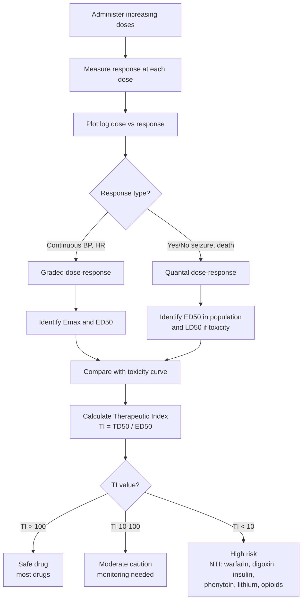
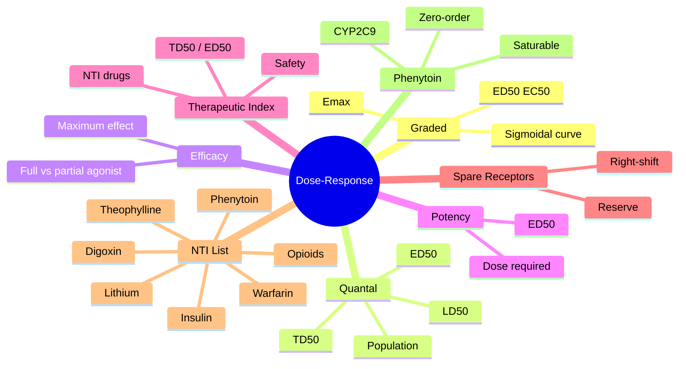

# Pharmacodynamics — Dose-Response & Therapeutic Index

> [!info]
> **Disease-Level Topic** under **Principles of Clinical Pharmacology → Pharmacodynamics**.
> Davidson 24e Ch2 (Maxwell) — "Dose-response relationships" + "Therapeutic index".

## 1. Learning Objectives
- [ ] Plot and interpret **graded dose-response curves** (sigmoidal, log-dose)
- [ ] Define and differentiate **Emax, ED50/EC50**
- [ ] Differentiate **efficacy** vs **potency**
- [ ] Explain **therapeutic index** and its clinical significance
- [ ] Identify drugs with **narrow therapeutic index** (NTI)
- [ ] Recognise **margin of safety** concept
- [ ] Describe **quantal dose-response** and LD50

## 2. Core Concepts

| Term | Definition | Clinical Use |
|------|-----------|---------------|
| **Graded dose-response** | Continuous effect vs dose (e.g., BP reduction) | Most clinical pharmacology |
| **Quantal dose-response** | All-or-none effect (e.g., seizure control) | Toxicology (LD50), ED50 in population |
| **Emax** | Maximum response achievable | Efficacy of drug |
| **ED50 / EC50** | Dose/concentration producing 50% of Emax | Potency |
| **Efficacy** | Maximum intrinsic effect at full receptor occupancy | Differentiates full vs partial agonists |
| **Potency** | Amount of drug needed for given effect | Lower ED50 = more potent |
| **Therapeutic index (TI)** | TD50 / ED50 (or LD50 / ED50) | Safety margin |
| **Margin of safety** | How much can dose be ↑ before toxicity | Clinical safety |
| **Hill coefficient (nH)** | Slope of dose-response curve | Indicates cooperative binding |
| **Spare receptors** | Receptors in excess of those needed for maximal response | Right-shifts antagonist curve |

## 3. Mermaid Algorithm — Dose-Response Analysis

## 4. Comparison Tables

### 4.1 Efficacy vs Potency

| Feature | Efficacy | Potency |
|---------|----------|---------|
| **Definition** | Maximum effect achievable | Dose required for given effect |
| **Measurement** | Emax | ED50 / EC50 |
| **Drug A vs B** | Drug with higher Emax = more efficacious | Drug with lower ED50 = more potent |
| **Clinical relevance** | Determines max therapeutic benefit | Determines dose required |
| **Example** | Morphine > Codeine (efficacy) | Furosemide < Bumetanide (potency) |
| **Graphically** | Higher plateau on Y-axis | Curve shifted LEFT (lower dose) |
| **Partial agonist** | Lower Emax (efficacy) than full agonist | May be more or less potent |

### 4.2 Graded vs Quantal Dose-Response

| Feature | Graded | Quantal |
|---------|--------|---------|
| **Response type** | Continuous (magnitude) | All-or-none (frequency) |
| **Y-axis** | % effect, BP, mmHg | % population responding |
| **Example** | BP fall, HR change, FEV1 | Seizure controlled, death, sleep |
| **Curve shape** | Sigmoidal (in individual) | Sigmoidal (in population) |
| **Population inference** | Average effect | % achieving effect |
| **Used in** | Clinical pharmacology | Toxicology (LD50), vaccine efficacy |
| **Toxicology** | — | LD50, TD50 |

### 4.3 Narrow Therapeutic Index (NTI) Drugs

| Drug | TI | Reason for narrow TI | Monitoring |
|------|-----|---------------------|-----------|
| **Digoxin** | ~2 | Narrow separation of therapeutic and toxic | Serum level 0.5-0.9 µg/L |
| **Warfarin** | ~2-3 | Variable response, drug interactions | INR 2.0-3.0 |
| **Lithium** | ~2-3 | Narrow therapeutic window | Serum level 0.6-1.0 mmol/L |
| **Phenytoin** | ~5-10 | Saturable kinetics | Level 10-20 mg/L (free 1-2) |
| **Insulin** | Variable | Hypoglycaemia risk | BM monitoring, HbA1c |
| **Aminoglycosides** | Variable | Nephro/ototoxicity | TDM (Hartford, AUC) |
| **Theophylline** | ~5 | Narrow window | Level 10-20 mg/L |
| **Cyclosporin** | ~2 | Nephrotoxicity | Trough level |
| **Tacrolimus** | ~2 | Nephro/neurotoxicity | Trough level |
| **Methotrexate (low-dose)** | Variable | Hepatic, marrow | LFT, FBC |
| **Opioids (esp. morphine)** | Variable | Respiratory depression | Clinical, RR |
| **Carbamazepine** | ~3-4 | CNS, SIADH, marrow | Level, Na, FBC |

### 4.4 Agonist Efficacy (Order: Full > Partial > Antagonist > Inverse)

| Drug Type | Emax | Effect at Full Occupancy |
|-----------|------|--------------------------|
| **Full agonist** | High (100%) | Maximal receptor response |
| **Partial agonist** | Reduced (e.g., 40%) | Submaximal, ceiling effect |
| **Antagonist** | 0% | No response, blocks agonist |
| **Inverse agonist** | Below 0% | Opposite effect of agonist (when constitutive activity present) |

### 4.5 Drug-Drug Comparison Examples

| Comparison | Difference |
|------------|------------|
| **Furosemide vs Bumetanide** | Bumetanide more potent (lower dose) but similar efficacy (max diuresis) |
| **Morphine vs Codeine** | Morphine more efficacious (max analgesia); codeine is prodrug with limited efficacy |
| **Salbutamol vs Salmeterol** | Salmeterol more lipophilic → longer acting; similar efficacy |
| **Citalopram vs Fluoxetine** | Similar efficacy for depression; different PK and interactions |
| **Amlodipine vs Nifedipine** | Both dihydropyridines; amlodipine longer t½ (OD dosing) |
| **Ramipril vs Perindopril** | Both ACEi; similar efficacy, different PK and indications (HOPE, EUROPA) |

## 5. FCPS/MRCP High-Yield Summary

| Pearl | Detail |
|-------|--------|
| Therapeutic index = | TD50 / ED50 (in animals) or LD1 / ED99 (humans) |
| Most drugs have TI | >100 (safe) |
| Narrow TI (TI<10) | Digoxin, warfarin, insulin, phenytoin, lithium, theophylline, opioids, immunosuppressants |
| ED50 = | Dose producing 50% of maximal effect (potency) |
| Emax = | Maximal effect (efficacy) |
| Spare receptors | Allow sub-maximal receptor occupancy for full effect |
| Receptor reserve | Cardiac β: 90% spare; airway β2: minimal spare |
| Biphasic dose-response | Hormesis — low dose opposite to high dose |
| Quantal dose-response | Y = % population; used for LD50 in toxicology |
| Hill coefficient | nH = 1: standard; nH > 1: cooperative; nH < 1: negative cooperativity |
| LD50 | Lethal dose in 50% of population (animal studies) |
| Margin of safety | Dose ratio between therapeutic and toxic doses |
| Graded in individual | Emax and ED50 |
| Quantal in population | Median effective dose (ED50), TD50, LD50 |

## 6. Viva Questions (10)

1. **Define therapeutic index.**
   *The ratio of the dose producing toxicity (TD50) to the dose producing therapeutic effect (ED50). TI = TD50/ED50. A higher TI = safer drug.*

2. **Name 5 narrow therapeutic index (NTI) drugs.**
   *Digoxin, warfarin, insulin, lithium, phenytoin, theophylline, cyclosporin, tacrolimus, methotrexate, opioids, aminoglycosides, vancomycin.*

3. **Differentiate efficacy and potency.**
   *Efficacy = maximum effect achievable (Emax). Potency = dose required to produce a given effect (ED50). High potency ≠ high efficacy.*

4. **What is the Emax?**
   *The maximum response achievable at full receptor occupancy. Distinguishes full from partial agonists.*

5. **Why does phenytoin have unusual kinetics?**
   *Phenytoin metabolism is saturable (zero-order kinetics at therapeutic doses). Small dose changes cause disproportionately large changes in plasma level. Implication: dose titration must be cautious; classic example of "non-linear" PK.*

6. **What is a "spare receptor"?**
   *Receptors in excess of those required for maximal response. Allows high receptor reserve — only a fraction of receptors need to be occupied for full effect. Antagonists must occupy more receptors to cause right-shift.*

7. **Why are digoxin levels measured 6-12 hours after the dose?**
   *Distribution phase is long. Early samples (before 6h) show falsely high levels due to ongoing distribution. True steady-state trough should be ≥6h post-dose (8-12h ideal).*

8. **What is the difference between graded and quantal dose-response?**
   *Graded: continuous response (BP, HR) plotted as % effect vs dose. Quantal: all-or-none response (% population) plotted as frequency vs dose. Quantal used for LD50, ED50 in populations.*

9. **A patient is on phenytoin 300 mg/day with level 18 mg/L (within range). You increase to 350 mg/day. Level rises to 30 mg/L (toxic). Why?**
   *Phenytoin follows zero-order (saturable) kinetics at therapeutic doses. The enzyme (CYP2C9) is saturated; any small dose increase causes disproportionate increase in plasma level. Same phenomenon explains toxicity in overdose.*

10. **Why is buprenorphine safer in overdose than morphine?**
    *Buprenorphine is a partial μ agonist with a ceiling effect for respiratory depression. Above a certain dose, no further respiratory depression occurs (unlike full agonists like morphine where higher dose = greater risk).*

## 7. Confusions & Mnemonics

| Confusion | Resolution |
|-----------|------------|
| Efficacy vs potency | Efficacy = max effect; Potency = dose needed |
| ED50 vs LD50 | ED50 = therapeutic effective dose; LD50 = lethal dose |
| Therapeutic index vs margin of safety | TI = single ratio; margin of safety = clinical safety window |
| Graded vs quantal | Graded = continuous; Quantal = all-or-none |
| Partial agonist vs antagonist | Partial agonist ACTIVATES with ceiling; antagonist blocks only |
| Spare receptor definition | Receptors beyond those needed for full effect |
| Receptor occupancy for full effect | Not always 100% — depends on spare receptors |
| Cardiac β reserve | High — partial agonist can still work |
| Bronchial β2 reserve | Low — must fully occupy for full bronchodilation |
| NTI list | "**D**igoxin, **W**arfarin, **I**nsulin, **L**ithium, **P**henytoin, **T**heophylline, **O**pioids" = DWILPTO |
| Hill equation | E = Emax × [D]ⁿ / (ED50ⁿ + [D]ⁿ); n=1 standard |

**Mnemonic — Narrow TI drugs: "**D**r **W**ill **I**nject **L**ethal **P**henytoin **T**o **O**pioid **M**ethotrexate"** (DWILPTOM)

**Mnemonic — Emax vs ED50: "**E**fficacy is **E**max; **P**otency is **P**osition on dose axis (ED50)"**

**Mnemonic — Spare receptors: "**S**pare = more than needed"**

**Mnemonic — Phenytoin kinetics: "**S**aturable = **S**teep dose-response"** (zero-order → small dose change = big effect)

**Mnemonic — LD50 = "**L**ethal **D**ose for **50**% of population"**

## 8. Mermaid Mind Map

## 9. Spaced Repetition Tracker

| Topic | Day 1 | Day 3 | Day 7 | Day 14 | Day 30 |
|-------|-------|-------|-------|-------|--------|
| Emax definition | ☐ | ☐ | ☐ | ☐ | ☐ |
| ED50 definition | ☐ | ☐ | ☐ | ☐ | ☐ |
| Efficacy vs potency | ☐ | ☐ | ☐ | ☐ | ☐ |
| TI formula | ☐ | ☐ | ☐ | ☐ | ☐ |
| NTI drugs | ☐ | ☐ | ☐ | ☐ | ☐ |
| Graded vs quantal | ☐ | ☐ | ☐ | ☐ | ☐ |
| Spare receptors | ☐ | ☐ | ☐ | ☐ | ☐ |
| Phenytoin kinetics | ☐ | ☐ | ☐ | ☐ | ☐ |

## 10. Self-Test Scorecard

| Domain | Score (0-5) |
|--------|-------------|
| Emax/ED50 | /5 |
| Efficacy vs potency | /5 |
| Therapeutic index | /5 |
| NTI drugs | /5 |
| Graded vs quantal | /5 |
| Spare receptors | /5 |
| Phenytoin | /5 |
| **TOTAL** | **/35** |

## 11. MCQs (10)

1. **The therapeutic index (TI) is calculated as:**
   A. ED50 / LD50
   B. TD50 / ED50 ✓
   C. ED99 / LD1
   D. Emax / EC50
   E. LD50 / ED50

2. **Drugs with a NARROW therapeutic index (TI < 10) include:**
   A. Paracetamol
   B. Amoxicillin
   C. Digoxin ✓
   D. Omeprazole
   E. Metformin

3. **ED50 is the dose producing:**
   A. Maximum effect
   B. 50% of maximum effect ✓
   C. Toxicity
   D. 100% effect
   E. Death

4. **Efficacy refers to:**
   A. Dose required for effect
   B. Maximum effect achievable ✓
   C. Toxic dose
   D. Frequency of dosing
   E. Cost-effectiveness

5. **A partial agonist has:**
   A. Higher Emax than full agonist
   B. Lower Emax than full agonist ✓
   C. Equal Emax to full agonist
   D. No Emax
   E. Infinite Emax

6. **Phenytoin exhibits which type of kinetics at therapeutic doses?**
   A. First-order
   B. Zero-order (saturable) ✓
   C. Mixed-order only
   D. Second-order
   E. Third-order

7. **Spare receptors:**
   A. Are never occupied
   B. Allow maximal effect with sub-maximal occupancy ✓
   C. Cause desensitisation
   D. Are present only in CNS
   E. Are unique to β-receptors

8. **Quantal dose-response curves are used to determine:**
   A. ED50 in individuals
   B. LD50 in populations ✓
   C. Receptor occupancy
   D. Emax
   E. Therapeutic index in vitro

9. **Digoxin has a therapeutic index of approximately:**
   A. 1
   B. 2 ✓
   C. 50
   D. 100
   E. 1000

10. **Buprenorphine is safer than morphine in overdose because:**
    A. Less potent
    B. Partial μ agonist with ceiling effect on respiratory depression ✓
    C. Higher efficacy
    D. Faster clearance
    E. Better oral bioavailability

## 12. SBAs (5)

1. **A drug has ED50 = 10 mg and TD50 = 100 mg. Therapeutic index = ?**
   - A) 0.1
   - B) 1
   - C) 10 ✓
   - D) 100
   - E) 1000

2. **Drug A has ED50 = 1 mg, Drug B has ED50 = 10 mg. Both have same Emax. Conclusion:**
   - A) Drug A is more potent ✓
   - B) Drug B is more potent
   - C) Drug A is more efficacious
   - D) Drug B is more efficacious
   - E) Same drug

3. **A patient on phenytoin 300 mg has level 18 mg/L. Dose increased to 350 mg; level is 35 mg/L (toxic). Best explanation:**
   - A) Non-compliance
   - B) Saturable (zero-order) kinetics at therapeutic doses ✓
   - C) Renal failure
   - D) Drug interaction
   - E. Lab error

4. **A drug produces maximal response at 25% receptor occupancy. This indicates:**
   - A) Partial agonism
   - B) Spare receptors (receptor reserve) ✓
   - C) Non-competitive antagonism
   - D) Competitive antagonism
   - E) Inverse agonism

5. **Digoxin level is measured 2 hours post-dose. Result = 4.0 µg/L (apparent toxicity). Repeat at 8 hours = 1.5 µg/L. The MOST likely explanation:**
   - A) Lab error first time
   - B) Distribution phase still ongoing at 2h → falsely elevated; 8h is more accurate ✓
   - C) Acute overdose now resolving
   - D) Patient took extra dose
   - E) Renal failure

## 13. Answer Key

### MCQ Answers
1. **B** (TI = TD50/ED50)
2. **C** (Digoxin TI~2)
3. **B** (ED50 = 50% of max)
4. **B** (Efficacy = max effect)
5. **B** (Partial agonist = lower Emax)
6. **B** (Phenytoin = zero-order at therapeutic doses)
7. **B** (Spare = max effect with <100% occupancy)
8. **B** (Quantal = LD50 in population)
9. **B** (Digoxin TI ~2)
10. **B** (Buprenorphine = ceiling effect on respiratory depression)

### SBA Answers
1. **C** — TI = TD50/ED50 = 100/10 = 10.
2. **A** — Drug A has lower ED50 → more potent. Same Emax = same efficacy.
3. **B** — Phenytoin exhibits zero-order (saturable) kinetics at therapeutic doses. CYP2C9 is saturated; small dose increase → big level increase.
4. **B** — Spare receptors (receptor reserve) explain full effect with sub-maximal occupancy.
5. **B** — Digoxin has long distribution phase; sampling before 6h gives falsely elevated levels. Use 6-12h post-dose (8-12h ideal).

## 14. Summary Box

> **Dose-response = graded (continuous) vs quantal (all-or-none).** Emax = maximum effect (efficacy). ED50 = dose giving 50% of max (potency). TI = TD50/ED50. Narrow TI drugs (<10): digoxin, warfarin, insulin, lithium, phenytoin, theophylline, opioids, immunosuppressants. Spare receptors allow full effect with sub-maximal occupancy. **Phenytoin** exhibits **zero-order kinetics** at therapeutic doses (saturable CYP2C9). Partial agonists (buprenorphine) have ceiling effect on respiratory depression → safer in overdose.

---

## Cross-Links
- **Parent Heading**: [[../../Principles of Clinical Pharmacology|Principles of Clinical Pharmacology]]
- **Sibling Topics**: [[Drug Targets and Receptors]], [[Agonists and Antagonists]], [[Desensitisation, Tolerance, Withdrawal]]
- **Chapter MOC**: [[Clinical Therapeutics and Good Prescribing MOC]]
- **Related**: [[TDM/Aminoglycosides]], [[TDM/Phenytoin]], [[TDM/Digoxin]], [[TDM/Lithium]]

**Last Updated:** 2026-06-15  
**Status: FULLY COMPLETE with Exam Suite (Viva 10, MCQ 10, SBA 5, Answer Key, Confusions, Mind Map, Spaced Repetition, Self-Test, Exam Modes)**
