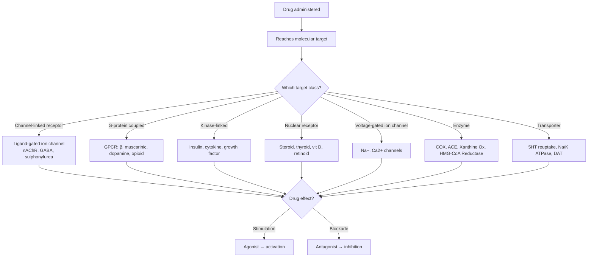
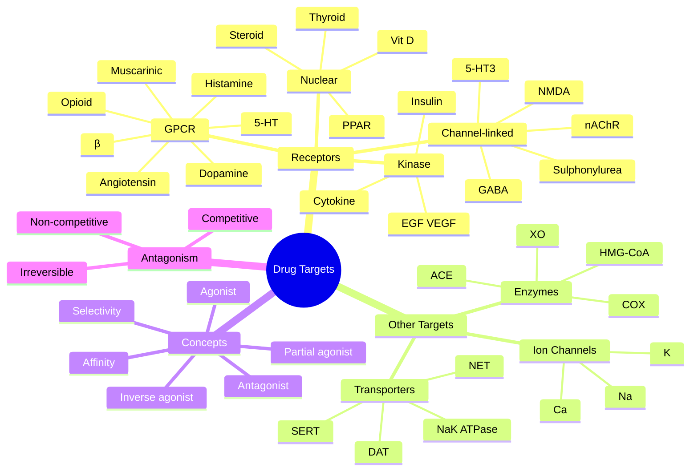

# Pharmacodynamics — Drug Targets and Receptors

> [!info]
> **Disease-Level Topic** under **Principles of Clinical Pharmacology → Pharmacodynamics**.
> Davidson 24e Ch2 (Maxwell) — "Pharmacodynamics: drug targets and mechanisms".

## 1. Learning Objectives
- [ ] List the **7 major drug target classes** with examples
- [ ] Describe **4 receptor types** (channel-linked, GPCR, kinase-linked, nuclear)
- [ ] Define **affinity, selectivity, agonist, partial agonist, antagonist**
- [ ] Differentiate **competitive vs non-competitive vs irreversible** antagonism
- [ ] Apply receptor pharmacology to clinical scenarios (β-blockers in asthma, cardioselectivity)
- [ ] Recognise spare receptors and receptor downregulation
- [ ] Understand **biologics** as a modern drug class (mAbs, fusion proteins)

## 2. Core Concept: Modern Drugs Act on Specific Molecular Targets

Most modern drugs work by either **stimulating** or **blocking** a specific molecular target. Davidson classifies targets into **receptors** (4 types) and **other targets** (3 types).

## 3. Mermaid Algorithm — Drug-Target Interaction

## 4. Comparison Tables

### 4.1 The 4 Receptor Types

| Receptor | Structure | Mechanism | Examples | Drug Examples |
|----------|-----------|-----------|----------|---------------|
| **Channel-linked (Ionotropic)** | Ligand-gated ion channel | Direct ion flow | Nicotinic AChR, GABA-A, Glycine, 5-HT₃, NMDA, Sulphonylurea (KATP) | Benzodiazepines (GABA-A), Suxamethonium (nAChR), Gliclazide (KATP) |
| **G-protein-coupled (GPCR / 7-TM)** | 7-transmembrane receptor → G-protein → second messenger | Signal transduction | β-adrenoceptors, muscarinic AChR, dopamine D1-5, 5-HT (1,2,4-7), opioid (μ,κ,δ), histamine H1/H2, angiotensin AT1, α1/α2 | Salbutamol (β2), Atenolol (β1 blocker), Morphine (μ), Ondansetron (5-HT3), Ranitidine (H2) |
| **Kinase-linked (Enzyme-linked)** | Extracellular domain → intracellular kinase | Phosphorylation cascade | Insulin receptor, cytokine receptors (IL-2, EPO, G-CSF), growth factor receptors (EGF, PDGF, VEGF) | Insulin, Epoetin alfa, Filgrastim (G-CSF), Trastuzumab (HER2), Bevacizumab (VEGF) |
| **Transcription factor (Nuclear)** | Intracellular/nuclear | Gene transcription | Steroid receptors (GR, MR, AR, ER, PR), thyroid hormone, vitamin D, retinoid, PPARγ/α | Prednisolone, Tamoxifen, Levothyroxine, Calcitriol, Pioglitazone |

### 4.2 The 3 Non-Receptor Targets

| Target | Mechanism | Examples | Drug Examples |
|--------|-----------|----------|---------------|
| **Voltage-gated ion channels** | Membrane electrical signalling | Na+ channels, Ca²+ channels, K+ channels | Lignocaine (Na+), Verapamil/Diltiazem (Ca²+), Amiodarone (K+) |
| **Enzymes** | Inhibit active site or cofactor | COX, ACE, Xanthine Oxidase, HMG-CoA Reductase, Reverse Transcriptase, Protease, Topoisomerase, DPP-4 | Aspirin, Ramipril, Allopurinol, Atorvastatin, Tenofovir, Oseltamivir |
| **Transporter proteins** | Block ion/molecule transport | 5-HT reuptake (SERT), DA reuptake (DAT), NA reuptake (NET), Na/K ATPase, P-gp, OATP | SSRIs (fluoxetine), TCAs, Cocaine, Digoxin, Statins (OATP) |

### 4.3 Non-Selective Drugs (less common today)

| Drug | Mechanism |
|------|-----------|
| **Chelators** (deferoxamine, penicillamine) | Bind metals (Fe, Cu) for overload |
| **Osmotic agents** (mannitol) | Osmotic diuresis / cerebral oedema |
| **General anaesthetics** | Lipid membrane perturbation |
| **Antacids** | Neutralise gastric acid (chemical) |
| **Sucralfate** | Coats ulcer base (physical) |

### 4.4 Key Pharmacodynamic Concepts

| Concept | Definition | Clinical Example |
|---------|-----------|------------------|
| **Affinity** | Propensity to bind receptor (molecular fit + bond strength) | Irreversible binding = prolonged effect (aspirin on COX-1) |
| **Selectivity** | Preference for one target over another | "Cardioselective" β-blockers (β1) — but still affect β2 at high doses; CONTRAINDICATED in asthma |
| **Agonist** | Binds → activates receptor → response | Salbutamol (β2), Morphine (μ) |
| **Partial agonist** | Activates but cannot achieve maximal effect | Buprenorphine (partial μ agonist — ceiling effect) |
| **Inverse agonist** | Binds and produces OPPOSITE effect to agonist | Beta-carbolines at GABA-A (anxiogenic) |
| **Antagonist** | Binds without activating | Naloxone (μ antagonist) |
| **Competitive antagonist** | Competes at same binding site | Reversible; overcome by ↑ agonist dose (shifts curve right) |
| **Non-competitive antagonist** | Acts at different site; post-receptor | Cannot be overcome by ↑ agonist (reduces Emax) |
| **Irreversible antagonist** | Covalent bond or very slow offset | Aspirin (COX-1), Phenoxybenzamine (α), MAOIs |

## 5. FCPS/MRCP High-Yield Summary

| Pearl | Detail |
|-------|--------|
| Most common drug target | GPCR (~30-40% of all drugs) |
| Largest receptor family | GPCR (odorant, taste, neurotransmitter, hormone) |
| 2nd largest | Enzyme targets (kinases, proteases, COX, ACE) |
| Cardioselective β-blockers | β1-selective: atenolol, bisoprolol, metoprolol, nebivolol. Still affect β2 in HIGH dose. CONTRAINDICATED in asthma. |
| β1 selective safer in asthma? | Marginally — but still avoid in active bronchospasm |
| Receptor downregulation | Chronic agonist exposure → ↓ receptor number (tolerance, e.g., β2 in asthma) |
| Receptor upregulation | Chronic antagonist exposure → ↑ receptor number (e.g., β-blocker withdrawal → rebound) |
| Spare receptors | Receptors in excess of those needed for maximal response (e.g., cardiac β) |
| Receptor reserve | Causes right-shift in antagonist dose-response |
| Buprenorphine | Partial μ agonist — ceiling for respiratory depression (safer than full agonist) |
| Aspirin | Irreversible COX-1 inhibitor — lasts 7-10 days (platelet lifespan) |
| MAOIs | Irreversible — need 2-week washout before switching |
| Receptor desensitisation | Phosphorylation, β-arrestin binding, internalisation, downregulation |
| Biologics (mAbs) | Target extracellular proteins, receptors, cytokines (TNF, IL-6, CD20) |

## 6. Viva Questions (10)

1. **List the 4 major receptor types.**
   *Channel-linked (ionotropic), GPCR (metabotropic, 7-TM), Kinase-linked (enzyme-linked), Nuclear (transcription factor) receptors.*

2. **What is the most common drug target class?**
   *G-protein-coupled receptors (GPCRs) — ~30-40% of all marketed drugs.*

3. **Define agonist, partial agonist, antagonist, inverse agonist.**
   *Agonist = binds and activates (full response). Partial agonist = binds and activates but cannot reach maximal response. Antagonist = binds without activating. Inverse agonist = binds and produces opposite effect to agonist.*

4. **Differentiate competitive vs non-competitive antagonism.**
   *Competitive: binds same site as agonist; reversible; can be overcome by increasing agonist dose (right-shifts dose-response curve; same Emax). Non-competitive: binds different site or causes post-receptor block; cannot be overcome by ↑ agonist (reduces Emax).*

5. **Why are "cardioselective" β-blockers contraindicated in asthma?**
   *β1-selective agents (atenolol, bisoprolol, metoprolol) primarily affect β1, but at higher doses still antagonise β2 receptors → bronchospasm. Selectivity is RELATIVE, not absolute. Avoid in active asthma.*

6. **Give an example of an irreversible antagonist and explain its clinical consequence.**
   *Aspirin (irreversibly inhibits COX-1 in platelets; effect lasts 7-10 days = platelet lifespan). Phenoxybenzamine (irreversible α-blocker, used in phaeochromocytoma). MAOIs (irreversible MAO inhibition; need 2-week washout).*

7. **What is a partial agonist? Give a clinical example.**
   *A drug that activates the receptor but cannot produce maximal effect even at full occupancy. Example: Buprenorphine (partial μ agonist) — ceiling effect for respiratory depression; used in opioid substitution and moderate pain.*

8. **What is the difference between receptor desensitisation and downregulation?**
   *Desensitisation: rapid loss of response (seconds-minutes) due to receptor phosphorylation or β-arrestin binding. Downregulation: slower (hours-days) decrease in receptor number due to internalisation and degradation.*

9. **Why does chronic β-blocker therapy cause rebound hypertension/tachycardia on abrupt withdrawal?**
   *β-receptors are upregulated (more receptors) during chronic β-blockade. On sudden withdrawal, the increased receptor pool is exposed to normal catecholamines → exaggerated response (rebound HTN, angina, MI). Always taper β-blockers over weeks.*

10. **What is the difference between a "biologic" and a small-molecule drug?**
    *Biologics (mAbs, fusion proteins, peptides) are large protein molecules (~150 kDa) that target extracellular proteins (cytokines, receptors, cell-surface antigens). Cannot be given orally (degraded in GI). Examples: adalimumab (TNF-α), rituximab (CD20), trastuzumab (HER2), insulin.*

## 7. Confusions & Mnemonics

| Confusion | Resolution |
|-----------|------------|
| Agonist vs antagonist | Agonist ACTIVATES; antagonist BLOCKS |
| Partial agonist vs antagonist | Partial agonist ACTIVATES but with ceiling; antagonist has NO activity |
| Competitive vs non-competitive | Competitive = reversible, overcome by ↑ agonist; non-competitive = reduces Emax |
| Selective vs specific | Selective = relative preference; specific = absolute (rare) |
| GPCR vs kinase-linked | GPCR = G-protein signalling (fast, second messenger); kinase = phosphorylation (slower, gene expression) |
| Channel-linked vs voltage-gated | Channel-linked = ligand-gated (GABA, nAChR); voltage-gated = membrane potential (Na+, Ca2+) |
| Inverse agonist vs antagonist | Inverse agonist = REDUCES constitutive activity; antagonist = simply blocks agonist effect |
| Affinity vs efficacy | Affinity = binding strength; efficacy = intrinsic activity once bound |
| Receptor reserve (spare receptors) | Receptors in excess; explains right-shift in antagonist curve |
| β1 selective ≠ safe in asthma | Relative selectivity lost at high doses; avoid in active bronchospasm |
| Irreversible vs slowly reversible | Irreversible = covalent bond (aspirin, MAOI); slowly reversible = tight binding (digoxin on Na/K ATPase) |

**Mnemonic — Receptor types: "**C**-**G**-**K**-**N**"** (Channel-linked, GPCR, Kinase, Nuclear)

**Mnemonic — GPCR examples: "**M**uscarinic, **β**-adrenoceptors, **D**opamine, **S**erotonin, **O**pioid, **H**istamine, **A**ngiotensin, **α**-adrenoceptors"** (MBD SOHAA)

**Mnemonic — Enzyme targets: "**CAKE X-RATED**"** (COX, ACE, Kinases, EH [HMG-CoA Reductase], Xanthine Ox, Reverse Transcriptase, ACE again, Topoisomerase, DPP-4)

**Mnemonic — Selectivity is RELATIVE: "**A**ll **β**-blockers **B**lock **B**ronchi (at high dose)"**

**Mnemonic — Spare receptors: "**R**eserve **R**eceptors **R**ight-shift the **R**esponse"**

## 8. Mermaid Mind Map

## 9. Spaced Repetition Tracker

| Topic | Day 1 | Day 3 | Day 7 | Day 14 | Day 30 |
|-------|-------|-------|-------|-------|--------|
| 4 receptor types | ☐ | ☐ | ☐ | ☐ | ☐ |
| GPCR examples | ☐ | ☐ | ☐ | ☐ | ☐ |
| Agonist vs antagonist | ☐ | ☐ | ☐ | ☐ | ☐ |
| Partial agonist | ☐ | ☐ | ☐ | ☐ | ☐ |
| Cardioselectivity in asthma | ☐ | ☐ | ☐ | ☐ | ☐ |
| Irreversible antagonists | ☐ | ☐ | ☐ | ☐ | ☐ |
| Receptor downregulation | ☐ | ☐ | ☐ | ☐ | ☐ |
| β-blocker withdrawal | ☐ | ☐ | ☐ | ☐ | ☐ |

## 10. Self-Test Scorecard

| Domain | Score (0-5) |
|--------|-------------|
| 4 receptor types | /5 |
| 7 target classes | /5 |
| Agonist/antagonist | /5 |
| Competitive vs non-competitive | /5 |
| Clinical examples (β, aspirin) | /5 |
| Biologics | /5 |
| **TOTAL** | **/30** |

## 11. MCQs (10)

1. **The most common drug target class is:**
   A. Ion channels
   B. G-protein-coupled receptors (GPCRs) ✓
   C. Nuclear receptors
   D. Enzymes
   E. Transporters

2. **A "partial agonist" produces:**
   A. Maximal response
   B. Submaximal response even at full receptor occupancy ✓
   C. No response
   D. Inverse response
   E. All of the above

3. **Aspirin is an example of:**
   A. Competitive reversible antagonist
   B. Non-competitive antagonist
   C. Irreversible antagonist ✓
   D. Partial agonist
   E. Inverse agonist

4. **"Cardioselective" β1-blockers (atenolol, bisoprolol):**
   A. Are 100% β1-specific
   B. Have absolute safety in asthma
   C. May still cause bronchospasm at high dose ✓
   D. Activate β2 receptors
   E. Are inverse agonists at β2

5. **The γ-aminobutyric acid (GABA)-A receptor is an example of:**
   A. GPCR
   B. Nuclear receptor
   C. Channel-linked (ionotropic) receptor ✓
   D. Kinase-linked receptor
   E. Voltage-gated channel

6. **Insulin acts on which receptor type?**
   A. Channel-linked
   B. GPCR
   C. Kinase-linked (tyrosine kinase) ✓
   D. Nuclear
   E. Voltage-gated

7. **A competitive antagonist:**
   A. Reduces Emax
   B. Shifts dose-response curve right (parallel); Emax unchanged ✓
   C. Binds covalently
   D. Has intrinsic activity
   E. Cannot be overcome by ↑ agonist

8. **Buprenorphine is a:**
   A. Full μ agonist
   B. Partial μ agonist (ceiling effect on respiratory depression) ✓
   C. μ antagonist
   D. κ agonist
   E. Mixed agonist-antagonist only

9. **Receptor upregulation from chronic β-blockade explains:**
   A. Bronchospasm
   B. Rebound hypertension on withdrawal ✓
   C. Bradycardia
   D. Hypotension
   E. Tachycardia

10. **An example of a biologic (monoclonal antibody) drug is:**
    A. Aspirin
    B. Adalimumab (anti-TNF) ✓
    C. Atenolol
    D. Amiodarone
    E. Allopurinol

## 12. SBAs (5)

1. **A 70-year-old with asthma is started on atenolol for AF. One week later, develops severe bronchospasm. Mechanism:**
   - A) β1 specificity was absolute
   - B) Atenolol at 100 mg loses β1 selectivity; partial β2 blockade at higher dose → bronchospasm ✓
   - C) Direct histamine release
   - D) Anaphylaxis
   - E) Allergy to atenolol

2. **A patient on chronic β-blocker for HTN stops abruptly. Two days later, has rebound tachycardia, HTN, and an MI. The MOST likely mechanism is:**
   - A) Toxic accumulation
   - B) Receptor upregulation during chronic blockade → exaggerated response to catecholamines on withdrawal ✓
   - C) Auto-induction
   - D) Allergic reaction
   - E) None of the above

3. **A patient is given naloxone for opioid overdose. Naloxone is a:**
   - A) Full μ agonist
   - B) Partial μ agonist
   - C) Competitive μ antagonist ✓
   - D) Inverse agonist
   - E) Mixed agonist-antagonist

4. **A patient on morphine for chronic pain is switched to buprenorphine. The benefit is:**
   - A) Better pain control
   - B) Lower risk of respiratory depression (ceiling effect) ✓
   - C) Faster onset
   - D) Less constipation
   - E) Cheaper

5. **A 30-year-old with RA is started on adalimumab. The mechanism is:**
   - A) COX-2 inhibition
   - B) TNF-α blockade (monoclonal antibody) ✓
   - C) JAK inhibition
   - D) IL-6 receptor agonism
   - E) T-cell co-stimulation

## 13. Answer Key

### MCQ Answers
1. **B** (GPCRs ~30-40% of drugs)
2. **B** (Partial agonist = submaximal)
3. **C** (Aspirin = irreversible COX-1 inhibitor)
4. **C** (β1 selectivity is relative; high dose = β2 effect)
5. **C** (GABA-A = ionotropic; benzodiazepines, barbiturates bind here)
6. **C** (Insulin = receptor tyrosine kinase)
7. **B** (Competitive antagonist: parallel right-shift, same Emax)
8. **B** (Buprenorphine = partial μ agonist)
9. **B** (Upregulation → rebound on withdrawal)
10. **B** (Adalimumab = anti-TNF mAb)

### SBA Answers
1. **B** — Even β1-selective atenolol loses selectivity at high dose; partial β2 blockade → bronchospasm.
2. **B** — Chronic β-blockade → β-receptor upregulation → exaggerated response on withdrawal.
3. **C** — Naloxone is competitive μ antagonist (reverses opioid overdose).
4. **B** — Buprenorphine partial μ agonist: ceiling effect for respiratory depression (safer).
5. **B** — Adalimumab = anti-TNF-α mAb (blocks TNF, a pro-inflammatory cytokine).

## 14. Summary Box

> **Drug targets = 4 receptor types + 3 non-receptor targets.** Receptors: Channel-linked (GABA, nAChR), GPCR (β, dopamine, 5-HT, opioid), Kinase-linked (insulin, cytokine, growth factor), Nuclear (steroid, thyroid, vit D). Non-receptors: Voltage-gated ion channels (Na, Ca, K), Enzymes (COX, ACE, XO, HMG-CoA), Transporters (SERT, DAT, Na/K ATPase). **Agonist** activates; **partial agonist** submaximal; **antagonist** blocks. **Competitive** antagonist shifts curve right (same Emax); **non-competitive** reduces Emax. **Cardioselective** β-blockers are RELATIVELY β1-specific; contraindicated in asthma. **Receptor upregulation** explains β-blocker rebound. **Biologics** (mAbs) target extracellular proteins.

---

## Cross-Links
- **Parent Heading**: [[../Principles of Clinical Pharmacology|Principles of Clinical Pharmacology]]
- **Sibling Topics**: [[Dose-Response and Therapeutic Index]], [[Agonists and Antagonists]], [[Desensitisation, Tolerance, Withdrawal]]
- **Chapter MOC**: [[Clinical Therapeutics and Good Prescribing MOC]]
- **Related**: [[Principles of Rational Prescribing]], [[ADRs]], [[Drug Interactions]]

**Last Updated:** 2026-06-15  
**Status: FULLY COMPLETE with Exam Suite (Viva 10, MCQ 10, SBA 5, Answer Key, Confusions, Mind Map, Spaced Repetition, Self-Test, Exam Modes)**
