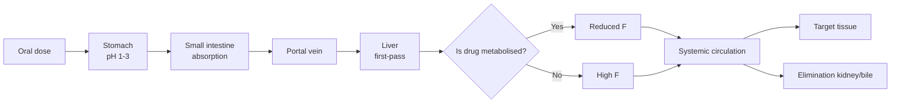
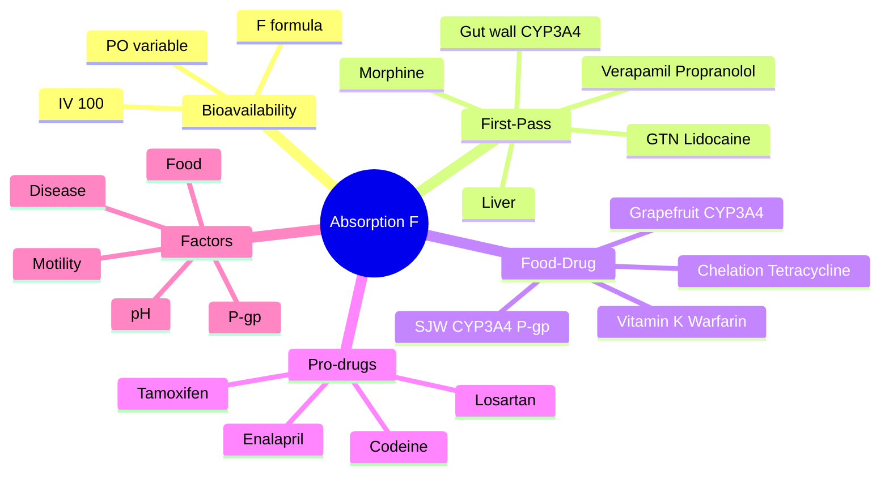

# Pharmacokinetics — Absorption & Bioavailability

> [!info]
> **Disease-Level Topic** under **Principles of Clinical Pharmacology → Pharmacokinetics**.
> Davidson 24e Ch2 (Maxwell) — "Absorption, distribution, metabolism, excretion (ADME)".

## 1. Learning Objectives
- [ ] Define **bioavailability (F)** and its clinical relevance
- [ ] Explain **first-pass metabolism** and its impact on oral drugs
- [ ] Apply the **F** in dose calculations (oral = IV × F)
- [ ] Identify factors affecting drug absorption (food, pH, motility, transporters)
- [ ] Recognize common drug-food interactions (chelation, grapefruit)
- [ ] Distinguish **absorption** from **bioavailability**
- [ ] Understand **prodrugs** and **F > 1** situations

## 2. Core Definitions

| Term | Definition | Range |
|------|-----------|-------|
| **Absorption** | Rate and extent drug enters systemic circulation from administration site | — |
| **Bioavailability (F)** | Fraction of administered drug reaching systemic circulation unchanged | 0-1 (0-100%) |
| **First-pass metabolism** | Drug metabolism BEFORE reaching systemic (gut wall + liver) | Variable loss |
| **Tmax** | Time to reach peak plasma concentration | Hours |
| **Cmax** | Peak plasma concentration | mg/L |
| **AUC** | Area under plasma concentration-time curve | mg·h/L |
| **Absolute F** | F of drug via extravascular route compared to IV (F=1) | 0-1 |
| **Relative F** | F compared to another extravascular formulation | 0-1+ |
| **Bioequivalence** | Same F and rate (within 80-125%) as reference | — |
| **Pro-drug** | Inactive drug converted to active form in vivo | F(prodrug) → F(active) |

## 3. Mermaid Algorithm — Oral Drug Journey

## 4. Comparison Tables

### 4.1 Bioavailability by Route

| Route | Typical F | Notes |
|-------|-----------|-------|
| **IV** | 100% (F=1) | Gold standard |
| **IM** | 70-100% | Aqueous solutions ~100% |
| **SC** | 70-100% | Variable (e.g., insulin) |
| **SL/Buccal** | 70-100% | Bypasses first-pass |
| **Inhaled (local)** | 10-30% systemic | Most stays in lung |
| **Intranasal** | 50-100% | Variable |
| **Transdermal** | 80-100% (slow) | Sustained |
| **PR (lower 1/3)** | 30-50% | Variable |
| **PR (upper 1/3)** | 10-30% | First-pass loss |
| **PO** | 5-100% (commonly 30-80%) | First-pass loss |

### 4.2 First-Pass Metabolism — Clinical Impact

| Drug | Oral F | Reason | Clinical consequence |
|------|--------|--------|----------------------|
| **GTN** | <1% (oral) | Massive hepatic first-pass | Must use SL, IV, transdermal |
| **Verapamil** | 20-30% | Hepatic first-pass | Higher oral dose than IV |
| **Propranolol** | 30% | Hepatic first-pass | Increased in cirrhosis |
| **Morphine** | 30% | Hepatic glucuronidation | 60 mg PO ≈ 20 mg IV |
| **Lidocaine** | 30% (oral); IV only | Hepatic first-pass | Cannot give oral |
| **Diltiazem** | 30-40% | Hepatic first-pass | Higher oral dose |
| **Labetalol** | 30% | First-pass | Higher oral dose |
| **Hydrocortisone** | 50% | First-pass (cortisol→cortisone) | Higher oral dose for adrenal replacement |
| **Testosterone** | <10% | First-pass | Use transdermal/SL/IM |
| **Warfarin** | 90-100% | Minimal first-pass | Oral F high |
| **Metformin** | 50-60% | Some first-pass; not metabolised | Oral effective |
| **Digoxin** | 60-80% | Variable gut absorption | Capsules vs elixir different F |

### 4.3 Factors Affecting Absorption

| Factor | Effect | Example |
|--------|--------|---------|
| **Gastric pH ↑** (PPI, H2-blocker, antacid) | ↓ Absorption of weak acids; ↑ of weak bases | ↓ Ketoconazole (needs acid); ↑ Cefpodoxime |
| **Gastric pH ↓** | ↑ Absorption of weak acids; ↓ of weak bases | (Less clinically relevant) |
| **Gastric emptying** | Affects Tmax (not AUC usually) | Metoclopramide ↑ paracetamol Tmax (faster); opioids slow |
| **Food** | Variable | Tetracycline + dairy → ↓ 80% (chelation); griseofulvin + fatty meal → ↑ |
| **Chelation** (Ca²⁺, Mg²⁺, Al³⁺, Fe²⁺, Zn²⁺) | ↓ Absorption (insoluble complex) | Quinolone + antacid; bisphosphonate + calcium; levothyroxine + iron |
| **P-gp efflux** (enterocyte) | ↓ Absorption | Digoxin, tacrolimus (P-gp substrates); verapamil inhibits P-gp |
| **CYP3A4 gut wall** | ↓ F (gut wall metabolism) | Statins + grapefruit; ciclosporin + SJW |
| **Disease** (Crohn's, coeliac, short gut) | ↓ Absorption | Variable |
| **Surgery** (bariatric, ileal resection) | ↓ Absorption | Bile acid binders ↓ fat-soluble vitamin absorption |
| **Age** | Variable | ↓ Gastric acid (elderly); ↓ motility |

### 4.4 Drug-Food/Drink Interactions Affecting Absorption

| Substance | Drug | Effect | Mechanism |
|-----------|------|--------|-----------|
| **Grapefruit juice** | Simvastatin, atorvastatin, ciclosporin, tacrolimus, sildenafil, CCB | ↑ AUC 2-10x | CYP3A4 inhibition (gut wall) |
| **Dairy / milk** | Tetracyclines, quinolones, bisphosphonates | ↓ 50-90% | Ca²⁺ chelation |
| **Antacids** (Ca²⁺, Mg²⁺, Al³⁺) | Tetracycline, quinolone, iron, levothyroxine | ↓ Absorption | Chelation, ↑ pH |
| **Iron** | Tetracycline, quinolone, levothyroxine, methyldopa | ↓ | Chelation |
| **High-fat meal** | Griseofulvin, saquinavir, itraconazole (capsule) | ↑ | Bile salt, lymphatic absorption |
| **Vitamin K-rich foods** | Warfarin | ↓ INR | Antagonism of vitamin K |
| **Tyramine-rich foods** (cheese, wine) | MAOIs | Hypertensive crisis | Indirect sympathomimetic + MAOI |
| **Alcohol (acute)** | CNS depressants | ↑ Sedation | Additive CNS depression |
| **Alcohol (chronic)** | Paracetamol | ↑ Hepatotoxicity | CYP2E1 induction |
| **Cranberry juice** | Warfarin | ↑ INR (variable) | CYP2C9 inhibition |
| **St John's Wort** | OCP, ciclosporin, simvastatin, apixaban, many | ↓ Levels | CYP3A4 + P-gp induction |
| **Soy milk** | Levothyroxine | ↓ | Binds levothyroxine |
| **Coffee** | Iron | ↓ | Tannins + polyphenols |
| **Brussels sprouts, broccoli** | Warfarin | ↓ INR | Vitamin K |

### 4.5 Prodrugs (F may be > 100% apparent)

| Prodrug | Active Metabolite | Use |
|---------|-------------------|-----|
| **Enalapril** | Enalaprilat | ACE inhibitor |
| **Ramipril** | Ramiprilat | ACE inhibitor |
| **Perindopril** | Perindoprilat | ACE inhibitor |
| **Lisinopril** | Lisinopril (active) | ACE inhibitor (NOT a prodrug) |
| **Losartan** | EXP3174 (more potent) | ARB |
| **Codeine** | Morphine | Analgesic (10%) |
| **Tramadol** | O-desmethyltramadol (M1) | Analgesic |
| **Tamoxifen** | Endoxifen (CYP2D6) | Breast cancer |
| **Cyclophosphamide** | Acrolein (toxic) + active | Cancer |
| **Dabigatran etexilate** | Dabigatran | Anticoagulant |
| **Mycophenolate mofetil** | Mycophenolic acid | Immunosuppressant |
| **Prasugrel** | R-138727 | Antiplatelet |
| **Clopidogrel** | Active thiol | Antiplatelet (CYP2C19) |
| **Benzylpenicillin** | Penicillin G (active) | Antibiotic |

**Prodrugs may have HIGHER "F" than active drug** because F refers to the prodrug reaching systemic; once activated, the active metabolite is the measurable moiety.

## 5. FCPS/MRCP High-Yield Summary

| Pearl | Detail |
|-------|--------|
| Bioavailability formula | F = AUC(oral) / AUC(IV) × Dose(IV) / Dose(oral) |
| 100% F | IV only |
| First-pass sites | Gut wall (CYP3A4) + liver (CYP, hepatic uptake) |
| Highest first-pass loss | GTN, lidocaine, verapamil, propranolol, morphine (oral low F) |
| Chelation drugs | Tetracyclines, quinolones — separate from Ca²⁺, Mg²⁺, Fe²⁺ by 2-4 h |
| Grapefruit | CYP3A4 inhibitor (gut wall) — avoid with statins, CCB, ciclosporin |
| St John's Wort | CYP3A4 + P-gp inducer — many interactions |
| Tetracycline + milk | ↓ 80% absorption (chelation) |
| Bioequivalence | 80-125% AUC + Cmax of reference (FDA standard) |
| Levothyroxine absorption | ↓ by Ca²⁺, Fe²⁺, PPI, sucralfate — take on empty stomach |
| Pro-drugs | Enalapril, losartan, codeine, tamoxifen (CYP2D6-dependent) |
| Variable F drugs | Digoxin, theophylline, paracetamol, warfarin |
| Pro-drug + F | Codeine "F" refers to codeine absorption, not morphine; morphine formation depends on CYP2D6 |
| Effect of food on absorption | Variable: ↓ tetracycline, ↑ griseofulvin, ↑ saquinavir |
| Time to peak (Tmax) | Reduced by faster gastric emptying (metoclopramide); increased by food/fat |
| AUC = F × Dose / CL | For oral vs IV comparison |

## 6. Viva Questions (10)

1. **Define bioavailability.**
   *The fraction (or percentage) of an administered drug that reaches the systemic circulation unchanged. IV bioavailability is 100% (F=1); oral is usually less due to first-pass metabolism and incomplete absorption.*

2. **What is first-pass metabolism?**
   *Metabolism of a drug BEFORE it reaches the systemic circulation, occurring at the gut wall (CYP3A4) and the liver (via portal vein). Reduces the amount of active drug reaching systemic.*

3. **List 5 drugs with high first-pass metabolism.**
   *GTN, lidocaine, verapamil, propranolol, morphine. All have very low oral bioavailability; require alternative routes.*

4. **Why is oral morphine only 30% bioavailable?**
   *Morphine undergoes significant first-pass hepatic metabolism (glucuronidation to M3G, M6G; some excreted in bile). About 70% of an oral dose is lost before reaching systemic circulation. IV morphine is ~3x more potent than oral morphine.*

5. **A patient on tetracycline takes it with milk. What happens?**
   *Ca²⁺ in milk chelates tetracycline, forming an insoluble complex. Absorption is reduced by 50-90%. Patients should take tetracycline on an empty stomach with water, NOT with dairy.*

6. **Why must GTN be given sublingually?**
   *GTN is almost completely metabolised in the liver on first pass (oral F <1%). Sublingual bypasses first-pass via direct absorption into the systemic circulation through the oral mucosa. Acts in 1-5 minutes.*

7. **A patient on simvastatin drinks grapefruit juice. What is the risk?**
   *Grapefruit juice inhibits intestinal CYP3A4 → ↑ simvastatin bioavailability (up to 10x) → myopathy/rhabdomyolysis risk. Either avoid grapefruit or switch to pravastatin/rosuvastatin (not CYP3A4 metabolised).*

8. **What is a prodrug? Give 3 examples.**
   *An inactive drug that is converted to the active form in vivo (usually by hepatic metabolism). Examples: enalapril → enalaprilat, losartan → EXP3174, codeine → morphine (10% by CYP2D6), tamoxifen → endoxifen, dabigatran etexilate → dabigatran.*

9. **Why must levothyroxine be taken on an empty stomach?**
   *Levothyroxine absorption is reduced by food (50%), Ca²⁺ (calcium), Fe²⁺ (iron), PPIs, sucralfate, and bile acid binders. Take 30-60 minutes before food on an empty stomach for consistent absorption.*

10. **Define bioequivalence.**
    *Two formulations are bioequivalent if they have the same rate and extent of absorption (within 80-125% for AUC and Cmax) as the reference. Allows generic substitution.*

## 7. Confusions & Mnemonics

| Confusion | Resolution |
|-----------|------------|
| Absorption vs bioavailability | Absorption = rate and extent; F = fraction reaching systemic |
| First-pass vs systemic metabolism | First-pass = BEFORE systemic (gut + liver); systemic = after |
| F=1 vs 100% | F=1 means 100% bioavailable (IV) |
| F > 100% | Impossible for the same drug; but prodrugs may give "F > 100%" for active metabolite due to hepatic conversion |
| Absolute vs relative F | Absolute = vs IV; Relative = vs another formulation |
| Tmax vs onset | Tmax = time to peak; onset = time to first effect |
| Bioequivalence vs therapeutic equivalence | Bioequivalent = same PK; therapeutically equivalent = same clinical effect (usually both) |
| Tetracycline + antacid | ↓ 50-80% (chelation) |
| Quinolone + dairy | ↓ 50-70% (chelation) |
| Levothyroxine timing | Empty stomach; separate from Ca²⁺/Fe²⁺ by 4 h |
| OCP + antibiotic | Most don't reduce; rifampicin DOES (CYP3A4 induction) |
| OCP + diarrhoea/vomiting | Reduced efficacy (pill not absorbed) — backup contraception |
| St John's Wort | CYP3A4 + P-gp inducer (↓ many drugs) |
| Grapefruit | CYP3A4 inhibitor (↑ simvastatin, ciclosporin) |
| Pro-drug "F" | F refers to prodrug absorption; active metabolite formation depends on enzyme activity |
| CYP2D6 polymorphism | Affects codeine, tramadol, tamoxifen activation (poor metaboliser = less effect) |

**Mnemonic — High first-pass drugs: "**GLV**en **L**oves **P**rescription **M**orphine **OR**ally"** (GTN, Lidocaine, Verapamil, Propranolol, Morphine)

**Mnemonic — Grapefruit: "**Grapefruit **G**uts CYP3A4"** (intestinal CYP3A4 inhibition)

**Mnemonic — St John's Wort: "**St John's **W**ort **W**recks **C**iclosporin (and many others)"**

**Mnemonic — Chelation: "**T**etracyclines/Quinolones + **C**ations = **C**helated"** (Ca²⁺, Mg²⁺, Fe²⁺, Al³⁺)

**Mnemonic — Levothyroxine: "**L**evothyroxine = **L**oves **L**iquid + **E**mpty **S**tomach"** (away from food, Ca²⁺, Fe²⁺)

**Mnemonic — Bioequivalence: "**80-125** rule"** (AUC and Cmax within 80-125% of reference)

## 8. Mermaid Mind Map

## 9. Spaced Repetition Tracker

| Topic | Day 1 | Day 3 | Day 7 | Day 14 | Day 30 |
|-------|-------|-------|-------|-------|--------|
| F definition | ☐ | ☐ | ☐ | ☐ | ☐ |
| First-pass | ☐ | ☐ | ☐ | ☐ | ☐ |
| High first-pass drugs | ☐ | ☐ | ☐ | ☐ | ☐ |
| Chelation | ☐ | ☐ | ☐ | ☐ | ☐ |
| Grapefruit | ☐ | ☐ | ☐ | ☐ | ☐ |
| SJW | ☐ | ☐ | ☐ | ☐ | ☐ |
| Prodrugs | ☐ | ☐ | ☐ | ☐ | ☐ |
| Bioequivalence | ☐ | ☐ | ☐ | ☐ | ☐ |

## 10. Self-Test Scorecard

| Domain | Score (0-5) |
|--------|-------------|
| Bioavailability | /5 |
| First-pass | /5 |
| Food interactions | /5 |
| Prodrugs | /5 |
| Factors affecting | /5 |
| Bioequivalence | /5 |
| **TOTAL** | **/30** |

## 11. MCQs (10)

1. **Bioavailability (F) of an IV drug is:**
   A. 0
   B. 50%
   C. 80%
   D. 100% ✓
   E. Variable

2. **First-pass metabolism occurs in:**
   A. Kidney
   B. Liver (and gut wall) ✓
   C. Lung
   D. Skin
   E. Heart

3. **Which drug has the highest first-pass metabolism?**
   A. Paracetamol
   B. Warfarin
   C. GTN ✓
   D. Amoxicillin
   E. Digoxin

4. **Tetracycline should NOT be taken with:**
   A. Water
   B. Milk (Ca²⁺ chelation) ✓
   C. Orange juice
   D. Coffee
   E. Tea

5. **Grapefruit juice affects drug absorption by inhibiting:**
   A. CYP2D6
   B. CYP2C9
   C. Intestinal CYP3A4 ✓
   D. P-gp only
   E. OCT

6. **A prodrug is:**
   A. A drug that is excreted unchanged
   B. An inactive drug converted to active in vivo ✓
   C. A drug that is always more potent
   D. A drug only given IV
   E. An antagonist

7. **Codeine is metabolised to:**
   A. Morphine (10% via CYP2D6) ✓
   B. Methadone
   C. Oxycodone
   D. Tramadol
   E. Fentanyl

8. **Bioequivalence requires AUC and Cmax to be within:**
   A. 50-150%
   B. 70-130%
   C. 80-125% ✓
   D. 90-110%
   E. 95-105%

9. **Levothyroxine should be taken:**
   A. With food
   B. With Ca²⁺ supplement
   C. On empty stomach 30-60 min before food ✓
   D. At bedtime
   E. With iron

10. **St John's Wort primarily affects:**
    A. CYP2D6 inhibition
    B. CYP3A4 + P-gp induction ✓
    C. CYP2C9 inhibition
    D. CYP1A2 induction
    E. Renal transporters

## 12. SBAs (5)

1. **A patient on simvastatin drinks grapefruit juice daily. Develops severe myalgia. CK = 12,000. Mechanism:**
   - A) Grapefruit increases statin metabolism
   - B) Grapefruit inhibits intestinal CYP3A4 → ↑ simvastatin bioavailability → ↑ levels → rhabdomyolysis ✓
   - C) Grapefruit binds myocyte receptors
   - D) Grapefruit causes potassium loss
   - E) Statin allergy

2. **A patient with hypothyroidism takes levothyroxine with breakfast and calcium supplements. TSH remains elevated. Best explanation:**
   - A) Levothyroxine dose too low
   - B) Food and Ca²⁺ reduce levothyroxine absorption; take on empty stomach, 4h apart from Ca²⁺ ✓
   - C) Drug interaction
   - D) Wrong diagnosis
   - E) Adherence issue

3. **A patient is given codeine for pain. Has no analgesic effect. Most likely explanation:**
   - A) Codeine is not an analgesic
   - B) CYP2D6 poor metaboliser → no conversion to morphine ✓
   - C) Wrong dose
   - D) Allergy
   - E) Wrong diagnosis

4. **IV morphine 10 mg is approximately equivalent to:**
   - A) 10 mg PO morphine
   - B) 20 mg PO morphine
   - C) 30 mg PO morphine ✓
   - D) 100 mg PO morphine
   - E) 200 mg PO morphine

5. **A patient takes warfarin and drinks large amounts of cranberry juice. INR rises. Mechanism:**
   - A) Cranberry inhibits CYP2C9 (warfarin metabolism) ✓
   - B) Cranberry displaces warfarin
   - C) Cranberry increases vitamin K
   - D) Cranberry has no effect
   - E) Cranberry chelates warfarin

## 13. Answer Key

### MCQ Answers
1. **D** (IV = 100%)
2. **B** (Liver + gut wall)
3. **C** (GTN almost completely metabolised)
4. **B** (Milk chelation)
5. **C** (Intestinal CYP3A4)
6. **B** (Inactive → active)
7. **A** (Codeine → morphine via CYP2D6)
8. **C** (80-125%)
9. **C** (Empty stomach)
10. **B** (CYP3A4 + P-gp induction)

### SBA Answers
1. **B** — Grapefruit inhibits intestinal CYP3A4 → ↑ simvastatin → rhabdomyolysis.
2. **B** — Food and Ca²⁺ reduce levothyroxine absorption; take on empty stomach, 4 h from Ca²⁺.
3. **B** — CYP2D6 poor metaboliser; codeine requires conversion to morphine.
4. **C** — Oral morphine F ~30%; 10 mg IV ≈ 30 mg PO.
5. **A** — Cranberry inhibits CYP2C9 → ↑ warfarin → ↑ INR.

## 14. Summary Box

> **Bioavailability (F) = fraction reaching systemic.** IV = 100% (F=1); oral = 5-100% (variable). **First-pass metabolism** (gut + liver) reduces oral F of GTN, lidocaine, verapamil, propranolol, morphine. **Chelation** (Ca²⁺, Mg²⁺, Fe²⁺) reduces tetracycline/quinolone/bisphosphonate absorption. **Grapefruit** inhibits intestinal CYP3A4 (↑ simvastatin, ciclosporin). **SJW** induces CYP3A4 + P-gp (↓ OCP, ciclosporin, apixaban). **Prodrugs** (enalapril, losartan, codeine, tamoxifen) require hepatic conversion. Bioequivalence = AUC + Cmax within 80-125% of reference.

---

## Cross-Links
- **Parent Heading**: [[../../Principles of Clinical Pharmacology|Principles of Clinical Pharmacology]]
- **Sibling Topics**: [[Routes of Administration]], [[Distribution and Protein Binding]], [[Metabolism and Biotransformation]], [[Excretion and Clearance]], [[Half-life and Steady State]], [[Kinetics and Dosing]]
- **Chapter MOC**: [[Clinical Therapeutics and Good Prescribing MOC]]
- **Related**: [[Drug Interactions]], [[Special Populations]]

**Last Updated:** 2026-06-15  
**Status: FULLY COMPLETE with Exam Suite (Viva 10, MCQ 10, SBA 5, Answer Key, Confusions, Mind Map, Spaced Repetition, Self-Test, Exam Modes)**
