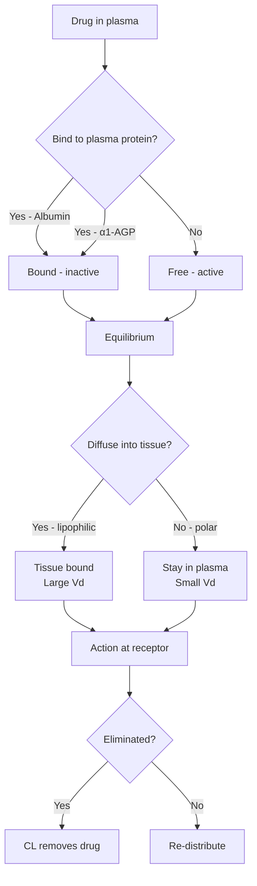
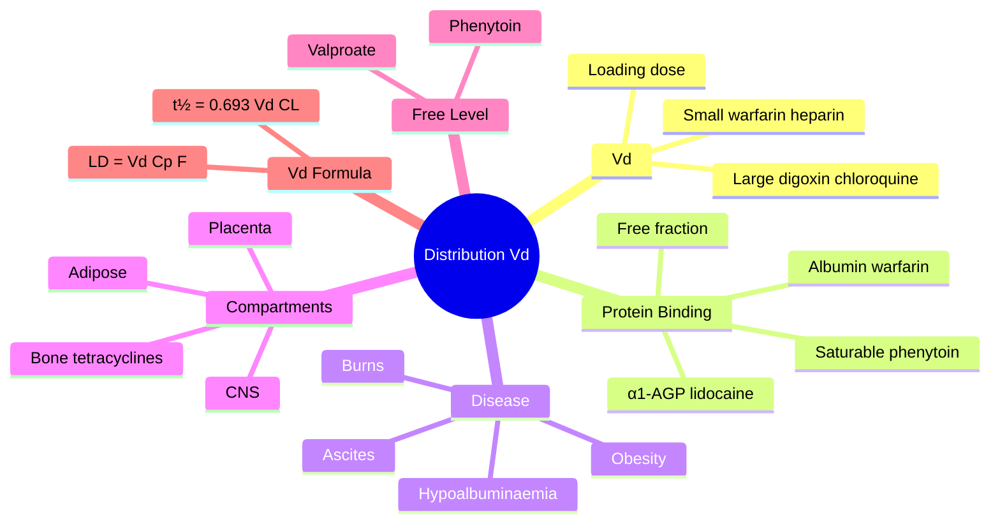

# Pharmacokinetics — Distribution, Protein Binding & Volume of Distribution

> [!info]
> **Disease-Level Topic** under **Principles of Clinical Pharmacology → Pharmacokinetics**.
> Davidson 24e Ch2 (Maxwell) — "Distribution".

## 1. Learning Objectives
- [ ] Define **volume of distribution (Vd)** and its calculation
- [ ] Differentiate Vd small (plasma), moderate, large (tissue)
- [ ] Describe **protein binding** (albumin, α1-AGP)
- [ ] Apply **loading dose formula** (LD = Vd × target Cp / F)
- [ ] Recognise clinical consequences of altered Vd (obesity, ascites, oedema)
- [ ] Explain **tissue binding** (e.g., digoxin binds to skeletal muscle Na/K ATPase)
- [ ] Identify drugs needing **free level monitoring** (phenytoin, valproate)

## 2. Core Concepts

| Term | Definition | Calculation/Range |
|------|-----------|-------------------|
| **Volume of distribution (Vd)** | Theoretical volume needed to contain the total drug amount at the observed plasma concentration | Vd = Amount in body / Plasma concentration |
| **Plasma protein binding** | Reversible drug binding to plasma proteins | Affects free fraction |
| **Albumin** | Major drug-binding protein (acidic drugs) | 60 g/L (normal) |
| **α1-acid glycoprotein (AGP)** | Binds basic drugs (e.g., lidocaine, propranolol) | 0.5-1.5 g/L |
| **Lipophilicity** | Fat solubility → high tissue binding | Affects Vd |
| **Tissue binding** | Drug accumulates in specific tissues (e.g., digoxin in skeletal muscle) | High Vd |
| **Loading dose** | Initial dose to rapidly achieve therapeutic level | LD = Vd × Ctarget / F |
| **Free fraction (fu)** | Unbound drug fraction (active) | 0.01-0.99 |
| **Free drug** | Pharmacologically active form | Affected by protein, displacement |
| **Placental transfer** | Lipid-soluble drugs cross placenta | Avoid in pregnancy |
| **BBB** | Blood-brain barrier; tight junctions, excludes large/polar drugs | CNS penetration limited |

## 3. Mermaid Algorithm — Distribution Determinants

## 4. Comparison Tables

### 4.1 Volume of Distribution (Vd) — Examples

| Drug | Vd (L/kg) | Total Vd (70 kg adult) | Implication |
|------|-----------|------------------------|-------------|
| **Warfarin** | 0.1 | 7 L | Small (plasma-bound) |
| **Heparin** | 0.05-0.1 | 4-7 L | Very small (plasma) |
| **Frusemide** | 0.1-0.2 | 7-14 L | Small |
| **Gentamicin** | 0.2-0.3 | 14-21 L | Small (extracellular) |
| **Theophylline** | 0.4-0.7 | 28-49 L | Moderate |
| **Digoxin** | 5-7 | 350-490 L | Large (tissue bound) |
| **Amitriptyline** | 10-20 | 700-1400 L | Very large (lipophilic, tissue) |
| **Chloroquine** | 13-65 | 900-4500 L | Huge (tissue accumulation) |
| **Quinacrine** | 100+ | 7000+ L | Extreme |

**Interpretation:**
- **Vd < 0.1 L/kg** (e.g., warfarin, heparin) = largely in plasma, doesn't distribute
- **Vd 0.1-0.7 L/kg** = ECF or total body water
- **Vd > 1 L/kg** = tissue sequestration, lipophilic, high tissue binding
- **Vd huge** = drug accumulates in specific tissue (often fat for lipophilic drugs)

### 4.2 Protein Binding — Examples

| Drug | Binding % | Protein | Notes |
|------|-----------|---------|-------|
| **Warfarin** | 99% | Albumin | Free fraction 1%; small changes in binding → big effect |
| **Phenytoin** | 90% | Albumin | Saturable; free level in hypoalbuminaemia |
| **Valproate** | 90-95% | Albumin | Saturable; free level useful |
| **NSAIDs** | 95-99% | Albumin | Displacement by other drugs |
| **Sulfonamides** | 60-90% | Albumin | Displace bilirubin (kernicterus in neonates) |
| **Lidocaine** | 60-80% | α1-AGP | ↑ in inflammation, MI, stress |
| **Propranolol** | 90% | α1-AGP | ↑ in MI |
| **Methotrexate** | 50% | Albumin | Displacement by NSAIDs → toxicity |
| **Digoxin** | 25% | Albumin (weak) | Not significantly displaced |
| **Aminoglycosides** | <10% | — | Mostly free |
| **Lithium** | 0% | — | Not protein bound; behaves like Na⁺ |

### 4.3 Altered Vd in Disease States

| Condition | Effect on Vd | Example |
|-----------|--------------|---------|
| **Obesity** | ↑ Vd for lipophilic drugs | Benzodiazepines, thiopental — increase dose |
| **Ascites/oedema** | ↑ Vd for water-soluble drugs (more ECF) | Aminoglycosides, β-lactams — increase loading dose |
| **Dehydration** | ↓ Vd | Toxicity at lower doses (e.g., digoxin) |
| **Pregnancy** | ↑ Vd (plasma volume, fat) | Hydrophilic drugs need higher dose |
| **Burns** | ↑ Vd (capillary leak, fluid shifts) | Aminoglycosides need higher loading |
| **Elderly** | ↓ Vd (↓ muscle, ↓ water, ↑ fat) | Water-soluble drugs more concentrated; lipophilic drugs longer t½ |
| **CKD** | ↓ Vd (some drugs) | Variable |
| **Liver disease** | ↑ Vd (↓ albumin, ↑ water) | Phenytoin (↑ free fraction) |
| **Hypoalbuminaemia** | ↑ Free fraction | Phenytoin, valproate, warfarin |

### 4.4 Drugs Requiring Free Level Monitoring

| Drug | Why free level | When to use |
|------|---------------|-------------|
| **Phenytoin** | Saturable binding, hypoalbuminaemia | Renal failure, elderly, pregnancy, cirrhosis |
| **Valproate** | Saturable binding | Renal failure, elderly, pregnancy |
| **Carbamazepine** | Mostly bound; check total OK usually | Severe renal/hepatic disease |
| **Theophylline** | ~50% bound; check total OK | — |
| **Digoxin** | ~25% bound; check total OK | Renal failure may need free level (controversial) |
| **Lithium** | Not protein bound (no need for free) | Always total level |

### 4.5 Drugs Distributed to Special Compartments

| Compartment | Example | Notes |
|-------------|---------|-------|
| **CNS (brain)** | Lipophilic drugs (benzos, opioids, gabapentin) | Limited by BBB; l-dopa actively transported |
| **Placenta** | Lipophilic drugs cross | Avoid in pregnancy (warfarin, valproate, ACEi) |
| **Bone** | Tetracyclines (deposit), bisphosphonates | Tooth discolouration in children |
| **Adipose** | Thiopental, diazepam, amiodarone, amphetamines | Accumulate; slow release; obesity → large Vd |
| **Skeletal muscle** | Digoxin (binds Na/K ATPase) | High Vd |
| **Eye** | Chloroquine (retinal), chlorpromazine (corneal) | Melanin binding |
| **Thyroid** | Amiodarone (iodine) | Hyper/hypothyroidism |
| **Teeth** | Tetracyclines (in developing) | Contraindicated <8 yr |

## 5. FCPS/MRCP High-Yield Summary

| Pearl | Detail |
|-------|--------|
| Vd formula | Vd = Amount in body / Plasma concentration |
| Loading dose | LD = Vd × Ctarget / F |
| Albumin normal | 35-50 g/L |
| Hypoalbuminaemia (liver/renal disease) | ↑ Free fraction of acidic drugs (phenytoin, valproate, warfarin) |
| Most important bound drug | Warfarin (99% albumin) |
| Vd largest | Lipophilic, tissue-accumulating drugs (chloroquine, amiodarone) |
| Vd smallest | Plasma-bound drugs (warfarin, heparin) |
| Lipophilic drug in obesity | ↑ Vd → ↑ dose needed (e.g., benzodiazepines) |
| Hydrophilic drug in obesity | Vd unchanged — dose based on IBW, not TBW |
| Gentamicin in obesity | Dose on adjusted/lean body weight (avoid over-dose) |
| Phenytoin in hypoalbuminaemia | Free level ↑; standard free therapeutic = 1-2 mg/L (total 10-20 may be misleading) |
| Digoxin Vd | 5-7 L/kg (huge; binds skeletal muscle) |
| Aminoglycoside Vd | 0.2-0.3 L/kg (extracellular fluid) |
| Loading dose rationale | Quickly achieve therapeutic level; useful for long t½ drugs (digoxin, amiodarone, phenytoin, vancomycin) |
| Body composition | Adult: ~60% water (TBW); elderly: ~50%; obesity: less % |
| Placental transfer | Lipid-soluble drugs cross; avoid warfarin, valproate, ACEi, ACE/ARBs |
| CNS penetration | Lipid-soluble, low MW, low ionisation; l-dopa actively transported (large neutral AA) |
| Cyanosis, hypoxia | Reduced O₂ delivery to tissues |
| Drug displacement interactions | Theoretical concern; mostly transient and self-limiting |

## 6. Viva Questions (10)

1. **Define volume of distribution (Vd).**
   *The theoretical volume of plasma that would be required to contain the total amount of drug in the body at the observed plasma concentration. Vd = Amount in body / Plasma concentration.*

2. **What is the loading dose formula?**
   *LD = Vd × Ctarget / F (where F is bioavailability). Used to rapidly achieve therapeutic concentration. Independent of clearance; useful for drugs with long t½ (digoxin, amiodarone, phenytoin, vancomycin).*

3. **Why does a patient with hypoalbuminaemia have a "low total phenytoin level" but may still be toxic?**
   *Phenytoin is 90% albumin-bound. In hypoalbuminaemia (liver disease, nephrotic syndrome, elderly), the free (active) fraction increases. Total level may be 8-10 mg/L (apparently "sub-therapeutic") but free level is 2-3 mg/L (toxic). Monitor FREE level in these patients.*

4. **A digoxin loading dose is needed. Calculate: target C = 2 µg/L, Vd = 7 L/kg, weight 70 kg, F = 1.**
   *LD = Vd × Ctarget / F = 7 × 70 × 2 / 1000 = 0.98 mg ≈ 1 mg (IV). Or use 0.5-1 mg initial loading.*

5. **Why is digoxin Vd so large?**
   *Digoxin binds to Na/K ATPase in skeletal muscle (and other tissues). With 25% protein binding and high tissue binding, Vd is 5-7 L/kg. Mostly in tissues, not plasma. Toxicity is muscle/heart-related.*

6. **A patient is morbidly obese (BMI 45) and needs a lipophilic drug (e.g., midazolam). Should the dose be based on TBW, IBW, or adjusted body weight?**
   *Lipophilic drugs distribute into excess fat → use TBW (or adjusted BW). For hydrophilic drugs (aminoglycosides), use adjusted/lean BW. Anaesthetic dosing on TBW for lipophilic agents.*

7. **A patient with CKD (eGFR 20) needs gentamicin. What loading dose adjustment?**
   *Loading dose depends on Vd, not clearance. Use same initial dose (5-7 mg/kg based on adjusted/lean BW). Maintenance dose is reduced based on clearance (e.g., every 48-72 h).*

8. **A patient on warfarin (99% protein-bound) is given a sulfonamide. What happens?**
   *Sulfonamide displaces warfarin from albumin → transient ↑ free warfarin → potential bleeding. However, in practice, displacement interactions are usually transient (steady-state free concentration unchanged). Still teachable; mostly relevant for elderly with hypoalbuminaemia.*

9. **Why is warfarin's Vd small (0.1 L/kg)?**
   *Warfarin is 99% protein-bound to albumin and doesn't distribute significantly into tissues. It stays in the intravascular space. Hence small Vd.*

10. **A pregnant patient needs an antidepressant. Why is sertraline preferred over fluoxetine?**
    *Both SSRIs are reasonably safe in pregnancy (paroxetine is the only one with teratogenicity concerns). Sertraline is often preferred for its lower placental transfer and shorter t½. However, paroxetine is associated with cardiac defects (Category D). SSRIs in late pregnancy: neonatal adaptation syndrome, PPHN.*

## 7. Confusions & Mnemonics

| Confusion | Resolution |
|-----------|------------|
| Vd vs Volume of blood/plasma | Vd is theoretical; can exceed total body volume (e.g., digoxin Vd > body) |
| Vd vs plasma volume | Vd is the volume in which drug would need to be dissolved to give plasma concentration; if drug is in tissue, Vd is large |
| Loading dose vs maintenance | Loading = Vd × Cp; Maintenance = CL × Cp / F |
| Loading dose affected by | Vd, target Cp, F (NOT CL) |
| Maintenance dose affected by | CL, target Cp, F (NOT Vd) |
| Albumin vs α1-AGP | Albumin binds acidic drugs; α1-AGP binds basic drugs |
| Total vs free level | Free level in: phenytoin, valproate, severe renal/hepatic disease |
| Vd in obesity | Lipophilic drugs ↑ Vd (use TBW); Hydrophilic unchanged (use IBW) |
| Digoxin distribution | Large Vd (muscle) → loading then daily maintenance |
| Heparin Vd | Small (~plasma) → IV or SC only |
| Vd vs Half-life | Vd independent of CL; t½ = 0.693 × Vd / CL |
| t½ depends on | Vd AND CL |
| Saturable binding | Phenytoin, valproate, salicylate — free level required |
| Placental transfer | Lipid-soluble drugs cross (warfarin, valproate) |
| BBB crossing | Small MW, lipid-soluble, non-ionised; l-dopa uses LAT1 transporter |

**Mnemonic — High Vd drugs: "**D**igoxin **C**hloroquine **A**mitriptyline **B**ind **T**issue"** (DCABT)

**Mnemonic — Albumin-bound drugs: "**W**arfarin **P**henytoin **V**alproate **N**SAIDs (and most acids)"** (WPVNA)

**Mnemonic — Vd small drugs: "**W**arfarin **H**eparin"** (plasma-bound)

**Mnemonic — Free level drugs: "**Ph**enytoin **V**alproate"** (saturable albumin binding)

**Mnemonic — Loading dose needs Vd: "**L**oading dose = **L**iquid for **V**olume"**

**Mnemonic — Maintenance dose needs CL: "**M**aintenance = **C**learance-related"**

## 8. Mermaid Mind Map

## 9. Spaced Repetition Tracker

| Topic | Day 1 | Day 3 | Day 7 | Day 14 | Day 30 |
|-------|-------|-------|-------|-------|--------|
| Vd definition | ☐ | ☐ | ☐ | ☐ | ☐ |
| Loading dose | ☐ | ☐ | ☐ | ☐ | ☐ |
| Albumin binding | ☐ | ☐ | ☐ | ☐ | ☐ |
| α1-AGP | ☐ | ☐ | ☐ | ☐ | ☐ |
| Free level | ☐ | ☐ | ☐ | ☐ | ☐ |
| Obesity dose | ☐ | ☐ | ☐ | ☐ | ☐ |
| Hypoalbuminaemia | ☐ | ☐ | ☐ | ☐ | ☐ |

## 10. Self-Test Scorecard

| Domain | Score (0-5) |
|--------|-------------|
| Vd definition | /5 |
| Loading dose | /5 |
| Protein binding | /5 |
| Disease effects | /5 |
| Free levels | /5 |
| Compartments | /5 |
| **TOTAL** | **/30** |

## 11. MCQs (10)

1. **Volume of distribution (Vd) is:**
   A. Total body water
   B. Theoretical volume needed to contain total drug at plasma concentration ✓
   C. Plasma volume
   D. ECF volume
   E. Interstitial fluid

2. **Loading dose (LD) formula:**
   A. LD = CL × Cp
   B. LD = Vd × Cp / F ✓
   C. LD = F × Cp
   D. LD = Vd × CL
   E. LD = Cp / Vd

3. **Which drug has the largest Vd?**
   A. Warfarin
   B. Heparin
   C. Digoxin ✓
   D. Gentamicin
   E. Theophylline

4. **Albumin binds primarily:**
   A. Basic drugs
   B. Acidic drugs ✓
   C. Neutral drugs
   D. All drugs equally
   E. None

5. **Phenytoin is 90% bound to albumin. In severe hypoalbuminaemia, what happens?**
   A. Total level rises
   B. Free (active) fraction rises ✓
   C. Drug is metabolised faster
   D. Drug is excreted faster
   E. Nothing changes

6. **α1-acid glycoprotein binds primarily:**
   A. Acidic drugs
   B. Basic drugs (e.g., lidocaine) ✓
   C. Neutral drugs
   D. Lipid-soluble drugs
   E. All drugs

7. **For a lipophilic drug in obesity, dose should be based on:**
   A. Ideal body weight
   B. Total body weight ✓
   C. Lean body weight
   D. Adjusted body weight
   E. Same dose

8. **Aminoglycoside Vd is approximately:**
   A. 0.1 L/kg
   B. 0.2-0.3 L/kg (extracellular fluid) ✓
   C. 1 L/kg
   D. 5 L/kg
   E. 50 L/kg

9. **Digoxin is mostly distributed to:**
   A. Plasma
   B. Skeletal muscle (Na/K ATPase) ✓
   C. Liver
   D. Kidney
   E. Brain

10. **Which drug REQUIRES free level monitoring?**
    A. Digoxin
    B. Lithium
    C. Phenytoin (in hypoalbuminaemia) ✓
    D. Warfarin
    E. Theophylline

## 12. SBAs (5)

1. **A 70-kg patient needs a digoxin loading dose. Target Cp = 2 µg/L, Vd = 7 L/kg, F = 1 (IV). LD = ?**
   - A) 0.1 mg
   - B) 0.5 mg
   - C) 1 mg ✓
   - D) 2 mg
   - E) 5 mg

2. **A patient with cirrhosis (albumin 20 g/L) is on phenytoin. Total level = 8 mg/L (sub-therapeutic). Patient is symptomatic (nystagmus, ataxia). Most likely explanation:**
   - A) Sub-therapeutic dose
   - B) Free level is elevated (toxic) due to hypoalbuminaemia; total misleading ✓
   - C) Drug interaction
   - D) Wrong diagnosis
   - E) Non-adherence

3. **A 100-kg obese patient needs gentamicin. Best weight to use for dosing:**
   - A) Total body weight
   - B) Ideal body weight ✓
   - C) Lean body weight
   - D) Adjusted body weight
   - E) Same dose

4. **A patient on warfarin (99% albumin-bound) is started on a sulfonamide. Brief concern:**
   - A) Warfarin displacement from albumin → transient ↑ free → bleeding risk ✓
   - B) Sulfonamides have no interaction
   - C) CYP3A4 inhibition
   - D) P-gp induction
   - E) Renal failure

5. **A 60-kg patient on amiodarone 200 mg has been stable for 6 months. Suddenly develops toxicity after starting another drug. Amiodarone is highly lipid-soluble with Vd ~70 L/kg. The new drug most likely:**
   - A) Induces amiodarone metabolism
   - B) Displaces amiodarone from tissue stores or inhibits metabolism ✓
   - C) Reduces amiodarone absorption
   - D) Causes renal failure
   - E. Has no interaction

## 13. Answer Key

### MCQ Answers
1. **B** (Vd = theoretical volume)
2. **B** (LD = Vd × Cp / F)
3. **C** (Digoxin has large Vd)
4. **B** (Albumin binds acidic drugs)
5. **B** (Free fraction ↑ in hypoalbuminaemia)
6. **B** (α1-AGP binds basic drugs)
7. **B** (TBW for lipophilic in obesity)
8. **B** (Aminoglycoside Vd 0.2-0.3 L/kg)
9. **B** (Digoxin in skeletal muscle)
10. **C** (Phenytoin free level in hypoalbuminaemia)

### SBA Answers
1. **C** — LD = 7 × 70 × 2 / 1000 = 0.98 mg ≈ 1 mg IV.
2. **B** — Phenytoin in hypoalbuminaemia: free level elevated; total misleading.
3. **B** — Aminoglycosides: use IBW (or adjusted) in obesity to avoid overdose.
4. **A** — Warfarin displacement from albumin by sulfonamide (transient).
5. **B** — Amiodarone tissue storage; drugs that inhibit metabolism (CYP3A4) or displace tissue can ↑ levels.

## 14. Summary Box

> **Vd = theoretical volume to contain total drug at plasma concentration.** LD = Vd × Cp / F. **High Vd** = tissue bound (digoxin, chloroquine, amiodarone). **Low Vd** = plasma bound (warfarin, heparin). **Albumin** binds acidic drugs (warfarin, phenytoin, valproate). **α1-AGP** binds basic drugs (lidocaine). **Free level** needed in hypoalbuminaemia (phenytoin, valproate). Obesity: lipophilic drugs ↑ Vd (use TBW); hydrophilic unchanged (use IBW). t½ = 0.693 × Vd / CL.

---

## Cross-Links
- **Parent Heading**: [[../../Principles of Clinical Pharmacology|Principles of Clinical Pharmacology]]
- **Sibling Topics**: [[Routes of Administration]], [[Absorption and Bioavailability]], [[Metabolism and Biotransformation]], [[Excretion and Clearance]], [[Half-life and Steady State]], [[Kinetics and Dosing]]
- **Chapter MOC**: [[Clinical Therapeutics and Good Prescribing MOC]]
- **Related**: [[Drug Interactions]], [[Special Populations/Hepatic Impairment/Hepatic Drug Dosing]], [[TDM/Phenytoin]]

**Last Updated:** 2026-06-15  
**Status: FULLY COMPLETE with Exam Suite (Viva 10, MCQ 10, SBA 5, Answer Key, Confusions, Mind Map, Spaced Repetition, Self-Test, Exam Modes)**
