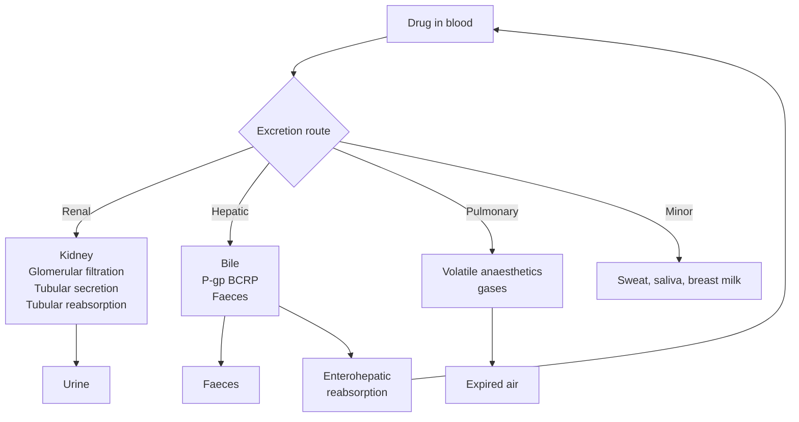
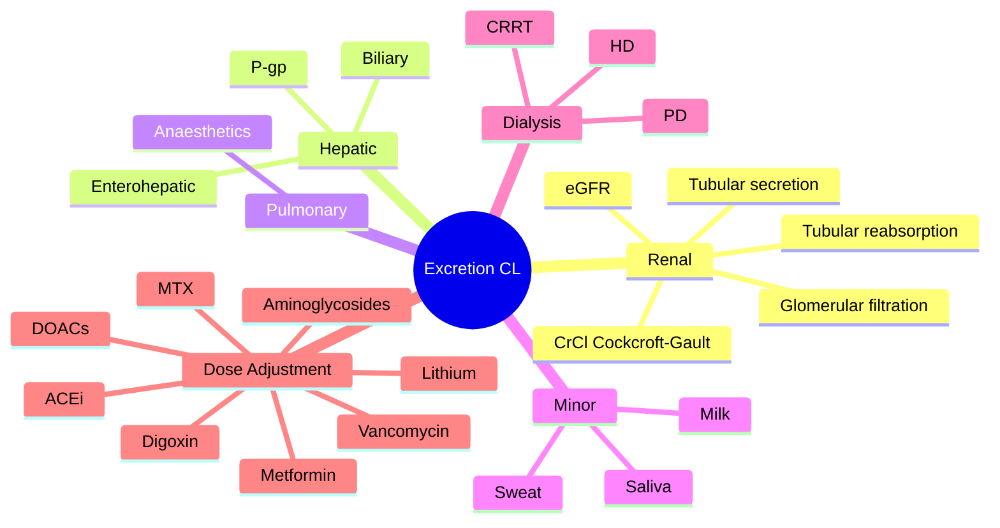

# Pharmacokinetics — Excretion & Clearance

> [!info]
> **Disease-Level Topic** under **Principles of Clinical Pharmacology → Pharmacokinetics**.
> Davidson 24e Ch2 (Maxwell) — "Excretion".

## 1. Learning Objectives
- [ ] Define **clearance (CL)** and its determinants
- [ ] Differentiate routes of excretion (renal, biliary, pulmonary, others)
- [ ] Apply **Cockcroft-Gault** formula for creatinine clearance
- [ ] Describe **tubular secretion and reabsorption**
- [ ] Identify drugs requiring **renal dose adjustment**
- [ ] Explain **hepatic vs renal** excretion
- [ ] Apply concept of **dialysis** (HD, PD, CRRT) to drug dosing

## 2. Core Concepts

| Term | Definition |
|------|-----------|
| **Clearance (CL)** | Volume of plasma completely cleared of drug per unit time (mL/min or L/h) |
| **Total body clearance** | Sum of all organ clearances (renal + hepatic + others) |
| **Renal clearance** | CLr = (Cu × V) / Cp (urinary excretion rate / plasma concentration) |
| **Hepatic clearance** | CLh = Q × E (hepatic blood flow × extraction ratio) |
| **Creatinine clearance (CrCl)** | Estimate of GFR via creatinine (Cockcroft-Gault) |
| **eGFR** | Estimated GFR (CKD-EPI, MDRD) |
| **Tubular secretion** | Active transport into tubule (probenecid-sensitive; OCT, OAT) |
| **Tubular reabsorption** | Passive (lipid-soluble, non-ionised) or active |
| **Fick's law** | CL = Q × E (relates flow, extraction, clearance) |
| **Biliary excretion** | Active transport into bile (P-gp, BCRP, MRP2) |
| **Enterohepatic circulation** | Drug excreted in bile → reabsorbed in gut → prolongs effect |
| **Faeces** | Unabsorbed drug + biliary excretion + gut metabolism |
| **Pulmonary excretion** | Gases, volatile drugs (anaesthetics) |
| **Saliva/sweat/milk** | Minor routes |

## 3. Mermaid Algorithm — Drug Excretion Pathways

## 4. Comparison Tables

### 4.1 Routes of Excretion — Examples

| Route | Examples | Notes |
|-------|----------|-------|
| **Renal (urine)** | Most drugs and metabolites: aminoglycosides, β-lactams, digoxin, lithium, methotrexate, aciclovir, ACEi, metformin, NSAIDs | Most common route; GFR + tubular secretion |
| **Biliary (faeces)** | Digoxin, rifampicin, statins, ciclosporin, tacrolimus, morphine (glucuronides), irinotecan, methotrexate, ceftriaxone, doxycycline, OC hormones | Active transport (P-gp, MRP2) |
| **Pulmonary** | Inhalational anaesthetics (halothane, isoflurane, sevoflurane, N2O), alcohol (small amount) | Volatile; gas exchange |
| **Faeces (unabsorbed)** | Oral iron (some), sucralfate, cholestyramine, magnesium-containing laxatives, activated charcoal | Not absorbed |
| **Sweat** | Small molecules (some metals, lipid-soluble drugs) | Minor |
| **Saliva** | Iodides, lithium, metronidazole | Minor |
| **Breast milk** | Most drugs (variable); lipid-soluble drugs concentrate | Caution: lithium, methotrexate, amiodarone, opioids |
| **Skin** | Some metals (silver, gold), clofazimine (skin pigmentation) | Minor |

### 4.2 Renal Drug Elimination Mechanisms

| Mechanism | Process | Examples |
|-----------|---------|----------|
| **Glomerular filtration** | Passive; small unbound drugs | Aminoglycosides, β-lactams, digoxin |
| **Tubular secretion** | Active transport (OAT, OCT, MATE) | Probenecid blocks penicillin secretion; trimethoprim blocks creatinine secretion |
| **Tubular reabsorption** | Active or passive | Lithium is reabsorbed with Na+ in PCT; water-soluble drugs less reabsorbed |

### 4.3 Drugs Cleared Primarily by Kidney (Renal Dose Adjustment Needed)

| Drug | Notes |
|------|-------|
| **Aminoglycosides** (gentamicin, amikacin, tobramycin) | TDM essential in CKD; load + extended interval |
| **Vancomycin** | TDM; trough 10-15 (standard) or AUC-guided |
| **Digoxin** | CrCl affects; reduce dose |
| **Lithium** | Narrow TI; reduce dose; monitor levels |
| **Methotrexate** | High dose requires leucovorin rescue + hydration |
| **Cisplatin** | Nephrotoxic; hydrate + monitor |
| **β-lactams** (penicillins, cephalosporins, carbapenems) | CrCl affects; some extended-infusion |
| **Acyclovir, valacyclovir** | Crystalline nephropathy; hydrate |
| **Ganciclovir, valganciclovir** | Neutropenia; renal dose |
| **Oseltamivir** | CrCl dose |
| **Famciclovir, penciclovir** | CrCl dose |
| **ACEi / ARBs** | CrCl dose (initial); monitor K+ |
| **Metformin** | Contraindicated if eGFR < 30; reduce < 45 |
| **SGLT2 inhibitors** | Avoid if eGFR < 20 (empagliflozin) or < 25 (canagliflozin) |
| **Apixaban, rivaroxaban, edoxaban** | CrCl dose |
| **Dabigatran** | CrCl dose (very dependent) |
| **LMWH (enoxaparin)** | CrCl < 30: use UFH or reduce dose |
| **Duloxetine, gabapentin, pregabalin** | CrCl dose |
| **Allopurinol** | CrCl dose (active metabolite accumulates) |
| **Cetirizine** | CrCl dose |
| **Memantine** | CrCl dose |
| **Ranitidine** (withdrawn), nizatidine | CrCl dose |
| **Bleomycin** | CrCl dose (pulmonary toxicity) |
| **Capreomycin** | CrCl dose |
| **Flucytosine** | CrCl dose |
| **Nitrofurantoin** | INEFFECTIVE if CrCl < 30; contraindicated < 30 |

### 4.4 Cockcroft-Gault Formula (CrCl)

**CrCl (mL/min) = [(140 - age) × weight (kg) × F] / (72 × serum creatinine (mg/dL))**

- **F = 1** for males
- **F = 0.85** for females
- Multiply by 1.0 for IBW if obese
- Adjust for unstable renal function (rising creatinine)

**Note: eGFR (CKD-EPI, MDRD) ≠ CrCl for drug dosing.** Many guidelines still recommend Cockcroft-Gault for drug dose adjustment (especially in elderly, extremes of weight).

### 4.5 Creatinine Clearance Estimation

| Method | Formula | Use |
|--------|---------|-----|
| **Cockcroft-Gault** | (140 - age) × wt × F / (72 × SCr) | Drug dosing (gold standard) |
| **CKD-EPI** | eGFR based on SCr, age, sex, race | CKD staging, prognosis |
| **MDRD** | Older formula | Less accurate at high GFR |
| **24h urine collection** | Direct measurement | Gold standard but cumbersome |
| **Cystatin C** | More accurate in low muscle mass, liver disease | When SCr misleading |

### 4.6 Drugs With Significant Biliary Excretion

| Drug | Notes |
|------|-------|
| **Digoxin** | P-gp substrate; biliary ~30% |
| **Ciclosporin** | Biliary (~50%); dose adjust in cholestasis |
| **Tacrolimus** | Biliary (~30%) |
| **Rifampicin** | Biliary (enterohepatic) |
| **Statins** | Biliary; some dose adjust in liver disease |
| **Morphine glucuronides** | Biliary (M3G, M6G); enterohepatic |
| **Irinotecan** | Biliary; SN-38 toxicity in UGT1A1 deficiency |
| **Doxorubicin** | Biliary (40-50%) |
| **Vinca alkaloids** | Biliary |
| **Ceftriaxone** | Biliary (50%) |
| **Doxycycline** | Biliary (enterohepatic) |
| **Methotrexate** | Renal > biliary |

### 4.7 Drug Dialyzability

| Class | Dialysable | Notes |
|-------|-----------|-------|
| **Highly dialysable** | Yes | Lithium, methanol, ethylene glycol, salicylates, theophylline, aminoglycosides, vancomycin, β-lactams, valproate, phenobarbital |
| **Not dialysable** | No | Digoxin (large Vd, tissue bound), TCAs, benzodiazepines (high Vd), β-blockers, calcium channel blockers, amiodarone, opioids (large Vd), phenytoin (highly bound) |
| **HD vs PD vs CRRT** | HD > PD > CRRT | HD most efficient (intermittent); PD/CRRT for continuous; consider in ICU |

### 4.8 Enterohepatic Circulation

| Drug | Notes |
|------|-------|
| **OC hormones** | Biliary excretion → gut bacteria hydrolyse conjugate → reabsorbed |
| **Morphine** | Glucuronides → gut bacteria hydrolyse → reabsorbed (small contribution) |
| **Digoxin** | Biliary → reabsorbed partially; **inactivated by antibiotics** (gut flora killed) |
| **Statins** | Some enterohepatic |
| **Rifampicin** | Significant enterohepatic |

**Clinical relevance:** Antibiotics (e.g., macrolides) can disrupt gut flora and reduce enterohepatic recycling of OCP → contraceptive failure (controversial; mostly relevant for OCP efficacy with enzyme-inducing antibiotics like rifampicin).

## 5. FCPS/MRCP High-Yield Summary

| Pearl | Detail |
|-------|--------|
| Total CL = | CLr + CLh + CLother |
| Cockcroft-Gault | CrCl = (140 - age) × wt × F / (72 × SCr) |
| Cockcroft-Gault F | 1 (male), 0.85 (female) |
| Renal dose adjustment drugs | Aminoglycosides, vancomycin, digoxin, lithium, methotrexate, ACEi, metformin, DOACs, gabapentin, allopurinol |
| Aminoglycoside in CKD | Reduced dose; extended interval (Hartford); TDM |
| Lithium in CKD | Reduce dose; monitor levels; avoid thiazides (↑ Li level) |
| Digoxin in CKD | Reduce dose; not removed by dialysis (large Vd) |
| Metformin in CKD | Avoid if eGFR < 30; reduce if < 45 |
| Dabigatran in CKD | CrCl < 30: 75 mg BD; < 15: avoid |
| Apixaban in CKD | CrCl 15-29: 2.5 mg BD; < 15: avoid |
| Nitrofurantoin in CKD | INEFFECTIVE if CrCl < 30 (cannot reach urinary concentration) |
| Lithium + thiazide | Thiazide ↑ lithium reabsorption → toxicity |
| Lithium + NSAIDs | ↑ Lithium level (↓ renal clearance) |
| Lithium + ACEi | ↑ Lithium level |
| Cystatin C | Better than SCr in low muscle mass, liver disease, amputees |
| eGFR in elderly | Often overestimates; use Cockcroft-Gault for drug dosing |
| Tubular secretion block | Probenecid blocks penicillin secretion (↑ penicillin level) |
| Trimethoprim | Blocks creatinine secretion (false ↑ SCr without changing GFR) |
| Biliary excretion drug | P-gp substrate (digoxin, ciclosporin, tacrolimus) |
| P-gp inhibitors | Verapamil, diltiazem, amiodarone, ketoconazole, ritonavir |
| P-gp inducers | Rifampicin, St John's Wort |
| Drug-induced nephrotoxicity | Aminoglycosides, NSAIDs, ACEi, lithium, methotrexate, vancomycin, amphotericin B, ciclosporin, tacrolimus, cisplatin, contrast |
| Nephrotoxic prevention | Hydration, TDM, avoid combinations |
| Breast milk | Lipid-soluble, basic drugs concentrate (caution: lithium, amiodarone, methotrexate, opioids) |
| Anaesthetics pulmonary excretion | Halothane, isoflurane, sevoflurane, N2O (most metabolised) |

## 6. Viva Questions (10)

1. **Define clearance (CL).**
   *The volume of plasma from which drug is completely removed per unit time. Units: mL/min or L/h. CLr (renal) + CLh (hepatic) + CLother = total CL.*

2. **State the Cockcroft-Gault formula.**
   *CrCl (mL/min) = [(140 - age) × weight (kg) × F] / (72 × serum creatinine in mg/dL). F = 1 (male), 0.85 (female).*

3. **A 65-year-old female, 60 kg, SCr 1.5 mg/dL. Calculate CrCl:**
   *CrCl = [(140 - 65) × 60 × 0.85] / (72 × 1.5) = (75 × 60 × 0.85) / 108 = 3825 / 108 = 35.4 mL/min. Significant renal impairment.*

4. **Why is digoxin not removed by dialysis?**
   *Digoxin has very large Vd (5-7 L/kg), is tissue-bound (skeletal muscle), and only ~25% protein bound. Plasma levels are low; the bulk of digoxin is in tissues. Dialysis removes only the small plasma fraction. Use digoxin-specific Fab fragments (Digibind) for severe toxicity.*

5. **A patient on lithium for bipolar disorder is started on ibuprofen. Lithium level rises. Why?**
   *NSAIDs reduce renal blood flow (via prostaglandin inhibition) → ↓ GFR → ↓ lithium clearance. Also reduce tubular lithium secretion. Lithium has narrow TI. Monitor level closely.*

6. **Why is nitrofurantoin ineffective in CKD (CrCl < 30)?**
   *Nitrofurantoin acts by being concentrated in the urine. With low GFR, urinary concentration is insufficient. Drug fails to reach therapeutic level in urine → ineffective for UTI. Also accumulates in serum → neuro/pulmonary toxicity.*

7. **How does probenecid increase penicillin levels?**
   *Probenecid blocks tubular secretion of penicillins via OAT inhibition. Reduces renal clearance → ↑ penicillin plasma level and t½. Used historically to maintain penicillin levels in chronic infections (e.g., syphilis, gonorrhoea).*

8. **A patient on methotrexate (high-dose chemotherapy) develops AKI. Drug level rises. What is the rescue agent?**
   *Leucovorin (folinic acid). Methotrexate inhibits dihydrofolate reductase (DHFR); leucovorin bypasses DHFR blockade by providing reduced folate. Hydration, urinary alkalinisation, and glucarpidase (in severe cases) also help.*

9. **List 5 drugs requiring renal dose adjustment.**
   *Aminoglycosides, vancomycin, digoxin, lithium, methotrexate, ACEi/ARBs, metformin, DOACs, gabapentin, allopurinol, aciclovir.*

10. **What is the difference between eGFR and CrCl for drug dosing?**
    *eGFR (CKD-EPI, MDRD) is more accurate for staging CKD and prognosis, but Cockcroft-Gault is preferred for drug dosing in many guidelines (eGFR can overestimate in low muscle mass, elderly, and morbidly obese). Always use Cockcroft-Gault for drug adjustment per FDA labelling.*

## 7. Confusions & Mnemonics

| Confusion | Resolution |
|-----------|------------|
| CLr + CLh + CLother = Total CL | Add for total body clearance |
| CLr affects by | GFR, tubular secretion, reabsorption |
| CLh affects by | Hepatic blood flow, intrinsic clearance, protein binding |
| Cockcroft-Gault vs eGFR | CG for drug dosing; eGFR for CKD staging |
| Cockcroft-Gault F | 1 (male), 0.85 (female) |
| IBW vs TBW for CG | Use IBW in obesity; actual body weight if normal/lean |
| Low eGFR + low SCr | Low muscle mass, liver disease — use cystatin C |
| eGFR < 15 | Dialysis-dependent (Stage 5 CKD) |
| eGFR 15-29 | Severe CKD (Stage 4); dose adjust most drugs |
| eGFR 30-59 | Moderate CKD (Stage 3); dose adjust renally-cleared drugs |
| Lithium toxicity drugs | Thiazides, NSAIDs, ACEi (all ↑ Li level) |
| Digoxin toxicity drugs | Amiodarone, verapamil, diltiazem, quinidine, spironolactone |
| Probenecid | Tubular secretion blocker; ↑ penicillin, ↑ MTX |
| Trimethoprim | Block creatinine secretion; false ↑ SCr |
| Cimetidine | Tubular secretion blocker (also CYP inhibitor) |
| Cystatin C | Better GFR estimate in low muscle mass, liver disease |
| Methotrexate clearance | Renal; high-dose needs hydration + alkalinisation + leucovorin |
| Digoxin NOT dialysed | Large Vd, tissue binding |
| Lithium IS dialysed | Small Vd, water-soluble, no protein binding |
| Salicylates in CKD | Dose reduce; not dialysed (high protein binding) |
| Anaesthetic gas route | Pulmonary (volatile) |
| Drug-induced nephrotoxicity | Aminoglycosides, NSAIDs, ACEi, lithium, MTX, vancomycin, amphotericin B, calcineurin inhibitors, cisplatin, IV contrast |
| Hepatotoxic drugs | Paracetamol, isoniazid, halothane, valproate, methotrexate, amiodarone, ketoconazole, nitrofurantoin |
| Drug excretion in breast milk | Lipid-soluble, basic drugs (caution lithium, amiodarone, methotrexate, opioids) |
| Inhaled anaesthetic metabolism | Halothane 20%, methoxyflurane 50%, sevoflurane 3%, isoflurane 0.2% |

**Mnemonic — Drugs NOT dialysed: "**D**igoxin, **T**CAs, **B**enzos, **B**eta-blockers, **A**miodarone"** (DTBBA)

**Mnemonic — Drugs dialysed: "**LAMPS**"** (Lithium, Aminoglycosides, Methanol, Phenytoin no, Salicylates, Ethylene glycol)

**Mnemonic — Cockcroft-Gault: "**(140 - age) × wt × F / 72 × SCr; F=1 male, 0.85 female"** ("140-72-1-0.85")

**Mnemonic — Nephrotoxic drugs: "**A**minoglycosides, **N**SAIDs, **A**CEi, **L**ithium, **M**ethotrexate, **V**ancomycin, **A**mphotericin B, **C**iclosporin/Tacrolimus, **C**isplatin, **I**V contrast"** (AN-ALMV-ACCI)

**Mnemonic — Renally-cleared drugs: "**AVD-LMA**"** (Aminoglycosides, Vancomycin, Digoxin, Lithium, Methotrexate, Allopurinol/ACEi)

**Mnemonic — Lithium toxicity drugs: "**TNA**"** (Thiazides, NSAIDs, ACEi/ARBs)

**Mnemonic — Methotrexate rescue: "**L**eucovorin, **H**ydration, **A**lkalinise, **G**lucarpidase (severe)"** (L-HA-G)

**Mnemonic — Tubular secretion: "**P**robenecid **P**rotects **P**enicillin"**

## 8. Mermaid Mind Map

## 9. Spaced Repetition Tracker

| Topic | Day 1 | Day 3 | Day 7 | Day 14 | Day 30 |
|-------|-------|-------|-------|-------|--------|
| CL definition | ☐ | ☐ | ☐ | ☐ | ☐ |
| Cockcroft-Gault | ☐ | ☐ | ☐ | ☐ | ☐ |
| Renal routes | ☐ | ☐ | ☐ | ☐ | ☐ |
| Tubular secretion | ☐ | ☐ | ☐ | ☐ | ☐ |
| Biliary excretion | ☐ | ☐ | ☐ | ☐ | ☐ |
| Dialysable drugs | ☐ | ☐ | ☐ | ☐ | ☐ |
| Dose adjustment | ☐ | ☐ | ☐ | ☐ | ☐ |
| Nephrotoxicity | ☐ | ☐ | ☐ | ☐ | ☐ |

## 10. Self-Test Scorecard

| Domain | Score (0-5) |
|--------|-------------|
| CL definition | /5 |
| Cockcroft-Gault | /5 |
| Renal routes | /5 |
| Biliary | /5 |
| Dialysis | /5 |
| Dose adjustment | /5 |
| **TOTAL** | **/30** |

## 11. MCQs (10)

1. **Clearance (CL) is defined as:**
   A. Volume of drug in body
   B. Volume of plasma completely cleared of drug per unit time ✓
   C. Rate of drug metabolism
   D. Half-life of drug
   E. Total drug excreted

2. **Cockcroft-Gault formula F (female) is:**
   A. 1.0
   B. 0.85 ✓
   C. 0.7
   D. 0.5
   E. 1.15

3. **Digoxin is NOT removed by dialysis because:**
   A. Small molecule
   B. High protein binding
   C. Large volume of distribution (tissue binding) ✓
   D. Renal metabolism
   E. Water soluble

4. **A 70-year-old male, 70 kg, SCr 2.0 mg/dL. CrCl = ?**
   A. 10 mL/min
   B. 20 mL/min
   C. 34 mL/min ✓
   D. 50 mL/min
   E. 100 mL/min

5. **Lithium levels rise with concomitant:**
   A. Acetazolamide
   B. Thiazides ✓
   C. Aminoglycosides
   D. Sodium bicarbonate
   E. Loop diuretics (mildly)

6. **Nitrofurantoin is ineffective in CKD because:**
   A. Cannot be absorbed
   B. Cannot reach urinary concentration ✓
   C. Rapidly metabolised
   D. Highly protein bound
   E. Causes nephrotoxicity

7. **Probenecid increases penicillin level by:**
   A. Increasing absorption
   B. Blocking tubular secretion ✓
   C. Increasing metabolism
   D. Displacing from protein
   E. Reducing biliary excretion

8. **Trimethoprim can cause:**
   A. True increase in GFR
   B. False increase in SCr (blocks tubular secretion) ✓
   C. Hypokalaemia
   D. Hypernatraemia
   E. Hyperglycaemia

9. **Which drug is dialysable?**
   A. Digoxin
   B. Lithium ✓
   C. TCA
   D. Benzodiazepine
   E. Amiodarone

10. **Methotrexate high-dose rescue agent:**
    A. Folic acid
    B. Leucovorin (folinic acid) ✓
    C. N-acetylcysteine
    D. Vitamin B12
    E. Iron

## 12. SBAs (5)

1. **A 75-year-old man, 80 kg, SCr 2.0 mg/dL. CrCl = ?**
   - A) 25 mL/min
   - B) 36 mL/min ✓
   - C) 50 mL/min
   - D) 75 mL/min
   - E) 100 mL/min

2. **A patient on lithium for bipolar starts ibuprofen for arthritis. Lithium level rises from 0.8 to 1.5 mmol/L. Mechanism:**
   - A) NSAID displaces lithium
   - B) NSAID inhibits prostaglandin synthesis → ↓ renal blood flow → ↓ lithium clearance ✓
   - C) NSAID induces lithium metabolism
   - D) NSAID increases lithium absorption
   - E) NSAID blocks lithium binding

3. **A patient on metformin, eGFR drops from 50 to 25. Best action:**
   - A) Continue same dose
   - B) Reduce dose to 500 mg BD ✓
   - C) Double the dose
   - D) Switch to insulin
   - E) Stop metformin completely

4. **Patient on digoxin 250 µg OD, eGFR 25. Toxicity develops. Why is dialysis not helpful?**
   - A) Drug not in plasma
   - B) Large Vd, tissue-bound (skeletal muscle) — only ~1% in plasma ✓
   - C) Drug too large to dialyse
   - D) Drug is metabolised in kidney
   - E) Drug is highly protein bound

5. **A patient on high-dose methotrexate develops AKI. MTX level very high. Best intervention:**
   - A) Stop MTX, wait
   - B) Leucovorin rescue + hydration + urinary alkalinisation ✓
   - C) Folic acid
   - D) N-acetylcysteine
   - E) Activated charcoal

## 13. Answer Key

### MCQ Answers
1. **B** (CL = volume cleared/unit time)
2. **B** (F = 0.85 female)
3. **C** (Large Vd, tissue binding)
4. **C** ((140-70)×70×1/72/2 = 34 mL/min)
5. **B** (Thiazides ↑ Li)
6. **B** (Low urinary concentration)
7. **B** (Block tubular secretion)
8. **B** (False ↑ SCr, blocks tubular secretion)
9. **B** (Lithium IS dialysed)
10. **B** (Leucovorin = folinic acid)

### SBA Answers
1. **B** — CrCl = (140-75)×80×1/(72×2) = 36 mL/min.
2. **B** — NSAID inhibits prostaglandins → ↓ renal blood flow → ↓ Li clearance.
3. **B** — Reduce metformin at eGFR 30-45; contraindicated < 30.
4. **B** — Digoxin large Vd, tissue-bound; only ~1% in plasma; not dialysed.
5. **B** — Leucovorin + hydration + alkalinisation (glucarpidase in severe cases).

## 14. Summary Box

> **Clearance (CL) = volume of plasma cleared of drug per unit time.** CL = CLr + CLh + CLother. **Cockcroft-Gault:** CrCl = (140 - age) × wt × F / (72 × SCr); F=1 male, 0.85 female. **Renal dose adjustment:** aminoglycosides, vancomycin, digoxin, lithium, MTX, ACEi, metformin (avoid < 30), DOACs, gabapentin, allopurinol. **Nitrofurantoin** ineffective if CrCl < 30. **Lithium toxicity drugs:** thiazides, NSAIDs, ACEi. **Dialysable:** lithium, methanol, ethylene glycol, salicylates, aminoglycosides. **NOT dialysed:** digoxin, TCAs, benzos, amiodarone. **Methotrexate rescue:** leucovorin + hydration + alkalinisation.

---

## Cross-Links
- **Parent Heading**: [[../../Principles of Clinical Pharmacology|Principles of Clinical Pharmacology]]
- **Sibling Topics**: [[Routes of Administration]], [[Absorption and Bioavailability]], [[Distribution and Protein Binding]], [[Metabolism and Biotransformation]], [[Half-life and Steady State]], [[Kinetics and Dosing]]
- **Chapter MOC**: [[Clinical Therapeutics and Good Prescribing MOC]]
- **Related**: [[Drug Interactions]], [[Special Populations/Renal Impairment/Renal Drug Dosing]], [[TDM/Aminoglycosides]], [[TDM/Vancomycin]]

**Last Updated:** 2026-06-15  
**Status: FULLY COMPLETE with Exam Suite (Viva 10, MCQ 10, SBA 5, Answer Key, Confusions, Mind Map, Spaced Repetition, Self-Test, Exam Modes)**
