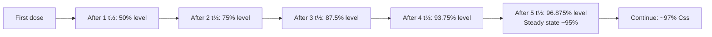
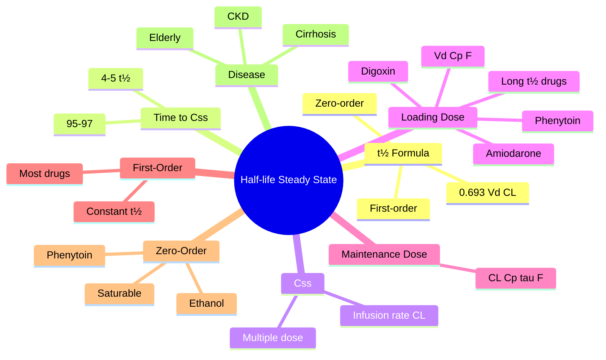

# Pharmacokinetics — Half-life & Steady State

> [!info]
> **Disease-Level Topic** under **Principles of Clinical Pharmacology → Pharmacokinetics**.
> Davidson 24e Ch2 (Maxwell) — "Half-life, steady state, time to plateau".

## 1. Learning Objectives
- [ ] Define **half-life (t½)** and its calculation
- [ ] Calculate **time to steady state** (4-5 × t½)
- [ ] Explain the relationship: t½ = 0.693 × Vd / CL
- [ ] Differentiate **first-order** vs **zero-order** kinetics
- [ ] Apply concepts to **drug accumulation** and **loading dose**
- [ ] Recognise when **t½ is altered** (renal/hepatic disease, age)
- [ ] Calculate **Css** for IV infusion (Css = infusion rate / CL)

## 2. Core Concepts

| Term | Definition |
|------|-----------|
| **Half-life (t½)** | Time for plasma concentration to decrease by 50% |
| **t½ formula** | t½ = 0.693 × Vd / CL (or 0.693 / kel) |
| **First-order kinetics** | Constant fraction eliminated per unit time (most drugs) |
| **Zero-order kinetics** | Constant amount eliminated per unit time (saturable) |
| **Steady state (Css)** | Rate in = Rate out (constant plasma level) |
| **Time to steady state** | 4-5 × t½ (~95% of plateau) |
| **Css for infusion** | Css = Rate of infusion / CL |
| **Css for multiple dosing** | Css(avg) = F × Dose / (CL × τ) |
| **Peak (Cmax)** | Highest level in dosing interval |
| **Trough (Cmin)** | Lowest level in dosing interval (just before next dose) |
| **Fluctuation** | (Cmax - Cmin) / Css(avg) |
| **Accumulation** | Drug builds up with repeated dosing (if t½ >> dosing interval) |
| **Loading dose** | Initial dose to achieve target quickly (for long t½ drugs) |
| **AUC (single dose)** | F × Dose / CL |

## 3. Mermaid Algorithm — Time to Steady State

## 4. Comparison Tables

### 4.1 First-Order vs Zero-Order Kinetics

| Feature | First-Order | Zero-Order |
|---------|-------------|------------|
| **Definition** | Constant fraction eliminated per unit time | Constant amount eliminated per unit time |
| **Rate** | Proportional to concentration | Independent of concentration |
| **t½** | Constant (at any concentration) | Variable (increases at higher concentrations) |
| **AUC** | Proportional to dose | Disproportionate (saturable) |
| **Examples** | Most drugs (penicillin, gentamicin, digoxin) | Phenytoin, ethanol, high-dose salicylates, theophylline (toxic levels) |
| **Implication** | Predictable; linear | Small dose change = large level change |
| **Plot** | Exponential decay (log-linear) | Linear decay (zero slope) |

### 4.2 Time to Steady State by Half-Lives

| Number of t½ | % of Steady State |
|---------------|-------------------|
| 1 | 50% |
| 2 | 75% |
| 3 | 87.5% |
| 4 | 93.75% |
| 5 | 96.875% (≈ 97%) |
| 6 | 98.4% |
| 7 | 99.2% |

**Clinical rule: 4-5 × t½ to reach steady state.**

### 4.3 Drug Half-Lives (Representative)

| Drug | t½ | Implication |
|------|-----|-------------|
| **Adrenaline (epinephrine)** | <1 min | Single bolus, continuous infusion |
| **Nitroglycerin (GTN) IV** | 1-4 min | Continuous infusion |
| **Dopamine** | 1-2 min | Continuous infusion |
| **Furosemide IV** | 30-60 min | Dose 6-12 h |
| **Paracetamol** | 2-3 h | QDS dosing |
| **Gentamicin** | 2-3 h (normal) | OD/extended interval |
| **Theophylline** | 6-12 h | BD or modified release |
| **Digoxin** | 36-48 h (normal) | OD dosing; loading needed |
| **Warfarin** | 36-72 h | OD; full effect 4-5 days |
| **Phenytoin** | 12-36 h (variable, dose-dependent) | OD; non-linear kinetics |
| **Amiodarone** | 50-100 d (terminal) | Loading needed |
| **Chloroquine** | 1-2 months | Tissue accumulation |

### 4.4 Altered t½ in Disease

| Condition | Effect on t½ | Drugs Affected |
|-----------|--------------|----------------|
| **Renal failure** | ↑ t½ (↓ CL) | Aminoglycosides, digoxin, lithium, vancomycin |
| **Hepatic failure** | ↑ t½ (↓ CL) | Morphine, midazolam, propranolol |
| **CKD + ↑ Vd** | ↑ t½ | Aminoglycosides (in critical illness) |
| **Elderly** | ↑ t½ (↓ CL, ↑ Vd for lipophilic) | Diazepam, warfarin, lithium |
| **Obesity (lipophilic)** | ↑ t½ (↑ Vd) | Diazepam, amiodarone |
| **Burns** | ↑ t½ (↑ Vd) | Aminoglycosides |
| **Heart failure** | ↓ CL (↓ hepatic flow) | Lidocaine, propranolol |
| **Hypothyroid** | ↓ CL (↑ t½) | Multiple |
| **Hyperthyroid** | ↑ CL (↓ t½) | Multiple |

## 5. FCPS/MRCP High-Yield Summary

| Pearl | Detail |
|-------|--------|
| t½ formula | t½ = 0.693 × Vd / CL |
| Time to steady state | 4-5 × t½ (~95%) |
| Css (IV infusion) | Css = infusion rate / CL |
| Css (multiple dosing) | Css(avg) = F × Dose / (CL × τ) |
| Loading dose | LD = Vd × Ctarget / F (independent of CL) |
| Maintenance dose | MD = CL × Css(avg) × τ / F |
| First-order | Most drugs; constant t½ |
| Zero-order | Phenytoin, ethanol, salicylate (high dose), theophylline (toxic) |
| Phenytoin | Saturable kinetics; small dose change = big level change |
| Digoxin t½ | 36-48 h; needs loading dose |
| Amiodarone t½ | 50-100 d (terminal); needs loading |
| Warfarin t½ | 36-72 h; takes 4-5 days to reach full effect |
| Css in 4-5 t½ | 95-97% of plateau |
| Loading dose for | Long t½ drugs (digoxin, amiodarone, phenytoin, vancomycin, teicoplanin) |
| t½ alteration | Renal failure (aminoglycosides), hepatic failure (morphine), elderly (diazepam) |
| Therapeutic drug monitoring timing | Trough level just before next dose (after 4-5 t½ to steady state) |
| Heparin t½ | 1-2 h (dose-dependent) |
| LMWH t½ | 4-5 h (longer than UFH) |
| Insulin t½ | 5-6 min IV; prolonged by binding to antibodies in NPH |
| t½ extension (formulation) | Modified release, depot injections (fluphenazine decanoate, leuprolide) |
| Bilirubin vs albumin | Bilirubin t½ ~18 d in neonates; albumin t½ ~20 d |
| One-compartment model | Most drugs: single compartment (plasma + tissue) |
| Two-compartment model | Some drugs: biphasic decline (e.g., gentamicin distribution phase + elimination phase) |

## 6. Viva Questions (10)

1. **Define half-life (t½).**
   *Time for plasma concentration to decrease by 50% (during elimination phase). t½ = 0.693 × Vd / CL. Independent of dose in first-order kinetics.*

2. **How long does it take to reach steady state?**
   *4-5 half-lives (~95-97% of plateau). For most drugs, this is 3-7 days. For digoxin, ~7-10 days. For warfarin, ~4-5 days.*

3. **What is the loading dose formula?**
   *LD = Vd × Ctarget / F. Used to rapidly achieve therapeutic level. Independent of clearance; useful for long t½ drugs (digoxin, amiodarone, phenytoin, vancomycin, teicoplanin).*

4. **Why does warfarin take 4-5 days to reach full effect?**
   *Warfarin t½ is 36-72 hours, but the EFFECT is delayed because warfarin inhibits synthesis of vitamin K-dependent clotting factors (II, VII, IX, X, protein C, S). Factor II (prothrombin) has the longest t½ (~60 h). The PT/INR reflects the sum effect of all clotting factors; maximum INR achieved when all factors are depleted (4-5 days). Initial decline in factor VII (t½ 6 h) causes early INR rise but doesn't reflect full anticoagulation.*

5. **What is the Css for an IV infusion?**
   *Css = Rate of infusion / CL. E.g., for a drug with CL 5 L/h and infusion at 50 mg/h, Css = 50/5 = 10 mg/L.*

6. **Why is phenytoin kinetics different from other drugs?**
   *Phenytoin metabolism is saturable (zero-order) at therapeutic doses. CYP2C9 becomes saturated; small dose increases cause disproportionate plasma level increases. Risk of toxicity with minor dose escalation.*

7. **A patient on gentamicin (CrCl 30) needs dose adjustment. What happens to t½?**
   *↓ CrCl → ↓ gentamicin clearance → ↑ t½ (t½ = 0.693 × Vd / CL). Same dose gives higher trough. Either reduce dose or extend interval (Hartford: 5-7 mg/kg every 24-48 h).*

8. **A patient on digoxin loading 1 mg IV, then 250 µg/day. Why loading?**
   *Digoxin t½ ~36-48 h. Without loading, would take 7-10 days to reach steady state. Loading dose (1 mg in divided doses 6-12 h apart) achieves therapeutic level rapidly. Maintenance then balances daily elimination.*

9. **What is the difference between first-order and zero-order kinetics?**
   *First-order: constant fraction eliminated per unit time (t½ constant). Zero-order: constant amount eliminated per unit time (saturable enzyme). Zero-order examples: phenytoin, ethanol, high-dose salicylate.*

10. **How does obesity affect t½ for lipophilic drugs?**
    *Lipophilic drugs (e.g., diazepam, amiodarone) accumulate in adipose tissue → ↑ Vd → ↑ t½ (t½ = 0.693 × Vd / CL). Duration of action prolonged. Dose adjustment may be needed.*

## 7. Confusions & Mnemonics

| Confusion | Resolution |
|-----------|------------|
| Steady state vs therapeutic level | Steady state = balance of in/out; therapeutic level = clinical effect |
| 4-5 t½ to steady state | 95-97% of plateau |
| Loading dose purpose | Skip the "wait" for long t½ drugs |
| Loading dose affected by | Vd, Cp, F (NOT CL) |
| Maintenance dose affected by | CL, Css, F, τ (NOT Vd) |
| First-order t½ | Constant (any concentration) |
| Zero-order t½ | Increases at higher concentration (saturable) |
| Phenytoin kinetics | Zero-order at therapeutic doses (saturable CYP2C9) |
| Warfarin delay | Factor synthesis inhibition; t½ of factor II = 60 h |
| Digoxin onset | Loading dose achieves effect in hours; otherwise 4-5 days |
| Amiodarone terminal t½ | 50-100 d (extremely long); effects persist months after stopping |
| Gentamicin t½ | 2-3 h normal; extended interval (Hartford: 24-48 h) |
| TDM timing | Trough (just before next dose); AFTER 4-5 t½ |
| Vd change | ↑ Vd → ↑ t½; ↓ Vd → ↓ t½ |
| CL change | ↑ CL → ↓ t½; ↓ CL → ↑ t½ |
| Half-life terminology | "Elimination t½" is the standard (during log-linear phase) |
| Distribution t½ | Initial rapid decline (e.g., gentamicin distribution phase) |

**Mnemonic — Time to steady state: "**4-5** t½ for **95-97%**"** (4-5 × t½)

**Mnemonic — Loading dose formula: "**L**oading = **V**d × **C**p / **F**"** (VdCp/F)

**Mnemonic — Maintenance dose formula: "**M**aintenance = **C**L × **C**p × **τ** / **F**"** (CL × Cp × τ / F)

**Mnemonic — Phenytoin kinetics: "**P**henytoin **P**lates at high dose"** (zero-order, saturable)

**Mnemonic — t½ in disease: "**Renal CL ↓ → t½ ↑; Hepatic CL ↓ → t½ ↑; Vd ↑ → t½ ↑"** (RHV ↑ → t½ ↑)

**Mnemonic — Warfarin delay: "**F**actor **II** has **t½ 60 h**"** (longest clotting factor t½)

**Mnemonic — Amiodarone t½: "**A**miodarone **A**ccumulates for **100 d**ays"** (terminal t½ 50-100 d)

## 8. Mermaid Mind Map

## 9. Spaced Repetition Tracker

| Topic | Day 1 | Day 3 | Day 7 | Day 14 | Day 30 |
|-------|-------|-------|-------|-------|--------|
| t½ definition | ☐ | ☐ | ☐ | ☐ | ☐ |
| t½ formula | ☐ | ☐ | ☐ | ☐ | ☐ |
| 4-5 t½ to Css | ☐ | ☐ | ☐ | ☐ | ☐ |
| Css (infusion) | ☐ | ☐ | ☐ | ☐ | ☐ |
| Loading dose | ☐ | ☐ | ☐ | ☐ | ☐ |
| First vs zero order | ☐ | ☐ | ☐ | ☐ | ☐ |
| Warfarin delay | ☐ | ☐ | ☐ | ☐ | ☐ |
| Digoxin loading | ☐ | ☐ | ☐ | ☐ | ☐ |

## 10. Self-Test Scorecard

| Domain | Score (0-5) |
|--------|-------------|
| t½ formula | /5 |
| Time to Css | /5 |
| Loading dose | /5 |
| First vs zero order | /5 |
| Css calculations | /5 |
| Disease effects | /5 |
| **TOTAL** | **/30** |

## 11. MCQs (10)

1. **Half-life (t½) is calculated as:**
   A. t½ = Vd / CL
   B. t½ = 0.693 × Vd / CL ✓
   C. t½ = 0.5 × Vd / CL
   D. t½ = Vd × CL
   E. t½ = 0.693 × CL / Vd

2. **Time to reach steady state is approximately:**
   A. 1-2 t½
   B. 2-3 t½
   C. 4-5 t½ (95-97%) ✓
   D. 7-10 t½
   E. 10-12 t½

3. **Steady state Css for an IV infusion is:**
   A. Css = CL / Rate
   B. Css = Rate / CL ✓
   C. Css = Vd × Rate
   D. Css = Rate × t½
   E. Css = 0.693 / Rate

4. **Loading dose is needed for drugs with:**
   A. Short t½
   B. Long t½ (e.g., digoxin, amiodarone) ✓
   C. High clearance
   D. Low Vd
   E. High first-pass

5. **Phenytoin exhibits:**
   A. First-order kinetics only
   B. Zero-order kinetics at therapeutic doses (saturable) ✓
   C. Mixed-order
   D. Linear kinetics
   E. Constant absorption

6. **Warfarin reaches full effect in:**
   A. 12-24 h
   B. 1-2 days
   C. 4-5 days ✓
   D. 2 weeks
   E. 1 month

7. **Aminoglycoside t½ in renal failure is:**
   A. Decreased
   B. Increased ✓
   C. Unchanged
   D. Doubled then normalised
   E. Unpredictable

8. **Digoxin t½ (normal) is approximately:**
   A. 2-4 h
   B. 12-24 h
   C. 36-48 h ✓
   D. 5-7 d
   E. 30 d

9. **Amiodarone terminal t½ is approximately:**
   A. 1-2 d
   B. 7-14 d
   C. 30-60 d
   D. 50-100 d ✓
   E. 1 year

10. **The t½ of a drug depends on:**
    A. Vd only
    B. CL only
    C. Both Vd and CL ✓
    D. Dose
    E. Route of administration

## 12. SBAs (5)

1. **A patient is started on digoxin 250 µg/day without loading. Therapeutic level achieved in approximately:**
   - A) 12 h
   - B) 1-2 days
   - C) 7-10 days (4-5 × 36-48 h) ✓
   - D) 4 weeks
   - E) 2 months

2. **A 70 kg patient needs an IV infusion of a drug with CL 5 L/h to achieve Css 10 mg/L. Infusion rate = ?**
   - A) 10 mg/h
   - B) 25 mg/h
   - C) 50 mg/h ✓
   - D) 100 mg/h
   - E) 5 mg/h

3. **A patient on phenytoin 300 mg/day has level 18 mg/L. Dose increased to 350 mg/day. Level rises to 35 mg/L. Explanation:**
   - A) Non-compliance
   - B) Zero-order (saturable) kinetics at therapeutic doses ✓
   - C) Drug interaction
   - D) Renal failure
   - E) Lab error

4. **A patient on warfarin 5 mg/day has INR 1.5 after 1 week. Best action:**
   - A) Stop warfarin
   - B) Wait 4-5 days for full effect; recheck INR ✓
   - C) Double the dose immediately
   - D) Add LMWH
   - E) Switch to DOAC

5. **Aminoglycoside t½ in a patient with CrCl 30 is approximately:**
   - A) 2 h
   - B) 4 h
   - C) 8-12 h (extended) ✓
   - D) 24-48 h
   - E) Unchanged

## 13. Answer Key

### MCQ Answers
1. **B** (t½ = 0.693 × Vd / CL)
2. **C** (4-5 t½ = 95-97%)
3. **B** (Css = Rate/CL)
4. **B** (Long t½ drugs)
5. **B** (Phenytoin = zero-order)
6. **C** (4-5 days for full effect)
7. **B** (↑ t½ in CKD)
8. **C** (Digoxin t½ 36-48 h)
9. **D** (Amiodarone 50-100 d)
10. **C** (Both Vd and CL)

### SBA Answers
1. **C** — 4-5 × 36-48 h = 7-10 days to steady state.
2. **C** — Css = Rate/CL → 10 × 5 = 50 mg/h.
3. **B** — Phenytoin zero-order kinetics; saturable CYP2C9.
4. **B** — Warfarin effect delayed 4-5 days (factor II t½).
5. **C** — Reduced CL → ↑ t½; with CrCl 30, gentamicin t½ 8-12 h.

## 14. Summary Box

> **t½ = 0.693 × Vd / CL.** Time to **steady state = 4-5 × t½ (95-97%)**. **Css (infusion) = Rate/CL.** **Loading dose = Vd × Cp/F** (independent of CL). **Maintenance dose = CL × Css × τ/F.** **First-order** = most drugs (constant t½). **Zero-order** = phenytoin, ethanol, salicylate (saturable). **Long t½ drugs needing loading:** digoxin (36-48 h), amiodarone (50-100 d), phenytoin, vancomycin, teicoplanin. **Warfarin delay** = factor II t½ 60 h. **t½ alteration:** CKD ↑ t½ (aminoglycosides), cirrhosis ↑ t½ (morphine), elderly ↑ t½ (diazepam).

---

## Cross-Links
- **Parent Heading**: [[../../Principles of Clinical Pharmacology|Principles of Clinical Pharmacology]]
- **Sibling Topics**: [[Routes of Administration]], [[Absorption and Bioavailability]], [[Distribution and Protein Binding]], [[Metabolism and Biotransformation]], [[Excretion and Clearance]], [[Kinetics and Dosing]]
- **Chapter MOC**: [[Clinical Therapeutics and Good Prescribing MOC]]
- **Related**: [[TDM/Digoxin]], [[TDM/Phenytoin]], [[TDM/Aminoglycosides]]

**Last Updated:** 2026-06-15  
**Status: FULLY COMPLETE with Exam Suite (Viva 10, MCQ 10, SBA 5, Answer Key, Confusions, Mind Map, Spaced Repetition, Self-Test, Exam Modes)**
