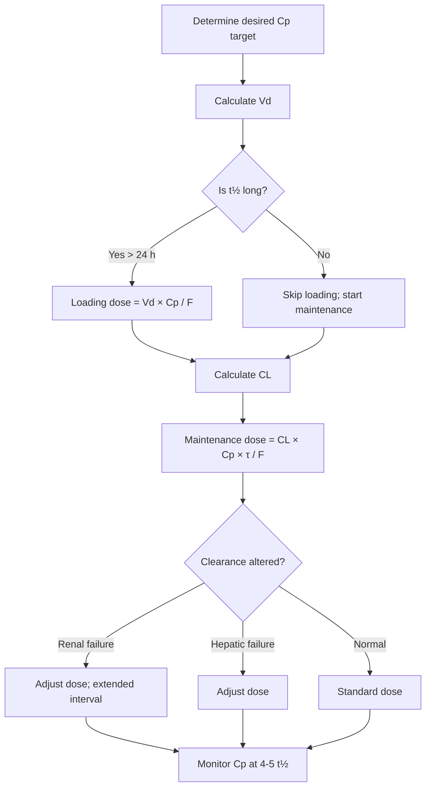
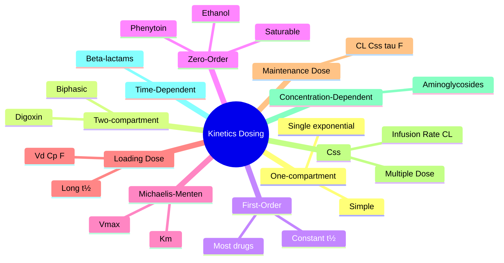

# Pharmacokinetics — Kinetics, Dosing & Models

> [!info]
> **Disease-Level Topic** under **Principles of Clinical Pharmacology → Pharmacokinetics**.
> Davidson 24e Ch2 (Maxwell) — "Pharmacokinetic models" + "Dosing".

## 1. Learning Objectives
- [ ] Differentiate **one-compartment, two-compartment, non-compartmental** models
- [ ] Apply **first-order** and **zero-order** kinetics
- [ ] Calculate **loading dose (LD)** and **maintenance dose (MD)**
- [ ] Recognise **Michaelis-Menten** kinetics for saturable drugs
- [ ] Understand **non-linear pharmacokinetics** (phenytoin)
- [ ] Apply **accumulation index** for repeated dosing
- [ ] Recognise **flip-flop kinetics** (e.g., depot IM)

## 2. Core Concepts

| Term | Definition |
|------|-----------|
| **One-compartment model** | Drug distributes rapidly and uniformly in body (single exponential decline) |
| **Two-compartment model** | Drug has initial distribution phase (t½α) and elimination phase (t½β) |
| **Three-compartment model** | Deep compartment (e.g., fat for thiopental) |
| **Elimination rate constant (ke)** | Fraction of drug eliminated per unit time |
| **t½ = 0.693 / ke** | Half-life relationship |
| **First-order kinetics** | Rate of elimination proportional to Cp; constant t½ |
| **Zero-order kinetics** | Constant rate of elimination; variable t½ |
| **Michaelis-Menten kinetics** | Saturable metabolism; Vmax, Km |
| **Non-linear PK** | Dose changes cause disproportionate Cp changes |
| **Accumulation factor** | 1 / (1 - e^(-ke × τ)) |
| **Flip-flop kinetics** | Absorption slower than elimination; t½ reflects absorption (e.g., depot IM) |
| **Bioavailability (F)** | Fraction reaching systemic |
| **Vmax** | Maximum rate of metabolism (mg/h) |
| **Km** | Concentration at half-Vmax |

## 3. Mermaid Algorithm — Dosing Decision Tree

## 4. Comparison Tables

### 4.1 One-Compartment vs Two-Compartment Models

| Feature | One-Compartment | Two-Compartment |
|---------|-----------------|-----------------|
| **Distribution** | Rapid, uniform | Slow distribution (initially in central, then peripheral) |
| **Plasma decay** | Single exponential (monoexponential) | Biphasic (initial rapid α-phase, slow β-phase) |
| **Calculations** | Simple (Vd, CL, t½) | Need separate Vd(central), Vd(peripheral) |
| **Examples** | Theophylline, gentamicin (approximately), paracetamol | Digoxin, lignocaine, gentamicin (precisely), vancomycin |
| **Sample timing** | Random; trough sufficient | Trough + peak for distribution effect |
| **Clinical relevance** | Most clinical situations | Initial distribution matters for loading |

### 4.2 Linear (First-Order) vs Non-Linear (Zero-Order/Michaelis-Menten) Kinetics

| Feature | Linear (First-Order) | Non-Linear (Zero-Order) |
|---------|----------------------|--------------------------|
| **Rate vs Cp** | Proportional | Saturable (Michaelis-Menten) |
| **t½** | Constant | Variable (↑ with ↑ Cp) |
| **AUC vs dose** | Linear (proportional) | Disproportionate |
| **Steady state** | Predictable from single dose | Unpredictable; small dose change = big Cp change |
| **Examples** | Most drugs | Phenytoin, ethanol, salicylate (high dose), methotrexate (high dose) |
| **Clinical management** | Standard dosing | Cautious titration, level monitoring |
| **Cp with dose ↑** | Predictable ↑ | Disproportionate ↑ (risk of toxicity) |

### 4.3 Dosing Formulas

| Parameter | Formula | Depends On |
|-----------|---------|-----------|
| **Loading dose (LD)** | LD = Vd × Ctarget / F | Vd, target Cp, F |
| **Maintenance dose (MD)** | MD = CL × Css(avg) × τ / F | CL, target Cp, τ, F |
| **Css (IV infusion)** | Css = Rate / CL | Infusion rate, CL |
| **Css (multiple dose, avg)** | Css(avg) = F × Dose / (CL × τ) | F, Dose, CL, τ |
| **AUC** | F × Dose / CL (single oral/IV) | F, Dose, CL |
| **Accumulation factor (R)** | 1 / (1 - e^(-ke × τ)) | ke, τ |
| **Time to steady state** | 4-5 × t½ | t½ |
| **Fraction remaining** | (1/2)^n (n = number of t½) | t½ |

### 4.4 Michaelis-Menten Kinetics

**Rate of metabolism = (Vmax × Cp) / (Km + Cp)**

| Parameter | Definition | Clinical Use |
|-----------|-----------|---------------|
| **Vmax** | Maximum rate of metabolism | Capacity of enzyme system |
| **Km** | Cp at ½ Vmax | Affinity (low Km = high affinity) |
| **Linear region** | Cp << Km | First-order (most drugs at therapeutic levels) |
| **Saturable region** | Cp ≥ Km | Zero-order (phenytoin, ethanol) |
| **At Cp = Km** | Half-maximal metabolism | Inflection point |

**Phenytoin dosing:** Start 200-300 mg/day, titrate by 25-50 mg. Small dose changes (25 mg) can cause large Cp changes (especially at higher Cp). Therapeutic range 10-20 mg/L (total), 1-2 mg/L (free).

### 4.5 Dosing Interval Considerations

| Goal | Strategy | Examples |
|------|----------|----------|
| **Maintain Css within range** | Dose = CL × Css × τ / F | Most drugs |
| **Reduce peak (toxicity)** | More frequent, smaller doses | Aminoglycosides (extended interval inverts this) |
| **Increase trough** | Less frequent, larger doses OR add loading | Penicillins, cephalosporins (time-dependent) |
| **AUC-targeted** | Total daily dose matters | Vancomycin (AUC-guided), aminoglycosides |
| **Peak-dependent killing** | Large dose, longer interval (extended) | Aminoglycosides (concentration-dependent killing) |
| **Time-dependent killing** | Maintain concentration > MIC | β-lactams, vancomycin |

### 4.6 Therapeutic Drug Monitoring (TDM) Considerations

| Drug | Target Level | Timing | Loading? |
|------|-------------|--------|----------|
| **Gentamicin (extended)** | Peak 15-20 mg/L; trough <1 mg/L | Pre-dose (trough) | Yes for severe sepsis |
| **Vancomycin** | AUC 400-600 mg·h/L (preferred) OR trough 10-15 mg/L | Trough (pre-4th dose) | Yes for severe sepsis |
| **Teicoplanin** | Trough 15-30 mg/L (severe) | Trough | Yes (3 loading doses) |
| **Amikacin** | Peak 25-30 mg/L; trough <5 mg/L | Trough | Yes |
| **Digoxin** | 0.5-0.9 ng/mL (HF); 0.8-2.0 (AF) | ≥6 h post-dose (8-12 h ideal) | Yes for urgent |
| **Lithium** | 0.6-1.0 mmol/L (chronic); 0.8-1.2 (acute) | Trough (12 h post-dose) | No |
| **Theophylline** | 10-20 mg/L | Trough | No |
| **Phenytoin** | 10-20 mg/L (total); 1-2 mg/L (free) | Trough | Yes (load 15-20 mg/kg IV) |
| **Carbamazepine** | 4-12 mg/L | Trough | No |
| **Valproate** | 50-100 mg/L | Trough | No |
| **Phenobarbital** | 15-40 mg/L | Trough | No |
| **Cyclosporin** | Variable (transplant-specific) | Trough (C0) or 2 h post (C2) | No |
| **Tacrolimus** | 5-15 ng/mL (transplant) | Trough | No |
| **Sirolimus** | 5-15 ng/mL | Trough | No |
| **Everolimus** | 3-8 ng/mL | Trough | No |
| **Methotrexate (high-dose)** | <0.05 µmol/L at 48 h | Variable | Leucovorin rescue |
| **Ciclosporin** | Variable | Trough | No |

## 5. FCPS/MRCP High-Yield Summary

| Pearl | Detail |
|-------|--------|
| LD = Vd × Cp / F | Independent of CL; for long t½ drugs |
| MD = CL × Css × τ / F | Depends on CL; for steady state |
| Css infusion = Rate / CL | Direct relationship |
| Css multiple dose = F × Dose / (CL × τ) | Average level |
| One-compartment | Most drugs; simple model |
| Two-compartment | Biphasic decline; initial distribution phase |
| First-order | Constant t½; most drugs |
| Zero-order | Saturable; phenytoin, ethanol, salicylate (high) |
| Michaelis-Menten | Rate = Vmax × Cp / (Km + Cp) |
| Phenytoin | Zero-order at therapeutic doses; small dose change = big level change |
| Vmax | Maximum metabolism rate |
| Km | Cp at ½ Vmax |
| Non-linear PK | Dose change ≠ proportional Cp change |
| Time to Css | 4-5 × t½ |
| Accumulation factor | 1 / (1 - e^(-ke × τ)) |
| Flip-flop kinetics | Absorption < elimination; t½ = absorption (e.g., depot) |
| Peak-dependent killing | Aminoglycosides (concentration-dependent) |
| Time-dependent killing | β-lactams, vancomycin |
| AUC-targeted dosing | Vancomycin, aminoglycosides (replaced trough-only) |
| Two-compartment example | Digoxin: initial distribution to muscle |
| Trough sampling | Pre-next-dose; AFTER 4-5 t½ (steady state) |
| Free level needed | Phenytoin, valproate in hypoalbuminaemia |

## 6. Viva Questions (10)

1. **State the loading and maintenance dose formulas.**
   *LD = Vd × Ctarget / F. MD = CL × Css(avg) × τ / F.*

2. **What is Michaelis-Menten kinetics?**
   *Saturation kinetics. Rate = (Vmax × Cp) / (Km + Cp). When Cp << Km, first-order (linear). When Cp >> Km, zero-order (saturable). Examples: phenytoin, ethanol, salicylate.*

3. **Why is phenytoin dosing different from most drugs?**
   *Phenytoin is zero-order at therapeutic doses. Small dose increases (25 mg) cause disproportionate Cp increases. Risk of toxicity with minor dose changes. TDM essential.*

4. **Differentiate one-compartment and two-compartment models.**
   *One-compartment: single exponential decline (rapid uniform distribution). Two-compartment: biphasic decline (initial rapid distribution phase α, then slower elimination phase β).*

5. **What is the accumulation factor?**
   *Ratio of Css to single-dose Cp. R = 1 / (1 - e^(-ke × τ)). If τ is short relative to t½, drug accumulates significantly. E.g., τ = t½ → R = 2.*

6. **A patient is started on digoxin 250 µg/day. When should a level be taken?**
   *After 4-5 t½ (7-10 days) to reach steady state. Sample ≥6 h post-dose (8-12 h ideal) to avoid falsely elevated levels from ongoing distribution. Target: 0.5-0.9 ng/mL (HF) or 0.8-2.0 (AF).*

7. **What is the difference between concentration-dependent and time-dependent killing?**
   *Concentration-dependent (Aminoglycosides): Higher peak = better killing; once-daily dosing; AUC/MIC and Peak/MIC predict efficacy. Time-dependent (β-lactams, vancomycin): Maintain Cp > MIC; multiple daily doses or continuous infusion.*

8. **A patient on vancomycin needs level checked. When and what target?**
   *Trough level just before the 4th dose (i.e., after ~3 days = 3-4 t½). Trough target: 10-15 mg/L (standard); 15-20 (severe sepsis, endocarditis, osteomyelitis, MRSA pneumonia). Newer guidance: AUC-guided (400-600 mg·h/L) preferred.*

9. **What is flip-flop kinetics?**
   *When absorption rate is slower than elimination rate, the apparent t½ reflects the absorption t½, not elimination. Seen with depot IM injections (e.g., fluphenazine decanoate) and some sustained-release formulations. Drug appears to have long t½ but actually it's slow absorption.*

10. **A patient is on phenytoin 300 mg/day with level 12 mg/L. You increase to 350 mg/day. New level = 25 mg/L (toxic). What's happening?**
    *Phenytoin follows zero-order kinetics at therapeutic doses (saturable CYP2C9). 50 mg dose increase caused disproportionate level rise. Should be reduced back to 300 mg (or less) and re-titrated slowly in 25-30 mg increments.*

## 7. Confusions & Mnemonics

| Confusion | Resolution |
|-----------|------------|
| LD vs MD | LD for rapid target; MD for steady state |
| LD formula | Vd × Cp / F |
| MD formula | CL × Css × τ / F |
| Css (infusion) | Rate / CL |
| Css (multiple dose) | F × Dose / (CL × τ) |
| First vs zero order | First: constant t½; Zero: variable t½ |
| Vmax | Max metabolism rate |
| Km | Cp at ½ Vmax |
| Cp << Km | First-order (linear) |
| Cp >> Km | Zero-order (saturable) |
| Phenytoin kinetics | Zero-order at therapeutic doses |
| One vs two compartment | One: single exponential; Two: biphasic |
| Two-compartment drugs | Digoxin, lidocaine, vancomycin |
| Flip-flop | Absorption slower than elimination (e.g., depot) |
| Concentration-dependent | Aminoglycosides, daptomycin, fluoroquinolones |
| Time-dependent | β-lactams, vancomycin, linezolid, macrolides |
| Trough timing | Pre-4th dose (after 4-5 t½) |
| AUC-guided | Vancomycin (preferred) |
| Level timing | ≥6 h post-dose for digoxin (8-12 h ideal) |
| Free level | Phenytoin, valproate (saturable binding) |

**Mnemonic — LD formula: "**L**oading = **L**iquid for **V**d × **C**p / **F**"**

**Mnemonic — MD formula: "**M**aintenance = **M**any **C**Ls × **C**p × **τ** / **F**"**

**Mnemonic — Time to Css: "**4-5** × t½"**

**Mnemonic — Phenytoin: "**P**henytoin is **P**icky at high dose"** (zero-order)

**Mnemonic — Kill mechanism: "**A**minoglycosides = **A**ll about **P**eak (concentration-dependent); **B**eta-lactams = **B**elow **M**IC kills (time-dependent)"**

## 8. Mermaid Mind Map

## 9. Spaced Repetition Tracker

| Topic | Day 1 | Day 3 | Day 7 | Day 14 | Day 30 |
|-------|-------|-------|-------|-------|--------|
| LD/MD formula | ☐ | ☐ | ☐ | ☐ | ☐ |
| Css | ☐ | ☐ | ☐ | ☐ | ☐ |
| One/two compartment | ☐ | ☐ | ☐ | ☐ | ☐ |
| First/zero order | ☐ | ☐ | ☐ | ☐ | ☐ |
| Michaelis-Menten | ☐ | ☐ | ☐ | ☐ | ☐ |
| Phenytoin | ☐ | ☐ | ☐ | ☐ | ☐ |

## 10. Self-Test Scorecard

| Domain | Score (0-5) |
|--------|-------------|
| LD/MD | /5 |
| Css | /5 |
| One/two compartment | /5 |
| First/zero order | /5 |
| Michaelis-Menten | /5 |
| **TOTAL** | **/25** |

## 11. MCQs (10)

1. **Loading dose (LD) formula:**
   A. CL × Cp × τ / F
   B. Vd × Cp / F ✓
   C. CL × Cp / F
   D. Vd × Cp × τ
   E. CL × τ / F

2. **Maintenance dose (MD) formula:**
   A. Vd × Cp / F
   B. CL × Css × τ / F ✓
   C. Rate / CL
   D. F × Dose / CL
   E. Vd × CL

3. **For IV infusion, Css = ?**
   A. Css = Rate / CL ✓
   B. Css = CL / Rate
   C. Css = Vd × Cp
   D. Css = F × Dose
   E. Css = t½ × CL

4. **Phenytoin kinetics at therapeutic doses:**
   A. First-order
   B. Zero-order (saturable) ✓
   C. Mixed
   D. Linear
   E. Constant absorption

5. **Michaelis-Menten: Vmax is:**
   A. Concentration at half-maximal metabolism
   B. Maximum rate of metabolism ✓
   C. Volume of distribution
   D. Half-life
   E. Clearance

6. **Km is:**
   A. Maximum metabolism rate
   B. Concentration at half-Vmax ✓
   C. Half-life
   D. Dose
   E. Vd

7. **Concentration-dependent killing is seen with:**
   A. β-lactams
   B. Aminoglycosides ✓
   C. Vancomycin
   D. Macrolides
   E. Tetracyclines

8. **Time-dependent killing is seen with:**
   A. Aminoglycosides
   B. β-lactams ✓
   C. Fluoroquinolones
   D. Daptomycin
   E. Metronidazole

9. **A drug has t½ 24 h, dosed OD. Time to steady state:**
   A. 12 h
   B. 24 h
   C. 4-5 days (4-5 × 24 h) ✓
   D. 1 month
   E. 2 weeks

10. **Two-compartment model drugs include:**
    A. Paracetamol
    B. Theophylline
    C. Digoxin ✓
    D. Atenolol
    E. Methotrexate

## 12. SBAs (5)

1. **A drug has Vd 10 L, target Cp 5 mg/L, F 0.5. Loading dose = ?**
   - A) 25 mg
   - B) 50 mg
   - C) 100 mg ✓
   - D) 200 mg
   - E) 500 mg

2. **A patient on phenytoin 200 mg has level 8 mg/L. Increased to 250 mg. New level 18 mg/L. Best explanation:**
   - A) Drug interaction
   - B) Zero-order (saturable) kinetics ✓
   - C) First-order kinetics
   - D) Compliance
   - E) Renal failure

3. **Vancomycin trough level timing:**
   - A) Pre-1st dose
   - B) Pre-2nd dose
   - C) Pre-4th dose (after ~3 days) ✓
   - D) Anytime
   - E) 1 h post-dose

4. **Gentamicin OD dosing (extended interval) rationale:**
   - A) Time-dependent killing
   - B) Concentration-dependent killing + post-antibiotic effect ✓
   - C) Reduced cost
   - D) Reduced toxicity
   - E) Patient preference

5. **A drug has t½ 48 h. Time to reach 96% of steady state:**
   - A) 24 h
   - B) 48 h
   - C) 96 h
   - D) ~8 days (4-5 × 48 h) ✓
   - E) 16 days

## 13. Answer Key

### MCQ Answers
1. **B** (LD = Vd × Cp / F)
2. **B** (MD = CL × Css × τ / F)
3. **A** (Css = Rate/CL)
4. **B** (Phenytoin = zero-order)
5. **B** (Vmax = max metabolism)
6. **B** (Km = Cp at ½ Vmax)
7. **B** (Aminoglycosides = conc-dependent)
8. **B** (β-lactams = time-dependent)
9. **C** (4-5 days for t½ 24 h)
10. **C** (Digoxin = two-compartment)

### SBA Answers
1. **C** — LD = 10 × 5 / 0.5 = 100 mg.
2. **B** — Phenytoin zero-order at therapeutic doses.
3. **C** — Pre-4th dose for steady state.
4. **B** — Aminoglycosides concentration-dependent + post-antibiotic effect.
5. **D** — 4-5 × 48 h = 192-240 h = 8-10 days.

## 14. Summary Box

> **LD = Vd × Cp / F (independent of CL).** **MD = CL × Css × τ / F.** **Css (infusion) = Rate/CL.** **One-compartment** = single exponential. **Two-compartment** = biphasic (digoxin, lidocaine, vancomycin). **First-order** = constant t½. **Zero-order** = saturable (phenytoin, ethanol, salicylate). **Michaelis-Menten: Rate = Vmax × Cp / (Km + Cp).** **Concentration-dependent killing:** aminoglycosides, fluoroquinolones, daptomycin. **Time-dependent killing:** β-lactams, vancomycin, linezolid. **4-5 × t½ to steady state.** Trough level timing: pre-4th dose.

---

## Cross-Links
- **Parent Heading**: [[../../Principles of Clinical Pharmacology|Principles of Clinical Pharmacology]]
- **Sibling Topics**: [[Routes of Administration]], [[Absorption and Bioavailability]], [[Distribution and Protein Binding]], [[Metabolism and Biotransformation]], [[Excretion and Clearance]], [[Half-life and Steady State]]
- **Chapter MOC**: [[Clinical Therapeutics and Good Prescribing MOC]]
- **Related**: [[TDM/Aminoglycosides]], [[TDM/Vancomycin]], [[TDM/Digoxin]], [[TDM/Phenytoin]]

**Last Updated:** 2026-06-15  
**Status: FULLY COMPLETE with Exam Suite (Viva 10, MCQ 10, SBA 5, Answer Key, Confusions, Mind Map, Spaced Repetition, Self-Test, Exam Modes)**
