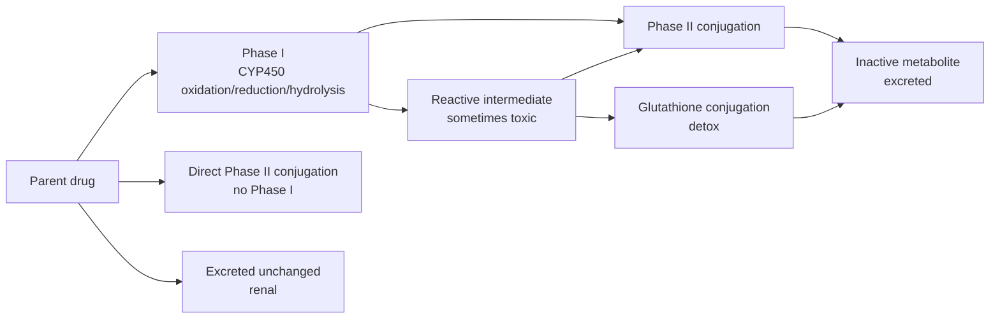
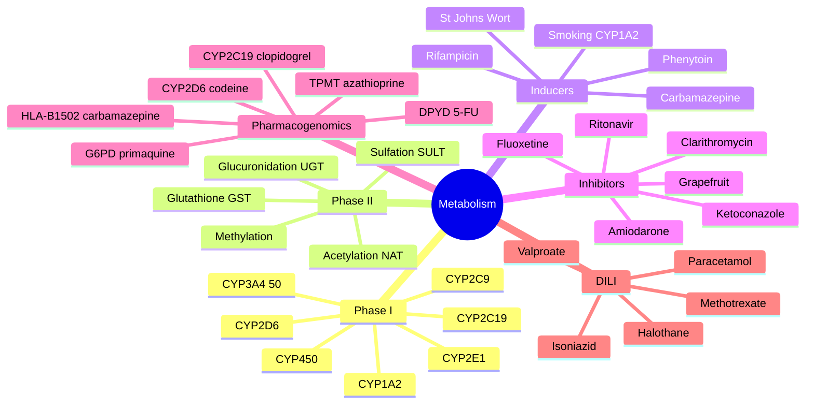

# Pharmacokinetics — Metabolism & Biotransformation

> [!info]
> **Disease-Level Topic** under **Principles of Clinical Pharmacology → Pharmacokinetics**.
> Davidson 24e Ch2 (Maxwell) — "Metabolism".

## 1. Learning Objectives
- [ ] Differentiate **Phase I** and **Phase II** reactions
- [ ] Describe the **CYP450** superfamily (CYP3A4, 2D6, 2C9, 2C19, 1A2)
- [ ] Identify **major inducers and inhibitors** of CYP enzymes
- [ ] Predict **drug-drug interactions** based on CYP metabolism
- [ ] Explain **hepatic extraction ratio** and **first-pass loss**
- [ ] Apply concepts to **dosing in hepatic impairment**
- [ ] Recognise **prodrugs** and **active metabolites**

## 2. Core Concepts

| Term | Definition |
|------|-----------|
| **Biotransformation** | Chemical modification of drug by body (mainly liver) |
| **Phase I reactions** | Oxidation, reduction, hydrolysis (CYP450) — add or expose functional group |
| **Phase II reactions** | Conjugation (glucuronidation, sulfation, acetylation, methylation, glutathione) |
| **CYP450** | Haem-containing enzyme superfamily; main metabolism for ~75% of drugs |
| **Hepatic extraction ratio (E)** | Fraction of drug removed in single pass through liver |
| **High E (E>0.7)** | Flow-limited metabolism (propranolol, verapamil, morphine) |
| **Low E (E<0.3)** | Capacity-limited metabolism (warfarin, phenytoin) |
| **Prodrug** | Inactive drug → active metabolite in vivo |
| **Active metabolite** | Drug metabolised to a still-active compound (e.g., morphine-6-glucuronide) |
| **Hepatotoxicity** | Drug-induced liver injury (paracetamol, halothane, ketoconazole) |
| **Hepatitis B/C** | ↑ Risk of drug hepatotoxicity |
| **Bioactivation** | Phase I sometimes creates toxic intermediate (NAPQI from paracetamol) |

## 3. Mermaid Algorithm — Drug Metabolism Pathway

## 4. Comparison Tables

### 4.1 Phase I vs Phase II Reactions

| Feature | Phase I | Phase II |
|---------|---------|----------|
| **Type** | Oxidation, reduction, hydrolysis | Conjugation |
| **Enzymes** | CYP450, FMO, esterases, amidases | UGT, SULT, NAT, GST, methyltransferases |
| **Site** | Liver (main), gut, lung, plasma | Liver (main), gut |
| **Function** | Add or expose functional group (-OH, -NH, -SH) | Conjugate with glucuronic acid, sulphate, glutathione, acetyl |
| **Result** | Often still active (or more active, or toxic) | Usually inactive, water-soluble |
| **Subcellular** | Smooth ER (microsomes) | Cytosol + microsomes |
| **Example** | CYP3A4 oxidises simvastatin | UGT glucuronidates morphine to M3G/M6G |

### 4.2 Major CYP450 Enzymes

| CYP | % of Drugs | Substrates (Examples) | Inducers | Inhibitors |
|-----|-----------|----------------------|----------|-----------|
| **CYP3A4** | ~50% | Midazolam, simvastatin, atorvastatin, ciclosporin, tacrolimus, sildenafil, fentanyl, amiodarone, calcium channel blockers, macrolides, many ARVs | Rifampicin, carbamazepine, phenytoin, St John's Wort, phenobarbitone, glucocorticoids (mild) | Ketoconazole, itraconazole, clarithromycin, erythromycin, grapefruit juice, ritonavir, indinavir, fluconazole, amiodarone, diltiazem, verapamil, cimetidine |
| **CYP2D6** | ~25% | Codeine, tramadol, metoprolol, propafenone, haloperidol, risperidone, amitriptyline, fluoxetine, paroxetine, tamoxifen, oxycodone | None significant clinically | Quinidine, fluoxetine, paroxetine, bupropion, terbinafine, ritonavir, amiodarone |
| **CYP2C9** | ~10% | Warfarin, phenytoin, glipizide, losartan, NSAIDs (ibuprofen, diclofenac, celecoxib) | Rifampicin, carbamazepine, phenobarbitone, St John's Wort | Fluconazole, amiodarone, metronidazole, sulphonamides, valproate, isoniazid |
| **CYP2C19** | ~5-10% | Clopidogrel, PPIs (omeprazole), voriconazole, fluoxetine, sertraline, diazepam, proguanil | Rifampicin, carbamazepine, phenytoin, St John's Wort | Fluvoxamine, fluoxetine, voriconazole, esomeprazole, ticlopidine |
| **CYP1A2** | ~5% | Theophylline, caffeine, clozapine, olanzapine, tizanidine, R-warfarin | Rifampicin, carbamazepine, omeprazole, cigarette smoke, char-grilled meat, cruciferous vegetables | Ciprofloxacin, fluvoxamine, cimetidine, amiodarone |
| **CYP2E1** | ~2-5% | Paracetamol, alcohol, anaesthetic gases (halothane, methoxyflurane) | Alcohol (chronic), isoniazid | Disulfiram, cimetidine |

### 4.3 Hepatic Extraction Ratio & Clinical Implications

| Class | E Ratio | Examples | Effect of Liver Disease | Effect of Enzyme Induction/Inhibition |
|-------|---------|----------|-------------------------|----------------------------------------|
| **High E (E > 0.7)** | Flow-limited | GTN, propranolol, morphine, verapamil, midazolam | ↓ CL significantly; bioavailability ↑ (loss of first-pass) | Less effect on CL (already cleared); more effect on F |
| **Low E (E < 0.3)** | Capacity-limited | Warfarin, phenytoin, theophylline, caffeine | ↓ CL moderately; F may ↑ | Significant effect on CL |
| **Intermediate E** | Mixed | Methadone, digoxin, nifedipine | Variable | Variable |

### 4.4 Phase II Conjugation Reactions

| Reaction | Enzyme | Substrate Examples | Notes |
|----------|--------|-------------------|-------|
| **Glucuronidation** | UGT (UDP-glucuronosyltransferase) | Morphine, paracetamol, lamotrigine, irinotecan, zidovudine, mycophenolate | Most common; microsomal; can be glucuronidated in first pass |
| **Sulfation** | SULT (sulfotransferase) | Paracetamol (low dose), phenylephrine, steroids | Cytosolic; high-affinity, low-capacity |
| **Acetylation** | NAT1/NAT2 (N-acetyltransferase) | Isoniazid, hydralazine, procainamide, dapsone, sulfonamides | Slow/fast acetylator phenotype; NAT2 polymorphism |
| **Glutathione conjugation** | GST (glutathione S-transferase) | NAPQI (paracetamol toxic metabolite), busulfan, cisplatin | Detoxifies reactive intermediates |
| **Methylation** | Methyltransferases | Catecholamines, azathioprine (to 6-MMP), 5-ASA | Minor pathway |
| **Amino acid conjugation** | Various | Benzoic acid (→ hippuric acid), bile acids | — |
| **Glycine conjugation** | Various | Nicotinic acid, salicylic acid | — |

### 4.5 Active Metabolites and Prodrugs

| Drug | Active Metabolite | Effect |
|------|-------------------|--------|
| **Codeine** | Morphine (10% via CYP2D6) | Analgesia |
| **Tramadol** | O-desmethyltramadol (M1) | Analgesia |
| **Tamoxifen** | Endoxifen (CYP2D6) | Anti-oestrogen |
| **Enalapril** | Enalaprilat | ACE inhibition |
| **Losartan** | EXP3174 (more potent) | AT1 blockade |
| **Amitriptyline** | Nortriptyline | Antidepressant |
| **Morphine** | M6G (active) | Analgesia; accumulates in renal failure |
| **Benzodiazepines (diazepam)** | Nordiazepam (active) | Sedation; t½ extended |
| **Allopurinol** | Oxypurinol | Xanthine oxidase inhibition |
| **Aspirin** | Salicylate (active) | Anti-inflammatory |
| **Spironolactone** | Canrenone | Aldosterone antagonist |
| **Prasugrel** | R-138727 | Antiplatelet |
| **Clopidogrel** | Active thiol (CYP2C19) | Antiplatelet (poor metabolisers = stent thrombosis risk) |
| **Cyclophosphamide** | Acrolein (toxic) + others | Cytotoxic |

### 4.6 Pharmacogenomics

| Gene | Drugs Affected | Phenotype | Clinical Effect |
|------|----------------|----------|-----------------|
| **CYP2D6** | Codeine, tramadol, tamoxifen, haloperidol, metoprolol | UM, EM, IM, PM | Codeine: PM = no analgesia; Tamoxifen: PM = no effect |
| **CYP2C19** | Clopidogrel, PPIs, voriconazole, sertraline | UM, EM, IM, PM | Clopidogrel: PM = stent thrombosis; Voriconazole: PM = toxicity |
| **CYP2C9** | Warfarin, phenytoin | *2, *3 alleles | Warfarin: ↓ dose required in *2/*3 carriers (↑ bleeding) |
| **VKORC1** | Warfarin | AA vs GG | Warfarin: AA = lower dose; GG = higher dose |
| **TPMT** | Azathioprine, 6-MP | Deficient | Severe myelosuppression; need to reduce dose or avoid |
| **NUDT15** | Azathioprine | Low activity | Myelosuppression (esp. Asians) |
| **DPYD** | Fluorouracil, capecitabine | Deficient | Severe toxicity; need to avoid or ↓ dose |
| **UGT1A1** | Irinotecan, atazanavir, nilotinib | Gilbert's (28/28), Crigler-Najjar | Irinotecan: severe neutropenia, diarrhoea |
| **G6PD** | Primaquine, dapsone, sulfonamides, nitrofurantoin, fava beans | Variable | Haemolysis in deficient (X-linked) |
| **HLA-B*15:02** | Carbamazepine, oxcarbazepine, lamotrigine | Positive | SJS/TEN risk in Asian populations (Han Chinese, Thai, Malaysian) |
| **HLA-B*57:01** | Abacavir | Positive | Hypersensitivity (rash, fever, systemic); avoid |
| **HLA-B*58:01** | Allopurinol | Positive | SJS/TEN (Han Chinese, Thai) |
| **HLA-A*31:01** | Carbamazepine | Positive | SJS/TEN in Europeans, Japanese |
| **NAT2** | Isoniazid, hydralazine, procainamide | Slow/fast acetylator | Slow = drug-induced lupus; efficacy issues |

### 4.7 Drug-Induced Liver Injury (DILI)

| Pattern | Drug Examples | LFTs | Histology |
|---------|---------------|------|-----------|
| **Hepatocellular** (ALT > 3x ULN; R ≥ 5) | Paracetamol, isoniazid, valproate, methotrexate, halothane, ketoconazole | ALT >> ALP | Necrosis |
| **Cholestatic** (ALP > 2x ULN; R ≤ 2) | OCP, erythromycin, anabolic steroids, chlorpromazine | ALP >> ALT | Cholestasis |
| **Mixed** (R 2-5) | Sulfonamides, phenytoin, ACEi | Both | Mixed |
| **Steatosis (microvesicular)** | Valproate, tetracyclines, didanosine, alcohol | Variable | Microvesicular fat |
| **Steatohepatitis** (NASH) | Tamoxifen, amiodarone, methotrexate | Variable | Macrovascular + inflammation |
| **Autoimmune hepatitis** | Nitrofurantoin, minocycline, hydralazine, methyldopa, statins | ALT ↑ | Autoimmune features |
| **Vanishing bile duct** | Flucloxacillin, co-amoxiclav, erythromycin | Cholestatic | Duct loss |

**R = (ALT/ULN) / (ALP/ULN)** — used to classify pattern.

## 5. FCPS/MRCP High-Yield Summary

| Pearl | Detail |
|-------|--------|
| Most drugs metabolised by | CYP3A4 (~50%) |
| Phase I enzymes | CYP450, FMO, esterases |
| Phase II enzymes | UGT, SULT, NAT, GST, methyltransferases |
| CYP inducers (broad) | Rifampicin, carbamazepine, phenytoin, phenobarbitone, St John's Wort, alcohol (chronic), cigarette smoke (CYP1A2) |
| CYP inhibitors (broad) | Ketoconazole, itraconazole, fluconazole, clarithromycin, erythromycin, ritonavir, indinavir, grapefruit, amiodarone, fluoxetine, paroxetine |
| CYP2D6 polymorphism | Codeine efficacy (PM = no analgesia); tamoxifen (PM = no effect) |
| CYP2C19 + clopidogrel | PM = poor activation = stent thrombosis; use prasugrel/ticagrelor |
| CYP2C9 + warfarin | *2/*3 alleles = ↑ bleeding; need lower dose |
| TPMT + azathioprine | Deficient = severe myelosuppression; pre-screen |
| DPYD + 5-FU | Deficient = severe toxicity (death); pre-screen |
| UGT1A1 + irinotecan | Gilbert's (28/28) = severe neutropenia |
| G6PD deficiency | Primaquine, dapsone, sulfonamides, nitrofurantoin, fava beans → haemolysis |
| HLA-B*15:02 | Carbamazepine → SJS/TEN in Asian populations; pre-screen |
| HLA-B*57:01 | Abacavir hypersensitivity; pre-screen |
| Paracetamol toxicity | NAPQI (toxic metabolite); glutathione detoxifies; N-acetylcysteine replenishes glutathione |
| Active metabolite accumulation | Morphine M6G in renal failure |
| Hepatic extraction ratio E | E > 0.7 = high; E < 0.3 = low |
| Cytochrome location | Smooth endoplasmic reticulum (liver); also gut (CYP3A4) |
| Phase II cofactor examples | UDP-glucuronic acid (UGT), PAPS (SULT), acetyl-CoA (NAT), glutathione (GST), SAM (methylation) |
| Bilirubin metabolism | UGT1A1 glucuronidates; deficiency = Crigler-Najjar, Gilbert's |
| Hepatic blood flow | ~1.5 L/min; drugs with high E depend on flow |
| Liver first-pass | Divided: gut (CYP3A4) + liver |

## 6. Viva Questions (10)

1. **List the major Phase I and Phase II reactions.**
   *Phase I: oxidation, reduction, hydrolysis (mainly CYP450). Phase II: conjugation — glucuronidation, sulfation, acetylation, glutathione, methylation, glycine, etc.*

2. **Name the most important CYP enzyme and its share of drug metabolism.**
   *CYP3A4 — metabolises approximately 50% of all drugs.*

3. **Give 3 inducers and 3 inhibitors of CYP3A4.**
   *Inducers: rifampicin, carbamazepine, St John's Wort, phenytoin, phenobarbitone. Inhibitors: ketoconazole, clarithromycin, ritonavir, grapefruit juice, diltiazem, verapamil, amiodarone.*

4. **Why is codeine ineffective in some patients?**
   *CYP2D6 polymorphism. Poor metabolisers (PM, ~5-10% of Caucasians) cannot convert codeine to morphine → no analgesia. Ultra-rapid metabolisers (UM, rare, 1-3%) have excessive conversion → toxicity.*

5. **What is the genetic basis of clopidogrel resistance?**
   *Clopidogrel is a prodrug requiring CYP2C19 for activation. Loss-of-function CYP2C19 alleles (*2, *3) are poor metabolisers → less active metabolite → high on-treatment platelet reactivity → stent thrombosis risk. Use prasugrel or ticagrelor (less CYP-dependent) in carriers.*

6. **Why should we screen for TPMT before azathioprine?**
   *TPMT metabolises azathioprine/6-MP. Deficiency (~1 in 300) leads to severe myelosuppression when standard dose given. Pre-screening allows dose reduction or alternative (mycophenolate).*

7. **What is the mechanism of paracetamol hepatotoxicity?**
   *Paracetamol is metabolised by CYP2E1 to NAPQI (toxic intermediate). Normally detoxified by glutathione. In overdose, glutathione is depleted → NAPQI damages hepatocytes → centrilobular necrosis. N-acetylcysteine replenishes glutathione.*

8. **Differentiate Phase I and Phase II reactions.**
   *Phase I: oxidation/reduction/hydrolysis; adds or exposes functional group; often still active; main enzyme CYP450. Phase II: conjugation with glucuronide, sulphate, glutathione, etc.; usually inactive; water-soluble for excretion.*

9. **A patient on warfarin is started on rifampicin (for TB). INR drops. Why?**
   *Rifampicin is a potent CYP3A4 and CYP2C9 inducer. Increases warfarin metabolism → ↓ levels → ↓ INR. May need to double or triple warfarin dose.*

10. **What is the HLA-B*15:02 test?**
    *Genetic test for Asian patients (Han Chinese, Thai, Malaysian) before starting carbamazepine (or oxcarbazepine, lamotrigine). HLA-B*15:02 positive = high risk of SJS/TEN. Use alternative (e.g., levetiracetam, valproate).*

## 7. Confusions & Mnemonics

| Confusion | Resolution |
|-----------|------------|
| CYP1A2 induction | Smoking (cigarette smoke), char-grilled food, cruciferous veg — not just drugs |
| CYP2D6 induction | None clinically significant; only inhibition matters |
| CYP2D6 inhibition | Quinidine, fluoxetine, paroxetine, bupropion |
| CYP3A4 inhibitor mnemonic | "**KFC** Rituximab" = Ketoconazole, Fluconazole, Clarithromycin + Ritonavir |
| CYP3A4 inducers mnemonic | "**R**ifampicin **C**arbamazepine **P**henytoin **S**t John's **W**ort" (RCP-SJW) |
| Phase I vs II in toxicity | Phase I often creates toxic metabolite (NAPQI); Phase II usually detoxification |
| Active metabolite | Often still active — morphine-6-glucuronide accumulates in renal failure |
| Prodrug vs active drug | Prodrug = INACTIVE; active = active |
| Paracetamol toxicity | Glutathione depletion; N-acetylcysteine replenishes |
| HLA-B*15:02 populations | Han Chinese, Thai, Malaysian, Indian (some) — NOT in Caucasians |
| HLA-B*57:01 | Abacavir hypersensitivity (Caucasians) |
| St John's Wort | CYP3A4 + P-gp inducer — many serious interactions (OCP, ciclosporin, apixaban) |
| Grapefruit | CYP3A4 inhibitor (gut wall) |
| Isoniazid | NAT2 polymorphism; slow acetylator = drug-induced lupus |
| Warfarin CYP | S-warfarin: CYP2C9 (most potent); R-warfarin: CYP1A2/CYP3A4 |
| High vs low E drugs | High E (propranolol, morphine) — flow limited; Low E (warfarin) — capacity limited |
| First-pass definition | Metabolism BEFORE systemic = gut wall + liver |
| NAPQI antidote | N-acetylcysteine (also methionine, but NAC is gold standard) |
| Phenytoin + methotrexate | Both CYP2C9 substrates; coadministration = toxicity |

**Mnemonic — CYP3A4 inhibitors: "**KEGS RAC**"** (Ketoconazole, Erythromycin, Grapefruit, Sildenafil-related? → use "**K**etoconazole, **E**rythromycin, **G**rapefruit, **S**till **A**void with **C**larithromycin, **R**itonavir, **I**ndinavir, **F**luconazole")

**Mnemonic — CYP3A4 inducers: "**R**ifampicin, **C**arbamazepine, **P**henytoin, **S**t **J**ohn's **W**ort"** (RCP-SJW) — "**R**eal **C**ops **P**rotect **S**hared **J**ails **W**ell"

**Mnemonic — Pharmacogenomics: "**G**6PD **H**aemolyses with **P**rimaquine; **HLA**-**B***15:02 **S**JS in **A**sians"** (carbamazepine)

**Mnemonic — Phase II conjugation: "**G**lucuronidation (most common), **S**ulfation, **A**cetylation, **G**lutathione, **M**ethylation"** (G-SAGM)

**Mnemonic — Paracetamol toxicity: "**P**aracetamol → **N**APQI (toxic) by **CYP2E1**; **G**lutathione detoxifies; **NAC** replenishes"** (PNG-GN)

**Mnemonic — Active metabolites: "**C**odeine → **M**orphine (10% via CYP2D6); **T**ramadol → **M**1; **T**amoxifen → **E**ndoxifen"** (CMT)

## 8. Mermaid Mind Map

## 9. Spaced Repetition Tracker

| Topic | Day 1 | Day 3 | Day 7 | Day 14 | Day 30 |
|-------|-------|-------|-------|-------|--------|
| Phase I/II | ☐ | ☐ | ☐ | ☐ | ☐ |
| CYP3A4 | ☐ | ☐ | ☐ | ☐ | ☐ |
| CYP2D6 | ☐ | ☐ | ☐ | ☐ | ☐ |
| CYP2C9/C19 | ☐ | ☐ | ☐ | ☐ | ☐ |
| Inducers | ☐ | ☐ | ☐ | ☐ | ☐ |
| Inhibitors | ☐ | ☐ | ☐ | ☐ | ☐ |
| Pharmacogenomics | ☐ | ☐ | ☐ | ☐ | ☐ |
| Paracetamol | ☐ | ☐ | ☐ | ☐ | ☐ |

## 10. Self-Test Scorecard

| Domain | Score (0-5) |
|--------|-------------|
| Phase I/II | /5 |
| CYP enzymes | /5 |
| Inducers | /5 |
| Inhibitors | /5 |
| Pharmacogenomics | /5 |
| DILI | /5 |
| **TOTAL** | **/30** |

## 11. MCQs (10)

1. **The most important CYP enzyme for drug metabolism is:**
   A. CYP1A2
   B. CYP2C9
   C. CYP2C19
   D. CYP3A4 ✓
   E. CYP2D6

2. **Phase I reactions include:**
   A. Glucuronidation
   B. Oxidation ✓
   C. Acetylation
   D. Methylation
   E. Conjugation

3. **A CYP3A4 inducer is:**
   A. Ketoconazole
   B. Rifampicin ✓
   C. Clarithromycin
   D. Grapefruit
   E. Erythromycin

4. **The paracetamol toxic metabolite is:**
   A. M3G
   B. M6G
   C. NAPQI ✓
   D. Oxypurinol
   E. Codeine-6-glucuronide

5. **Codeine is ineffective in CYP2D6 poor metabolisers because:**
   A. Cannot be absorbed
   B. Cannot be converted to morphine ✓
   C. Is metabolised too fast
   D. Has no analgesic effect
   E. Is rapidly excreted

6. **TPMT deficiency affects which drug?**
   A. Codeine
   B. Azathioprine ✓
   C. Warfarin
   D. Clopidogrel
   E. Phenytoin

7. **The antidote for paracetamol overdose is:**
   A. Activated charcoal
   B. Naloxone
   C. N-acetylcysteine ✓
   D. Flumazenil
   E. Atropine

8. **G6PD deficiency can cause haemolysis with:**
   A. Codeine
   B. Paracetamol
   C. Primaquine ✓
   D. Warfarin
   E. Heparin

9. **HLA-B*15:02 is associated with SJS/TEN from:**
   A. Abacavir
   B. Allopurinol
   C. Carbamazepine (in Asians) ✓
   D. Phenytoin
   E. Valproate

10. **CYP2C19 polymorphism is most relevant for:**
    A. Codeine
    B. Warfarin
    C. Clopidogrel ✓
    D. Phenytoin
    E. Tamoxifen

## 12. SBAs (5)

1. **A patient on warfarin is started on rifampicin for TB. INR drops from 3.0 to 1.5. Mechanism:**
   - A) Rifampicin is an anticoagulant
   - B) Rifampicin induces CYP2C9/3A4 → ↑ warfarin metabolism → ↓ INR ✓
   - C) Rifampicin displaces warfarin
   - D) Rifampicin inhibits warfarin metabolism
   - E) Warfarin is not absorbed

2. **An Asian patient is to be started on carbamazepine for epilepsy. Pre-treatment screening should include:**
   - A) TPMT
   - B) HLA-B*15:02 (SJS/TEN risk) ✓
   - C) CYP2D6
   - D) G6PD
   - E) HLA-B*57:01

3. **A patient on clopidogrel has stent thrombosis despite compliance. Most likely cause:**
   - A) Non-compliance
   - B) CYP2C19 poor metaboliser → no active metabolite → no antiplatelet effect ✓
   - C) Stent malposition
   - D) Drug interaction
   - E. Wrong diagnosis

4. **A patient takes 30 g paracetamol overdose 12 h ago. ALT 250, INR 1.5. Best management:**
   - A) Activated charcoal only
   - B) N-acetylcysteine IV (despite normal LFTs) ✓
   - C) Wait for LFTs to rise
   - D) Liver transplant
   - E. Paracetamol level only

5. **A patient on azathioprine develops severe pancytopenia. Most likely cause:**
   - A) Drug allergy
   - B) TPMT deficiency → toxic 6-TG levels → myelosuppression ✓
   - C) Viral infection
   - D) Wrong diagnosis
   - E. Drug interaction

## 13. Answer Key

### MCQ Answers
1. **D** (CYP3A4 ~50%)
2. **B** (Oxidation is Phase I)
3. **B** (Rifampicin = inducer)
4. **C** (NAPQI = paracetamol toxic)
5. **B** (CYP2D6 PM = no morphine)
6. **B** (TPMT + azathioprine)
7. **C** (NAC for paracetamol)
8. **C** (Primaquine in G6PD)
9. **C** (HLA-B*15:02 + carbamazepine in Asians)
10. **C** (CYP2C19 + clopidogrel)

### SBA Answers
1. **B** — Rifampicin induces CYP2C9/3A4 → ↑ warfarin metabolism → ↓ INR.
2. **B** — HLA-B*15:02 screening in Asians before carbamazepine.
3. **B** — CYP2C19 PM → no active clopidogrel → no antiplatelet → stent thrombosis.
4. **B** — NAC within 8 h is most effective; can still use 12-24 h.
5. **B** — TPMT deficiency → toxic 6-TG → myelosuppression.

## 14. Summary Box

> **Phase I = oxidation/reduction/hydrolysis (CYP450).** Phase II = conjugation (glucuronidation, sulfation, acetylation, glutathione, methylation). **CYP3A4** metabolises ~50% of drugs. **Inducers:** rifampicin, carbamazepine, phenytoin, SJW, smoking. **Inhibitors:** ketoconazole, clarithromycin, ritonavir, grapefruit, amiodarone. **Pharmacogenomics:** CYP2D6 (codeine, tamoxifen), CYP2C19 (clopidogrel), TPMT (azathioprine), DPYD (5-FU), G6PD (primaquine), HLA-B*15:02 (carbamazepine). Paracetamol → NAPQI → hepatotoxicity; **NAC** is antidote. **DILI** patterns: hepatocellular (paracetamol), cholestatic (OCP), mixed, steatosis (valproate), autoimmune (nitrofurantoin).

---

## Cross-Links
- **Parent Heading**: [[../../Principles of Clinical Pharmacology|Principles of Clinical Pharmacology]]
- **Sibling Topics**: [[Routes of Administration]], [[Absorption and Bioavailability]], [[Distribution and Protein Binding]], [[Excretion and Clearance]], [[Half-life and Steady State]], [[Kinetics and Dosing]]
- **Chapter MOC**: [[Clinical Therapeutics and Good Prescribing MOC]]
- **Related**: [[Drug Interactions/Pharmacokinetic interactions]], [[Special Populations/Hepatic Impairment/Hepatic Drug Dosing]], [[ADRs/Common ADR patterns by system]]

**Last Updated:** 2026-06-15  
**Status: FULLY COMPLETE with Exam Suite (Viva 10, MCQ 10, SBA 5, Answer Key, Confusions, Mind Map, Spaced Repetition, Self-Test, Exam Modes)**
