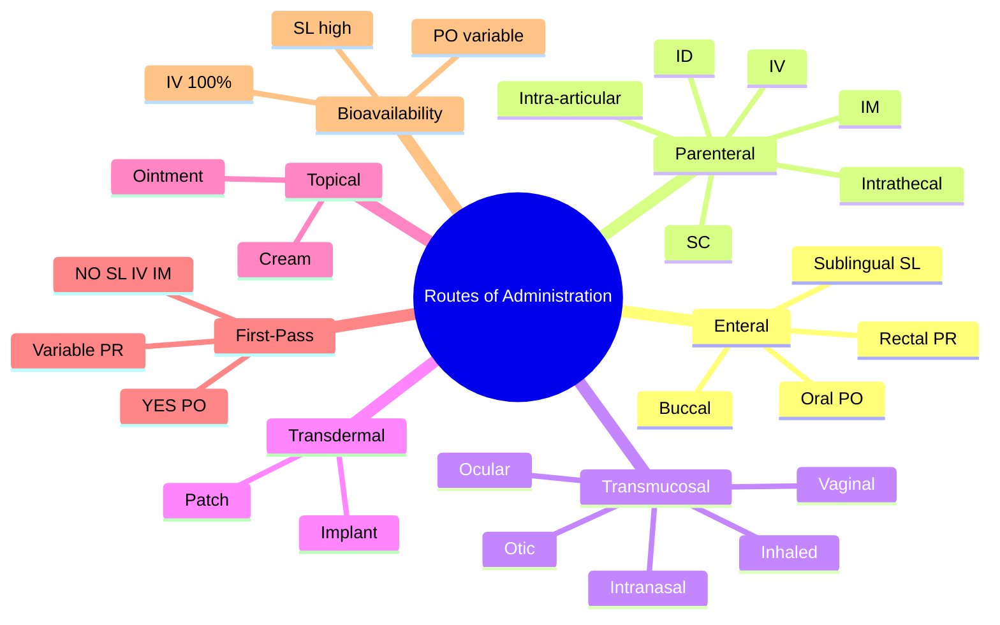

# Pharmacokinetics — Routes of Administration

> [!info]
> **Disease-Level Topic** under **Principles of Clinical Pharmacology → Pharmacokinetics**.
> Davidson 24e Ch2 (Maxwell) — "Routes of administration".

## 1. Learning Objectives
- [ ] List the major routes of drug administration
- [ ] Compare **bioavailability, onset, duration, indications** for each route
- [ ] Differentiate **enteral vs parenteral** routes
- [ ] Select appropriate route for clinical scenario
- [ ] Recognise **first-pass metabolism** and routes that bypass it
- [ ] Identify routes with **100% bioavailability** (IV) vs variable
- [ ] Discuss novel routes (intranasal, inhaled, transdermal, intrathecal)

## 2. Classification of Routes

| Category | Routes | Bypasses First-Pass? |
|----------|--------|----------------------|
| **Enteral** (via GI) | Oral (PO), Sublingual (SL), Buccal, Rectal (PR) | Variable: PO = NO (first-pass); SL/Buccal = YES |
| **Parenteral — Injectable** | IV, IM, SC, ID, intra-arterial, intrathecal, intra-articular | YES (all injectable bypass first-pass) |
| **Transmucosal** | Intranasal, inhaled, ocular, otic, vaginal, transdermal | YES (avoid first-pass) |
| **Topical** | Skin, eye, ear | Local effect |

## 3. Mermaid Algorithm — Route Selection

```mermaid
flowchart TD
    A[Choose drug and route] --> B{Can patient swallow?}
    B -->|Yes| C{Is it an emergency?}
    B -->|No| D[Parenteral route: IV/IM/SC]
    C -->|Yes| E[IV (immediate, 100% F)]
    C -->|No| F[Oral: most convenient, cost-effective]
    C -->|N/V, surgery| G[PR or SL/Buccal or IV]
    F --> H{High first-pass loss?}
    H -->|Yes| I[Switch to SL/IV/IM/transdermal]
    I --> J[Monitor response]
    H -->|No| J
    E --> J
    D --> J
```

## 4. Comparison Tables

### 4.1 Enteral Routes (PO, SL, Buccal, PR)

| Route | Bioavailability | Onset | Pros | Cons | Examples |
|-------|----------------|-------|------|------|----------|
| **Oral (PO)** | Variable (5-100%); often 50-80% | 15-60 min (depends on gastric emptying) | Convenient, self-administered, cheap, sterile not required | First-pass metabolism, GI irritation, requires swallow, N/V, food interactions | Most oral drugs: amoxicillin, metformin, paracetamol |
| **Sublingual (SL)** | High (~100% if no swallow) | 1-5 min (very fast) | Rapid onset, bypasses first-pass | Cannot swallow, small dose, may be bitter, mucosal irritation | GTN (angina), buprenorphine, nifedipine (in hypertensive emergency), ondansetron melts |
| **Buccal** | High (~100% if retained) | 5-15 min | Slower than SL but longer duration; bypasses first-pass | Same as SL; can be chewed/swallowed | Midazolam (buccal in seizures), fentanyl lozenge |
| **Rectal (PR)** | Variable (~50%); erratic | 15-30 min | Useful if N/V, post-op, palliative, children | Patient acceptability, erratic absorption, mucosal damage | Paracetamol, diclofenac, diazepam (status epilepticus), mesalazine |

### 4.2 Parenteral Injectable Routes

| Route | Bioavailability | Onset | Pros | Cons | Examples |
|-------|----------------|-------|------|------|----------|
| **IV bolus** | 100% | Immediate (15-30 s) | Rapid onset, accurate dose, 100% F, can titrate | Needs IV access, risk of infection, embolism, phlebitis, requires skill | Morphine, furosemide, antibiotics, adrenaline |
| **IV infusion** | 100% | Steady state in 4-5 t½ | Precise control, steady concentration | Same as bolus; needs pump | Insulin, vasopressors, heparin, morphine (PCA) |
| **IM** | High (often ~100% for aqueous) | 5-15 min (aqueous); slow for depot | Reliable, can give large volume, depot formulations | Pain, haematoma, infection, nerve damage | Adrenaline (anaphylaxis), vaccines, depot antipsychotics, vitamin B12 |
| **SC** | High (~100%) | 5-30 min (variable) | Self-injection possible (insulin), low cost | Small volume, slow, can cause lipoatrophy, bruising | Insulin, enoxaparin, methotrexate (low-dose) |
| **Intradermal (ID)** | 100% (very small volume) | Slow (hours) | Diagnostic (PPD), desensitisation, vaccines | Small volume, technical | TB test, allergy testing, BCG |
| **Intrathecal** | 100% (bypasses BBB) | Direct CNS effect | Direct CNS delivery (bypasses BBB) | Specialist only, infection risk | Baclofen (spasticity), methotrexate (CNS lymphoma), anaesthesia (spinal) |
| **Intra-articular** | Local | Local | Direct joint effect (e.g., steroid) | Infection risk | Triamcinolone, hyaluronic acid |
| **Intra-arterial** | Local (target organ) | Local | Targeted therapy (e.g., chemo) | Ischaemia risk | Regional chemotherapy |

### 4.3 Transmucosal Routes

| Route | Bioavailability | Onset | Pros | Cons | Examples |
|-------|----------------|-------|------|------|----------|
| **Intranasal** | High (variable) | 5-15 min | Rapid, self-administered, bypasses first-pass | Mucosal irritation, limited volume | Sumatriptan, desmopressin, naloxone (overdose), influenza vaccine |
| **Inhaled** | High for local; variable for systemic | 1-5 min (local); slower (systemic) | Direct to lung (low systemic dose), rapid local effect | Requires coordination, technique-dependent | Salbutamol, beclometasone, anaesthetic gases, nicotine |
| **Transdermal** | Sustained (slow) | Slow (hours), sustained (24-72 h) | Steady levels, no first-pass, good compliance, avoids GI | Slow onset, skin irritation, limited to lipophilic drugs | GTN patch, fentanyl patch, nicotine patch, hormone replacement (estradiol), rivastigmine |
| **Ocular (eye drops)** | Local (low systemic) | 5-15 min | Local effect, low systemic exposure | Systemic absorption via nasolacrimal duct | Timolol (glaucoma), chloramphenicol |
| **Otic (ear drops)** | Local | 5-15 min | Local effect | Ototoxicity if perforated eardrum | Ciprofloxacin, acetic acid |
| **Vaginal** | Local + some systemic | Variable | Local (oestrogen), systemic (contraceptive) | Local irritation | Clotrimazole, oestrogen pessary, contraceptive ring |

### 4.4 Topical (Skin)

| Route | Bioavailability | Use | Examples |
|-------|----------------|-----|----------|
| **Skin cream/ointment** | Variable (1-10% systemic) | Local | Hydrocortisone, fusidic acid, lidocaine |
| **Transdermal patch** | Sustained systemic | Systemic | GTN, fentanyl, nicotine, hormone, rotigotine |
| **Iontophoresis** | ↑ Local penetration | Local | Dexamethasone |
| **Subcutaneous implant** | Long-acting | Systemic | Etonogestrel implant (Nexplanon), goserelin |

### 4.5 First-Pass Metabolism and Routes That Bypass It

| Route | First-Pass? | Notes |
|-------|-------------|-------|
| **PO** | YES (liver via portal vein; also gut wall) | Variable loss (5-50%) |
| **SL/Buccal** | NO (absorbed directly into systemic via oral mucosa) | Good for emergency (GTN) |
| **PR** (lower 1/3) | PARTIAL (systemic via middle/lower rectal veins) | Variable |
| **PR** (upper 1/3) | YES (via portal vein) | Less reliable |
| **IV/IM/SC** | NO | All bypass first-pass |
| **Inhaled/Intranasal/Transdermal** | NO | Useful for drugs with high first-pass loss (GTN, fentanyl) |
| **Topical skin** | NO (mostly) | Systemic exposure usually minimal |

## 5. FCPS/MRCP High-Yield Summary

| Pearl | Detail |
|-------|--------|
| 100% bioavailability | IV bolus/infusion only |
| Fastest onset | IV bolus (15-30 s) |
| Slowest onset | Transdermal (hours) |
| Longest duration (single dose) | Depot injection (weeks-months) |
| Best for emergency | IV |
| Best for chronic, slow release | Transdermal |
| Best for N/V patient | PR, IV, IM |
| Bypasses first-pass | SL, buccal, IV, IM, SC, intranasal, inhaled, transdermal |
| Avoids first-pass loss (pro-drugs) | GTN oral = inactive; SL = active |
| Hepatic first-pass loss (high) | GTN, verapamil, propranolol, morphine (oral = low F) |
| Low F oral drugs | Morphine (~30%), propranolol (~30%), verapamil (~20%) |
| Variable F oral | Digoxin, theophylline, paracetamol |
| Best route for status epilepticus | IV (or PR diazepam if no IV access) |
| Best route for anaphylaxis | IM adrenaline (lateral thigh); IV only in cardiac arrest |
| Best route for opioid overdose | IV/IM naloxone (intranasal if available) |
| Best route for Parkinson's dysmotility | Rotigotine patch (continuous dopaminergic stimulation) |
| Intrathecal route | Bypasses BBB; used for baclofen, methotrexate, anaesthesia |
| Heparin (LMWH) | SC only (not absorbed orally) |

## 6. Viva Questions (10)

1. **List the routes that bypass first-pass metabolism.**
   *Sublingual, buccal, IV, IM, SC, intrathecal, intranasal, inhaled, transdermal, topical (skin).*

2. **Which route has 100% bioavailability?**
   *IV (intravenous) — direct systemic delivery, no absorption barrier.*

3. **Why is sublingual GTN used in angina?**
   *GTN has very high first-pass metabolism if taken orally (almost complete hepatic inactivation). Sublingual route bypasses first-pass → rapid systemic absorption → venodilation → relief of angina within 1-5 minutes.*

4. **A patient is NPO (nil by mouth) post-operatively and has pain. What analgesic routes are available?**
   *IV (morphine, fentanyl), IM (less preferred — painful), SC, PR (diclofenac), epidural/neuraxial (morphine, fentanyl), transdermal (fentanyl patch for chronic pain).*

5. **Why is oral morphine poorly bioavailable (~30%)?**
   *Morphine undergoes significant first-pass metabolism in the liver (glucuronidation, sulfation). Only ~30% reaches systemic circulation. IV morphine is therefore ~3x more potent than oral.*

6. **Differentiate sublingual and buccal administration.**
   *Sublingual: under the tongue (rapid absorption, smaller area, faster onset). Buccal: between gum and cheek (slower onset but longer duration; can be chewed). Both bypass first-pass.*

7. **What is the best route for intrathecal methotrexate?**
   *Intrathecal — bypasses BBB. Used for CNS prophylaxis in leukaemia/lymphoma. IV methotrexate does not cross BBB effectively.*

8. **A patient has severe nausea and vomiting. Can oral ondansetron be given?**
   *No — would be vomited. Use IV, IM, or sublingual/orodispersible ondansetron melt.*

9. **Why is the IM route used for adrenaline in anaphylaxis?**
   *Rapid absorption (within minutes) and reliable. IV adrenaline is reserved for cardiac arrest or refractory shock (risk of arrhythmia, hypertensive crisis). Intramuscular lateral thigh is preferred.*

10. **What is the best route for insulin?**
    *SC (subcutaneous). Insulin is destroyed in the GI tract (pepsin, pancreatic proteases). Cannot be given orally. IV insulin is used in emergencies (DKA, HHS, perioperative).*

## 7. Confusions & Mnemonics

| Confusion | Resolution |
|-----------|------------|
| Bioavailability vs absorption | Bioavailability = fraction reaching systemic; Absorption = rate and extent from administration site |
| First-pass vs systemic metabolism | First-pass = metabolism BEFORE reaching systemic (gut + liver); Systemic = after reaching blood |
| SL vs buccal | SL = under tongue (faster); Buccal = between gum and cheek (slower, longer) |
| Rectal first-pass | Lower 1/3 bypasses; upper 1/3 doesn't (variable) |
| Oral F vs oral absorption | Some drugs well-absorbed but high first-pass (low F) — e.g., propranolol |
| IM vs SC onset | IM (aqueous) faster than SC; SC depot = slowest |
| Topical vs transdermal | Topical = local (skin); Transdermal = systemic (across skin) |
| Intrathecal vs epidural | Intrathecal = direct CSF; Epidural = outside dura, slower onset |
| IV vs IM adrenaline | IV = cardiac arrest or refractory shock; IM = anaphylaxis |
| Heparin route | LMWH = SC; UFH = IV (or SC prophylactic) |
| Insulin route | SC (chronic); IV (emergencies) |
| Fentanyl patches | For opioid-tolerant patients ONLY (12.5 µg/h starting) |
| GTN tablets | SL (not swallow) |
| Buprenorphine | SL (not swallow) |
| Methotrexate in RA | SC or PO weekly (NOT daily, not IM, not intrathecal) |
| MMR vaccine | SC (or IM) |
| Insulin glargine | SC (clear, long-acting; not IV) |

**Mnemonic — Routes bypassing first-pass: "**S**ublingual, **B**uccal, **IV**, **IM**, **SC**, **IN**haled/IN**tranasal, **T**ransdermal"** (SB-IV-IM-SC-INT)

**Mnemonic — 100% bioavailability: "**IV** = **V**ein **V**alidation (**V**erified **V**enom-free) = **100**"**

**Mnemonic — Slowest onset: "**T**ransdermal **T**akes **T**ime"** (hours)

**Mnemonic — Rectal: "**L**ower 1/3 **L**inear (systemic); **U**pper 1/3 **U**ndergoes first-pass"** (LLU)

**Mnemonic — Adrenaline route: "**A**naphylaxis → **A**nterior thigh (**A**nterior = IM); **A**rrest → **A**drenaline IV"** (AAA)

## 8. Mermaid Mind Map



## 9. Spaced Repetition Tracker

| Topic | Day 1 | Day 3 | Day 7 | Day 14 | Day 30 |
|-------|-------|-------|-------|-------|--------|
| Enteral routes | ☐ | ☐ | ☐ | ☐ | ☐ |
| Parenteral routes | ☐ | ☐ | ☐ | ☐ | ☐ |
| First-pass | ☐ | ☐ | ☐ | ☐ | ☐ |
| Bioavailability | ☐ | ☐ | ☐ | ☐ | ☐ |
| SL/Buccal differences | ☐ | ☐ | ☐ | ☐ | ☐ |
| Clinical scenarios | ☐ | ☐ | ☐ | ☐ | ☐ |

## 10. Self-Test Scorecard

| Domain | Score (0-5) |
|--------|-------------|
| Enteral routes | /5 |
| Parenteral routes | /5 |
| First-pass metabolism | /5 |
| Bioavailability | /5 |
| Clinical scenarios | /5 |
| Novel routes | /5 |
| **TOTAL** | **/30** |

## 11. MCQs (10)

1. **Which route has 100% bioavailability?**
   A. Oral
   B. Sublingual
   C. IV ✓
   D. Rectal
   E. IM

2. **The fastest onset of action is achieved by:**
   A. Oral
   B. Sublingual
   C. IV bolus ✓
   D. IM
   E. Transdermal

3. **Which route BYPASSES first-pass metabolism?**
   A. Oral
   B. Rectal (upper 1/3)
   C. Sublingual ✓
   D. Rectal (lower 1/3) — sometimes
   E. All bypass

4. **GTN is given sublingually in angina because:**
   A. Faster than IV
   B. Has high first-pass metabolism if taken orally ✓
   C. Better absorption from oral mucosa
   D. SL avoids gastric irritation
   E. Cheaper

5. **Insulin is administered by which route (chronic use)?**
   A. Oral
   B. IV
   C. IM
   D. SC ✓
   E. SL

6. **Intrathecal drug administration bypasses:**
   A. Liver
   B. Kidney
   C. Blood-brain barrier ✓
   D. Skin
   E. Heart

7. **Adrenaline in anaphylaxis is given by:**
   A. IV bolus
   B. IM (lateral thigh) ✓
   C. SC
   D. Oral
   E. Nebulised

8. **Transdermal fentanyl patch is suitable for:**
   A. Acute postoperative pain
   B. Opioid-naive patients
   C. Chronic pain in opioid-tolerant patients only ✓
   D. Breakthrough pain
   E. Cancer pain only

9. **Rectal diazepam is used in status epilepticus when:**
   A. No IV access available ✓
   B. Patient refuses oral
   C. Allergic to IV
   D. Faster than IV
   E. Better absorption

10. **Morphine oral bioavailability is approximately:**
    A. 100%
    B. 80%
    C. 50%
    D. 30% (with high first-pass) ✓
    E. 10%

## 12. SBAs (5)

1. **A patient with severe nausea and vomiting cannot keep oral ondansetron down. Best alternative route:**
   - A) Repeat oral dose
   - B) IV or orodispersible (melt) ondansetron ✓
   - C) PR ondansetron
   - D) IM only
   - E) Wait until vomiting stops

2. **A 65-year-old with chronic cancer pain on morphine 60 mg PO qds. Switched to SC morphine equivalent dose. Approximate SC dose (given F oral ~30%):**
   - A) 10 mg SC
   - B) 20 mg SC ✓
   - C) 60 mg SC
   - D) 100 mg SC
   - E) 200 mg SC

3. **GTN sublingual route is preferred over oral in angina because:**
   - A) Faster onset (1-5 min vs 30-60 min) AND bypasses hepatic first-pass metabolism ✓
   - B) Better taste
   - C) Cheaper
   - D) No side effects
   - E. Longer duration

4. **A patient on warfarin is switched from IV to oral. INR decreases despite same dose. Most likely explanation:**
   - A) Generic vs brand
   - B) Variable oral absorption / first-pass effect ✓
   - C) Drug interaction
   - D) Compliance
   - E. Disease progression

5. **A child needs vaccination. Best route for MMR:**
   - A) Oral
   - B) SC or IM ✓
   - C) IV
   - D) Intradermal
   - E) Topical

## 13. Answer Key

### MCQ Answers
1. **C** (IV = 100%)
2. **C** (IV bolus = 15-30 s)
3. **C** (SL bypasses first-pass; lower 1/3 PR partially bypasses)
4. **B** (GTN oral = high first-pass; SL bypasses)
5. **D** (Insulin = SC chronic)
6. **C** (Intrathecal bypasses BBB)
7. **B** (IM adrenaline in anaphylaxis)
8. **C** (Fentanyl patch = opioid-tolerant only)
9. **A** (PR diazepam = no IV access in status)
10. **D** (Morphine oral F ~30%)

### SBA Answers
1. **B** — IV or orodispersible ondansetron (bypasses GI in N/V).
2. **B** — 60 mg oral morphine ≈ 20 mg SC/IV morphine (oral F ~30% → 60 mg PO = 20 mg IV/SC; divide by 3).
3. **A** — GTN SL: faster onset + bypasses first-pass.
4. **B** — Oral warfarin has variable F and first-pass; switch may alter INR.
5. **B** — MMR vaccine = SC or IM.

## 14. Summary Box

> **Routes: Enteral (PO, SL, Buccal, PR), Parenteral (IV, IM, SC, ID, intrathecal), Transmucosal (IN, inhaled, ocular, otic, vaginal), Transdermal, Topical.** IV = 100% bioavailability + immediate onset. SL/Buccal/IN/IM/SC/transdermal bypass first-pass. PO oral morphine ~30% F (high first-pass) → 60 mg PO ≈ 20 mg IV. GTN sublingual for angina (bypasses first-pass). Insulin = SC chronic, IV emergencies. Adrenaline IM for anaphylaxis; IV for arrest. Heparin SC (LMWH) or IV (UFH). Intrathecal bypasses BBB.

---

## Cross-Links
- **Parent Heading**: [[../../Principles of Clinical Pharmacology|Principles of Clinical Pharmacology]]
- **Sibling Topics**: [[Absorption and Bioavailability]], [[Distribution and Protein Binding]], [[Metabolism and Biotransformation]], [[Excretion and Clearance]], [[Half-life and Steady State]], [[Kinetics and Dosing]]
- **Chapter MOC**: [[Clinical Therapeutics and Good Prescribing MOC]]
- **Related**: [[Drug Interactions]], [[Special Populations]]

**Last Updated:** 2026-06-15  
**Status: FULLY COMPLETE with Exam Suite (Viva 10, MCQ 10, SBA 5, Answer Key, Confusions, Mind Map, Spaced Repetition, Self-Test, Exam Modes)**
