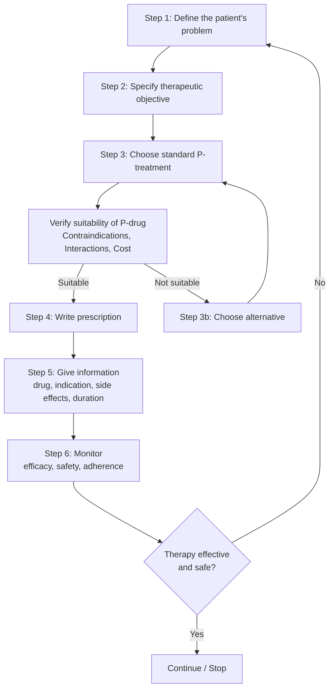
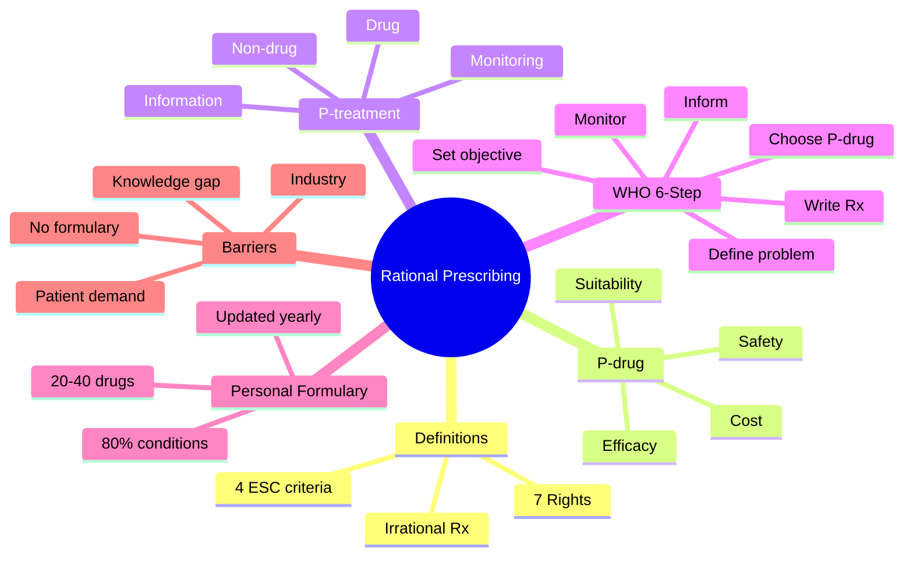

> [!info]
> **Disease-Level Topic** under **Principles of Rational Prescribing → Definition and Aims**.
> Davidson 24e Ch2 — "Introduction to Good Prescribing" (Maxwell SRJ).

## 1. 1. Learning Objectives
- [ ] Define rational (good) prescribing and its 7 "rights"
- [ ] Define **P-drug** and explain the 4 ESC criteria
- [ ] Differentiate **P-drug** from **P-treatment**
- [ ] Construct a personal formulary of 20-40 P-drugs
- [ ] Apply WHO 6-step model in a clinical vignette
- [ ] Discuss barriers to rational prescribing in low/middle-income countries

## 2. 2. Definition & Core Principles

| Term | Definition |
|------|------------|
| **Rational Prescribing** | Right patient, right drug, right dose, right route, right time, right duration, right cost, right monitoring (7 Rs) |
| **Irrational Prescribing** | Inappropriate drug, dose, duration; polypharmacy; underuse of effective therapy; overuse of ineffective/unsafe therapy |
| **P-drug** | Drug chosen by an individual prescriber for a particular indication based on **Efficacy, Safety, Suitability, Cost** |
| **P-treatment** | Complete treatment plan: Non-pharmacological + Pharmacological + Information + Monitoring/Follow-up |
| **Personal Formulary** | 20-40 P-drugs covering ~80% of common conditions encountered in practice |

**WHO estimate:** >50% of medicines are prescribed/dispensed inappropriately; half of patients fail to take them correctly.

## 3. 3. Mermaid Algorithm — WHO 6-Step Prescribing Model

## 4. 4. Comparison Tables

### 1. 4.1 P-Drug vs P-Treatment

| Feature | P-Drug | P-Treatment |
|---------|--------|-------------|
| **What** | A single drug | A complete plan |
| **Components** | Drug + dose + duration | Non-drug measures + drug + counselling + monitoring |
| **Selection** | Efficacy, Safety, Suitability, Cost | Based on P-drug + patient context |
| **Example** | Amlodipine 5 mg OD for HTN | Lifestyle advice + Amlodipine 5 mg OD + home BP log + 4-week review |
| **Update** | When new evidence emerges | Each patient encounter |

### 2. 4.2 4 ESC Criteria for P-Drug Selection

| Criterion | Question to ask | Example (HTN P-drug) |
|-----------|-----------------|----------------------|
| **Efficacy** | Does it work? Evidence? | Amlodipine ≥ ACEi in ALLHAT, ASCOT |
| **Safety** | Side-effect profile in this patient? | Amlodipine safe in asthma, CKD |
| **Suitability** | Can this patient take it? (dose form, contraindications) | OD dosing → good adherence |
| **Cost** | Affordable to patient / system? | Generic amlodipine £0.10/month |

### 3. 4.3 Seven "Rights" of Prescribing (Mnemonic: **"DR.T.RAMP"**)

| Right | Example error |
|-------|---------------|
| Right **D**rug | Prescribing methotrexate daily instead of weekly → death |
| Right **R**oute | Oral methotrexate for ectopic pregnancy (must be IM) |
| Right **T**ime | Tetracycline with dairy → chelation, ↓absorption |
| Right **A**mount | Digoxin 250 µg TDS → toxicity |
| Right **M**ethod | IV gentamicin bolus → neuromuscular block |
| Right **P**atient | Sound-alike "clozapine" vs "clonidine" |
| Right **D**ocumentation | Unclear dose → 10× overdose |

## 5. 5. FCPS/MRCP High-Yield Summary

| Pearl | Detail |
|-------|--------|
| WHO model step that is **most often skipped** | Step 1 (define the problem) — leads to symptomatic Rx without diagnosis |
| Most common irrational prescribing globally | Antibiotic overuse for viral URTI; polypharmacy in elderly |
| P-drug concept origin | WHO Guide to Good Prescribing (1994, updated 2011) |
| Number of P-drugs in personal formulary | 20-40 (covers ~80% of common conditions) |
| When to revise P-drugs | When landmark trial changes evidence, new AE emerges, guideline update |
| Legal class for personal use | All personal formulary drugs should be on local formulary (NICE, BNF) |

## 6. 6. Viva Questions (10)

1. **Define rational prescribing.**
   *Prescribing the right drug, in the right dose, for the right duration, to the right patient, with the right information, at the right cost, with appropriate monitoring — based on explicit criteria.*

2. **What is a P-drug?**
   *A drug selected by an individual prescriber for a specific indication using 4 explicit criteria: Efficacy, Safety, Suitability, Cost.*

3. **Differentiate P-drug from P-treatment.**
   *P-drug = single drug + dose + duration. P-treatment = complete plan (non-drug + drug + counselling + monitoring).*

4. **List the WHO 6-step prescribing model.**
   *1) Define the problem; 2) Specify therapeutic objective; 3) Choose standard treatment (P-drug); 4) Write Rx; 5) Give information; 6) Monitor.*

5. **How many P-drugs should be in a personal formulary?**
   *20-40 P-drugs covering ~80% of common conditions.*

6. **Give an example of irrational prescribing.**
   *Antibiotic for viral URTI; long-acting benzodiazepine in elderly; high-dose opioid for mild pain; IM chloroquine for mild malaria; corticosteroid for simple back pain.*

7. **What is the difference between "right drug" and "right patient"?**
   *Right drug = correct choice for indication. Right patient = drug suitable for this individual (no CI, no allergy, no critical interaction).*

8. **Name 3 common causes of irrational prescribing.**
   *Patient demand; industry promotion; lack of up-to-date knowledge; fear of litigation; lack of CPD; absence of local formulary.*

9. **What is the role of clinical guidelines in rational prescribing?**
   *Standardize evidence-based P-treatments; reduce variation; support audit and education. But guidelines must be applied with patient-centred judgement.*

10. **A junior doctor asks "Why do I need a personal formulary if the BNF exists?"**
    *The BNF is a national formulary listing all drugs. A personal formulary is your selected P-drugs (20-40) covering common conditions — it speeds decision-making, improves confidence, reduces prescribing errors, and forms a personal learning record.*

## 7. 7. Confusions & Mnemonics

| Confusion | Resolution |
|-----------|------------|
| P-drug vs Personal formulary | P-drug = single drug for one indication; Personal formulary = collection of 20-40 P-drugs |
| Generic vs Trade name | Generic = INN (amlodipine); Trade = brand (Istin®). Same active drug; different cost/appearance. |
| Formulary vs Guideline | Formulary = list of approved drugs; Guideline = evidence-based recommendations including non-drug measures |
| "Rational" vs "Restrictive" | Rational ≠ restrictive — it is appropriate, evidence-based, cost-effective. Restrictive = denying access. |
| WHO 6-step vs 5-step (UK variant) | UK often uses 5-step (combines Rx writing + information giving). WHO uses 6 explicit steps. |

**Mnemonic — 4 ESC criteria: "**E**lephants **S**it **S**lowly on **C**ats"** *(Efficacy, Safety, Suitability, Cost)*

**Mnemonic — 7 Rights: "**Dr RAMP**"** *(Drug, Route, Amount, Method, Patient, Documentation — and Time)*

## 8. 8. Mermaid Mind Map

## 9. 9. Spaced Repetition Tracker

| Topic | Day 1 | Day 3 | Day 7 | Day 14 | Day 30 |
|-------|-------|-------|-------|-------|--------|
| 7 Rights | ☐ | ☐ | ☐ | ☐ | ☐ |
| 4 ESC criteria | ☐ | ☐ | ☐ | ☐ | ☐ |
| WHO 6 steps | ☐ | ☐ | ☐ | ☐ | ☐ |
| P-drug vs P-treatment | ☐ | ☐ | ☐ | ☐ | ☐ |
| Personal formulary size | ☐ | ☐ | ☐ | ☐ | ☐ |

## 10. 10. Self-Test Scorecard

| Domain | Score (0-5) | Weak areas to revisit |
|--------|-------------|------------------------|
| Definitions | /5 | |
| WHO 6-step | /5 | |
| P-drug criteria | /5 | |
| Irrational prescribing examples | /5 | |
| Personal formulary | /5 | |
| **TOTAL** | **/25** | |

## 11. 11. MCQs (10)

1. **The "P-drug" concept was developed by:**
   A. FDA  
   B. WHO ✓
   C. MHRA  
   D. NICE  
   E. EMA

2. **How many drugs typically constitute a prescriber's personal formulary?**
   A. 5-10  
   B. 20-40 ✓
   C. 50-100  
   D. 100-200  
   E. >200

3. **The 4 criteria for selecting a P-drug are:**
   A. Efficacy, Safety, Suitability, Cost ✓
   B. Efficacy, Speed, Simplicity, Cost  
   C. Efficacy, Safety, Spectrum, Cost  
   D. Efficacy, Safety, Success, Cost  
   E. Evidence, Safety, Suitability, Cost

4. **The first step in the WHO 6-step prescribing model is:**
   A. Choose the standard treatment  
   B. Define the patient's problem ✓
   C. Specify therapeutic objective  
   D. Write the prescription  
   E. Monitor therapy

5. **Which of the following is NOT a "right" of rational prescribing?**
   A. Right drug  
   B. Right route  
   C. Right manufacturer ✓
   D. Right dose  
   E. Right patient

6. **A P-treatment includes all EXCEPT:**
   A. Non-pharmacological measures  
   B. Drug of choice  
   C. Patient counselling  
   D. Manufacturer's marketing material ✓
   E. Monitoring plan

7. **Which is an example of irrational prescribing?**
   A. Prescribing an antibiotic for viral URTI ✓
   B. Prescribing generic amlodipine for HTN  
   C. Prescribing paracetamol for fever with monitoring  
   D. Using a 6-step prescribing model  
   E. Reviewing personal formulary annually

8. **The most common reason for irrational prescribing in low-income countries is:**
   A. Lack of internet  
   B. Polypharmacy with antibiotics + injections + branded drugs ✓
   C. Excess of guidelines  
   D. Overuse of generics  
   E. Strict formularies

9. **A personal formulary should be reviewed:**
   A. Never  
   B. Only at retirement  
   C. When major new evidence / guidelines change ✓
   D. Every 10 years  
   E. Only on request

10. **"Irrational prescribing" includes all EXCEPT:**
    A. Ineffective dose  
    B. Inappropriate polypharmacy  
    C. Inappropriate generic substitution ✓
    D. Unnecessary antibiotic use  
    E. Underuse of an effective drug

## 12. 12. SBAs (5)

1. **A 55-year-old man with newly diagnosed essential hypertension (BP 162/98 mmHg) has no comorbidities. The doctor selects amlodipine 5 mg OD as the P-drug. Which criterion is most strongly supported by ALLHAT and ASCOT trials for this choice?**
   - A) Safety in asthma
   - B) Cost-effectiveness of generic amlodipine
   - C) Superior efficacy vs ACEi and thiazide in preventing stroke ✓
   - D) Suitability in CKD
   - E) OD dosing for adherence

2. **A junior doctor is told to "develop a personal formulary." The best definition is:**
   - A) All drugs in the BNF
   - B) All drugs in the hospital pharmacy
   - C) 20-40 P-drugs covering ~80% of common conditions in your practice ✓
   - D) All generic drugs
   - E) All drugs in the WHO essential medicines list

3. **Which patient factor determines "suitability" of a P-drug?**
   - A) Cost to NHS
   - B) Doctor's familiarity
   - C) Patient's ability to take the formulation and absence of contraindications ✓
   - D) Trial evidence
   - E) Guideline endorsement

4. **Step 5 of the WHO model is "Give information, instructions and warnings." This step is critical because:**
   - A) It is a legal requirement
   - B) It improves adherence and recognition of side effects ✓
   - C) It reduces drug cost
   - D) It substitutes for monitoring
   - E) It replaces counselling

5. **A patient with heart failure (LVEF 30%) is prescribed the P-drug for HTN. The best P-drug choice is:**
   - A) Amlodipine (no mortality benefit in HF)
   - B) Ramipril (mortality benefit in HFrEF) ✓
   - C) Atenolol (no mortality benefit in HF)
   - D) Doxazosin (NEJM 2000 — worse outcomes)
   - E) Hydralazine (third-line)

## 13. 13. Answer Key

### 1. MCQ Answers
1. **B** (WHO Guide to Good Prescribing)
2. **B** (20-40 drugs; WHO recommendation)
3. **A** (Efficacy, Safety, Suitability, Cost)
4. **B** (Step 1 = define the problem)
5. **C** (Right manufacturer is not a "right"; the 7 Rs are: Drug, Route, Time, Amount, Method, Patient, Documentation)
6. **D** (Manufacturer's marketing is not part of P-treatment)
7. **A** (Antibiotic for viral URTI is irrational)
8. **B** (Polypharmacy + injections + branded drugs in LMIC)
9. **C** (Revise when major new evidence emerges)
10. **C** (Inappropriate generic substitution is not irrational — it's encouraged; only inappropriate in rare cases like narrow TI)

### 2. SBA Answers
1. **C** — ALLHAT (2002): amlodipine non-inferior to chlortalidone for primary outcome. ASCOT (2005): amlodipine ± perindopril superior to atenolol ± thiazide for stroke prevention.
2. **C** — Personal formulary = 20-40 P-drugs (~80% common conditions).
3. **C** — Suitability = appropriate for THIS patient (no CI, can swallow, OD dosing acceptable).
4. **B** — Patient information improves adherence by 30-50% and AE recognition.
5. **B** — ACEi (ramipril) is P-drug in HFrEF (CONSENSUS, SOLVD, SAVE — mortality benefit).

## 14. 14. Summary Box

> **Rational prescribing = Right drug + Right patient + Right time + Right route + Right amount + Right duration + Right monitoring.** The P-drug concept distils 4 ESC criteria; the WHO 6-step model operationalises it. Personal formulary = 20-40 P-drugs, revised when evidence changes. Avoid irrational Rx (polypharmacy, antibiotics for viral illness, expensive branded generics).

---

## 15. 15. Cross-Links
- **Parent Topic-Group**: [[../Principles of Rational Prescribing|Principles of Rational Prescribing]]
- **Sibling Topic-Groups**: [[Steps of rational prescribing]], [[Evidence-based prescribing]], [[Prescription writing]]
- **Heading Hub**: [[Principles of Rational Prescribing]]
- **Chapter MOC**: [[Clinical Therapeutics and Good Prescribing MOC]]
- **Related**: [[ADRs]], [[Drug Interactions]], [[Polypharmacy and Deprescribing]]

**Last Updated:** 2026-06-15  
**Status: FULLY COMPLETE with Exam Suite (Viva 10, MCQ 10, SBA 5, Answer Key, Confusions, Mind Map, Spaced Repetition, Self-Test, Exam Modes)**
