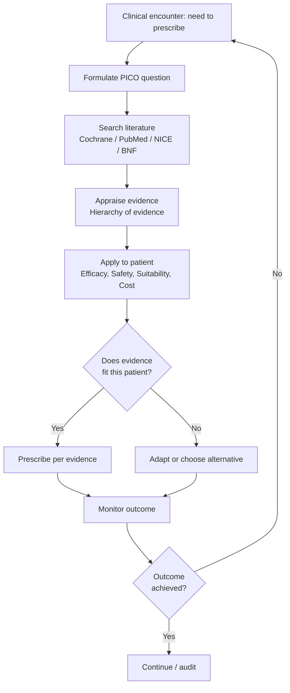
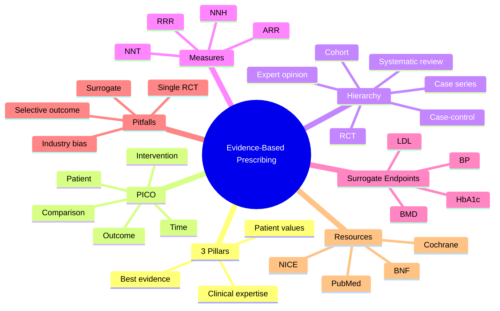

> [!info]
> **Disease-Level Topic** under **Principles of Rational Prescribing → Evidence-Based Prescribing**.
> Davidson 24e Ch2 — "Introduction to Good Prescribing" (Maxwell SRJ).

## 1. 1. Learning Objectives
- [ ] Define evidence-based medicine (EBM) and its 3 pillars
- [ ] Formulate a clinical question using **PICO**
- [ ] Critically appraise a randomised trial (RCT) for internal validity
- [ ] Calculate and interpret **NNT** and **NNH**
- [ ] Apply Number Needed to Treat in shared decision-making
- [ ] Locate high-quality prescribing information (BNF, NICE, Cochrane, UpToDate)
- [ ] Recognise limitations of evidence (surrogate endpoints, industry bias)

## 2. 2. Definition & 3 Pillars of EBM

| Pillar | Source | Example |
|--------|--------|---------|
| **Best current evidence** | RCTs, systematic reviews, guidelines | ALLHAT, NICE HTN guideline |
| **Clinical expertise** | Doctor's experience, judgement | Recognising atypical presentation |
| **Patient values & preferences** | Patient's goals, culture, cost | "I cannot afford a daily pill" |

> **Sackett DL, 1996**: "Evidence-based medicine is the conscientious, explicit, and judicious use of current best evidence in making decisions about the care of individual patients."

## 3. 3. Mermaid Algorithm — EBM in Prescribing

## 4. 4. Comparison Tables

### 1. 4.1 Hierarchy of Evidence

| Level | Study Type | Use in Prescribing |
|-------|-----------|-------------------|
| 1a | Systematic review of RCTs | Strongest — basis of NICE |
| 1b | Individual RCT | Direct evidence |
| 2a | Systematic review of cohort | Supportive |
| 2b | Individual cohort | Hypothesis-generating |
| 3 | Case-control | ADR signals |
| 4 | Case series | Rare ADR |
| 5 | Expert opinion | Last resort |

### 2. 4.2 NNT vs NNH

| Measure | Definition | Example |
|---------|-----------|---------|
| **NNT** | Number needed to treat for one additional patient to benefit | Statin for 5 yrs prevents 1 MI per ~100 treated → NNT=100 |
| **NNH** | Number needed to harm — for one additional patient to experience ADR | Statin → 1 myopathy per ~10,000 → NNH=10,000 |
| **NNT/NNH ratio** | Safety margin | 100/10,000 = 1:100 (very safe) |

**Calculation:**
- NNT = 1 / ARR (absolute risk reduction)
- ARR = Control event rate (CER) − Experimental event rate (EER)
- Example: CER 10%, EER 7% → ARR 3% → NNT = 1/0.03 = **34**

### 3. 4.3 PICO Framework

| Letter | Question | Example (HTN in elderly) |
|--------|----------|--------------------------|
| **P** | Patient / Population | Adults >80 yr with isolated systolic HTN |
| **I** | Intervention | Indapamide ± perindopril |
| **C** | Comparison | Placebo |
| **O** | Outcome | Stroke reduction, mortality |
| **T** | Time | 5-year follow-up (HYVET 2008) |

### 4. 4.4 Common Surrogate vs Hard Endpoints

| Endpoint | Example drug | Why problematic |
|----------|--------------|-----------------|
| BP reduction | Antihypertensives | Many lower BP; fewer reduce mortality (ALLHAT, ASCOT) |
| HbA1c reduction | Intensive glucose-lowering | ACCORD, ADVANCE — intensive control ↑ mortality in T2DM |
| LDL reduction | Ezetimibe | IMPROVE-IT: ↓CV events with simvastatin+ezetimibe; pure LDL-lowering agents vary |
| Bone density | Bisphosphonates | Improvement in BMD does not always equal fracture reduction |
| PSA reduction | Antiandrogens | No consistent mortality benefit in localised prostate cancer |

## 5. 5. FCPS/MRCP High-Yield Summary

| Pearl | Detail |
|-------|--------|
| First-line evidence in prescribing | Cochrane systematic review of RCTs |
| Strongest single study design | RCT with concealed allocation, double-blinding, ITT analysis |
| NNT for statin in secondary prevention (5 yr) | ~20-30 to prevent 1 MI |
| NNT for statin in primary prevention (low risk) | ~100-200 to prevent 1 MI |
| NNH for statin myopathy | ~10,000 per year |
| HYVET trial (2008) | Indapamide ± perindopril in >80 yr → ↓stroke 30%, ↓mortality 21% |
| ALLHAT trial (2002) | Chlortalidone = amlodipine = lisinopril for primary outcome |
| Surrogate endpoint pitfall | Rosiglitazone ↓HbA1c but ↑MI (Nissen 2007 meta-analysis) |
| Common prescribing errors due to poor EBM | Newer ≠ better; celebrity endorsement; over-reliance on surrogates |
| Trial to know: PARADIGM-HF | Sacubitril-valsartan vs enalapril in HFrEF → ↓CV death 20% |

## 6. 6. Viva Questions (10)

1. **Define evidence-based medicine.**
   *Sackett 1996: integration of best current research evidence with clinical expertise and patient values.*

2. **What are the 3 pillars of EBM?**
   *Best evidence, clinical expertise, patient values & preferences.*

3. **What is the hierarchy of evidence?**
   *Systematic review of RCTs > RCT > Cohort > Case-control > Case series > Expert opinion.*

4. **Define NNT. How is it calculated?**
   *Number Needed to Treat = 1 / ARR. ARR = CER − EER. Example: CER 10%, EER 7% → ARR 3% → NNT = 34.*

5. **NNT for statin in secondary prevention over 5 years?**
   *~20-30 to prevent one MI.*

6. **Why are surrogate endpoints unreliable?**
   *Improvement in a biomarker (BP, HbA1c) does not always translate into clinical benefit (mortality, MI). Examples: rosiglitazone, intensive glycaemic control in T2DM (ACCORD).*

7. **How do you appraise an RCT?**
   *PICO question; randomisation with concealment; blinding (patient, clinician, assessor); ITT analysis; power calculation; follow-up complete; baseline balance; intention-to-treat vs per-protocol.*

8. **What is the limitation of "NNT = 1"?**
   *NNT depends on baseline risk, duration, and outcome. A statin NNT=20 in a high-risk post-MI patient is very different from NNT=200 in a low-risk primary prevention patient.*

9. **Why is industry-sponsored trial evidence a concern?**
   *Publication bias (negative trials not published), outcome switching, ghost-writing, comparator choice. Mitigations: trial registration, Cochrane reviews, NICE methodology.*

10. **A drug is licensed based on a single RCT. How does this inform prescribing?**
    *Licensing is not the same as NICE approval. Single RCT may be small, short, or use surrogate endpoints. Check NICE/SIGN, Cochrane review, local formulary, and post-marketing surveillance data.*

## 7. 7. Confusions & Mnemonics

| Confusion | Resolution |
|-----------|------------|
| EBM vs "cookbook medicine" | EBM = evidence + clinical expertise + patient values. Not protocol-only. |
| NNT vs ARR | NNT = 1/ARR. ARR is %; NNT is whole person. |
| RCT vs meta-analysis | RCT = single trial; meta-analysis = pooled trials. SR = systematic review (with/without MA). |
| Surrogate vs hard endpoint | Surrogate = lab/biomarker (BP, HbA1c); Hard = clinical event (MI, death). |
| Relative vs absolute risk | RRR exaggerates benefit (e.g., "50% reduction"). ARR is what matters for NNT. |
| Intention-to-treat (ITT) vs per-protocol | ITT includes dropouts in original group; conservative estimate of efficacy. |
| PICO vs PICOT | T = Time. Sometimes optional but useful in chronic disease. |
| Cochrane vs NICE | Cochrane = systematic reviews; NICE = guidelines incorporating evidence + cost. |

**Mnemonic — Hierarchy: "**S**ystematic review of **R**CTs is **S**uperior"** (1a > 1b > 2a > 2b > 3 > 4 > 5)

**Mnemonic — PICO: "**P**atient, **I**ntervention, **C**omparison, **O**utcome, **T**ime"**

**Mnemonic — EBM pillars: "**E**vidence, **E**xpertise, **E**mpathy"** (3 Es)

## 8. 8. Mermaid Mind Map

## 9. 9. Spaced Repetition Tracker

| Topic | Day 1 | Day 3 | Day 7 | Day 14 | Day 30 |
|-------|-------|-------|-------|-------|--------|
| 3 pillars | ☐ | ☐ | ☐ | ☐ | ☐ |
| PICO | ☐ | ☐ | ☐ | ☐ | ☐ |
| Hierarchy | ☐ | ☐ | ☐ | ☐ | ☐ |
| NNT calculation | ☐ | ☐ | ☐ | ☐ | ☐ |
| Surrogate endpoint | ☐ | ☐ | ☐ | ☐ | ☐ |
| HYVET/ALLHAT | ☐ | ☐ | ☐ | ☐ | ☐ |

## 10. 10. Self-Test Scorecard

| Domain | Score (0-5) |
|--------|-------------|
| EBM definition & 3 pillars | /5 |
| PICO construction | /5 |
| Hierarchy of evidence | /5 |
| NNT/NNH calculation | /5 |
| Surrogate endpoints | /5 |
| Landmark trials | /5 |
| **TOTAL** | **/30** |

## 11. 11. MCQs (10)

1. **EBM was formally defined by:**
   A. Cochrane
   B. Sackett (1996) ✓
   C. Guyatt
   D. NICE
   E. WHO

2. **The 3 pillars of EBM are:**
   A. Evidence, Expertise, Empathy
   B. Best evidence, Clinical expertise, Patient values ✓
   C. RCT, Meta-analysis, Cohort
   D. PICO, NNT, NNH
   E. Efficacy, Safety, Cost

3. **PICO stands for:**
   A. Patient, Intervention, Comparison, Outcome ✓
   B. Population, Indicator, Control, Outcome
   C. Patient, Indication, Comparator, Observation
   D. Population, Intervention, Cohort, Outcome
   E. Person, Intervention, Comparison, Overtime

4. **NNT is calculated as:**
   A. 1 × ARR
   B. 1 / ARR ✓
   C. ARR / RRR
   D. CER − EER
   E. CER + EER

5. **Strongest level of evidence is:**
   A. Expert opinion
   B. Case series
   C. Cohort study
   D. Systematic review of RCTs ✓
   E. Single RCT

6. **A "surrogate endpoint" is:**
   A. A clinical event
   B. A biomarker used in place of clinical outcome ✓
   C. Mortality
   D. Quality of life
   E. Hospital readmission

7. **Which drug's surrogate endpoint (HbA1c) failed to predict mortality benefit?**
   A. Metformin
   B. Rosiglitazone ✓
   C. Sulfonylurea
   D. Insulin
   E. Empagliflozin

8. **NNT for statin in secondary prevention (5 yr) is approximately:**
   A. 5
   B. 20-30 ✓
   C. 100
   D. 500
   E. 1000

9. **HYVET trial demonstrated benefit of antihypertensives in:**
   A. Children
   B. Adults <60 yr
   C. Adults >80 yr ✓
   D. Pregnancy
   E. CKD

10. **A single industry-sponsored RCT showing benefit should:**
    A. Be accepted without question
    B. Lead to immediate formulary inclusion
    C. Be appraised critically, ideally with Cochrane review and NICE approval before adoption ✓
    D. Replace all existing evidence
    E. Be ignored

## 12. 12. SBAs (5)

1. **A trial reports: placebo event rate 12%, treatment event rate 8% over 5 years. NNT is:**
   - A) 4
   - B) 12
   - C) 25 ✓
   - D) 50
   - E) 100

2. **A drug reduces CV mortality from 4% to 3% over 5 years. The NNT is:**
   - A) 25
   - B) 50
   - C) 100 ✓
   - D) 200
   - E) 1000

3. **A patient asks: "Statin NNT is 100 — should I take it?" The BEST response is:**
   - A) "No, NNT>50 is not worth it"
   - B) "Yes, NNT<100 is always worth it"
   - C) "It depends on your baseline risk, side effects, and personal values" ✓
   - D) "Statins cause diabetes"
   - E) "I cannot prescribe"

4. **A new diabetes drug is licensed based on HbA1c reduction of 1%. The best conclusion is:**
   - A) It will reduce mortality
   - B) It will reduce MI
   - C) HbA1c reduction is a surrogate; mortality/MI benefit must be demonstrated in outcome trials ✓
   - D) It should be first-line
   - E) It is safer than metformin

5. **A Cochrane review concludes "RR 0.85 (95% CI 0.75-0.95) for primary outcome." The interpretation is:**
   - A) Statistically significant and clinically meaningful ✓
   - B) Not statistically significant
   - C) CI crosses 1.0
   - D) No benefit
   - E) Cannot interpret

## 13. 13. Answer Key

### 1. MCQ Answers
1. **B** (Sackett 1996, BMJ)
2. **B** (Best evidence + clinical expertise + patient values)
3. **A** (Patient/Population, Intervention, Comparison, Outcome)
4. **B** (1/ARR)
5. **D** (SR of RCTs = 1a)
6. **B** (Surrogate = biomarker)
7. **B** (Rosiglitazone → ↑MI, Nissen 2007 NEJM)
8. **B** (NNT ~20-30 in 2° prevention)
9. **C** (HYVET >80 yr)
10. **C** (Critical appraisal + Cochrane + NICE)

### 2. SBA Answers
1. **C** — ARR = 12−8 = 4% → NNT = 1/0.04 = 25.
2. **C** — ARR = 4−3 = 1% → NNT = 1/0.01 = 100.
3. **C** — EBM shared decision-making: depends on baseline risk, AE, patient values.
4. **C** — HbA1c is surrogate; need outcome trial for mortality/MI benefit.
5. **A** — RR 0.85, CI 0.75-0.95 excludes 1.0 → statistically significant; clinical significance depends on absolute benefit and context.

## 14. 14. Summary Box

> **EBM = Best evidence + Clinical expertise + Patient values (Sackett 1996).** Use PICO to formulate questions; hierarchy of evidence to appraise; NNT/NNH to communicate benefit/harm. Beware surrogate endpoints (HbA1c, BP, BMD), industry bias, and "newer ≠ better." Always consult NICE, Cochrane, and BNF.

---

## 15. 15. Cross-Links
- **Parent Topic-Group**: [[../Principles of Rational Prescribing|Principles of Rational Prescribing]]
- **Sibling Topic-Groups**: [[Definition and aims]], [[Steps of rational prescribing]], [[Prescription writing]]
- **Heading Hub**: [[Principles of Rational Prescribing]]
- **Chapter MOC**: [[Clinical Therapeutics and Good Prescribing MOC]]
- **Related**: [[Clinical Decision-Making/1.2 Evidence-Based Medicine]], [[ADRs]]

**Last Updated:** 2026-06-15  
**Status: FULLY COMPLETE with Exam Suite (Viva 10, MCQ 10, SBA 5, Answer Key, Confusions, Mind Map, Spaced Repetition, Self-Test, Exam Modes)**
