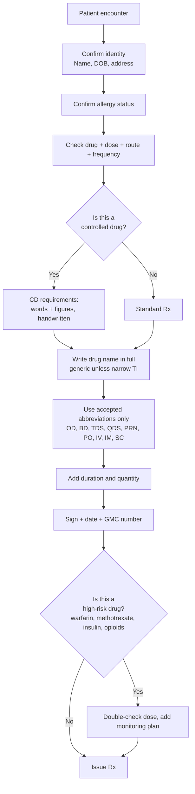
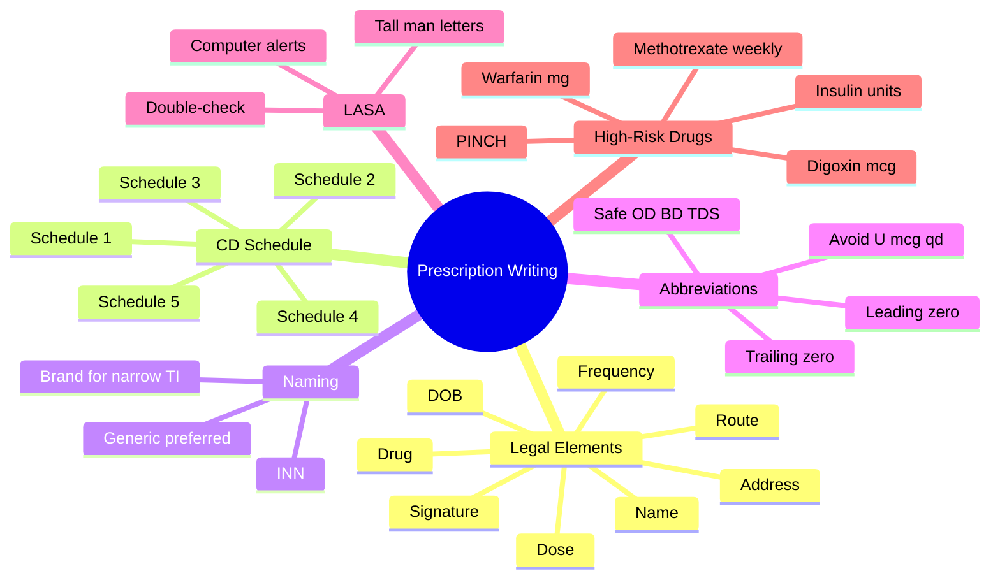

> [!info]
> **Disease-Level Topic** under **Principles of Rational Prescribing → Prescription Writing**.
> Davidson 24e Ch2 — "Introduction to Good Prescribing" (Maxwell SRJ).

## 1. 1. Learning Objectives
- [ ] Write a valid prescription meeting UK Misuse of Drugs / BNF standards
- [ ] Recall the **7 mandatory elements** of a legal prescription
- [ ] Differentiate between **generic** and **trade** (brand) names
- [ ] Identify controlled drug (CD) prescription requirements (Schedules 1-5)
- [ ] Recognise common prescribing errors (sound-alike, look-alike — LASA)
- [ ] Apply correct dose, route, frequency, and duration conventions
- [ ] Use appropriate abbreviations safely

## 2. 2. Legal Requirements of a UK Prescription (BNF / GPhC)

| Element | Example | Mandatory? |
|---------|---------|-----------|
| Patient's full name | "Mr John A SMITH" | ✓ |
| Patient's address | "12 High Street, London" | ✓ |
| Patient's date of birth / age | "DOB 01/01/1960 (66 yr)" | ✓ |
| Drug name (generic preferred) | "Amlodipine 5 mg tablets" | ✓ |
| Dose | "5 mg" | ✓ |
| Route | "Oral" (PO) | ✓ |
| Frequency | "Once daily" (OD) | ✓ |
| Quantity to dispense | "28 tablets" | ✓ (CDs) |
| Duration / course length | "For 28 days" | ✓ |
| Prescriber's signature | (handwritten, indelible) | ✓ |
| Prescriber's registration number | GMC No. 1234567 | ✓ |
| Date of issue | "15/06/2026" | ✓ |
| Practice / hospital address | "Royal London Hospital" | ✓ |

**Controlled drugs additionally require:**
- Dose in words AND figures (e.g., "50 mg — fifty mg")
- Total quantity in words AND figures
- Prescriber's address (NHS or private)
- Handwritten signature (no electronic)

## 3. 3. Mermaid Algorithm — Safe Prescription Writing

## 4. 4. Comparison Tables

### 1. 4.1 Common Abbreviations (Safe vs Unsafe)

| Abbreviation | Meaning | Safe? |
|--------------|---------|-------|
| **OD** | Once daily | ✓ |
| **BD** | Twice daily | ✓ |
| **TDS** | Three times daily | ✓ |
| **QDS** | Four times daily | ✓ |
| **PRN** | When required | ✓ |
| **PO / NG / PR** | Oral / Nasogastric / Rectal | ✓ |
| **IV / IM / SC** | Intravenous / Intramuscular / Subcutaneous | ✓ |
| **mane / nocte** | Morning / Night | ✓ |
| **stat** | Immediately | ✓ |
| **µg** | Microgram | ✓ (never write "mcg") |
| **U or u** | Unit | ✗ — write "units" (insulin) |
| **.X mg** (trailing zero) | E.g., "5.0 mg" | ✗ — never trailing zeros |
| **X.0 mg** (no leading zero) | E.g., ".5 mg" | ✗ — always use leading zero |
| **q.d / q.o.d** | Daily / every other day | ✗ — avoid (qd confused with qid) |
| **SC / SQ** | Subcutaneous | Avoid SQ; use SC |
| **MS / MSO4** | Morphine sulfate | ✗ — write in full |

### 2. 4.2 Generic vs Trade Naming

| Feature | Generic (INN) | Trade (Brand) |
|---------|--------------|---------------|
| **Definition** | International Non-proprietary Name | Manufacturer's brand name |
| **Example** | Amlodipine | Istin®, Amlostin® |
| **Cost** | Cheaper (no brand premium) | More expensive |
| **Bioequivalence** | Standard (within 80-125% of brand) | Reference |
| **Narrow TI drugs** | Use BRAND (e.g., theophylline, ciclosporin) | Brand consistency critical |
| **Recommended** | Yes (NHS, cost-effective prescribing) | Selective |

**Narrow therapeutic index drugs — always prescribe by brand:**
- Ciclosporin, tacrolimus (transplant)
- Theophylline (some brands)
- Carbamazepine (epilepsy, neuropathic pain)
- Phenytoin (epilepsy)
- Digoxin (in some trusts)
- Levothyroxine (consistency)

### 3. 4.3 UK Misuse of Drugs Act — Schedule Categories

| Schedule | Examples | Rx requirements |
|----------|----------|-----------------|
| **1** | Cannabis, LSD, MDMA (ecstasy) | None (no medicinal use) |
| **2** | Diamorphine (heroin), morphine, methadone, fentanyl, cocaine | Full CD Rx — handwritten, dose + quantity in words & figures, 28-day validity |
| **3** | Buprenorphine, temazepam, tramadol, gabapentin, pregabalin | Standard Rx (no CD form needed; some prescription-writing requirements) |
| **4** | Most benzodiazepines (diazepam, lorazepam) | Standard Rx |
| **5** | Codeine (<2.5 mg/mL), weak opioids | Standard Rx |

**Note:** 2019 re-classification: gabapentin and pregabalin became Schedule 3 CDs.

### 4. 4.4 Common LASA Drugs (Look-Alike, Sound-Alike)

| Drug 1 | Drug 2 | Risk |
|--------|--------|------|
| **Clozapine** | Clonidine | Antipsychotic vs antihypertensive |
| **Metformin** | Metronidazole | Diabetes vs anaerobes |
| **Amlodipine** | Amiloride | CCB vs K-sparing diuretic |
| **Prednisolone** | Prednisone | Dosing differs (prednisone requires liver conversion) |
| **Hydroxyzine** | Hydralazine | Antihistamine vs antihypertensive |
| **Sulfasalazine** | Sulfadiazine | DMARD vs antimicrobial |
| **Dalteparin** | Danaparoid | LMWH vs LMWH-like |
| **Rifampicin** | Rifaximin | TB vs gut-selective |

**Mitigation:** Tall man lettering (CLOZAPine, cloNIDine), computer alerts, double-check.

## 5. 5. FCPS/MRCP High-Yield Summary

| Pearl | Detail |
|-------|--------|
| 7 mandatory Rx elements | Name, address, DOB, drug, dose, route, frequency |
| 8th for CD | Quantity in words and figures |
| Generic name recommended | Yes (cost-effective) — except narrow TI drugs |
| Always write "microgram" not "mcg" or "µg" (BNF) | Avoid confusion with "mg" |
| Never write trailing zero ("5.0") | Risk of 10× overdose |
| Always use leading zero (".5" → "0.5") | Avoid 5× overdose |
| Methotrexate | Always weekly in RA, never daily (fatal pancytopenia) |
| Warfarin | Write dose in mg (not units) |
| Insulin | Write "units" not "U" — "10 U" → "100 units" error |
| High-risk drugs (PINCH) | Potassium, Insulin, Narcotics, Chemo, Heparin (and anticoagulants) |
| Prescription validity (UK) | 6 months NHS; 28 days for Schedule 2/3 CDs |
| Repeat prescriptions | Limited to 6 months supply without review |

## 6. 6. Viva Questions (10)

1. **List the 7 mandatory elements of a UK prescription.**
   *Patient name, address, DOB, drug, dose, route, frequency (plus prescriber signature, date, registration, duration, quantity).*

2. **What additional requirement applies to a controlled drug (Schedule 2) prescription?**
   *Dose and quantity in WORDS AND FIGURES; prescriber's address; handwritten signature; 28-day validity.*

3. **Why is "U" banned as an abbreviation for "units"?**
   *It is misread as "0" — 10U insulin → 100 units (10× overdose). Always write "units."*

4. **What is the difference between "5 mg" and "5.0 mg"?**
   *5 mg is correct. 5.0 mg has a TRAILING zero, which can be misread as 50 mg (10× overdose). NEVER use trailing zeros.*

5. **Which drugs should always be prescribed by BRAND name?**
   *Narrow therapeutic index drugs: ciclosporin, tacrolimus, theophylline, carbamazepine, phenytoin (per local policy).*

6. **A junior doctor writes "methotrexate 2.5 mg TDS." What is the error?**
   *Methotrexate in RA is WEEKLY, not three times daily. Daily dosing is fatal. The Rx should read "methotrexate 2.5 mg ONCE WEEKLY."*

7. **What does "PRN" mean? When should it be used?**
   *Pro Re Nata — "when required." Used for symptom relief (analgesia, antiemetics) with explicit indication, dose, and minimum interval (e.g., "PRN pain, max 4 doses/24 hr").*

8. **What is "tall man" lettering? Give an example.**
   *Mixed-case lettering for LASA drugs to highlight differences: CLOZAPine vs cloNIDine; prednisoLONE vs predniSONE; DOBUTamine vs DOPamine.*

9. **Why is "µg" or "mcg" problematic?**
   *µg can be misread as "mg" (1000× overdose). "mcg" can be misread as "mg" or "mEq." BNF recommends "microgram" in full.*

10. **What is the validity of an NHS prescription? A Schedule 2 CD?**
    *NHS Rx: 6 months. Schedule 2/3 CD Rx: 28 days.*

## 7. 7. Confusions & Mnemonics

| Confusion | Resolution |
|-----------|------------|
| Generic vs Trade | Generic = INN (amlodipine); Trade = brand (Istin®). Default to generic unless narrow TI. |
| mg vs mcg | 1 mg = 1000 microgram. Never abbreviate microgram; always write in full. |
| BD vs BID (US) | Both = twice daily. UK uses BD. |
| "Once daily" vs "mane" | Both morning. Use "OD" or "mane" consistently. |
| "As directed" | AVOID — ambiguous. Always specify dose, frequency, duration. |
| CD Schedules 1 vs 5 | Schedule 1 = no medicinal use; Schedule 5 = weakest Rx requirements. |
| Schedule 2 vs Schedule 3 | Both Rx-only, but Schedule 2 needs full CD Rx (words & figures). |
| Repeat Rx vs Acute Rx | Repeat Rx = ongoing medication (review 6-monthly); Acute Rx = one-off course. |
| Warfarin dose | Always mg, never units or fraction. INR-guided. |
| Insulin prescription | "X units" + brand (NovoRapid, Humalog) + device (pen, vial) |

**Mnemonic — 7 Rx essentials: "**N**ame **A**ddress **D**rug **D**ose **R**oute **F**requency **S**ignature"** (NADDRFS)

**Mnemonic — LASA mitigation: "**T**all **M**an **L**etters"** (T-M-L) + computer alerts + double-check

**Mnemonic — High-risk drugs: "**PINCH**"** (Potassium, Insulin, Narcotics, Chemo, Heparin) + **C** (anticoagulants) + **E** (Epoprostenol)

## 8. 8. Mermaid Mind Map

## 9. 9. Spaced Repetition Tracker

| Topic | Day 1 | Day 3 | Day 7 | Day 14 | Day 30 |
|-------|-------|-------|-------|-------|--------|
| 7 Rx elements | ☐ | ☐ | ☐ | ☐ | ☐ |
| CD Schedules | ☐ | ☐ | ☐ | ☐ | ☐ |
| Generic vs brand | ☐ | ☐ | ☐ | ☐ | ☐ |
| Safe abbreviations | ☐ | ☐ | ☐ | ☐ | ☐ |
| LASA examples | ☐ | ☐ | ☐ | ☐ | ☐ |
| Methotrexate weekly | ☐ | ☐ | ☐ | ☐ | ☐ |

## 10. 10. Self-Test Scorecard

| Domain | Score (0-5) |
|--------|-------------|
| 7 Rx elements | /5 |
| CD requirements | /5 |
| Generic vs brand | /5 |
| Safe abbreviations | /5 |
| LASA drugs | /5 |
| High-risk drug errors | /5 |
| **TOTAL** | **/30** |

## 11. 11. MCQs (10)

1. **Which of the following is NOT a mandatory element of a UK NHS prescription?**
   A. Patient name
   B. Patient address
   C. Patient's blood group ✓
   D. Drug name
   E. Prescriber signature

2. **Schedule 2 controlled drug prescription requires:**
   A. Generic name only
   B. Dose in words AND figures ✓
   C. No prescriber address
   D. Electronic signature
   E. 6-month validity

3. **The abbreviation "U" for "units" is unsafe because:**
   A. It is too long
   B. It can be misread as "0" → 10× dose error ✓
   C. It is not in BNF
   D. It is only US usage
   E. It is too informal

4. **Trailing zeros are dangerous because:**
   A. They slow writing
   B. "5.0" can be misread as "50" → 10× overdose ✓
   C. They are illegal
   D. They are not in BNF
   E. They cause decimal error

5. **Methotrexate in RA is given:**
   A. Daily
   B. Twice daily
   C. Once weekly ✓
   D. Monthly
   E. Continuous infusion

6. **Which drug should always be prescribed by BRAND?**
   A. Paracetamol
   B. Amoxicillin
   C. Tacrolimus ✓
   D. Ramipril
   E. Omeprazole

7. **"PRN" means:**
   A. Per rectum
   B. When required ✓
   C. By mouth
   D. Per nasal
   E. Per nebuliser

8. **Gabapentin and pregabalin are:**
   A. Schedule 1 CDs
   B. Schedule 2 CDs
   C. Schedule 3 CDs ✓
   D. Schedule 4 CDs
   E. Schedule 5 CDs

9. **Tall man lettering is used to:**
   A. Make drugs sound bigger
   B. Highlight LASA differences (e.g., CLOZAPine vs cloNIDine) ✓
   C. Confuse prescribers
   D. Mark high-risk drugs
   E. Indicate CDs

10. **Insulin should be prescribed as:**
    A. 10 U
    B. 10 units ✓
    C. 10 u
    D. 10 IU
    E. 10 cc

## 12. 12. SBAs (5)

1. **A doctor writes "Methotrexate 2.5 mg — take 1 tablet three times a day." This Rx is:**
   - A) Correct for RA
   - B) Dangerous — should be ONCE WEEKLY for RA, not TDS ✓
   - C) Correct for cancer
   - D) Acceptable if monitored
   - E) Safe if FBC done weekly

2. **A patient with epilepsy is on carbamazepine. The best prescription is:**
   - A) Carbamazepine generic — for cost saving
   - B) Carbamazepine BRAND — Tegretol® — for consistency ✓
   - C) Carbamazepine trade — variable brand
   - D) Oxcarbazepine substitution
   - E) Any formulation

3. **A junior doctor writes "5.0 mg warfarin." The pharmacist should:**
   - A) Dispense as written
   - B) Query the trailing zero — should be "5 mg" ✓
   - C) Refuse
   - D) Change to "5 mg" without consulting
   - E) Double the dose

4. **A controlled drug Rx (morphine) is missing the dose in words. The pharmacist should:**
   - A) Dispense anyway
   - B) Add the words
   - C) Refuse to dispense; request corrected Rx ✓
   - D) Phone GP
   - E) Substitute

5. **A patient is on "warfarin — take as directed." This is unsafe because:**
   - A) Warfarin is a CD
   - B) The dose is variable — must specify today's dose in mg ✓
   - C) Warfarin should be sublingual
   - D) Warfarin is given IV
   - E) No monitoring needed

## 13. 13. Answer Key

### 1. MCQ Answers
1. **C** (Blood group not required; mandatory = Name, Address, DOB, Drug, Dose, Route, Frequency, Signature)
2. **B** (CD Sched 2: dose + quantity in words and figures)
3. **B** (U → 0 confusion → 10× dose)
4. **B** (5.0 → 50, 10× overdose)
5. **C** (Weekly — daily is fatal)
6. **C** (Tacrolimus = narrow TI)
7. **B** (Pro Re Nata = when required)
8. **C** (Schedule 3 since 2019)
9. **B** (Tall man = LASA mitigation)
10. **B** (10 units; never "U" or "u")

### 2. SBA Answers
1. **B** — Methotrexate in RA is weekly; daily is fatal pancytopenia.
2. **B** — Carbamazepine (narrow TI) prescribed by brand.
3. **B** — Trailing zero dangerous; "5 mg" correct.
4. **C** — CD Rx must have dose in words and figures; cannot dispense.
5. **B** — Warfarin dose varies; "as directed" ambiguous. Specify today's mg dose.

## 14. 14. Summary Box

> **Prescription essentials: Name, Address, DOB, Drug, Dose, Route, Frequency, Duration, Quantity, Signature, Date, GMC.** Use generic INN (except narrow TI drugs: ciclosporin, tacrolimus, carbamazepine, phenytoin). For CDs (Sched 2): dose in words AND figures, 28-day validity. **NEVER** use trailing zeros, leading decimal points, or "U" for units. **Methotrexate = WEEKLY** in RA. **Tall man** letters mitigate LASA risk.

---

## 15. 15. Cross-Links
- **Parent Topic-Group**: [[../Principles of Rational Prescribing|Principles of Rational Prescribing]]
- **Sibling Topic-Groups**: [[Definition and aims]], [[Steps of rational prescribing]], [[Evidence-based prescribing]]
- **Heading Hub**: [[Principles of Rational Prescribing]]
- **Chapter MOC**: [[Clinical Therapeutics and Good Prescribing MOC]]
- **Related**: [[Medication Safety and Errors]], [[Polypharmacy and Deprescribing]]

**Last Updated:** 2026-06-15  
**Status: FULLY COMPLETE with Exam Suite (Viva 10, MCQ 10, SBA 5, Answer Key, Confusions, Mind Map, Spaced Repetition, Self-Test, Exam Modes)**
