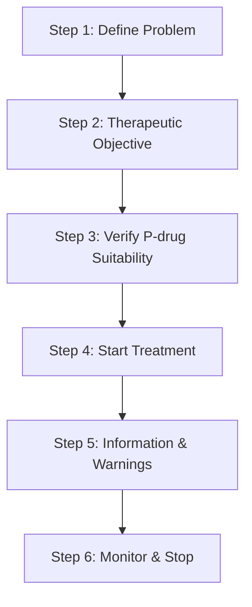
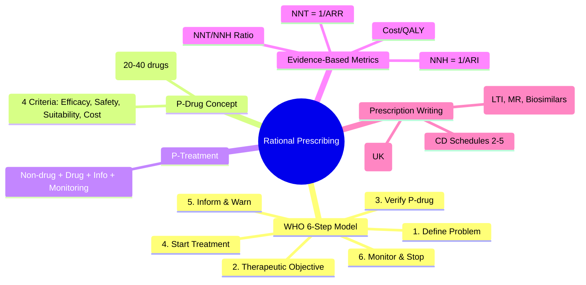

> [!tip] **FCPS/MRCP Priority: HIGH**
> **Core prescribing framework:** WHO 6-Step Model → P-drug concept → Evidence-based selection → Legal prescription writing
> Viva classic: *"A 65-year-old man with new hypertension. Walk me through your prescribing process."*

---

## 1. 1. Learning Objectives
By the end of this note you should be able to:
- [ ] Apply **WHO 6-Step Rational Prescribing Model** to any clinical scenario
- [ ] Define **P-drug** and **P-treatment** and construct a personal formulary
- [ ] Calculate and interpret **NNT, NNH, and NNT/NNH ratio** for clinical decisions
- [ ] Write a **legally compliant UK prescription** including controlled drugs
- [ ] Distinguish **generic vs brand prescribing** indications (LTI drugs, MR formulations)

---

## 2. 2. Definition & Core Concepts

| Concept | Definition |
|---------|------------|
| **Rational Prescribing** | Process ensuring: Right patient, Right drug, Right dose, Right route, Right time, Right duration, Right cost, Right monitoring |
| **P-drug (Personal Drug)** | Drug selected by individual prescriber for a specific indication based on **Efficacy, Safety, Suitability, Cost** |
| **P-treatment** | Complete management plan: **Non-drug therapy + Drug + Patient information + Monitoring plan** |
| **Personal Formulary** | 20-40 P-drugs covering ~80% of prescribing needs; Evidence-based; Regularly reviewed |

### 1. P-drug Selection Criteria (WHO)
| Criterion | Assessment |
|----------|------------|
| **Efficacy** | NNT for primary outcome; Superiority vs alternatives |
| **Safety** | ADR profile; Contraindications; Interaction potential; Monitoring needs |
| **Suitability** | Patient factors (Age, Renal/Hepatic fn, Comorbidities, Pregnancy, Adherence, Preferences) |
| **Cost** | Total treatment cost (Drug + Monitoring + ADR management); Cost-effectiveness (£/QALY) |

---

## 3. 3. WHO 6-Step Rational Prescribing Model

### 1. Step 1: Define the Patient's Problem
- **Accurate diagnosis** (Clinical + Investigations)
- **Problem list** — Not just diagnosis; Include comorbidities, social factors
- **Patient context** — Age, Renal/Hepatic function, Allergies, Current drugs, Pregnancy, Preferences, Health literacy

### 2. Step 2: Specify the Therapeutic Objective
| Objective | Example |
|-----------|---------|
| **Cure** | Antibiotics for pneumonia |
| **Control** | BP <130/80 in hypertension; HbA1c <53 in T2DM |
| **Palliate** | Morphine for cancer pain; Diuretics for HF symptoms |
| **Prevent** | Statin for CVD primary prevention; Vaccination |
- **Must be MEASURABLE** (Target BP, HbA1c, LDL, Pain score, FEV1)
- **Shared decision-making** — Agree goals with patient

### 3. Step 3: Verify Suitability of P-drug
- **Check against 4 criteria:** Efficacy, Safety, Suitability, Cost
- **Screen for:** Contraindications, Drug interactions, Allergies, Organ dysfunction (Renal/Hepatic), Pregnancy/Lactation, Adherence barriers
- **Patient-specific:** Age (Beers/STOPP), Frailty, Cognitive function, Swallowing difficulty, Cost to patient

### 4. Step 4: Start the Treatment
- **Prescribe by Generic (INN)** — Except LTI drugs, MR formulations, biosimilars
- **Clear instructions:** Dose, Route, Frequency, Duration, Formulation
- **Start low, go slow** — Especially elderly, renal/hepatic impairment, polypharmacy
- **Consider formulation:** Liquid if dysphagia; MR vs IR; Transdermal if GI issues

### 5. Step 5: Give Information, Instructions, and Warnings
| Content | What to Communicate |
|---------|---------------------|
| **Information** | What drug, Why, Expected benefit, Time to effect |
| **Instructions** | How to take (Food, Timing, Technique), Missed dose, Storage |
| **Warnings** | **Key ADRs** (Common + Serious), When to seek help, Driving/Alcohol/OTC cautions, Monitoring requirements |

### 6. Step 6: Monitor (Stop) Treatment
- **Efficacy monitoring:** Clinical review, Labs (BP, HbA1c, Lipids, U&Es, LFTs), PROs
- **Safety monitoring:** Labs (Renal, Hepatic, FBC, Electrolytes), ADR surveillance, TDM if indicated
- **Stop criteria:** Goal achieved, Intolerance/ADR, Futility (no response), Patient choice, Deprescribing indication
- **Deprescribing** — Systematic review at every encounter (STOPP/START)

---

## 4. 4. P-drug vs P-treatment Example: Hypertension

| Component | Detail |
|-----------|--------|
| **P-drug** | **Amlodipine 5mg OD** (EDHF/ACEi contraindicated/black African/Caribbean) |
| **Non-drug** | DASH diet, Salt <6g, Exercise 150min/wk, Weight loss, Alcohol <14u, Smoking cessation |
| **Drug** | Amlodipine 5mg OD → Titrate to 10mg; Add ACEi/ARB if not at target |
| **Information** | "Takes 2-4 weeks for full effect; May cause ankle swelling; Take morning" |
| **Monitoring** | BP q2-4wk until controlled; U&Es at 1-2wk, then 6-monthly; Review at 3/6/12 months |

---

## 5. 5. Evidence-Based Prescribing Metrics

| Metric | Formula | Clinical Use |
|--------|---------|--------------|
| **ARR (Absolute Risk Reduction)** | CER - EER | Absolute benefit |
| **RRR (Relative Risk Reduction)** | (CER - EER) / CER | Often misleading alone |
| **NNT (Number Needed to Treat)** | 1 / ARR | Patients to treat for 1 additional benefit |
| **ARI (Absolute Risk Increase)** | EER - CER | Absolute harm |
| **NNH (Number Needed to Harm)** | 1 / ARI | Patients to treat for 1 additional harm |
| **NNT/NNH Ratio** | NNT ÷ NNH | Benefit:Harm balance (Lower = Better) |

### 1. Example: Statin Primary Prevention (5-year)
- MI Risk: Control 5.7% → Statin 3.9% → **ARR 1.8% → NNT = 56**
- Diabetes Risk: Control 3.0% → Statin 3.6% → **ARI 0.6% → NNH = 167**
- **NNT/NNH = 0.33** — Favourable benefit:harm

### 2. NICE Cost-Effectiveness Thresholds
- **£20,000-30,000/QALY** — Standard
- **>£30,000/QALY** — End of life, Innovation, Severe disease

---

## 6. 6. Prescription Writing Standards (UK Legal Requirements)

### 1. Standard Prescription (Human Medicines Regulations 2012)
| Required Element | Details |
|------------------|---------|
| **Patient** | Name, DOB, Address |
| **Drug** | **Generic/INN** (Preferred); Brand only if justified |
| **Dose** | Strength, Route, Frequency |
| **Quantity** | **In words AND figures** (e.g., "Twenty-eight (28) tablets") |
| **Prescriber** | Signature, **GMC Number**, Practice Address, Date |

### 2. Controlled Drug Prescriptions (Misuse of Drugs Regulations 2001)

| Schedule | Examples | Additional Requirements | Validity | Repeats |
|----------|----------|------------------------|----------|---------|
| **Sch 2 (CD POM)** | Morphine, Diamorphine, Fentanyl, Oxycodone, Methadone, Methylphenidate, Ketamine | Form, Strength, **Total qty words+figures**, Dose | **28 days** | **No** |
| **Sch 3 (CD POM no register)** | Buprenorphine, Temazepam, Midazolam, Tramadol, Pregabalin, Gabapentin | Same as Sch 2 | 28 days | No |
| **Sch 4 (CD Benzodiazepines/Anabolic)** | Diazepam, Lorazepam, Clonazepam, Testosterone | Standard prescription | 28 days | No |
| **Sch 5 (CD Exempt)** | Codeine ≤100mg, Dihydrocodeine ≤50mg, Loperamide | Standard | 6 months | Yes |

### 3. Generic vs Brand — When to Prescribe by Brand
| Situation | Examples | Reason |
|-----------|----------|--------|
| **Narrow TI (LTI)** | Phenytoin, Carbamazepine, Phenobarbital, Valproate, Lamotrigine, Lithium, Digoxin, Theophylline, Warfarin, Tacrolimus, Ciclosporin, Sirolimus | Small PK differences → Toxicity/Loss of control |
| **Modified Release** | Lithium (Priadel vs Camcolit), Mesalazine, Nifedipine, Diltiazem, Verapamil, Morphine MR, Oxycodone MR | Release profile not interchangeable |
| **Biosimilars** | Infliximab, Adalimumab, Etanercept, Rituximab, Trastuzumab | Immunogenicity, Efficacy differences |
| **Patient stabilised** | Any drug where switch caused clinical deterioration | Continuity of care |

---

## 7. 7. FCPS/MRCP High-Yield Points

| Topic | Key Points |
|-------|------------|
| **WHO 6 Steps** | Define → Objective → Verify P-drug → Start → Inform → Monitor/Stop |
| **P-drug Criteria** | **Efficacy, Safety, Suitability, Cost** |
| **NNT/NNH** | NNT = 1/ARR; NNH = 1/ARI; Ratio = Benefit:Harm |
| **Prescription Legal** | Name, DOB, Address, Generic, Dose/Route/Freq, Qty words+figures, Sign, GMC, Date |
| **CD Prescription** | Sch 2/3: Form, Strength, Qty words+figures, Dose, No repeats, 28-day validity |
| **Brand Prescribing** | LTI drugs, MR formulations, Biosimilars, Stabilised patient |
| **Start Low, Go Slow** | Elderly, Renal/Hepatic impairment, Polypharmacy |

---

## 8. 8. Common Viva Questions (MRCP PACES / FCPS)

| Question | Expected Answer |
|----------|-----------------|
| **Walk me through rational prescribing for a new hypertensive patient** | WHO 6 steps: 1. Diagnose HTN + assess CV risk/comorbidities → 2. Target BP <130/80 (or <140/90 if >80/frail) → 3. P-drug: Amlodipine (if black/elderly) or ACEi/ARB; Check renal fn, K, contraindications → 4. Start low (Amlodipine 5mg) → 5. Info: Morning, ankle swelling, 2-4wk for effect → 6. Monitor: BP q2-4wk, U&Es 1-2wk then 6-monthly; Deprescribe if hypotensive |
| **What is a P-drug? How does it differ from P-treatment?** | P-drug = Single drug for indication chosen by 4 criteria; P-treatment = Complete plan (Non-drug + Drug + Info + Monitoring) |
| **Calculate NNT: Control event rate 10%, Treatment event rate 7%** | ARR = 3% → NNT = 1/0.03 = **33** |
| **Legal requirements for a morphine prescription** | Schedule 2: Patient details, Drug (Morphine), Form (Tabs/Inj), Strength, Dose, **Total qty in words AND figures**, Prescriber sign + GMC + address + date, **No repeats, 28-day validity** |
| **When would you prescribe a brand instead of generic?** | LTI drugs (Phenytoin, Lithium, Warfarin, Tacrolimus), MR formulations, Biosimilars, Patient stabilised on brand |

---

## 9. 9. Confusions & Mnemonics

| Confusion | Clarification |
|-----------|---------------|
| **P-drug vs Essential Medicines List** | P-drug is **personal** to prescriber; EML is **national/population** list |
| **NNT vs RRR** | RRR = 33% sounds impressive; ARR = 1% → NNT = 100 (True magnitude) |
| **Generic substitution vs Brand prescribing** | Pharmacist substitutes generic; Prescriber writes brand — Different legal acts |
| **CD Schedule 2 vs 3** | Sch 2 = Register required (Morphine, Fentanyl); Sch 3 = No register (Tramadol, Pregabalin) |

**Mnemonic: PRESCRIBE**
- **P**roblem defined (Diagnosis + Context)
- **R**ational objective (Measurable target)
- **E**vidence-based P-drug (Efficacy, Safety, Suitability, Cost)
- **S**tart low, go slow
- **C**ommunicate (Info, Instructions, Warnings)
- **R**eview (Monitor efficacy + safety)
- **I**ndividualise (Renal, Hepatic, Age, Pregnancy)
- **B**rand only if LTI/MR/Biosimilar
- **E**nd (Stop/Deprescribe) when goal met or harm

---

## 10. 10. Mind Map

---

## 11. 11. Spaced Repetition Trackers

| Review Interval | Date Completed | Confidence (1-5) | Notes |
|-----------------|----------------|------------------|-------|
| 24 hours | | | |
| 7 days | | | |
| 15 days | | | |
| 30 days | | | |
| 90 days | | | |

---

## 12. 12. Self-Test Scorecard

| Section | Score /5 | Last Attempt |
|---------|----------|--------------|
| WHO 6-Step Model | | |
| P-drug Criteria | | |
| NNT/NNH Calculations | | |
| Prescription Legal Requirements | | |
| CD Prescription Rules | | |
| Generic vs Brand Indications | | |

---

## 13. 13. Exam Answer Modes

### 1. Long Answer Skeleton
1. Define rational prescribing (WHO definition)
2. Apply 6-step model to clinical scenario
3. Justify P-drug selection using 4 criteria
3. Write compliant prescription
4. Plan monitoring and deprescribing

### 2. Short Note Skeleton
- **WHO 6 Steps:** Define → Objective → Verify → Start → Inform → Monitor
- **P-drug:** Efficacy, Safety, Suitability, Cost
- **NNT:** 1/ARR; **NNH:** 1/ARI

### 3. Viva One-Liners
- "Rational prescribing = Right drug, Right patient, Right dose, Right time, Right monitoring, Right cost"
- "P-drug is personal; EML is population"
- "NNT tells you how many to treat for one benefit; NNH tells you how many for one harm"

### 4. Ward-Case Discussion Points
- New prescription: Always check renal function, allergies, current meds, indication
- Discharge: Medication reconciliation — Stop unnecessary, Deprescribe (STOPP/START), Communicate changes

### 5. Last-Night-Before-Exam Sheet
- WHO 6 Steps: **D-O-V-S-I-M** (Define, Objective, Verify, Start, Inform, Monitor)
- P-drug 4 criteria: **E-S-S-C** (Efficacy, Safety, Suitability, Cost)
- CD Rx: **Form, Strength, Qty Words+Figures, Dose, No Repeats, 28 Days**
- Brand: **LTI, MR, Biosimilar, Stabilised**

---

## 14. 14. Summary
Rational prescribing is a **systematic, evidence-based, patient-centred process** (WHO 6 steps). The **P-drug concept** personalises drug selection using explicit criteria. **NNT/NNH** quantify benefit-harm balance. **Legal prescription writing** requires specific elements, especially for controlled drugs. **Generic prescribing** is default; **brand prescribing** is reserved for LTI drugs, MR formulations, biosimilars, and stabilised patients.

---

## 15. 15. MCQs (10)
1. **Which step in WHO 6-step model involves checking contraindications and interactions?**
   A. Step 1  B. Step 2  C. **Step 3**  D. Step 4
2. **NNT is calculated as:**
   A. 1/RRR  B. **1/ARR**  C. 1/ARI  D. RRR/ARR
3. **A Schedule 2 CD prescription requires:**
   A. Repeat dispensing allowed  B. **Quantity in words and figures**  C. 6-month validity  D. No prescriber signature
4. **Which drug should be prescribed by brand due to narrow therapeutic index?**
   A. Amlodipine  B. **Phenytoin**  C. Paracetamol  D. Omeprazole
5. **P-treatment includes all EXCEPT:**
   A. Non-drug therapy  B. Drug  C. Patient information  D. **Pharmaceutical marketing material**
6. **NICE cost-effectiveness threshold (standard):**
   A. £10,000/QALY  B. **£20,000-30,000/QALY**  C. £50,000/QALY  D. £100,000/QALY
7. **Schedule 3 CD validity:**
   A. 28 days  B. **28 days**  C. 6 months  D. 12 months
8. **RRR vs ARR — Which is more clinically meaningful?**
   A. RRR  B. **ARR**  C. Both equal  D. Neither
9. **Start low, go slow applies MOST to:**
   A. Young healthy adult  B. **Elderly with renal impairment**  C. Acute severe pain  D. Antibiotic for pneumonia
10. **Algorithm for brand prescribing:** 
    A. Always brand  B. **Generic default; Brand for LTI/MR/Biosimilar/Stabilised**  C. Brand for cheap drugs  D. Brand for new drugs

---

## 16. 16. SBA Questions (10)
1. **A 72-year-old man with CKD Stage 3 (eGFR 42) starts amlodipine 5mg for hypertension. Which WHO step addresses renal dose adjustment?**
   A. Step 1  B. Step 2  C. **Step 3**  D. Step 4
2. **In a trial, MI rate is 8% control vs 5% treatment. NNT = ?**
   A. 20  B. **33**  C. 40  D. 67
3. **A patient on warfarin develops SJS after starting allopurinol. WHO-UMC causality?**
   A. Certain  B. **Probable**  C. Possible  D. Unlikely
4. **Which CD schedule requires a controlled drug register?**
   A. Schedule 2  B. Schedule 3  C. Schedule 4  D. Schedule 5
5. **NNT/NNH ratio of 0.5 indicates:**
   A. Harm > Benefit  B. **Benefit > Harm**  C. Equal  D. Cannot determine
6. **A prescription for morphine sulfate 10mg tablets x 56. Legal requirement for quantity?**
   A. "56 tablets"  B. **"Fifty-six (56) tablets"**  C. "Seven weeks supply"  D. "As directed"
7. **Valproate is prescribed by brand because:**
   A. It's cheaper  B. **Narrow therapeutic index; Small PK changes → Toxicity/Seizures**  C. Patient preference  D. No generic available
8. **SSRI started. Patient counselled on driving. Which WHO step?**
   A. Step 1  B. Step 2  C. Step 3  D. **Step 5**
9. **Statin primary prevention: ARR 1.5% over 5 years. NNT = ?**
   A. 50  B. **67**  C. 75  D. 100
10. **Deprescribing review at every encounter uses which tool?**
    A. NNT  B. **STOPP/START**  C. Naranjo  D. RUCAM

---

## 17. 17. Flashcards
- Q: **WHO 6-Step Model mnemonic?**
  A: **DOV SIM** (Define, Objective, Verify, Start, Inform, Monitor)
- Q: **P-drug 4 criteria?**
  A: **ESSC** (Efficacy, Safety, Suitability, Cost)
- Q: **What makes a drug LTI (prescribe by brand)?**
  A: Narrow TI + High protein binding + Low Vd + Metabolic displacement risk (Phenytoin, Lithium, Warfarin, Tacrolimus, Digoxin, Theophylline)
- Q: **CD Sch 2 prescription validity?**
  A: **28 days**; No repeats; Register required
- Q: **NNT formula?**
  A: **1 / Absolute Risk Reduction (ARR)**

---

## 18. 18. Answer Key with Explanations

### 1. MCQs
1. **C (Step 3)** — Verify P-drug suitability includes contraindications, interactions, allergies, organ function
2. **B (1/ARR)** — NNT = 1 / Absolute Risk Reduction; RRR is relative
3. **B** — Sch 2 CD: Quantity in words AND figures; No repeats; 28-day validity; Register entry
4. **B (Phenytoin)** — LTI anticonvulsant; Brand prescribing required
5. **D** — P-treatment = Non-drug + Drug + Info + Monitoring; No marketing
6. **B** — NICE threshold £20,000-30,000/QALY
7. **B** — Sch 3 also 28-day validity (Tramadol, Pregabalin, Gabapentin, Midazolam, Buprenorphine, Temazepam)
8. **B** — ARR (and NNT) give absolute magnitude; RRR can be misleading
9. **B** — Elderly + Renal impairment = Start low, go slow
10. **B** — Generic default; Brand only for LTI, MR, Biosimilar, Stabilised patient

### 2. SBAs
1. **C (Step 3)** — Verify suitability checks renal function, contraindications, interactions before starting
2. **B (33)** — ARR = 3% → NNT = 1/0.03 = 33.3
3. **B (Probable)** — Plausible time, drug known to cause SJS (HLA-B*58:01), dechallenge positive
4. **A (Schedule 2)** — Morphine, Fentanyl, Oxycodone, Methadone, Methylphenidate, Ketamine
5. **B (Benefit > Harm)** — NNT/NNH <1 means fewer patients needed to treat for benefit than for harm
6. **B** — Quantity MUST be in words AND figures for CD prescriptions
7. **B** — LTI: Narrow TI + PK variability → Brand consistency critical
8. **D (Step 5)** — Information, instructions, warnings (side effects, driving)
9. **B (67)** — NNT = 1/0.015 = 66.7
10. **B (STOPP/START)** — Structured deprescribing/prescribing review tool for elderly

---

## 19. 19. Local Navigation
- **Parent Heading**: [[Principles of Rational Prescribing|Principles of Rational Prescribing]]
- **Chapter Map**: [[Davidson Chapter 2 - Clinical Therapeutics Hierarchy|Chapter 2 Hierarchy]]
- **Chapter MOC**: [[Clinical Therapeutics and Good Prescribing MOC]]
- **Related**: [[Prescription Writing Standards]], [[Evidence-Based Prescribing]], [[P-drug Concept]], [[NNT NNH]], [[Formulary Decisions]], [[Prescription Writing]]

## PasTest Scenario SBAs (Clinical Vignettes)

> **Auto-generated PasTest/Mediscope-style scenario SBAs** grounded in the authored source. Each scenario tests a real clinical fact (triad, specific sign, contraindication, trial, first-line Rx) extracted from the topic. *Source: Ch 2: Clinical Therapeutics — Principles of Rational Prescribing*

**Q1.** What is the most appropriate first-line therapy for Principles of Rational Prescribing?

  - **A.** Information
  - **B.** An advanced/surgical therapy reserved for refractory disease
  - **C.** Symptomatic treatment only, no disease-modifying therapy
  - **D.** Empiric broad-spectrum therapy without specific indication

  > **Answer: A** — Information
  >
  > *Source:* **Information**   "Takes 2-4 weeks for full effect; May cause ankle swelling; Take morning"

