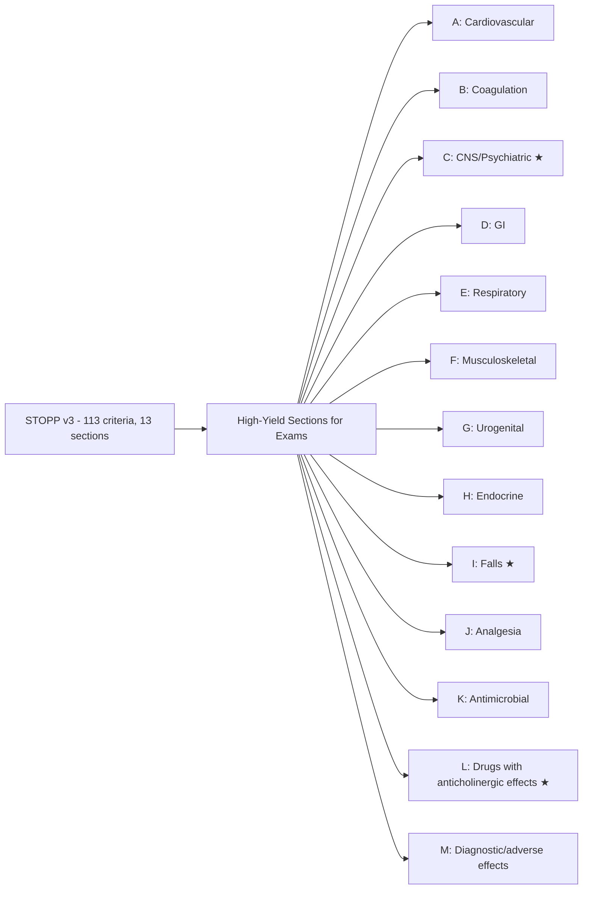
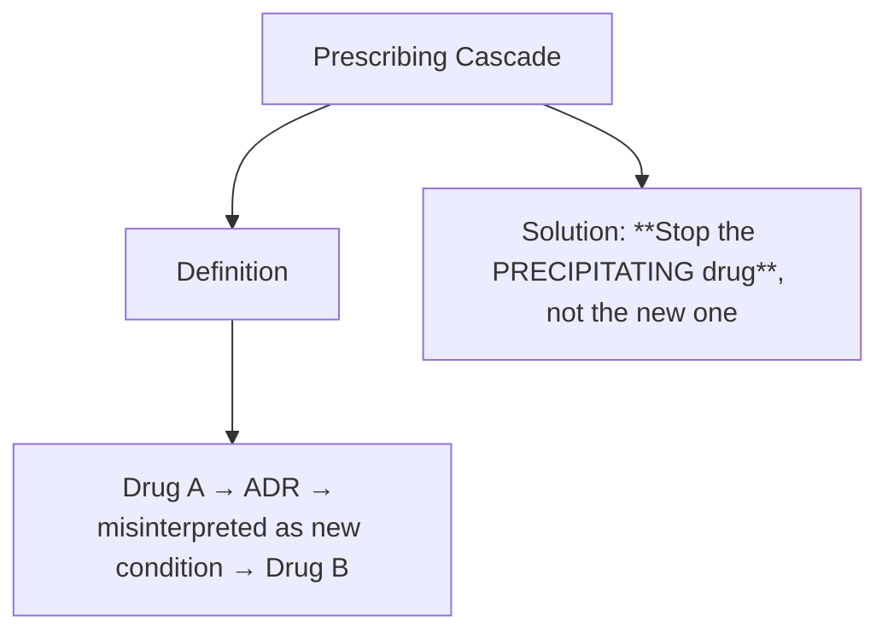

> [!tip] **FCPS/MRCP Priority: HIGHEST**
> **Core geriatric prescribing** — tested in every ward round, SBA, and viva. STOPP/START v3 is explicit examiner favourite. ACB/FORTA/Beers = quick screening tools. Cockcroft-Gault for dosing is NON-NEGOTIABLE (not eGFR).
> Viva classic: *"80-year-old on 14 medications, recent falls and confusion. Conduct a structured medication review."*

---

## 1. 1. Learning Objectives

By the end of this note you should be able to:
- [ ] Apply **STOPP/START v3 criteria** confidently in ward rounds and SBAs
- [ ] Calculate and interpret **Anticholinergic Cognitive Burden (ACB)**, **Drug Burden Index (DBI)**, **Fit-for-the-Aged (FORTA)** scores
- [ ] Adjust doses for **renal/hepatic impairment** using **Cockcroft-Gault** (not eGFR), CKD-EPI, Child-Pugh
- [ ] Recognise and prevent **prescribing cascades** (10 classic patterns)
- [ ] Select **safer alternatives** for high-risk drug classes (Beers, STOPP, FORTA-D)
- [ ] Conduct **structured medication review** (polypharmacy, deprescribing) using 5-step frameworks
- [ ] Communicate **risk-benefit** in frailty / limited life expectancy (time-to-benefit)
- [ ] Answer viva: "STOPP/START criteria" and "Prescribing cascade examples" and "Apixaban renal dosing"

---

## 2. 2. Core Concept: Age-Related Pharmacokinetic & Pharmacodynamic Changes

```mermaid
flowchart TD
    A[Ageing Physiology] --> B[PK Changes]
    A --> C[PD Changes]
    A --> D[Clinical Consequences]
    
    B --> B1[↓ Total Body Water\n↑ Body Fat\n→ ↑ Vd lipophilic drugs (diazepam, amiodarone)]
    B --> B2[↓ Renal function ~1 mL/min/yr after 40\n→ ↓ clearance renally excreted drugs\n**Use Cockcroft-Gault for dosing**]
    B --> B3[↓ Hepatic Phase I (oxidation)\nPhase II (glucuronidation) preserved\n→ ↓ clearance: warfarin, phenytoin, theophylline, benzos]
    B --> B4[↓ Protein binding (↓ albumin)\n→ ↑ free fraction acidic drugs (warfarin, phenytoin)]
    
    C --> C1[↑ BBB permeability\n→ ↑ CNS sensitivity: opioids, anticholinergics, gabapentinoids]
    C --> C2[Impaired homeostasis\n→ orthostatic hypotension, thermoregulation, hyponatraemia risk]
    C --> C3[↓ Physiological reserve (frailty)\n→ non-linear dose-response\n→ ↑ ADR susceptibility]
    
    D --> D1[↑ Falls, delirium, cognitive decline]
    D --> D2[↑ Hospitalisation, mortality]
    D --> D3[**Time-to-benefit critical** (statins 2–3y, bisphosphonates 1–2y)]
    
    style A fill:#e3f2fd
    style D fill:#fce4ec
```

> **Key Principle:** *Prescribing in the elderly is not "adult dosing minus a bit" — it requires explicit tools (STOPP/START, ACB, FORTA), renal dosing via Cockcroft-Gault, and deprescribing mindset.*

---

## 3. 3. STOPP/START Criteria v3 (2023) — HIGH YIELD

### 1. 2.1 STOPP (Screening Tool of Older People's Potentially Inappropriate Prescriptions)



| Section | Key Criteria (Must Know for FCPS/MRCP) |
|---------|----------------------------------------|
| **A. Cardiovascular** | A1: Loop diuretic for ankle oedema only (no HF) — use leg elevation/compression
A2: β-blocker + non-dihydropyridine CCB (bradycardia/heart block)
A3: Verapamil/diltiazem + HFrEF (↓ contractility)
A4: ACEi/ARB + K⁺-sparing diuretic + no K⁺ monitoring (hyperK) |
| **B. Coagulation** | B1: Warfarin + NSAID (↑ bleed) — use PPI if unavoidable
B2: DOAC + strong P-gp/CYP3A4 inhibitor (clarithro, azole) — dose adjust/avoid
B3: Aspirin + anticoagulant without clear indication (stable CAD + AF) |
| **C. CNS/Psych ★** | **C1: Anticholinergic burden ≥3 (ACB ≥3)** — ↓ cognition, ↑ falls
**C2: Benzodiazepine/Z-drug >4 weeks** — falls, fractures, delirium
C3: Antipsychotic for BPSD >12 weeks without review
C4: SSRI + hyponatraemia risk (SIADH) — monitor Na⁺ |
| **D. GI** | D1: PPI >8 weeks uncomplicated GERD — step down/stop
D2: NSAID + peptic ulcer history — avoid or PPI co-Rx
D3: Antispasmodic (hyoscine) in cognitive impairment |
| **E. Respiratory** | E1: Theophylline (narrow TI, interactions) — prefer LABA/LAMA
E2: Systemic steroid >3 months — bone protection, monitor |
| **F. Musculoskeletal** | F1: NSAID + HF/CKD/HTN uncontrolled — avoid
F2: Long-term opioid non-cancer pain — review, taper |
| **G. Urogenital** | G1: Antimuscarinic (oxybutynin) in cognitive impairment — use mirabegron/solifenacin |
| **H. Endocrine** | H1: Sulfonylurea (glibenclamide) in elderly — hypoglycaemia; prefer gliclazide/DPP-4/SGLT2
H2: Insulin sliding scale alone — use basal-bolus |
| **I. Falls ★** | **I1: ≥2 fall-risk drugs (anticholinergic, sedative, antihypertensive, opioid)** — review |

### 2. 2.2 START (Screening Tool to Alert to Right Treatment)

| Category | Key Omissions to Screen |
|----------|------------------------|
| **Cardiovascular** | Anticoagulant if AF + CHA₂DS₂-VASc ≥2 (male) / ≥3 (female)
ACEi/ARB if HFrEF / post-MI / diabetic nephropathy
Statin if CVD / diabetes >40 / CKD |
| **Respiratory** | LAMA/LABA if COPD + dyspnoea
ICS+LABA if asthma + exacerbations |
| **CNS** | Antidepressant if moderate-severe depression
Cholinesterase inhibitor if mild-moderate Alzheimer's
Memantine if moderate-severe Alzheimer's |
| **Musculoskeletal** | Vitamin D + calcium if osteoporosis / high fall risk
Bisphosphonate if osteoporotic fracture / T-score ≤-2.5 |
| **Endocrine** | Metformin if T2DM + eGFR >30
SGLT2i if T2DM + CKD/HF |
| **Urogenital** | Mirabegron if OAB + cognitive impairment |

> **Viva Key:** *STOPP = **S**top **P**otentially **I**nappropriate **P**rescriptions. START = **S**creening **T**ool to **A**lert doctors to **R**ight **T**reatment.*

---

## 4. 4. Prescribing Burden Quantification Tools

### 1. 3.1 Anticholinergic Cognitive Burden (ACB) Scale

| Score | Drugs (Examples) |
|-------|------------------|
| **0** | Most antibiotics, antihypertensives, statins, PPIs, metformin |
| **1** | Ranitidine, paroxetine, nortriptyline, quetiapine, digoxin, prednisolone, solifenacin, citalopram |
| **2** | Amitriptyline (some scales), doxepin, chlorpheniramine, cyproheptadine |
| **3** | **Amitriptyline, imipramine, doxepin >50mg, chlorpromazine, olanzapine, clozapine, oxybutynin, tolterodine, diphenhydramine, hydroxyzine, cyclizine, promethazine, scopolamine, atropine, benztropine, trihexyphenidyl** |

**Target: ACB <3** (each point ↑ falls 1.2×, delirium 1.5×, cognitive decline)

### 2. 3.2 Drug Burden Index (DBI)

$$DBI = \sum \frac{D}{D + \delta}$$

- D = daily dose; δ = dose for 50% max effect
- **Components**: **Sedative** (BZD, Z-drugs, opioids, gabapentinoids, antihistamines) + **Anticholinergic**
- **DBI ≥1**: ↑ falls, ↓ function, ↑ hospitalisation

### 3. 3.3 FORTA (Fit fOR The Aged) Classification

| Class | Meaning | Action | Examples |
|-------|---------|--------|----------|
| **A** | **Absolutely** indicated, clear benefit | Continue / start | ACEi in HFrEF, statin in secondary prevention, metformin in T2DM |
| **B** | **Beneficial** but limited evidence / caution | Use with monitoring | Beta-blocker in HTN (less preferred), DOAC in AF (renal dose adjust) |
| **C** | **Careful** — questionable benefit / risk > benefit | Review, consider alternative | Digoxin in AF (narrow TI), amiodarone (long-term toxicity) |
| **D** | **Don't** — avoid, safer alternatives exist | **Deprescribe** | **Diphenhydramine, amitriptyline, long-acting benzos, glibenclamide, NSAIDs in CKD/HF** |

> **FORTA = F**it **f**o**R** **T**he **A**ged

### 4. 3.4 Beers Criteria (AGS 2023) — Key "Avoid" List

| Drug/Class | Reason | Alternative |
|------------|--------|-------------|
| **Anticholinergics** (1st gen antihistamines, TCAs, oxybutynin, benztropine) | Cognitive decline, delirium, falls | 2nd gen antihistamines, SNRIs, mirabegron |
| **Benzodiazepines (all) / Z-drugs** | Falls, fractures, delirium, MVA | CBT-i, melatonin, trazodone low dose |
| **Long-acting sulfonylureas** (glibenclamide, chlorpropamide) | Prolonged hypoglycaemia | Gliclazide, DPP-4, SGLT2, GLP-1 |
| **NSAIDs (chronic) in CKD/HF/HTN** | Renal decline, HF exacerbation, BP rise | Paracetamol, topical NSAID, opioid (short) |
| **Aspirin primary prevention >70** | Bleed > benefit | — |
| **Digoxin >0.125mg/day** | Toxicity (nausea, arrhythmia) | Rate control: beta-blocker, diltiazem |
| **Skeletal muscle relaxants** (cyclobenzaprine, methocarbamol) | Anticholinergic, sedation | PT, NSAID short course |

---

## 5. 5. Renal & Hepatic Dose Adjustment in Elderly

### 1. 4.1 Cockcroft-Gault (CrCl) — **USE FOR DRUG DOSING** (NOT eGFR)

$$CrCl (mL/min) = \frac{(140 - age) \times weight (kg) \times 0.85^{[female]}}{72 \times SCr (\mu mol/L)} \times 1.23$$

- Use **ideal body weight** if obese; **actual weight** if underweight
- **Do NOT use eGFR (CKD-EPI) for drug dosing** — overestimates in elderly (low muscle mass)

| CrCl (mL/min) | Common Adjustments |
|---------------|-------------------|
| **>60** | Standard dose |
| **30–60** | ↓ dose / ↑ interval: DOACs, gabapentin, pregabalin, metformin (max 1g BD), nitrofurantoin **avoid** |
| **15–30** | Major reduction: avoid metformin, adjust antibiotics (pip/tazo, meropenem), avoid nitrofurantoin, trimethoprim |
| **<15 / dialysis** | Avoid: metformin, nitrofurantoin, most DOACs (apixaban 2.5mg BD if on HD), gabapentinoids; dose post-HD |

### 2. 4.2 Child-Pugh (Hepatic)

| Class | Score | Prescribing Implication |
|-------|-------|------------------------|
| **A** | 5–6 | Mild — Minor dose adjustments; most drugs OK with monitoring |
| **B** | 7–9 | Moderate — Significant dose reductions; avoid hepatotoxic drugs; TDM essential |
| **C** | 10–15 | Severe — Avoid many drugs; major dose reductions; prefer non-hepatic clearance; TDM mandatory |

**Drugs needing adjustment in B/C**: Warfarin, phenytoin, theophylline, morphine, midazolam, statins (caution), DOACs (avoid in C)

> **Viva Key:** *Child-Pugh B = moderate impairment = reduce dose ~50% for hepatically cleared drugs. Child-Pugh C = severe = avoid if possible, use alternatives with renal clearance.*

---

## 6. 6. Prescribing Cascades — 10 Classic Exam Patterns



| # | Cascade | Trigger Drug → ADR → New Drug | Correct Action |
|---|---------|------------------------------|----------------|
| **1** | **NSAID → HTN → Antihypertensive** | NSAID → fluid retention/↑ BP | **Stop NSAID**; use paracetamol |
| **2** | **CCB (amlodipine) → Ankle oedema → Diuretic** | Amlodipine → capillary leak | **Stop/↓ CCB**; not diuretic |
| **3** | **Cholinesterase inhibitor → Urinary incontinence → Antimuscarinic** | Donepezil → ↑ ACh → detrusor overactivity | **Reduce/stop donepezil**; not antimuscarinic |
| **4** | **Antipsychotic → Parkinsonism → Levodopa** | Risperidone → D2 blockade | **Stop/reduce antipsychotic** |
| **5** | **ACEi → Cough → NSAID for "cough pain"** | ACEi cough → NSAID → renal risk | **Switch ACEi → ARB** |
| **6** | **Beta-blocker → Depression → Antidepressant** | BB (lipophilic) → CNS effects | Switch to cardioselective BB or alternative |
| **7** | **Statin → Myalgia → NSAID/Opioid** | Statin myopathy | Switch statin / coenzyme Q10 / lower dose |
| **8** | **SSRI → Hyponatraemia → Fluid restriction / Demeclocycline** | SSRI SIADH | **Switch antidepressant** |
| **9** | **Opioid → Constipation → Laxative → Diarrhoea → Loperamide** | Opioid → OIC | Prophylactic laxative; rotate opioid |
| **10** | **Diuretic → Gout → Allopurinol → Rash → Steroid** | Thiazide → ↑ urate | Losartan (uricosuric) / stop thiazide |

> **Mnemonic: CASCADE** = **C**CB → oedema → diuretic; **A**CEi → cough → NSAID; **S**SRI → hyponatraemia; **C**olinesterase → incontinence → antimuscarinic; **A**ntipsychotic → parkinsonism → levodopa; **D**iuretic → gout → allopurinol → steroid; **E**lderly + NSAID → HTN → antihypertensive

---

## 7. 7. High-Risk Drug Classes: Safer Alternatives

| Avoid (STOPP/Beers/FORTA-D) | Indication | **Preferred Alternative** | Notes |
|----------------------------|------------|---------------------------|-------|
| **Amitriptyline / Nortriptyline** | Neuropathic pain, sleep | **Duloxetine, gabapentin, pregabalin** (↓ ACB) | Taper TCA |
| **Diazepam / Lorazepam / Zopiclone** | Insomnia, anxiety | **CBT-i, melatonin 2mg, trazodone 25–50mg** | If BZD needed: short-acting, <2wk |
| **Oxybutynin / Tolterodine** | OAB | **Mirabegron (β3-agonist), solifenacin (ACB 1)** | Avoid in dementia |
| **Glibenclamide / Chlorpropamide** | T2DM | **Gliclazide MR, DPP-4, SGLT2, GLP-1** | Hypoglycaemia risk |
| **Ibuprofen / Diclofenac / Naproxen (chronic)** | OA pain | **Paracetamol 1g QDS, topical NSAID, capsaicin, duloxetine** | If NSAID needed: celecoxib + PPI, shortest course |
| **Digoxin >125mcg** | AF rate control | **Bisoprolol, diltiazem** (if HFrEF avoid) | Digoxin narrow TI |
| **Chlorpromazine / Haloperidol (long-term)** | BPSD | **Non-pharm first; quetiapine low dose if essential** | Review q3mo |
| **Promethazine / Cyclizine / Hyoscine** | Nausea, motion sickness | **Ondansetron, metoclopramide (short), domperidone** | Anticholinergic |
| **Cyclobenzaprine / Baclofen (chronic)** | Muscle spasm | **Physiotherapy, short-course NSAID** | Sedation, anticholinergic |
| **Thyroid hormone (TSH suppressed)** | Subclinical hypothyroid | **Monitor TSH; treat only if TSH >10 or symptomatic** | Avoid overtreatment |

---

## 8. 8. Structured Medication Review (SMR) — STEPS Framework

### 1. 7.1 5-Step Process

| Step | Action | Tools |
|------|--------|-------|
| **S** | **S**ystematic list: all meds, dose, freq, indication, duration, adherence | MAR, patient interview, pharmacy |
| **T** | **T**arget PIMs: STOPP v3, Beers, ACB≥3, DBI≥1, FORTA C/D | Screening tools |
| **E** | **E**valuate each PIM: Benefit vs harm, time-to-benefit, goals of care, withdrawal risk | Shared decision-making |
| **P** | **P**rioritise: 1 drug at a time; highest harm/lowest benefit first | PILL mnemonic |
| **S** | **S**top/Taper/Monitor: written plan, patient agreement, follow-up 2–4 weeks | Deprescribing algorithms |

### 2. 7.2 PILL Prioritisation Mnemonic

| Letter | Priority | Example |
|--------|----------|---------|
| **P** | **P**reventable harm | Anticholinergics (ACB≥3), benzodiazepines, NSAIDs in CKD |
| **I** | **I**ndication lost | PPI >8w no indication, bisphosphonate post-holiday |
| **L** | **L**imited life expectancy | Statin primary prevention in metastatic cancer |
| **L** | **L**ow benefit | 4th antihypertensive with SBP 105, digoxin >125mcg |

### 3. 7.3 Deprescribing Algorithms (Key Classes)

```mermaid
flowchart TD
    A[Deprescribing Decision] --> B{Antidepressant / Antipsychotic?}
    B -->|Yes| C[Taper slowly 4–12 weeks
Monitor withdrawal/relapse]
    B -->|No| D{Benzodiazepine / Z-drug?}
    D -->|Yes| E[Ashton taper 8–12+ weeks
Switch to diazepam equivalent]
    D -->|No| F{Anticholinergic / PPI / Statin?}
    F -->|PPI| G[Step-down 4 weeks → stop
Lifestyle + PRN antacid]
    F -->|Statin (primary prev, life exp <2y)| H[Stop; no taper needed]
    F -->|Anticholinergic| I[Switch to low-ACB alternative
Taper if high dose/long duration]
```

---

## 9. 9. Communication: Frailty & Limited Life Expectancy

> **Script:** *"Mrs. Patel, at 88 with advanced dementia, the statin you've taken for 10 years for 'prevention' takes 2–3 years to show benefit. It can cause muscle aches and interacts with your other medicines. Given your current priorities are comfort and quality of life, I'd like to stop it. We can always restart if things change. How does that sound?"*

**Key phrases:**
- "Time to benefit" vs "Time to harm"
- "Goals of care alignment"
- "Deprescribing = optimising, not giving up"
- "We can restart anytime"

**Time-to-Benefit Reference:**
| Drug/Intervention | Time to Benefit | Deprescribe if Life Expectancy < |
|-------------------|-----------------|----------------------------------|
| Statin (primary prevention) | 2–3 years | 2–3 years |
| Bisphosphonate (vertebral) | 1–2 years | 1–2 years |
| Bisphosphonate (hip) | 2–3 years | 2–3 years |
| ACEi/ARB (HFrEF) | 3–6 months | <6 months reconsider |
| Anticoagulant (AF) | Immediate (stroke prevention) | Individualise (bleed risk) |

---

## 10. 10. FCPS/MRCP High-Yield Essentials

| Scenario | Correct Action |
|----------|---------------|
| 80yo, falls ×2, on amitriptyline 50mg, amlodipine, furosemide | **Stop amitriptyline (ACB 3)** → switch duloxetine/gabapentin; review antihypertensives (SBP<120) |
| 85yo, AF, CHA₂DS₂-VASc 4, eGFR 25, on warfarin INR labile | **Switch to apixaban 2.5mg BD** (CrCl 15–29) |
| 75yo, T2DM, eGFR 35, on glibenclamide | **Stop glibenclamide** → gliclazide MR or SGLT2i (dapa/empa) |
| 78yo, PPI 2 years "reflux", now asymptomatic | **Step-down taper 4 weeks** → stop; lifestyle advice |
| 82yo, insomnia, on zopiclone 7.5mg 3 years | **CBT-i + melatonin 2mg**; Ashton taper if dependent |
| 90yo, metastatic cancer, on atorvastatin 40mg | **Stop statin** (no primary prevention benefit in <1y life expectancy) |
| 70yo, COPD, on theophylline 400mg BD | **Stop theophylline** → LAMA/LABA/ICS per GOLD |
| 76yo, Parkinson's, on oxybutynin for OAB | **Stop oxybutynin** (worsens cognition) → mirabegron |
| 85yo, hyponatraemia 128, on sertraline 100mg | **Stop/↓ sertraline** → switch to mirtazapine/vortioxetine |

---

## 11. 11. Viva Questions (10)

| Q | Expected Answer |
|---|-----------------|
| 1. Why Cockcroft-Gault not eGFR for drug dosing in elderly? | eGFR (CKD-EPI) standardised to 1.73m² BSA; overestimates in low muscle mass (sarcopenia). CG uses actual weight & age. |
| 2. Patient on donepezil develops urinary incontinence. Dr starts oxybutynin. What cascade? | **Cholinesterase inhibitor → ↑ ACh → detrusor overactivity → antimuscarinic** — worsens cognition. **Stop oxybutynin; review donepezil**. |
| 3. Define FORTA Class D. Give 3 examples. | **Avoid — safer alternatives exist**. Diphenhydramine, amitriptyline, glibenclamide, long-acting benzos, NSAIDs in CKD. |
| 4. 80yo on apixaban 5mg BD. eGFR 28. Correct dose? | **Apixaban 2.5mg BD** (if ≥2 of: age ≥80, weight ≤60kg, CrCl ≤30). Here: age ≥80 + CrCl ≤30 → 2.5mg BD. |
| 5. STOPP v3: When is PPI inappropriate? | >8 weeks for uncomplicated GERD/PEptic ulcer healed; no ongoing NSAID/anticoagulant; no Barrett's/Z-E. |
| 6. How to calculate ACB? Target? | Sum ACB scores (0–3) of all drugs. **Target <3**. |
| 7. Why avoid glibenclamide in elderly? | Long half-life, active metabolites, renal excretion → **prolonged hypoglycaemia** (can be fatal). |
| 8. Patient on amlodipine 10mg develops ankle oedema. GP adds furosemide 40mg. What cascade? | **CCB → pedal oedema → diuretic**. Correct: reduce/stop amlodipine; add ACEi/ARB or thiazide-like if needed. |
| 9. Time-to-benefit for statin primary prevention? Bisphosphonate? | Statin: **2–3 years**. Bisphosphonate: **1–2 years** (vertebral), 2–3y (hip). |
| 10. 85yo with advanced dementia (FAST 7c) on donepezil, memantine, atorvastatin, aspirin. Review. | **Stop donepezil + memantine** (no benefit severe dementia); **stop atorvastatin** (primary prevention, life exp <1y); **review aspirin** (bleed risk vs benefit). |

---

## 12. 12. Confusions & Mnemonics

| Confusion | Clarification |
|-----------|---------------|
| **eGFR vs CrCl for dosing** | **CrCl (Cockcroft-Gault)** for drug dosing; eGFR for CKD staging |
| **STOPP vs START** | STOPP = **S**top **P**otentially **I**nappropriate **P**rescriptions; START = **S**creening **T**ool to **A**lert to **R**ight **T**reatment |
| **Beers vs STOPP** | Beers = US, age-based lists; STOPP = European, organ-system + clinical context (falls, renal) |
| **ACB vs DBI** | ACB = simple additive (0–3 per drug); DBI = dose-response model (pharmacodynamic) |
| **FORTA D vs Beers Avoid** | Similar concept; FORTA grades A–D for each indication; Beers is binary avoid/caution |

**Mnemonics:**
- **STOPP** = **S**creening **T**ool of **O**lder **P**eople's **P**rescriptions
- **START** = **S**creening **T**ool to **A**lert doctors to **R**ight **T**reatment
- **FORTA** = **F**it **f**o**R** **T**he **A**ged
- **PILL** (deprescribing priority) = **P**reventable harm, **I**ndication lost, **L**imited life expectancy, **L**ow benefit
- **CASCADE** = **C**CB → oedema → diuretic; **A**CEi → cough → NSAID; **S**SRI → hyponatraemia; **C**olinesterase → incontinence → antimuscarinic; **A**ntipsychotic → parkinsonism → levodopa; **D**iuretic → gout → allopurinol → steroid; **E**lderly + NSAID → HTN → antihypertensive

---

## 13. 13. Mind Map

```mermaid
mindmap
  root((Elderly Prescribing))
    Physiology
      ↓ TBW, ↑ fat, ↓ renal, ↓ hepatic, ↑ BBB permeability
      ↓ homeostasis, ↓ life expectancy → time-to-benefit
    Tools
      STOPP/START v3
      Beers 2023
      ACB Scale
      DBI
      FORTA (A/B/C/D)
      Cockcroft-Gault dosing
      Child-Pugh hepatic
    High-Risk Classes
      Anticholinergics (ACB 3) → STOP
      Benzodiazepines/Z-drugs → taper
      NSAIDs (CKD/HF/HTN) → avoid
      Sulfonylureas (glibenclamide) → switch
      Antipsychotics BPSD → review q3mo
      PPIs >8wk → step down
      Digoxin >125mcg → reduce
    Cascades
      10 classic cascades
      Recognise → reverse trigger drug
    Deprescribing
      5-step / CEASE
      PILL priority
      Algorithms per class
    Communication
      Goals of care
      Time-to-benefit
      Shared decision
```

---

## 14. 14. Spaced Repetition Tracker

| Review | Date | Score (0–5) | Next |
|--------|------|-------------|------|
| Day 1 | | | 1d |
| Day 3 | | | 3d |
| Day 7 | | | 1w |
| Day 14 | | | 2w |
| Day 30 | | | 1m |
| Day 90 | | | 3m |

---

## 15. 15. Self-Test Scorecard

| Section | Max | Score | % |
|---------|-----|-------|---|
| STOPP/START criteria | 15 | | |
| ACB/DBI/FORTA calculation | 10 | | |
| Renal/hepatic dosing | 8 | | |
| Prescribing cascades | 10 | | |
| Safer alternatives table | 12 | | |
| Viva answers | 10 | | |
| **Total** | **65** | | |

**Target: ≥52/65 (80%)**

---

## 16. 16. Exam Answer Modes

### 1. Long Case (10 marks): *"80-year-old woman, frail, 14 medications, recent falls, confusion. Conduct medication review."*

1. **Framework** (2): STEPS / CEASE — list all meds with indication
2. **Identify PIMs** (3): STOPP v3 — amitriptyline (ACB 3), lorazepam (BZD >4w), omeprazole (>8w no indication), 3 antihypertensives (SBP 105), digoxin 250mcg
3. **Prioritise** (2): PILL — Preventable harm (amitriptyline, lorazepam) → Indication lost (PPI) → Limited benefit (statin primary prev) → Low benefit (antihypertensives to low SBP)
4. **Deprescribe plan** (2): Amitriptyline→duloxetine 4wk; Lorazepam→Ashton 8wk; Stop PPI step-down 4wk; Stop 1 antihypertensive 2wk; Review statin (life exp)
5. **Monitor & Communicate** (1): Follow-up 2wk, EMPOWER, restart criteria

### 2. Short Question (5 marks): *"STOPP v3 criterion for antipsychotics in dementia"*
- Antipsychotic prescribed for BPSD **>12 weeks without clinical review** (STOPP C3)
- Or: **Antipsychotic + cognitive impairment/dementia** without documented discussion of risks (mortality ×1.6, stroke ×3)

### 3. Viva (2 min): *"82yo, AF, CrCl 28, on warfarin INR erratic. Plan?"*
- Switch to **apixaban 2.5mg BD** (CrCl 15–29 + age ≥80 OR weight ≤60kg → 2.5mg BD)
- If CrCl <15 or dialysis → apixaban 2.5mg BD (off-label but evidence) or warfarin with close INR

### 4. Ward Round (30 sec): *"75yo on glibenclamide. Problem?"*
- **Prolonged hypoglycaemia risk** (renal excretion, active metabolites). Switch to **gliclazide MR** or SGLT2i/DPP-4i.

### 5. Last-Night Revision (1-liners):
- CG for dosing, eGFR for staging
- ACB target <3; DBI ≥1 bad
- FORTA D = avoid (diphenhydramine, amitriptyline, glibenclamide)
- CCB oedema → don't add diuretic, reduce CCB
- Statin primary prev: stop if life exp <2y
- BPSD antipsychotic: review q3mo, stop by 12wk
- Apixaban renal: 2.5mg BD if 2 of (age≥80, wt≤60, CrCl≤30)

---

## 17. 17. Summary Card

> **ELDERLY PRESCRIBING TRIAD:**
> 1. **STOPP/START v3** — explicit criteria
> 2. **ACB <3 / DBI <1 / FORTA A/B** — burden scores
> 3. **CrCl (CG) for dosing** — not eGFR
>
> **CASCADE REVERSAL:** Stop the **precipitating drug**, not the new one
>
> **DEPRESCRIBE ORDER (PILL):** Preventable harm → Indication lost → Limited life expectancy → Low benefit

---

## 18. 18. MCQs (15)

1. **Which equation should be used for drug dosing in an 85-year-old frail woman with sarcopenia?**
   A. CKD-EPI eGFR
   B. **Cockcroft-Gault CrCl** ✓
   C. MDRD
   D. Schwartz formula
   E. Cystatin C eGFR

2. **FORTA classification: Drug that is "Absolutely indicated, clear benefit" = Class:**
   A. B
   B. C
   C. D
   D. **A** ✓
   E. None

3. **STOPP v3: Anticholinergic burden score ≥3 is criterion under which section?**
   A. Cardiovascular
   B. **Central Nervous System** ✓
   C. GI
   D. Respiratory
   E. Musculoskeletal

4. **An 80-year-old man with AF (CHA₂DS₂-VASc 4) has CrCl 25 mL/min. Appropriate apixaban dose?**
   A. 5 mg BD
   B. **2.5 mg BD** ✓
   C. 5 mg OD
   D. 2.5 mg OD
   E. Avoid DOAC; use warfarin

5. **Which drug is FORTA Class D (Avoid) for heart failure?**
   A. Bisoprolol
   B. **Diclofenac** ✓
   C. Ramipril
   D. Spironolactone
   E. Furosemide

6. **Prescribing cascade: Amlodipine → ankle oedema → furosemide. Correct intervention:**
   A. Increase furosemide
   B. **Reduce/stop amlodipine** ✓
   C. Add spironolactone
   D. Switch to nifedipine
   E. Continue both

7. **Target ACB score in older adults:**
   A. 0
   B. <1
   C. **<3** ✓
   D. <5
   E. <10

8. **Drug with ACB score 3:**
   A. Citalopram
   B. Nortriptyline
   C. **Amitriptyline** ✓
   D. Quetiapine
   E. Solifenacin

9. **Time-to-benefit for statin primary prevention:**
   A. 6 months
   B. 1 year
   C. **2–3 years** ✓
   D. 5 years
   E. Immediate

10. **Bisphosphonate drug holiday considered after:**
    A. 1 year oral
    B. 2 years oral
    C. **3–5 years oral / 3 years IV** ✓
    D. 5 years oral / 5 years IV
    E. 10 years oral

11. **STOPP v3: PPI inappropriate if:**
    A. Used for 4 weeks
    B. **Used >8 weeks for uncomplicated GERD without review** ✓
    C. Used with aspirin
    D. Used with warfarin
    E. Used in Barrett's oesophagus

12. **Which sulfonylurea is SAFEST in elderly?**
    A. Glibenclamide
    B. Chlorpropamide
    C. **Gliclazide MR** ✓
    D. Glimepiride
    E. Tolbutamide

13. **Patient on donepezil develops urinary incontinence. Doctor starts oxybutynin. This is a prescribing cascade. Correct action:**
    A. Continue both
    B. Increase oxybutynin
    C. **Stop oxybutynin; review donepezil** ✓
    D. Switch to tolterodine
    E. Add mirabegron

14. **Digoxin dose in elderly with AF — maximum maintenance dose:**
    A. 62.5 mcg daily
    B. **125 mcg daily** ✓
    C. 250 mcg daily
    D. 0.5 mg daily
    E. 1 mg daily

15. **DBI (Drug Burden Index) incorporates which two domains?**
    A. Anticholinergic + Cardiovascular
    B. **Sedative + Anticholinergic** ✓
    C. Renal + Hepatic
    D. Falls + Cognition
    E. Bleeding + Thrombosis

---

## 19. 19. SBAs (8)

1. **78-year-old woman with recurrent falls. Medications: amitriptyline 25mg nocte, amlodipine 10mg, furosemide 40mg, paracetamol 1g QDS. Most appropriate intervention?**
   A. Increase furosemide to 80mg
   B. Add bisoprolol 2.5mg for rate control
   C. **Stop amitriptyline; switch to duloxetine 30mg** ✓
   D. Stop amlodipine; add indapamide 1.5mg
   E. Add vitamin D 800 IU daily
   *Explanation: Amitriptyline ACB 3 (STOPP C1) — major fall risk. First-line neuropathic: duloxetine/gabapentin/pregabalin (ACB 0–1). Amlodipine oedema managed by reducing amlodipine, not adding diuretic.*

2. **84-year-old man with AF (CHA₂DS₂-VASc 5), CrCl 22 mL/min, weight 58kg. Current warfarin INR labile (1.8–3.5). Best anticoagulation strategy?**
   A. Continue warfarin; increase INR monitoring
   B. **Switch to apixaban 2.5mg BD** ✓
   C. Switch to rivaroxaban 15mg OD
   D. Switch to dabigatran 110mg BD
   E. Aspirin 75mg + clopidogrel 75mg
   *Explanation: Apixaban 2.5mg BD if ≥2 of: age ≥80, weight ≤60kg, CrCl ≤30. This patient meets all three. Rivaroxaban 15mg OD if CrCl 15–49; dabigatran avoid if CrCl <30.*

3. **80-year-old woman with T2DM, eGFR 38 mL/min, on glibenclamide 5mg BD. HbA1c 58 mmol/mol. Frequent hypoglycaemia (2–3/week). Best switch?**
   A. Increase glibenclamide to 10mg BD
   B. Switch to gliclazide MR 60mg BD
   C. **Switch to dapagliflozin 10mg OD** ✓
   D. Switch to sitagliptin 50mg OD
   E. Stop all; insulin sliding scale
   *Explanation: Glibenclamide Beers/FORTA-D in elderly (prolonged hypoglycaemia). SGLT2i (dapa/empa) safe if eGFR >20, cardio-renal benefit, no hypoglycaemia. Gliclazide MR safer than glibenclamide but still hypoglycaemia risk. DPP-4i safe but no cardio-renal benefit.*

4. **75-year-old man on omeprazole 20mg OD for 3 years for "dyspepsia". Currently asymptomatic. Upper GI endoscopy 2 years ago: mild gastritis, H. pylori negative. STOPP v3 recommendation?**
   A. Continue omeprazole indefinitely
   B. Increase to omeprazole 40mg OD
   C. **Step down over 4 weeks then stop; lifestyle advice** ✓
   D. Switch to ranitidine 150mg BD
   E. Refer for repeat endoscopy
   *Explanation: STOPP D1 — PPI >8 weeks for uncomplicated GERD/peptic ulcer healed, no ongoing NSAID/anticoagulant, no Barrett's → step down and stop.*

5. **82-year-old woman with moderate Alzheimer's (MMSE 18/30), on donepezil 10mg OD. Develops new urinary incontinence. GP starts oxybutynin 5mg BD. After 2 weeks, increased confusion and falls. Most likely cause?**
   A. Donepezil toxicity
   B. **Antimuscarinic (oxybutynin) worsening cholinergic excess → delirium** ✓
   C. Urinary tract infection
   D. Alzheimer's progression
   E. Oxybutynin underdose
   *Explanation: Cholinesterase inhibitor → ↑ ACh → detrusor overactivity → antimuscarinic prescribed → worsens cognition. Prescribing cascade #3. Correct: stop oxybutynin; review donepezil; consider mirabegron if OAB persists.*

6. **88-year-old man with metastatic prostate cancer (on androgen deprivation), atrial fibrillation (CHA₂DS₂-VASc 4), osteoporosis. Medications: apixaban 5mg OD, alendronate 70mg weekly, atorvastatin 40mg, calcium/vitamin D, denosumab 6-monthly. Life expectancy ~8 months. Which medication to STOP?**
   A. Apixaban
   B. Alendronate
   C. **Atorvastatin** ✓
   D. Calcium/vitamin D
   E. Denosumab
   *Explanation: Statin primary prevention time-to-benefit 2–3 years. Life expectancy 8 months → no benefit, only harm (myalgia, interactions). Anticoagulant: stroke prevention immediate benefit. Bisphosphonate/denosumab: fracture prevention relevant in ADT. Calcium/vitamin D: low harm.*

7. **70-year-old woman with COPD (FEV1 45% predicted), on tiotropium 18mcg OD, salmeterol/fluticasone 50/250 BD. GP adds theophylline 200mg BD for "extra bronchodilation". After 1 week, nausea, tachycardia, insomnia. STOPP v3 criterion violated?**
   A. Theophylline narrow therapeutic index (STOPP E1)
   B. LABA + LAMA + theophylline = triple therapy not indicated
   C. Theophylline + beta-agonist → additive tachycardia
   D. **A + B + C** ✓
   E. Theophylline contraindicated in COPD
   *Explanation: STOPP E1 — theophylline narrow TI, multiple interactions, prefers LABA/LAMA/ICS per GOLD. Not first-line add-on.*

8. **76-year-old man with Parkinson's disease, on levodopa/carbidopa 100/25 TID, ropinirole 2mg TID. Develops visual hallucinations. Neurologist starts quetiapine 25mg nocte. After 4 weeks, worsened motor symptoms. Why?**
   A. Quetiapine dopamine agonist effect
   B. **Quetiapine D2 antagonism → worsens parkinsonism** ✓
   C. Levodopa dose too high
   D. Ropinirole dose too high
   E. Disease progression
   *Explanation: Antipsychotics (even atypical) block D2 → worsen Parkinson's. If essential: quetiapine/clozapine lowest D2 affinity. First: reduce/stop dopamine agonist (ropinirole), then reduce levodopa.*

---

## 20. 20. Flashcards (Anki-ready)

| Front | Back |
|-------|------|
| Cockcroft-Gault formula | (140-age)×wt×0.85♀ / (72×SCr) ×1.23 for mL/min |
| eGFR vs CrCl dosing | **CrCl (CG) for dosing**; eGFR for CKD staging |
| STOPP v3 PPI criterion | >8 weeks uncomplicated GERD/healed ulcer → review/stop |
| START anticoagulant AF | CHA₂DS₂-VASc ≥2♂/≥3♀ → anticoagulate |
| FORTA classes | A=Absolutely, B=Beneficial, C=Careful, D=Don't |
| ACB 3 drugs | Amitriptyline, oxybutynin, diphenhydramine, chlorpromazine, olanzapine, scopolamine |
| ACB target | **<3** |
| Glibenclamide avoid | Prolonged hypoglycaemia (renal excretion, active metabolites) |
| CCB oedema cascade | **Reduce CCB, not add diuretic** |
| Apixaban renal dosing | 5mg BD standard; 2.5mg BD if ≥2 of (age≥80, wt≤60, CrCl≤30) |
| Statin primary prev T2B | 2–3 years |
| Bisphosphonate holiday | 3–5y oral / 3y IV if low fracture risk |
| BPSD antipsychotic limit | 12 weeks without review (STOPP) |
| Cholinesterase inhibitor cascade | Donepezil → incontinence → oxybutynin → STOP oxybutynin |
| PILL deprescribing priority | Preventable harm → Indication lost → Limited life exp → Low benefit |

---

## 21. 21. Answer Keys

### 1. MCQs
1. **B** — CG uses actual weight & age; eGFR overestimates in sarcopenia
2. **D** — FORTA A = absolutely indicated
3. **B** — STOPP C1: ACB ≥3
4. **B** — Apixaban 2.5mg BD if 2/3 criteria met (age≥80 + CrCl≤30)
5. **B** — NSAIDs FORTA D in HF
6. **B** — Reverse the cascade: stop precipitant (amlodipine)
7. **C** — ACB <3 target
8. **C** — Amitriptyline ACB 3
9. **C** — Statin primary prevention 2–3y
10. **C** — 3–5y oral / 3y IV
11. **B** — STOPP D1
12. **C** — Gliclazide MR shortest half-life, no active metabolites
13. **C** — Antimuscarinic worsens cholinergic excess; stop it
14. **B** — Digoxin max 125mcg (0.125mg) in elderly
15. **B** — Sedative + Anticholinergic

### 2. SBAs
1. **C** — Amitriptyline ACB 3; switch to duloxetine/gabapentin
2. **B** — Apixaban 2.5mg BD (meets all 3 renal dose criteria)
3. **C** — Dapagliflozin (SGLT2i) safe eGFR>20, no hypoglycaemia, cardio-renal benefit
4. **C** — STOPP D1: step down and stop
5. **B** — Prescribing cascade: cholinergic → antimuscarinic → delirium
6. **C** — Statin primary prevention no benefit <2y life expectancy
7. **D** — Theophylline STOPP E1 (narrow TI) + not indicated + additive toxicity
8. **B** — Antipsychotic D2 blockade worsens parkinsonism

---

## 22. 22. Cross-Links

- [[Polypharmacy and Deprescribing]] — STOPP/START, deprescribing algorithms, CEASE framework
- [[Prescribing in Special Populations]] — Renal, hepatic, pregnancy, paediatrics dosing
- [[Medication Safety and Errors]] — PINCH drugs, error classification, root cause analysis
- [[Drug Interactions]] — CYP450, P-gp, high-risk combinations in elderly
- [[Therapeutic Drug Monitoring]] — Digoxin, lithium, anticonvulsants in elderly
- [[Clinical Context/Pain Management]] — WHO ladder, opioid prescribing in elderly
- [[Clinical Context/Palliative Care]] — Syringe drivers, deprescribing at end of life
