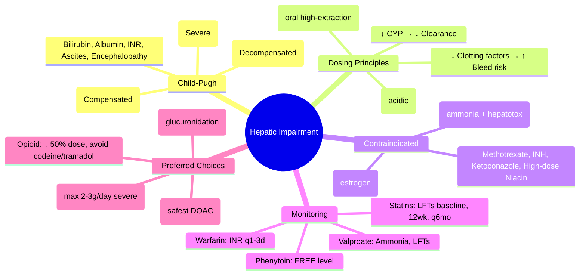

**Status**: `draft` | **Chapter**: 2 — Clinical Therapeutics and Good Prescribing | **Heading**: Prescribing in Special Populations → Hepatic Impairment | **Exam Priority**: ⭐⭐⭐ **HIGH** (Daily clinical use, dosing adjustments, FCPS/MRCP staple)

---

## 1. 1. 🎯 Learning Objectives
- [ ] Calculate Child-Pugh Score (A/B/C)
- [ ] Apply drug dosing adjustments by Child-Pugh class
- [ ] Identify contraindicated drugs in hepatic impairment
- [ ] Recognise drugs requiring monitoring (LFTs, INR, albumin)

---

## 2. 2. 📊 Child-Pugh Classification

| Parameter | **1 Point** | **2 Points** | **3 Points** |
|-----------|-------------|--------------|--------------|
| **Total Bilirubin (μmol/L)** | **<34** | **34–50** | **>50** |
| **Serum Albumin (g/L)** | **>35** | **28–35** | **<28** |
| **INR** | **<1.7** | **1.7–2.3** | **>2.3** |
| **Ascites** | **None** | **Mild / Controlled** | **Moderate–Severe / Refractory** |
| **Encephalopathy** | **None** | **Grade 1–2** | **Grade 3–4** |

| **Class** | **Score** | **Survival (1yr)** | **Survival (2yr)** | **Clinical** |
|-----------|-----------|---------------------|---------------------|--------------|
| **A (Mild)** | **5–6** | **100%** | **85%** | Compensated |
| **B (Moderate)** | **7–9** | **80%** | **60%** | Decompensated |
| **C (Severe)** | **10–15** | **45%** | **35%** | Decompensated |

> **MELD Score** now preferred for transplant listing; **Child-Pugh** still used for drug dosing decisions

---

## 3. 3. ⚖️ Drug Dosing Principles in Hepatic Impairment

| Principle | Application |
|-----------|-------------|
| **↓ First-pass metabolism** → ↑ Bioavailability (oral) | **Propranolol, Morphine, Nitrates, Labetalol, Verapamil, TCAs** — **↓ Oral dose** |
| **↓ CYP metabolism** → ↓ Clearance | **CYP3A4/2C9/2C19/1A2 substrates** — ↓ Dose / ↑ Interval |
| **↓ Albumin** → ↑ Free drug (acidic) | **Warfarin, Phenytoin, Valproate, NSAIDs** — Use **FREE levels**, ↓ dose |
| **↓ Clotting factors** → ↑ Bleeding risk | **Anticoagulants, Antiplatelets, NSAIDs** — Avoid/Monitor closely |
| **↓ Ammonia clearance** | **Valproate** — **CONTRAINDICATED** in active liver disease |
| **Portosystemic shunting** | ↑ Bioavailability of high-extraction drugs |

### 1. Dosing Adjustment by Child-Pugh
| Drug Class | **Child-Pugh A** | **Child-Pugh B** | **Child-Pugh C** |
|------------|------------------|------------------|------------------|
| **CYP3A4 substrates** (Most statins, CCBs, Immunosuppressants, Benzodiazepines) | Standard dose; monitor | **↓ 25–50%** | **↓ 50–75% or AVOID** |
| **CYP2C9 substrates** (Warfarin, Phenytoin, NSAIDs, Sulfonylureas) | Standard; monitor INR/level | **↓ 25–50%**; monitor free | **AVOID if possible** |
| **CYP1A2 substrates** (Theophylline, Clozapine, Duloxetine) | Standard | **↓ 25–50%** | **AVOID** |
| **Low extraction drugs** (Valproate, Phenytoin, Warfarin) | **Monitor FREE levels** | **Monitor FREE levels** | **AVOID** |
| **High extraction drugs** (Propranolol, Morphine, Verapamil, Lidocaine) | **↓ Oral dose** (↑ bioavailability) | **↓ 50%** | **↓ 75% or IV preferred** |
| **Renal + Hepatic** (Metformin, Metformin contraindicated if both) | Caution | **CONTRAINDICATED** | **CONTRAINDICATED** |

---

## 4. 4. 🚫 Contraindicated / Avoid in Hepatic Impairment

| Drug | Reason |
|------|--------|
| **Valproate** | **Inhibits urea cycle → hyperammonaemia; hepatotoxic** — **CONTRAINDICATED in active liver disease** |
| **Methotrexate** | Hepatotoxicity (fibrosis/cirrhosis) — **AVOID** |
| **Isoniazid** | Hepatotoxicity — **AVOID if active liver disease** |
| **Ketoconazole** | Hepatotoxicity — **AVOID** |
| **Halothane** | Hepatitis — historical |
| **Niacin (high dose)** | Hepatotoxicity |
| **Amiodarone** | Hepatotoxicity (steatohepatitis) — **Use with extreme caution** |
| **Statins (Simvastatin, Atorvastatin high dose)** | ↑ Risk myopathy/rhabdomyolysis — **Use low dose, monitor CK** |
| **Oral Contraceptives (Estrogen)** | ↑ Thrombosis, cholestasis — **AVOID** |
| **Danazol** | Peliosis hepatis, adenomas |
| **Methyldopa** | Hepatitis — rare but serious |
| **Carbamazepine** | Hepatitis, enzyme induction — caution |
| **Sulfonamides** | Hypersensitivity hepatitis |

---

## 5. 5. 📋 Drugs Requiring Enhanced Monitoring

| Drug | Monitoring | Adjustment |
|------|------------|------------|
| **Warfarin** | **INR q1–3d** (↓ synthesis of factors, ↓ albumin) | **↓ Dose**; use lowest effective |
| **Phenytoin** | **FREE level** (↓ albumin, ↑ free fraction) | **Use FREE level**; ↓ dose |
| **Valproate** | **Ammonia, LFTs** (hepatotoxicity) | **AVOID in active liver disease** |
| **Carbamazepine** | **LFTs, CBC** (hepatitis, aplastic anaemia) | Caution; monitor |
| **Statins** | **LFTs baseline, 12wks, then q6mo; CK if symptomatic** | Low dose; avoid simvastatin 80mg |
| **Anticoagulants (DOACs)** | **Renal + Hepatic function** | **Apixaban safest** (↓ hepatic metab); avoid rivaroxaban if severe |
| **Benzodiazepines** | Sedation risk | **Lorazepam/Oxazepam preferred** (no CYP, glucuronidation) |
| **Opioids** | **Morphine, Codeine, Tramadol** — ↑ Bioavailability, ↓ clearance | **↓ Dose 50%**, avoid codeine/tramadol (active metabolites) |
| **Paracetamol** | **Standard dose safe** (therapeutic); **Overdose = hepatotoxic** | **Max 2–3g/day** in severe impairment |

---

## 6. 6. 🎯 FCPS/MRCP High-Yield Summary

| Pearl | Details |
|-------|---------|
| **Child-Pugh A** | Score 5–6; Compensated; Standard dosing with monitoring |
| **Child-Pugh B** | Score 7–9; Decompensated; **↓ Dose 25–50%** for CYP substrates |
| **Child-Pugh C** | Score 10–15; Severe; **AVOID most CYP-metabolised drugs** |
| **Valproate** | **CONTRAINDICATED in active liver disease** (hyperammonaemia, hepatotoxicity) |
| **Warfarin** | **INR monitoring q1–3d**; ↓ dose; ↓ albumin → ↑ free |
| **Phenytoin** | **Use FREE level** (↓ albumin → ↑ free fraction) |
| **Benzodiazepines** | **Lorazepam/Oxazepam preferred** (glucuronidation, no CYP) |
| **Opioids** | **Morphine/Codeine/Tramadol** — ↓ dose 50%; ↑ bioavailability |
| **Statins** | **LFTs baseline, 12wks, q6mo**; Low dose; Avoid simva 80mg |
| **Paracetamol** | **Safe at therapeutic dose**; Max 2–3g/day in severe |

---

## 7. 7. ❓ Viva Questions (8)

| Q | Answer |
|---|--------|
| 1. Child-Pugh scoring — 5 parameters? | **Bilirubin, Albumin, INR, Ascites, Encephalopathy** (each 1–3 points) |
| 2. Class A/B/C score ranges? | **A: 5–6, B: 7–9, C: 10–15** |
| 3. Valproate in hepatic impairment — why contraindicated? | **Inhibits carbamoyl phosphate synthetase → hyperammonaemia; Direct hepatotoxicity** |
| 4. Warfarin dosing in cirrhosis? | **↓ Dose**; **INR monitoring q1–3d** (↓ synthesis of factors II, VII, IX, X; ↓ albumin → ↑ free warfarin) |
| 5. Phenytoin monitoring in hypoalbuminaemia? | **Use FREE phenytoin level** (total unreliable; ↓ albumin → ↑ free fraction) |
| 6. Benzodiazepine choice in liver disease? | **Lorazepam or Oxazepam** (glucuronidation only, no CYP metabolism, no active metabolites) |
| 7. Opioid adjustment in liver disease? | **↓ Dose 50%** (morphine, codeine, tramadol — ↑ bioavailability, ↓ clearance); **Avoid codeine/tramadol** (unpredictable active metabolite formation) |
| 8. Paracetamol in severe hepatic impairment? | **Safe at therapeutic dose**; Max **2–3g/day** (avoid >4g); **Antidote for overdose = N-acetylcysteine** |

---

## 8. 8. 🤯 Confusions & Mnemonics

| Confusion | Clarification |
|-----------|---------------|
| **Child-Pugh vs MELD** | **Child-Pugh for drug dosing**; **MELD for transplant listing** |
| **Valproate = contraindicated** | **Active liver disease** — not just elevated LFTs; valproate ↑ ammonia + direct hepatotoxicity |
| **Total vs Free phenytoin** | **Hypoalbuminaemia → use FREE level** (total underestimates active drug) |
| **Lorazepam/Oxazepam safe** | **Glucuronidation** (preserved in liver disease); **No CYP**; **No active metabolites** |
| **Paracetamol safe** | **Therapeutic dose = safe**; **Overdose = hepatotoxic** (GSH depletion) |

**Mnemonics:**
- **"CHILD-PUGH ABC"** = **B**ilirubin, **A**lbumin, **I**NR, **L**iver (Ascites), **D**ementia (Encephalopathy); **Score: A=5-6, B=7-9, C=10-15**
- **"VALPROATE = NO IN LIVER"** = Hyperammonaemia + Hepatotoxicity
- **"WARFARIN LIVER"** = **INR q1-3d, ↓ dose, monitor free**
- **"PHENYTOIN = FREE LEVEL"** = Hypoalbuminaemia → free fraction ↑
- **"BENZO LIVER = LORAZEPAM/OXAZEPAM"** = Glucuronidation, no CYP
- **"OPIOID LIVER = HALF DOSE"** = Morphine/Codeine/Tramadol ↓ 50%
- **"PARACETAMOL = SAFE THERAPEUTIC, TOXIC OVERDOSE"** = Max 2-3g/day in severe

---

## 9. 9. 🧠 Mind Map (Mermaid)

---

## 10. 10. 📅 Spaced Repetition Tracker

| Review | Date | Score | Next |
|--------|------|-------|------|
| 1 | | | 1d |
| 2 | | | 3d |
| 3 | | | 1w |
| 4 | | | 2w |
| 5 | | | 1m |
| 6 | | | 3m |

---

## 11. 11. 🧪 Self-Test Scorecard

| Section | Max | Score |
|---------|-----|-------|
| Child-Pugh scoring | 8 | |
| Dosing principles | 6 | |
| Contraindicated drugs | 6 | |
| Monitoring | 6 | |
| Viva answers | 8 | |
| **Total** | **34** | |

**Target**: ≥27/34 (80%)

---

## 12. 12. 📝 Exam Answer Modes

### 1. Short Question (5 marks): *"Child-Pugh classification and drug dosing principles in hepatic impairment."*
- **Parameters**: Bilirubin, Albumin, INR, Ascites, Encephalopathy (each 1–3 pts)
- **Classes**: A=5–6 (Compensated), B=7–9 (Decompensated), C=10–15 (Severe)
- **Principles**: ↓ First-pass → ↑ bioavailability (oral high-extraction); ↓ CYP → ↓ clearance; ↓ Albumin → ↑ free acid drugs; ↓ Clotting factors → ↑ bleed risk
- **Adjustments**: Child-Pugh B: ↓ CYP substrates 25–50%; Child-Pugh C: Avoid most

### 2. Viva (1 min): *"Patient with Child-Pugh B cirrhosis needs anticoagulation for AF. Options?"*
- **DOAC preferred over warfarin** (no INR monitoring, ↓ bleed risk)
- **Apixaban safest** (↓ hepatic metabolism ~25%, renal ~25%); Dose 2.5mg BD if ≥2 of: age≥80, weight≤60kg, Cr≥133
- **Avoid rivaroxaban** (significant hepatic metabolism)
- **If warfarin**: INR q1–3d, ↓ dose, monitor free warfarin

### 3. Ward Round (30 sec): *"Patient with cirrhosis on valproate for epilepsy. LFTs rising. Action?"*
- **Valproate CONTRAINDICATED in active liver disease** (hepatotoxicity + hyperammonaemia)
- **STOP valproate immediately**
- Switch to **levetiracetam or lamotrigine** (no hepatic metabolism)
- Monitor ammonia, LFTs

### 4. Last-Night Revision (1-liners):
- Child-Pugh: Bilirubin, Albumin, INR, Ascites, Encephalopathy; A=5-6, B=7-9, C=10-15
- Valproate = CONTRAINDICATED in active liver disease
- Warfarin = INR q1-3d, ↓ dose
- Phenytoin = FREE level in hypoalbuminaemia
- Benzo choice = Lorazepam/Oxazepam (glucuronidation)
- Opioids = ↓ 50% dose, avoid codeine/tramadol
- Paracetamol = Safe therapeutic, max 2-3g/day severe

---

## 13. 13. 📚 Summary Card

> **HEPATIC IMPAIRMENT:**
> **CHILD-PUGH**: Bilirubin, Albumin, INR, Ascites, Encephalopathy
> **A=5-6, B=7-9, C=10-15**
> **VALPROATE = CONTRAINDICATED** (ammonia + hepatotox)
> **WARFARIN**: INR q1-3d, ↓ dose
> **PHENYTOIN**: FREE level
> **BENZO**: Lorazepam/Oxazepam (glucuronidation)
> **OPIOIDS**: ↓ 50%, avoid codeine/tramadol
> **PARACETAMOL**: Safe therapeutic (max 2-3g/day severe)
> **STATINS**: LFTs baseline, 12wk, q6mo; low dose
> **DOAC**: Apixaban safest (25% hepatic metab)

---

## 14. 14. ❓ MCQs (10)

1. **Child-Pugh Class B score range:**
   A. 5–6
   B. **7–9** ✓
   C. 10–15
   D. 1–4
   E. 16–18

2. **Valproate in active liver disease:**
   A. Safe with monitoring
   B. **Contraindicated** ✓
   C. Reduce dose 50%
   C. Monitor ammonia only
   E. Safe if albumin normal

3. **Warfarin monitoring in cirrhosis:**
   A. INR weekly
   B. **INR q1–3d** ✓
   C. INR monthly
   D. No INR needed
   E. Use anti-Xa level

4. **Phenytoin in hypoalbuminaemia — which level to use?**
   A. Total phenytoin
   B. **Free phenytoin** ✓
   C. Both total and free
   D. Corrected total only
   E. Saliva level

5. **Benzodiazepine of choice in hepatic impairment:**
   A. Diazepam
   B. **Lorazepam** ✓
   C. Midazolam
   D. Alprazolam
   E. Clonazepam

6. **Opioid dose adjustment in cirrhosis:**
   A. No change
   B. **↓ 50%** ✓
   C. ↑ 50%
   D. ↑ 100%
   E. Avoid all opioids

7. **Paracetamol in severe hepatic impairment — max daily dose:**
   A. 4g
   B. **2–3g** ✓
   C. 1g
   D. 500mg
   E. Contraindicated

8. **DOAC safest in hepatic impairment:**
   A. Dabigatran
   B. Rivaroxaban
   C. **Apixaban** ✓
   D. Edoxaban
   E. All equal

9. **Statins monitoring in liver disease:**
   A. No monitoring needed
   B. **LFTs baseline, 12 weeks, then q6mo** ✓
   C. LFTs monthly
   D. CK only
   E. LFTs only if symptomatic

10. **Valproate hepatotoxicity mechanism:**
    A. Immune-mediated
    B. **Mitochondrial toxicity (β-oxidation inhibition) + Hyperammonaemia (CPS1 inhibition)** ✓
    C. Bile duct injury
    D. Hypersensitivity
    E. Steatosis only

---

## 15. 15. 🃏 Flashcards (Anki-ready)

| Front | Back |
|-------|------|
| Child-Pugh parameters | Bilirubin, Albumin, INR, Ascites, Encephalopathy |
| Child-Pugh A | 5–6 (Compensated) |
| Child-Pugh B | 7–9 (Decompensated) |
| Child-Pugh C | 10–15 (Severe) |
| Valproate in liver disease | CONTRAINDICATED (hyperammonaemia + hepatotoxicity) |
| Warfarin in cirrhosis | INR q1-3d, ↓ dose |
| Phenytoin in hypoalbuminaemia | FREE level |
| Benzo in liver disease | Lorazepam, Oxazepam (glucuronidation) |
| Opioid in cirrhosis | ↓ 50% dose, avoid codeine/tramadol |
| Paracetamol in severe liver | Safe therapeutic, max 2-3g/day |
| DOAC in liver disease | Apixaban safest (25% hepatic metab) |
| Statin monitoring | LFTs baseline, 12wk, q6mo; low dose |

---

## 16. 16. ✅ Answer Keys

### 1. MCQs
1. **B** — 7–9
2. **B** — Contraindicated
3. **B** — INR q1–3d
4. **B** — Free phenytoin
5. **B** — Lorazepam
6. **B** — ↓ 50%
7. **B** — 2–3g
8. **C** — Apixaban
9. **B** — LFTs baseline, 12wk, q6mo
10. **B** — Mitochondrial toxicity + hyperammonaemia

---

*File: `/mnt/tb/Medicine/Clinical Therapeutics and Good Prescribing/Special Populations/Hepatic impairment.md` | Status: `draft` → upgrade after review*
